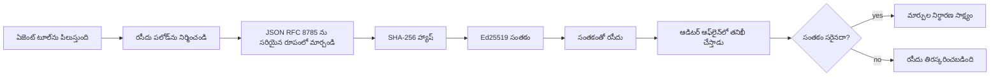
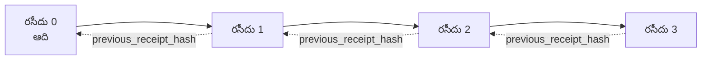

[పాఠం వీడియోను వీక్షించండి: గోప్యరహిత రసీదులతో AI ఏజెంట్లు సురక్షితం చేయడం](https://youtu.be/PLACEHOLDER_VIDEO_ID)

> _(పాఠం వీడియో మరియు థంబ్నెయిల్‌ను మైక్రోసాఫ్ట్ కంటెంట్ టీమ్ మર્જ్ తర్వాత జోడిస్తుంది, పాఠం 14 / 15 నమూనాకు అనుగుణంగా.)_

# గోప్యరహిత రసీదులతో AI ఏజెంట్లను సురక్షితం చేయడం

## పరిచయం

ఈ పాఠం కింద బోధించే అంశాలు:

- కంప్లయన్స్కు, బగ్ తొలగింపుకు మరియు నమ్మకానికి AI ఏజెంట్ల ఆడిట్ ట్రెయిల్‌లు ఎందుకు అవసరం.
- గోప్యరహిత రసీదు అంటే ఏమిటి మరియు అది సంతకం కాని లాగ్ లైన్ నుండి ఎలా భిన్నంగా ఉంటుంది.
- Plain Python లో ఏజెంట్ టూల్ కాల్ కోసం సంతకం చేసిన రసీదును ఎలా తయారు చేయాలో.
- రసీదును ఆఫ్‌లైన్‌లో ఎలా ధృవీకరించాలి మరియు మోసాన్ని ఎలా గుర్తించాలి.
- ఒకటి తీసివేయడం లేదా మళ్లీ క్రమం మార్చడం ద్వారా చైన్ ఎలా తిరగబడుతుంది.
- రసీదులు ఏమి నిరూపిస్తాయి మరియు అవి స్పష్టంగా ఏమి నిరూపించరు.

## నేర్చుకునే లక్ష్యాలు

ఈ పాఠం పూర్తయిన తర్వాత, మీరు తెలుసుకుంటారు:

- ఏజెంట్ చర్యలకు గోప్యరహిత మూలాన్ని ప్రేరేపించే విఫలమయ్యే మోడ్‌లను గుర్తించడం.
- ఒక సంతకం చేసిన Ed25519 రసీదును కెనానికల్ JSON పేపలోడ్ పై తయారు చేయడం.
- సంతకం చేసిన రసీదును స్వతంత్రంగా వేరే ఎవరూ విశ్వసించకుండా, కేవలం సంతకం దాత పబ్లిక్ కీ ఉపయోగించి ఎలా ధృవీకరించాలి.
- మార్పులు చేయబడిన రసీదుపై తిరిగి ధృవీకరణ చేసే సమయంలో మోసాన్ని ఎలా గుర్తించాలి.
- హాష్-చెయిన్ చేయబడిన రసీదుల సారి ఎలా తయారు చేయాలి మరియు చైన్ ఎందుకు అవసరమో వివరించడం.
- రసీదులు ఏమి నిరూపిస్తాయో (అట్రిబ్యూషన్, ఇంటిగ్రిటీ, క్రమం) మరియు అవి ఏమి నిరూపించవు (చర్య సరైనదిగా ఉందన్నది, పాలసీ శ్రేణి సరైనదని).

## సమస్య: మీ ఏజెంట్ ఆడిట్ ట్రెయిల్

మీరు Contoso ట్రావెల్ కోసం ఒక AI ఏజెంట్‌ను అమలు చేసినట్టు ఊహించండి. ఏజెంట్ కస్టమర్ అభ్యర్థనలను చదువుతుంది, ఫ్లైట్స్ API ని పిలిచి ఎంపికలను చూస్తుంది, మరియు కస్టమర్ పక్కన సీట్లు బుక్ చేస్తుంది. గత త్రైమాసికంలో 50,000 బుకింగ్‌లు ప్రాసెస్ చేసాయి.

ఈరోజు ఒక ఆడిటర్ వచ్చారు. వారు ఒక సులభమైన ప్రశ్న అడుగుతారు: "మీ ఏజెంట్ ఏమి చేశిందో చూపించండి."

మీరు మీ లాగ్ ఫైళ్ళను అందించవచ్చు. ఆడిటర్ వాటిని చూస్తారు మరియు కఠినమైన ప్రశ్న అడుగుతారు: "నేను ఎలా తెలుసుకుంటాను ఈ లాగ్‌లు మార్చబడలేదు?"

ఇదే ఆడిట్-ట్రెయిల్ సమస్య. నేడు చాలా ఏజెంట్ అమలులో ఆధారపడుతూ ఉంటారు:

- **అప్లికేషన్ లాగ్‌లు**: ఏజెంట్ స్వయంగా వ్రాసినవి, ఫైల్ సిస్టమ్ యాక్సెస్ ఉన్న ఎవరైనా సవరించగలులు.
- **క్లౌడ్ లాగింగ్ సేవలు**: ప్లాట్‌ఫారం స్థాయిలో మోసం బయటపడుతుంది, కానీ ఆడిటర్ ప్లాట్‌ఫారం ఆపరేటర్‌ను విశ్వసిస్తే మాత్రమే.
- **డేటాబేస్ ట్రాన్సాక్షన్ లాగ్‌లు**: డేటాబేస్ మార్పులకు తగినవి కానీ సాధారణ టూల్ కాల్స్ కి కాదు.

ఈ వాటిలో ఎటువంటి విషయం అందరూ విశ్వసించకుండా ఆడిటర్ ప్రశ్నకు సమాధానం చెప్పలేరు (మీరైతే, మీ క్లౌడ్ ప్రొవైడర్, డేటాబేస్ విక్రేత). ఆంతర్యిక ప్రయోజనాల కోసం ఈ నమ్మకం సాధారణంగా సరిపోతుంది. నియంత్రణ విధులకు (ఫైనాన్స్, ఆరోగ్యం, EU AI చట్టం వర్తించే ఏదైనా) ఇది సరిపోదు.

గోప్యరహిత రసీదులు ప్రతి ఏజెంట్ చర్యను స్వతంత్రంగా ధృవీకరించదగినవి చేస్తాయి. ఆడిటర్ మీపై ఆధారపడడానికి అవసరం లేదు. వారికి కేవలం మీ పబ్లిక్ కీ మరియు ఆ రసీదు కావాలి.

## గోప్యరహిత రసీదు అంటే ఏమిటి?

ఒక రసీదు అనేది ఏజెంట్ ఏమి చేశుందో రికార్డ్ చేసే JSON ఆబ్జెక్ట్, అది డిజిటల్ సంతకం తో సంతకించబడింది.



చాలా తక్కువ రసీదు ఈ విధంగా ఉంటుంది:

```json
{
  "type": "agent.tool_call.v1",
  "agent_id": "contoso-travel-bot",
  "tool_name": "lookup_flights",
  "tool_args_hash": "sha256:a3f9c1...",
  "result_hash": "sha256:7b2e1d...",
  "policy_id": "contoso-travel-policy-v3",
  "timestamp": "2026-04-25T14:30:00Z",
  "sequence": 47,
  "previous_receipt_hash": "sha256:9d4e6a...",
  "signature": {
    "alg": "EdDSA",
    "sig": "c5af83...",
    "public_key": "8f3b2c..."
  }
}
```

మూడు లక్షణాలు పని చేస్తున్నారు:

1. **సంతకం**. రసీదు ఏజెంట్ గేట్వే ద్వారా Ed25519 ప్రైవేట్ కీ తో సంతకం చేయబడుతుంది. సంబంధిత పబ్లిక్ కీ ఉన్న వాడు ఆ సంతకాన్ని ఆఫ్‌లైన్ లో ధృవీకరించగలడు. ఏ ఫీల్డ్‌లో అయినా మార్పు సంతకాన్ని చెలామణీ చేయదు.

2. **కెనానికల్ ఎంకోడింగ్**. సంతకం చేయడానికి ముందు, రసీదును JSON కెనానికలైజేషన్ స్కీమ్ (JCS, RFC 8785) ఉపయోగించి సీరియలైజ్ చేస్తారు. ఇది ఒక మంచి అమలు రెండు సార్లు అదే లాజికల్ రసీదు ఇస్తే బైట్స్ పరంగా ఒకటే అవుతుందని నిర్ధారిస్తుంది. కెనానికలైజేషన్ లేకుంటే, వేర్వేరు JSON సీరియలైజర్ లు ఒకే కంటెంట్ పై వేరు సంతకాలు ఇస్తాయి.

3. **హాష్ చెయినింగ్**. `previous_receipt_hash` ఫీల్డ్ ప్రతి రసీదును తనకు మునుపటి రసీదు కి లింక్ చేస్తుంది. ఒక రసీదును తీసివేయడం లేదా క్రమాన్ని మార్చడం తర్వాతి అన్ని రసీదుల చైన్ ని బద్దలుపరుస్తుంది. వ్యక్తిగత సంతకాలు తప్పించుకున్నా కూడా, మోసం చైన్ స్థాయిలో కనపడుతుంది.

ఈ లక్షణాల ద్వారా তিন రకాల హామీలు వస్తాయి:

- **అట్రిబ్యూషన్**: ఈ కీ ఈ కంటెంట్ పై సంతకం చేసింది.
- **ఇంటిగ్రిటీ**: సంతకం చేసినప్పటి నుండి కంటెంట్ మారలేదు.
- **క్రమం**: ఈ రసీదు ఆ రసీదు తర్వాత చైన్ లో వచ్చింది.

## Python లో రసీదు తయారు చేయడం

ఒక రసీదు తయారుచేయడానికి ప్రత్యేక లైబ్రరీ అవసరం లేదు. గోప్యరహిత ప్రిమిటివ్స్ (ప్రాథమిక పనులు) విస్తృతంగా అందుబాటులో ఉన్నాయి మరియు లాజిక్ కొద్దిగా Python కోడ్ మాత్రమే.

`code_samples/18-signed-receipts.ipynb` లో ప్రాక్టికల్ వ్యాయామాలు మొత్తం ప్రాసెస్ ను చూపిస్తాయి. సంక్షిప్త సారాంశం:

```python
import json
import hashlib
import base64
from nacl import signing
from jcs import canonicalize  # RFC 8785 క్యానానికల్ JSON

def b64url_nopad(data: bytes) -> str:
    return base64.urlsafe_b64encode(data).decode("ascii").rstrip("=")

def sha256_canonical(obj) -> str:
    """SHA-256 of a Python object's JCS-canonical JSON form."""
    return f"sha256:{hashlib.sha256(canonicalize(obj)).hexdigest()}"

# సంతకం కీని ఉత్పత్తి చేయండి లేదా లోడ్ చేయండి (ఉత్పత్తిలో, కీ వాల్ట్‌లో నిల్వ చేయండి)
signing_key = signing.SigningKey.generate()
verify_key = signing_key.verify_key

# రసీదు పేలలోడ్‌ను సృష్టించండి (ఇప్పటికీ సంతకం లేదు)
tool_args = {"origin": "SYD", "destination": "LAX"}
tool_result = [{"flight": "QF11", "price": 1850, "stops": 0}]

payload = {
    "type": "agent.tool_call.v1",
    "agent_id": "contoso-travel-bot",
    "tool_name": "lookup_flights",
    "tool_args_hash": sha256_canonical(tool_args),
    "result_hash": sha256_canonical(tool_result),
    "policy_id": "contoso-travel-policy-v3",
    "timestamp": "2026-04-25T14:30:00Z",
    "sequence": 0,
    "previous_receipt_hash": None,
}

# క్యానానికలైజ్ చేసి, హాష్ చేసి, సంతకం చేయండి.
canonical_bytes = canonicalize(payload)
message_hash = hashlib.sha256(canonical_bytes).digest()
signature_bytes = signing_key.sign(message_hash).signature

# ఒక კონస్ట్రక్చర్డ్ సంతకం ఆబ్జెక్టును జతచేయండి.
receipt = {
    **payload,
    "signature": {
        "alg": "EdDSA",
        "sig": b64url_nopad(signature_bytes),
        "public_key": b64url_nopad(bytes(verify_key)),
    },
}
```

ఇదే మొత్తం సంతక ప్రక్రియ. నోట్‌బుక్ ఆ ఉదాహరణలు ప్రతి దశను చూపిస్తాయి.

## రసీదును ధృవీకరించి మోసాన్ని గుర్తించడం

ధృవీకరణ ఒకించిన చర్య:

```python
import base64
import hashlib
from nacl import signing
from nacl.exceptions import BadSignatureError
from jcs import canonicalize

def b64url_decode(s: str) -> bytes:
    padding = "=" * ((4 - len(s) % 4) % 4)
    return base64.urlsafe_b64decode(s + padding)

def verify_receipt(receipt: dict) -> bool:
    # సంతకం ఒక నిర్మిత ఆబ్జెక్టు: {"alg", "sig", "public_key"}.
    sig_obj = receipt.get("signature")
    if not sig_obj or sig_obj.get("alg") != "EdDSA":
        return False

    # నిజంగా సంతకం చేయబడిన పేలोड్‌ను మళ్లీ నిర్మించండి (సంతకానికి తప్ప అన్ని).
    payload = {k: v for k, v in receipt.items() if k != "signature"}

    canonical_bytes = canonicalize(payload)
    message_hash = hashlib.sha256(canonical_bytes).digest()

    try:
        verify_key = signing.VerifyKey(b64url_decode(sig_obj["public_key"]))
        verify_key.verify(message_hash, b64url_decode(sig_obj["sig"]))
        return True
    except BadSignatureError:
        return False
```

ఈ ఫంక్షన్ ఒక రసీదు తీసుకుని సంతకం సరియైనదిగా ఉంటే `True` ఇస్తుంది, కాదంటే `False`. నెట్‌వర్క్ కాల్ అవసరం లేదు, సేవ ఆధారపడవలసినదేమీ లేదు, గూడ ఆడిటర్ ఏకైక పబ్లిక్ కీ తో ధృవీకరించగలడు.

మోస గుర్తింపు ఆచరణాత్మకంగా చూపించేందుకు, నోట్‌బుక్ ఇలా చేస్తుంది:

1. చెలామణీ అయ్యే రసీదును తయారుచేయడం మరియు ధృవీకరణ కుదిరితే నిర్ధారించడం.
2. `tool_args_hash` ఫీల్డ్ లో ఒక బైట్ మార్చడం.
3. తిరిగి ధృవీకరణ చేసి అపజయాన్ని చూడటం.

ఇది రసీదులు మోసం బయటపడుతాయన్న ప్రాత्यक्षిక నిరూపణ: చిన్నగా అయినా ఏదైనా మార్పు సంతకాన్ని చెడబరుస్తుంది.

## బహుళ దశల ఏజెంట్ల కోసం రసీదులను చెయినింగ్ చేయడం

ఒక్క సంతకం చేసిన రసీదు ఒక చర్యకి రక్షణ ఇస్తుంది. రసీదుల సారి ఒక క్రమం రక్షిస్తుంది.



ప్రతి రసీదు తనకు ముందు ఉన్న రసీదు యొక్క హాష్ రికార్డు చేస్తుంది. రెండవ రసీదును మౌనం గా తీసివేయాలంటే, దాడి చెయ్యేవాడు:

- తృతీయ రసీదులో `previous_receipt_hash` ఫీల్డ్ మార్చాలి (ఇది 3 వ రసీదు యొక్క సంతకాన్ని చెడు చేస్తుంది), లేదా
- మార్చబడిన 3 వ రసీదు పై కొత్త సంతకాన్ని కట్టాలి (ఏజెంట్ ప్రైవేట్ కీ అవసరం).

ప్రైవేట్ కీ హార్డ్‌వేర్ కీ వాల్ట్ లో ఉంటే మరియు మీరు ప్రతి రసీదుతో పబ్లిక్ కీని ప్రచురిస్తే, ఈ దాడులు లేక గుర్తించకుండా సాధ్యం కాదు.

నోట్‌బుక్ ఇలా చెయ్యడం చూపిస్తుంది:

1. మూడు రసీదుల చైన్ తయారు చేయడం.
2. ప్రతి రసీదు యొక్క `previous_receipt_hash` నిజమైన మునుపటి రసీదు హాష్ తో సరిపోతుందో ధృవీకరించడం.
3. మధ్యలో ఒక రసీదును మోసపరచి చైన్ విరగడం చూడటం.

ఈ విధంగా మీరు మీపై ఆధారపడకుండా బాహ్య ఆడిటర్ ధృవీకరించగలిగే ఆడిట్ ట్రైల్ తయారు చేస్తారు.

## రసీదులు ఏమి నిరూపిస్తాయి (మరియు ఏమి నిరూపించవు)

ఇది ఈ పాఠంలో అత్యంత ముఖ్యమైన విభాగం. రసీదులు శక్తివంతమైనవి కానీ వారి శక్తి పరిమితం.

**రసీదులు మూడు విషయాలు నిరూపిస్తాయి:**

1. **అట్రిబ్యూషన్**: ఒక నిర్దిష్ట కీ ఒక నిర్దిష్ట పేపలోడ్ పై సంతకం చేసింది.
2. **ఇంటిగ్రిటీ**: పేపలోడ్ సంతకం నుండి మారలేదు.
3. **క్రమం**: ఈ రసీదు ఆ రసీదు తర్వాత చైన్ లో వచ్చింది.

**రసీదులు నిరూపించవు:**

1. **సరైనత**: ఏజెంట్ చర్య సరైనదైతే. తప్పు సమాధానానికి కూడా రసీదు సంతకం చేయవచ్చు.
2. **పాలసీ అనుసరణ**: `policy_id` లో ఉన్న పాలసీ నిజంగా అమలు చేయబడిందా లేదా ఇదే చర్యకు అనుమతిస్తుందా కాదా అన్నది. రసీదు ఏమి కావాలని వాదించిందో మాత్రమే రికార్డ్ చేస్తుంది, ఏమి అమలు చేయబడిందంటే కాదు.
3. **కీకి మించి గుర్తింపు**: రసీదు "ఈ కీ ఈ కంటెంట్ సంతకం చేసింది" అని చెబుతుంది. "ఈ మనిషి ఆమోదించారా" అని కాదు. కీని వ్యక్తి లేదా సంస్థతో అనుసంధానం చేయడానికి వేరే గుర్తింపు వ్యవస్థ (డైరెక్టరీ, పబ్లిక్ కీ రిజిస్ట్రి) అవసరం.
4. **ఇన్పుట్ల నిజాయితీ**: ఏజెంట్ మోసపూరిత ప్రాంప్ట్ అందుకొని చర్య చేపట్టినప్పటికీ, రసీదు ఆ చర్యను నిజంగా రికార్డు చేస్తుంది. రసీదులు ఇన్పుట్ ధృవీకరణ కన్నా తర్వాత వస్తాయి, ప్రత్యామ్నాయం కాదు.

ఈ సరిహద్దు రెండు కారణాలకి ముఖ్యం:

- రసీదులు ఏం ఉపయోగపడతాయో చెప్పుతుంది: ఏజెంట్ ప్రవర్తన ఆడిట్ చేయదగిన, మోసం కనిపించేలా చేయడం, సంస్థా గడుల దాటి కూడా.
- మీరు ఇంకా ఏ అదనపు పూతలు అవసరమో చెప్పుతుంది: ఇన్పుట్ ధృవీకరణ (పాఠం 6), పాలసీ అమలు (కింద సంక్షిప్తంగా చర్చించబడింది), గుర్తింపు వ్యవస్థ.

సాధారణ తప్పు "మాకు రసీదులు ఉన్నాయి" అంటే "మేము పాలించబడుతున్నాం" అనుకోవడం. ఇది కాదు. రసీదులు పునాది. పాలన మీరు నిర్మించేది.

## ఒక మనిషి గానూ నిర్ధారించిన చర్యను నిరూపించడం

3వ అంశం ప్రత్యేక విభాగానికి తగినది: ఒక చర్య రసీదు "ఈ కీ ఈ కంటెంట్ సంతకం చేసింది" అని చెబుతుంది, "ఒక మనిషి ఆమోదించింది" అని కాదు. అధిక ప్రమాద చర్యలకు (రిఫండ్‌లు, తొలగింపులు, వైర్ బదిలీలు) పాలనా వ్యవస్థలు ఆ మిస్సింగ్ ప్రకటనను ఎక్కువగా కోరుతున్నాయి, మరియు మీరు ఈ పాఠంలో ఇప్పటికే నిర్మించిన ప్రిమిటివ్స్ తో తయారు చేయవచ్చు.

తదుపరి నోట్‌బుక్ `code_samples/human-authorization-receipts.ipynb` రెండవ రసీదు రకాన్ని `human.approval.v1` జోడిస్తుంది, పాఠంలోని రసీదుల వంటి ఆకారంలో (టైప్ చేసిన పేపలోడ్, Ed25519 సంతకంతో దాని కెనానికల్ SHA-256 పై, `signature` ఆబ్జెక్ట్ సంతక bytes వెలుపల). ఒక పేరు ఉన్న ఆమోదదారు పూర్తి కెనానికల్ చర్య మరియు దాని డైజెస్ట్‌ను సంతకం చేస్తారు; ఏజెంట్ చర్య రసీదు కూడా అదే చర్య డైజెస్ట్ మరియు `parent_approval_ref` కలిగి ఉంటుంది, ఆ ఆమోదం యొక్క `receipt_hash`, మీరు పైగా తయారు చేసిన చైన్ లో `previous_receipt_hash` పద్ధతి వంటి. ఒక `verify_chain` ఇరువురు ఆర్టిఫాక్ట్స్ ను వేరే పిన్ చేసిన కీ రిజిస్ట్రిల కింద పరిశీలిస్తుంది (ఆమోదదారి కీలు వర్సెస్ ఏజెంట్ కీలు), కాబట్టి కోడ్ మార్గం భాగస్వామ్యం అయినా, అధికారాలు ఏం పంచుకోవు.

దీని గుణత లక్షణం జాగ్రత్తగా చెప్పబడింది: *మనిషి ఈ ఖచ్చిత చర్యను ఆమోదించాడు, ఏజెంట్ అదే ఆమోదిత చర్యను అమలు చేసేది.* నోట్‌బుక్ నిరాకరణ ఫిక్సర్లు ఈ గుణతను వాస్తవంగా చేస్తాయి, కేవలం వాదించటం కాదు:

- సాంప్రదాయ సెట్: మోసం, కంఫ్యూజ్డ్ డిప్యూటీ, రిప్లే, forged కీలు రెండు వైపులా, తప్పు ఇన్పుట్;
- **ధ్రువీకరణ అధికారం పాతది**: సంతకం ఇంకా ధృవీకరిస్తుంది కానీ ఏదో కారణం వల్ల నిరాకరించబడింది, పాలసీ వెర్షన్ మారింది, ఆమోదదారు కీ రిజిస్ట్రి నుండి తొలగించబడింది లేదా ఆమోదం అమలు కన్నా ముందు గడువు అయింది;
- **డైజెస్ట్ మార్పు**: చెలామణీ అయ్యే సంతకం అయిన చర్య రసీదు చెప్పిన నిజమైన ఆమోదం వేరే కెనానికల్ చర్యకి సంబంధించింది.

ప్రతి విఫలత యందు వేరు కారణం ఉంటుంది, కాబట్టి ఆడిటర్ నిరాకరణ చదివినప్పుడు అధికారం పాతదైనా, అమలు చేసిన చర్య మారిపోయిందో తెలుసుకోవచ్చు. నోట్‌బుక్ నేర్చిన నియమం: సంతకం చేసిన ఆమోదమే అనధికారికత కాదు. అధికారము ఉంటుందంటే రెండు రసీదులు అమలు సమయంలో అదే కెనానికల్ చర్యతో బంధించబడినప్పుడు మాత్రమే. ఈ పాఠంలో పాటించే ఇంటర్నెట్-డ్రాఫ్ట్ (`draft-farley-acta-signed-receipts`) లోని కో-సంతకం మార్గం ఈ నమూనా యొక్క ప్రమాణపు మార్గం.

## ఉత్పత్తి సూచనలు

ఈ పాఠంలోని Python కోడ్ సంయమనం గలదిగా ఉంటుంది మీకు ప్రతి లైన్ ను చదవడం మరియు ఏమి జరుగుతుందో అర్థం చేసుకోవడానికి. ఉత్పత్తిలో, మీకు రెండు ఎంపికలు ఉంటాయి:

1. **నేరుగా గోప్యరహిత ప్రిమిటివ్స్‌పై నిర్మించండి.** మీరు పైగా చూసిన 50 లైన్లు చాలా ఉపయోగాలకి బాగా సరిపోతాయి. PyNaCl (Ed25519) మరియు `jcs` ప్యాకేజీ (కెనానికల్ JSON) మంచి-పరిచర్య మరియు ఆడిట్ చేసిన లైబ్రరీలు.

2. **ఉత్పత్తి రసీదు లైబ్రరీ ఉపయోగించండి.** కొన్ని ఓపెన్-సోర్స్ ప్రాజెక్టులు అదనపు ఫీచర్లతో (కీ రొటేషన్, బ్యాచ్ ధృవీకరణ, JWK సెట్ పంపిణీ, పాలసీ ఇంజిన్‌లతో సమీಕರಣ) ఇదే నమూనా అమలు చేస్తున్నాయి:
   - ఈ పాఠం లో ఉపయోగించిన రసీదు ఫార్మాట్ IETF ఇంటర్నెట్-డ్రాఫ్ట్ ([`draft-farley-acta-signed-receipts`](https://datatracker.ietf.org/doc/draft-farley-acta-signed-receipts/), సంస్కరణ 02) స్టాండర్డుల ప్రక్రియలో ఉంది, మరియు భాగస్వామ్య అనుగుణత సూట్ ([agent-governance-testvectors](https://github.com/ScopeBlind/agent-governance-testvectors)) తో స్వతంత్ర అమలులు బైట్స్ పరంగా సమానమైన అవుట్పుట్ ధృవీకరిస్తాయి.
   - Microsoft Agent Governance Toolkit Cedar ఆధారిత పాలసీ నిర్ణయాలతో రసీదులను సంయుక్తం చేస్తుంది; ఆ రిపోలో ట్యుటోరియల్ 33 లో పూర్తి ఉదాహరణ చూడండి.
   - `protect-mcp` (npm) మరియు `@veritasacta/verify` (npm) ప్యాకేజీలు నోడ్-ఆధారిత రసీదు సంతకం మరియు ఆఫ్‌లైన్ ధృవీకరణను అందిస్తాయి, ఎటువంటి MCP సర్వర్ కు టాంపర్-ఎవిడెంట్ ఆడిట్ ట్రైల్లో బిగించడం, అలాగే ఒక ఆపాత చర్య ఆమోద రసీదు జారీ చేసే హోల్డ్-ఫర్-కో-సైన్ ఫ్లో కలిగి ఉంది (డెస్క్‌టాప్ ఫ్లోలో WebAuthn ఆధారిత), ఇది పై మానవ-ఆమోద నోట్‌బుక్ లోని ఆమోద-రసీదు పద్ధతికి లోపలి అనుకరణ.
   - **[nobulex](https://github.com/arian-gogani/nobulex)** Python SDK (`pip install nobulex`) Python లో అదే Ed25519 + JCS సంతక నమూనాను LangChain మరియు CrewAI సమీకరణలతో అందిస్తుంది, ప్రచురిత క్రాస్-వాలిడేషన్ టెస్ట్ వెక్టర్లు మరియు [OWASP PR #2210](https://github.com/OWASP/CheatSheetSeries/pull/2210) ద్వారా బీమా మ్యాపింగ్ తో.

మీ సొంత JWT లైబ్రరీను రాయడం లేదా పరీక్షించబడిన JWT లైబ్రరీ ఉపయోగించడం మధ్య ఎంపిక ఇది మాదిరిగానే ఉంటుంది: రెండూ సరైనవి; లైబ్రరీ సేపు ఆదా చేస్తుంది మరియు ఆడిట్ విస్తీర్ణం తగ్గిస్తుంది; సొంతం నిర్మించడం ప్రతి ప్రిమిటివ్ ను అర్థం చేసుకోవడానికి సహాయం చేస్తుంది. ఈ పాఠం సొంతం నిర్మించే మార్గాన్ని నేర్పుతుంది కాబట్టి మీరు రెండు ఎంపికలకు కూడా ఆధారం పొందుతారు.

## జ్ఞానం పరీక్ష

ప్రాక్టీస్ వ్యాయామానికి ముందు మీ అర్థం తెలుసుకోండి.

**1. రసీదు ఏజెంట్ ప్రైవేట్ Ed25519 కీతో సంతకమవుతుంది. ఆడిటర్ కేవలం పబ్లిక్ కీ కలిగి ఉంటాడు. ఆడిటర్ ఆ రసీదును ఆఫ్‌లైన్ లో ధృవీకరించగలడా?**

<details>
<summary>సమాధానం</summary>

అవును. Ed25519 ధృవీకరణకు కేవలం పబ్లిక్ కీ మరియు సంతకం చేసిన బైట్లే అవసరం. నెట్‌వర్క్ కాల్ లేదు, సేవ ఆధారపడదు. ఇది రసీదులను ఎయిర్-గ్యాప్, బహుళ సంస్ధల, లేదా తక్కువ నమ్మక ఆడిట్ సెట్టింగుల్లో ఉపయోగించే లక్షణం.
</details>

**2. దాడి చెయ్యేవాడు ఒక రసీదులోని `policy_id` ఫీల్డ్ ను మార్చి అది మరింత అనుమతించే పాలసీ కింద ఉందని వాదిస్తాడు. సంతకం అసలు పేప్లోడ్ పై ఉంది. ధృవీకరణ సమయంలో ఏమిటి జరుగుతుంది?**

<details>
<summary>సమాధానం</summary>


ధృవీకరణ విఫలమవుతోంది. సంతకం అసలు పేలోడ్ యొక్క కానానికల్ బైట్ల పై లెక్కించబడింది; ఏ భేదాన్నైనా మార్పు కానానికల్ బైట్లను మార్చుతుంది, ఇది SHA-256 హాష్‌ను మార్చుతుంది, తద్వారా సంతకం చెల్లనిది అవుతుంది. దాడి చేసే వారు తాజా చెల్లుబాటు అయ్యే సంతకాన్ని ఉత్పత్తి చేయడానికి ప్రైవేట్ కీ అవసరం, అది వారి వద్ద లేదు.
</details>

**3. రసీదు `tool_args_hash` మరియు `result_hash` ని ముడి ఆర్గ్యుమెంట్లు మరియు ఫలితానికి బదులు ఎందుకు కలిగి ఉంది?**

<details>
<summary>సమాధానం</summary>

రెండు కారణాలు. మొదటి, రసీదును ఆర్కైవ్ చేయాల్సిమొదలగానే లేదా ముడి కంటెంట్ (PII, వ్యాపార డేటా) బయటపడటం సమస్యగా ఉండే పరిసరాల్లో ప్రసారం చేయాల్సి ఉంటుంది. హాషింగ్ రసీదును చిన్నదిగా మరియు కంటెంట్‌ను ప్రైవేట్‌గా ఉంచుతుంది; ఆడిటర్ హాష్ నిజమైన కంటెంట్ యొక్క వేరుగా నిల్వ చేసిన కాపీకి సరిపోతుందో లేదో ధృవీకరిస్తారు. రెండవది, హాష్‌లకు స్థిర పరిమాణం ఉంటుంది; హాష్‌లతో కూడిన రసీదు, ఇన్‌పుట్లు మరియు అవుట్‌పుట్లు ఎంత పెద్దగా ఉన్నా పరిమితి పరిమాణంలో ఉంటుంది.
</details>

**4. `previous_receipt_hash` ఫీల్డ్ ప్రతి రసీదును దాని మునుపటి రసీదుతో లింక్ చేస్తుంది. ఒక దాడి చేసే వ్యక్తి శృంఖల మధ్యలో ఒక రసీదును నిశ్శబ్దంగా తీసివేస్తే ఏమి చెల్లనిది అవుతుంది?**

<details>
<summary>సమాధానం</summary>

తీసివేయబడిన రసీదుకు తర్వత వచ్చిన ప్రతి రసీదు. వారి `previous_receipt_hash` ఫీల్డులు అసలు శృంఖలతో సరిపోలవు (వారు సూచించిన రసీదు ఇక లేదు, లేదా శృంఖల ఇప్పుడు వేరే మునుపటి రసీదుకు చూపుతోంది). తీసివేతను దాచడానికి, దాడి దారుడు ప్రతి తరువాత రసీదును తిరిగి సంతకం చేయాలి, దీనికీ ప్రైవేట్ కీ అవసరం.
</details>

**5. ఒక రసీదు సాఫీగా వెరిఫై అవుతుంది. అర్థం ఏంటి? ఏజెంట్ చర్య సరైనది, శబ్దమైనది లేదా విధానానుసారమైనది అని అది నిరూపించగలదా?**

<details>
<summary>సమాధానం</summary>

లేదు. చెల్లుబాటు అయ్యే రసీదు మూడు విషయాలని నిరూపిస్తుంది: కేటాయింపు (ఈ కీ ఈ కంటెంట్‌ను సంతకం చేసింది), సమగ్రమైనత (కంటెంట్ మార్చబడలేదు), మరియు ఆర్డరింగ్ (ఈ రసీదు ఆ రసీదుకి తర్వత వచ్చినది). అది చర్య సరైనది అని, `policy_id` లో పేరుపరచబడిన విధానం నిజంగా మూల్యాంకనం చేయబడిందని, లేదా ఏజెంట్ ప్రతి నియమాన్ని అనుసరించిందని నిరూపించదు. రసీదులు ఏజెంట్ ప్రవర్తనను ఆడిటబుల్‌గా చేస్తాయి, తప్ప తప్పనిసరి గా సరైనది కాదు. ఇది ఈ పాఠంలో అత్యంత ముఖ్యమైన పరిమితి.
</details>

## ప్రాక్టీస్ వ్యాయామం

`code_samples/18-signed-receipts.ipynb` ను తెరవండి మరియు నాలుగు విభాగాలలో అందుబాటులో ఉన్నవన్నీ పూర్తి చేయండి:

1. **విభాగం 1**: మీ మొదటి రసీదును సంతకం చేసి ధృవీకరించండి.
2. **విభాగం 2**: రసీదుతో చట్టవిరుద్ధంగా మార్పులు చేయండి మరియు ధృవీకరణ విఫలమయ్యేట్టు గమనించండి.
3. **విభాగం 3**: మూడు రసీదు చైన్లను నిర్మించి చైన్ సమగ్రతను ధృవీకరించండి.
4. **విభాగం 4**: Microsoft Agent Framework తో రూపొందించిన ఏజెంట్ పై ఈ నమూనాను వర్తింపజేయండి: టూల్ కాల్‌ను రసీదు-సంతకం చేస్తూ చుట్టండి, తరువాత రసీదును స్వతంత్రంగా ధృవీకరించండి.

**అదనపు ఛాలెంజ్ 1:** మీరు ఎన్నుకున్న అదనపు ఫీల్డ్ (ఉదాహరణకు, ట్రేసింగ్ కోసం అభ్యర్థన ID) తో రసీదు స్కీమాను విస్తరించండి, కనానికల్ సంతకరణ లాజిక్‌ను అప్డేట్ చేసి దీనిని చేరవేయండి, రసీదు ధృవీకరణ మధ్యలో తిరిగి ప్రయాణిస్తుంది అని నిర్ధారించండి. తరువాత సంతకం చేసిన తర్వాత ఆ ఫీల్డ్‌ని మార్చి ధృవీకరణ విఫలమవుతుందని నిర్ధారించండి. ఈ ప్రక్రియ ద్వారా కనానికల్ ఎన్‌కోడింగ్ లో ప్రతి బైట్ సంతకానికి ఎంత పరిచర్య చేయడమో మీరు అర్థం చేసుకోవాలి.

**అదనపు ఛాలెంజ్ 2:** మీ రెండు రసీదులను SHA-256 హ్యాష్ చేయండి (వారి కానానికల్ బైట్లను నిర్ణీత క్రమంలో concatenation చేయండి) మరియు వచ్చిన డైజెస్ట్ ను మూడవ రసీదు పై కొత్త ఫీల్డ్ గా సంతకం ముందు ఎంబెడ్ చేయండి. అందరూ మూడు రసీదులు తిరిగి ప్రయాణిస్తాయనే నిర్ధారించండి. మీరు ఇప్పుడే ఒక-దశలో చేర్చుకునే సాక్ష్యాన్ని నిర్మించారు: మూడవ రసీదు కలిగి ఉన్న ఎవరైనా మొదటి రెండు రసీదులు సంతకం అయిన సమయంలో ఉన్నాయని, వారి కంటెంట్ బయటపెట్టకూడదనే నిరూపించగలరు. ఇది ఎంచుకున్న-ప్రకటన రసీదులు పెద్ద స్థాయిలో ఉపయోగించే నమూనా (Merkle కమిట్‌మెంట్లు, RFC 6962).

## ముగింపు

క్రిప్టోగ్రాఫిక్ రసీదులు AI ఏజెంట్లకు ఆడిట్ ట్రైల్ ఇస్తాయి, వాటి లక్షణాలు:

- **స్వతంత్రంగా ధృవీకరించదగినవి**: పబ్లిక్ కీ కలిగిన ఏ పార్టీ ఈ దస్తావేజును ధృవీకరించగలదు, సేవల మీద ఆధారపడకుండా.
- **చట్టవిరుద్ధ మార్పే అర్థమయ్యేలా**: ఏ మార్పు సంతకాన్ని చెల్లనిది చేస్తుంది.
- **పోర్టబుల్**: రసీదు ఒక చిన్న JSON ఫైల్; దాన్ని ఎక్కడైనా ఆర్కైవ్ చేయవచ్చు, ప్రసారం చేయవచ్చు, ధృవీకరించవచ్చు.
- **ప్రామాణికాలకు అనుగుణంగా**: Ed25519 (RFC 8032), JCS (RFC 8785), మరియు SHA-256 పై ఆధారపడి ఉంటుంది, అన్నీ విస్తృతంగా ఉపయోగించే ప్రిమిటివ్స్.

అవి ఇన్‌పుట్ ధృవీకరణ, విధాన అమలు, లేదా గుర్తింపు మౌలికసౌకర్యానికి బదులు కాదు. అవి ఆ పొరల కోసం ఒక పునాదిగా ఉంటాయి. మీరు నియంత్రిత వర్క్‌లోడ్స్, బహుళ-సంస్థ వర్క్ఫ్లోలలో లేదా భవిష్యత్తు ఆడిటర్ మీ మీద నమ్మకం పెట్టుకోలేని పరిస్థితుల్లో ఏజెంట్లను desple చేయగా, రసీదులు ఆడిట్ ట్రైల్ నిజాయితీగా ఉండేలా చేస్తాయి.

అత్యంత ముఖ్యమైన విషయం: రసీదులు ఎవరు ఏది చెప్పారు, ఎప్పుడైనో నిరూపిస్తాయి. వారు చెప్పింది సత్యమో సరిగ్గా ఉందో నిరూపించవు. ఆ వ్యత్యాసాన్ని బాగా పట్టుకుని ఉంచండి. ఇది ఒక నిజాయితీ ప్రొవెనెన్స్ సిస్టమ్ మరియు ఒక తప్పుదారి చూపించే సిస్టమ్ మధ్య తేడా.

## ఉత్పత్తి చెక్లిస్ట్

మీరు ఈ పాఠం ముగించి రసీదు-సంతకం చేసిన ఏజెంట్లను వాస్తవ వాతావరణంలో desple చేయడానికి సిద్ధమైనప్పుడు:

- [ ] **సంతకం కీ డెవలపర్ ల్యాప్‌టాప్ నుంచి కదిలించండి.** Azure Key Vault, AWS KMS, లేదా ఒక హార్డ్‌వేర్ సెక్యూరిటీ మాడ్యూల్ ఉపయోగించండి. మీ సంతకాలను సంతకం చేసే ప్రైవేట్ కీ ఎప్పుడూ సోర్స్ కంట్రోల్ లేదా ప్లెయిన్‌టెక్స్ట్ లో ఉండకూడదు.
- [ ] **ధృవీకరణ పబ్లిక్ కీ ప్రచురించండి.** ఆడిటర్లు ఆఫ్‌లైన్ ధృవీకరణా కోసం దాన్ని అవసరం పడతారు. సాధారణ నమూనా JWK సెట్టు ఒక ప్రఖ్యాత URL వద్ద (RFC 7517), ఉదా. `https://your-org.example.com/.well-known/agent-keys.json`.
- [ ] **శృంఖలని బాహ్యంగా యాంకర్ చేయండి.** తరచూ తాజా శృంఖల హెడ్హాష్‌ను ట్రాన్స్‌పరెన్సీ లాగ్ (Sigstore Rekor, RFC 3161 టైమ్‌స్టాంప్ అథారిటీ, లేదా రెండవ అంతర్గత సిస్టమ్) లో రాయండి, తద్వారా బాహ్య పార్టీకి "ఈ శృంఖల ఆ సమయానికి ఉంది" అని నిర్ధారించవచ్చు.
- [ ] **రసీదులను అచనీయంగా నిల్వ చేయండి.** అప్పెండ్-ఓన్లీ బ్లాబ్ స్టోరేజ్ (Azure Storage తో అచనీయత విధానాలు, AWS S3 Object Lock) లోపల ఒక ఇంటర్నల్ వ్యక్తి చరిత్రను తిరగ రాయటం ఆపుతుంది.
- [ ] **రక్షణ నిర్ణయించండి.** అనేక అనుగుణ నియమాలు బహుళ సంవత్సరాల నిల్వ అవసరం. రసీదు వృద్ధిని పథకం చేయండి (ప్రతి రసీదు ~500 బైట్లు; ఒక ఏజెంటు రోజుకు 10 వేల కాల్స్ చేస్తే సంవత్సరానికి సుమారు 1.8 GB ఉత్పత్తి).
- [ ] **రసీదులు ఏమీ కవర్ చేయవు?** రసీదులు కేటాయింపు, సమగ్రత, మరియు ఆర్డరింగ్ నిరూపిస్తాయి. మీ రన్‌బుక్ స్పష్టంగా ఏ అదనపు నియంత్రణలు (ఇన్‌పుట్ ధృవీకరణ, విధాన అమలు, రేటు పరిమితి, గుర్తింపు మౌలికసౌకర్యం) మీ పరిపాలనా స్థితిలో రసీలు పక్కన ఉండవు అంటే వివరించాలి.

### AI ఏజెంట్ల సెక్యూరిటీ గురించి మరింత ప్రశ్నలు ఉన్నాయా?

మరిన్ని నేర్చుకునేవారితో కలవాలంటే, ఆఫీస్ గంటల్లో హాజరు కావాలంటే, మరియు మీ AI ఏజెంట్ల ప్రశ్నలకు సమాధానం పొందాలంటే [Microsoft Foundry Discord](https://aka.ms/ai-agents/discord) లో చేరండి.

## ఈ పాఠాన్ని మించి

ఈ పాఠం ఒకే రసీదు సంతకం మరియు హాష్-చైన్డ్ శ్రేణుల గురించి కవర్ చేస్తుంది. అదే ప్రిమిటివ్స్ మీరు మీ పరిపాలనా స్థితి మెరుగుపడటంతో మీరు ఎదుర్కొనే మరిన్ని ఆధునిక నమూనాలలో ఉపయోగపడతాయి:

- **ఎంచుకున్న ప్రకటన.** ఒక రసీదులో ఫీల్డులు స్వతంత్రంగా కమీటైనప్పుడు (RFC 6962-శైలి మర్కిల్ చెట్టు), మీరు నిర్దిష్ట ఫీల్డులను నిర్దిష్ట ఆడిటర్లకు వెల్లడించి మిగిలినవే మారలేదు అనిExpose చేయకుండా నిరూపించవచ్చు. సమగ్ర ఆడిట్ కొరకు మరియు GDPR లాంటి డేటా-సంఘటన నియమాల కొరకు ఉపయోగపడుతుంది.
- **రసీదు రద్దు.** సంతకం కీ దాడి చెందితే ఆ కీతో సంతకం చేసిన అన్ని రసీదులను ఒక నిర్దిష్ట సమయం నుంచి నమ్మకం కోల్పోయినట్టు గుర్తించాలని కావాలి. సాధారణ నమూనాలు: తక్కువ కాలం గల సంతకం తాళ్లు మరియు ప్రచురించిన రద్దు జాబితా, లేదా రద్దు ఎంట్రీలతో కూడిన ట్రాన్స్‌పరెన్సీ లాగ్.
- **బైలేటరల్ / విడిచిపెట్టిన సంతకం రసీదు.** కొన్ని అమలు పద్ధతులు సంతకం చేసిన పేలోడ్‌ను ప్రీ-ఎక్సిక్యూషన్ (`authorization_*`) మరియు పోస్ట్-ఎక్సిక్యూషన్ (`result_*`) అర్ధాలుగా విడగొట్టి, స్వతంత్ర సంతకాలు కలిగివుంటాయి, ఆథరైజేషన్ నిర్ణయం మరియు పరిశీలించిన ఫలితం వేరువేలు చేసే నటి లేదా వేళల్లో ఉత్పత్తి అయిన సందర్భాలలో ఉపయోగపడుతుంది. ఇది ఈ పాఠంలో నేర్పిన రసీదు ఫార్మాట్ పై అదనంగా అనుసరింపబడుతుంది.
- **పేలోడ్ నిర్మాణం.** మీరు `result_hash` లో ఉంచిన ఏ బైట్లు అయినా రసీదు సీల్స్ చేస్తుంది. వాస్తవ ప్రపంచ లో రిలీజులు సాధారణంగా ఒకే టూల్ కాల్ ఫలితం కంటే ఎక్కువ విస్తృతం: ముందస్తు నిర్ణయం తార్కికత (మోడల్ ప్రెడిక్షన్, ఆప్షన్లు, సాక్ష్యాలు మరియు అవి పూర్తిగా ఉన్నవే, ప్రమాద స్థితి, బాధ్యత పరిధి, గేటు ఫలితము) అన్నీ ఒకే రసీదు ద్వారా సీలవుతాయి. ఇది రసీదు ఫార్మాట్‌ను కనిష్టంగా ఉంచి కానీ పేదశాల స్కీమాలు డొమైన్ బై డొమైన్ అభివృద్ధి చెందేట్లు చేస్తుంది.
- **చలనం అమలు సరస్సు.** అదే రసీదు ఫార్మాట్ యొక్క అనేక స్వతంత్ర అమలు పద్ధతులు (Python, TypeScript, Rust, Go) పంచుకున్న టెస్ట్ వెక్టర్లకు వ్యతిరేకంగా క్రాస్-ధృవీకరణ చేస్తాయి. మీరు మీ స్వంత అమలును తయారు చేస్తే, ప్రచురిత వెక్టర్లకు వ్యతిరేక ధృవీకరణ వైర్ అనుకూలత నిర్ధారిస్తుంది.
- **పోస్ట్-క్వాంటమ్ మార్పిడి.** Ed25519 నేడు విస్తృతంగా ఉపయోగంలో ఉన్నప్పటికీ ఇది క్వాంటమ్-ప్రతిరోధకత కలిగి లేదు. రసీదు ఫార్మాట్ యాల్గోరిథమ్-ఆజైల్: అవసరం పడితే `signature.alg` ఫీల్డ్ లో `ML-DSA-65` (NIST పోస్ట్-క్వాంటమ్ సంతకం ప్రమాణం) ఉండవచ్చు. రసీదులను ద్వంద్వ-సంతకంతో కలిగి ఉంచే మార్పిడి కాలం కోసం ప్రణాళికలు చేయండి.

## అదనపు వనరులు

- <a href="https://datatracker.ietf.org/doc/draft-farley-acta-signed-receipts/" target="_blank">IETF ఇంటర్నెట్-డ్రాఫ్ట్: యంత్రం-టు- యంత్రం యాక్సెస్ కంట్రోల్ కోసం సంతకం చేసిన నిర్ణయ రసీదులు</a>
- <a href="https://learn.microsoft.com/azure/ai-studio/responsible-use-of-ai-overview" target="_blank">జవాబుదారీ AI అవలోకనం (Azure AI)</a>
- <a href="https://datatracker.ietf.org/doc/html/rfc8032" target="_blank">RFC 8032: ఎడ్వర్డ్స్-కర్వ్ డిజిటల్ సంతకం యాల్గోరిథమ్ (EdDSA)</a>
- <a href="https://datatracker.ietf.org/doc/html/rfc8785" target="_blank">RFC 8785: JSON కానానికలైజేషన్ స్కీమ్ (JCS)</a>
- <a href="https://datatracker.ietf.org/doc/html/rfc6962" target="_blank">RFC 6962: సర్టిఫికేట్ ట్రాన్స్‌పరెన్సీ</a> (ఎంచుకున్న ప్రకటన రసీదులు ఉపయోగించే మర్కిల్-ట్రీ నిర్మాణం)
- <a href="https://github.com/microsoft/agent-governance-toolkit/blob/main/docs/tutorials/33-offline-verifiable-receipts.md" target="_blank">Microsoft Agent Governance Toolkit, ట్యుటోరియల్ 33: ఆఫ్‌లైన్ ధృవీకరించదగిన నిర్ణయ రసీదులు</a>
- <a href="https://github.com/ScopeBlind/agent-governance-testvectors" target="_blank">చలనం అమలు సరస్సు టెస్ట్ వెక్టర్లు</a> ఈ పాఠంలో ఉపయోగించిన రసీదు ఫార్మాట్కు (Apache-2.0)
- <a href="https://pynacl.readthedocs.io/" target="_blank">PyNaCl డాక్యుమెంటేషన్</a> (Python లో Ed25519)

## మునుపటి పాఠం

[స్థానిక AI ఏజెంట్లు సృష్టించడం](../17-creating-local-ai-agents/README.md)

---

<!-- CO-OP TRANSLATOR DISCLAIMER START -->
**అస్వీకరణ**:
ఈ పత్రం AI అనువాద సేవ [Co-op Translator](https://github.com/Azure/co-op-translator) ఉపయోగించి అనువదించబడింది. మేము ఖచ్చితత్వానికి ప్రయత్నిస్తున్నప్పటికీ, ఆటోమేటెడ్ అనువాదాలు తప్పులు లేదా అసమగ్రతలను కలిగి ఉండవచ్చు. దాని స్వదేశ భాషలో ఉన్న అసలు పత్రాన్ని అధికారం కలిగిన మూలంగా పరిగణించాలి. కీలకమైన సమాచారం కోసం, ప్రొఫెషనల్ మానవ అనువాదాన్ని సిఫారసు చేస్తాము. ఈ అనువాదం ఉపయోగం వల్ల కలిగే ఏవైనా అపార్థాలు లేదా తప్పుదారులు కోసం మేము బాధ్యత వహించము.
<!-- CO-OP TRANSLATOR DISCLAIMER END -->