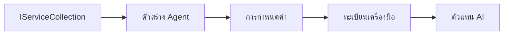

# 🎨 รูปแบบการออกแบบเอเย่นต์กับ Azure OpenAI (Responses API) (.NET)

## 📋 วัตถุประสงค์การเรียนรู้

ตัวอย่างนี้แสดงรูปแบบการออกแบบระดับองค์กรสำหรับการสร้างเอเย่นต์อัจฉริยะโดยใช้ Microsoft Agent Framework ใน .NET ที่ผสานรวมกับ Azure OpenAI (Responses API) คุณจะได้เรียนรู้รูปแบบและแนวทางสถาปัตยกรรมระดับมืออาชีพที่ทำให้เอเย่นต์พร้อมใช้งานในสภาพแวดล้อมการผลิต ดูแลรักษาง่าย และขยายตัวได้

### รูปแบบการออกแบบระดับองค์กร

- 🏭 **รูปแบบโรงงาน (Factory Pattern)**: การสร้างเอเย่นต์แบบมาตรฐานพร้อมการฉีดพึ่งพิง
- 🔧 **รูปแบบบิวเดอร์ (Builder Pattern)**: การตั้งค่าและกำหนดค่าของเอเย่นต์แบบลื่นไหล
- 🧵 **รูปแบบความปลอดภัยเธรด (Thread-Safe Patterns)**: การจัดการการสนทนาพร้อมกัน
- 📋 **รูปแบบรีโพซิทอรี (Repository Pattern)**: การจัดการเครื่องมือและความสามารถอย่างเป็นระบบ

## 🎯 ประโยชน์เฉพาะสถาปัตยกรรมใน .NET

### คุณสมบัติระดับองค์กร

- **การพิมพ์แบบเข้มงวด (Strong Typing)**: การตรวจสอบในเวลาคอมไพล์และการรองรับ IntelliSense
- **การฉีดพึ่งพิง (Dependency Injection)**: การผสานรวมคอนเทนเนอร์ DI ในตัว
- **การจัดการการตั้งค่า (Configuration Management)**: รูปแบบ IConfiguration และ Options
- **Async/Await**: การรองรับการเขียนโปรแกรมแบบอะซิงโครนัสระดับชั้นนำ

### รูปแบบพร้อมใช้งานในสภาพแวดล้อมการผลิต

- **การผสานรวมการบันทึก (Logging Integration)**: รองรับ ILogger และการบันทึกแบบมีโครงสร้าง
- **การตรวจสอบสุขภาพ (Health Checks)**: การตรวจสอบและวินิจฉัยในตัว
- **การตรวจสอบความถูกต้องของการตั้งค่า (Configuration Validation)**: การพิมพ์แบบเข้มงวดด้วยการระบุข้อมูล
- **การจัดการข้อผิดพลาด (Error Handling)**: การจัดการข้อยกเว้นแบบมีโครงสร้าง

## 🔧 สถาปัตยกรรมทางเทคนิค

### องค์ประกอบหลักของ .NET

- **Microsoft.Extensions.AI**: การสรุปบริการ AI แบบรวมศูนย์
- **Microsoft.Agents.AI**: เฟรมเวิร์กการประสานงานเอเย่นต์ระดับองค์กร
- **Azure OpenAI (Responses API)**: รูปแบบไคลเอนต์ API ประสิทธิภาพสูง
- **ระบบการตั้งค่า**: appsettings.json และการผสานรวมสภาพแวดล้อม

### การใช้งานรูปแบบการออกแบบ



## 🏗️ รูปแบบระดับองค์กรที่แสดงในตัวอย่าง

### 1. **รูปแบบสร้าง (Creational Patterns)**

- **โรงงานเอเย่นต์ (Agent Factory)**: การสร้างเอเย่นต์ศูนย์กลางด้วยการตั้งค่าที่สม่ำเสมอ
- **รูปแบบบิวเดอร์ (Builder Pattern)**: API แบบลื่นไหลสำหรับการกำหนดค่าเอเย่นต์ที่ซับซ้อน
- **รูปแบบซิงเกิลตัน (Singleton Pattern)**: การจัดการทรัพยากรและการตั้งค่าแบบแบ่งปัน
- **การฉีดพึ่งพิง (Dependency Injection)**: การเชื่อมโยงแบบหลวมและความสามารถในการทดสอบ

### 2. **รูปแบบพฤติกรรม (Behavioral Patterns)**

- **รูปแบบกลยุทธ์ (Strategy Pattern)**: กลยุทธ์การดำเนินงานเครื่องมือที่สามารถเปลี่ยนได้
- **รูปแบบคำสั่ง (Command Pattern)**: การปฏิบัติการเอเย่นต์แบบแคปซูลที่มี undo/redo
- **รูปแบบผู้สังเกตการณ์ (Observer Pattern)**: การจัดการวงจรชีวิตเอเย่นต์แบบขับเคลื่อนด้วยเหตุการณ์
- **รูปแบบเทมเพลตเมธอด (Template Method)**: เวิร์กโฟลว์การดำเนินงานของเอเย่นต์มาตรฐาน

### 3. **รูปแบบโครงสร้าง (Structural Patterns)**

- **รูปแบบอแดปเตอร์ (Adapter Pattern)**: ชั้นการผสานรวม Azure OpenAI (Responses API)
- **รูปแบบตกแต่ง (Decorator Pattern)**: การเพิ่มความสามารถให้เอเย่นต์
- **รูปแบบแฟซาด (Facade Pattern)**: อินเทอร์เฟซปฏิสัมพันธ์เอเย่นต์ที่เรียบง่าย
- **รูปแบบพร็อกซี (Proxy Pattern)**: การโหลดแบบเลซี่และแคชชิงเพื่อประสิทธิภาพ

## 📚 หลักการออกแบบ .NET

### หลักการ SOLID

- **ความรับผิดชอบเดียว (Single Responsibility)**: แต่ละองค์ประกอบมีวัตถุประสงค์ชัดเจนหนึ่งอย่าง
- **เปิด/ปิด (Open/Closed)**: ขยายได้โดยไม่ต้องแก้ไข
- **การแทนที่ Liskov (Liskov Substitution)**: การใช้งานเครื่องมือที่อิงกับอินเทอร์เฟซ
- **การแยกอินเทอร์เฟซ (Interface Segregation)**: อินเทอร์เฟซที่โฟกัสและสอดคล้องกัน
- **การกลับทิศทางการพึ่งพิง (Dependency Inversion)**: พึ่งพาสิ่งนามธรรม ไม่ใช่ของที่เป็นรูปธรรม

### สถาปัตยกรรมสะอาด (Clean Architecture)

- **เลเยอร์โดเมน (Domain Layer)**: สิ่งนามธรรมหลักของเอเย่นต์และเครื่องมือ
- **เลเยอร์แอปพลิเคชัน (Application Layer)**: การประสานงานและเวิร์กโฟลว์ของเอเย่นต์
- **เลเยอร์โครงสร้างพื้นฐาน (Infrastructure Layer)**: การผสานรวม Azure OpenAI (Responses API) และบริการภายนอก
- **เลเยอร์การนำเสนอ (Presentation Layer)**: การโต้ตอบของผู้ใช้และการจัดรูปแบบการตอบกลับ

## 🔒 การพิจารณาสำหรับองค์กร

### ความปลอดภัย

- **การจัดการข้อมูลประจำตัว (Credential Management)**: การจัดการกุญแจ API อย่างปลอดภัยด้วย IConfiguration
- **การตรวจสอบข้อมูลนำเข้า (Input Validation)**: การพิมพ์เข้มงวดและการตรวจสอบด้วยการระบุข้อมูล
- **การทำความสะอาดข้อมูลผลลัพธ์ (Output Sanitization)**: การประมวลผลและกรองการตอบกลับอย่างปลอดภัย
- **การบันทึกตรวจสอบ (Audit Logging)**: การติดตามการดำเนินการอย่างครอบคลุม

### ประสิทธิภาพ

- **รูปแบบอะซิงโครนัส (Async Patterns)**: การดำเนินการ I/O ที่ไม่บล็อก
- **การจัดกลุ่มการเชื่อมต่อ (Connection Pooling)**: การจัดการไคลเอนต์ HTTP อย่างมีประสิทธิภาพ
- **แคชชิง (Caching)**: การแคชผลลัพธ์เพื่อเพิ่มประสิทธิภาพ
- **การจัดการทรัพยากร (Resource Management)**: รูปแบบการกำจัดและทำความสะอาดอย่างเหมาะสม

### การปรับขนาด

- **ความปลอดภัยเธรด (Thread Safety)**: รองรับการดำเนินการเอเย่นต์พร้อมกัน
- **การจัดกลุ่มทรัพยากร (Resource Pooling)**: การใช้งานทรัพยากรอย่างมีประสิทธิภาพ
- **การจัดการโหลด (Load Management)**: การจำกัดอัตราและการจัดการแรงกดดันย้อนกลับ
- **การตรวจสอบ (Monitoring)**: ตัวชี้วัดประสิทธิภาพและการตรวจสอบสุขภาพ

## 🚀 การปรับใช้ในสภาพแวดล้อมการผลิต

- **การจัดการการตั้งค่า (Configuration Management)**: การตั้งค่าสภาพแวดล้อมเฉพาะ
- **กลยุทธ์การบันทึก (Logging Strategy)**: การบันทึกแบบมีโครงสร้างพร้อมรหัสการเชื่อมโยง
- **การจัดการข้อผิดพลาด (Error Handling)**: การจัดการข้อยกเว้นทั่วโลกพร้อมการกู้คืนอย่างเหมาะสม
- **การตรวจสอบ (Monitoring)**: Application Insights และเคาน์เตอร์ประสิทธิภาพ
- **การทดสอบ (Testing)**: แบบทดสอบหน่วย แบบทดสอบการผสาน และรูปแบบการทดสอบโหลด

พร้อมสร้างเอเย่นต์อัจฉริยะระดับองค์กรกับ .NET แล้วหรือยัง? มาสร้างสถาปัตยกรรมที่มั่นคงกันเถอะ! 🏢✨

## 🚀 เริ่มต้น

### สิ่งที่ต้องเตรียม

- [SDK .NET 10](https://dotnet.microsoft.com/download/dotnet/10.0) หรือสูงกว่า
- [สมัคร Azure](https://azure.microsoft.com/free/) ที่มีทรัพยากร Azure OpenAI และการปรับใช้โมเดล
- ใช้ [Azure CLI](https://learn.microsoft.com/cli/azure/install-azure-cli) — ลงชื่อเข้าใช้ด้วย `az login`

### ตัวแปรสภาพแวดล้อมที่ต้องตั้งค่า

```bash
# zsh/bash
export AZURE_OPENAI_ENDPOINT=https://<your-resource>.openai.azure.com
export AZURE_OPENAI_DEPLOYMENT=gpt-5-mini
# จากนั้นลงชื่อเข้าใช้เพื่อให้ AzureCliCredential สามารถรับโทเค็นได้
az login
```

```powershell
# PowerShell
$env:AZURE_OPENAI_ENDPOINT = "https://<your-resource>.openai.azure.com"
$env:AZURE_OPENAI_DEPLOYMENT = "gpt-5-mini"
# จากนั้นเข้าสู่ระบบเพื่อให้ AzureCliCredential สามารถรับโทเค็นได้
az login
```

### ตัวอย่างโค้ด

เพื่อรันตัวอย่างโค้ด,

```bash
# zsh/bash
chmod +x ./03-dotnet-agent-framework.cs
./03-dotnet-agent-framework.cs
```

หรือใช้ dotnet CLI:

```bash
dotnet run ./03-dotnet-agent-framework.cs
```

ดู [`03-dotnet-agent-framework.cs`](../../../../03-agentic-design-patterns/code_samples/03-dotnet-agent-framework.cs) สำหรับโค้ดทั้งหมด

```csharp
#!/usr/bin/dotnet run

#:package Microsoft.Extensions.AI@10.*
#:package Microsoft.Agents.AI.OpenAI@1.*-*
#:package Azure.AI.OpenAI@2.1.0
#:package Azure.Identity@1.13.1

using System.ComponentModel;

using Microsoft.Agents.AI;
using Microsoft.Extensions.AI;

using Azure.AI.OpenAI;
using Azure.Identity;

// Tool Function: Random Destination Generator
// This static method will be available to the agent as a callable tool
// The [Description] attribute helps the AI understand when to use this function
// This demonstrates how to create custom tools for AI agents
[Description("Provides a random vacation destination.")]
static string GetRandomDestination()
{
    // List of popular vacation destinations around the world
    // The agent will randomly select from these options
    var destinations = new List<string>
    {
        "Paris, France",
        "Tokyo, Japan",
        "New York City, USA",
        "Sydney, Australia",
        "Rome, Italy",
        "Barcelona, Spain",
        "Cape Town, South Africa",
        "Rio de Janeiro, Brazil",
        "Bangkok, Thailand",
        "Vancouver, Canada"
    };

    // Generate random index and return selected destination
    // Uses System.Random for simple random selection
    var random = new Random();
    int index = random.Next(destinations.Count);
    return destinations[index];
}

// Azure OpenAI with the Responses API (stable v1 endpoint). Sign in with `az login`.
var azureEndpoint = Environment.GetEnvironmentVariable("AZURE_OPENAI_ENDPOINT")
    ?? throw new InvalidOperationException("AZURE_OPENAI_ENDPOINT is not set.");
var deployment = Environment.GetEnvironmentVariable("AZURE_OPENAI_DEPLOYMENT") ?? "gpt-5-mini";

var azureClient = new AzureOpenAIClient(new Uri(azureEndpoint), new AzureCliCredential());

// Define Agent Identity and Comprehensive Instructions
// Agent name for identification and logging purposes
var AGENT_NAME = "TravelAgent";

// Detailed instructions that define the agent's personality, capabilities, and behavior
// This system prompt shapes how the agent responds and interacts with users
var AGENT_INSTRUCTIONS = """
You are a helpful AI Agent that can help plan vacations for customers.

Important: When users specify a destination, always plan for that location. Only suggest random destinations when the user hasn't specified a preference.

When the conversation begins, introduce yourself with this message:
"Hello! I'm your TravelAgent assistant. I can help plan vacations and suggest interesting destinations for you. Here are some things you can ask me:
1. Plan a day trip to a specific location
2. Suggest a random vacation destination
3. Find destinations with specific features (beaches, mountains, historical sites, etc.)
4. Plan an alternative trip if you don't like my first suggestion

What kind of trip would you like me to help you plan today?"

Always prioritize user preferences. If they mention a specific destination like "Bali" or "Paris," focus your planning on that location rather than suggesting alternatives.
""";

// Create AI Agent with Advanced Travel Planning Capabilities
// Get the Responses client for the deployment and create the AI agent
// Configure agent with name, detailed instructions, and available tools
// This demonstrates the .NET agent creation pattern with full configuration
AIAgent agent = azureClient
    .GetChatClient(deployment)
    .AsAIAgent(
        name: AGENT_NAME,
        instructions: AGENT_INSTRUCTIONS,
        tools: [AIFunctionFactory.Create(GetRandomDestination)]
    );

// Create New Conversation Session for Context Management
// Initialize a new conversation session to maintain context across multiple interactions
// Sessions enable the agent to remember previous exchanges and maintain conversational state
// This is essential for multi-turn conversations and contextual understanding
var session = await agent.CreateSessionAsync();

// Execute Agent: First Travel Planning Request
// Run the agent with an initial request that will likely trigger the random destination tool
// The agent will analyze the request, use the GetRandomDestination tool, and create an itinerary
// Using the session parameter maintains conversation context for subsequent interactions
await foreach (var update in agent.RunStreamingAsync("Plan me a day trip", session))
{
    await Task.Delay(10);
    Console.Write(update);
}

Console.WriteLine();

// Execute Agent: Follow-up Request with Context Awareness
// Demonstrate contextual conversation by referencing the previous response
// The agent remembers the previous destination suggestion and will provide an alternative
// This showcases the power of conversation sessions and contextual understanding in .NET agents
await foreach (var update in agent.RunStreamingAsync("I don't like that destination. Plan me another vacation.", session))
{
    await Task.Delay(10);
    Console.Write(update);
}
```

---

<!-- CO-OP TRANSLATOR DISCLAIMER START -->
**ปฏิเสธความรับผิดชอบ**:
เอกสารนี้ได้รับการแปลโดยใช้บริการแปลภาษา AI [Co-op Translator](https://github.com/Azure/co-op-translator) ขณะที่เราพยายามให้ความถูกต้อง โปรดทราบว่าการแปลโดยอัตโนมัติอาจมีข้อผิดพลาดหรือความไม่ถูกต้อง เอกสารต้นฉบับในภาษาต้นทางควรถูกพิจารณาเป็นแหล่งข้อมูลที่เชื่อถือได้ สำหรับข้อมูลที่สำคัญ แนะนำให้ใช้การแปลโดยมนุษย์มืออาชีพ เราไม่รับผิดชอบต่อความเข้าใจผิดหรือการตีความที่ผิดพลาดที่เกิดขึ้นจากการใช้การแปลนี้
<!-- CO-OP TRANSLATOR DISCLAIMER END -->