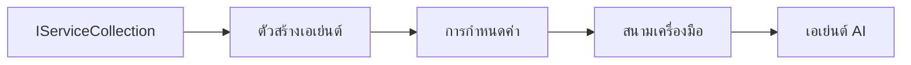

# 🎨 รูปแบบการออกแบบแบบ Agentic กับ Azure OpenAI (Responses API) (.NET)

## 📋 วัตถุประสงค์การเรียนรู้

ตัวอย่างนี้แสดงรูปแบบการออกแบบระดับองค์กรสำหรับการสร้างเอเจนต์อัจฉริยะโดยใช้ Microsoft Agent Framework ใน .NET พร้อมการผสานรวมกับ Azure OpenAI (Responses API) คุณจะได้เรียนรู้รูปแบบและแนวทางสถาปัตยกรรมระดับมืออาชีพที่ทำให้เอเจนต์พร้อมสำหรับใช้งานจริง ดูแลรักษาง่าย และขยายขนาดได้

### รูปแบบการออกแบบระดับองค์กร

- 🏭 **รูปแบบ Factory**: การสร้างเอเจนต์ที่เป็นมาตรฐานด้วยการฉีดพึ่งพิง
- 🔧 **รูปแบบ Builder**: การตั้งค่าและกำหนดค่าเอเจนต์แบบ Fluent
- 🧵 **รูปแบบปลอดภัยกับเธรด**: การจัดการการสนทนาแบบขนาน
- 📋 **รูปแบบ Repository**: การจัดการเครื่องมือและความสามารถอย่างมีระเบียบ

## 🎯 ประโยชน์ทางสถาปัตยกรรมเฉพาะ .NET

### คุณสมบัติระดับองค์กร

- **Strong Typing**: การยืนยันและรองรับ IntelliSense ในเวลาคอมไพล์
- **Dependency Injection**: การผสานรวมคอนเทนเนอร์ DI ในตัว
- **Configuration Management**: รูปแบบ IConfiguration และ Options
- **Async/Await**: การสนับสนุนการเขียนโปรแกรมแบบอะซิงโครนัสขั้นสูง

### รูปแบบที่พร้อมสำหรับการใช้งานจริง

- **Logging Integration**: ILogger และการบันทึกข้อมูลแบบมีโครงสร้าง
- **Health Checks**: การตรวจสอบสุขภาพและการวินิจฉัยในตัว
- **Configuration Validation**: การพิมพ์เข้มงวดพร้อมอนุมัติข้อมูล
- **Error Handling**: การจัดการข้อยกเว้นแบบมีโครงสร้าง

## 🔧 สถาปัตยกรรมเชิงเทคนิค

### ส่วนประกอบหลักของ .NET

- **Microsoft.Extensions.AI**: นามธรรมบริการ AI แบบรวมศูนย์
- **Microsoft.Agents.AI**: กรอบงานการจัดการเอเจนต์ระดับองค์กร
- **Azure OpenAI (Responses API)**: รูปแบบไคลเอ็นต์ API ประสิทธิภาพสูง
- **ระบบการกำหนดค่า**: appsettings.json และการผสานรวมสภาพแวดล้อม

### การใช้งานรูปแบบการออกแบบ



## 🏗️ รูปแบบระดับองค์กรที่แสดง

### 1. **รูปแบบการสร้าง**

- **Agent Factory**: การสร้างเอเจนต์แบบรวมศูนย์ด้วยการกำหนดค่าที่สม่ำเสมอ
- **Builder Pattern**: API แบบ Fluent สำหรับการกำหนดค่าเอเจนต์ที่ซับซ้อน
- **Singleton Pattern**: การจัดการทรัพยากรและการกำหนดค่าที่ใช้ร่วมกัน
- **Dependency Injection**: การเชื่อมโยงแบบหลวมและทดสอบได้ง่าย

### 2. **รูปแบบพฤติกรรม**

- **Strategy Pattern**: กลยุทธ์การดำเนินการเครื่องมือที่สลับเปลี่ยนได้
- **Command Pattern**: การดำเนินงานเอเจนต์ที่ห่อหุ้มพร้อมกับย้อนกลับ/ทำซ้ำ
- **Observer Pattern**: การจัดการวงจรชีวิตเอเจนต์ตามเหตุการณ์
- **Template Method**: เวิร์กโฟลว์การดำเนินการเอเจนต์ตามมาตรฐาน

### 3. **รูปแบบโครงสร้าง**

- **Adapter Pattern**: ชั้นการผสานรวม Azure OpenAI (Responses API)
- **Decorator Pattern**: การปรับปรุงความสามารถของเอเจนต์
- **Facade Pattern**: อินเทอร์เฟซการโต้ตอบเอเจนต์ที่ง่ายขึ้น
- **Proxy Pattern**: การโหลดแบบ Lazy และการแคชเพื่อประสิทธิภาพ

## 📚 หลักการออกแบบใน .NET

### หลักการ SOLID

- **Single Responsibility**: ส่วนประกอบแต่ละตัวมีวัตถุประสงค์ที่ชัดเจนหนึ่งอย่าง
- **Open/Closed**: ขยายได้โดยไม่ต้องแก้ไข
- **Liskov Substitution**: การใช้งานเครื่องมือที่อิงตามอินเทอร์เฟซ
- **Interface Segregation**: อินเทอร์เฟซที่โฟกัสและมีความสอดคล้อง
- **Dependency Inversion**: พึ่งพานามธรรม ไม่ใช่สิ่งที่เป็นรูปธรรม

### สถาปัตยกรรมที่สะอาด

- **Domain Layer**: นามธรรมเอเจนต์และเครื่องมือหลัก
- **Application Layer**: การจัดการเอเจนต์และเวิร์กโฟลว์
- **Infrastructure Layer**: การผสานรวม Azure OpenAI (Responses API) และบริการภายนอก
- **Presentation Layer**: การโต้ตอบผู้ใช้และการจัดรูปแบบการตอบกลับ

## 🔒 ข้อพิจารณาระดับองค์กร

### ความปลอดภัย

- **การจัดการข้อมูลรับรอง**: การจัดการคีย์ API อย่างปลอดภัยด้วย IConfiguration
- **การตรวจสอบข้อมูลขาเข้า**: การพิมพ์เข้มงวดและการตรวจสอบอนุมัติข้อมูล
- **การทำความสะอาดข้อมูลขาออก**: การประมวลผลและกรองการตอบกลับอย่างปลอดภัย
- **การบันทึกเพื่อตรวจสอบ**: การติดตามการดำเนินงานอย่างครอบคลุม

### ประสิทธิภาพ

- **รูปแบบอะซิงโครนัส**: การดำเนินงาน I/O ที่ไม่บล็อก
- **Connection Pooling**: การจัดการไคลเอ็นต์ HTTP อย่างมีประสิทธิภาพ
- **การแคช**: การแคชการตอบกลับเพื่อเพิ่มประสิทธิภาพ
- **การจัดการทรัพยากร**: รูปแบบการจัดการการกำจัดและการทำความสะอาดที่เหมาะสม

### ความสามารถในการขยาย

- **ความปลอดภัยเธรด**: การสนับสนุนการดำเนินการเอเจนต์แบบขนาน
- **การจัดการพูลทรัพยากร**: การใช้ทรัพยากรอย่างมีประสิทธิภาพ
- **การจัดการโหลด**: การจำกัดอัตราและการจัดการแรงย้อนกลับ
- **การตรวจสอบ**: ตัวชี้วัดประสิทธิภาพและการตรวจสอบสุขภาพ

## 🚀 การปรับใช้ในสภาพแวดล้อมจริง

- **การจัดการการกำหนดค่า**: การตั้งค่าตามสภาพแวดล้อมเฉพาะ
- **กลยุทธ์การบันทึก**: การบันทึกข้อมูลที่มีโครงสร้างพร้อมรหัสเชื่อมโยง
- **การจัดการข้อผิดพลาด**: การจัดการข้อยกเว้นทั่วโลกพร้อมการฟื้นฟูที่เหมาะสม
- **การตรวจสอบ**: Application insights และตัวนับประสิทธิภาพ
- **การทดสอบ**: การทดสอบหน่วย การทดสอบรวม และรูปแบบการทดสอบโหลด

พร้อมสร้างเอเจนต์อัจฉริยะระดับองค์กรด้วย .NET หรือยัง? มาสร้างสถาปัตยกรรมที่แข็งแกร่งกันเถอะ! 🏢✨

## 🚀 การเริ่มต้นใช้งาน

### ข้อกำหนดเบื้องต้น

- [.NET 10 SDK](https://dotnet.microsoft.com/download/dotnet/10.0) หรือสูงกว่า
- การสมัครใช้งาน [Azure](https://azure.microsoft.com/free/) พร้อมทรัพยากร Azure OpenAI และการปรับใช้โมเดล
- [Azure CLI](https://learn.microsoft.com/cli/azure/install-azure-cli) — ลงชื่อเข้าใช้ด้วย `az login`

### ตัวแปรสภาพแวดล้อมที่จำเป็น

```bash
# zsh/bash
export AZURE_OPENAI_ENDPOINT=https://<your-resource>.openai.azure.com
export AZURE_OPENAI_DEPLOYMENT=gpt-4.1-mini
# จากนั้นเข้าสู่ระบบเพื่อให้ AzureCliCredential ได้รับโทเค็น
az login
```

```powershell
# PowerShell
$env:AZURE_OPENAI_ENDPOINT = "https://<your-resource>.openai.azure.com"
$env:AZURE_OPENAI_DEPLOYMENT = "gpt-4.1-mini"
# จากนั้นลงชื่อเข้าใช้เพื่อให้ AzureCliCredential รับโทเค็นได้
az login
```

### ตัวอย่างโค้ด

เพื่อรันตัวอย่างโค้ด,

```bash
# zsh/bash
chmod +x ./03-dotnet-agent-framework.cs
./03-dotnet-agent-framework.cs
```

หรือใช้ dotnet CLI:

```bash
dotnet run ./03-dotnet-agent-framework.cs
```

ดู [`03-dotnet-agent-framework.cs`](../../../../03-agentic-design-patterns/code_samples/03-dotnet-agent-framework.cs) สำหรับโค้ดทั้งหมด

```csharp
#!/usr/bin/dotnet run

#:package Microsoft.Extensions.AI@10.*
#:package Microsoft.Agents.AI.OpenAI@1.*-*
#:package Azure.AI.OpenAI@2.1.0
#:package Azure.Identity@1.13.1

using System.ComponentModel;

using Microsoft.Agents.AI;
using Microsoft.Extensions.AI;

using Azure.AI.OpenAI;
using Azure.Identity;

// Tool Function: Random Destination Generator
// This static method will be available to the agent as a callable tool
// The [Description] attribute helps the AI understand when to use this function
// This demonstrates how to create custom tools for AI agents
[Description("Provides a random vacation destination.")]
static string GetRandomDestination()
{
    // List of popular vacation destinations around the world
    // The agent will randomly select from these options
    var destinations = new List<string>
    {
        "Paris, France",
        "Tokyo, Japan",
        "New York City, USA",
        "Sydney, Australia",
        "Rome, Italy",
        "Barcelona, Spain",
        "Cape Town, South Africa",
        "Rio de Janeiro, Brazil",
        "Bangkok, Thailand",
        "Vancouver, Canada"
    };

    // Generate random index and return selected destination
    // Uses System.Random for simple random selection
    var random = new Random();
    int index = random.Next(destinations.Count);
    return destinations[index];
}

// Azure OpenAI with the Responses API (stable v1 endpoint). Sign in with `az login`.
var azureEndpoint = Environment.GetEnvironmentVariable("AZURE_OPENAI_ENDPOINT")
    ?? throw new InvalidOperationException("AZURE_OPENAI_ENDPOINT is not set.");
var deployment = Environment.GetEnvironmentVariable("AZURE_OPENAI_DEPLOYMENT") ?? "gpt-4.1-mini";

var azureClient = new AzureOpenAIClient(new Uri(azureEndpoint), new AzureCliCredential());

// Define Agent Identity and Comprehensive Instructions
// Agent name for identification and logging purposes
var AGENT_NAME = "TravelAgent";

// Detailed instructions that define the agent's personality, capabilities, and behavior
// This system prompt shapes how the agent responds and interacts with users
var AGENT_INSTRUCTIONS = """
You are a helpful AI Agent that can help plan vacations for customers.

Important: When users specify a destination, always plan for that location. Only suggest random destinations when the user hasn't specified a preference.

When the conversation begins, introduce yourself with this message:
"Hello! I'm your TravelAgent assistant. I can help plan vacations and suggest interesting destinations for you. Here are some things you can ask me:
1. Plan a day trip to a specific location
2. Suggest a random vacation destination
3. Find destinations with specific features (beaches, mountains, historical sites, etc.)
4. Plan an alternative trip if you don't like my first suggestion

What kind of trip would you like me to help you plan today?"

Always prioritize user preferences. If they mention a specific destination like "Bali" or "Paris," focus your planning on that location rather than suggesting alternatives.
""";

// Create AI Agent with Advanced Travel Planning Capabilities
// Get the Responses client for the deployment and create the AI agent
// Configure agent with name, detailed instructions, and available tools
// This demonstrates the .NET agent creation pattern with full configuration
AIAgent agent = azureClient
    .GetChatClient(deployment)
    .AsAIAgent(
        name: AGENT_NAME,
        instructions: AGENT_INSTRUCTIONS,
        tools: [AIFunctionFactory.Create(GetRandomDestination)]
    );

// Create New Conversation Session for Context Management
// Initialize a new conversation session to maintain context across multiple interactions
// Sessions enable the agent to remember previous exchanges and maintain conversational state
// This is essential for multi-turn conversations and contextual understanding
var session = await agent.CreateSessionAsync();

// Execute Agent: First Travel Planning Request
// Run the agent with an initial request that will likely trigger the random destination tool
// The agent will analyze the request, use the GetRandomDestination tool, and create an itinerary
// Using the session parameter maintains conversation context for subsequent interactions
await foreach (var update in agent.RunStreamingAsync("Plan me a day trip", session))
{
    await Task.Delay(10);
    Console.Write(update);
}

Console.WriteLine();

// Execute Agent: Follow-up Request with Context Awareness
// Demonstrate contextual conversation by referencing the previous response
// The agent remembers the previous destination suggestion and will provide an alternative
// This showcases the power of conversation sessions and contextual understanding in .NET agents
await foreach (var update in agent.RunStreamingAsync("I don't like that destination. Plan me another vacation.", session))
{
    await Task.Delay(10);
    Console.Write(update);
}
```

---

<!-- CO-OP TRANSLATOR DISCLAIMER START -->
**ปฏิเสธความรับผิดชอบ**:
เอกสารนี้ได้รับการแปลโดยใช้บริการแปลภาษา AI [Co-op Translator](https://github.com/Azure/co-op-translator) ขณะที่เราพยายามให้ความถูกต้อง โปรดทราบว่าการแปลโดยอัตโนมัติอาจมีข้อผิดพลาดหรือความไม่ถูกต้อง เอกสารต้นฉบับในภาษาต้นทางควรถูกพิจารณาเป็นแหล่งข้อมูลที่เชื่อถือได้ สำหรับข้อมูลที่สำคัญ แนะนำให้ใช้การแปลโดยมนุษย์มืออาชีพ เราไม่รับผิดชอบต่อความเข้าใจผิดหรือการตีความที่ผิดพลาดที่เกิดขึ้นจากการใช้การแปลนี้
<!-- CO-OP TRANSLATOR DISCLAIMER END -->