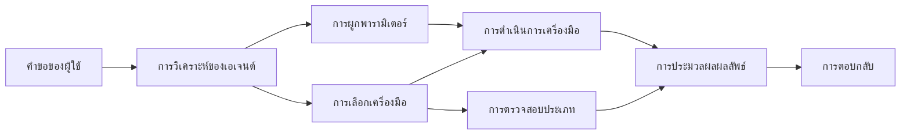

# 🛠️ การใช้เครื่องมือขั้นสูงกับ Azure OpenAI (Responses API) (.NET)

## 📋 วัตถุประสงค์การเรียนรู้

โน้ตบุ๊คนี้สาธิตรูปแบบการรวมเครื่องมือระดับองค์กรโดยใช้ Microsoft Agent Framework ใน .NET กับ Azure OpenAI (Responses API) คุณจะได้เรียนรู้การสร้างเอเย่นต์ที่ซับซ้อนพร้อมเครื่องมือเฉพาะหลายตัว โดยใช้ประโยชน์จากการพิมพ์แบบเข้มงวดของ C# และคุณสมบัติระดับองค์กรของ .NET

### ความสามารถขั้นสูงของเครื่องมือที่คุณจะเชี่ยวชาญ

- 🔧 **สถาปัตยกรรมหลายเครื่องมือ**: การสร้างเอเย่นต์ที่มีความสามารถเฉพาะหลายอย่าง
- 🎯 **การเรียกใช้เครื่องมือแบบปลอดภัยชนิดข้อมูล**: ใช้ประโยชน์จากการตรวจสอบในเวลาคอมไพล์ของ C#
- 📊 **รูปแบบเครื่องมือระดับองค์กร**: การออกแบบเครื่องมือที่พร้อมใช้งานจริงและการจัดการข้อผิดพลาด
- 🔗 **การรวมเครื่องมือ**: การรวมเครื่องมือสำหรับเวิร์กโฟลว์ธุรกิจที่ซับซ้อน

## 🎯 ประโยชน์ของสถาปัตยกรรมเครื่องมือ .NET

### คุณสมบัติของเครื่องมือระดับองค์กร

- **การตรวจสอบในเวลาคอมไพล์**: การพิมพ์เชิงเข้มงวดช่วยให้แน่ใจว่าพารามิเตอร์ของเครื่องมือถูกต้อง
- **การฉีดพึ่งพิง**: การรวม IoC container สำหรับการจัดการเครื่องมือ
- **รูปแบบ Async/Await**: การเรียกใช้เครื่องมือแบบไม่บล็อกพร้อมการจัดการทรัพยากรที่เหมาะสม
- **การล็อกแบบมีโครงสร้าง**: การรวมระบบล็อกในตัวสำหรับการติดตามการทำงานของเครื่องมือ

### รูปแบบที่พร้อมสำหรับการใช้งานจริง

- **การจัดการข้อยกเว้น**: การจัดการข้อผิดพลาดที่ครอบคลุมด้วยข้อยกเว้นชนิดข้อมูล
- **การจัดการทรัพยากร**: รูปแบบการจัดการและปล่อยทรัพยากรอย่างเหมาะสม
- **การติดตามประสิทธิภาพ**: เมตริกและตัวนับประสิทธิภาพในตัว
- **การจัดการการกำหนดค่า**: การกำหนดค่าที่ปลอดภัยชนิดข้อมูลพร้อมการตรวจสอบ

## 🔧 สถาปัตยกรรมทางเทคนิค

### ส่วนประกอบเครื่องมือหลักของ .NET

- **Microsoft.Extensions.AI**: ชั้นนามธรรมเครื่องมือแบบรวมศูนย์
- **Microsoft.Agents.AI**: การประสานงานเครื่องมือระดับองค์กร
- **Azure OpenAI (Responses API)**: ไคลเอนต์ API ประสิทธิภาพสูงพร้อมการจัดการการเชื่อมต่อแบบกลุ่ม

### ท่อส่งการเรียกใช้เครื่องมือ



## 🛠️ หมวดหมู่เครื่องมือ & รูปแบบ

### 1. **เครื่องมือประมวลผลข้อมูล**

- **การตรวจสอบข้อมูลเข้า**: การพิมพ์เชิงเข้มงวดพร้อมคำอธิบายข้อมูล
- **การดำเนินการแปลง**: การแปลงและจัดรูปแบบข้อมูลที่ปลอดภัยชนิดข้อมูล
- **ตรรกะธุรกิจ**: เครื่องมือคำนวณและวิเคราะห์เฉพาะโดเมน
- **การจัดรูปแบบข้อมูลออก**: การสร้างตอบกลับอย่างมีโครงสร้าง

### 2. **เครื่องมือบูรณาการ**

- **ตัวเชื่อมต่อ API**: การรวมบริการแบบ RESTful ด้วย HttpClient
- **เครื่องมือฐานข้อมูล**: การรวม Entity Framework สำหรับการเข้าถึงข้อมูล
- **การจัดการไฟล์**: การดำเนินการระบบไฟล์อย่างปลอดภัยพร้อมการตรวจสอบ
- **บริการภายนอก**: รูปแบบการรวมบริการบุคคลที่สาม

### 3. **เครื่องมืออรรถประโยชน์**

- **การประมวลผลข้อความ**: เครื่องมือจัดการและจัดรูปแบบสายอักขระ
- **การจัดการวัน/เวลา**: การคำนวณวัน/เวลาที่รับรู้วัฒนธรรม
- **เครื่องมือทางคณิตศาสตร์**: การคำนวณความแม่นยำและการดำเนินการทางสถิติ
- **เครื่องมือตรวจสอบ**: การตรวจสอบกฎธุรกิจและการยืนยันข้อมูล

พร้อมที่จะสร้างเอเย่นต์ระดับองค์กรที่มีความสามารถของเครื่องมือที่ปลอดภัยชนิดข้อมูลใน .NET แล้วหรือยัง? มาออกแบบโซลูชันระดับมืออาชีพกันเถอะ! 🏢⚡

## 🚀 เริ่มต้นใช้งาน

### ข้อกำหนดเบื้องต้น

- [.NET 10 SDK](https://dotnet.microsoft.com/download/dotnet/10.0) หรือสูงกว่า
- [การสมัครใช้งาน Azure](https://azure.microsoft.com/free/) พร้อมทรัพยากร Azure OpenAI และการปรับใช้โมเดล
- [Azure CLI](https://learn.microsoft.com/cli/azure/install-azure-cli) — ลงชื่อเข้าใช้ด้วย `az login`

### ตัวแปรสิ่งแวดล้อมที่จำเป็น

```bash
# zsh/bash
export AZURE_OPENAI_ENDPOINT=https://<your-resource>.openai.azure.com
export AZURE_OPENAI_DEPLOYMENT=gpt-4.1-mini
# จากนั้นเข้าสู่ระบบเพื่อให้ AzureCliCredential รับโทเค็นได้
az login
```

```powershell
# PowerShell
$env:AZURE_OPENAI_ENDPOINT = "https://<your-resource>.openai.azure.com"
$env:AZURE_OPENAI_DEPLOYMENT = "gpt-4.1-mini"
# จากนั้นลงชื่อเข้าใช้เพื่อให้ AzureCliCredential สามารถรับโทเค็นได้
az login
```

### ตัวอย่างโค้ด

เพื่อรันตัวอย่างโค้ด,

```bash
# zsh/bash
chmod +x ./04-dotnet-agent-framework.cs
./04-dotnet-agent-framework.cs
```

หรือใช้ dotnet CLI:

```bash
dotnet run ./04-dotnet-agent-framework.cs
```

ดู [`04-dotnet-agent-framework.cs`](../../../../04-tool-use/code_samples/04-dotnet-agent-framework.cs) สำหรับโค้ดยอดเยี่ยมทั้งหมด

```csharp
#!/usr/bin/dotnet run

#:package Microsoft.Extensions.AI@10.*
#:package Microsoft.Agents.AI.OpenAI@1.*-*
#:package Azure.AI.OpenAI@2.1.0
#:package Azure.Identity@1.13.1

using System.ComponentModel;

using Microsoft.Agents.AI;
using Microsoft.Extensions.AI;

using Azure.AI.OpenAI;
using Azure.Identity;

// Tool Function: Random Destination Generator
// This static method will be available to the agent as a callable tool
// The [Description] attribute helps the AI understand when to use this function
// This demonstrates how to create custom tools for AI agents
[Description("Provides a random vacation destination.")]
static string GetRandomDestination()
{
    // List of popular vacation destinations around the world
    // The agent will randomly select from these options
    var destinations = new List<string>
    {
        "Paris, France",
        "Tokyo, Japan",
        "New York City, USA",
        "Sydney, Australia",
        "Rome, Italy",
        "Barcelona, Spain",
        "Cape Town, South Africa",
        "Rio de Janeiro, Brazil",
        "Bangkok, Thailand",
        "Vancouver, Canada"
    };

    // Generate random index and return selected destination
    // Uses System.Random for simple random selection
    var random = new Random();
    int index = random.Next(destinations.Count);
    return destinations[index];
}

// Azure OpenAI with the Responses API (stable v1 endpoint). Sign in with `az login`.
var azureEndpoint = Environment.GetEnvironmentVariable("AZURE_OPENAI_ENDPOINT")
    ?? throw new InvalidOperationException("AZURE_OPENAI_ENDPOINT is not set.");
var deployment = Environment.GetEnvironmentVariable("AZURE_OPENAI_DEPLOYMENT") ?? "gpt-4.1-mini";

var azureClient = new AzureOpenAIClient(new Uri(azureEndpoint), new AzureCliCredential());

// Define Agent Identity and Comprehensive Instructions
// Agent name for identification and logging purposes
var AGENT_NAME = "TravelAgent";

// Detailed instructions that define the agent's personality, capabilities, and behavior
// This system prompt shapes how the agent responds and interacts with users
var AGENT_INSTRUCTIONS = """
You are a helpful AI Agent that can help plan vacations for customers.

Important: When users specify a destination, always plan for that location. Only suggest random destinations when the user hasn't specified a preference.

When the conversation begins, introduce yourself with this message:
"Hello! I'm your TravelAgent assistant. I can help plan vacations and suggest interesting destinations for you. Here are some things you can ask me:
1. Plan a day trip to a specific location
2. Suggest a random vacation destination
3. Find destinations with specific features (beaches, mountains, historical sites, etc.)
4. Plan an alternative trip if you don't like my first suggestion

What kind of trip would you like me to help you plan today?"

Always prioritize user preferences. If they mention a specific destination like "Bali" or "Paris," focus your planning on that location rather than suggesting alternatives.
""";

// Create AI Agent with Advanced Travel Planning Capabilities
// Get the Responses client for the deployment and create the AI agent
// Configure agent with name, detailed instructions, and available tools
// This demonstrates the .NET agent creation pattern with full configuration
AIAgent agent = azureClient
    .GetChatClient(deployment)
    .AsAIAgent(
        name: AGENT_NAME,
        instructions: AGENT_INSTRUCTIONS,
        tools: [AIFunctionFactory.Create(GetRandomDestination)]
    );

// Create New Conversation Session for Context Management
// Initialize a new conversation session to maintain context across multiple interactions
// Sessions enable the agent to remember previous exchanges and maintain conversational state
// This is essential for multi-turn conversations and contextual understanding
await using var session = await agent.CreateSessionAsync();

// Execute Agent: First Travel Planning Request
// Run the agent with an initial request that will likely trigger the random destination tool
// The agent will analyze the request, use the GetRandomDestination tool, and create an itinerary
// Using the session parameter maintains conversation context for subsequent interactions
await foreach (var update in agent.RunStreamingAsync("Plan me a day trip", session))
{
    await Task.Delay(10);
    Console.Write(update);
}

Console.WriteLine();

// Execute Agent: Follow-up Request with Context Awareness
// Demonstrate contextual conversation by referencing the previous response
// The agent remembers the previous destination suggestion and will provide an alternative
// This showcases the power of conversation sessions and contextual understanding in .NET agents
await foreach (var update in agent.RunStreamingAsync("I don't like that destination. Plan me another vacation.", session))
{
    await Task.Delay(10);
    Console.Write(update);
}
```

---

<!-- CO-OP TRANSLATOR DISCLAIMER START -->
**ปฏิเสธความรับผิดชอบ**:
เอกสารนี้ได้รับการแปลโดยใช้บริการแปลภาษา AI [Co-op Translator](https://github.com/Azure/co-op-translator) ขณะที่เราพยายามให้ความถูกต้อง โปรดทราบว่าการแปลโดยอัตโนมัติอาจมีข้อผิดพลาดหรือความไม่ถูกต้อง เอกสารต้นฉบับในภาษาต้นทางควรถูกพิจารณาเป็นแหล่งข้อมูลที่เชื่อถือได้ สำหรับข้อมูลที่สำคัญ แนะนำให้ใช้การแปลโดยมนุษย์มืออาชีพ เราไม่รับผิดชอบต่อความเข้าใจผิดหรือการตีความที่ผิดพลาดที่เกิดขึ้นจากการใช้การแปลนี้
<!-- CO-OP TRANSLATOR DISCLAIMER END -->