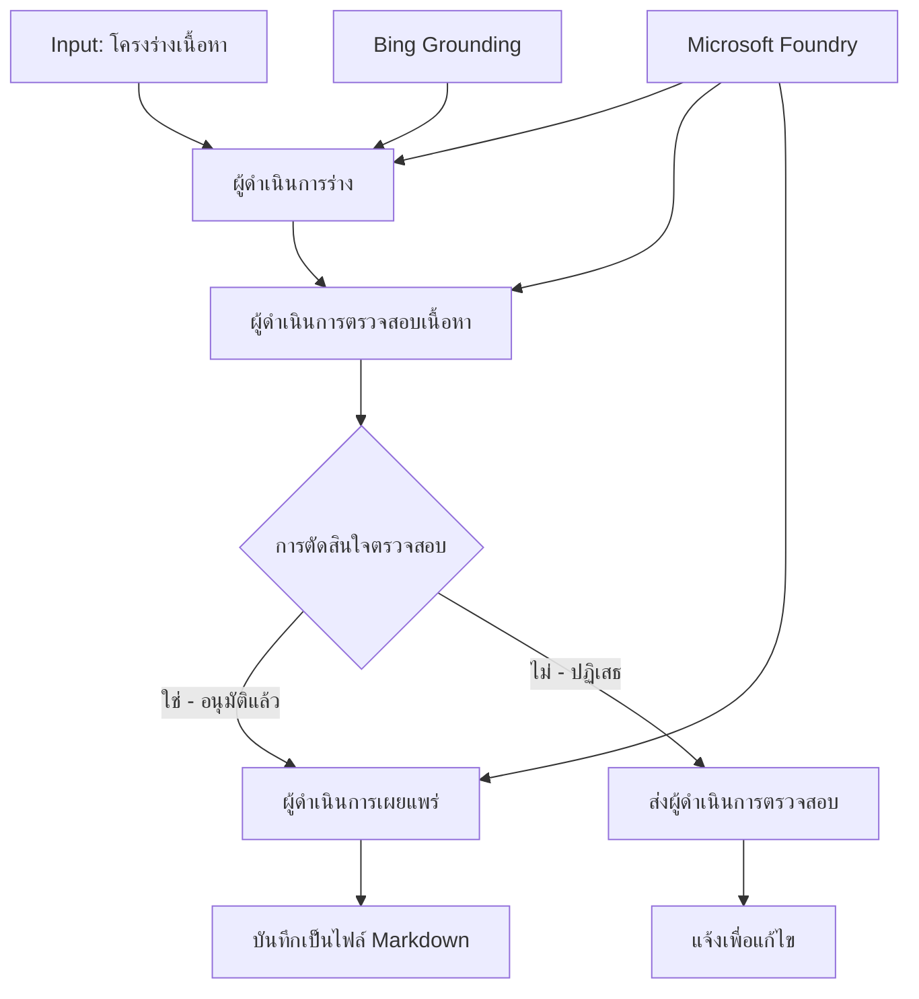

# 🔀 เวิร์กโฟลว์ตัวแทนแบบมีเงื่อนไขด้วย Microsoft Foundry (.NET)

## 📋 แบบฝึกหัดเวิร์กโฟลว์การตัดสินใจอัจฉริยะ

โน้ตบุ๊กนี้แสดงให้เห็น **รูปแบบเวิร์กโฟลว์แบบมีเงื่อนไข** โดยใช้ Microsoft Foundry และ Microsoft Agent Framework สำหรับ .NET คุณจะได้เรียนรู้วิธีสร้างเวิร์กโฟลว์ที่มีความซับซ้อน และขับเคลื่อนด้วยการตัดสินใจที่ชาญฉลาดโดยการกำหนดเส้นทางการประมวลผลตามการวิเคราะห์ AI กฎทางธุรกิจ และเงื่อนไขแบบไดนามิกสำหรับระบบอัตโนมัติระดับองค์กร

## 🎯 วัตถุประสงค์การเรียนรู้

### 🧠 **สถาปัตยกรรมการตัดสินใจอัจฉริยะ**
- **การใช้งานตรรกะเงื่อนไข**: สร้างต้นไม้การตัดสินใจที่ซับซ้อนพร้อมจุดแยกหลายจุด
- **การกำหนดเส้นทางโดยใช้ AI**: ใช้โมเดล Microsoft Foundry เพื่อกำหนดเส้นทางอย่างชาญฉลาด
- **การปรับเปลี่ยนเวิร์กโฟลว์แบบไดนามิก**: ปรับเปลี่ยนพฤติกรรมเวิร์กโฟลว์ตามการวิเคราะห์และเงื่อนไขระหว่างทำงาน
- **การผสมผสานกฎธุรกิจระดับองค์กร**: รวมกฎธุรกิจและข้อกำหนดการปฏิบัติตามลงในเวิร์กโฟลว์

### 🔀 **รูปแบบเงื่อนไขขั้นสูง**
- **การตัดสินใจหลายเกณฑ์**: ประเมินปัจจัยหลายอย่างสำหรับการกำหนดเส้นทาง
- **การประมวลผลที่รับรู้บริบท**: ตัดสินใจโดยอิงบริบทและประวัติของเวิร์กโฟลว์ที่สะสมไว้
- **การปรับเปลี่ยนเวิร์กโฟลว์แบบปรับตัวได้**: ปรับเส้นทางการประมวลผลแบบไดนามิกตามเงื่อนไขเรียลไทม์
- **การผสมผสานเครื่องมือกฎ**: ใช้เครื่องมือกฎธุรกิจขั้นสูงภายในเวิร์กโฟลว์

### 🏢 **แอปพลิเคชันแบบมีเงื่อนไขในองค์กร**
- **การจำแนกและกำหนดเส้นทางเอกสาร**: จำแนกและกำหนดเส้นทางเอกสารไปยังเวิร์กโฟลว์ที่เหมาะสมโดยอัตโนมัติ
- **การคัดแยกบริการลูกค้า**: กำหนดเส้นทางคำถามลูกค้าอย่างชาญฉลาดไปยังทีมเฉพาะทาง
- **การประมวลผลการปฏิบัติตามและความเสี่ยง**: ใช้การตรวจสอบและทบทวนตามการประเมินความเสี่ยงต่าง ๆ
- **เวิร์กโฟลว์ประกันคุณภาพ**: กำหนดเส้นทางเนื้อหาผ่านกระบวนการทบทวนตามมาตรวัดคุณภาพ

## ⚙️ ข้อกำหนดเบื้องต้นและการตั้งค่า

### 📦 **แพ็กเกจ NuGet ที่จำเป็น**

แพ็กเกจขั้นสูงสำหรับการประมวลผลเวิร์กโฟลว์แบบมีเงื่อนไข:

```xml
<!-- Core AI Framework -->
<PackageReference Include="Microsoft.Extensions.AI" Version="9.9.0" />

<!-- Azure AI Agents with Persistent State -->
<PackageReference Include="Azure.AI.Agents.Persistent" Version="1.2.0-beta.5" />

<!-- Azure Identity and Utilities -->
<PackageReference Include="Azure.Identity" Version="1.15.0" />
<PackageReference Include="System.Linq.Async" Version="6.0.3" />
<PackageReference Include="DotNetEnv" Version="3.1.1" />

<!-- Local Workflow Framework References -->
<!-- Microsoft.Agents.Workflows.dll - Advanced workflow orchestration -->
<!-- Microsoft.Agents.AI.AzureAI.dll - Microsoft Foundry integration -->
<!-- Microsoft.Agents.AI.dll - Core agent abstractions -->
```

### 🔑 **การตั้งค่า Microsoft Foundry**

**ทรัพยากร Azure ที่จำเป็น:**
- พื้นที่ทำงาน Microsoft Foundry ที่มีโมเดลประมวลผลแบบมีเงื่อนไข
- การสมัครใช้งาน Azure ที่มีโควต้าการประมวลผลและสิทธิ์ที่เหมาะสม
- โมเดล AI ที่ติดตั้งสำหรับการตัดสินใจและการวิเคราะห์เนื้อหา
- (ไม่บังคับ) การเชื่อมต่อ Bing Search API สำหรับความสามารถในการอ้างอิงฐานข้อมูล

**การตั้งค่าสภาพแวดล้อม (.env file):**
```env
# Microsoft Foundry Configuration
AZURE_AI_PROJECT_ENDPOINT=https://your-project.cognitiveservices.azure.com/
BING_CONNECTION_ID=your-bing-connection-id
```

**การตั้งค่าการรับรองความถูกต้อง:**
```csharp
// Azure CLI or Managed Identity authentication
using Azure.Identity;
var credential = new AzureCliCredential();

// Load environment configuration
DotNetEnv.Env.Load("../../../.env");
```

### 🏗️ **สถาปัตยกรรมเวิร์กโฟลว์แบบมีเงื่อนไข**



**ส่วนประกอบหลัก:**
- **Draft Executor**: ตัวแทน AI ที่สร้างร่างเนื้อหาเบื้องต้นจากโครงร่าง
- **Content Review Executor**: ตัวแทน AI ที่ประเมินคุณภาพและความสอดคล้องของร่างเนื้อหา
- **Conditional Routing**: ตรรกะการตัดสินใจเพื่อกำหนดเส้นทางตามผลการทบทวน
- **เส้นทางเผยแพร่/ทบทวน**: เส้นทางประมวลผลแยกสำหรับเนื้อหาที่ผ่านการอนุมัติและถูกปฏิเสธ
- **การจัดการสถานะ**: บำรุงรักษาบริบทเนื้อหาและการทบทวนตลอดเวิร์กโฟลว์

## 🎨 **รูปแบบการออกแบบเวิร์กโฟลว์แบบมีเงื่อนไข**

### 📋 **การผลิตเนื้อหาพร้อมเกตคุณภาพ**
```
Outline → Draft Creation → Quality Review → {Approve: Publish | Reject: Revise}
```

### 🎯 **การประมวลผลเอกสารตามความเสี่ยง**
```
Document → Risk Assessment → {Low: Standard | High: Enhanced Review}
```

### 🔍 **การกำหนดเส้นทางบริการลูกค้าอัจฉริยะ**
```
Customer Query → Analysis → {Simple: FAQ Bot | Complex: Human Agent}
```

### 💼 **เวิร์กโฟลว์ขับเคลื่อนด้วยการปฏิบัติตาม**
```
Content → Compliance Check → {Pass: Publish | Fail: Legal Review}
```

## 🏢 **ประโยชน์แบบมีเงื่อนไขสำหรับองค์กร**

### 🎯 **ระบบอัตโนมัติอัจฉริยะ**
- **การตัดสินใจอัจฉริยะ**: การกำหนดเส้นทางด้วย AI ตามการวิเคราะห์เนื้อหาและบริบท
- **การประมวลผลแบบปรับตัวได้**: เวิร์กโฟลว์ที่ปรับเปลี่ยนอัตโนมัติตามเงื่อนไขที่เปลี่ยนแปลง
- **การบังคับใช้กฎธุรกิจ**: ใช้กฎและนโยบายธุรกิจที่ซับซ้อนโดยอัตโนมัติ
- **การกำหนดเส้นทางโดยรับรู้บริบท**: การตัดสินใจโดยอิงประวัติและบริบทสะสมของเวิร์กโฟลว์

### 📈 **ความเป็นเลิศด้านการดำเนินงาน**
- **การจัดสรรทรัพยากรที่เหมาะสม**: กำหนดเส้นทางงานไปยังผู้เชี่ยวชาญและกระบวนการที่เหมาะสมที่สุด
- **ลดการแทรกแซงด้วยมือ**: การตัดสินใจอัตโนมัติทำให้ลดความจำเป็นในการกำหนดเส้นทางด้วยมือ
- **ลดเวลาการแก้ไขปัญหา**: กำหนดเส้นทางตรงไปยังผู้เชี่ยวชาญและความสามารถในการประมวลผลที่เหมาะสม
- **การใช้กฎที่สม่ำเสมอ**: การใช้กฎธุรกิจและเกณฑ์การตัดสินใจอย่างสม่ำเสมอ

### 🛡️ **การบริหารความเสี่ยงและการปฏิบัติตาม**
- **การประเมินความเสี่ยงอัตโนมัติ**: การประเมินระดับความเสี่ยงของเนื้อหาและสถานการณ์โดยใช้ AI
- **การบังคับใช้การปฏิบัติตามข้อกำหนด**: การกำหนดเส้นทางอัตโนมัติผ่านกระบวนการตามกฎระเบียบที่จำเป็น
- **การใช้โปรโตคอลความปลอดภัย**: การใช้มาตรการความปลอดภัยขั้นสูงตามการประเมินความเสี่ยง
- **การบันทึกข้อมูลตรวจสอบ**: เอกสารสมบูรณ์เกี่ยวกับการตัดสินใจและเหตุผลในการกำหนดเส้นทาง

### 📊 **การวิเคราะห์และการปรับปรุงอย่างต่อเนื่อง**
- **การวิเคราะห์การตัดสินใจ**: ติดตามประสิทธิผลและความถูกต้องของการตัดสินใจในการกำหนดเส้นทาง
- **การจดจำรูปแบบ**: ระบุแนวโน้มและรูปแบบในการตัดสินใจการกำหนดเส้นทางเมื่อเวลาผ่านไป
- **การเพิ่มประสิทธิภาพการทำงาน**: ปรับปรุงเกณฑ์การตัดสินใจและประสิทธิภาพของกำหนดเส้นทางอย่างต่อเนื่อง
- **ข่าวกรองธุรกิจ**: ให้ข้อมูลเชิงลึกเกี่ยวกับลักษณะเนื้อหาและความต้องการในการประมวลผล

### 🔧 **ความเป็นเลิศทางเทคนิค**
- **การจัดการสถานะถาวร**: รักษาสถานะที่ซับซ้อนตลอดการดำเนินเวิร์กโฟลว์
- **สถาปัตยกรรมที่ขยายได้**: รองรับความต้องการการประมวลผลแบบมีเงื่อนไขปริมาณสูง
- **ความสามารถในการผสมผสาน**: การผสมผสานอย่างราบรื่นกับระบบและกระบวนการธุรกิจที่มีอยู่
- **การตรวจสอบและความสามารถในการมองเห็น**: การติดตามสมบูรณ์ของประสิทธิภาพเวิร์กโฟลว์และการตัดสินใจ

มาสร้างเวิร์กโฟลว์องค์กรที่ขับเคลื่อนด้วยการตัดสินใจอัจฉริยะด้วย .NET กันเถอะ! 🚀

## 💻 การรันโค้ด

การใช้งานทั้งหมดอยู่ในไฟล์ `04.dotnet-agent-framework-workflow-aifoundry-condition.cs` ซึ่งแสดงเวิร์กโฟลว์ **การผลิตเนื้อหาพร้อมเกตคุณภาพ**:

### 🏗️ **สถาปัตยกรรมเวิร์กโฟลว์**

```
Content Outline → Draft Creation → Quality Review → Conditional Routing:
                                                      ├─ Approved (>200 words) → Publish
                                                      └─ Rejected (<200 words) → Review Notification
```

**ตัวแทนในเวิร์กโฟลว์:**
1. **Evangelist Agent**: สร้างร่างบทเรียนจากโครงร่างพร้อมการอ้างอิงข้อมูลด้วย Bing
2. **Content Reviewer Agent**: ประเมินคุณภาพร่าง (จำนวนคำ ความครบถ้วน)
3. **Publisher Agent**: บันทึกเนื้อหาที่ได้รับอนุมัติเป็นไฟล์ Markdown ที่มีเวลาบันทึก

**ผู้ดำเนินการแบบกำหนดเอง:**
1. **DraftExecutor**: ประสานงานการสร้างร่าง
2. **ContentReviewExecutor**: ดำเนินการประเมินคุณภาพ
3. **PublishExecutor**: จัดการการเผยแพร่เนื้อหาที่ได้รับอนุมัติ
4. **SendReviewExecutor**: จัดการการแจ้งเตือนเนื้อหาที่ถูกปฏิเสธ

### 🚀 การรันตัวอย่าง

**ข้อกำหนดเบื้องต้น:**
- ตั้งค่าพื้นที่ทำงาน Microsoft Foundry เรียบร้อย
- รับรองความถูกต้อง Azure CLI (`az login`)
- (ไม่บังคับ) การเชื่อมต่อ Bing Search สำหรับการอ้างอิงข้อมูล

```bash
# ทำให้สคริปต์สามารถเรียกใช้งานได้ (Unix/Linux/macOS)
chmod +x 04.dotnet-agent-framework-workflow-aifoundry-condition.cs

# เรียกใช้งานขั้นตอนการทำงานตามเงื่อนไข
./04.dotnet-agent-framework-workflow-aifoundry-condition.cs
```

หรือบน Windows:
```powershell
dotnet run 04.dotnet-agent-framework-workflow-aifoundry-condition.cs
```

### 📝 ผลลัพธ์ที่คาดหวัง

เวิร์กโฟลว์จะ:
1. **สร้างตัวแทน**: เริ่มต้นตัวแทน Microsoft Foundry เฉพาะทางสามตัว
2. **สร้างร่าง**: ตัวแทน Evangelist สร้างร่างบทเรียนจากโครงร่าง
3. **ทบทวนเนื้อหา**: ตัวแทน Content Reviewer ประเมินคุณภาพร่าง
4. **กำหนดเส้นทางแบบมีเงื่อนไข**:
   - **ถ้าอนุมัติ (>200 คำ)**: ตัวดำเนินการเผยแพร่บันทึกเป็นไฟล์ Markdown
   - **ถ้าปฏิเสธ (<200 คำ)**: ส่งการแจ้งเตือนการทบทวน
5. **แสดงผลลัพธ์**: แสดงผลลัพธ์สุดท้ายของเวิร์กโฟลว์

### 🔧 ตัวเลือกการปรับแต่ง

**แก้ไขเกณฑ์การทบทวน:**
```csharp
const string ContentReviewerInstructions = @"
You are a content reviewer...
1. Check if content is more than 500 words (instead of 200)
2. Verify technical accuracy
3. Ensure proper formatting
...";
```

**เพิ่มเส้นทางเงื่อนไขเพิ่มเติม:**
```csharp
var workflow = new WorkflowBuilder(draftExecutor)
    .AddEdge(draftExecutor, contentReviewerExecutor)
    .AddEdge(contentReviewerExecutor, publishExecutor, condition: GetCondition("Excellent"))
    .AddEdge(contentReviewerExecutor, editExecutor, condition: GetCondition("Good"))
    .AddEdge(contentReviewerExecutor, sendReviewerExecutor, condition: GetCondition("Poor"))
    .Build();
```

**เปลี่ยนข้อกำหนดเนื้อหา:**
```csharp
string OUTLINE_Content = @"
# Your Custom Topic
## Section 1
https://your-reference-url
## Section 2
...
";
```

### 🎯 การใช้งานในโลกจริง

รูปแบบเวิร์กโฟลว์แบบมีเงื่อนไขนี้เหมาะสำหรับ:
- **ระบบจัดการเนื้อหา**: เวิร์กโฟลว์บรรณาธิการอัตโนมัติพร้อมเกตคุณภาพ
- **การประมวลผลเอกสาร**: กำหนดเส้นทางเอกสารตามการจำแนกและการปฏิบัติตาม
- **ฝ่ายสนับสนุนลูกค้า**: กำหนดเส้นทางตั๋วอย่างชาญฉลาดตามความซับซ้อนและความเร่งด่วน
- **การทบทวนทางกฎหมาย**: กำหนดเส้นทางสัญญาตามการประเมินความเสี่ยงและมูลค่า
- **กระบวนการทรัพยากรบุคคล**: กำหนดเส้นทางใบสมัครผ่านเวิร์กโฟลว์คัดกรองที่เหมาะสม

### 🔍 การทำความเข้าใจตรรกะเงื่อนไข

**ฟังก์ชันเงื่อนไข:**
```csharp
public Func<object?, bool> GetCondition(string expectedResult) =>
    reviewResult => reviewResult is ReviewResult review && review.Result == expectedResult;
```

ฟังก์ชันนี้สร้างฟังก์ชันเงื่อนไขที่:
1. ตรวจสอบว่าผลลัพธ์เป็นประเภท `ReviewResult` หรือไม่
2. เปรียบเทียบคุณสมบัติ `Result` กับค่าที่คาดหวัง
3. คืนค่า true/false เพื่อกำหนดเส้นทาง

**เงื่อนไขขอบเวิร์กโฟลว์:**
```csharp
.AddEdge(contentReviewerExecutor, publishExecutor, condition: GetCondition("Yes"))
.AddEdge(contentReviewerExecutor, sendReviewerExecutor, condition: GetCondition("No"))
```

### 📊 ฟีเจอร์ขั้นสูง

**การตรวจสอบ JSON Schema:**
เวิร์กโฟลว์ใช้ JSON schemas เพื่อยืนยันการตอบสนองที่มีโครงสร้าง:

```csharp
// Define response structure
public class ReviewResult
{
    [JsonPropertyName("review_result")]
    public string Result { get; set; } = string.Empty;
    
    [JsonPropertyName("reason")]
    public string Reason { get; set; } = string.Empty;
    
    [JsonPropertyName("draft_content")]
    public string DraftContent { get; set; } = string.Empty;
}

// Apply to agent
ResponseFormat = ChatResponseFormat.ForJsonSchema(
    AIJsonUtilities.CreateJsonSchema(typeof(ReviewResult)), 
    "ReviewResult", 
    "Review Result From DraftContent"
)
```

**การผสมผสานการอ้างอิงข้อมูล Bing:**
ตัวแทน Evangelist ใช้การอ้างอิงข้อมูล Bing เพื่อเข้าถึงข้อมูลเรียลไทม์:

```csharp
var bingGroundingConfig = new BingGroundingSearchConfiguration(bing_conn_id);
BingGroundingToolDefinition bingGroundingTool = new(
    new BingGroundingSearchToolParameters([bingGroundingConfig])
);
```

ทำให้ตัวแทนสามารถติดตาม URL ในโครงร่างและดึงข้อมูลปัจจุบันได้

### 🛡️ การจัดการข้อผิดพลาด

เวิร์กโฟลว์รวมการจัดการข้อผิดพลาดที่เข้มงวดสำหรับเนื้อหาที่ถูกปฏิเสธ:
- ความล้มเหลวในการทบทวนจะกระตุ้นเส้นทางทางเลือก
- การแจ้งเตือนให้เหตุผลการปฏิเสธที่ชัดเจน
- เนื้อหาถูกเก็บไว้สำหรับการแก้ไขใหม่

### 🔄 การขยายเวิร์กโฟลว์

**เพิ่มลูปการแก้ไข:**
สร้างลูปฟีดแบ็คที่สร้างร่างเนื้อหาใหม่โดยอัตโนมัติ:

```csharp
.AddEdge(contentReviewerExecutor, publishExecutor, condition: GetCondition("Yes"))
.AddEdge(contentReviewerExecutor, draftExecutor, condition: GetCondition("No")) // Loop back
```

**ใช้งานการทบทวนหลายระดับ:**
เพิ่มขั้นตอนการทบทวนหลายระดับพร้อมเกณฑ์ที่แตกต่างกัน:

```csharp
.AddEdge(draftExecutor, technicalReviewer)
.AddEdge(technicalReviewer, editorialReviewer, condition: GetCondition("TechPass"))
.AddEdge(editorialReviewer, publishExecutor, condition: GetCondition("EditPass"))
```

รูปแบบเวิร์กโฟลว์แบบมีเงื่อนไขนี้เป็นพื้นฐานสำหรับการสร้างระบบอัตโนมัติองค์กรอัจฉริยะและซับซ้อน! 🚀

---

<!-- CO-OP TRANSLATOR DISCLAIMER START -->
**ปฏิเสธความรับผิดชอบ**:
เอกสารนี้ได้รับการแปลโดยใช้บริการแปลภาษา AI [Co-op Translator](https://github.com/Azure/co-op-translator) ขณะที่เราพยายามให้ความถูกต้อง โปรดทราบว่าการแปลโดยอัตโนมัติอาจมีข้อผิดพลาดหรือความไม่ถูกต้อง เอกสารต้นฉบับในภาษาต้นทางควรถูกพิจารณาเป็นแหล่งข้อมูลที่เชื่อถือได้ สำหรับข้อมูลที่สำคัญ แนะนำให้ใช้การแปลโดยมนุษย์มืออาชีพ เราไม่รับผิดชอบต่อความเข้าใจผิดหรือการตีความที่ผิดพลาดที่เกิดขึ้นจากการใช้การแปลนี้
<!-- CO-OP TRANSLATOR DISCLAIMER END -->