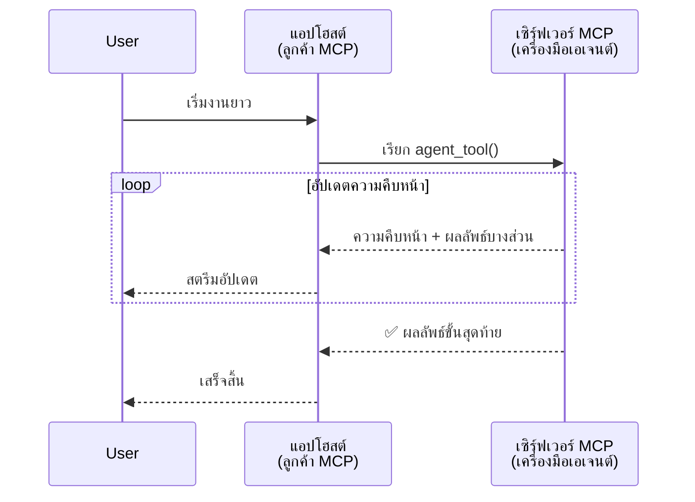
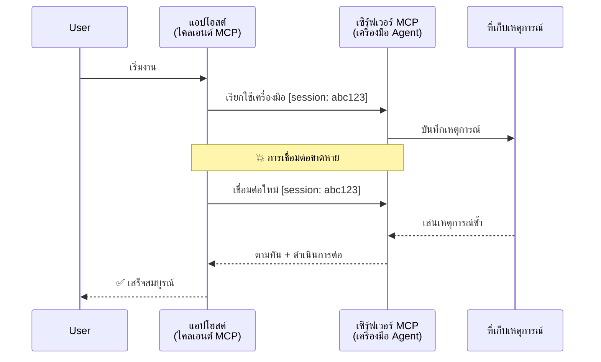
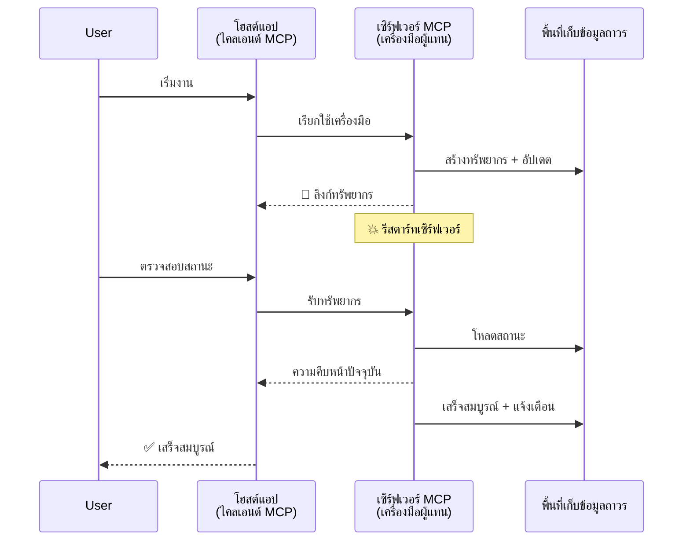
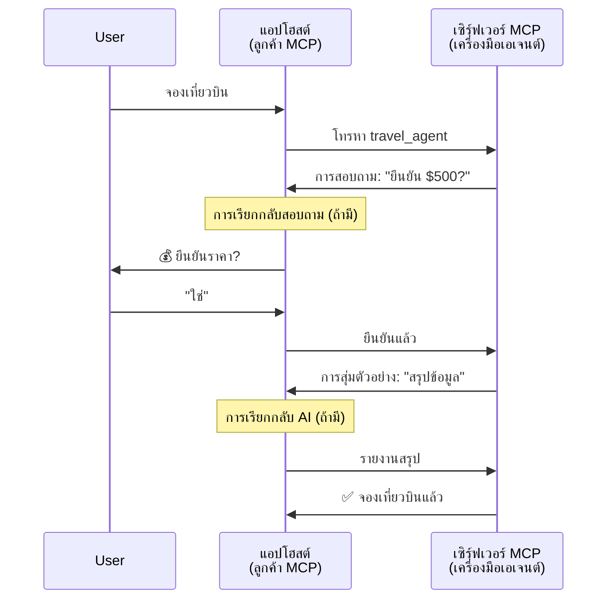
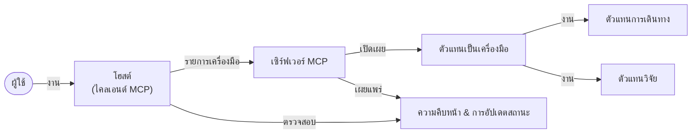

# การสร้างระบบการสื่อสารระหว่างเอเจนต์ด้วย MCP

> สรุปย่อ - คุณสามารถสร้างการสื่อสาร Agent2Agent บน MCP ได้หรือไม่? ได้แน่นอน!

MCP ได้พัฒนาขึ้นอย่างมากเกินเป้าหมายเดิมของการ "ให้บริบทกับ LLMs" โดยมีการปรับปรุงล่าสุดรวมถึง [สตรีมที่สามารถต่อได้](https://modelcontextprotocol.io/docs/concepts/transports#resumability-and-redelivery), [elicitation](https://modelcontextprotocol.io/specification/2025-06-18/client/elicitation), [sampling](https://modelcontextprotocol.io/specification/2025-06-18/client/sampling), และการแจ้งเตือน ([ความคืบหน้า](https://modelcontextprotocol.io/specification/2025-06-18/basic/utilities/progress) และ [ทรัพยากร](https://modelcontextprotocol.io/specification/2025-06-18/schema#resourceupdatednotification)) MCP จึงกลายเป็นรากฐานที่แข็งแกร่งสำหรับสร้างระบบการสื่อสารที่ซับซ้อนระหว่างเอเจนต์

## ความเข้าใจผิดเกี่ยวกับเอเจนต์/เครื่องมือ

เมื่อมีนักพัฒนามากขึ้นที่สำรวจเครื่องมือที่มีพฤติกรรมเอเจนต์ (ทำงานเป็นเวลานาน อาจต้องการอินพุตเพิ่มเติมระหว่างการดำเนินงาน ฯลฯ) ความเข้าใจผิดร่วมกันคือ MCP ไม่เหมาะสม เนื่องจากตัวอย่างแรกของเครื่องมือของมันเน้นเฉพาะรูปแบบคำขอ-ตอบกลับที่เรียบง่าย

ภาพลักษณ์นี้ล้าสมัยแล้ว สเปค MCP ได้รับการปรับปรุงอย่างมีนัยสำคัญในช่วงไม่กี่เดือนที่ผ่านมา ด้วยฟีเจอร์ที่ช่วยปิดช่องว่างในการสร้างพฤติกรรมเอเจนต์ที่ทำงานระยะยาว:

- **สตรีมมิ่ง & ผลลัพธ์บางส่วน**: การอัปเดตความคืบหน้าแบบเรียลไทม์ระหว่างการดำเนินการ
- **การต่อเนื่อง**: ลูกค้าสามารถเชื่อมต่อใหม่และดำเนินการต่อหลังจากถูกตัดการเชื่อมต่อ
- **ความทนทาน**: ผลลัพธ์อยู่รอดจากการรีสตาร์ทเซิร์ฟเวอร์ (เช่น ผ่านลิงก์ทรัพยากร)
- **หลายรอบ**: อินพุตโต้ตอบระหว่างการดำเนินงานผ่าน elicitation และ sampling

ฟีเจอร์เหล่านี้สามารถรวมกันเพื่อเปิดใช้งานแอปพลิเคชันเอเจนต์ที่ซับซ้อนและหลายเอเจนต์ โดยทั้งหมดทำงานบนโปรโตคอล MCP

สำหรับการอ้างอิง เราจะเรียกเอเจนต์ว่า "เครื่องมือ" ที่มีอยู่บนเซิร์ฟเวอร์ MCP ซึ่งหมายถึงการมีแอปพลิเคชันโฮสต์ที่ใช้งานไคลเอนต์ MCP ที่สร้างเซสชันกับเซิร์ฟเวอร์ MCP และสามารถเรียกใช้เอเจนต์ได้

## อะไรทำให้เครื่องมือ MCP เป็น "เอเจนต์"?

ก่อนลงลึกในด้านการสร้าง ให้เรากำหนดว่าความสามารถด้านโครงสร้างพื้นฐานใดที่จำเป็นเพื่อรองรับเอเจนต์ที่ทำงานระยะยาว

> เราจะนิยามเอเจนต์ว่าเป็นเอนทิตีที่สามารถทำงานโดยอิสระในระยะเวลานาน มีความสามารถจัดการงานซับซ้อนซึ่งอาจต้องมีหลายปฏิสัมพันธ์หรือการปรับเปลี่ยนตามข้อเสนอแนะแบบเรียลไทม์

### 1. สตรีมมิ่ง & ผลลัพธ์บางส่วน

รูปแบบคำขอ-ตอบแบบดั้งเดิมไม่เหมาะกับงานที่ทำงานระยะยาว เอเจนต์จึงต้องให้:

- การอัปเดตความคืบหน้าแบบเรียลไทม์
- ผลลัพธ์ระหว่างทาง

**การสนับสนุนของ MCP**: การแจ้งเตือนอัปเดตทรัพยากรช่วยให้สามารถสตรีมผลลัพธ์บางส่วนได้ แม้ว่าจะต้องออกแบบอย่างระมัดระวังเพื่อหลีกเลี่ยงความขัดแย้งกับโมเดลคำขอ/ตอบ 1:1 ของ JSON-RPC

| ฟีเจอร์                  | กรณีการใช้งาน                                                                                                                                               | การสนับสนุน MCP                                                                                 |
| ------------------------ | ------------------------------------------------------------------------------------------------------------------------------------------------------------ | ----------------------------------------------------------------------------------------------- |
| การอัปเดตความคืบหน้าแบบเรียลไทม์ | ผู้ใช้ขอให้เอเจนต์ทำงานย้ายโค้ดเบส เอเจนต์สตรีมความคืบหน้า: "10% - วิเคราะห์ dependencies... 25% - แปลงไฟล์ TypeScript... 50% - อัปเดต imports..." | ✅ การแจ้งเตือนความคืบหน้า                                                                          |
| ผลลัพธ์บางส่วน           | งาน "สร้างหนังสือ" สตรีมผลลัพธ์บางส่วน เช่น 1) โครงเรื่อง, 2) รายการบท, 3) แต่ละบทที่เสร็จสิ้นแล้ว โฮสต์สามารถตรวจสอบ ยกเลิก หรือเปลี่ยนเส้นทางได้ในทุกขั้นตอน | ✅ การแจ้งเตือนสามารถ "ขยาย" เพื่อรวมผลลัพธ์บางส่วน ดูข้อเสนอใน PR 383, 776                        |

<div align="center" style="font-style: italic; font-size: 0.95em; margin-bottom: 0.5em;">
<strong>รูปที่ 1:</strong> แผนภาพนี้แสดงให้เห็นว่าเอเจนต์ MCP สตรีมการอัปเดตความคืบหน้าแบบเรียลไทม์และผลลัพธ์บางส่วนไปยังแอปพลิเคชันโฮสต์ระหว่างงานที่ทำงานยาวนาน ทำให้ผู้ใช้สามารถตรวจสอบการดำเนินงานได้แบบเรียลไทม์
</div>



### 2. การต่อเนื่อง (Resumability)

เอเจนต์จะต้องจัดการกับการ断การเชื่อมต่อเครือข่ายได้อย่างราบรื่น:

- เชื่อมต่อใหม่หลังจาก (ไคลเอนต์) ตัดการเชื่อมต่อ
- ดำเนินการต่อจากที่ค้างไว้ (ส่งข้อความซ้ำ)

**การสนับสนุนของ MCP**: ปัจจุบัน MCP StreamableHTTP transport รองรับการต่อเนื่องของเซสชันและการส่งข้อความซ้ำโดยใช้ session IDs และ last event IDs สิ่งสำคัญคือเซิร์ฟเวอร์ต้องมี EventStore ที่รองรับการเล่นซ้ำของเหตุการณ์เมื่อไคลเอนต์เชื่อมต่อใหม่  
โปรดทราบว่ามีคำเสนอแนะจากชุมชน (PR #975) ที่สำรวจการสตรีมที่สามารถต่อเนื่องแบบไม่ขึ้นกับชนิดของทรานสปอร์ต

| ฟีเจอร์        | กรณีการใช้งาน                                                                                                                                                | การสนับสนุน MCP                                                               |
| -------------- | ------------------------------------------------------------------------------------------------------------------------------------------------------------- | ----------------------------------------------------------------------------- |
| การต่อเนื่อง     | ไคลเอนต์ตัดการเชื่อมต่อระหว่างงานที่ทำงานยาวนาน เมื่อต่อใหม่จะสามารถดำเนินการเซสชันต่อโดยเล่นเหตุการณ์ที่พลาดไป ทำงานต่ออย่างราบรื่นจากจุดเดิม                      | ✅ StreamableHTTP transport พร้อม session ID, การเล่นเหตุการณ์ซ้ำ, และ EventStore |

<div align="center" style="font-style: italic; font-size: 0.95em; margin-bottom: 0.5em;">
<strong>รูปที่ 2:</strong> แผนภาพนี้แสดงให้เห็นว่า MCP StreamableHTTP transport และ event store ช่วยให้สามารถดำเนินการเซสชันต่อเนื่องได้อย่างราบรื่น: หากไคลเอนต์ตัดการเชื่อมต่อสามารถเชื่อมต่อใหม่และเล่นเหตุการณ์ที่พลาดไปได้ ทำให้งานดำเนินต่อโดยไม่สูญเสียความคืบหน้า
</div>



### 3. ความทนทาน (Durability)

เอเจนต์ที่ทำงานระยะยาวต้องการสถานะที่เก็บรักษาได้:

- ผลลัพธ์อยู่รอดจากการรีสตาร์ทเซิร์ฟเวอร์
- สถานะสามารถดึงมาได้โดยไม่ขึ้นกับเซสชัน
- การติดตามความคืบหน้าข้ามเซสชัน

**การสนับสนุนของ MCP**: MCP ปัจจุบันรองรับ Resource link return type สำหรับการเรียกใช้เครื่องมือ ปัจจุบันรูปแบบที่ใช้ได้คือการออกแบบเครื่องมือที่สร้างทรัพยากรและคืนลิงก์ทรัพยากรทันที เครื่องมือสามารถดำเนินการงานในแบ็คกราวด์และอัปเดตทรัพยากรนั้น เมื่อเป็นเช่นนี้ ไคลเอนต์สามารถเลือกที่จะสอบถามสถานะทรัพยากรเพื่อนำผลลัพธ์บางส่วนหรือทั้งหมด (ขึ้นอยู่กับการอัปเดตทรัพยากรที่เซิร์ฟเวอร์ให้) หรือสมัครรับการแจ้งเตือนอัปเดตทรัพยากรได้

ข้อจำกัดอย่างหนึ่งคือการสอบถามทรัพยากรหรือสมัครรับการอัปเดตอาจใช้ทรัพยากรจำนวนมากโดยเฉพาะเมื่อระบบใหญ่ขึ้น มีข้อเสนอแนะจากชุมชน (รวมถึง #992) ที่สำรวจความเป็นไปได้ในการรวม webhook หรือทริกเกอร์ที่เซิร์ฟเวอร์โทรแจ้งไคลเอนต์/แอปโฮสต์เมื่อมีการอัปเดต

| ฟีเจอร์     | กรณีการใช้งาน                                                                                                                                        | การสนับสนุน MCP                                                      |
| ----------- | ----------------------------------------------------------------------------------------------------------------------------------------------------- | -------------------------------------------------------------------- |
| ความทนทาน    | เซิร์ฟเวอร์ล่มระหว่างงานโอนย้ายข้อมูล ผลลัพธ์และความคืบหน้ารอดจากการรีสตาร์ท ไคลเอนต์สามารถตรวจสอบสถานะและดำเนินการต่อจากทรัพยากรที่เก็บถาวรได้         | ✅ ลิงก์ทรัพยากรพร้อมการเก็บรักษาและแจ้งเตือนสถานะ                |

ปัจจุบัน รูปแบบทั่วไปคือออกแบบเครื่องมือที่สร้างทรัพยากรและคืนลิงก์ทรัพยากรทันที เครื่องมือสามารถทำงานในพื้นหลัง ดำเนินงาน แจ้งเตือนทรัพยากรซึ่งทำหน้าที่เป็นการอัปเดตความคืบหน้าหรือรวมถึงผลลัพธ์บางส่วน และอัปเดตเนื้อหาในทรัพยากรถ้าจำเป็น

<div align="center" style="font-style: italic; font-size: 0.95em; margin-bottom: 0.5em;">
<strong>รูปที่ 3:</strong> แผนภาพนี้แสดงให้เห็นว่าเอเจนต์ MCP ใช้ทรัพยากรที่คงทนและการแจ้งเตือนสถานะเพื่อให้มั่นใจว่างานระยะยาวจะยังคงอยู่หลังการรีสตาร์ทเซิร์ฟเวอร์ ทำให้ไคลเอนต์สามารถตรวจสอบความคืบหน้าและดึงผลลัพธ์แม้หลังเกิดความล้มเหลว
</div>



### 4. การโต้ตอบหลายรอบ (Multi-Turn Interactions)

เอเจนต์มักต้องการอินพุตเพิ่มเติมกลางกระบวนการ:

- การชี้แจงหรือการอนุมัติจากมนุษย์
- ความช่วยเหลือจาก AI สำหรับการตัดสินใจที่ซับซ้อน
- การปรับพารามิเตอร์แบบไดนามิก

**การสนับสนุนของ MCP**: รองรับเต็มที่ผ่าน sampling (สำหรับอินพุต AI) และ elicitation (สำหรับอินพุตมนุษย์)

| ฟีเจอร์                  | กรณีการใช้งาน                                                                                                                                   | การสนับสนุน MCP                                        |
| ------------------------ | ------------------------------------------------------------------------------------------------------------------------------------------------ | ----------------------------------------------------- |
| การโต้ตอบหลายรอบ          | เอเจนต์จองทริปถามยืนยันราคาจากผู้ใช้ จากนั้นขอ AI สรุปข้อมูลการเดินทางก่อนทำธุรกรรมการจองให้เสร็จสมบูรณ์                                           | ✅ Elicitation สำหรับอินพุตมนุษย์, sampling สำหรับอินพุต AI |

<div align="center" style="font-style: italic; font-size: 0.95em; margin-bottom: 0.5em;">
<strong>รูปที่ 4:</strong> แผนภาพนี้แสดงให้เห็นว่าเอเจนต์ MCP สามารถโต้ตอบแบบโต้ตอบเพื่อขออินพุตจากมนุษย์หรือขอความช่วยเหลือจาก AI ในระหว่างการดำเนินงาน สนับสนุนเวิร์กโฟลว์หลายรอบที่ซับซ้อนเช่นการยืนยันและการตัดสินใจแบบไดนามิก
</div>



## การนำเอเจนต์ที่ทำงานระยะยาวไปใช้บน MCP - ภาพรวมโค้ด

ในบทความนี้ เราได้จัดเตรียม [ที่เก็บโค้ด](https://github.com/victordibia/ai-tutorials/tree/main/MCP%20Agents) ที่มีการใช้งานเอเจนต์ระยะยาวโดยใช้ MCP Python SDK กับ StreamableHTTP transport สำหรับ session resumption และ message redelivery ตัวอย่างนี้แสดงให้เห็นว่าความสามารถของ MCP สามารถนำมารวมกันเพื่อเปิดใช้งานพฤติกรรมแบบเอเจนต์ที่ซับซ้อนได้อย่างไร

โดยเฉพาะอย่างยิ่ง เราจะสร้างเซิร์ฟเวอร์ที่มีเครื่องมือเอเจนต์หลักสองตัว:

- **เอเจนต์เดินทาง** - จำลองบริการจองการเดินทางพร้อมการยืนยันราคาโดยใช้ elicitation
- **เอเจนต์วิจัย** - ทำงานวิจัยด้วยสรุปช่วยเหลือ AI ผ่าน sampling

เอเจนต์ทั้งสองนี้แสดงให้เห็นการอัปเดตความคืบหน้าแบบเรียลไทม์ การยืนยันเชิงโต้ตอบ และความสามารถในการดำเนินเซสชันต่อได้เต็มรูปแบบ

### แนวความคิดหลักของการนำไปใช้

ส่วนต่อไปนี้จะแสดงการใช้งานฝั่งเซิร์ฟเวอร์ของเอเจนต์และการจัดการฝั่งโฮสต์สำหรับแต่ละความสามารถ:

#### สตรีมมิ่ง & การอัปเดตความคืบหน้า - สถานะงานแบบเรียลไทม์

สตรีมมิ่งช่วยให้เอเจนต์ส่งการอัปเดตความคืบหน้าแบบเรียลไทม์ระหว่างงานระยะยาว เพื่อให้ผู้ใช้ทราบสถานะงานและผลลัพธ์ระหว่างทาง

**การใช้งานฝั่งเซิร์ฟเวอร์ (เอเจนต์ส่งการแจ้งเตือนความคืบหน้า):**

```python
# จาก server/server.py - ตัวแทนท่องเที่ยวส่งอัปเดตความคืบหน้า
for i, step in enumerate(steps):
    await ctx.session.send_progress_notification(
        progress_token=ctx.request_id,
        progress=i * 25,
        total=100,
        message=step,
        related_request_id=str(ctx.request_id)
    )
    await anyio.sleep(2)  # จำลองงาน

# ทางเลือก: บันทึกข้อความสำหรับอัปเดตทีละขั้นตอนอย่างละเอียด
await ctx.session.send_log_message(
    level="info",
    data=f"Processing step {current_step}/{steps} ({progress_percent}%)",
    logger="long_running_agent",
    related_request_id=ctx.request_id,
)
```

**การใช้งานฝั่งไคลเอนต์ (โฮสต์รับการอัปเดตความคืบหน้า):**

```python
# จาก client/client.py - ตัวจัดการไคลเอนต์สำหรับการแจ้งเตือนแบบเรียลไทม์
async def message_handler(message) -> None:
    if isinstance(message, types.ServerNotification):
        if isinstance(message.root, types.LoggingMessageNotification):
            console.print(f"📡 [dim]{message.root.params.data}[/dim]")
        elif isinstance(message.root, types.ProgressNotification):
            progress = message.root.params
            console.print(f"🔄 [yellow]{progress.message} ({progress.progress}/{progress.total})[/yellow]")

# ลงทะเบียนตัวจัดการข้อความเมื่อสร้างเซสชัน
async with ClientSession(
    read_stream, write_stream,
    message_handler=message_handler
) as session:
```

#### Elicitation - การขออินพุตจากผู้ใช้

Elicitation ช่วยให้เอเจนต์ขออินพุตจากผู้ใช้กลางการดำเนินงาน ซึ่งจำเป็นสำหรับการยืนยัน การชี้แจง หรือการอนุมัติระหว่างงานระยะยาว

**การใช้งานฝั่งเซิร์ฟเวอร์ (เอเจนต์ขอการยืนยัน):**

```python
# จาก server/server.py - ตัวแทนท่องเที่ยวขอการยืนยันราค
elicit_result = await ctx.session.elicit(
    message=f"Please confirm the estimated price of $1200 for your trip to {destination}",
    requestedSchema=PriceConfirmationSchema.model_json_schema(),
    related_request_id=ctx.request_id,
)

if elicit_result and elicit_result.action == "accept":
    # ดำเนินการจองต่อ
    logger.info(f"User confirmed price: {elicit_result.content}")
elif elicit_result and elicit_result.action == "decline":
    # ยกเลิกการจอง
    booking_cancelled = True
```

**การใช้งานฝั่งไคลเอนต์ (โฮสต์ให้ callback สำหรับ elicitation):**

```python
# จาก client/client.py - การจัดการคำขอการเก็บรวบรวมข้อมูลของลูกค้า
async def elicitation_callback(context, params):
    console.print(f"💬 Server is asking for confirmation:")
    console.print(f"   {params.message}")

    response = console.input("Do you accept? (y/n): ").strip().lower()

    if response in ['y', 'yes']:
        return types.ElicitResult(
            action="accept",
            content={"confirm": True, "notes": "Confirmed by user"}
        )
    else:
        return types.ElicitResult(
            action="decline",
            content={"confirm": False, "notes": "Declined by user"}
        )

# ลงทะเบียน callback เมื่อสร้างเซสชัน
async with ClientSession(
    read_stream, write_stream,
    elicitation_callback=elicitation_callback
) as session:
```

#### Sampling - การขอความช่วยเหลือจาก AI

Sampling ช่วยให้เอเจนต์ขอความช่วยเหลือ LLM สำหรับการตัดสินใจซับซ้อนหรือการสร้างเนื้อหาระหว่างดำเนินการ เปิดโอกาสเวิร์กโฟลว์ผสมมนุษย์-AI

**การใช้งานฝั่งเซิร์ฟเวอร์ (เอเจนต์ขอความช่วยเหลือจาก AI):**

```python
# จาก server/server.py - ตัวแทนวิจัยร้องขอสรุปโดย AI
sampling_result = await ctx.session.create_message(
    messages=[
        SamplingMessage(
            role="user",
            content=TextContent(type="text", text=f"Please summarize the key findings for research on: {topic}")
        )
    ],
    max_tokens=100,
    related_request_id=ctx.request_id,
)

if sampling_result and sampling_result.content:
    if sampling_result.content.type == "text":
        sampling_summary = sampling_result.content.text
        logger.info(f"Received sampling summary: {sampling_summary}")
```

**การใช้งานฝั่งไคลเอนต์ (โฮสต์ให้ callback สำหรับ sampling):**

```python
# จาก client/client.py - การจัดการคำขอตัวอย่างจากไคลเอนต์
async def sampling_callback(context, params):
    message_text = params.messages[0].content.text if params.messages else 'No message'
    console.print(f"🧠 Server requested sampling: {message_text}")

    # ในแอปพลิเคชันจริง สามารถเรียกใช้ API ของ LLM ได้
    # สำหรับการสาธิต เราจัดเตรียมการตอบกลับจำลอง
    mock_response = "Based on current research, MCP has evolved significantly..."

    return types.CreateMessageResult(
        role="assistant",
        content=types.TextContent(type="text", text=mock_response),
        model="interactive-client",
        stopReason="endTurn"
    )

# ลงทะเบียน callback เมื่อสร้างเซสชัน
async with ClientSession(
    read_stream, write_stream,
    sampling_callback=sampling_callback,
    elicitation_callback=elicitation_callback
) as session:
```

#### การต่อเนื่อง - การดำเนินเซสชันต่อเนื่องข้ามการตัดการเชื่อมต่อ

การต่อเนื่องช่วยให้เอเจนต์ที่ทำงานระยะยาวสามารถรอดจากการตัดการเชื่อมต่อของไคลเอนต์และดำเนินการต่ออย่างราบรื่นเมื่อเชื่อมต่อใหม่ ซึ่งเกิดขึ้นผ่าน event store และโทเค็นต่อเนื่อง

**การใช้งาน Event Store (เซิร์ฟเวอร์เก็บสถานะเซสชัน):**

```python
# จาก server/event_store.py - ตัวจัดเก็บเหตุการณ์ในหน่วยความจำที่เรียบง่าย
class SimpleEventStore(EventStore):
    def __init__(self):
        self._events: list[tuple[StreamId, EventId, JSONRPCMessage]] = []
        self._event_id_counter = 0

    async def store_event(self, stream_id: StreamId, message: JSONRPCMessage) -> EventId:
        """Store an event and return its ID."""
        self._event_id_counter += 1
        event_id = str(self._event_id_counter)
        self._events.append((stream_id, event_id, message))
        return event_id

    async def replay_events_after(self, last_event_id: EventId, send_callback: EventCallback) -> StreamId | None:
        """Replay events after the specified ID for resumption."""
        # ค้นหาเหตุการณ์หลังจากเหตุการณ์สุดท้ายที่รู้จักและเล่นซ้ำ
        for _, event_id, message in self._events[start_index:]:
            await send_callback(EventMessage(message, event_id))

# จาก server/server.py - ส่งผ่านตัวจัดเก็บเหตุการณ์ไปยังผู้จัดการเซสชัน
def create_server_app(event_store: Optional[EventStore] = None) -> Starlette:
    server = ResumableServer()

    # สร้างผู้จัดการเซสชันพร้อมตัวจัดเก็บเหตุการณ์เพื่อการสืบต่อ
    session_manager = StreamableHTTPSessionManager(
        app=server,
        event_store=event_store,  # ตัวจัดเก็บเหตุการณ์ช่วยให้สามารถสืบต่อเซสชันได้
        json_response=False,
        security_settings=security_settings,
    )

    return Starlette(routes=[Mount("/mcp", app=session_manager.handle_request)])

# การใช้งาน: เริ่มต้นด้วยตัวจัดเก็บเหตุการณ์
event_store = SimpleEventStore()
app = create_server_app(event_store)
```

**ข้อมูลเมตาไคลเอนต์พร้อมโทเค็นต่อเนื่อง (ไคลเอนต์เชื่อมต่อใหม่โดยใช้สถานะที่เก็บไว้):**

```python
# จาก client/client.py - การกลับมาทำงานของไคลเอนต์พร้อมข้อมูลเมตา
if existing_tokens and existing_tokens.get("resumption_token"):
    # ใช้โทเค็นการกลับมาทำงานที่มีอยู่เพื่อดำเนินการต่อจากที่หยุดไว้
    metadata = ClientMessageMetadata(
        resumption_token=existing_tokens["resumption_token"],
    )
else:
    # สร้าง callback เพื่อบันทึกโทเค็นการกลับมาทำงานเมื่อได้รับ
    def enhanced_callback(token: str):
        protocol_version = getattr(session, 'protocol_version', None)
        token_manager.save_tokens(session_id, token, protocol_version, command, args)

    metadata = ClientMessageMetadata(
        on_resumption_token_update=enhanced_callback,
    )

# ส่งคำขอพร้อมข้อมูลเมตาการกลับมาทำงาน
result = await session.send_request(
    types.ClientRequest(
        types.CallToolRequest(
            method="tools/call",
            params=types.CallToolRequestParams(name=command, arguments=args)
        )
    ),
    types.CallToolResult,
    metadata=metadata,
)
```

แอปพลิเคชันโฮสต์จะเก็บ session IDs และโทเค็นต่อเนื่องไว้ในเครื่อง ทำให้สามารถเชื่อมต่อกับเซสชันที่มีอยู่โดยไม่สูญเสียความคืบหน้าหรือสถานะ

### การจัดระเบียบโค้ด

<div align="center" style="font-style: italic; font-size: 0.95em; margin-bottom: 0.5em;">
<strong>รูปที่ 5:</strong> สถาปัตยกรรมระบบเอเจนต์บนพื้นฐาน MCP
</div>



**ไฟล์สำคัญ:**

- **`server/server.py`** - เซิร์ฟเวอร์ MCP ที่ต่อเนื่องได้ พร้อมเอเจนต์เดินทางและวิจัยที่แสดง elicitation, sampling และการอัปเดตความคืบหน้า
- **`client/client.py`** - แอปพลิเคชันโฮสต์โต้ตอบกับผู้ใช้ที่รองรับการดำเนินการต่อ, จัดการ callback และโทเค็น
- **`server/event_store.py`** - การใช้งาน event store ที่ช่วยให้เซสชันต่อเนื่องและส่งข้อความซ้ำ

## การขยายสู่การสื่อสารหลายเอเจนต์บน MCP

การใช้งานข้างต้นสามารถขยายสู่ระบบหลายเอเจนต์ได้โดยการเพิ่มความฉลาดและขอบเขตของแอปพลิเคชันโฮสต์:

- **การแยกงานอย่างชาญฉลาด**: โฮสต์วิเคราะห์คำขอผู้ใช้ที่ซับซ้อนและแยกงานย่อยให้กับเอเจนต์เฉพาะทางต่าง ๆ
- **การประสานงานระหว่างหลายเซิร์ฟเวอร์**: โฮสต์รักษาการเชื่อมต่อกับเซิร์ฟเวอร์ MCP หลายแห่ง แต่ละแห่งมีความสามารถเอเจนต์ที่แตกต่างกัน
- **การจัดการสถานะงาน**: โฮสต์ติดตามความคืบหน้าในงานเอเจนต์หลายงานพร้อมกัน จัดการความสัมพันธ์และลำดับงาน
- **ความยืดหยุ่นและการลองใหม่**: โฮสต์จัดการความล้มเหลว ใช้ตรรกะลองใหม่ และเปลี่ยนเส้นทางงานเมื่อเอเจนต์ไม่พร้อมใช้งาน
- **การสังเคราะห์ผลลัพธ์**: โฮสต์รวมผลลัพธ์จากเอเจนต์หลายตัวให้เป็นผลลัพธ์สุดท้ายที่สมบูรณ์

โฮสต์จะพัฒนาจากไคลเอนต์ธรรมดาเป็นออร์เคสเตรเตอร์ที่ชาญฉลาด ควบคุมความสามารถแจกจ่ายของเอเจนต์พร้อมรักษารากฐานโปรโตคอล MCP เดิม

## สรุป

ความสามารถที่เพิ่มขึ้นของ MCP เช่น การแจ้งเตือนทรัพยากร, elicitation/sampling, สตรีมที่สามารถต่อได้, และทรัพยากรที่คงทน ช่วยให้การโต้ตอบระหว่างเอเจนต์ที่ซับซ้อนเกิดขึ้นได้พร้อมรักษาความเรียบง่ายของโปรโตคอล

## เริ่มต้นใช้งาน

พร้อมที่จะสร้างระบบ agent2agent ของคุณเองหรือยัง? ทำตามขั้นตอนเหล่านี้:

### 1. รันตัวอย่างเดโม่

```bash
# เริ่มเซิร์ฟเวอร์พร้อม event store สำหรับการดำเนินการต่อ
python -m server.server --port 8006

# ในเทอร์มินัลอีกอัน ให้รันไคลเอนต์แบบโต้ตอบ
python -m client.client --url http://127.0.0.1:8006/mcp
```

**คำสั่งที่ใช้งานได้ในโหมดโต้ตอบ:**

- `travel_agent` - จองการเดินทางพร้อมการยืนยันราคาผ่าน elicitation
- `research_agent` - วิจัยหัวข้อพร้อมสรุปช่วยเหลือ AI ผ่าน sampling
- `list` - แสดงเครื่องมือทั้งหมดที่มีอยู่
- `clean-tokens` - ล้างโทเค็นต่อเนื่อง
- `help` - แสดงความช่วยเหลือคำสั่งโดยละเอียด
- `quit` - ออกจากไคลเอนต์

### 2. ทดสอบความสามารถการดำเนินการต่อ

- เริ่มเอเจนต์ระยะยาว (เช่น `travel_agent`)
- ขัดจังหวะไคลเอนต์ระหว่างดำเนินการ (Ctrl+C)
- เริ่มไคลเอนต์ใหม่ - ระบบจะดำเนินการต่อจากที่ค้างไว้โดยอัตโนมัติ

### 3. สำรวจและขยายเพิ่มเติม

- **สำรวจตัวอย่าง**: ดูที่ [mcp-agents](https://github.com/victordibia/ai-tutorials/tree/main/MCP%20Agents)
- **เข้าร่วมชุมชน**: ร่วมอภิปราย MCP บน GitHub
- **ทดลอง**: เริ่มจากงานระยะยาวง่าย ๆ แล้วค่อย ๆ เพิ่มสตรีมมิ่ง การต่อเนื่อง และการประสานงานหลายเอเจนต์

สิ่งนี้แสดงให้เห็นว่า MCP ช่วยเปิดใช้งานพฤติกรรมเอเจนต์ที่ชาญฉลาด ในขณะที่ยังรักษาความเรียบง่ายของเครื่องมือไว้

โดยรวมแล้ว สเปคโปรโตคอล MCP กำลังพัฒนาอย่างรวดเร็ว ผู้สนใจควรตรวจสอบเอกสารทางการบนเว็บไซต์อย่างสม่ำเสมอเพื่อข่าวสารล่าสุด - https://modelcontextprotocol.io/introduction

---

<!-- CO-OP TRANSLATOR DISCLAIMER START -->
**ปฏิเสธความรับผิดชอบ**:
เอกสารนี้ได้รับการแปลโดยใช้บริการแปลภาษา AI [Co-op Translator](https://github.com/Azure/co-op-translator) ขณะที่เราพยายามให้ความถูกต้อง โปรดทราบว่าการแปลโดยอัตโนมัติอาจมีข้อผิดพลาดหรือความไม่ถูกต้อง เอกสารต้นฉบับในภาษาต้นทางควรถูกพิจารณาเป็นแหล่งข้อมูลที่เชื่อถือได้ สำหรับข้อมูลที่สำคัญ แนะนำให้ใช้การแปลโดยมนุษย์มืออาชีพ เราไม่รับผิดชอบต่อความเข้าใจผิดหรือการตีความที่ผิดพลาดที่เกิดขึ้นจากการใช้การแปลนี้
<!-- CO-OP TRANSLATOR DISCLAIMER END -->