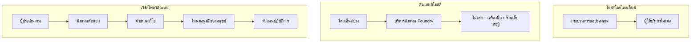
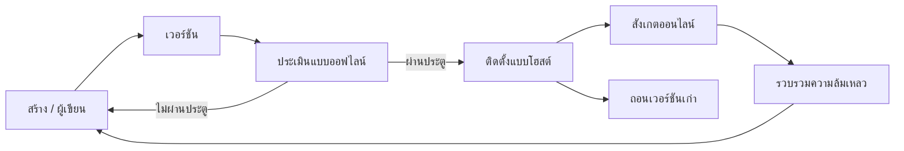
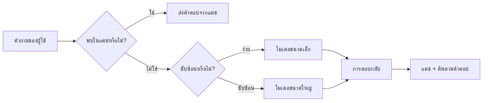
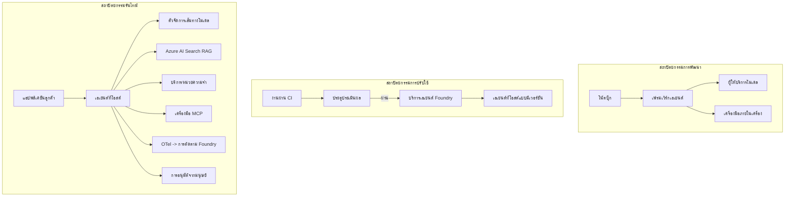

# การปรับใช้เอเจนต์ที่ปรับขนาดได้ด้วย Microsoft Foundry


จนถึงจุดนี้ในหลักสูตรคุณได้สร้างเอเจนต์ที่ทำงานบนแล็ปท็อปของคุณ ภายในโน้ตบุ๊ก โดยใช้ `az login` และตัวแปรสภาพแวดล้อมเล็กน้อย นั่นเป็นวิธีที่ถูกต้องในการเรียนรู้ แต่มันไม่ใช่วิธีที่ถูกต้องในการรันเอเจนต์ที่ลูกค้านับพันขึ้นอยู่ด้วยตอนตี 3

บทเรียนนี้เกี่ยวกับช่องว่างระหว่าง "มันทำงานบนเครื่องของฉัน" กับ "มันทำงานได้อย่างน่าเชื่อถือและคุ้มค่าในผลิตจริง" เราจะปิดช่องว่างนั้นโดยใช้ **Microsoft Foundry** และ **Microsoft Foundry Agent Service** และเราจะทำมันโดยการสร้างเอเจนต์สนับสนุนลูกค้าจริงที่มีเครื่องมือ การดึงข้อมูล ความจำ การประเมิน และการตรวจสอบ

## บทนำ

บทเรียนนี้จะครอบคลุม:

- ความแตกต่างระหว่าง **เอเจนต์ตัวต้นแบบ** กับ **เอเจนต์ที่ปรับใช้แล้ว** และเหตุใดการเปลี่ยนผ่านจึงเกี่ยวกับทุกอย่าง *รอบๆ* แบบจำลอง
- **รูปแบบการปรับใช้** สำหรับเอเจนต์: โฮสต์โดยไคลเอนต์, โฮสต์เป็นบริการ (Hosted Agents) และจัดการโดยเวิร์กโฟลว์
- **วงจรชีวิตของเอเจนต์** บน Microsoft Foundry — สร้าง, เวอร์ชัน, ปรับใช้, ประเมิน, สังเกต และปลดระวาง
- **กลยุทธ์การปรับขนาด**: การเดินทางแบบจำลอง, การแคช, ความขนาน และการออกแบบแบบไม่มีสถานะ
- **การตรวจสอบได้** ด้วย OpenTelemetry และ Foundry tracing
- **การเพิ่มประสิทธิภาพต้นทุน** ผ่านการเลือกแบบจำลอง การเดินทาง และประตูการประเมิน
- **ข้อพิจารณาธุรกิจองค์กร**: การกำกับดูแล, การอนุมัติของมนุษย์ และการรันเซิร์ฟเวอร์ MCP อย่างปลอดภัยในผลิตจริง

## เป้าหมายการเรียนรู้

หลังจากจบบทเรียนนี้ คุณจะรู้วิธี:

- เลือกรูปแบบการปรับใช้ที่เหมาะสมสำหรับภาระงานเอเจนต์แต่ละประเภท
- ปรับใช้เอเจนต์ไปยัง Microsoft Foundry Agent Service เพื่อให้มีการเวอร์ชัน การกำกับดูแล และการตรวจสอบได้
- ติดตั้งเครื่องมือสำหรับการติดตามและเชื่อมต่อกับเส้นทางการประเมินที่จะรันก่อนทุกการปล่อย
- ใช้การเดินทางแบบจำลองและการแคชเพื่อควบคุมความหน่วงและต้นทุนเมื่อปรับขนาด
- เพิ่มประตูการอนุมัติของมนุษย์สำหรับการกระทำที่มีความเสี่ยงสูงและผสาน MCP server ในวิธีที่ปลอดภัยสำหรับผลิตจริง

## ข้อกำหนดเบื้องต้น

บทเรียนนี้สมมติว่าคุณได้ผ่านบทเรียนก่อนหน้าและคุ้นเคยกับ:

- การสร้างเอเจนต์ด้วย [Microsoft Agent Framework](../14-microsoft-agent-framework/README.md) (บทเรียนที่ 14)
- [การใช้เครื่องมือ](../04-tool-use/README.md) (บทเรียนที่ 4) และ [Agentic RAG](../05-agentic-rag/README.md) (บทเรียนที่ 5)
- [Agent Memory](../13-agent-memory/README.md) (บทเรียนที่ 13) และ [Agentic Protocols / MCP](../11-agentic-protocols/README.md) (บทเรียนที่ 11)
- [การตรวจสอบและการประเมิน](../10-ai-agents-production/README.md) (บทเรียนที่ 10) — บทเรียนนี้สร้างต่อจากนั้นโดยตรง

คุณจะต้องมีด้วย:

- **Azure subscription** และ **โครงการ Microsoft Foundry** ที่มีโมเดลแชทที่ปรับใช้อย่างน้อยหนึ่งโมเดล
- การยืนยันตัวตนของ **Azure CLI** (`az login`)
- Python 3.12+ และแพ็กเกจในที่เก็บ [`requirements.txt`](../../../requirements.txt)

## จากตัวต้นแบบถึงผลิตจริง: สิ่งที่เปลี่ยนไปจริงๆ

เอเจนต์ตัวต้นแบบและเอเจนต์ผลิตจริงมีลูปหลักเหมือนกัน — การตั้งเหตุผล, เรียกใช้เครื่องมือ, ตอบกลับ สิ่งที่เปลี่ยนไปคือทุกอย่างที่ห่อหุ้มลูปนั้น แบบจำลองแค่ประมาณ 20% ของเอเจนต์ผลิตจริง; อีก 80% คือโครงสร้างการดำเนินงาน

| หัวข้อ | ตัวต้นแบบ | ผลิตจริง |
| --- | --- | --- |
| **การโฮสต์** | รันในโน้ตบุ๊กของคุณ | รันเป็นบริการโฮสต์, มีเวอร์ชันและปล่อยอัปเดต |
| **ตัวตน** | โทเค็น `az login` ของคุณ | Managed identity กับ RBAC ขอบเขตจำกัด |
| **สถานะ** | ในหน่วยความจำ, หายไปหลังรีสตาร์ท | เก็บภายนอก (thread store, memory service) |
| **ข้อผิดพลาด** | คุณเห็น traceback | มี retry, fallback, dead-letter, แจ้งเตือน |
| **ต้นทุน** | "แค่ไม่กี่เซนต์" | ติดตามต่อคำขอ, เดินทาง, แคช, งบประมาณ |
| **คุณภาพ** | คุณตรวจสอบผลลัพธ์ด้วยตา | ประเมินอัตโนมัติก่อนปล่อยทุกครั้ง |
| **ความเชื่อถือได้** | คุณอนุมัติทุกการกระทำ | นโยบาย + การอนุมัติของมนุษย์สำหรับการกระทำที่มีความเสี่ยง |

จดจำตารางนี้ไว้ ส่วนต่างๆ ด้านล่างจะจับคู่กับแถวเหล่านี้

## รูปแบบการปรับใช้งานเอเจนต์

มีสามรูปแบบที่คุณจะใช้ โดยมักใช้ร่วมกัน

### 1. เอเจนต์โฮสต์โดยไคลเอนต์

อ็อบเจ็กต์เอเจนต์จะอยู่ภายในกระบวนการแอปพลิเคชันของ *คุณ* โค้ดของคุณเรียกผู้ให้บริการแบบจำลองโดยตรง; ลูปเหตุผลจะทำงานในบริการของคุณ นี่คือสิ่งที่ทุกบทเรียนก่อนหน้านี้ทำ

- **ใช้เมื่อ** คุณต้องการควบคุมลูปอย่างเต็มที่ มีมิดเดิลแวร์ที่ปรับแต่งเอง หรือฝังเอเจนต์เข้าไปในแบ็คเอนด์ที่มีอยู่แล้ว
- **ข้อแลกเปลี่ยน**: คุณต้องจัดการการปรับขนาด สถานะ และความทนทานเอง

### 2. เอเจนต์โฮสต์โดยบริการ (Foundry Agent Service)

เอเจนต์ถูก *ลงทะเบียนเป็นทรัพยากร* ใน Microsoft Foundry Foundry จะโฮสต์ลูปเหตุผล จัดเก็บเธรด บังคับใช้ความปลอดภัยเนื้อหาและ RBAC และทำให้เอเจนต์มองเห็นได้ในพอร์ทัล Foundry แอปของคุณจะกลายเป็นไคลเอนต์บางที่สร้างเธรดและอ่านการตอบกลับ

- **ใช้เมื่อ** ต้องการความทนทาน, การตรวจสอบในตัว, การกำกับดูแล และพื้นผิวการดำเนินงานที่น้อยลง
- **ข้อแลกเปลี่ยน**: ควบคุมระดับต่ำได้น้อยกว่าแต่แลกกับการรันไทม์ที่ถูกจัดการแล้ว

### 3. เวิร์กโฟลว์ของเอเจนต์

เอเจนต์หลายตัว (และเครื่องมือ) จะถูกประกอบเป็นกราฟพร้อมการควบคุมอย่างชัดเจน — ขั้นตอนตามลำดับ, สาขา, โหนดอนุมัติของมนุษย์ และจุดตรวจสอบที่ทนทานที่สามารถหยุดและทำงานต่อได้ นี่คือความสามารถ **Workflows** ของ Microsoft Agent Framework ที่นำไปใช้ในระดับการปรับใช้

- **ใช้เมื่อ** งานเดียวครอบคลุมเอเจนต์เฉพาะหลายตัว หรือจำเป็นต้องมีขั้นตอนอนุมัติกลาง
- **ข้อแลกเปลี่ยน**: มีส่วนประกอบมากขึ้น; ต้องการการตรวจสอบระดับออร์เคสเทรชัน



## วงจรชีวิตของเอเจนต์บน Microsoft Foundry

การปรับใช้เอเจนต์ไม่ใช่แค่ `push` ครั้งเดียว มันคือวงจร และดูคล้ายกับวงจรการปล่อยซอฟต์แวร์เพราะนั่นคือสิ่งที่มันเป็น



แนวคิดหลักที่นำมาจาก [บทเรียนที่ 10](../10-ai-agents-production/README.md): **การประเมินแบบออฟไลน์คือประตู ไม่ใช่สิ่งที่คำนึงทีหลัง** เวอร์ชันเอเจนต์ใหม่จะไม่ถูกปล่อยถ้าไม่ผ่านเกณฑ์ประเมินของคุณ การตรวจสอบแบบออนไลน์จะป้อนข้อผิดพลาดในโลกจริงกลับเข้าไปในชุดทดสอบออฟไลน์ของคุณ นั่นคือวงจรทั้งหมด

## กลยุทธ์การปรับขนาด

การปรับขนาดเอเจนต์แตกต่างจากการปรับขนาดเว็บ API แบบไม่มีสถานะ เพราะแต่ละคำขออาจเรียกใช้หลายโมเดลและเครื่องมือที่มีค่าใช้จ่ายสูง สี่เทคนิคที่รับภาระมากที่สุด

**การจัดการคำขอแบบไม่มีสถานะ** อย่าเก็บสถานะเฉพาะผู้ใช้ในหน่วยความจำกระบวนการของคุณ เก็บเธรดการสนทนาในที่เก็บเธรดของ Foundry หรือบริการหน่วยความจำเพื่อให้ตัวอย่างใดก็ได้สามารถจัดการคำขอได้ นี่คือสิ่งที่ช่วยให้คุณปรับขนาดในแนวนอน — เพิ่มตัวอย่าง ไม่มีเซสชันแบบผูกมัด

**การเดินทางแบบจำลอง** ไม่ใช่ทุกคำขอต้องใช้โมเดลที่มีความสามารถสูงสุด (และมีราคาแพงที่สุด) นำคำขอที่ง่าย — การจำแนกเจตนา, คำตอบข้อเท็จจริงสั้นๆ — ไปยังโมเดลเล็กและเร็ว และสงวนโมเดลใหญ่สำหรับการตั้งเหตุผลจริง Foundry’s **Model Router** สามารถทำสิ่งนี้ให้คุณ หรือคุณสามารถพัฒนาเครื่องจำแนกเบาๆ ด้วยตนเอง คุณจะสร้างเวอร์ชัน DIY ในห้องปฏิบัติการ

**การแคชการตอบกลับ** คำถามสนับสนุนหลายคำถามเหมือนกัน ("ฉันจะรีเซ็ตรหัสผ่านได้อย่างไร?") แคชคำตอบสำหรับคำถามทั่วไปและให้บริการโดยไม่ต้องเรียกใช้โมเดลเลย อัตราการโดนแคชไม่กี่เปอร์เซ็นต์ก็ช่วยลดต้นทุนและความหน่วงอย่างมีนัยสำคัญ

**ความขนานและแรงย้อนกลับ** ผู้ให้บริการโมเดลมีข้อจำกัดเรื่องอัตรา จำกัดความขนานของคุณ ใช้ retry พร้อม backoff แบบเอ็กซ์โพเนนเชียล และล้มเหลวอย่างเรียบร้อย (การตอบกลับแบบคิว "เรากำลังดำเนินการ" ดีกว่าข้อผิดพลาด 500)



## การตรวจสอบได้ในผลิตจริง

คุณไม่สามารถดำเนินการในสิ่งที่คุณไม่เห็น ตามที่ครอบคลุมในบทเรียน 10, Microsoft Agent Framework ส่งออก **OpenTelemetry** traces โดยเนทีฟ — ทุกการเรียกโมเดล การเรียกเครื่องมือ และขั้นตอนการออร์เคสเทรชันกลายเป็น span ในผลิตจริง คุณจะส่งออก span เหล่านั้นไปยัง Microsoft Foundry (หรือแบ็คเอนด์ที่รองรับ OTel ใดๆ) เพื่อให้คุณสามารถ:

- ติดตามข้อร้องเรียนลูกค้าแต่ละคนอย่างละเอียดข้ามทุกโมเดลและการเรียกเครื่องมือ
- ดูความหน่วง p50/p95 และต้นทุนต่อคำขอตลอดเวลา
- แจ้งเตือนเมื่อเกิดการพุ่งขึ้นของอัตราความผิดพลาดและความผิดปกติของต้นทุนก่อนที่ผู้ใช้คุณ (หรือทีมการเงิน) จะสังเกตเห็น

```python
from agent_framework.observability import get_tracer

tracer = get_tracer()

with tracer.start_as_current_span("support_request") as span:
    span.set_attribute("customer.tier", "enterprise")
    span.set_attribute("routed.model", "gpt-5-nano")
    # การดำเนินการของเอเยนต์จะถูกติดตามโดยอัตโนมัติภายในช่วงเวลานี้
```

แอตทริบิวต์เช่น `customer.tier` และ `routed.model` คือสิ่งที่เปลี่ยนกลุ่ม trace ให้เป็นคำถามที่ตอบได้ ("ลูกค้าองค์กรได้ถูกส่งไปยังโมเดลเล็กเกินไปหรือไม่?")

## การเพิ่มประสิทธิภาพต้นทุน

ต้นทุนในเอเจนต์ผลิตจริงส่วนใหญ่ขึ้นอยู่กับโทเค็น สามคันโยกตามลำดับผลกระทบ:

1. **ขนาดโมเดลที่เหมาะสม** โมเดลเล็กที่ผ่านเกณฑ์ประเมินของคุณแทบจะถูกกว่ามากเสมอเมื่อเทียบกับโมเดลใหญ่ที่ผ่านด้วย ใช้การประเมินเพื่อ *พิสูจน์* ว่าโมเดลเล็กพอเพียงแทนที่จะเลือกใช้โมเดลใหญ่ที่สุดด้วยความระมัดระวัง
2. **เดินทางตามความซับซ้อน** เช่นเดียวกับข้างต้น — จ่ายราคาโมเดลใหญ่เฉพาะคำขอที่ต้องมีการตั้งเหตุผลจากโมเดลใหญ่เท่านั้น
3. **แคชอย่างหนัก** การเรียกโมเดลที่ถูกที่สุดคือคำเรียกที่คุณไม่ต้องทำเลย

ประตูการประเมินและการควบคุมต้นทุนคือวินัยเดียวกันที่มองจากสองมุม: การประเมินบอกคุณถึง *คุณภาพขั้นต่ำ*, การเดินทางและการแคชช่วยให้คุณอยู่ใกล้ *ต้นทุน* ของระดับนั้นที่สุด

## ข้อพิจารณาการปรับใช้สำหรับองค์กร

**การกำกับดูแล** Hosted Agents ได้รับมรดก RBAC, ความปลอดภัยเนื้อหา และการบันทึกตรวจสอบของ Foundry ให้แต่ละเอเจนต์มี managed identity ที่มีสิทธิ์น้อยที่สุดที่จำเป็น — การเข้าถึงฐานความรู้แบบอ่านอย่างเดียว, การเข้าถึง API ตั๋วในขอบเขตที่จำกัด, ไม่มีสิ่งอื่นเพิ่มเติม

**มนุษย์ในวงจร** บางการกระทำมีผลกระทบร้ายแรงเกินกว่าที่จะทำอัตโนมัติ — การคืนเงิน, การลบบัญชีผู้ใช้, การส่งต่อทีมกฎหมาย Microsoft Agent Framework รองรับเครื่องมือที่ **ต้องการการอนุมัติ**: เอเจนต์เสนอการกระทำ, หยุดการดำเนินการ, มีมนุษย์อนุมัติหรือปฏิเสธ, และเวิร์กโฟลว์ทำงานต่อ คุณได้เห็นโครงสร้างพื้นฐานใน [บทเรียนที่ 6](../06-building-trustworthy-agents/README.md); ที่นี่คุณจะปรับใช้มัน

**MCP ในผลิตจริง** [MCP](../11-agentic-protocols/README.md) ทำให้เอเจนต์ของคุณใช้เครื่องมือภายนอกผ่านอินเตอร์เฟซมาตรฐาน ในผลิตจริง ให้ถือว่าเซิร์ฟเวอร์ MCP ทุกตัวเป็นเขตแดนที่ไม่ไว้วางใจ: กำหนดเวอร์ชันเซิร์ฟเวอร์, รันด้วย managed identity ที่จำกัดขอบเขต, ตรวจสอบผลลัพธ์ และไม่เคยเปิดเผยความลับใดต่อมัน เซิร์ฟเวอร์ MCP คือความขึ้นต่อกัน และความขึ้นต่อกันต้องถูกแพตช์ ตรวจสอบ และจำกัดอัตรา



แผนภาพสามอันนั้น — การพัฒนา, การปรับใช้, การรันไทม์ — คือเอเจนต์เดียวกันในสามขั้นตอนของชีวิต ห้องปฏิบัติการถัดไปจะนำคุณผ่านการสร้างมัน

## ห้องปฏิบัติการปฏิบัติ: เอเจนต์สนับสนุนลูกค้าพร้อมใช้ผลิตจริง

เปิด [`code_samples/16-python-agent-framework.ipynb`](./code_samples/16-python-agent-framework.ipynb) แล้วทำตามทีละขั้นตอน คุณจะประกอบเป็น **เอเจนต์สนับสนุนลูกค้า Contoso** พร้อมทุกข้อกังวลสำหรับผลิตจริงเชื่อมต่ออยู่:

1. **การเรียกใช้เครื่องมือ** — ดูสถานะคำสั่งซื้อและเปิดตั๋วสนับสนุน
2. **RAG** — ตอบคำถามนโยบายจากฐานความรู้ (Azure AI Search พร้อม fallback ในหน่วยความจำเพื่อให้โน้ตบุ๊กรันได้โดยไม่มี Search resource)
3. **ความจำ** — จดจำลูกค้าผ่านรอบบทสนทนา
4. **การเดินทางแบบจำลอง** — เครื่องจำแนกความซับซ้อนนำคำขอแต่ละคำไปยังโมเดลเล็กหรือใหญ่
5. **การแคชการตอบกลับ** — คำถามซ้ำได้รับการตอบจากแคช
6. **การอนุมัติของมนุษย์** — การคืนเงินที่เกินเกณฑ์จะต้องหยุดเพื่อการลงนามของมนุษย์
7. **เส้นทางประเมิน** — ชุดทดสอบออฟไลน์ขนาดเล็กให้คะแนนเอเจนต์และทำหน้าที่เป็นประตูปล่อย
8. **การตรวจสอบได้** — การติดตาม OpenTelemetry รอบทุกคำขอ

### การเดินทางผ่าน

โน้ตบุ๊กจัดเรียงไว้ให้ข้อกังวลสำหรับผลิตจริงแต่ละข้อเป็นส่วนที่สามารถรันได้ด้วยตัวเอง หัวใจคือการจัดการคำขอแบบ routing-plus-caching:

```python
async def handle_support_request(query: str, customer_id: str) -> str:
    # 1. ให้บริการจากแคชเมื่อเป็นไปได้
    cached = response_cache.get(normalize(query))
    if cached:
        return cached

    # 2. กำหนดเส้นทางตามความซับซ้อนเพื่อควบคุมค่าใช้จ่าย
    model = "gpt-5-nano" if is_simple(query) else "gpt-5-mini"

    # 3. รันเอเจนต์ภายในช่วงการติดตามเพื่อการสังเกตการณ์
    with tracer.start_as_current_span("support_request") as span:
        span.set_attribute("routed.model", model)
        span.set_attribute("customer.id", customer_id)
        response = await support_agent.run(query, model=model)

    # 4. แคชและส่งคืน
    response_cache.set(normalize(query), response.text)
    return response.text
```

ประตูประเมินที่คุ้มครองการปล่อยดูเหมือนนี้:

```python
async def evaluation_gate(agent, test_cases, threshold: float = 0.8) -> bool:
    passed = 0
    for case in test_cases:
        result = await agent.run(case["input"])
        if score_response(result.text, case["expected"]) >= 0.8:
            passed += 1
    pass_rate = passed / len(test_cases)
    print(f"Evaluation pass rate: {pass_rate:.0%} (gate: {threshold:.0%})")
    return pass_rate >= threshold  # ปล่อยใช้งานเฉพาะเมื่อเกตผ่านเท่านั้น
```

อ่านทุกบรรทัด — โน้ตบุ๊กเก็บโครงสร้างพื้นฐานให้น้อยเพื่อจะได้ไม่มีอะไรซ่อนอยู่หลังการเรียกเฟรมเวิร์ก

## การตรวจสอบเอเจนต์ที่ปรับใช้ด้วยการทดสอบควัน

ประตูประเมินข้างต้นทำงาน *แบบออฟไลน์* กับอ็อบเจ็กต์เอเจนต์ของคุณ เมื่อเอเจนต์ถูกปรับใช้เป็น Hosted Agent คุณจะต้องมีการตรวจสอบเพิ่มเติมที่ถูกกว่าหนึ่งอย่าง: **จุดสิ้นสุดที่ปรับใช้จริงตอบสนองหรือไม่?**

การปรับใช้ "สำเร็จ" พิสูจน์แค่เพียงว่า plane การควบคุมยอมรับนิยามมัน — ไม่ได้พิสูจน์ว่าเอเจนต์ตอบสนอง ขาดความขึ้นต่อกัน, การเดินทางโมเดลที่ไม่ถูกต้อง, หรือการเชื่อมต่อหมดอายุ อาจทิ้งการปรับใช้ที่เป็นสีเขียวแต่ตอบกลับว่างเปล่า การทดสอบควันจับสิ่งนั้นได้ภายในไม่กี่วินาทีในทุกครั้งที่ปรับใช้ โดยไม่ต้องเสียค่าประเมินเต็มรูปแบบ

ที่เก็บนี้มาพร้อมกับเส้นทางการทดสอบควันพร้อมใช้ที่สร้างขึ้นบน [AI Smoke Test](https://github.com/marketplace/actions/ai-smoke-test) GitHub Action:

- **แคตตาล็อก** — [`tests/lesson-16-smoke-tests.json`](../../../tests/lesson-16-smoke-tests.json) มีพรอมต์และการตรวจสอบสำหรับเอเจนต์สนับสนุน Contoso (คำตอบนโยบายที่อิงฐานความรู้, การดูคำสั่งซื้อ, การอยู่ในหัวข้อ, และความต่อเนื่องหลายรอบบทสนทนา) แคตตาล็อกของเอเจนต์บทเรียนอื่นอยู่ข้างๆ ดูได้ที่ [`tests/README.md`](../tests/README.md)
- **เวิร์กโฟลว์** — [`.github/workflows/smoke-test.yml`](../../../.github/workflows/smoke-test.yml) ลงชื่อเข้าใช้ด้วย Azure OIDC และส่ง POST แต่ละพรอมต์ไปยังจุดสิ้นสุด Responses ของเอเจนต์ พร้อมทำงานล้มเหลวถ้าเจอการตรวจสอบผิดพลาด

```yaml
- name: Smoke-test hosted agent
  uses: JFolberth/ai-smoketest@v1
  with:
    project_endpoint: ${{ inputs.project_endpoint }}
    agent_name: ContosoSupportAgent
    tests_file: tests/lesson-16-smoke-tests.json
```


เรียกใช้งานจากแท็บ **Actions** เมื่อตัวแทนของคุณถูกปรับใช้ โดยระบุค่า endpoint ของโครงการ Foundry และชื่อเอเจนต์ของคุณ ตัวตนแบบรวมต้องมีบทบาท **Azure AI User** ในขอบเขตโครงการ Foundry คิดเลเยอร์ต่าง ๆ เหล่านี้เสมือนพีระมิด: การทดสอบแบบ smoke (เข้าถึงได้และตอบสนองไหม?) จะทำงานทุกครั้งที่เปิดตัว การประเมินแบบออฟไลน์ (พอที่จะส่งมอบได้ไหม?) ทำก่อนการเลื่อนระดับ และการประเมินแบบออนไลน์ (ทำงานอย่างไรในสภาพแวดล้อมจริง?) จะทำอย่างต่อเนื่อง

## ตรวจสอบความรู้

ทดสอบความเข้าใจก่อนขยับไปยังงานมอบหมาย

**1. โดยประมาณแล้ว ตัวแทนที่ทำงานจริงส่วนใดคือ "โมเดล" และส่วนที่เหลือคืออะไร?**

<details>
<summary>คำตอบ</summary>

โมเดลเป็นส่วนย่อยของระบบ — มักจะกล่าวว่าอยู่ราว 20% ส่วนที่เหลือคือโครงร่างการปฏิบัติการ: โฮสติ้งและการเวอร์ชัน, การระบุตัวตนและ RBAC, สถานะที่แยกออกมา, การจัดการความล้มเหลว, การติดตามค่าใช้จ่าย, การประเมินผล, และการควบคุมที่มีมนุษย์เป็นส่วนร่วม การเลื่อนสู่การผลิตส่วนใหญ่มักเกี่ยวกับการสร้างทุกอย่าง *รอบ ๆ* วงจรการให้เหตุผล
</details>

**2. คุณจะเลือก Hosted Agent แทนตัวแทนที่โฮสต์บนลูกค้าเมื่อใด?**

<details>
<summary>คำตอบ</summary>

เมื่อคุณต้องการสภาพแวดล้อมการรันแบบจัดการที่มีความทนทานในตัว (เธรดที่จะคงอยู่และสามารถเริ่มต้นต่อได้), ความสามารถในการสังเกต, ความปลอดภัยของเนื้อหา และ RBAC และคุณยอมแลกเปลี่ยนการควบคุมระดับต่ำในวงจรการให้เหตุผลเพื่อทำให้พื้นที่ปฏิบัติการลดลง ตัวแทนที่โฮสต์บนลูกค้าเหมาะสมกว่าเมื่อคุณต้องการควบคุมวงจรอย่างเต็มที่หรือฝังตัวแทนไว้ในแบ็กเอนด์ที่มีอยู่แล้ว
</details>

**3. ทำไมตัวแทนที่สามารถปรับขนาดได้จึงต้องไม่มีสถานะในหน่วยความจำของกระบวนการตัวเอง?**

<details>
<summary>คำตอบ</summary>

เพื่อให้แต่ละอินสแตนซ์สามารถจัดการคำขอใดก็ได้ ซึ่งเป็นสิ่งที่อนุญาตให้ขยายแนวนอนได้โดยไม่ต้องยึดเซสชัน สถานะการสนทนาต่อผู้ใช้จะถูกแยกออกมาในที่เก็บเธรดหรือบริการหน่วยความจำ หากสถานะอยู่ในหน่วยความจำของกระบวนการ คุณจะสูญเสียมันเมื่อรีสตาร์ทและไม่สามารถแจกจ่ายโหลดได้อย่างอิสระ
</details>

**4. การจัดเส้นทางโมเดลแก้ปัญหาอะไร และมันเกี่ยวข้องกับการประเมินอย่างไร?**

<details>
<summary>คำตอบ</summary>

การจัดเส้นทางจะส่งคำขอที่ง่ายไปยังโมเดลเล็กที่ราคาถูกและรวดเร็ว และสงวนโมเดลขนาดใหญไว้สำหรับการให้เหตุผลจริงๆ ควบคุมทั้งความหน่วงเวลาและค่าใช้จ่าย มันเกี่ยวข้องกับการประเมินเพราะการประเมินคือสิ่งที่ *พิสูจน์* ว่าโมเดลเล็กพอสำหรับกลุ่มคำขอประเภทหนึ่ง — การจัดเส้นทางโดยไม่มีการประเมินเป็นการเดา
</details>

**5. "ประตูประเมินผล" คืออะไร และมันอยู่ที่ใดในวงจรชีวิต?**

<details>
<summary>คำตอบ</summary>

ประตูประเมินผลจะรันชุดทดสอบออฟไลน์กับเวอร์ชันตัวแทนใหม่และบล็อกการปรับใช้เว้นแต่เปอร์เซ็นต์ผ่านจะเกินเกณฑ์ มันอยู่ระหว่าง "เวอร์ชัน" และ "การปรับใช้" ในวงจรชีวิต ทำให้คุณภาพเป็นเงื่อนไขเบื้องต้นสำหรับการปล่อยแทนที่จะเป็นสิ่งที่ตรวจสอบหลังจากส่งมอบ
</details>

**6. ทำไมเซิร์ฟเวอร์ MCP จึงควรถูกปฏิบัติเหมือนเป็นขอบเขตที่ไม่เชื่อถือได้ในสภาพแวดล้อมผลิต?**

<details>
<summary>คำตอบ</summary>

เพราะมันเป็นการพึ่งพาภายนอกที่ตัวแทนของคุณเรียกใช้ คุณควรกำหนดเวอร์ชันของมัน, รันด้วยตัวตนที่มีขอบเขต, ตรวจสอบผลลัพธ์, จำกัดอัตราการเรียกใช้, และไม่เคยเปิดเผยความลับให้กับมัน — วินัยเดียวกับที่ใช้กับการพึ่งพาจากบุคคลที่สาม ผลลัพธ์ของมันไหลเข้าสู่วงจรการให้เหตุผลของตัวแทนของคุณ ดังนั้นความไว้วางใจที่ไม่ได้ตรวจสอบคือความเสี่ยงด้านความปลอดภัย
</details>

**7. การเปลี่ยนแปลงอย่างเดียวที่มักมีผลกระทบใหญ่ที่สุดต่อค่าใช้จ่ายตัวแทนในการผลิตคืออะไร และทำไม?**

<details>
<summary>คำตอบ</summary>

การกำหนดขนาดโมเดลให้เหมาะสม — ใช้โมเดลที่เล็กที่สุดที่ยังผ่านประตูประเมินของคุณ ค่าใช้จ่ายส่วนใหญ่ขึ้นอยู่กับโทเคน และโมเดลที่เล็กกว่าที่ตอบโจทย์คุณภาพมักจะถูกกว่าที่ใหญ่กว่า การแคชและการจัดเส้นทางจะลดค่าใช้จ่ายเพิ่มเติม แต่การเลือกโมเดลฐานที่เหมาะสมมีผลกระทบขั้นแรกที่ใหญ่ที่สุด
</details>

**8. บทบาทของแอตทริบิวต์ span เช่น `customer.tier` และ `routed.model` ในการสังเกตการณ์คืออะไร?**

<details>
<summary>คำตอบ</summary>

พวกมันเปลี่ยนแทรซดิบให้กลายเป็นคำถามธุรกิจที่สามารถตอบได้ หากไม่มีแอตทริบิวต์ คุณจะมีแต่ผนังของ span แต่ถ้ามีคุณสามารถถามได้ว่า "ลูกค้าองค์กรถูกส่งไปยังโมเดลเล็กบ่อยเกินไปไหม?" หรือ "โมเดลใดจัดการคำขอที่ช้าที่สุดของเรา?" แอตทริบิวต์คือวิธีที่คุณแบ่งข้อมูลโทรเมทรีตามมิติที่สำคัญกับการดำเนินงานของคุณ
</details>

## งานมอบหมาย

นำตัวแทนสนับสนุนลูกค้าจากแลปมาและเสริมความแข็งแกร่งเพื่อสถานการณ์เฉพาะ: **ตัวแทนสนับสนุนการเรียกเก็บเงินแบบสมัครสมาชิกสำหรับบริษัท SaaS**

งานส่งของคุณควร:

1. **แทนที่เครื่องมือ** ด้วยเครื่องมือที่เกี่ยวข้องกับการเรียกเก็บเงิน: `get_subscription_status`, `get_invoice`, และ `issue_credit` (เครดิตเกิน $50 ต้องได้รับอนุมัติจากมนุษย์)
2. **เพิ่มเอกสาร RAG สามฉบับ** ที่ครอบคลุมนโยบายการคืนเงิน, รอบบิล, และนโยบายการยกเลิกของบริษัท
3. **ขยายชุดประเมิน** ให้มีอย่างน้อยแปดกรณี รวมอย่างน้อยสองกรณีที่ *ควร* กระตุ้นเส้นทางอนุมัติจากมนุษย์ และยืนยันว่าประตูประเมินของคุณผ่านหรือไม่ผ่านอย่างถูกต้อง
4. **เพิ่มรายงานค่าใช้จ่ายหนึ่งชิ้น**: หลังจากรันคำถามผสมสิบคำถามผ่านตัวแทน พิมพ์จำนวนที่ถูกส่งไปโมเดลเล็ก, โมเดลใหญ่, และจำนวนที่ให้บริการจากแคช

เขียนย่อหน้าสั้น ๆ (ในเซลล์มาร์กดาวน์) อธิบายกฎการจัดเส้นทางโมเดลที่คุณเลือกและวิธีการตรวจสอบกับปริมาณข้อมูลจริง ไม่มีคำตอบที่ถูกต้องเพียงคำตอบเดียว — คุณจะถูกประเมินจากว่าปัญหาการผลิตเชื่อมโยงกันอย่างสอดคล้องหรือไม่

## สรุป

ในบทเรียนนี้คุณได้ย้ายตัวแทนจากต้นแบบมาสู่การผลิตด้วย Microsoft Foundry:

- การกระโดดสู่การผลิตส่วนใหญ่เกี่ยวกับ **โครงร่างปฏิบัติการ** รอบโมเดล — โฮสติ้ง, การระบุตัวตน, สถานะ, การจัดการความล้มเหลว, ค่าใช้จ่าย, คุณภาพ, และความไว้วางใจ
- คุณได้เรียนรู้ **รูปแบบการปรับใช้สามแบบ** — client-hosted, Hosted Agents, และ Agent Workflows — และเวลาใช้งานแต่ละแบบ
- คุณได้ทำความเข้าใจกับ **วงจรชีวิตตัวแทน** ที่การประเมินแบบออฟไลน์ทำหน้าที่เป็นประตูปล่อย และการสังเกตการณ์ออนไลน์ให้อาหารย้อนกลับความล้มเหลวเข้าสู่ชุดทดสอบ
- คุณใช้ **กลยุทธ์การปรับขนาด** — การออกแบบไม่มีสถานะ, การจัดเส้นทางโมเดล, การแคช, และการจำกัดความพร้อมใช้งาน — และเชื่อมโยงกับ **การเพิ่มประสิทธิภาพค่าใช้จ่าย**
- คุณเพิ่มระบบควบคุมองค์กร: RBAC, อนุมัติด้วยมนุษย์, และการผสาน MCP ที่ปลอดภัยสำหรับการผลิต
- คุณสร้าง **ตัวแทนสนับสนุนลูกค้าพร้อมใช้งานในสภาพแวดล้อมจริง** ที่รวมทุกปัญหาเหล่านี้เข้าด้วยกันในโค้ดที่สามารถรันได้

บทเรียนถัดไปจะเดินทางในทางกลับกัน: แทนที่จะขยายตัวแทนขึ้นสู่คลาวด์ คุณจะดึงตัวแทนลงมาบนเครื่องนักพัฒนาเครื่องเดียวและรันแบบทั้งหมดในเครื่อง

## แหล่งข้อมูลเพิ่มเติม

- <a href="https://learn.microsoft.com/azure/ai-foundry/what-is-azure-ai-foundry" target="_blank">เอกสาร Microsoft Foundry</a>
- <a href="https://learn.microsoft.com/azure/ai-foundry/agents/overview" target="_blank">ภาพรวมบริการเอเจนต์ Microsoft Foundry</a>
- <a href="https://aka.ms/ai-agents-beginners/agent-framework" target="_blank">Microsoft Agent Framework</a>
- <a href="https://learn.microsoft.com/azure/ai-foundry/concepts/model-router" target="_blank">Model Router ใน Microsoft Foundry</a>
- <a href="https://learn.microsoft.com/azure/search/search-what-is-azure-search" target="_blank">Azure AI Search</a>
- <a href="https://opentelemetry.io/" target="_blank">OpenTelemetry</a>
- <a href="https://github.com/marketplace/actions/ai-smoke-test" target="_blank">AI Smoke Test GitHub Action</a>
- <a href="https://modelcontextprotocol.io/" target="_blank">Model Context Protocol (MCP)</a>

## บทเรียนก่อนหน้า

[การสร้างตัวแทนใช้งานคอมพิวเตอร์ (CUA)](../15-browser-use/README.md)

## บทเรียนถัดไป

[การสร้างเอเจนต์ AI ท้องถิ่น](../17-creating-local-ai-agents/README.md)

---

<!-- CO-OP TRANSLATOR DISCLAIMER START -->
**ปฏิเสธความรับผิดชอบ**:
เอกสารนี้ได้รับการแปลโดยใช้บริการแปลภาษา AI [Co-op Translator](https://github.com/Azure/co-op-translator) ขณะที่เราพยายามให้ความถูกต้อง โปรดทราบว่าการแปลโดยอัตโนมัติอาจมีข้อผิดพลาดหรือความไม่ถูกต้อง เอกสารต้นฉบับในภาษาต้นทางควรถูกพิจารณาเป็นแหล่งข้อมูลที่เชื่อถือได้ สำหรับข้อมูลที่สำคัญ แนะนำให้ใช้การแปลโดยมนุษย์มืออาชีพ เราไม่รับผิดชอบต่อความเข้าใจผิดหรือการตีความที่ผิดพลาดที่เกิดขึ้นจากการใช้การแปลนี้
<!-- CO-OP TRANSLATOR DISCLAIMER END -->