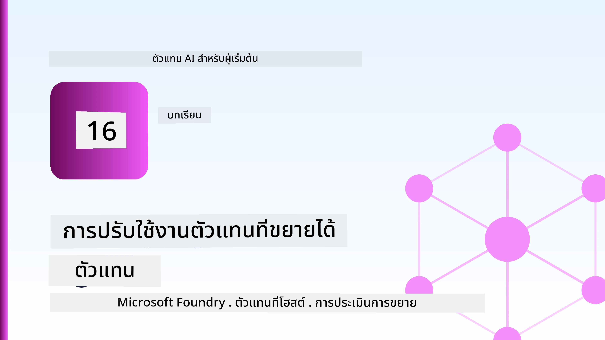
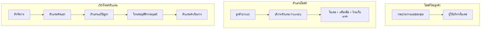
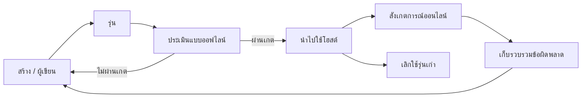
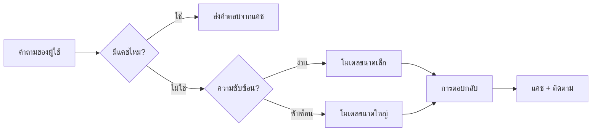
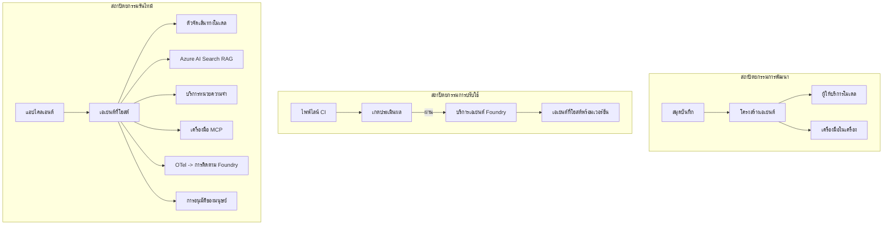

# การปรับใช้เอเจนต์ที่ขยายตัวได้ด้วย Microsoft Foundry



จนถึงตอนนี้ในหลักสูตรนี้ คุณได้สร้างเอเจนต์ที่รันบนแล็ปท็อปของคุณ ภายในโน้ตบุ๊ก โดยขับเคลื่อนด้วย `az login` และตัวแปรแวดล้อมไม่กี่ตัว นั่นคือวิธีที่ถูกต้องสำหรับการเรียนรู้ แต่ไม่ใช่วิธีที่เหมาะสมสำหรับการรันเอเจนต์ที่ลูกค้านับพันใช้งานตอนตี 3

บทเรียนนี้เกี่ยวกับช่องว่างระหว่าง "มันทำงานบนเครื่องฉัน" กับ "มันทำงานได้อย่างน่าเชื่อถือและคุ้มค่าในสภาพแวดล้อมการผลิต" เราปิดช่องว่างนี้โดยใช้ **Microsoft Foundry** และ **Microsoft Foundry Agent Service** และเราทำโดยการสร้างเอเจนต์สนับสนุนลูกค้าจริงที่มีเครื่องมือ การดึงข้อมูล ความจำ การประเมินผล และการตรวจสอบ

## บทนำ

บทเรียนนี้จะครอบคลุม:

- ความแตกต่างระหว่าง **เอเจนต์ต้นแบบ** กับ **เอเจนต์ที่ปรับใช้แล้ว** และเหตุใดการเปลี่ยนผ่านจึงเกี่ยวข้องกับทุกสิ่ง *รอบๆ* แบบจำลองมากกว่า
- **รูปแบบการปรับใช้** สำหรับเอเจนต์: โฮสต์โดยลูกค้า, โฮสต์บนบริการ (Hosted Agents) และการประสานงานด้วย workflow
- **วงจรชีวิตเอเจนต์** บน Microsoft Foundry — สร้าง รุ่น ปรับใช้ ประเมินผล สังเกตการณ์ เลิกใช้งาน
- **กลยุทธ์การขยายตัว**: การจัดเส้นทางแบบจำลอง, การแคช, การรันพร้อมกัน, และการออกแบบแบบไม่มีสถานะ
- **การสังเกตการณ์** ด้วย OpenTelemetry และการติดตาม Foundry
- **การเพิ่มประสิทธิภาพต้นทุน** ผ่านการเลือกแบบจำลอง การจัดเส้นทาง และเกตการประเมินผล
- **ข้อพิจารณาองค์กร**: การกำกับดูแล การอนุมัติของมนุษย์ และการรันเซิร์ฟเวอร์ MCP อย่างปลอดภัยในสภาพแวดล้อมการผลิต

## เป้าหมายการเรียนรู้

หลังจากจบบทเรียนนี้ คุณจะสามารถ:

- เลือกรูปแบบการปรับใช้ที่เหมาะสมสำหรับงานเอเจนต์ที่กำหนด
- ปรับใช้เอเจนต์บน Microsoft Foundry Agent Service เพื่อให้มีเวอร์ชัน การกำกับดูแล และการสังเกตการณ์
- ติดตั้งเครื่องมือสำหรับการติดตามและเชื่อมท่อประเมินผลที่รันก่อนทุกการปล่อย
- ใช้การจัดเส้นทางแบบจำลองและการแคชเพื่อลดความหน่วงและต้นทุนในการขยายตัว
- เพิ่มเกตอนุมัติของมนุษย์สำหรับการกระทำที่มีความเสี่ยงสูง และผนวกรวมเซิร์ฟเวอร์ MCP ในวิธีที่ปลอดภัยต่อการใช้งานจริง

## ความรู้พื้นฐานที่จำเป็น

บทเรียนนี้สมมติว่าคุณได้จบบทเรียนก่อนหน้าและคุ้นเคยกับ:

- การสร้างเอเจนต์ด้วย [Microsoft Agent Framework](../14-microsoft-agent-framework/README.md) (บทเรียน 14)
- [การใช้เครื่องมือ](../04-tool-use/README.md) (บทเรียน 4) และ [Agentic RAG](../05-agentic-rag/README.md) (บทเรียน 5)
- [Agent Memory](../13-agent-memory/README.md) (บทเรียน 13) และ [Agentic Protocols / MCP](../11-agentic-protocols/README.md) (บทเรียน 11)
- [การสังเกตการณ์และการประเมินผล](../10-ai-agents-production/README.md) (บทเรียน 10) — บทเรียนนี้ต่อยอดจากบทเรียนนี้โดยตรง

คุณจะต้องมี:

- **การสมัครใช้งาน Azure** และ **โปรเจกต์ Microsoft Foundry** ที่มีแบบจำลองแชทปรับใช้ได้อย่างน้อยหนึ่งตัว
- Azure CLI ที่ผ่านการรับรองความถูกต้อง (`az login`)
- Python 3.12+ และแพ็กเกจในที่เก็บ [`requirements.txt`](../../../requirements.txt)

## จากต้นแบบสู่การผลิต: สิ่งที่เปลี่ยนจริง ๆ

เอเจนต์ต้นแบบและเอเจนต์ผลิตแชร์วงจรหลักเดียวกัน — การคิดเหตุผล เรียกใช้งานเครื่องมือ ตอบสนอง สิ่งที่เปลี่ยนคือทุกอย่างที่อยู่รอบวงจรนั้น แบบจำลองอาจเป็นเพียง 20% ของเอเจนต์ในสภาพแวดล้อมการผลิต ส่วนอีก 80% คือโครงสร้างการดำเนินงาน

| ประเด็น | ต้นแบบ | การผลิต |
| --- | --- | --- |
| **โฮสต์** | รันในโน้ตบุ๊กของคุณ | รันเป็นบริการโฮสต์ มีการเวอร์ชันและเปิดตัว |
| **ตัวตน** | โทเค็น `az login` ของคุณ | ตัวตนที่จัดการพร้อมการควบคุมสิทธิ์แบบ RBAC |
| **สถานะ** | อยู่ในหน่วยความจำ เสียหายเมื่อรีสตาร์ท | ถูกจัดเก็บภายนอก (thread store, บริการความจำ) |
| **ข้อผิดพลาด** | คุณเห็น traceback | พยายามใหม่, สำรองข้อมูล, dead-letter, แจ้งเตือน |
| **ค่าใช้จ่าย** | "ไม่กี่เซ็นต์" | ติดตามตามคำขอ, จัดเส้นทาง, แคช, งบประมาณ |
| **คุณภาพ** | คุณตรวจสอบด้วยตา | ประเมินอัตโนมัติก่อนปล่อยทุกครั้ง |
| **ความเชื่อถือ** | คุณอนุมัติทุกการกระทำ | นโยบาย + มนุษย์ในวงจรสำหรับการกระทำที่เสี่ยง |

จดจำตารางนี้ไว้ ทุกส่วนด้านล่างจะสอดคล้องกับแต่ละแถว

## รูปแบบการปรับใช้เอเจนต์

มีสามรูปแบบที่คุณจะใช้ มักจะใช้ร่วมกัน

### 1. เอเจนต์โฮสต์โดยลูกค้า

ตัวเอเจนต์อพเจ็กต์อยูภายในโปรเซสแอปพลิเคชันของ *คุณ* รหัสของคุณเรียกผู้ให้บริการแบบจำลองโดยตรง; วงจรการคิดเหตุผลทำงานในบริการของคุณ นี่คือสิ่งที่ทุกบทเรียนก่อนหน้าทำ

- **ใช้เมื่อ** คุณต้องการควบคุมวงจรอย่างเต็มที่ มีมิดเดิลแวร์ที่กำหนดเอง หรือฝังเอเจนต์ในแบ็กเอนด์ที่มีอยู่
- **ข้อแลกเปลี่ยน**: คุณต้องรับผิดชอบการขยายตัว สถานะ และความทนทานด้วยตัวเอง

### 2. เอเจนต์โฮสต์บนบริการ (Foundry Agent Service)

เอเจนต์ถูก *ลงทะเบียนเป็นทรัพยากร* ใน Microsoft Foundry Foundry โฮสต์วงจรการคิดเหตุผล จัดเก็บเธรด บังคับใช้ความปลอดภัยเนื้อหาและ RBAC และทำให้เอเจนต์มองเห็นได้ในพอร์ทัล Foundry แอปของคุณกลายเป็นไคลเอ็นต์บางที่สร้างเธรดและอ่านคำตอบ

- **ใช้เมื่อ** คุณต้องการความทนทาน การสังเกตการณ์ในตัว การกำกับดูแล และลดพื้นที่การดำเนินงาน
- **ข้อแลกเปลี่ยน**: มีการควบคุมระดับต่ำที่น้อยลงเพื่อแลกกับการรันไทม์ที่จัดการโดยผู้อื่น

### 3. เวิร์กโฟลว์เอเจนต์

เอเจนต์หลายตัว (และเครื่องมือ) ถูกประกอบเป็นกราฟด้วยการควบคุมการไหลที่ชัดเจน — ขั้นตอนต่อเนื่อง การแตกแขนง โหนดอนุมัติของมนุษย์ และจุดตรวจสอบที่ทนทานที่สามารถหยุดพักและดำเนินการต่อได้ นี่คือความสามารถ **Workflows** ของ Microsoft Agent Framework ที่ใช้ในระดับการปรับใช้

- **ใช้เมื่อ** งานเดียวครอบคลุมเอเจนต์เฉพาะหลายตัวหรือจำเป็นต้องมีขั้นตอนอนุมัติกลางทาง
- **ข้อแลกเปลี่ยน**: มีชิ้นส่วนมากขึ้น ต้องสังเกตการณ์ระดับการประสานงาน



## วงจรชีวิตของเอเจนต์บน Microsoft Foundry

การปรับใช้เอเจนต์ไม่ใช่การ `push` ครั้งเดียว แต่มันคือวงจรและดูเหมือนวงจรการปล่อยซอฟต์แวร์เพราะนั่นคือสิ่งที่มันเป็น



ความคิดหลักที่นำมาจาก [บทเรียน 10](../10-ai-agents-production/README.md): **การประเมินแบบออฟไลน์คือเกต ไม่ใช่สิ่งที่ตามมา** เวอร์ชันเอเจนต์ใหม่จะไม่ถูกส่งตราบใดที่ยังไม่ผ่านเกณฑ์การประเมินของคุณ การสังเกตการณ์ออนไลน์จึงป้อนข้อผิดพลาดโลกจริงกลับเข้าไปในชุดทดสอบออฟไลน์ของคุณ วงจรทั้งหมดคือเช่นนี้

## กลยุทธ์การขยายตัว

การขยายเอเจนต์แตกต่างจากการขยาย API เว็บที่ไม่มีสถานะ เพราะแต่ละคำขอสามารถกระตุ้นหลายการเรียกโมเดลและเครื่องมือที่มีค่าใช้จ่ายสูง เทคนิคสี่อย่างรับภาระส่วนใหญ่

**การจัดการคำขอแบบไม่มีสถานะ** อย่าเก็บสถานะของผู้ใช้แต่ละรายในหน่วยความจำโปรเซสของคุณ ให้เก็บเธรดการสนทนาใน thread store ของ Foundry หรือบริการความจำเพื่อให้ตัวอย่างใดก็ได้สามารถจัดการคำขอใดก็ได้ นี้ช่วยให้คุณขยายแบบแนวนอน — เพิ่มตัวอย่าง ไม่ต้องใช้ session ที่ยึดติด

**การจัดเส้นทางแบบจำลอง** ไม่ใช่ทุกคำขอจำเป็นต้องใช้โมเดลที่มีความสามารถสูงสุด (และแพงที่สุด) จัดเส้นทางคำของ่าย ๆ — การจำแนกเจตนา คำตอบสั้น ๆ ที่เป็นข้อมูล จริง — ไปยังโมเดลเล็กและเร็ว และสงวนโมเดลขนาดใหญ่สำหรับการคิดเหตุผลจริง Foundry's **Model Router** สามารถทำสิ่งนี้ให้คุณ หรือคุณอาจสร้างตัวจำแนกน้ำหนักเบาเอง คุณจะสร้างเวอร์ชัน DIY ในห้องแล็บ

**การแคชคำตอบ** คำถามสนับสนุนหลายคำถามเกือบเหมือนกัน ("ฉันจะรีเซ็ตรหัสผ่านอย่างไร?") แคชคำตอบสำหรับคำถามที่พบบ่อยและให้บริการโดยไม่ต้องติดต่อโมเดลเลย แม้แต่การโดนแคชเพียงเล็กน้อยก็ช่วยลดต้นทุนและความหน่วงอย่างมีนัยสำคัญ

**การรันพร้อมกันและแรงดันถอยหลัง** ผู้ให้บริการโมเดลมีขีดจำกัดอัตรา จำกัดจำนวนคำขอพร้อมกัน ใช้การลองใหม่แบบถดถอยทวีคูณ และจัดการความล้มเหลวอย่างนุ่มนวล (คำตอบแถวคิว "เรากำลังจัดการอยู่" ดีกว่าข้อผิดพลาด 500)



## การสังเกตการณ์ในสภาพแวดล้อมการผลิต

คุณไม่สามารถดำเนินการสิ่งที่คุณไม่เห็น ตามที่ระบุในบทเรียน 10 Microsoft Agent Framework ส่งออก **OpenTelemetry** trace โดยธรรมชาติ — ทุกการเรียกโมเดล การเรียกเครื่องมือ และขั้นตอนการประสานงานกลายเป็นสแปน ในการผลิตคุณส่งออกสแปนเหล่านั้นไปยัง Microsoft Foundry (หรือเบื้องหลังที่รองรับ OTel ใดก็ได้) เพื่อที่คุณจะ:

- ติดตามข้อร้องเรียนของลูกค้าหนึ่งรายการตั้งแต่ต้นจนจบผ่านทุกการเรียกโมเดลและเครื่องมือ
- ดู latency p50/p95 และต้นทุนต่อคำขอตามเวลา
- แจ้งเตือนเมื่อเกิดการเพิ่มขึ้นของอัตราข้อผิดพลาดและความผิดปกติด้านต้นทุนก่อนที่ผู้ใช้ของคุณ (หรือทีมการเงิน) จะสังเกตเห็น

```python
from agent_framework.observability import get_tracer

tracer = get_tracer()

with tracer.start_as_current_span("support_request") as span:
    span.set_attribute("customer.tier", "enterprise")
    span.set_attribute("routed.model", "gpt-4.1-mini")
    # การติดตามการทำงานของตัวแทนจะถูกทำโดยอัตโนมัติภายในสแปนนี้
```

คุณสมบัติเช่น `customer.tier` และ `routed.model` คือสิ่งที่ทำให้แผ่นผนังของการติดตามกลายเป็นคำถามที่ตอบได้ ("ลูกค้าองค์กรถูกจัดเส้นทางไปยังโมเดลขนาดเล็กบ่อยเกินไปหรือไม่?")

## การเพิ่มประสิทธิภาพต้นทุน

ต้นทุนในเอเจนต์สภาพแวดล้อมการผลิตถูกครอบงำโดยโทเคน มีสามคันบังคับตามลำดับผลกระทบ:

1. **เลือกขนาดแบบจำลองให้เหมาะสม** โมเดลขนาดเล็กที่ผ่านเกตการประเมินของคุณมักจะถูกกว่าขนาดใหญ่ที่ก็ผ่านเช่นกัน ใช้การประเมินเพื่อ *พิสูจน์* ว่าโมเดลขนาดเล็กดีพอแทนที่จะเลือกโมเดลขนาดใหญ่ที่สุดเผื่อไว้
2. **จัดเส้นทางตามความซับซ้อน** ตามข้อข้างต้น — จ่ายราคาโมเดลขนาดใหญ่เฉพาะสำหรับคำขอที่ต้องการการคิดเหตุผลของโมเดลขนาดใหญ่
3. **แคชอย่างเข้มข้น** การเรียกโมเดลที่ถูกที่สุดคือการเรียกที่คุณไม่ต้องทำ

เกตการประเมินและการควบคุมต้นทุนเป็นวินัยเดียวกันที่มองจากสองมุม: การประเมินบอกคุณ *คุณภาพต่ำสุด* การจัดเส้นทางและการแคชช่วยให้คุณอยู่ใกล้ *ต้นทุน* ของระดับนั้นที่สุด

## ข้อพิจารณาในการปรับใช้องค์กร

**การกำกับดูแล** Hosted Agents สืบทอด RBAC ความปลอดภัยเนื้อหา และล็อกการตรวจสอบของ Foundry ให้เอเจนต์แต่ละตัวมีตัวตนที่จัดการพร้อมสิทธิ์น้อยที่สุดที่ต้องการ — อ่านได้เท่านั้นกับฐานความรู้ เข้าถึง API ตั๋วแบบจำกัดขอบเขต ไม่เกินนั้น

**มนุษย์ในวงจร** บางการกระทำมีผลกระทบสูงเกินกว่าจะอัตโนมัติโดยตรง — การคืนเงิน การลบบัญชี ยกระดับไปทีมกฎหมาย Microsoft Agent Framework รองรับเครื่องมือที่ **ต้องการอนุมัติ**: เอเจนต์เสนอการกระทำ การทำงานหยุดชั่วคราว มนุษย์อนุมัติหรือปฏิเสธ และ workflow ดำเนินต่อ คุณเห็นสิ่งพื้นฐานนี้ใน [บทเรียน 6](../06-building-trustworthy-agents/README.md); ที่นี่คุณจะปรับใช้มัน

**MCP ในการผลิต** [MCP](../11-agentic-protocols/README.md) ช่วยให้เอเจนต์ใช้เครื่องมือภายนอกผ่านอินเทอร์เฟซมาตรฐาน ในการผลิต ให้ถือว่าเซิร์ฟเวอร์ MCP ทุกตัวเป็นเขตแดนที่ไม่เชื่อถือ: ล็อกเวอร์ชันเซิร์ฟเวอร์, รันด้วยตัวตนที่จำกัด, ตรวจสอบผลลัพธ์, และอย่าเปิดเผยข้อมูลลับให้เซิร์ฟเวอร์ เซิร์ฟเวอร์ MCP เป็นการพึ่งพา และการพึ่งพาจะถูกแพตช์ ตรวจสอบ และจำกัดอัตรา



แผนภาพสามภาพนั้น — การพัฒนา การปรับใช้ การรันไทม์ — คือเอเจนต์เดียวกันในสามช่วงชีวิต ห้องแล็บต่อไปจะแนะนำการสร้างเอเจนต์นี้

## ห้องแล็บลงมือทำ: เอเจนต์สนับสนุนลูกค้าพร้อมใช้งานในสภาพแวดล้อมการผลิต

เปิด [`code_samples/16-python-agent-framework.ipynb`](./code_samples/16-python-agent-framework.ipynb) และทำตามตั้งแต่ต้นจนจบ คุณจะประกอบ **เอเจนต์สนับสนุนลูกค้า Contoso** โดยเชื่อมต่อทุกข้อกังวลด้านการผลิตอย่างครบถ้วน:

1. **การเรียกใช้เครื่องมือ** — ค้นหาสถานะคำสั่งซื้อและเปิดตั๋วสนับสนุน
2. **RAG** — ตอบคำถามนโยบายจากฐานความรู้ (Azure AI Search, พร้อม fallback ในหน่วยความจำเพื่อให้โน้ตบุ๊กรันได้โดยไม่มี Search resource)
3. **ความจำ** — จำลูกค้าข้ามรอบการสนทนา
4. **การจัดเส้นทางแบบจำลอง** — ตัวจำแนกความซับซ้อนจัดเส้นทางแต่ละคำขอไปยังโมเดลเล็กหรือใหญ่
5. **การแคชคำตอบ** — คำถามที่ซ้ำกันให้บริการจากแคช
6. **การอนุมัติของมนุษย์** — การคืนเงินที่เกินเกณฑ์หยุดพักเพื่อรับการอนุมัติ
7. **ท่อประเมินผล** — ชุดทดสอบออฟไลน์ขนาดเล็กที่ให้คะแนนเอเจนต์และทำหน้าที่เป็นเกตการปล่อย
8. **การสังเกตการณ์** — การติดตาม OpenTelemetry รอบทุกคำขอ

### การเดินผ่านโค้ด

โน้ตบุ๊กจัดระเบียบให้ข้อกังวลด้านการผลิตแต่ละข้อเป็นส่วนที่รันได้ด้วยตนเอง หัวใจหลักคือออบเจ็กต์จัดการคำขอที่รวมการจัดเส้นทางและแคช:

```python
async def handle_support_request(query: str, customer_id: str) -> str:
    # 1. ให้บริการจากแคชเมื่อเราทำได้
    cached = response_cache.get(normalize(query))
    if cached:
        return cached

    # 2. กำหนดเส้นทางตามความซับซ้อนเพื่อควบคุมค่าใช้จ่าย
    model = "gpt-4.1-mini" if is_simple(query) else "gpt-4.1"

    # 3. รันเอเจนต์ภายในช่วงการติดตามเพื่อความสามารถในการสังเกต
    with tracer.start_as_current_span("support_request") as span:
        span.set_attribute("routed.model", model)
        span.set_attribute("customer.id", customer_id)
        response = await support_agent.run(query, model=model)

    # 4. แคชและส่งกลับ
    response_cache.set(normalize(query), response.text)
    return response.text
```

เกตการประเมินที่ปกป้องการปล่อยมีลักษณะดังนี้:

```python
async def evaluation_gate(agent, test_cases, threshold: float = 0.8) -> bool:
    passed = 0
    for case in test_cases:
        result = await agent.run(case["input"])
        if score_response(result.text, case["expected"]) >= 0.8:
            passed += 1
    pass_rate = passed / len(test_cases)
    print(f"Evaluation pass rate: {pass_rate:.0%} (gate: {threshold:.0%})")
    return pass_rate >= threshold  # ใช้ติดตั้งเฉพาะเมื่อเกตผ่านเท่านั้น
```

อ่านทุกบรรทัด — โน้ตบุ๊กจงใจทำ primitives ให้เล็กเพื่อไม่ให้สิ่งใดถูกซ่อนหลังการเรียกเฟรมเวิร์ก

## การตรวจสอบเอเจนต์ที่ปรับใช้ด้วยการทดสอบ smoke test

เกตการประเมินข้างต้นทำงาน *ออฟไลน์* กับออบเจ็กต์เอเจนต์ของคุณ เมื่อเอเจนต์ถูกปรับใช้เป็น Hosted Agent คุณต้องมีการตรวจสอบอีกอย่างที่ถูกกว่า: **endpoint ที่ปรับใช้ตอบสนองจริงหรือไม่?**

การปรับใช้ "สำเร็จ" หมายความว่าควบคุมระดับรับนิยามเท่านั้น — ไม่ได้หมายความว่าเอเจนต์ตอบสนอง การพึ่งพาที่ขาดหาย การจัดเส้นทางโมเดลผิด หรือการเชื่อมต่อหมดอายุสามารถทำให้การปรับใช้มีสถานะเขียวแต่ไม่ตอบอะไรเลย **การทดสอบ smoke test** จะจับข้อผิดพลาดนี้ได้ภายในไม่กี่วินาที ทุกครั้งที่ปรับใช้ โดยไม่ต้องเสียค่าประเมินเต็มรูปแบบ

ที่เก็บนี้มาพร้อมท่อ smoke-test พร้อมใช้งานที่สร้างขึ้นบนฟังก์ชัน [AI Smoke Test](https://github.com/marketplace/actions/ai-smoke-test) ของ GitHub:

- **แคตตาล็อก** — [`tests/lesson-16-smoke-tests.json`](../../../tests/lesson-16-smoke-tests.json) มีพรอมต์และข้อเรียกร้องสำหรับเอเจนต์สนับสนุน Contoso (ตอบนโยบายที่มีฐาน, การค้นหาคำสั่งซื้อ, รักษาประเด็นสนทนา, และความต่อเนื่องของเธรดหลายรอบ) แคตตาล็อกของเอเจนต์ในบทเรียนอื่นอยู่ข้างๆ ดูที่ [`tests/README.md`](../tests/README.md)
- **เวิร์กโฟลว์** — [`.github/workflows/smoke-test.yml`](../../../.github/workflows/smoke-test.yml) เข้าสู่ระบบด้วย Azure OIDC และ POST ทุกพรอมต์ไปยัง endpoint Responses ของเอเจนต์ โดยจะล้มเหลวหากมีการเรียกร้องผิดพลาดใดๆ

```yaml
- name: Smoke-test hosted agent
  uses: JFolberth/ai-smoketest@v1
  with:
    project_endpoint: ${{ inputs.project_endpoint }}
    agent_name: ContosoSupportAgent
    tests_file: tests/lesson-16-smoke-tests.json
```


เรียกใช้จากแท็บ **Actions** เมื่อเอเจนต์ของคุณถูกปรับใช้แล้ว โดยระบุ endpoint ของโครงการ Foundry และชื่อเอเจนต์ของคุณ ตัวตนแบบ federated จำเป็นต้องมีบทบาท **Azure AI User** ที่ขอบเขตโครงการ Foundry คิดถึงเลเยอร์เหล่านี้เป็นรูปพีระมิด: การทดสอบเบื้องต้น (เข้าถึงและตอบสนองใช่ไหม?) ดำเนินการทุกครั้งที่มีการปรับใช้, การประเมินผลแบบออฟไลน์ (ดีพอที่จะส่งมอบไหม?) ดำเนินการก่อนการเลื่อนขั้น, และการประเมินผลแบบออนไลน์ (ผลการทำงานในสภาพจริงเป็นอย่างไร?) ดำเนินการอย่างต่อเนื่อง

## การตรวจสอบความรู้

ทดสอบความเข้าใจก่อนดำเนินการไปยังงานมอบหมาย

**1. โดยประมาณ จำนวนเท่าไหร่ของเอเจนต์ในระบบจริงคือ "โมเดล" และส่วนที่เหลือคืออะไร?**

<details>
<summary>คำตอบ</summary>

โมเดลเป็นส่วนน้อยของระบบ — มักจะกล่าวถึงประมาณ 20% ส่วนที่เหลือคือโครงสร้างการทำงาน: การโฮสต์และการจัดการเวอร์ชัน, การพิสูจน์ตัวตนและ RBAC, สถานะที่แยกออกไป, การจัดการความล้มเหลว, การติดตามต้นทุน, การประเมินผล และการควบคุมโดยมนุษย์ที่เกี่ยวข้อง การเข้าสู่ระบบจริงส่วนใหญ่เกี่ยวกับการสร้างทุกอย่าง *รอบๆ* วงจรการวางเหตุผล
</details>

**2. เมื่อใดที่คุณจะเลือกเอเจนต์แบบ Hosted Agent แทนเอเจนต์ที่โฮสต์โดยลูกค้าเอง?**

<details>
<summary>คำตอบ</summary>

เมื่อคุณต้องการ runtime ที่ได้รับการจัดการพร้อมความทนทานในตัว (เธรดที่ยังคงอยู่และสามารถทำงานต่อได้), การสังเกตการณ์, ความปลอดภัยของเนื้อหา, และ RBAC และคุณเต็มใจสละการควบคุมระดับลึกของวงจรการวางเหตุผลเพื่อลดขอบเขตการดำเนินงาน เอเจนต์โฮสต์โดยลูกค้านั้นเหมาะสมเมื่อต้องการควบคุมวงจรอย่างเต็มที่หรือฝังเอเจนต์ไว้ใน backend ที่มีอยู่แล้ว
</details>

**3. ทำไมเอเจนต์ที่ปรับขนาดได้ต้องเป็นแบบ stateless ในหน่วยความจำของกระบวนการตัวเอง?**

<details>
<summary>คำตอบ</summary>

เพื่อให้ทุกอินสแตนซ์สามารถจัดการคำขอใดก็ได้ ซึ่งเป็นสิ่งที่ทำให้สามารถขยายแนวนอนได้โดยไม่ต้องใช้เซสชันติดหนึบ สถานะการสนทนาแบบต่อผู้ใช้จะถูกเก็บแยกออกไปยังร้านเธรดหรือบริการหน่วยความจำ ถ้าสถานะอยู่ในหน่วยความจำของกระบวนการ คุณจะสูญเสียมันเมื่อรีสตาร์ทและไม่สามารถกระจายภาระได้อย่างเสรี
</details>

**4. ปัญหาใดที่การ routing โมเดลแก้ไขได้ และมันสัมพันธ์อย่างไรกับการประเมินผล?**

<details>
<summary>คำตอบ</summary>

การ routing ส่งคำขอที่ง่ายให้โมเดลขนาดเล็กที่ราคาถูกและเร็ว และสำรองโมเดลขนาดใหญ่สำหรับการวางเหตุผลจริง ๆ ควบคุมทั้งความหน่วงเวลาและต้นทุน มันสัมพันธ์กับการประเมินผลเพราะการประเมินผลเป็นสิ่งที่ *พิสูจน์* ว่าโมเดลขนาดเล็กนั้นดีพอสำหรับคลาสของคำขอหนึ่ง ๆ — การ routing โดยไม่มีการประเมินผลคือการเดา
</details>

**5. "ประตูประเมินผล" คืออะไรและอยู่ในขั้นตอนใดของวงจรชีวิต?**

<details>
<summary>คำตอบ</summary>

ประตูประเมินผลทำการทดสอบแบบออฟไลน์กับชุดทดสอบต่อเวอร์ชันเอเจนต์ใหม่และบล็อกการปรับใช้ถ้าอัตราการผ่านไม่ถึงเกณฑ์ มันอยู่ระหว่าง "เวอร์ชัน" และ "ปรับใช้" ในวงจรชีวิต ทำให้คุณภาพเป็นเงื่อนไขเบื้องต้นสำหรับการปล่อย ไม่ใช่สิ่งที่ตรวจสอบหลังจากส่งมอบ
</details>

**6. ทำไมเซิร์ฟเวอร์ MCP ควรถูกปฏิบัติเสมือนขอบเขตที่ไม่น่าเชื่อถือในระบบจริง?**

<details>
<summary>คำตอบ</summary>

เพราะมันเป็นการพึ่งพาภายนอกที่เอเจนต์ของคุณเรียกใช้ คุณควรกำหนดเวอร์ชันให้ชัดเจน, รันด้วยตัวตนที่จำกัดขอบเขต, ตรวจสอบผลลัพธ์, ควบคุมอัตราการร้องขอ, และไม่เปิดเผยความลับใด ๆ กับมัน — ระเบียบวินัยเดียวกับที่คุณใช้กับการพึ่งพาภายนอกอื่น ๆ ผลลัพธ์ของมันไหลเข้าสู่วงจรวางเหตุผลของเอเจนต์ของคุณ ดังนั้นความไว้วางใจโดยไม่ตรวจสอบเป็นความเสี่ยงด้านความปลอดภัย
</details>

**7. การเปลี่ยนแปลงใดเพียงอย่างเดียวที่มักส่งผลกระทบมากที่สุดต่อต้นทุนของเอเจนต์ในระบบจริง และเพราะเหตุใด?**

<details>
<summary>คำตอบ</summary>

การกำหนดขนาดโมเดลอย่างเหมาะสม — ใช้โมเดลที่เล็กที่สุดแต่ยังผ่านประตูประเมินผล ต้นทุนถูกครอบงำโดยจำนวนโทเคน และโมเดลที่เล็กกว่าซึ่งผ่านมาตรฐานคุณภาพเกือบจะถูกกว่าที่ใหญ่กว่า การแคชและการ routing ลดต้นทุนลงอีก แต่การเลือกโมเดลฐานที่เหมาะสมมีผลในระดับแรกมากที่สุด
</details>

**8. แอตทริบิวต์สแปน เช่น `customer.tier` และ `routed.model` มีบทบาทอย่างไรในเรื่องการสังเกตการณ์?**

<details>
<summary>คำตอบ</summary>

พวกมันเปลี่ยนแทรซดิบให้เป็นคำถามทางธุรกิจที่สามารถตอบได้ หากไม่มีแอตทริบิวต์ คุณจะมีแค่ผนังของสแปน; ด้วยแอตทริบิวต์ คุณสามารถถามว่า "ลูกค้าระดับองค์กรถูกส่งไปที่โมเดลขนาดเล็กบ่อยเกินไปไหม?" หรือ "โมเดลใดจัดการคำขอที่ช้าที่สุดของเรา?" แอตทริบิวต์คือวิธีที่คุณแบ่งแยกเทเลเมตรีด้วยมิติที่สำคัญต่อการดำเนินงานของคุณ
</details>

## งานมอบหมาย

นำเอเจนต์สนับสนุนลูกค้าจากห้องทดลองและทำให้มันเข้มแข็งขึ้นสำหรับสถานการณ์เฉพาะ: **เอเจนต์สนับสนุนการเรียกเก็บเงินแบบสมัครสมาชิกสำหรับบริษัท SaaS**

การส่งงานของคุณควรจะ:

1. **แทนที่เครื่องมือ** ด้วยเครื่องมือที่เกี่ยวข้องกับการเรียกเก็บเงิน: `get_subscription_status`, `get_invoice` และ `issue_credit` (เครดิตเกิน $50 ต้องได้รับการอนุมัติจากมนุษย์)
2. **เพิ่มเอกสาร RAG สามฉบับ** ครอบคลุมนโยบายการคืนเงินของบริษัท, รอบการเรียกเก็บเงิน, และนโยบายการยกเลิก
3. **ขยายชุดการประเมินผล** อย่างน้อยแปดกรณี รวมถึงอย่างน้อยสองกรณีที่ *ควร* กระตุ้นเส้นทางการอนุมัติจากมนุษย์ และยืนยันว่าประตูประเมินผลทำงานได้ถูกต้องทั้งผ่านและล้มเหลว
4. **เพิ่มรายงานต้นทุนหนึ่งรายการ**: หลังจากรันคำถามผสมสิบรายการผ่านเอเจนต์ ให้พิมพ์จำนวนที่ไปยังโมเดลขนาดเล็ก, จำนวนที่ไปยังโมเดลขนาดใหญ่, และจำนวนที่ให้บริการจากแคช

เขียนย่อหน้าสั้น ๆ (ในเซลล์ markdown) อธิบายว่าคุณเลือกกฎการ routing โมเดลแบบใดและวิธีที่คุณจะยืนยันกับทราฟิกจริง ไม่มีคำตอบที่ถูกต้องเพียงหนึ่งเดียว — คุณจะถูกประเมินจากการเชื่อมโยงข้อพิจารณาเรื่องการผลิตเข้าด้วยกันอย่างสมเหตุสมผล

## สรุป

ในบทเรียนนี้คุณได้ย้ายเอเจนต์จากต้นแบบไปสู่การผลิตด้วย Microsoft Foundry:

- การก้าวสู่การผลิตเป็นเรื่องเกี่ยวกับ **โครงสร้างการทำงาน** รอบโมเดล — การโฮสต์, ตัวตน, สถานะ, การจัดการความล้มเหลว, ต้นทุน, คุณภาพ, และความไว้วางใจ
- คุณได้เรียนรู้สาม **รูปแบบการปรับใช้** — โฮสต์โดยลูกค้า, Hosted Agents, และ Agent Workflows — และเมื่อใดที่แต่ละแบบเหมาะสม
- คุณได้เดินตาม **วงจรชีวิตเอเจนต์** โดยที่การประเมินผลแบบออฟไลน์ทำหน้าที่เป็น **ประตูปล่อยผลิตภัณฑ์** และการสังเกตการณ์แบบออนไลน์ป้อนข้อมูลความล้มเหลวกลับสู่ชุดทดสอบ
- คุณได้ใช้ **กลยุทธ์การปรับขนาด** — การออกแบบแบบ stateless, routing โมเดล, แคช และการจำกัดความพร้อมใช้งานแบบขอบเขต — และเชื่อมโยงมันกับ **การปรับปรุงต้นทุน**
- คุณได้เชื่อมต่อ **การควบคุมระดับองค์กร**: RBAC, การอนุมัติแบบมนุษย์ในวงจร, และการผสาน MCP ที่ปลอดภัยสำหรับการผลิต
- คุณได้สร้าง **เอเจนต์สนับสนุนลูกค้าที่พร้อมใช้งานในระบบจริง** ที่รวมทุกประเด็นเหล่านี้ไว้ในโค้ดที่สามารถรันได้

บทเรียนถัดไปจะเดินทางในทางตรงกันข้าม: แทนที่จะขยายเอเจนต์ขึ้นสู่คลาวด์ คุณจะย้ายพวกมัน *ลง* ไปยังเครื่องของนักพัฒนาคนเดียวและรันแบบท้องถิ่นทั้งหมด

## ทรัพยากรเพิ่มเติม

- <a href="https://learn.microsoft.com/azure/ai-foundry/what-is-azure-ai-foundry" target="_blank">เอกสาร Microsoft Foundry</a>
- <a href="https://learn.microsoft.com/azure/ai-foundry/agents/overview" target="_blank">ภาพรวมบริการเอเจนต์ Microsoft Foundry</a>
- <a href="https://aka.ms/ai-agents-beginners/agent-framework" target="_blank">Microsoft Agent Framework</a>
- <a href="https://learn.microsoft.com/azure/ai-foundry/concepts/model-router" target="_blank">Model Router ใน Microsoft Foundry</a>
- <a href="https://learn.microsoft.com/azure/search/search-what-is-azure-search" target="_blank">Azure AI Search</a>
- <a href="https://opentelemetry.io/" target="_blank">OpenTelemetry</a>
- <a href="https://github.com/marketplace/actions/ai-smoke-test" target="_blank">AI Smoke Test GitHub Action</a>
- <a href="https://modelcontextprotocol.io/" target="_blank">Model Context Protocol (MCP)</a>

## บทเรียนก่อนหน้า

[การสร้างเอเจนต์ใช้งานคอมพิวเตอร์ (CUA)](../15-browser-use/README.md)

## บทเรียนถัดไป

[การสร้างเอเจนต์ AI ท้องถิ่น](../17-creating-local-ai-agents/README.md)

---

<!-- CO-OP TRANSLATOR DISCLAIMER START -->
**ปฏิเสธความรับผิดชอบ**:
เอกสารนี้ได้รับการแปลโดยใช้บริการแปลภาษา AI [Co-op Translator](https://github.com/Azure/co-op-translator) ขณะที่เราพยายามให้ความถูกต้อง โปรดทราบว่าการแปลโดยอัตโนมัติอาจมีข้อผิดพลาดหรือความไม่ถูกต้อง เอกสารต้นฉบับในภาษาต้นทางควรถูกพิจารณาเป็นแหล่งข้อมูลที่เชื่อถือได้ สำหรับข้อมูลที่สำคัญ แนะนำให้ใช้การแปลโดยมนุษย์มืออาชีพ เราไม่รับผิดชอบต่อความเข้าใจผิดหรือการตีความที่ผิดพลาดที่เกิดขึ้นจากการใช้การแปลนี้
<!-- CO-OP TRANSLATOR DISCLAIMER END -->