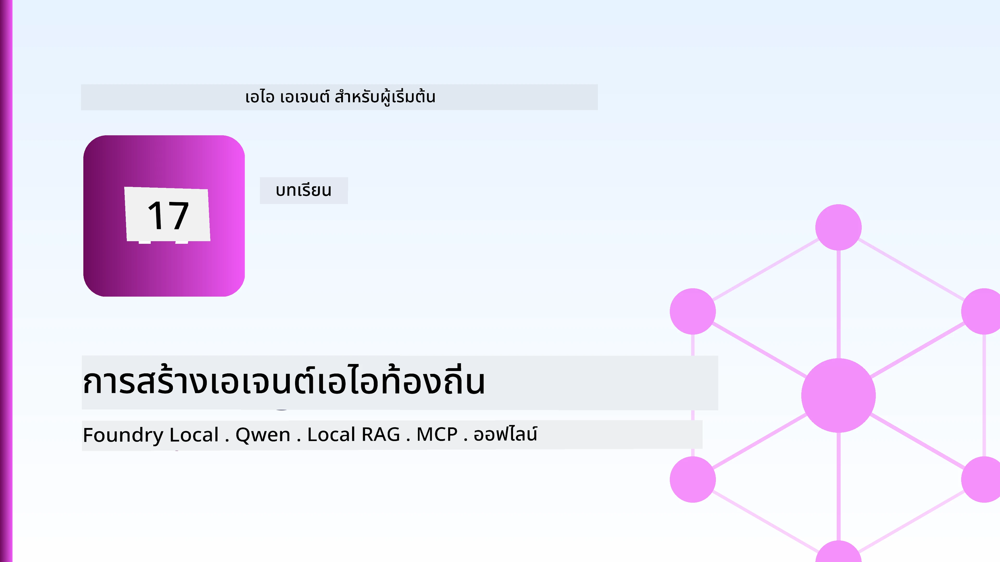
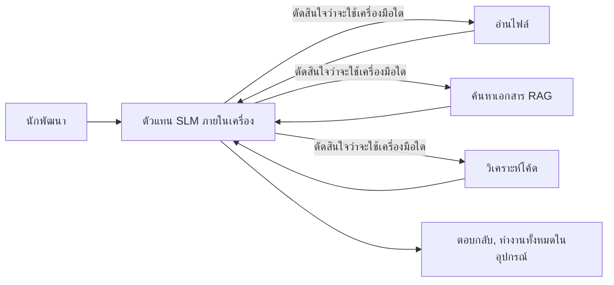
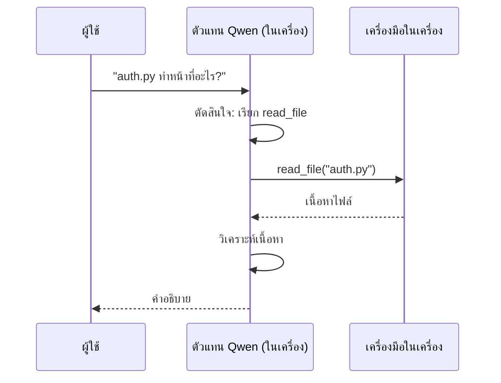
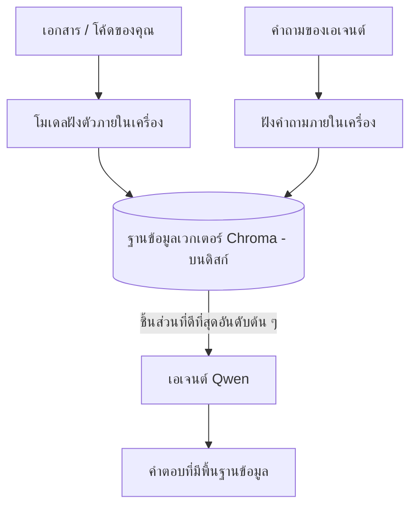
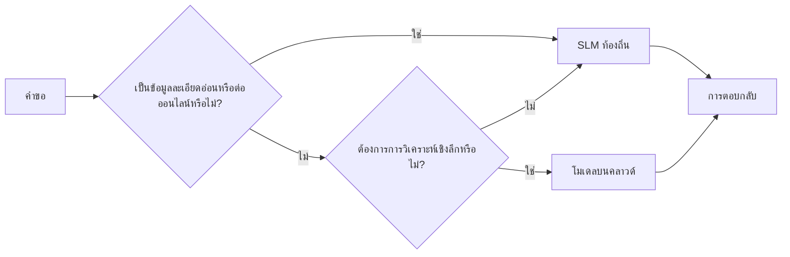

# การสร้างตัวแทน AI ท้องถิ่นโดยใช้ Microsoft Foundry Local และ Qwen



บทเรียนก่อนหน้านี้ได้ขยายขนาดตัวแทน *ขึ้น* สู่คลาวด์ บทเรียนนี้จะพาพวกเขา *ลงมา* บนเครื่องเดียว เมื่อจบคุณจะมีผู้ช่วยวิศวกรรมที่ใช้งานได้จริงซึ่งสามารถวิเคราะห์เหตุผล เรียกเครื่องมือ อ่านไฟล์ของคุณ และค้นหาคู่มือเอกสาร — **โดยไม่มีการเรียกใช้การอนุมานบนคลาวด์แม้แต่ครั้งเดียว**

ทำไมคุณถึงอยากได้แบบนั้น? มีสามเหตุผลที่มักจะพบในการทำงานวิศวกรรมจริง:

- **ความเป็นส่วนตัว.** โค้ดและเอกสารจะไม่ออกจากเครื่อง ไม่มีการส่ง prompt, snippet หรือข้อมูลลูกค้าข้ามเครือข่าย
- **ค่าใช้จ่าย.** การอนุมานในเครื่องไม่มีค่าใช้จ่ายต่อโทเค็น คุณสามารถทำซ้ำได้ทั้งวันในราคาค่าไฟฟ้าเท่านั้น
- **ออฟไลน์.** บนเครื่องบิน ในสถานที่ปลอดภัย หรือในช่วงที่ไฟดับ ตัวแทนยังคงทำงานได้

ข้อจำกัดคือคุณแลกโมเดลคลาวด์ชั้นแนวหน้าด้วย **โมเดลภาษาขนาดเล็ก (SLM)** ที่ทำงานบน CPU, GPU หรือ NPU ของคุณ บทเรียนนี้เกี่ยวกับการสร้างตัวแทนที่ *ดี* ภายในข้อจำกัดนั้น แทนการทำเป็นว่าไม่มีข้อจำกัด

## บทนำ

บทเรียนนี้จะครอบคลุม:

- **โมเดลภาษาขนาดเล็ก (SLMs)** — คืออะไร, จุดเด่น, และจุดด้อย
- **Microsoft Foundry Local** — รันไทม์ที่ดาวน์โหลดและให้บริการโมเดลบนอุปกรณ์ผ่าน **API ที่เข้ากันได้กับ OpenAI**
- **โมเดล Qwen ที่เรียกใช้งานฟังก์ชัน** — SLM ที่สร้างการเรียกเครื่องมืออย่างน่าเชื่อถือ ซึ่งทำให้ตัวแทน *ท้องถิ่น* (ไม่ใช่แค่แชทท้องถิ่น) เป็นไปได้
- **เครื่องมือท้องถิ่น, RAG ท้องถิ่น และ MCP ท้องถิ่น** — ให้ความสามารถแก่ตัวแทนโดยไม่ต้องพึ่งคลาวด์
- **รูปแบบไฮบริด** — เมื่อใดควรรักษาไว้ในท้องถิ่นและเมื่อใดควรไปคลาวด์

## เป้าหมายการเรียนรู้

เมื่อจบบทเรียนนี้ คุณจะรู้วิธี:

- อธิบายการแลกเปลี่ยนของ SLM และเลือกกรณีใช้งานตัวแทนท้องถิ่นที่เหมาะสม
- ให้บริการโมเดล Qwen ในเครื่องด้วย Foundry Local และเชื่อมต่อผ่านจุดสิ้นสุดที่เข้ากันได้กับ OpenAI
- สร้างตัวแทนที่เรียกใช้เครื่องมือได้ซึ่งทำงานทั้งหมดบนเวิร์กสเตชันของคุณ
- เพิ่ม RAG ท้องถิ่นบนเอกสารของคุณเองโดยใช้ฐานข้อมูลเวกเตอร์ท้องถิ่น (Chroma)
- เชื่อมต่อกับตัวแทนไปยังเซิร์ฟเวอร์ MCP ท้องถิ่นและวิเคราะห์การออกแบบไฮบริดระหว่างท้องถิ่น/คลาวด์

## ความต้องการเบื้องต้น

บทเรียนนี้สมมติว่าคุณได้ผ่านบทเรียนก่อนหน้าและคุ้นเคยกับ:

- [การใช้เครื่องมือ](../04-tool-use/README.md) (บทเรียน 4) และ [Agentic RAG](../05-agentic-rag/README.md) (บทเรียน 5)
- [โปรโตคอลตัวแทน / MCP](../11-agentic-protocols/README.md) (บทเรียน 11)
- [Microsoft Agent Framework](../14-microsoft-agent-framework/README.md) (บทเรียน 14)

คุณจะต้องมี:

- เวิร์กสเตชันของนักพัฒนา **RAM อย่างน้อย 8 GB จึงจะใช้งานได้จริง**; 16 GB ขึ้นไปจะสะดวก GPU หรือ NPU ช่วยได้แต่ไม่จำเป็น
- ติดตั้ง **Microsoft Foundry Local** (ดูส่วนการตั้งค่าด้านล่าง)
- Python 3.12+ และแพ็กเกจในรีโพสิตอรี่ [`requirements.txt`](../../../requirements.txt) รวมทั้ง `foundry-local-sdk`, `openai` และ `chromadb` สำหรับบทเรียนนี้

## โมเดลภาษาขนาดเล็ก: เครื่องมือที่เหมาะสำหรับงานภายในเครื่อง

โมเดลคลาวด์ชั้นแนวหน้ามีพารามิเตอร์หลายแสนล้านตัวและมีศูนย์ข้อมูลขนาดใหญ่เบื้องหลัง ในขณะที่ SLM มีพารามิเตอร์เพียงไม่กี่พันล้านตัวและต้องใส่ใน RAM ของแล็ปท็อปคุณ ความแตกต่างนี้สร้างความคาดหวังที่ชัดเจน

**SLM มีความสามารถดีในด้าน:**

- งานที่มีโครงสร้างและจำกัดขอบเขต — การจัดประเภท, การสกัดข้อมูล, การสรุปเอกสารที่รู้จัก
- **การเรียกเครื่องมือ** — การตัดสินใจว่าจะเรียกใช้ฟังก์ชันใดและด้วยอาร์กิวเมนต์อะไร
- การทำซ้ำอย่างรวดเร็ว, ถูก, มีความเป็นส่วนตัว บนข้อมูลของคุณเอง

**SLM มีจุดอ่อนในด้าน:**

- การให้เหตุผลแบบเปิดกว้างหลายกระโดดผ่านบริบทขนาดใหญ่
- ความรู้ทั่วไปกว้างๆ (เพราะได้เห็นข้อมูลน้อยกว่าและลืมได้มากกว่า)

กลยุทธ์ที่ชนะสำหรับตัวแทนท้องถิ่นคือ: **ให้ SLM ควบคุมการทำงาน และปล่อยให้เครื่องมือทำงานหนัก** โมเดลไม่จำเป็นต้อง *รู้* ฐานโค้ดของคุณ — เพียงแค่รู้ว่าเมื่อใดควรเรียก `read_file` และ `search_docs` นั่นสอดคล้องกับจุดแข็งของ SLM โดยตรง



## Microsoft Foundry Local

**Microsoft Foundry Local** เป็นรันไทม์น้ำหนักเบาที่ดาวน์โหลด จัดการ และให้บริการโมเดลทั้งหมดบนเครื่องของคุณ ฟีเจอร์ที่สำคัญที่สุดสำหรับเราคือมันเปิดเผย **จุดสิ้นสุด HTTP ที่เข้ากันได้กับ OpenAI** — หมายความว่า OpenAI SDK และไคลเอนต์ OpenAI ของ Microsoft Agent Framework สามารถทำงานกับมันได้โดยเปลี่ยนเพียง `base_url` เท่านั้น ทุกอย่างที่คุณเรียนรู้เกี่ยวกับการสร้างตัวแทนสามารถใช้ได้โดยตรง; มีเพียงจุดสิ้นสุดที่เปลี่ยนจากคลาวด์เป็น `localhost`

Foundry Local ยังเลือกเวอร์ชันโมเดลที่เหมาะสมที่สุดกับฮาร์ดแวร์ของคุณโดยอัตโนมัติ — สร้างสำหรับ CPU, CUDA/GPU หรือ NPU — คุณไม่ต้องปรับแต่งด้วยตัวเองตามเครื่อง

### การตั้งค่า

ติดตั้ง Foundry Local (ดู [เอกสาร](https://learn.microsoft.com/azure/ai-foundry/foundry-local/) สำหรับระบบปฏิบัติการของคุณ) จากนั้นตรวจสอบว่าทำงานได้:

```bash
# ติดตั้ง (ตัวอย่าง; ปฏิบัติตามเอกสารสำหรับแพลตฟอร์มของคุณ)
winget install Microsoft.FoundryLocal      # วินโดวส์
# brew install microsoft/foundrylocal/foundrylocal   # macOS

# ดาวน์โหลดและรันโมเดล Qwen แล้วเริ่มบริการภายในเครื่อง
foundry model run qwen2.5-7b-instruct
foundry service status
```

เมื่อบริการกำลังทำงาน คุณจะมีจุดสิ้นสุด OpenAI-compatible ในเครื่อง (โดยปกติคือ `http://localhost:PORT/v1`) โน้ตบุ๊กใช้ `foundry-local-sdk` เพื่อค้นหาจุดสิ้นสุดโดยอัตโนมัติ ดังนั้นคุณไม่ต้องกำหนดพอร์ตแบบรหัสคงที่

## การเรียกฟังก์ชันของ Qwen: ทำไมมันสำคัญ

ตัวแทนคือตัวแทนก็ต่อเมื่อมันสามารถเรียกใช้เครื่องมือได้ SLM หลายตัวสามารถแชทได้แต่สร้างการเรียกเครื่องมือที่ไม่เสถียรและผิดรูปแบบ **โมเดล Qwen** ถูกฝึกให้เรียกใช้ฟังก์ชันและสร้างโครงสร้างการเรียกเครื่องมือที่ถูกต้องสม่ำเสมอ — ซึ่งเปลี่ยนโมเดลแชทท้องถิ่นให้กลายเป็น *ตัวแทนท้องถิ่น* ได้จริง

การทำงานเป็นลูปเรียกใช้งานเครื่องมือแบบมาตรฐานที่คุณรู้จักดี แต่อยู่บนอุปกรณ์:



## RAG ท้องถิ่น

การค้นหาคู่มือเอกสารคือที่ตัวแทนท้องถิ่นทำเงินแท้จริง แทนที่จะหวังว่า SLM จะจำเอกสารของเฟรมเวิร์กคุณได้ คุณฝังเอกสารเหล่านั้นลงใน **ฐานข้อมูลเวกเตอร์ท้องถิ่น** และให้ตัวแทนดึงข้อมูลส่วนที่เกี่ยวข้องตามความต้องการ

เราใช้ **Chroma** ซึ่งเป็นฐานข้อมูลเวกเตอร์ฝังตัวที่ทำงานในกระบวนการเดียวกันโดยไม่มีเซิร์ฟเวอร์จัดการ กระบวนการทั้งหมดเป็นแบบท้องถิ่น: โมเดลฝังตัวในเครื่อง → เวกเตอร์ในเครื่อง → การดึงข้อมูลในเครื่อง → SLM ในเครื่อง



นี่คือรูปแบบ Agentic RAG เดิมจากบทเรียน 5 — การเปลี่ยนแปลงเพียงอย่างเดียวคือทุกส่วนทำงานบนเครื่องของคุณ

## เซิร์ฟเวอร์ MCP ท้องถิ่น

[MCP](../11-agentic-protocols/README.md) เป็นช่องทางการสื่อสาร ไม่ใช่บริการคลาวด์ เซิร์ฟเวอร์ MCP สามารถทำงานเป็นกระบวนการท้องถิ่นบน `stdio` เปิดเผยเครื่องมือให้ตัวแทนของคุณผ่านโปรโตคอลมาตรฐาน ซึ่งช่วยให้คุณใช้ซ้ำระบบนิเวศของเซิร์ฟเวอร์ MCP ที่มีอยู่ — การเข้าถึงระบบไฟล์, การทำงานกับ git, การสืบค้นฐานข้อมูล — ทั้งหมดเป็นแบบออฟไลน์

ความปลอดภัยแตกต่างจากคลาวด์แต่ไม่ขาดหาย: เซิร์ฟเวอร์ MCP ท้องถิ่นยังทำงานด้วยสิทธิ์ของผู้ใช้คุณ ดังนั้นจำกัดขอบเขตสิ่งที่มันเข้าถึงได้ (เช่น โฟลเดอร์โปรเจค ไม่ใช่โฟลเดอร์บ้านทั้งหมด) และจัดการผลลัพธ์เสมือนเป็นอินพุตเพื่อตรวจสอบ

## รูปแบบผสมคลาวด์และท้องถิ่น

การเลือกแบบ “ท้องถิ่นก่อน” ไม่ได้หมายความว่าต้องใช้แค่ท้องถิ่น ระบบที่พัฒนาแล้วจะแยกเส้นทางตามความละเอียดอ่อนและความยาก:

| สถานการณ์ | ทำงานที่ไหน |
| --- | --- |
| โค้ด/ข้อมูลที่ละเอียดอ่อน หรือออฟไลน์ | **SLM ท้องถิ่น** |
| งานง่ายๆ ที่จำกัดขอบเขต | **SLM ท้องถิ่น** (ถูกและเร็ว) |
| การให้เหตุผลแบบหลายกระโดดยากๆ บนข้อมูลไม่ละเอียดอ่อน | **โมเดลคลาวด์** |
| ทุกสิ่งในช่วงที่ไฟดับ | **SLM ท้องถิ่น** (ลดความสามารถอย่างราบรื่น) |

สิ่งนี้สะท้อนแนวคิด **การจัดเส้นทางโมเดล** จากบทเรียน 16 — ยกเว้นว่า "โมเดล" หนึ่งตอนนี้คือเครื่องของคุณเอง การออกแบบที่ทนทานจะถอยกลับสู่ท้องถิ่นเมื่อคลาวด์ไม่พร้อมใช้งาน เพื่อให้ตัวแทนลดคุณภาพลงอย่างช้าๆ แทนที่จะล้มเหลวทันที



## ห้องทดลอง: ผู้ช่วยวิศวกรรมท้องถิ่น

เปิด [`code_samples/17-local-agent-foundry-local.ipynb`](./code_samples/17-local-agent-foundry-local.ipynb) และทำตาม คุณจะสร้าง **ผู้ช่วยวิศวกรรมท้องถิ่น** ที่ทำงานทั้งหมดบนเวิร์กสเตชันของคุณและสามารถ:

1. **เรียกใช้เครื่องมือ** — ผ่านการเรียกฟังก์ชัน Qwen ผ่าน Foundry Local
2. **จัดการไฟล์ท้องถิ่น** — แสดงรายการและอ่านไฟล์ในไดเร็กทอรีโปรเจค
3. **วิเคราะห์โค้ด** — รายงานเมตริกพื้นฐานของไฟล์ต้นฉบับ
4. **ค้นหาคู่มือเอกสาร** — RAG ท้องถิ่นบนโฟลเดอร์เอกสารด้วย Chroma
5. **ใช้ MCP** — เชื่อมต่อกับเซิร์ฟเวอร์ MCP ท้องถิ่น (ข้ามอย่างสุภาพถ้าไม่มีการตั้งค่า)

ไม่มีการใช้การอนุมานบนคลาวด์ในทุกขั้นตอน

### การเดินผ่านแบบทีละขั้น

ผู้ช่วยเชื่อมต่อกับ Foundry Local ผ่านจุดสิ้นสุด OpenAI-compatible ดังนั้นโค้ดตัวแทนแทบจะเหมือนกับบทเรียนคลาวด์ — มีแต่ไคลเอนต์ที่เปลี่ยน

```python
from foundry_local import FoundryLocalManager
from openai import OpenAI

# Foundry Local ค้นหา/ดาวน์โหลดโมเดลและให้เราใช้งานปลายทางในเครื่อง
manager = FoundryLocalManager(\"qwen2.5-7b-instruct\")
client = OpenAI(base_url=manager.endpoint, api_key=manager.api_key)  # api_key เป็นตัวแทนในเครื่องเฉยๆ
```

เครื่องมือเป็นฟังก์ชัน Python ธรรมดาที่จำกัดขอบเขตไว้ในโฟลเดอร์โปรเจค:

```python
def read_file(path: str) -> str:
    \"\"\"Read a file, but only inside the sandboxed project directory.\"\"\"
    full = (PROJECT_ROOT / path).resolve()
    if PROJECT_ROOT not in full.parents and full != PROJECT_ROOT:
        return \"Access denied: path is outside the project directory.\"
    return full.read_text(encoding=\"utf-8\")
```

สังเกตการตรวจสอบ sandbox — แม้แต่ในเครื่องเอง เครื่องมือที่อ่านเส้นทางใดก็ได้ถือเป็นความเสี่ยง โน้ตบุ๊กจะจำกัดเครื่องมือทั้งหมดไว้ในรากโปรเจคเดียวกัน

## ตรวจสอบความเข้าใจ

ทดสอบความเข้าใจก่อนเข้าสู่การบ้าน

**1. อธิบายเหตุผลสองข้อที่ชัดเจนที่ควรใช้ตัวแทนในเครื่องแทนคลาวด์**

<details>
<summary>คำตอบ</summary>

สองข้อใดก็ได้จาก: **ความเป็นส่วนตัว** (โค้ดและข้อมูลไม่ออกจากเครื่อง), **ค่าใช้จ่าย** (ไม่มีบิลค่าใช้จ่ายต่อโทเค็น), และ **ความสามารถแบบออฟไลน์** (ใช้งานได้แม้ไม่มีเครือข่าย—บนเครื่องบิน ในสถานที่ปลอดภัย หรือช่วงไฟดับ) ข้อจำกัดด้านกฎระเบียบที่ห้ามส่งข้อมูลนอกรุ่นอุปกรณ์เป็นเหตุผลเรื่องความเป็นส่วนตัวที่พบได้บ่อย
</details>

**2. การแบ่งงานระหว่าง SLM กับเครื่องมือในการทำงานแบบตัวแทนในเครื่องควรเป็นอย่างไร และเพราะเหตุใด**

<details>
<summary>คำตอบ</summary>

ให้ SLM **ควบคุมการทำงาน** (ตัดสินใจว่าจะเรียกเครื่องมือใดและด้วยอาร์กิวเมนต์อะไร) และให้ **เครื่องมือทำงานหนัก** (อ่านไฟล์, ดึงเอกสาร, คำนวณผล) SLM แข็งแกร่งเรื่องการตัดสินใจในขอบเขตเช่นการเลือกเครื่องมือแต่ไม่เก่งความรู้กว้างและการให้เหตุผลหลายกระโดดยาวๆ ดังนั้นการพึ่งเครื่องมือช่วยเสริมจุดแข็งของมัน
</details>

**3. อะไรทำให้สามารถใช้ซ้ำโค้ดตัวแทนคลาวด์กับ Foundry Local ได้**

<details>
<summary>คำตอบ</summary>

Foundry Local เปิดเผย **จุดสิ้นสุด HTTP ที่เข้ากันได้กับ OpenAI** SDK ของ OpenAI และไคลเอนต์ OpenAI ของ Agent Framework สามารถใช้กับมันได้โดยเปลี่ยนแค่ `base_url` (และใช้คีย์ API จำลองแบบในเครื่อง) ส่วนที่เหลือของโค้ดตัวแทนไม่เปลี่ยนแปลง
</details>

**4. ทำไมเราถึงใช้โมเดลเรียกฟังก์ชัน Qwen โดยเฉพาะ แทน SLM ทั่วไป**

<details>
<summary>คำตอบ</summary>

เพราะตัวแทนต้องสร้างการเรียก **เครื่องมือที่น่าเชื่อถือและถูกต้อง** SLM หลายตัวแชทได้แต่ส่งโครงสร้างการเรียกเครื่องมือที่ผิดรูปหรือไม่สม่ำเสมอ โมเดล Qwen ถูกฝึกให้เรียกฟังก์ชันและส่งออกการเรียกเครื่องมือที่สม่ำเสมอ นั่นคือสิ่งที่เปลี่ยนโมเดลแชทท้องถิ่นให้กลายเป็นตัวแทนท้องถิ่นที่ใช้งานได้จริง
</details>

**5. ในขั้นตอน RAG ท้องถิ่น องค์ประกอบใดบ้างที่ทำงานบนเครื่อง**

<details>
<summary>คำตอบ</summary>

ทั้งหมด: โมเดลฝังตัว, ฐานข้อมูลเวกเตอร์ (Chroma บนดิสก์), ขั้นตอนการดึงข้อมูล, และ SLM เอกสารถูกฝังตัวในเครื่อง, เก็บในเครื่อง, ดึงในเครื่อง และถูกวิเคราะห์โดยโมเดลท้องถิ่น ไม่มีองค์ประกอบใดสัมผัสคลาวด์
</details>

**6. เซิร์ฟเวอร์ MCP ในเครื่องทำงานบนเครื่องคุณ มันปลอดภัยโดยอัตโนมัติหรือ? คุณควรระวังอะไรบ้าง**

<details>
<summary>คำตอบ</summary>

ไม่ใช่ เซิร์ฟเวอร์ MCP ท้องถิ่นทำงานด้วยสิทธิ์ของผู้ใช้คุณ ดังนั้นมันเข้าถึงทุกอย่างที่คุณเข้าถึงได้ ควบคุมขอบเขตสิ่งที่มันสามารถเข้าถึง (เช่น โฟลเดอร์โปรเจคเดียวแทนโฟลเดอร์บ้านทั้งหมด) และพิจารณาผลลัพธ์ของมันเป็นอินพุตที่ต้องตรวจสอบก่อนจะดำเนินการต่อ
</details>

**7. อธิบายนโยบายการจัดเส้นทางแบบผสมที่สมเหตุสมผลซึ่งรวมโมเดลท้องถิ่น**

<details>
<summary>คำตอบ</summary>

ส่งคำขอที่ละเอียดอ่อนหรือออฟไลน์ไปยัง SLM ท้องถิ่น; ส่งงานง่ายๆ ที่มีขอบเขตจำกัดไป SLM ท้องถิ่นเพื่อความเร็วและประหยัด; ส่งการให้เหตุผลหลายกระโดดยากบนข้อมูลที่ไม่ละเอียดอ่อนไปยังโมเดลคลาวด์; และถ้าคลาวด์ไม่พร้อมใช้งาน ให้ถอยกลับไปใช้ SLM ท้องถิ่น เพื่อให้ตัวแทนลดประสิทธิภาพอย่างราบรื่นแทนล้มเหลว นี่คือการจัดเส้นทางโมเดล (บทเรียน 16) โดยมีเครื่องท้องถิ่นเป็นหนึ่งในโมเดล
</details>

**8. ขนาด RAM ขั้นต่ำที่เหมาะสมสำหรับรันตัวแทนท้องถิ่นในบทเรียนนี้คือเท่าไร และ RAM เพิ่มเติมช่วยอะไรได้บ้าง**

<details>
<summary>คำตอบ</summary>

ประมาณ **8 GB** เป็นขั้นต่ำที่เหมาะสม; 16 GB ขึ้นไปจะสะดวก RAM เพิ่มช่วยให้คุณรันโมเดลที่ใหญ่และมีความสามารถมากขึ้น และเก็บบริบทในหน่วยความจำได้มากขึ้น GPU หรือ NPU ช่วยเร่งการอนุมานแต่ไม่จำเป็น — Foundry Local จะเลือกเวอร์ชัน CPU เมื่อไม่มีอุปกรณ์เร่งความเร็ว
</details>

## การบ้าน

ขยายผู้ช่วยวิศวกรรมท้องถิ่นเป็น **ผู้ตรวจสอบเอกสารท้องถิ่น** สำหรับโปรเจคเล็กๆ ที่คุณเลือก (ใช้โฟลเดอร์บทเรียนจากรีโพนี้ก็ได้)

สิ่งที่ต้องส่ง:

1. **ทำดัชนีโฟลเดอร์เอกสาร/โค้ดจริงๆ** ลงใน Chroma (อย่างน้อยห้าไฟล์)
2. **เพิ่มเครื่องมือ `find_todos`** ที่สแกนโปรเจคหา comment `TODO`/`FIXME` และส่งกลับพร้อมไฟล์และหมายเลขบรรทัด — โดยยังคงการตรวจสอบ sandbox แบบเดียวกับ `read_file`

3. **ถามตัวแทนสามคำถาม** ที่บังคับให้มันรวมเครื่องมือเข้าด้วยกัน: หนึ่งคำถาม RAG ล้วน ๆ หนึ่งคำถามที่ต้องอ่านไฟล์เฉพาะ และหนึ่งคำถามที่ต้องหางาน TODOs
4. **วัดผล**: จับเวลาคำตอบทั้งสามและบันทึกในเซลล์ markdown แสดงความคิดเห็นว่าความหน่วงเวลาเป็นที่ยอมรับสำหรับเวิร์กโฟลว์ที่ตั้งใจไว้หรือไม่

จากนั้นเขียนย่อหน้าสั้น ๆ เกี่ยวกับ **สิ่งที่คุณจะย้ายไปยังคลาวด์และสิ่งที่คุณจะเก็บไว้ในเครื่อง** สำหรับผู้ตรวจสอบนี้ และเหตุผล คุณจะได้รับการประเมินจากว่าคอมโพเนนต์ในเครื่องเชื่อมต่อกันถูกต้องหรือไม่ และตรรกะแบบไฮบริดของคุณสมเหตุสมผลหรือไม่ — ไม่ได้ประเมินคุณภาพของโมเดล

## สรุป

ในบทเรียนนี้คุณได้สร้างตัวแทนที่ทำงานทั้งหมดบนเครื่องของคุณเอง:

- **SLMs** แลกเปลี่ยนความกว้างด้วยความเป็นส่วนตัว ค่าใช้จ่าย และการทำงานแบบออฟไลน์ — และโดดเด่นเมื่อพวกมัน **ประสานงานเครื่องมือ** แทนที่จะเก็บความรู้ทั้งหมดไว้เอง
- **Foundry Local** ให้บริการโมเดลบนอุปกรณ์พร้อมจุดสิ้นสุดที่ **เข้ากันได้กับ OpenAI** ดังนั้นโค้ดตัวแทนคลาวด์ของคุณจึงเปลี่ยนได้ด้วยการเปลี่ยนเพียงบรรทัดเดียว
- **โมเดล Qwen ที่เรียกใช้ฟังก์ชัน** ทำให้การเรียกเครื่องมือในเครื่องเชื่อถือได้ — และดังนั้น *ตัวแทน* ในเครื่องจึงเป็นไปได้
- **Local RAG** (Chroma) และ **local MCP** ให้ความสามารถแก่ตัวแทนโดยไม่ต้องออกจากเครื่อง
- **รูปแบบไฮบริด** ให้คุณส่งต่อโดยตามความอ่อนไหวและความยาก โดยมีเครื่องในเครื่องเป็นทางเลือกฉุกเฉินที่สมูธ

นี่คือการปิดเส้นทางการปรับใช้: บทเรียนที่ 16 ขยายตัวแทนไปยัง Microsoft Foundry และบทเรียนนี้ย่อส่วนลงสู่เวิร์กสเตชันเครื่องเดียว บทเรียนถัดไปจะพูดถึงการรักษาความปลอดภัยให้กับตัวแทนที่ปรับใช้แล้ว

## แหล่งข้อมูลเพิ่มเติม

- <a href="https://learn.microsoft.com/azure/ai-foundry/foundry-local/" target="_blank">เอกสาร Microsoft Foundry Local</a>
- <a href="https://learn.microsoft.com/azure/ai-foundry/what-is-azure-ai-foundry" target="_blank">เอกสาร Microsoft Foundry</a>
- <a href="https://aka.ms/ai-agents-beginners/agent-framework" target="_blank">เฟรมเวิร์ก Microsoft Agent</a>
- <a href="https://qwen.readthedocs.io/en/latest/framework/function_call.html" target="_blank">เอกสารการเรียกฟังก์ชัน Qwen</a>
- <a href="https://modelcontextprotocol.io/" target="_blank">โปรโตคอลบริบทโมเดล (MCP)</a>
- <a href="https://docs.trychroma.com/" target="_blank">ฐานข้อมูลเวกเตอร์ Chroma</a>

## บทเรียนก่อนหน้า

[การปรับใช้ตัวแทนขยายได้](../16-deploying-scalable-agents/README.md)

## บทเรียนถัดไป

[การรักษาความปลอดภัยตัวแทน AI](../18-securing-ai-agents/README.md)

---

<!-- CO-OP TRANSLATOR DISCLAIMER START -->
**ปฏิเสธความรับผิดชอบ**:
เอกสารนี้ได้รับการแปลโดยใช้บริการแปลภาษา AI [Co-op Translator](https://github.com/Azure/co-op-translator) ขณะที่เราพยายามให้ความถูกต้อง โปรดทราบว่าการแปลโดยอัตโนมัติอาจมีข้อผิดพลาดหรือความไม่ถูกต้อง เอกสารต้นฉบับในภาษาต้นทางควรถูกพิจารณาเป็นแหล่งข้อมูลที่เชื่อถือได้ สำหรับข้อมูลที่สำคัญ แนะนำให้ใช้การแปลโดยมนุษย์มืออาชีพ เราไม่รับผิดชอบต่อความเข้าใจผิดหรือการตีความที่ผิดพลาดที่เกิดขึ้นจากการใช้การแปลนี้
<!-- CO-OP TRANSLATOR DISCLAIMER END -->