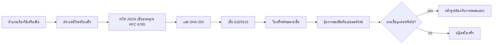
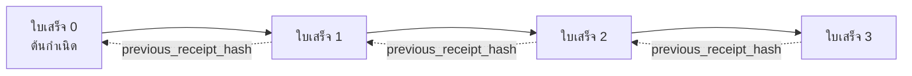

[รับชมวิดีโอบทเรียน: การรักษาความปลอดภัยเอเจนต์ AI ด้วยใบเสร็จเข้ารหัส](https://youtu.be/PLACEHOLDER_VIDEO_ID)

> _(วิดีโอบทเรียนและภาพปกจะถูกเพิ่มโดยทีมเนื้อหาของ Microsoft หลังการรวม ร่วมกับรูปแบบบทเรียนที่ 14 / 15)_

# การรักษาความปลอดภัยเอเจนต์ AI ด้วยใบเสร็จเข้ารหัส

## บทนำ

บทเรียนนี้จะครอบคลุม:

- เหตุผลว่าทำไมเส้นทางตรวจสอบสำหรับเอเจนต์ AI ถึงสำคัญสำหรับการปฏิบัติตามกฎ ระบุข้อบกพร่อง และความน่าเชื่อถือ
- ใบเสร็จเข้ารหัสคืออะไรและแตกต่างจากบันทึกที่ไม่มีลายเซ็นอย่างไร
- วิธีการสร้างใบเสร็จที่ลงลายเซ็นสำหรับการเรียกใช้เครื่องมือของเอเจนต์ด้วย Python ธรรมดา
- วิธีตรวจสอบใบเสร็จแบบออฟไลน์และตรวจจับการปลอมแปลง
- วิธีเชื่อมโยงใบเสร็จให้เป็นโซ่เพื่อให้การลบหรือการเปลี่ยนลำดับใบเสร็จใด ๆ ทำลายโซ่
- ใบเสร็จพิสูจน์อะไรได้บ้างและสิ่งที่ใบเสร็จไม่ได้พิสูจน์อย่างชัดเจน

## เป้าหมายการเรียนรู้

หลังจากจบบทเรียนนี้ คุณจะรู้วิธี:

- ระบุโหมดล้มเหลวที่เป็นแรงจูงใจในการใช้การพิสูจน์ที่มาด้วยลายเซ็นดิจิทัลสำหรับการกระทำของเอเจนต์
- สร้างใบเสร็จที่ลงลายเซ็น Ed25519 จากข้อมูล JSON แบบมาตรฐาน
- ตรวจสอบใบเสร็จอย่างอิสระโดยใช้เพียงกุญแจสาธารณะของผู้ลงลายเซ็น
- ตรวจจับการปลอมแปลงโดยการตรวจสอบซ้ำในใบเสร็จที่ถูกแก้ไข
- สร้างลำดับใบเสร็จแบบแฮชเชนและอธิบายว่าทำไมโซ่นี้จึงสำคัญ
- แยกแยะขอบเขตระหว่างสิ่งที่ใบเสร็จพิสูจน์ได้ (การระบุแหล่งที่มา ความสมบูรณ์ ความถูกลำดับ) และสิ่งที่ใบเสร็จไม่ได้พิสูจน์ (ความถูกต้องของการกระทำ ความสมเหตุสมผลของนโยบาย)

## ปัญหา: เส้นทางตรวจสอบของเอเจนต์ของคุณ

ลองนึกภาพว่าคุณได้ปรับใช้เอเจนต์ AI สำหรับ Contoso Travel เอเจนต์อ่านคำขอของลูกค้า เรียกใช้ API ของสายการบินเพื่อค้นหาตัวเลือก และจองที่นั่งแทนลูกค้า เมื่อไตรมาสที่ผ่านมา เอเจนต์ได้ประมวลผลการจองไป 50,000 รายการ

วันนี้มีผู้ตรวจสอบมา พวกเขาถามคำถามง่าย ๆ ว่า "แสดงให้ฉันดูว่าเอเจนต์ของคุณทำอะไรไปบ้าง"

คุณส่งไฟล์บันทึกให้ ผู้ตรวจสอบดูไฟล์แล้วถามคำถามที่ยากขึ้นคือ "แล้วฉันจะรู้ได้อย่างไรว่าไฟล์บันทึกเหล่านี้ไม่ได้ถูกแก้ไข?"

นี่คือปัญหาเส้นทางตรวจสอบส่วนใหญ่ เอเจนต์ที่ปรับใช้ส่วนใหญ่ในวันนี้พึ่งพา:

- **บันทึกแอปพลิเคชัน**: เขียนโดยเอเจนต์เอง สามารถแก้ไขได้โดยผู้ใดก็ตามที่เข้าถึงระบบไฟล์
- **บริการบันทึกบนคลาวด์**: มีหลักฐานการปลอมแปลงในระดับแพลตฟอร์ม แต่ก็ต่อเมื่อผู้ตรวจสอบเชื่อถือผู้ดำเนินการแพลตฟอร์มเท่านั้น
- **บันทึกรายการธุรกรรมในฐานข้อมูล**: เหมาะสำหรับการเปลี่ยนแปลงฐานข้อมูลแต่ไม่เหมาะสำหรับการเรียกใช้เครื่องมือที่หลากหลาย

ไม่มีวิธีใดเหล่านี้ที่จะตอบคำถามของผู้ตรวจสอบโดยไม่ต้องให้ผู้ตรวจสอบไว้วางใจใครบางคน (คุณ ผู้ให้บริการคลาวด์ของคุณ หรือผู้ขายฐานข้อมูลของคุณ) สำหรับการใช้งานภายใน ความไว้วางใจนั้นมักจะยอมรับได้ แต่สำหรับงานที่ถูกกำกับดูแล (การเงิน ดูแลสุขภาพ หรือการบังคับใช้กฎหมายของสหภาพยุโรป) ไม่เป็นเช่นนั้น

ใบเสร็จเข้ารหัสแก้ปัญหานี้โดยทำให้แต่ละการกระทำของเอเจนต์ตรวจสอบได้อย่างเป็นอิสระ ผู้ตรวจสอบไม่ต้องไว้วางใจคุณ พวกเขาต้องการเพียงกุญแจสาธารณะและใบเสร็จเท่านั้น

## ใบเสร็จเข้ารหัสคืออะไร?

ใบเสร็จเป็นวัตถุ JSON ที่บันทึกสิ่งที่เอเจนต์ทำ โดยลงลายเซ็นดิจิทัล



ใบเสร็จขั้นต่ำมีลักษณะดังนี้:

```json
{
  "type": "agent.tool_call.v1",
  "agent_id": "contoso-travel-bot",
  "tool_name": "lookup_flights",
  "tool_args_hash": "sha256:a3f9c1...",
  "result_hash": "sha256:7b2e1d...",
  "policy_id": "contoso-travel-policy-v3",
  "timestamp": "2026-04-25T14:30:00Z",
  "sequence": 47,
  "previous_receipt_hash": "sha256:9d4e6a...",
  "signature": {
    "alg": "EdDSA",
    "sig": "c5af83...",
    "public_key": "8f3b2c..."
  }
}
```

มีสามคุณสมบัติที่ทำงานนี้:

1. **ลายเซ็น** ใบเสร็จได้รับการลงลายเซ็นโดยเกตเวย์ของเอเจนต์โดยใช้กุญแจส่วนตัว Ed25519 ใครก็ตามที่มีคีย์สาธารณะที่ตรงกันสามารถตรวจสอบลายเซ็นแบบออฟไลน์ได้ การปลอมแปลงในช่องใด ๆ จะทำให้ลายเซ็นเป็นโมฆะ

2. **การเข้ารหัสแบบมาตรฐาน** ก่อนลงลายเซ็น ใบเสร็จถูกจัดเก็บเป็นลำดับไบต์โดยใช้ JSON Canonicalization Scheme (JCS, RFC 8785) ซึ่งรับรองว่าในสองการประมวลผลที่เหมือนกันจะได้ไบต์ที่เหมือนกันโดยสมบูรณ์ หากไม่มีการเข้ารหัสแบบมาตรฐาน ชุด JSON serializer ที่ต่างกันจะทำให้ลายเซ็นต่างกันสำหรับเนื้อหาเดียวกัน

3. **การเชนแฮช** ช่อง `previous_receipt_hash` ทำหน้าที่เชื่อมใบเสร็จแต่ละฉบับกับใบเสร็จก่อนหน้า การลบหรือเปลี่ยนลำดับใบเสร็จจะทำลายใบเสร็จที่ตามมาในโซ่ทั้งหมด การปลอมแปลงจะเห็นได้ในระดับโซ่แม้ว่าจะข้ามลายเซ็นรายบุคคลไปได้

คุณสมบัติเหล่านี้ทำหน้าที่ให้การรับประกันสามประการ:

- **การระบุแหล่งที่มา**: กุญแจนี้เป็นผู้ลงลายเซ็นเนื้อหานี้
- **ความสมบูรณ์**: เนื้อหาไม่ได้ถูกเปลี่ยนแปลงตั้งแต่ลงลายเซ็น
- **การเรียงลำดับ**: ใบเสร็จนี้มาในลำดับถัดจากใบเสร็จก่อนหน้าในโซ่

## การสร้างใบเสร็จใน Python

คุณไม่จำเป็นต้องใช้ไลบรารีพิเศษเพื่อสร้างใบเสร็จ ฟังก์ชันคริปโตกราฟีที่จำเป็นมีทั่วไปและตรรกะมีเพียงไม่กี่สิบบรรทัดใน Python

แบบฝึกหัดในไฟล์ `code_samples/18-signed-receipts.ipynb` จะเดินผ่านกระบวนการทั้งหมด เวอร์ชันสรุปคือ:

```python
import json
import hashlib
import base64
from nacl import signing
from jcs import canonicalize  # JSON canonical ตาม RFC 8785

def b64url_nopad(data: bytes) -> str:
    return base64.urlsafe_b64encode(data).decode("ascii").rstrip("=")

def sha256_canonical(obj) -> str:
    """SHA-256 of a Python object's JCS-canonical JSON form."""
    return f"sha256:{hashlib.sha256(canonicalize(obj)).hexdigest()}"

# สร้างหรือโหลดกุญแจสำหรับลงชื่อ (ในสภาพแวดล้อมจริง ให้เก็บไว้ในที่เก็บกุญแจ)
signing_key = signing.SigningKey.generate()
verify_key = signing_key.verify_key

# สร้างข้อมูลใบเสร็จ (ยังไม่มีลายเซ็น)
tool_args = {"origin": "SYD", "destination": "LAX"}
tool_result = [{"flight": "QF11", "price": 1850, "stops": 0}]

payload = {
    "type": "agent.tool_call.v1",
    "agent_id": "contoso-travel-bot",
    "tool_name": "lookup_flights",
    "tool_args_hash": sha256_canonical(tool_args),
    "result_hash": sha256_canonical(tool_result),
    "policy_id": "contoso-travel-policy-v3",
    "timestamp": "2026-04-25T14:30:00Z",
    "sequence": 0,
    "previous_receipt_hash": None,
}

# ทำให้เป็นแบบ canonical, แฮช, ลงชื่อ
canonical_bytes = canonicalize(payload)
message_hash = hashlib.sha256(canonical_bytes).digest()
signature_bytes = signing_key.sign(message_hash).signature

# แนบวัตถุลายเซ็นที่มีโครงสร้าง
receipt = {
    **payload,
    "signature": {
        "alg": "EdDSA",
        "sig": b64url_nopad(signature_bytes),
        "public_key": b64url_nopad(bytes(verify_key)),
    },
}
```

นั่นคือขั้นตอนการลงลายเซ็นทั้งหมด แบบฝึกหัดในโน้ตบุ๊กจะอธิบายแต่ละขั้นตอน

## การตรวจสอบใบเสร็จและการตรวจจับการปลอมแปลง

การตรวจสอบเป็นการทำงานตรงกันข้าม:

```python
import base64
import hashlib
from nacl import signing
from nacl.exceptions import BadSignatureError
from jcs import canonicalize

def b64url_decode(s: str) -> bytes:
    padding = "=" * ((4 - len(s) % 4) % 4)
    return base64.urlsafe_b64decode(s + padding)

def verify_receipt(receipt: dict) -> bool:
    # ลายเซ็นเป็นวัตถุที่มีโครงสร้าง: {"alg", "sig", "public_key"}.
    sig_obj = receipt.get("signature")
    if not sig_obj or sig_obj.get("alg") != "EdDSA":
        return False

    # สร้างข้อมูลเพย์โหลดที่ถูกเซ็นจริง ๆ ใหม่ (ทุกอย่างยกเว้นลายเซ็น).
    payload = {k: v for k, v in receipt.items() if k != "signature"}

    canonical_bytes = canonicalize(payload)
    message_hash = hashlib.sha256(canonical_bytes).digest()

    try:
        verify_key = signing.VerifyKey(b64url_decode(sig_obj["public_key"]))
        verify_key.verify(message_hash, b64url_decode(sig_obj["sig"]))
        return True
    except BadSignatureError:
        return False
```

ฟังก์ชันนี้รับใบเสร็จและคืนค่า `True` หากลายเซ็นถูกต้อง และคืนค่า `False` หากไม่ถูกต้อง ไม่มีการเรียกใช้เครือข่าย ไม่มีการพึ่งพาบริการ ไม่มีความไว้วางใจจำเป็นสำหรับบุคคลที่สามใด ๆ

เพื่อดูการตรวจจับการปลอมแปลงในทางปฏิบัติ โน้ตบุ๊กจะเดินผ่าน:

1. สร้างใบเสร็จที่ถูกต้องและยืนยันว่าตรวจสอบได้
2. แก้ไขไบต์หนึ่งในช่อง `tool_args_hash`
3. ตรวจสอบซ้ำและพบว่าไม่ผ่าน

นี่คือการสาธิตในทางปฏิบัติว่าใบเสร็จสามารถบ่งชี้การปลอมแปลงได้: การแก้ไขใด ๆ ไม่ว่าจะเล็กน้อยเพียงใดก็จะทำให้ลายเซ็นขาดความถูกต้อง

## การเชนใบเสร็จสำหรับเอเจนต์ขั้นตอนหลายตอน

ใบเสร็จหนึ่งใบลงลายเซ็นปกป้องการกระทำหนึ่งอย่าง โซ่ของใบเสร็จจะปกป้องลำดับของหลายการกระทำ



ใบเสร็จแต่ละฉบับบันทึกแฮชของใบเสร็จก่อนหน้า หากต้องการลบใบเสร็จ 2 โดยเงียบ ๆ ผู้โจมตีต้อง:

- แก้ไขช่อง `previous_receipt_hash` ของใบเสร็จ 3 (จะทำลายลายเซ็นของใบเสร็จ 3) หรือ
- ปลอมลายเซ็นใหม่บนใบเสร็จ 3 ที่แก้ไข (ต้องใช้กุญแจส่วนตัวของเอเจนต์)

หากกุญแจส่วนตัวเก็บอยู่ในตู้นิรภัยฮาร์ดแวร์และคุณเผยแพร่กุญแจสาธารณะกับแต่ละใบเสร็จ การโจมตีทั้งสองแบบนี้จะไม่สามารถทำได้โดยไม่ถูกตรวจจับ

โน้ตบุ๊กจะอธิบาย:

1. การสร้างโซ่ของใบเสร็จสามใบ
2. การตรวจสอบว่า `previous_receipt_hash` ของแต่ละใบเสร็จตรงกับแฮชจริงของใบเสร็จก่อนหน้า
3. การปลอมแปลงใบเสร็จหนึ่งใบในกลางชุดและดูว่าโซ่แตกที่จุดนั้นพอดี

นี่คือวิธีการสร้างเส้นทางตรวจสอบที่ผู้ตรวจสอบภายนอกสามารถตรวจสอบได้โดยไม่ต้องไว้วางใจคุณ

## สิ่งที่ใบเสร็จพิสูจน์ได้ (และสิ่งที่ใบเสร็จไม่ได้พิสูจน์)

นี่คือส่วนที่สำคัญที่สุดของบทเรียน ใบเสร็จมีพลังแต่พลังนั้นมีขอบเขตจำกัด

**ใบเสร็จพิสูจน์สามสิ่ง:**

1. **การระบุแหล่งที่มา**: กุญแจเฉพาะตัวลงลายเซ็นบนข้อมูลเฉพาะ
2. **ความสมบูรณ์**: ข้อมูลไม่ได้เปลี่ยนแปลงตั้งแต่ลงลายเซ็น
3. **การเรียงลำดับ**: ใบเสร็จนี้อยู่ในลำดับหลังใบเสร็จอื่นในโซ่แฮช

**ใบเสร็จไม่ได้พิสูจน์:**

1. **ความถูกต้อง**: ว่าการกระทำของเอเจนต์นั้นถูกต้องหรือไม่ ใบเสร็จสามารถลงลายเซ็นสำหรับคำตอบที่ผิดได้เหมือนกับคำตอบที่ถูกต้อง
2. **การปฏิบัติตามนโยบาย**: ว่านโยบายที่ระบุใน `policy_id` ถูกประเมินจริงหรือไม่ หรือว่านโยบายนั้นจะอนุญาตให้ทำการกระทำนี้เมื่อมีการตรวจสอบ ใบเสร็จบันทึกสิ่งที่ระบุ แต่ไม่ใช่สิ่งที่ถูกบังคับใช้
3. **ตัวตนเกินกว่ากุญแจ**: ใบเสร็จบอกว่า "กุญแจนี้ลงลายเซ็นเนื้อหานี้" ไม่ได้บอกว่า "มนุษย์คนนี้อนุญาต" การเชื่อมโยงกุญแจเข้ากับบุคคลหรือนิติบุคคลต้องใช้โครงสร้างพื้นฐานตัวตนแยกต่างหาก (เช่น สมุดที่อยู่ การจดทะเบียนกุญแจสาธารณะ ฯลฯ)
4. **ความถูกต้องของอินพุต**: ถ้าเอเจนต์ได้รับพรอมต์ที่ถูกปลอมแปลงและดำเนินการตามนั้น ใบเสร็จจะบันทึกการกระทำนั้นอย่างถูกต้อง ใบเสร็จอยู่หลังการตรวจสอบความถูกต้องของอินพุต ไม่ใช่สิ่งทดแทน

ขอบเขตนี้สำคัญด้วยเหตุผลสองประการ:

- เพื่อแจ้งคุณว่าใบเสร็จมีประโยชน์สำหรับอะไร: ทำให้การกระทำของเอเจนต์ตรวจสอบได้และบ่งชี้การปลอมแปลงได้ แม้ข้ามพรมแด้องค์กร
- เพื่อแจ้งคุณว่ายังมีชั้นเพิ่มเติมที่คุณต้องใช้: การตรวจสอบอินพุต (บทเรียน 6) การบังคับใช้นโยบาย (ครอบคลุมอย่างย่อในส่วนล่าง) และโครงสร้างพื้นฐานตัวตน (นอกขอบเขตบทเรียนนี้)

ความผิดพลาดทั่วไปคือคิดว่า "เรามีใบเสร็จ" หมายถึง "เรามีการปกครอง" ซึ่งไม่ใช่ ใบเสร็จเป็นรากฐาน การปกครองคือระบบที่คุณสร้างบนรากฐานนั้น

## การพิสูจน์ว่ามนุษย์อนุมัติการกระทำที่แน่นอน

ข้อ 3 ข้างต้นมีความสำคัญจนควรมีส่วนแยก: ใบเสร็จการกระทำพูดว่า "กุญแจนี้ลงลายเซ็นเนื้อหานี้" แต่ไม่เคยกล่าวว่า "มนุษย์อนุญาต" สำหรับการกระทำที่มีความเสี่ยงสูง (การคืนเงิน การลบ การโอนเงิน) กรอบการกำกับดูแลกำลังเพิ่มความต้องการคำชี้แจงที่หายไปนี้ ซึ่งสามารถสร้างด้วยองค์ประกอบเดียวกับที่คุณสร้างในบทเรียนนี้แล้ว

โน้ตบุ๊ก `code_samples/human-authorization-receipts.ipynb` ที่ต่อเนื่องเพิ่มใบเสร็จชนิดที่สอง คือ `human.approval.v1` ในรูปแบบซองเหมือนกับใบเสร็จบทเรียน (ข้อมูลที่พิมพ์ถูกเซ็นด้วย Ed25519 จาก SHA-256 แบบมาตรฐานโดยมีอ็อบเจ็กต์ `signature` อยู่ด้านนอกของไบต์ที่ลงลายเซ็น) ผู้อนุมัติที่มีชื่อเซ็นรับรอง **การกระทำแบบมาตรฐานเต็มรูปแบบและแฮชของมัน** ก่อนการดำเนินการ ใบเสร็จการกระทำของเอเจนต์จะมี **แฮชการกระทำเดียวกัน** พร้อม `parent_approval_ref` ซึ่งเป็น `receipt_hash` ของใบอนุมัติ ตามรูปแบบเดียวกับ `previous_receipt_hash` ในโซ่ที่คุณสร้างข้างต้น `verify_chain` เดียวตรวจสอบชิ้นงานทั้งสองโดยใช้ **เรจิสทรีของกุญแจติดหมุดแยกต่างหาก** (กุญแจผู้อนุมัติกับกุญแจเอเจนต์) ดังนั้นเส้นทางโค้ดถูกแชร์แต่เจ้าหน้าที่ไม่เคยซ้ำกัน

คุณสมบัติที่ได้นี้ อธิบายอย่างละเอียด: *มนุษย์อนุมัติการกระทำที่แน่นอนนี้ และเอเจนต์จะดำเนินการการกระทำที่อนุมัติถูกต้องเท่านั้น* อุปกรณ์ปฏิเสธในโน้ตบุ๊กทำให้คุณสมบัตินี้เป็นเรื่องจริงแทนที่จะเป็นคำแถลง:

- ชุดคลาสสิก: การปลอมแปลง ตัวแทนสับสน การเล่นซ้ำ การปลอมกุญแจทั้งสองฝั่ง อินพุตที่ผิดรูป;
- **สิทธิ์หมดอายุก่อน**: ลายเซ็นที่ยังตรวจสอบได้แต่ปฏิเสธเนื่องจากนโยบายเวอร์ชันเปลี่ยนกุญแจผู้อนุมัติถูกเปลี่ยนออกจากเรจิสทรี หรือการอนุมัติหมดอายุก่อนการดำเนินการ;
- **การแทนที่แฮช**: ใบเสร็จการกระทำที่ลงลายเซ็นถูกต้องชี้ไปยังใบอนุมัติ *จริง* ที่ผูกติดกับการกระทำมาตรฐาน *แตกต่างกัน*

ข้อผิดพลาดแต่ละข้อปฏิเสธพร้อมสาเหตุเฉพาะ ตัวอย่างที่ผู้ตรวจสอบอ่านการปฏิเสธสามารถบอกได้ว่าสิทธิ์หมดอายุหรือการกระทำที่ดำเนินการเปลี่ยนแปลง กฎที่โน้ตบุ๊กสอนคือ: ใบอนุมัติที่ลงลายเซ็นไม่ใช่สิทธิ์โดยตัวมันเอง สิทธิ์มีอยู่เฉพาะเมื่อใบเสร็จทั้งสองยังผูกติดกับการกระทำมาตรฐานเดียวกันในเวลาการดำเนินการ เส้นทางการร่วมลงนามใน Internet-Draft เดียวกันกับบทเรียนนี้ (`draft-farley-acta-signed-receipts`) คือรูปแบบมาตรฐานของแบบแผนนี้

## แหล่งอ้างอิงใช้งานจริง

โค้ด Python ในบทเรียนนี้ตั้งใจทำให้เล็กที่สุดเพื่อให้คุณอ่านทุกบรรทัดและเข้าใจอย่างชัดเจน ในการใช้งานจริงคุณมีสองทางเลือก:

1. **สร้างโดยตรงบนองค์ประกอบคริปโตกราฟี** 50 บรรทัดด้านบนเพียงพอสำหรับกรณีใช้งานหลายอย่าง PyNaCl (Ed25519) และแพ็กเกจ `jcs` (JSON canonical) เป็นไลบรารีที่ได้รับการดูแลและตรวจสอบคุณภาพ

2. **ใช้ไลบรารีใบเสร็จสำหรับการใช้งานจริง** โครงการโอเพนซอร์สหลายโครงการประยุกต์รูปแบบเดียวกันพร้อมฟีเจอร์เพิ่มเติม (การหมุนกุญแจ การตรวจสอบเป็นชุด การแจกจ่าย JWK Set การรวมกับเครื่องยนต์นโยบาย):
   - รูปแบบใบเสร็จที่ใช้ในบทเรียนนี้สอดคล้องกับ IETF Internet-Draft ([`draft-farley-acta-signed-receipts`](https://datatracker.ietf.org/doc/draft-farley-acta-signed-receipts/), ฉบับปรับปรุง 02) ที่กำลังอยู่ในกระบวนการมาตรฐาน พร้อมชุดทดสอบความสอดคล้องร่วม ([agent-governance-testvectors](https://github.com/ScopeBlind/agent-governance-testvectors)) ที่การนำไปใช้งานอิสระตรวจสอบข้ามกันเพื่อให้ผลลัพธ์ไบต์เดียวกัน
   - Microsoft Agent Governance Toolkit รวมใบเสร็จเข้ากับการตัดสินใจนโยบายโดยใช้ Cedar ดูตัวอย่างเต็มในบทช่วยสอน 33 ในที่จัดเก็บนั้น
   - แพ็กเกจ `protect-mcp` (npm) และ `@veritasacta/verify` (npm) ให้การใช้งานการลงลายเซ็นและการตรวจสอบแบบออฟไลน์บน Node สำหรับการเพิ่มเส้นทางตรวจสอบการปลอมแปลงของเซิร์ฟเวอร์ MCP ใด ๆ รวมถึงการถือครองก่อนร่วมลงนามซึ่งการกระทำที่หยุดชั่วคราวจะสร้างใบเสร็จอนุมัติผูกกับแฮชการกระทำ (รองรับ WebAuthn ในโหมดเดสก์ท็อป) ซึ่งรูปแบบใบอนุมัติอนุมัตินี้เหมือนกับโน้ตบุ๊กการอนุมัติของมนุษย์ด้านบน
   - **[nobulex](https://github.com/arian-gogani/nobulex)** SDK Python (`pip install nobulex`) ให้รูปแบบการเซ็น Ed25519 + JCS เหมือนกันใน Python พร้อมรวมกับ LangChain และ CrewAI รวมชุดทดสอบการตรวจสอบข้ามและแผนที่การปฏิบัติตามซึ่งมีการส่งเสริมผ่าน [OWASP PR #2210](https://github.com/OWASP/CheatSheetSeries/pull/2210)

การตัดสินใจระหว่างการสร้างเองและใช้ไลบรารีก็เหมือนการตัดสินใจระหว่างเขียนไลบรารี JWT เองหรือใช้ไลบรารีที่ทดสอบแล้ว: ทั้งสองทางเลือกสมเหตุสมผล ไลบรารีช่วยประหยัดเวลาและลดพื้นที่ตรวจสอบ โครงสร้างจากศูนย์ช่วยให้คุณเข้าใจทุกองค์ประกอบ บทเรียนนี้สอนวิธีจากศูนย์เพื่อให้คุณมีพื้นฐานสำหรับทั้งสองทางเลือก

## ตรวจสอบความรู้

ทดสอบความเข้าใจก่อนเข้าสู่แบบฝึกหัดปฏิบัติ

**1. ใบเสร็จลงลายเซ็นด้วยกุญแจส่วนตัว Ed25519 ของเอเจนต์ แต่ผู้ตรวจสอบมีเพียงกุญแจสาธารณะเท่านั้น ผู้ตรวจสอบสามารถตรวจสอบใบเสร็จแบบออฟไลน์ได้หรือไม่?**

<details>
<summary>คำตอบ</summary>

ได้ การตรวจสอบ Ed25519 ต้องใช้เพียงกุญแจสาธารณะและไบต์ที่ลงลายเซ็น ไม่มีการเรียกเครือข่าย หรือพึ่งพาบริการใด ๆ คุณสมบัตินี้ทำให้ใบเสร็จมีประโยชน์ในสถานการณ์ที่ไม่ได้เชื่อมต่อเครือข่าย องค์กรหลายแห่ง หรือการตรวจสอบที่มีความไว้วางใจต่ำ
</details>

**2. ผู้โจมตีแก้ไขช่อง `policy_id` ในใบเสร็จเพื่ออ้างว่าถูกควบคุมโดยนโยบายที่อนุญาตมากกว่า ในขณะที่ลายเซ็นถูกสร้างบนข้อมูลต้นฉบับเกิดอะไรขึ้นในขณะตรวจสอบ?**

<details>
<summary>คำตอบ</summary>


การตรวจสอบล้มเหลว ลายเซ็นถูกคำนวณจากไบต์แบบ canonical ของ payload ดั้งเดิม; การแก้ไขฟิลด์ใด ๆ จะเปลี่ยนไบต์แบบ canonical ซึ่งจะเปลี่ยนแฮช SHA-256 ทำให้ลายเซ็นไม่ถูกต้อง ผู้โจมตีจะต้องใช้กุญแจส่วนตัวเพื่อสร้างลายเซ็นใหม่ที่ถูกต้อง ซึ่งพวกเขาไม่มี
</details>

**3. ทำไมใบเสร็จถึงรวม `tool_args_hash` และ `result_hash` แทนที่จะเป็นอาร์กิวเมนต์และผลลัพธ์ดิบ?**

<details>
<summary>คำตอบ</summary>

สองเหตุผล ประการแรก ใบเสร็จอาจต้องเก็บถาวรหรือส่งผ่านในสภาพแวดล้อมที่การรั่วไหลของเนื้อหาดิบ (ข้อมูลส่วนบุคคล, ข้อมูลทางธุรกิจ) เป็นปัญหา การแฮชช่วยให้ใบเสร็จมีขนาดเล็กและข้อมูลยังคงเป็นส่วนตัว; ผู้ตรวจสอบตรวจสอบว่าแฮชตรงกับสำเนาที่เก็บไว้แยกต่างหากของเนื้อหาจริง ประการที่สอง แฮชมีขนาดคงที่ ใบเสร็จที่มีแฮชจึงมีขนาดจำกัดไม่ว่าจะป้อนและผลลัพธ์มีขนาดใหญ่แค่ไหนก็ตาม
</details>

**4. ฟิลด์ `previous_receipt_hash` เชื่อมโยงใบเสร็จแต่ละใบกับใบเสร็จก่อนหน้า ถ้าผู้โจมตีลบใบเสร็จหนึ่งใบจากกลางโซ่โดยเงียบ ๆ อะไรจะกลายเป็นโมฆะ?**

<details>
<summary>คำตอบ</summary>

ใบเสร็จทุกใบที่ตามหลังใบเสร็จที่ถูกลบ ฟิลด์ `previous_receipt_hash` ของพวกเขาจะไม่ตรงกับโซ่จริงอีกต่อไป (เพราะใบเสร็จที่อ้างถึงไม่มีอยู่แล้ว หรือโซ่ตอนนี้อ้างอิงไปยังใบเสร็จก่อนหน้าที่แตกต่างกัน) เพื่อปกปิดการลบ ผู้โจมตีต้องลงลายมือชื่อใบเสร็จทุกใบที่ตามหลังใหม่ ซึ่งต้องใช้กุญแจส่วนตัว
</details>

**5. ใบเสร็จได้รับการตรวจสอบอย่างถูกต้อง นั่นพิสูจน์ว่าการกระทำของตัวแทนนั้นถูกต้อง สมเหตุสมผล หรือสอดคล้องกับนโยบายหรือไม่?**

<details>
<summary>คำตอบ</summary>

ไม่ได้ ใบเสร็จที่ถูกต้องพิสูจน์สามสิ่ง: การระบุแหล่งที่มา (กุญแจนี้ลงนามเนื้อหานี้), ความสมบูรณ์ (เนื้อหาไม่ถูกเปลี่ยนแปลง), และการเรียงลำดับ (ใบเสร็จนี้มาหลังใบเสร็จนั้น) มันไม่ได้พิสูจน์ว่าการกระทำนั้นถูกต้อง, นโยบายที่ระบุใน `policy_id` ได้ถูกประเมินจริง หรือว่าตัวแทนปฏิบัติตามกฎทุกข้อ ใบเสร็จทำให้พฤติกรรมตัวแทนตรวจสอบได้ ไม่ใช่แน่นอนว่าจะถูกต้อง นี่คือขอบเขตที่สำคัญที่สุดในบทเรียนนี้
</details>

## แบบฝึกหัดปฏิบัติ

เปิดไฟล์ `code_samples/18-signed-receipts.ipynb` และทำให้ครบทั้งสี่ส่วน:

1. **ส่วนที่ 1**: ลงนามใบเสร็จใบแรกและตรวจสอบให้ถูกต้อง
2. **ส่วนที่ 2**: ปลอมแปลงใบเสร็จและสังเกตว่าการตรวจสอบล้มเหลว
3. **ส่วนที่ 3**: สร้างโซ่ใบเสร็จสามใบและตรวจสอบความสมบูรณ์ของโซ่
4. **ส่วนที่ 4**: ใช้รูปแบบนี้กับตัวแทนที่สร้างด้วย Microsoft Agent Framework: ห่อหุ้มการเรียกใช้เครื่องมือด้วยการลงนามใบเสร็จ แล้วตรวจสอบใบเสร็จอย่างอิสระ

**ความท้าทายเพิ่มเติม 1:** ขยายสคีมาใบเสร็จด้วยฟิลด์เพิ่มเติมตามที่คุณเลือก (ตัวอย่างเช่น รหัสคำขอสําหรับการติดตาม), อัปเดตตรรกะการลงยันแบบ canonical เพื่อรวมถึงฟิลด์นี้ และยืนยันว่าใบเสร็จยังคงไป-กลับผ่านการตรวจสอบ จากนั้นแก้ไขฟิลด์หลังจากลงนามและยืนยันว่าการตรวจสอบล้มเหลว นี่ช่วยให้คุณเข้าใจว่าแต่ละไบต์ในรหัส canonical มีส่วนอย่างไรต่อการลงลายมือชื่อ

**ความท้าทายเพิ่มเติม 2:** แฮช SHA-256 ของใบเสร็จสองใบของคุณเข้าด้วยกัน (เชื่อมไบต์ canonical ของพวกเขาในลำดับที่กำหนด) และฝังผลลัพธ์แฮชลงในฟิลด์ใหม่บนใบเสร็จใบที่สามก่อนลงนาม ตรวจสอบให้แน่ใจว่าใบเสร็จสามใบยังคงไป-กลับได้ คุณเพิ่งสร้างหลักฐานการรวมขั้นตอนเดียว: คนที่ถือใบเสร็จใบที่สามสามารถพิสูจน์ว่าใบเสร็จสองใบแรกมีอยู่ในช่วงเวลาที่ลงนาม โดยไม่ต้องเปิดเผยเนื้อหาของพวกมัน นี่คือรูปแบบที่ใบเสร็จแบบเปิดเผยเลือกใช้ในระดับขนาดใหญ่ (พันธะ Merkle, RFC 6962)

## บทสรุป

ใบเสร็จเข้ารหัสให้กับตัวแทน AI เส้นทางตรวจสอบที่:

- **ตรวจสอบได้อย่างอิสระ**: ฝ่ายใดที่มีคีย์สาธารณะก็ตรวจสอบได้ ไม่มีการพึ่งพาบริการ
- **มีหลักฐานการปลอมแปลง**: การแก้ไขใด ๆ จะทำให้ลายเซ็นไม่ถูกต้อง
- **พกพาได้**: ใบเสร็จเป็นไฟล์ JSON ขนาดเล็ก; สามารถเก็บถาวร ส่งผ่าน และตรวจสอบได้ทุกที่
- **สอดคล้องกับมาตรฐาน**: สร้างบน Ed25519 (RFC 8032), JCS (RFC 8785), และ SHA-256 ซึ่งเป็นเทคนิคที่ใช้งานอย่างแพร่หลาย

พวกมันไม่ใช่การทดแทนการตรวจสอบข้อมูลนำเข้า, การบังคับใช้กฎ, หรือโครงสร้างพื้นฐานของตัวตน แต่เป็นพื้นฐานสำหรับชั้นเหล่านั้น เมื่อคุณปรับใช้ตัวแทนในงานที่มีการควบคุม, ขั้นตอนการทำงานหลายองค์กร หรือสภาพแวดล้อมที่ผู้ตรวจสอบในอนาคตไม่สามารถเชื่อถือคุณได้ ใบเสร็จคือวิธีที่คุณทำให้เส้นทางตรวจสอบเป็นธรรม

สิ่งที่สำคัญที่สุดคือ: ใบเสร็จพิสูจน์ว่าใครพูดอะไรและเมื่อไหร่ มันไม่ได้พิสูจน์ว่าสิ่งที่พูดนั้นเป็นความจริงหรือถูกต้อง ให้รักษาความแตกต่างนี้ไว้อย่างเข้มงวด นี่คือความแตกต่างระหว่างระบบแหล่งที่มาที่ซื่อสัตย์และระบบที่ทำให้เข้าใจผิด

## รายการตรวจสอบสำหรับระบบใช้งานจริง

เมื่อคุณพร้อมที่จะก้าวไปจากบทเรียนนี้สู่การปรับใช้ตัวแทนที่ลงลายมือชื่อใบเสร็จในสภาพแวดล้อมจริง:

- [ ] **ย้ายกุญแจการลงนามออกจากแล็ปท็อปนักพัฒนา** ใช้ Azure Key Vault, AWS KMS หรือฮาร์ดแวร์ความปลอดภัย กุญแจส่วนตัวที่ใช้ลงชื่อใบเสร็จจะต้องไม่เก็บในระบบควบคุมเวอร์ชันหรือเก็บในรูปแบบข้อความธรรมดาบนเครื่องแอปพลิเคชัน
- [ ] **เผยแพร่กุญแจสาธารณะสำหรับการตรวจสอบ** ผู้ตรวจสอบต้องการเพื่อยืนยันแบบออฟไลน์ รูปแบบมาตรฐานคือ JWK Set ที่ URL ที่รู้จักกันดี (RFC 7517) เช่น `https://your-org.example.com/.well-known/agent-keys.json`
- [ ] **ยึดโซ่ภายนอก** เขียนแฮชหัวหลังกิ่งโซ่ล่าสุดเป็นระยะ ๆ ลงในบันทึกความโปร่งใส (Sigstore Rekor, RFC 3161 timestamp authority, หรือระบบภายในที่สอง) เพื่อให้ฝ่ายภายนอกสามารถยืนยันว่า "โซ่นี้มีอยู่ในเวลานี้"
- [ ] **เก็บใบเสร็จอย่างไม่เปลี่ยนแปลง** การเก็บข้อมูลแบบเพิ่มอย่างเดียว (Azure Storage กับนโยบายความไม่เปลี่ยนแปลง, AWS S3 Object Lock) ป้องกันไม่ให้ผู้ภายในเขียนประวัติซ้ำในชั้นเก็บข้อมูล
- [ ] **ตัดสินใจเรื่องการเก็บรักษา** หลายระบบการปฏิบัติตามกฎต้องเก็บหลายปี วางแผนการเติบโตของใบเสร็จ (ใบเสร็จแต่ละใบประมาณ 500 ไบต์; ตัวแทนที่ทำการเรียก 10,000 ครั้งต่อวันสร้างประมาณ 1.8 GB ต่อปี)
- [ ] **ระบุชัดเจนว่าใบเสร็จไม่ครอบคลุมอะไร** ใบเสร็จพิสูจน์การระบุแหล่งที่มา, ความสมบูรณ์, และการเรียงลำดับ รายการการทำงานของคุณควรระบุอย่างชัดเจนว่า ควบคุมเพิ่มเติมอะไรบ้าง (การตรวจสอบข้อมูลเข้า, การบังคับกฎ, การจำกัดอัตรา, โครงสร้างพื้นฐานตัวตน) อยู่ควบคู่กับใบเสร็จในนโยบายการกำกับดูแลของคุณ

### มีคำถามเพิ่มเติมเกี่ยวกับการรักษาความปลอดภัยตัวแทน AI หรือไม่?

เข้าร่วม [Microsoft Foundry Discord](https://aka.ms/ai-agents/discord) เพื่อติดต่อกับผู้เรียนคนอื่น ๆ เข้าร่วมชั่วโมงสำนักงาน และรับคำตอบคำถามเกี่ยวกับ AI Agents ของคุณ

## เกินกว่าบทเรียนนี้

บทเรียนนี้ครอบคลุมการลงชื่อใบเสร็จเดี่ยวและลำดับโซ่แฮช ไพรเมทีฟเดียวกันนี้ประกอบเข้าด้วยกันเป็นรูปแบบขั้นสูงอื่น ๆ หลายแบบที่คุณอาจพบเมื่อการกำกับดูแลของคุณพัฒนาขึ้น:

- **การเปิดเผยเลือกสรร** เมื่อฟิลด์ของใบเสร็จถูกพันธะอย่างอิสระ (ต้นไม้ Merkle แบบ RFC 6962) คุณสามารถเปิดเผยฟิลด์เจาะจงให้กับผู้ตรวจสอบบางรายและพิสูจน์ว่าฟิลด์ที่เหลือไม่ถูกเปลี่ยนโดยไม่ต้องเปิดเผยข้อมูล เหมาะเวลาที่ใบเสร็จเดียวต้องตอบสนองทั้งการตรวจสอบอย่างครอบคลุม (ที่ต้องการความครบถ้วน) และกฎระเบียบลดการเก็บข้อมูลเช่น GDPR (ที่ต้องการให้ผู้ตรวจสอบเห็นน้อยที่สุดเท่าที่จำเป็น)
- **การเพิกถอนใบเสร็จ** เมื่อตัวกุญแจลงชื่อถูกแฮ็ก คุณต้องมีวิธีทำเครื่องหมายใบเสร็จทั้งหมดที่ลงชื่อด้วยคีย์นั้นว่าไม่น่าเชื่อถือตั้งแต่เวลาหนึ่งเป็นต้นไป รูปแบบมาตรฐาน: คีย์ลงชื่ออายุสั้นพร้อมรายการเพิกถอนที่เผยแพร่ หรือบันทึกความโปร่งใสพร้อมรายการเพิกถอน
- **ใบเสร็จลายเซ็นคู่ / แยกส่วน** การใช้งานบางอย่างแยก payload ที่ลงนามเป็นครึ่งก่อนประมวลผล (`authorization_*`) และหลังประมวลผล (`result_*`) มีลายเซ็นอิสระ เหมาะเมื่อการตัดสินใจอนุญาตและผลลัพธ์ที่สังเกตแตกต่างกันโดยผู้กระทำหรือเวลาที่ต่างกัน รูปแบบนี้เสริมเพิ่มเติมบนรูปแบบใบเสร็จที่สอนในบทนี้
- **การประกอบ payload** ใบเสร็จผนึกไบต์ใด ๆ ที่คุณใส่ใน `result_hash` payload ในโลกความจริงมักมีรายละเอียดมากกว่าผลการเรียกใช้เครื่องมือเพียงอย่างเดียว: การเหตุผลก่อนตัดสินใจ (การทำนายจากโมเดล, ตัวเลือกที่พิจารณา, หลักฐานและความครบถ้วนของมัน, ท่าทีความเสี่ยง, โซ่ความรับผิดชอบ, ผลของจุดตรวจ) ทั้งหมดนี้สามารถอยู่ใน payload ซึ่งผนึกด้วยใบเสร็จใบเดี่ยว วิธีนี้ทำให้รูปแบบใบเสร็จเรียบง่ายในขณะที่อนุญาตให้สคีมาของ payload พัฒนาแยกตามโดเมน
- **ความเข้ากันได้ข้ามการใช้งาน** หลายการใช้งานที่เป็นอิสระของรูปแบบใบเสร็จเดียวกัน (Python, TypeScript, Rust, Go) ตรวจสอบข้ามกับเวกเตอร์ทดสอบที่ใช้ร่วมกัน หากคุณสร้างการใช้งานของคุณเอง การตรวจสอบกับเวกเตอร์ที่เผยแพร่ช่วยยืนยันความเข้ากันได้ของข้อมูล
- **การย้ายข้อมูลหลังยุคควอนตัม** Ed25519 ใช้กันอย่างแพร่หลายในวันนี้แต่ไม่ต้านทานควอนตัม รูปแบบใบเสร็จสามารถเลือกใช้อัลกอริทึม: ฟิลด์ `signature.alg` สามารถใส่ `ML-DSA-65` (มาตรฐานลายเซ็นหลังยุคควอนตัมของ NIST) เมื่อคุณต้องการย้ายข้อมูล วางแผนช่วงเปลี่ยนผ่านที่ใบเสร็จเซ็นชื่อสองแบบคู่กัน

## แหล่งข้อมูลเพิ่มเติม

- <a href="https://datatracker.ietf.org/doc/draft-farley-acta-signed-receipts/" target="_blank">IETF Internet-Draft: ใบเสร็จลงนามสำหรับการควบคุมการเข้าถึงแบบเครื่องต่อเครื่อง</a>
- <a href="https://learn.microsoft.com/azure/ai-studio/responsible-use-of-ai-overview" target="_blank">ภาพรวม AI รับผิดชอบ (Azure AI)</a>
- <a href="https://datatracker.ietf.org/doc/html/rfc8032" target="_blank">RFC 8032: อัลกอริทึมลายเซ็นอิเล็กทรอนิกส์ Edwards-Curve (EdDSA)</a>
- <a href="https://datatracker.ietf.org/doc/html/rfc8785" target="_blank">RFC 8785: แผนการทำ canonical ของ JSON (JCS)</a>
- <a href="https://datatracker.ietf.org/doc/html/rfc6962" target="_blank">RFC 6962: ความโปร่งใสของใบรับรอง</a> (โครงสร้างต้นไม้ Merkle ที่ใช้กับใบเสร็จแบบเปิดเผยเลือกได้)
- <a href="https://github.com/microsoft/agent-governance-toolkit/blob/main/docs/tutorials/33-offline-verifiable-receipts.md" target="_blank">Microsoft Agent Governance Toolkit, บทแนะนำ 33: ใบเสร็จการตัดสินใจที่ตรวจสอบแบบออฟไลน์ได้</a>
- <a href="https://github.com/ScopeBlind/agent-governance-testvectors" target="_blank">เวกเตอร์ทดสอบความเข้ากันได้ข้ามการใช้งาน</a> สำหรับรูปแบบใบเสร็จที่ใช้ในบทเรียนนี้ (Apache-2.0)
- <a href="https://pynacl.readthedocs.io/" target="_blank">เอกสาร PyNaCl</a> (Ed25519 ใน Python)

## บทเรียนก่อนหน้า

[Creating Local AI Agents](../17-creating-local-ai-agents/README.md)

---

<!-- CO-OP TRANSLATOR DISCLAIMER START -->
**ปฏิเสธความรับผิดชอบ**:
เอกสารนี้ได้รับการแปลโดยใช้บริการแปลภาษา AI [Co-op Translator](https://github.com/Azure/co-op-translator) ขณะที่เราพยายามให้ความถูกต้อง โปรดทราบว่าการแปลโดยอัตโนมัติอาจมีข้อผิดพลาดหรือความไม่ถูกต้อง เอกสารต้นฉบับในภาษาต้นทางควรถูกพิจารณาเป็นแหล่งข้อมูลที่เชื่อถือได้ สำหรับข้อมูลที่สำคัญ แนะนำให้ใช้การแปลโดยมนุษย์มืออาชีพ เราไม่รับผิดชอบต่อความเข้าใจผิดหรือการตีความที่ผิดพลาดที่เกิดขึ้นจากการใช้การแปลนี้
<!-- CO-OP TRANSLATOR DISCLAIMER END -->