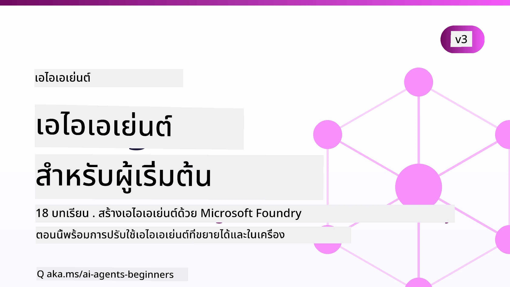

# ตัวแทน AI สำหรับผู้เริ่มต้น - หลักสูตร



## หลักสูตรสอนทุกสิ่งที่คุณต้องรู้เพื่อเริ่มสร้างตัวแทน AI

[](https://github.com/microsoft/ai-agents-for-beginners/blob/master/LICENSE?WT.mc_id=academic-105485-koreyst)
[](https://GitHub.com/microsoft/ai-agents-for-beginners/graphs/contributors/?WT.mc_id=academic-105485-koreyst)
[](https://GitHub.com/microsoft/ai-agents-for-beginners/issues/?WT.mc_id=academic-105485-koreyst)
[](https://GitHub.com/microsoft/ai-agents-for-beginners/pulls/?WT.mc_id=academic-105485-koreyst)
[](http://makeapullrequest.com?WT.mc_id=academic-105485-koreyst)

### 🌐 รองรับหลายภาษา

#### รองรับโดย GitHub Action (อัตโนมัติ & อัปเดตเสมอ)

<!-- CO-OP TRANSLATOR LANGUAGES TABLE START -->
[อาหรับ](../ar/README.md) | [เบงกาลี](../bn/README.md) | [บัลแกเรีย](../bg/README.md) | [พม่า (เมียนมาร์)](../my/README.md) | [จีน (ตัวย่อ)](../zh-CN/README.md) | [จีน (ตัวเต็ม, ฮ่องกง)](../zh-HK/README.md) | [จีน (ตัวเต็ม, มาเก๊า)](../zh-MO/README.md) | [จีน (ตัวเต็ม, ไต้หวัน)](../zh-TW/README.md) | [โครเอเชีย](../hr/README.md) | [เช็ก](../cs/README.md) | [เดนมาร์ก](../da/README.md) | [ดัตช์](../nl/README.md) | [เอสโตเนีย](../et/README.md) | [ฟินแลนด์](../fi/README.md) | [ฝรั่งเศส](../fr/README.md) | [เยอรมัน](../de/README.md) | [กรีก](../el/README.md) | [ฮีบรู](../he/README.md) | [ฮินดี](../hi/README.md) | [ฮังการี](../hu/README.md) | [อินโดนีเซีย](../id/README.md) | [อิตาลี](../it/README.md) | [ญี่ปุ่น](../ja/README.md) | [กันนาดา](../kn/README.md) | [เขมร](../km/README.md) | [เกาหลี](../ko/README.md) | [ลิทัวเนีย](../lt/README.md) | [มาเลย์](../ms/README.md) | [มาลายาลัม](../ml/README.md) | [มราฐี](../mr/README.md) | [เนปาล](../ne/README.md) | [Pidgin ไนจีเรีย](../pcm/README.md) | [นอร์เวย์](../no/README.md) | [เปอร์เซีย (ฟาร์ซี)](../fa/README.md) | [โปแลนด์](../pl/README.md) | [โปรตุเกส (บราซิล)](../pt-BR/README.md) | [โปรตุเกส (โปรตุเกส)](../pt-PT/README.md) | [ภาษาแพนจาบ (กูรมุขี)](../pa/README.md) | [โรมาเนีย](../ro/README.md) | [รัสเซีย](../ru/README.md) | [เซอร์เบียน (ซีริลลิก)](../sr/README.md) | [สโลวัก](../sk/README.md) | [สโลวีเนีย](../sl/README.md) | [สเปน](../es/README.md) | [สวาฮิลี](../sw/README.md) | [สวีเดน](../sv/README.md) | [ตากาล็อก (ฟิลิปปินส์)](../tl/README.md) | [ทมิฬ](../ta/README.md) | [เทลูกู](../te/README.md) | [ไทย](./README.md) | [ตุรกี](../tr/README.md) | [ยูเครน](../uk/README.md) | [อูรดู](../ur/README.md) | [เวียดนาม](../vi/README.md)

> **ต้องการโคลนบนเครื่องคอมพิวเตอร์ใช่ไหม?**
>
> ที่เก็บนี้รวมการแปลกว่า 50 ภาษา ซึ่งเพิ่มขนาดการดาวน์โหลดอย่างมาก หากต้องการโคลนโดยไม่รวมการแปล ให้ใช้ sparse checkout:
>
> **Bash / macOS / Linux:**
> ```bash
> git clone --filter=blob:none --sparse https://github.com/microsoft/ai-agents-for-beginners.git
> cd ai-agents-for-beginners
> git sparse-checkout set --no-cone '/*' '!translations' '!translated_images'
> ```
>
> **CMD (Windows):**
> ```cmd
> git clone --filter=blob:none --sparse https://github.com/microsoft/ai-agents-for-beginners.git
> cd ai-agents-for-beginners
> git sparse-checkout set --no-cone "/*" "!translations" "!translated_images"
> ```
>
> วิธีนี้จะให้ทุกอย่างที่คุณต้องการเพื่อทำหลักสูตรให้เสร็จ พร้อมกับการดาวน์โหลดที่รวดเร็วขึ้นมาก
<!-- CO-OP TRANSLATOR LANGUAGES TABLE END -->

**หากคุณต้องการให้รองรับภาษาแปลอื่น ๆ เพิ่มเติม รายการภาษาเหล่านั้นอยู่ที่ [นี่](https://github.com/Azure/co-op-translator/blob/main/getting_started/supported-languages.md).**

[](https://GitHub.com/microsoft/ai-agents-for-beginners/watchers/?WT.mc_id=academic-105485-koreyst)
[](https://GitHub.com/microsoft/ai-agents-for-beginners/network/?WT.mc_id=academic-105485-koreyst)
[](https://GitHub.com/microsoft/ai-agents-for-beginners/stargazers/?WT.mc_id=academic-105485-koreyst)

[](https://discord.com/invite/ATgtXmAS5D)


## 🌱 เริ่มต้น

หลักสูตรนี้มีบทเรียนครอบคลุมพื้นฐานการสร้างตัวแทน AI แต่ละบทเรียนจะครอบคลุมหัวข้อของตัวเอง ดังนั้นเริ่มต้นจุดไหนก็ได้ตามต้องการ!

มีการรองรับหลายภาษาสำหรับหลักสูตรนี้ ไปที่ [ภาษาที่มีให้ใช้ได้ที่นี่](#-multi-language-support).

หากนี่คือครั้งแรกของคุณในการสร้างด้วยโมเดล AI สร้างสรรค์ ให้ตรวจดูหลักสูตร [Generative AI For Beginners](https://aka.ms/genai-beginners) ของเรา ซึ่งมีบทเรียน 21 บทเกี่ยวกับการสร้างด้วย GenAI

อย่าลืม [ให้ดาว (🌟) กับที่เก็บนี้](https://docs.github.com/en/get-started/exploring-projects-on-github/saving-repositories-with-stars?WT.mc_id=academic-105485-koreyst) และ [โฟรกที่เก็บนี้](https://github.com/microsoft/ai-agents-for-beginners/fork) เพื่อรันโค้ด

### พบปะผู้เรียนคนอื่น ๆ ตอบคำถามของคุณ

หากคุณติดขัดหรือต้องการคำถามเกี่ยวกับการสร้างตัวแทน AI เข้าร่วมช่อง Discord เฉพาะของเราใน [Microsoft Foundry Discord](https://aka.ms/ai-agents/discord)

### สิ่งที่คุณต้องมี

แต่ละบทเรียนในหลักสูตรนี้มีตัวอย่างโค้ด ซึ่งสามารถพบได้ในโฟลเดอร์ code_samples คุณสามารถ [โฟรกที่เก็บนี้](https://github.com/microsoft/ai-agents-for-beginners/fork) เพื่อสร้างสำเนาของคุณเอง

ตัวอย่างโค้ดในแบบฝึกหัดเหล่านี้ใช้ Microsoft Agent Framework กับ Microsoft Foundry Agent Service V2:

- [Microsoft Foundry](https://aka.ms/ai-agents-beginners/ai-foundry) - ต้องมีบัญชี Azure

หลักสูตรนี้ใช้เฟรมเวิร์กและบริการตัวแทน AI ต่อไปนี้จาก Microsoft:

- [Microsoft Agent Framework (MAF)](https://aka.ms/ai-agents-beginners/agent-framework)
- [Microsoft Foundry Agent Service V2](https://aka.ms/ai-agents-beginners/ai-agent-service)

ตัวอย่างโค้ดบางตัวอย่างรองรับผู้ให้บริการที่เข้ากันได้กับ OpenAI เช่น [MiniMax](https://platform.minimaxi.com/) ซึ่งมีโมเดลชั้นสูงที่รองรับ 204K tokens ดูรายละเอียดการตั้งค่าใน [Course Setup](./00-course-setup/README.md)

สำหรับข้อมูลเพิ่มเติมเกี่ยวกับการรันโค้ดสำหรับหลักสูตรนี้ ไปที่ [Course Setup](./00-course-setup/README.md)

## 🙏 ต้องการช่วยไหม?

คุณมีคำแนะนำหรือพบข้อผิดพลาดในการสะกดหรือโค้ดหรือไม่? [เปิดประเด็น](https://github.com/microsoft/ai-agents-for-beginners/issues?WT.mc_id=academic-105485-koreyst) หรือ [สร้างคำขอดึง](https://github.com/microsoft/ai-agents-for-beginners/pulls?WT.mc_id=academic-105485-koreyst)


## 📂 แต่ละบทเรียนประกอบด้วย

- บทเรียนเขียนใน README และวิดีโอสั้น
- ตัวอย่างโค้ด Python ที่ใช้ Microsoft Agent Framework กับ Microsoft Foundry
- ลิงก์ไปยังแหล่งข้อมูลเพิ่มเติมเพื่อเรียนรู้ต่อ


## 🗃️ บทเรียน

| **บทเรียน**                                   | **ข้อความ & โค้ด**                                    | **วิดีโอ**                                                  | **การเรียนรู้เพิ่มเติม**                                                                     |
|----------------------------------------------|----------------------------------------------------|------------------------------------------------------------|----------------------------------------------------------------------------------------|
| แนะนำตัวแทน AI และกรณีการใช้งานตัวแทน       | [ลิงก์](./01-intro-to-ai-agents/README.md)          | [วิดีโอ](https://youtu.be/3zgm60bXmQk?si=z8QygFvYQv-9WtO1)  | [ลิงก์](https://aka.ms/ai-agents-beginners/collection?WT.mc_id=academic-105485-koreyst) |
| สำรวจเฟรมเวิร์ก Agentic AI                   | [ลิงก์](./02-explore-agentic-frameworks/README.md)  | [วิดีโอ](https://youtu.be/ODwF-EZo_O8?si=Vawth4hzVaHv-u0H)  | [ลิงก์](https://aka.ms/ai-agents-beginners/collection?WT.mc_id=academic-105485-koreyst) |
| ทำความเข้าแบบแผนออกแบบ Agentic AI            | [ลิงก์](./03-agentic-design-patterns/README.md)     | [วิดีโอ](https://youtu.be/m9lM8qqoOEA?si=BIzHwzstTPL8o9GF)  | [ลิงก์](https://aka.ms/ai-agents-beginners/collection?WT.mc_id=academic-105485-koreyst) |
| แบบแผนการใช้เครื่องมือ                      | [ลิงก์](./04-tool-use/README.md)                    | [วิดีโอ](https://youtu.be/vieRiPRx-gI?si=2z6O2Xu2cu_Jz46N)  | [ลิงก์](https://aka.ms/ai-agents-beginners/collection?WT.mc_id=academic-105485-koreyst) |
| Agentic RAG                                  | [ลิงก์](./05-agentic-rag/README.md)                 | [วิดีโอ](https://youtu.be/WcjAARvdL7I?si=gKPWsQpKiIlDH9A3)  | [ลิงก์](https://aka.ms/ai-agents-beginners/collection?WT.mc_id=academic-105485-koreyst) |
| การสร้างตัวแทน AI ที่น่าเชื่อถือ               | [ลิงก์](./06-building-trustworthy-agents/README.md) | [วิดีโอ](https://youtu.be/iZKkMEGBCUQ?si=jZjpiMnGFOE9L8OK ) | [ลิงก์](https://aka.ms/ai-agents-beginners/collection?WT.mc_id=academic-105485-koreyst) |
| แบบแผนการวางแผน                             | [ลิงก์](./07-planning-design/README.md)             | [วิดีโอ](https://youtu.be/kPfJ2BrBCMY?si=6SC_iv_E5-mzucnC)  | [ลิงก์](https://aka.ms/ai-agents-beginners/collection?WT.mc_id=academic-105485-koreyst) |
| แบบแผนการออกแบบ Multi-Agent                 | [ลิงก์](./08-multi-agent/README.md)                 | [วิดีโอ](https://youtu.be/V6HpE9hZEx0?si=rMgDhEu7wXo2uo6g)  | [ลิงก์](https://aka.ms/ai-agents-beginners/collection?WT.mc_id=academic-105485-koreyst) |

| รูปแบบการออกแบบการคิดเหนือการรับรู้                | [ลิงก์](./09-metacognition/README.md)                | [วิดีโอ](https://youtu.be/His9R6gw6Ec?si=8gck6vvdSNCt6OcF)   | [ลิงก์](https://aka.ms/ai-agents-beginners/collection?WT.mc_id=academic-105485-koreyst) |
| เอเย่นต์ AI ในการใช้งานจริง                         | [ลิงก์](./10-ai-agents-production/README.md)         | [วิดีโอ](https://youtu.be/l4TP6IyJxmQ?si=31dnhexRo6yLRJDl)   | [ลิงก์](https://aka.ms/ai-agents-beginners/collection?WT.mc_id=academic-105485-koreyst) |
| การใช้โปรโตคอล Agentic (MCP, A2A และ NLWeb)       | [ลิงก์](./11-agentic-protocols/README.md)            | [วิดีโอ](https://youtu.be/X-Dh9R3Opn8)                                  | [ลิงก์](https://aka.ms/ai-agents-beginners/collection?WT.mc_id=academic-105485-koreyst) |
| วิศวกรรมบริบทสำหรับเอเย่นต์ AI                      | [ลิงก์](./12-context-engineering/README.md)          | [วิดีโอ](https://youtu.be/F5zqRV7gEag)                                  | [ลิงก์](https://aka.ms/ai-agents-beginners/collection?WT.mc_id=academic-105485-koreyst) |
| การจัดการความทรงจำ Agentic                         | [ลิงก์](./13-agent-memory/README.md)      |      [วิดีโอ](https://youtu.be/QrYbHesIxpw?si=vZkVwKrQ4ieCcIPx)                                                       |                                                                                        |
| การสำรวจ Microsoft Agent Framework                         | [ลิงก์](./14-microsoft-agent-framework/README.md)                             |                                                            |                                                                                        |
| การสร้างเอเย่นต์ใช้งานคอมพิวเตอร์ (CUA)          | [ลิงก์](./15-browser-use/README.md)      |                                                            | [ลิงก์](https://docs.browser-use.com/examples/templates/playwright-integration)          |
| การปรับใช้เอเย่นต์ที่ปรับขนาดได้                   | [ลิงก์](./16-deploying-scalable-agents/README.md)  |                                                    | [ลิงก์](https://learn.microsoft.com/azure/ai-foundry/agents/overview)                    |
| การสร้างเอเย่นต์ AI ในเครื่อง                      | [ลิงก์](./17-creating-local-ai-agents/README.md)   |                                                    | [ลิงก์](https://learn.microsoft.com/azure/ai-foundry/foundry-local/)                     |
| การรักษาความปลอดภัยเอเย่นต์ AI                     | [ลิงก์](./18-securing-ai-agents/README.md)   |                                                            | [ลิงก์](https://aka.ms/ai-agents-beginners/collection?WT.mc_id=academic-105485-koreyst)  |

## 🎒 คอร์สอื่น ๆ

ทีมของเรามีคอร์สอื่น ๆ ด้วย! ลองดู:

<!-- CO-OP TRANSLATOR OTHER COURSES START -->
### LangChain
[](https://aka.ms/langchain4j-for-beginners)
[](https://aka.ms/langchainjs-for-beginners?WT.mc_id=m365-94501-dwahlin)
[](https://github.com/microsoft/langchain-for-beginners?WT.mc_id=m365-94501-dwahlin)
---

### Azure / Edge / MCP / Agents
[](https://github.com/microsoft/AZD-for-beginners?WT.mc_id=academic-105485-koreyst)
[](https://github.com/microsoft/edgeai-for-beginners?WT.mc_id=academic-105485-koreyst)
[](https://github.com/microsoft/mcp-for-beginners?WT.mc_id=academic-105485-koreyst)
[](https://github.com/microsoft/ai-agents-for-beginners?WT.mc_id=academic-105485-koreyst)

---
 
### ชุดเรียน Generative AI
[](https://github.com/microsoft/generative-ai-for-beginners?WT.mc_id=academic-105485-koreyst)
[-9333EA?style=for-the-badge&labelColor=E5E7EB&color=9333EA)](https://github.com/microsoft/Generative-AI-for-beginners-dotnet?WT.mc_id=academic-105485-koreyst)
[-C084FC?style=for-the-badge&labelColor=E5E7EB&color=C084FC)](https://github.com/microsoft/generative-ai-for-beginners-java?WT.mc_id=academic-105485-koreyst)
[-E879F9?style=for-the-badge&labelColor=E5E7EB&color=E879F9)](https://github.com/microsoft/generative-ai-with-javascript?WT.mc_id=academic-105485-koreyst)

---
 
### การเรียนรู้แกนหลัก
[](https://aka.ms/ml-beginners?WT.mc_id=academic-105485-koreyst)
[](https://aka.ms/datascience-beginners?WT.mc_id=academic-105485-koreyst)
[](https://aka.ms/ai-beginners?WT.mc_id=academic-105485-koreyst)
[](https://github.com/microsoft/Security-101?WT.mc_id=academic-96948-sayoung)
[](https://aka.ms/webdev-beginners?WT.mc_id=academic-105485-koreyst)
[](https://aka.ms/iot-beginners?WT.mc_id=academic-105485-koreyst)
[](https://github.com/microsoft/xr-development-for-beginners?WT.mc_id=academic-105485-koreyst)

---
 
### ชุดเรียน Copilot
[](https://aka.ms/GitHubCopilotAI?WT.mc_id=academic-105485-koreyst)
[](https://github.com/microsoft/mastering-github-copilot-for-dotnet-csharp-developers?WT.mc_id=academic-105485-koreyst)
[](https://github.com/microsoft/CopilotAdventures?WT.mc_id=academic-105485-koreyst)
<!-- CO-OP TRANSLATOR OTHER COURSES END -->

## 🌟 ขอบคุณจากชุมชน

ขอบคุณ [Shivam Goyal](https://www.linkedin.com/in/shivam2003/) สำหรับการมีส่วนร่วมในตัวอย่างโค้ดสำคัญที่แสดงการใช้งาน Agentic RAG

## การร่วมมือ

โปรเจกต์นี้ต้อนรับการมีส่วนร่วมและข้อเสนอแนะ ส่วนใหญ่การมีส่วนร่วมจะต้องให้คุณตกลงกับข้อกำหนดใน
Contributor License Agreement (CLA) ซึ่งประกาศว่าคุณมีสิทธิและให้สิทธิแก่เรา
ในการใช้การมีส่วนร่วมของคุณ สำหรับรายละเอียด โปรดเยี่ยมชม <https://cla.opensource.microsoft.com>

เมื่อคุณส่งคำขอดึง (pull request) หุ่นยนต์ CLA จะตรวจสอบโดยอัตโนมัติว่าคุณจำเป็นต้องให้
CLA หรือไม่ และตกแต่ง PR ให้เหมาะสม (เช่น การตรวจสอบสถานะ, ความคิดเห็น) เพียงทำตามคำแนะนำ
ที่หุ่นยนต์ให้มา คุณจะต้องทำเพียงครั้งเดียวในทุก repo ที่ใช้ CLA ของเรา

โปรเจกต์นี้ได้นำ [Microsoft Open Source Code of Conduct](https://opensource.microsoft.com/codeofconduct/) มาใช้
สำหรับข้อมูลเพิ่มเติม โปรดดูที่ [คำถามที่พบบ่อยเกี่ยวกับจรรยาบรรณ](https://opensource.microsoft.com/codeofconduct/faq/) หรือ
ติดต่อ [opencode@microsoft.com](mailto:opencode@microsoft.com) หากมีคำถามหรือความคิดเห็นเพิ่มเติม

## เครื่องหมายการค้า

โปรเจกต์นี้อาจมีเครื่องหมายการค้าหรือล็อกโครงการสำหรับโปรเจกต์ ผลิตภัณฑ์ หรือบริการ การใช้เครื่องหมายการค้าหรือล็อกของ Microsoft
ต้องปฏิบัติตามและปฏิบัติตาม
[แนวทางเครื่องหมายการค้าและแบรนด์ของ Microsoft](https://www.microsoft.com/legal/intellectualproperty/trademarks/usage/general)
การใช้เครื่องหมายการค้าหรือล็อกของ Microsoft ในเวอร์ชันที่ดัดแปลงของโปรเจกต์นี้ต้องไม่ก่อให้เกิดความสับสนหรือแสดงถึงการสนับสนุนจาก Microsoft
การใช้เครื่องหมายการค้าหรือล็อกของบุคคลที่สามขึ้นกับนโยบายของบุคคลที่สามเหล่านั้น

## การขอความช่วยเหลือ


หากคุณติดขัดหรือมีคำถามเกี่ยวกับการสร้างแอป AI เข้าร่วมที่:

[](https://aka.ms/foundry/discord)

หากคุณมีคำติชมผลิตภัณฑ์หรือพบข้อผิดพลาดขณะสร้าง โปรดไปที่:

[](https://aka.ms/foundry/forum)

---

<!-- CO-OP TRANSLATOR DISCLAIMER START -->
**ปฏิเสธความรับผิดชอบ**:
เอกสารนี้ได้รับการแปลโดยใช้บริการแปลภาษา AI [Co-op Translator](https://github.com/Azure/co-op-translator) ขณะที่เราพยายามให้ความถูกต้อง โปรดทราบว่าการแปลโดยอัตโนมัติอาจมีข้อผิดพลาดหรือความไม่ถูกต้อง เอกสารต้นฉบับในภาษาต้นทางควรถูกพิจารณาเป็นแหล่งข้อมูลที่เชื่อถือได้ สำหรับข้อมูลที่สำคัญ แนะนำให้ใช้การแปลโดยมนุษย์มืออาชีพ เราไม่รับผิดชอบต่อความเข้าใจผิดหรือการตีความที่ผิดพลาดที่เกิดขึ้นจากการใช้การแปลนี้
<!-- CO-OP TRANSLATOR DISCLAIMER END -->