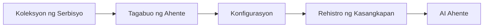

# 🎨 Mga Agentic na Disenyo ng Pattern gamit ang Azure OpenAI (Responses API) (.NET)

## 📋 Mga Layunin sa Pag-aaral

Ipinapakita ng halimbawang ito ang mga enterprise-grade na disenyo ng pattern para sa paggawa ng matatalinong agent gamit ang Microsoft Agent Framework sa .NET na may integrasyon ng Azure OpenAI (Responses API). Matututuhan mo ang mga propesyonal na pattern at pang-arkitekturang pamamaraan na ginagawang handa para sa produksyon, madaling mapanatili, at scalable ang mga agent.

### Mga Enterprise Design Pattern

- 🏭 **Factory Pattern**: Standardisadong paggawa ng agent gamit ang dependency injection
- 🔧 **Builder Pattern**: Fluent na pag-configure at pag-setup ng agent
- 🧵 **Thread-Safe Patterns**: Sabay-sabay na pamamahala ng usapan
- 📋 **Repository Pattern**: Organisadong pamamahala ng tool at kakayahan

## 🎯 Mga Benepisyo ng Arkitektura na Tanging para sa .NET

### Mga Tampok ng Enterprise

- **Malakas na Pagta-type**: Pag-validate sa compile-time at suporta sa IntelliSense
- **Dependency Injection**: Built-in na integrasyon ng DI container
- **Pamamahala ng Konfigurasyon**: IConfiguration at Options patterns
- **Async/Await**: Pangunahin na suporta para sa asynchronous programming

### Mga Pattern na Handa na para sa Produksyon

- **Logging Integration**: ILogger at structured logging support
- **Health Checks**: Built-in na pagmamanman at diagnostics
- **Pag-validate ng Konfigurasyon**: Malakas na pagta-type gamit ang data annotations
- **Pag-handle ng Error**: Structured exception management

## 🔧 Teknikal na Arkitektura

### Mga Pangunahing Komponent ng .NET

- **Microsoft.Extensions.AI**: Pinagsama-samang abstraksyon ng serbisyo ng AI
- **Microsoft.Agents.AI**: Enterprise agent orchestration framework
- **Azure OpenAI (Responses API)**: Mga pattern ng high-performance na kliyente ng API
- **Sistemang Pangkonfigurasyon**: appsettings.json at integrasyon sa kapaligiran

### Implementasyon ng Disenyo ng Pattern



## 🏗️ Ipinakitang Mga Pattern ng Enterprise

### 1. **Mga Creational Pattern**

- **Agent Factory**: Sentralisadong paggawa ng agent na may pare-parehong konfigurasyon
- **Builder Pattern**: Fluent API para sa komplikadong konfigurasyon ng agent
- **Singleton Pattern**: Pinaghahating mga mapagkukunan at pamamahala ng konfigurasyon
- **Dependency Injection**: Maluwag na pagkakabit at madaling masubok

### 2. **Mga Behavior Pattern**

- **Strategy Pattern**: Pamamaraan ng pagpapalit-palit ng pagpapatupad ng tool
- **Command Pattern**: Nakapaloob na mga operasyon ng agent na may undo/redo
- **Observer Pattern**: Pamamahala ng lifecycle ng agent na nakabase sa mga pangyayari
- **Template Method**: Standardisadong workflow ng pagpapatupad ng agent

### 3. **Mga Structural Pattern**

- **Adapter Pattern**: Integrasyon ng Azure OpenAI (Responses API) na layer
- **Decorator Pattern**: Pagpapahusay sa kakayahan ng agent
- **Facade Pattern**: Pinapasimpleng interface ng interaksyon ng agent
- **Proxy Pattern**: Tamad na paglo-load at caching para sa performance

## 📚 Mga Prinsipyo ng Disenyo sa .NET

### Mga Prinsipyo ng SOLID

- **Single Responsibility**: Bawat bahagi ay may isang malinaw na layunin
- **Open/Closed**: Mapapalawig nang hindi binabago
- **Liskov Substitution**: Implementasyon ng tool na batay sa interface
- **Interface Segregation**: Nakatuon, magkakaugnay na mga interface
- **Dependency Inversion**: Nakasalalay sa abstractions, hindi sa konkretong bagay

### Malinis na Arkitektura

- **Domain Layer**: Pangunahing abstraksyon ng agent at tool
- **Application Layer**: Orkestrasyon ng agent at workflow
- **Infrastructure Layer**: Integrasyon ng Azure OpenAI (Responses API) at mga panlabas na serbisyo
- **Presentation Layer**: Interaksyon ng gumagamit at pag-format ng tugon

## 🔒 Mga Isyung Enterprise

### Seguridad

- **Pamamahala ng Credential**: Secure na paghawak ng API key gamit ang IConfiguration
- **Pag-validate ng Input**: Malakas na pagta-type at pag-validate ng data annotation
- **Paglinis ng Output**: Secure na pagproseso at pagsala ng tugon
- **Audit Logging**: Komprehensibong pagsubaybay ng operasyon

### Performance

- **Async Patterns**: Mga non-blocking na operasyon ng I/O
- **Connection Pooling**: Epektibong pamamahala ng HTTP client
- **Caching**: Pag-cache ng tugon para sa pinahusay na performance
- **Pamamahala ng Mapagkukunan**: Tamang pag-dispose at mga pattern ng paglilinis

### Scalability

- **Thread Safety**: Suporta sa sabay-sabay na pagpapatupad ng agent
- **Resource Pooling**: Epektibong paggamit ng mga mapagkukunan
- **Pamamahala ng Load**: Paglimita ng rate at paghawak ng backpressure
- **Pagmamanman**: Mga metriko ng performance at health checks

## 🚀 Deployment para sa Produksyon

- **Pamamahala ng Konfigurasyon**: Mga setting na naangkop sa kapaligiran
- **Estratehiya sa Logging**: Structured logging na may correlation IDs
- **Pag-handle ng Error**: Global na pag-handle ng exception na may tamang recovery
- **Pagmamanman**: Application insights at mga performance counters
- **Pagsusuri**: Unit tests, integration tests, at mga pattern ng load testing

Handa ka na bang bumuo ng enterprise-grade na matatalinong agent gamit ang .NET? Mag-arkitekto tayo ng matibay na sistema! 🏢✨

## 🚀 Pagsisimula

### Mga Kinakailangan

- [.NET 10 SDK](https://dotnet.microsoft.com/download/dotnet/10.0) o mas mataas pa
- Isang [Azure subscription](https://azure.microsoft.com/free/) na may Azure OpenAI resource at deployment ng modelo
- Ang [Azure CLI](https://learn.microsoft.com/cli/azure/install-azure-cli) — mag-sign in gamit ang `az login`

### Mga Kinakailangang Environment Variable

```bash
# zsh/bash
export AZURE_OPENAI_ENDPOINT=https://<your-resource>.openai.azure.com
export AZURE_OPENAI_DEPLOYMENT=gpt-5-mini
# Mag-sign in muna para makakuha ng token ang AzureCliCredential
az login
```

```powershell
# PowerShell
$env:AZURE_OPENAI_ENDPOINT = "https://<your-resource>.openai.azure.com"
$env:AZURE_OPENAI_DEPLOYMENT = "gpt-5-mini"
# Pagkatapos mag-sign in upang makakuha ng token ang AzureCliCredential
az login
```

### Halimbawang Kodigo

Para patakbuhin ang halimbawang kodigo,

```bash
# zsh/bash
chmod +x ./03-dotnet-agent-framework.cs
./03-dotnet-agent-framework.cs
```

O gamit ang dotnet CLI:

```bash
dotnet run ./03-dotnet-agent-framework.cs
```

Tingnan ang [`03-dotnet-agent-framework.cs`](../../../../03-agentic-design-patterns/code_samples/03-dotnet-agent-framework.cs) para sa kumpletong kodigo.

```csharp
#!/usr/bin/dotnet run

#:package Microsoft.Extensions.AI@10.*
#:package Microsoft.Agents.AI.OpenAI@1.*-*
#:package Azure.AI.OpenAI@2.1.0
#:package Azure.Identity@1.13.1

using System.ComponentModel;

using Microsoft.Agents.AI;
using Microsoft.Extensions.AI;

using Azure.AI.OpenAI;
using Azure.Identity;

// Tool Function: Random Destination Generator
// This static method will be available to the agent as a callable tool
// The [Description] attribute helps the AI understand when to use this function
// This demonstrates how to create custom tools for AI agents
[Description("Provides a random vacation destination.")]
static string GetRandomDestination()
{
    // List of popular vacation destinations around the world
    // The agent will randomly select from these options
    var destinations = new List<string>
    {
        "Paris, France",
        "Tokyo, Japan",
        "New York City, USA",
        "Sydney, Australia",
        "Rome, Italy",
        "Barcelona, Spain",
        "Cape Town, South Africa",
        "Rio de Janeiro, Brazil",
        "Bangkok, Thailand",
        "Vancouver, Canada"
    };

    // Generate random index and return selected destination
    // Uses System.Random for simple random selection
    var random = new Random();
    int index = random.Next(destinations.Count);
    return destinations[index];
}

// Azure OpenAI with the Responses API (stable v1 endpoint). Sign in with `az login`.
var azureEndpoint = Environment.GetEnvironmentVariable("AZURE_OPENAI_ENDPOINT")
    ?? throw new InvalidOperationException("AZURE_OPENAI_ENDPOINT is not set.");
var deployment = Environment.GetEnvironmentVariable("AZURE_OPENAI_DEPLOYMENT") ?? "gpt-5-mini";

var azureClient = new AzureOpenAIClient(new Uri(azureEndpoint), new AzureCliCredential());

// Define Agent Identity and Comprehensive Instructions
// Agent name for identification and logging purposes
var AGENT_NAME = "TravelAgent";

// Detailed instructions that define the agent's personality, capabilities, and behavior
// This system prompt shapes how the agent responds and interacts with users
var AGENT_INSTRUCTIONS = """
You are a helpful AI Agent that can help plan vacations for customers.

Important: When users specify a destination, always plan for that location. Only suggest random destinations when the user hasn't specified a preference.

When the conversation begins, introduce yourself with this message:
"Hello! I'm your TravelAgent assistant. I can help plan vacations and suggest interesting destinations for you. Here are some things you can ask me:
1. Plan a day trip to a specific location
2. Suggest a random vacation destination
3. Find destinations with specific features (beaches, mountains, historical sites, etc.)
4. Plan an alternative trip if you don't like my first suggestion

What kind of trip would you like me to help you plan today?"

Always prioritize user preferences. If they mention a specific destination like "Bali" or "Paris," focus your planning on that location rather than suggesting alternatives.
""";

// Create AI Agent with Advanced Travel Planning Capabilities
// Get the Responses client for the deployment and create the AI agent
// Configure agent with name, detailed instructions, and available tools
// This demonstrates the .NET agent creation pattern with full configuration
AIAgent agent = azureClient
    .GetChatClient(deployment)
    .AsAIAgent(
        name: AGENT_NAME,
        instructions: AGENT_INSTRUCTIONS,
        tools: [AIFunctionFactory.Create(GetRandomDestination)]
    );

// Create New Conversation Session for Context Management
// Initialize a new conversation session to maintain context across multiple interactions
// Sessions enable the agent to remember previous exchanges and maintain conversational state
// This is essential for multi-turn conversations and contextual understanding
var session = await agent.CreateSessionAsync();

// Execute Agent: First Travel Planning Request
// Run the agent with an initial request that will likely trigger the random destination tool
// The agent will analyze the request, use the GetRandomDestination tool, and create an itinerary
// Using the session parameter maintains conversation context for subsequent interactions
await foreach (var update in agent.RunStreamingAsync("Plan me a day trip", session))
{
    await Task.Delay(10);
    Console.Write(update);
}

Console.WriteLine();

// Execute Agent: Follow-up Request with Context Awareness
// Demonstrate contextual conversation by referencing the previous response
// The agent remembers the previous destination suggestion and will provide an alternative
// This showcases the power of conversation sessions and contextual understanding in .NET agents
await foreach (var update in agent.RunStreamingAsync("I don't like that destination. Plan me another vacation.", session))
{
    await Task.Delay(10);
    Console.Write(update);
}
```

---

<!-- CO-OP TRANSLATOR DISCLAIMER START -->
**Pagtatanggi**:
Ang dokumentong ito ay isinalin gamit ang serbisyo ng AI translation na [Co-op Translator](https://github.com/Azure/co-op-translator). Bagama't nagsusumikap kami para sa katumpakan, pakatandaan na ang awtomatikong pagsasalin ay maaaring maglaman ng mga pagkakamali o hindi pagkakatugma. Ang orihinal na dokumento sa orihinal nitong wika ang dapat ituring na pangunahing sanggunian. Para sa mahahalagang impormasyon, inirerekomenda ang propesyonal na pagsasalin ng tao. Hindi kami mananagot sa anumang maling pagkakaintindi o maling interpretasyon na nagmula sa paggamit ng pagsasaling ito.
<!-- CO-OP TRANSLATOR DISCLAIMER END -->