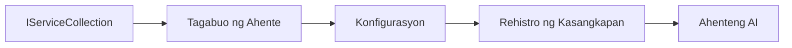

# 🎨 Agentic Design Patterns gamit ang Azure OpenAI (Responses API) (.NET)

## 📋 Mga Layunin sa Pagkatuto

Ipinapakita ng halimbawa na ito ang mga enterprise-grade na design pattern para sa paggawa ng mga intelligent agent gamit ang Microsoft Agent Framework sa .NET kasama ang integrasyon ng Azure OpenAI (Responses API). Matututuhan mo ang mga propesyonal na pattern at mga arkitekturang paraan na nagpapagawa sa mga agent na handa para sa produksyon, madaling panatilihin, at madaling palakihin.

### Mga Enterprise Design Pattern

- 🏭 **Factory Pattern**: Standardisadong paggawa ng agent gamit ang dependency injection
- 🔧 **Builder Pattern**: Fluent na konfigurasyon at setup ng agent
- 🧵 **Thread-Safe Patterns**: Paghawak sa sabay-sabay na pag-uusap
- 📋 **Repository Pattern**: Organisadong pamamahala ng tool at kakayahan

## 🎯 Mga Benepisyo sa Arkitektura na Espesipiko sa .NET

### Mga Enterprise Feature

- **Strong Typing**: Validation sa oras ng compile at suporta sa IntelliSense
- **Dependency Injection**: Built-in na integrasyon sa DI container
- **Configuration Management**: IConfiguration at mga pattern ng Options
- **Async/Await**: Distinguidong suporta sa asynchronous programming

### Mga Pattern na Handa Para sa Produksyon

- **Logging Integration**: ILogger at suporta sa structured logging
- **Health Checks**: Built-in na monitoring at diagnostics
- **Configuration Validation**: Strong typing gamit ang data annotations
- **Error Handling**: Structuradong pamamahala ng exceptions

## 🔧 Teknikal na Arkitektura

### Pangunahing Komponent ng .NET

- **Microsoft.Extensions.AI**: Nagkakaisang AI service abstraction
- **Microsoft.Agents.AI**: Enterprise agent orchestration framework
- **Azure OpenAI (Responses API)**: Mga pattern ng high-performance na API client
- **Configuration System**: appsettings.json at integrasyon ng environment

### Implementasyon ng Design Pattern



## 🏗️ Ipinakitang Mga Enterprise Pattern

### 1. **Creational Patterns**

- **Agent Factory**: Sentralisadong paggawa ng agent na may consistent na konfigurasyon
- **Builder Pattern**: Fluent API para sa komplikadong konfigurasyon ng agent
- **Singleton Pattern**: Pinagsasaluhang mga yaman at pamamahala ng konfigurasyon
- **Dependency Injection**: Maluwag na coupling at madaling testing

### 2. **Behavioral Patterns**

- **Strategy Pattern**: Napapalitang mga strategy ng pagpapatakbo ng tool
- **Command Pattern**: Nakakapsula na operasyon ng agent na may undo/redo
- **Observer Pattern**: Event-driven na pamamahala ng lifecycle ng agent
- **Template Method**: Standardisadong workflows ng pagpapatakbo ng agent

### 3. **Structural Patterns**

- **Adapter Pattern**: Azure OpenAI (Responses API) integrasyon na layer
- **Decorator Pattern**: Pagpapahusay ng kakayahan ng agent
- **Facade Pattern**: Pinadaling interface para sa interaksyon ng agent
- **Proxy Pattern**: Tamad na paglo-load at caching para sa performance

## 📚 Mga Prinsipyo ng Disenyo ng .NET

### Mga Prinsipyo ng SOLID

- **Single Responsibility**: Bawat komponent ay may isang malinaw na layunin
- **Open/Closed**: Mapapalawak nang hindi babaguhin
- **Liskov Substitution**: Implementasyon ng tool batay sa interface
- **Interface Segregation**: Nakatuon, magkakaugnay na interfaces
- **Dependency Inversion**: Umasa sa abstractions, hindi sa konkreto

### Malinis na Arkitektura

- **Domain Layer**: Pangunahing abstractions ng agent at tool
- **Application Layer**: Orkestrasyon ng agent at workflows
- **Infrastructure Layer**: Azure OpenAI (Responses API) integrasyon at mga external na serbisyo
- **Presentation Layer**: Interaksyon ng user at pagformat ng sagot

## 🔒 Mga Pagsasaalang-alang sa Enterprise

### Seguridad

- **Pamamahala ng Credential**: Secure na paghawak ng API key gamit ang IConfiguration
- **Input Validation**: Strong typing at validation gamit ang data annotation
- **Output Sanitization**: Secure na pagproseso at pagsasala ng sagot
- **Audit Logging**: Komprehensibong pagsubaybay ng operasyon

### Performance

- **Async Patterns**: Non-blocking na mga I/O operation
- **Connection Pooling**: Mahusay na pamamahala ng HTTP client
- **Caching**: Caching ng sagot para sa pinahusay na performance
- **Resource Management**: Tamang pagtatapon at paglilinis na mga pattern

### Scalability

- **Thread Safety**: Suporta sa sabayang pagpapatakbo ng agent
- **Resource Pooling**: Mahusay na paggamit ng yaman
- **Load Management**: Paghigpit ng rate at pamamahala ng backpressure
- **Monitoring**: Mga sukatan ng performance at health checks

## 🚀 Deployment sa Produksyon

- **Configuration Management**: Mga setting na espesipiko sa environment
- **Logging Strategy**: Structured logging na may correlation ID
- **Error Handling**: Pangkalahatang pamamahala ng exception na may tamang recovery
- **Monitoring**: Application insights at mga performance counter
- **Testing**: Mga yunit ng pagsubok, integration test, at mga pattern sa load testing

Handa ka na bang bumuo ng mga intelligent agent na pang-enterprise gamit ang .NET? Tara, gumawa tayo ng matibay na arkitektura! 🏢✨

## 🚀 Pagsisimula

### Mga Kinakailangan

- [.NET 10 SDK](https://dotnet.microsoft.com/download/dotnet/10.0) o mas mataas
- Isang [Azure subscription](https://azure.microsoft.com/free/) na may Azure OpenAI resource at deployment ng modelo
- Ang [Azure CLI](https://learn.microsoft.com/cli/azure/install-azure-cli) — mag-sign in gamit ang `az login`

### Kailangan na Mga Environment Variable

```bash
# zsh/bash
export AZURE_OPENAI_ENDPOINT=https://<your-resource>.openai.azure.com
export AZURE_OPENAI_DEPLOYMENT=gpt-4.1-mini
# Mag-sign in muna para makakuha ng token ang AzureCliCredential
az login
```

```powershell
# PowerShell
$env:AZURE_OPENAI_ENDPOINT = "https://<your-resource>.openai.azure.com"
$env:AZURE_OPENAI_DEPLOYMENT = "gpt-4.1-mini"
# Pagkatapos ay mag-sign in upang makakuha ng token ang AzureCliCredential
az login
```

### Halimbawang Code

Para patakbuhin ang halimbawa ng code,

```bash
# zsh/bash
chmod +x ./03-dotnet-agent-framework.cs
./03-dotnet-agent-framework.cs
```

O gamit ang dotnet CLI:

```bash
dotnet run ./03-dotnet-agent-framework.cs
```

Tingnan ang [`03-dotnet-agent-framework.cs`](../../../../03-agentic-design-patterns/code_samples/03-dotnet-agent-framework.cs) para sa kompletong code.

```csharp
#!/usr/bin/dotnet run

#:package Microsoft.Extensions.AI@10.*
#:package Microsoft.Agents.AI.OpenAI@1.*-*
#:package Azure.AI.OpenAI@2.1.0
#:package Azure.Identity@1.13.1

using System.ComponentModel;

using Microsoft.Agents.AI;
using Microsoft.Extensions.AI;

using Azure.AI.OpenAI;
using Azure.Identity;

// Tool Function: Random Destination Generator
// This static method will be available to the agent as a callable tool
// The [Description] attribute helps the AI understand when to use this function
// This demonstrates how to create custom tools for AI agents
[Description("Provides a random vacation destination.")]
static string GetRandomDestination()
{
    // List of popular vacation destinations around the world
    // The agent will randomly select from these options
    var destinations = new List<string>
    {
        "Paris, France",
        "Tokyo, Japan",
        "New York City, USA",
        "Sydney, Australia",
        "Rome, Italy",
        "Barcelona, Spain",
        "Cape Town, South Africa",
        "Rio de Janeiro, Brazil",
        "Bangkok, Thailand",
        "Vancouver, Canada"
    };

    // Generate random index and return selected destination
    // Uses System.Random for simple random selection
    var random = new Random();
    int index = random.Next(destinations.Count);
    return destinations[index];
}

// Azure OpenAI with the Responses API (stable v1 endpoint). Sign in with `az login`.
var azureEndpoint = Environment.GetEnvironmentVariable("AZURE_OPENAI_ENDPOINT")
    ?? throw new InvalidOperationException("AZURE_OPENAI_ENDPOINT is not set.");
var deployment = Environment.GetEnvironmentVariable("AZURE_OPENAI_DEPLOYMENT") ?? "gpt-4.1-mini";

var azureClient = new AzureOpenAIClient(new Uri(azureEndpoint), new AzureCliCredential());

// Define Agent Identity and Comprehensive Instructions
// Agent name for identification and logging purposes
var AGENT_NAME = "TravelAgent";

// Detailed instructions that define the agent's personality, capabilities, and behavior
// This system prompt shapes how the agent responds and interacts with users
var AGENT_INSTRUCTIONS = """
You are a helpful AI Agent that can help plan vacations for customers.

Important: When users specify a destination, always plan for that location. Only suggest random destinations when the user hasn't specified a preference.

When the conversation begins, introduce yourself with this message:
"Hello! I'm your TravelAgent assistant. I can help plan vacations and suggest interesting destinations for you. Here are some things you can ask me:
1. Plan a day trip to a specific location
2. Suggest a random vacation destination
3. Find destinations with specific features (beaches, mountains, historical sites, etc.)
4. Plan an alternative trip if you don't like my first suggestion

What kind of trip would you like me to help you plan today?"

Always prioritize user preferences. If they mention a specific destination like "Bali" or "Paris," focus your planning on that location rather than suggesting alternatives.
""";

// Create AI Agent with Advanced Travel Planning Capabilities
// Get the Responses client for the deployment and create the AI agent
// Configure agent with name, detailed instructions, and available tools
// This demonstrates the .NET agent creation pattern with full configuration
AIAgent agent = azureClient
    .GetChatClient(deployment)
    .AsAIAgent(
        name: AGENT_NAME,
        instructions: AGENT_INSTRUCTIONS,
        tools: [AIFunctionFactory.Create(GetRandomDestination)]
    );

// Create New Conversation Session for Context Management
// Initialize a new conversation session to maintain context across multiple interactions
// Sessions enable the agent to remember previous exchanges and maintain conversational state
// This is essential for multi-turn conversations and contextual understanding
var session = await agent.CreateSessionAsync();

// Execute Agent: First Travel Planning Request
// Run the agent with an initial request that will likely trigger the random destination tool
// The agent will analyze the request, use the GetRandomDestination tool, and create an itinerary
// Using the session parameter maintains conversation context for subsequent interactions
await foreach (var update in agent.RunStreamingAsync("Plan me a day trip", session))
{
    await Task.Delay(10);
    Console.Write(update);
}

Console.WriteLine();

// Execute Agent: Follow-up Request with Context Awareness
// Demonstrate contextual conversation by referencing the previous response
// The agent remembers the previous destination suggestion and will provide an alternative
// This showcases the power of conversation sessions and contextual understanding in .NET agents
await foreach (var update in agent.RunStreamingAsync("I don't like that destination. Plan me another vacation.", session))
{
    await Task.Delay(10);
    Console.Write(update);
}
```

---

<!-- CO-OP TRANSLATOR DISCLAIMER START -->
**Pagtatanggi**:
Ang dokumentong ito ay isinalin gamit ang serbisyo ng AI translation na [Co-op Translator](https://github.com/Azure/co-op-translator). Bagama't nagsusumikap kami para sa katumpakan, pakatandaan na ang awtomatikong pagsasalin ay maaaring maglaman ng mga pagkakamali o hindi pagkakatugma. Ang orihinal na dokumento sa orihinal nitong wika ang dapat ituring na pangunahing sanggunian. Para sa mahahalagang impormasyon, inirerekomenda ang propesyonal na pagsasalin ng tao. Hindi kami mananagot sa anumang maling pagkakaintindi o maling interpretasyon na nagmula sa paggamit ng pagsasaling ito.
<!-- CO-OP TRANSLATOR DISCLAIMER END -->