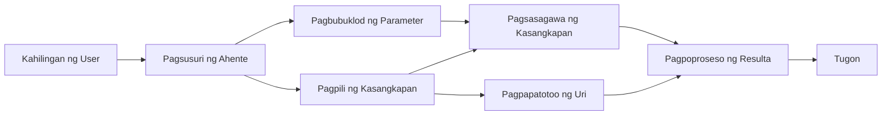

# 🛠️ Advanced Tool Use with Azure OpenAI (Responses API) (.NET)

## 📋 Mga Layunin sa Pagkatuto

Ipinapakita ng notebook na ito ang mga pattern ng enterprise-grade tool integration gamit ang Microsoft Agent Framework sa .NET kasama ang Azure OpenAI (Responses API). Matututuhan mong bumuo ng mga sopistikadong ahente na may maraming espesyal na tool, gamit ang malakas na pagta-type ng C# at mga enterprise feature ng .NET.

### Mga Advanced na Kakayahan sa Tool na Iyong Mamahalaan

- 🔧 **Multi-Tool Architecture**: Pagtatayo ng mga ahente na may maraming espesyal na kakayahan
- 🎯 **Type-Safe Tool Execution**: Paggamit ng compile-time validation ng C#
- 📊 **Enterprise Tool Patterns**: Disenyo ng production-ready tool at paghawak ng error
- 🔗 **Tool Composition**: Pagsasama-sama ng mga tool para sa komplikadong workflows ng negosyo

## 🎯 Mga Benepisyo ng .NET Tool Architecture

### Mga Tampok ng Enterprise Tool

- **Compile-Time Validation**: Pinatitibay ng malakas na pagta-type ang kawastuhan ng mga parameter ng tool
- **Dependency Injection**: Integrasyon ng IoC container para sa pamamahala ng tool
- **Async/Await Patterns**: Hindi nagpapabara na pagtakbo ng tool gamit ang tamang pamamahala ng resources
- **Structured Logging**: Nakapaloob na logging integration para sa pagsubaybay ng pagpapatakbo ng tool

### Mga Pattern na Handa sa Produksyon

- **Exception Handling**: Komprehensibong pamamahala ng error gamit ang typed exceptions
- **Resource Management**: Tamang pag-dispose at pamamahala ng memorya
- **Performance Monitoring**: Nakapaloob na metrics at performance counters
- **Configuration Management**: Type-safe configuration na may validation

## 🔧 Teknikal na Arkitektura

### Pangunahing Bahagi ng .NET Tool

- **Microsoft.Extensions.AI**: Pinagsamang abstraction layer ng tool
- **Microsoft.Agents.AI**: Enterprise-grade na pag-orchestrate ng tool
- **Azure OpenAI (Responses API)**: Mabilis na API client na may connection pooling

### Pipeline ng Pagpapatakbo ng Tool



## 🛠️ Mga Kategorya at Pattern ng Tool

### 1. **Mga Tool sa Pagproseso ng Data**

- **Input Validation**: Malakas na pagta-type gamit ang data annotations
- **Transform Operations**: Type-safe na conversion at pag-format ng data
- **Business Logic**: Mga tool para sa domain-specific na kalkulasyon at pagsusuri
- **Output Formatting**: Structured na pagbuo ng tugon

### 2. **Mga Tool sa Integrasyon**

- **API Connectors**: Integrasyon ng RESTful service gamit ang HttpClient
- **Database Tools**: Integrasyon ng Entity Framework para sa pag-access ng data
- **File Operations**: Ligtas na mga operasyon sa file system na may validation
- **External Services**: Mga pattern ng integrasyon ng third-party na serbisyo

### 3. **Mga Utility Tool**

- **Text Processing**: Mga utility para sa manipulasyon at pag-format ng string
- **Date/Time Operations**: Mga kalkulasyon sa petsa/oras na nakaangkop sa kultura
- **Mathematical Tools**: Tumpak na kalkulasyon at mga operasyon sa estadistika
- **Validation Tools**: Pag-validate ng mga patakaran sa negosyo at bersipikasyon ng data

Handa ka na bang bumuo ng mga enterprise-grade na ahente na may makapangyarihan, type-safe na kakayahan ng tool sa .NET? Tara, i-arkitekto natin ang mga propesyonal na solusyon! 🏢⚡

## 🚀 Pagsisimula

### Mga Kinakailangan

- [.NET 10 SDK](https://dotnet.microsoft.com/download/dotnet/10.0) o mas mataas
- Isang [Azure subscription](https://azure.microsoft.com/free/) na may Azure OpenAI resource at deployment ng modelo
- Ang [Azure CLI](https://learn.microsoft.com/cli/azure/install-azure-cli) — mag-sign in gamit ang `az login`

### Mga Kailangang Environment Variable

```bash
# zsh/bash
export AZURE_OPENAI_ENDPOINT=https://<your-resource>.openai.azure.com
export AZURE_OPENAI_DEPLOYMENT=gpt-4.1-mini
# Pagkatapos mag-sign in upang makakuha ng token ang AzureCliCredential
az login
```

```powershell
# PowerShell
$env:AZURE_OPENAI_ENDPOINT = "https://<your-resource>.openai.azure.com"
$env:AZURE_OPENAI_DEPLOYMENT = "gpt-4.1-mini"
# Pagkatapos mag-sign in para makakuha ng token ang AzureCliCredential
az login
```

### Sample Code

Para patakbuhin ang halimbawa ng code,

```bash
# zsh/bash
chmod +x ./04-dotnet-agent-framework.cs
./04-dotnet-agent-framework.cs
```

O gamit ang dotnet CLI:

```bash
dotnet run ./04-dotnet-agent-framework.cs
```

Tingnan ang [`04-dotnet-agent-framework.cs`](../../../../04-tool-use/code_samples/04-dotnet-agent-framework.cs) para sa buong code.

```csharp
#!/usr/bin/dotnet run

#:package Microsoft.Extensions.AI@10.*
#:package Microsoft.Agents.AI.OpenAI@1.*-*
#:package Azure.AI.OpenAI@2.1.0
#:package Azure.Identity@1.13.1

using System.ComponentModel;

using Microsoft.Agents.AI;
using Microsoft.Extensions.AI;

using Azure.AI.OpenAI;
using Azure.Identity;

// Tool Function: Random Destination Generator
// This static method will be available to the agent as a callable tool
// The [Description] attribute helps the AI understand when to use this function
// This demonstrates how to create custom tools for AI agents
[Description("Provides a random vacation destination.")]
static string GetRandomDestination()
{
    // List of popular vacation destinations around the world
    // The agent will randomly select from these options
    var destinations = new List<string>
    {
        "Paris, France",
        "Tokyo, Japan",
        "New York City, USA",
        "Sydney, Australia",
        "Rome, Italy",
        "Barcelona, Spain",
        "Cape Town, South Africa",
        "Rio de Janeiro, Brazil",
        "Bangkok, Thailand",
        "Vancouver, Canada"
    };

    // Generate random index and return selected destination
    // Uses System.Random for simple random selection
    var random = new Random();
    int index = random.Next(destinations.Count);
    return destinations[index];
}

// Azure OpenAI with the Responses API (stable v1 endpoint). Sign in with `az login`.
var azureEndpoint = Environment.GetEnvironmentVariable("AZURE_OPENAI_ENDPOINT")
    ?? throw new InvalidOperationException("AZURE_OPENAI_ENDPOINT is not set.");
var deployment = Environment.GetEnvironmentVariable("AZURE_OPENAI_DEPLOYMENT") ?? "gpt-4.1-mini";

var azureClient = new AzureOpenAIClient(new Uri(azureEndpoint), new AzureCliCredential());

// Define Agent Identity and Comprehensive Instructions
// Agent name for identification and logging purposes
var AGENT_NAME = "TravelAgent";

// Detailed instructions that define the agent's personality, capabilities, and behavior
// This system prompt shapes how the agent responds and interacts with users
var AGENT_INSTRUCTIONS = """
You are a helpful AI Agent that can help plan vacations for customers.

Important: When users specify a destination, always plan for that location. Only suggest random destinations when the user hasn't specified a preference.

When the conversation begins, introduce yourself with this message:
"Hello! I'm your TravelAgent assistant. I can help plan vacations and suggest interesting destinations for you. Here are some things you can ask me:
1. Plan a day trip to a specific location
2. Suggest a random vacation destination
3. Find destinations with specific features (beaches, mountains, historical sites, etc.)
4. Plan an alternative trip if you don't like my first suggestion

What kind of trip would you like me to help you plan today?"

Always prioritize user preferences. If they mention a specific destination like "Bali" or "Paris," focus your planning on that location rather than suggesting alternatives.
""";

// Create AI Agent with Advanced Travel Planning Capabilities
// Get the Responses client for the deployment and create the AI agent
// Configure agent with name, detailed instructions, and available tools
// This demonstrates the .NET agent creation pattern with full configuration
AIAgent agent = azureClient
    .GetChatClient(deployment)
    .AsAIAgent(
        name: AGENT_NAME,
        instructions: AGENT_INSTRUCTIONS,
        tools: [AIFunctionFactory.Create(GetRandomDestination)]
    );

// Create New Conversation Session for Context Management
// Initialize a new conversation session to maintain context across multiple interactions
// Sessions enable the agent to remember previous exchanges and maintain conversational state
// This is essential for multi-turn conversations and contextual understanding
await using var session = await agent.CreateSessionAsync();

// Execute Agent: First Travel Planning Request
// Run the agent with an initial request that will likely trigger the random destination tool
// The agent will analyze the request, use the GetRandomDestination tool, and create an itinerary
// Using the session parameter maintains conversation context for subsequent interactions
await foreach (var update in agent.RunStreamingAsync("Plan me a day trip", session))
{
    await Task.Delay(10);
    Console.Write(update);
}

Console.WriteLine();

// Execute Agent: Follow-up Request with Context Awareness
// Demonstrate contextual conversation by referencing the previous response
// The agent remembers the previous destination suggestion and will provide an alternative
// This showcases the power of conversation sessions and contextual understanding in .NET agents
await foreach (var update in agent.RunStreamingAsync("I don't like that destination. Plan me another vacation.", session))
{
    await Task.Delay(10);
    Console.Write(update);
}
```

---

<!-- CO-OP TRANSLATOR DISCLAIMER START -->
**Pagtatanggi**:
Ang dokumentong ito ay isinalin gamit ang serbisyo ng AI translation na [Co-op Translator](https://github.com/Azure/co-op-translator). Bagama't nagsusumikap kami para sa katumpakan, pakatandaan na ang awtomatikong pagsasalin ay maaaring maglaman ng mga pagkakamali o hindi pagkakatugma. Ang orihinal na dokumento sa orihinal nitong wika ang dapat ituring na pangunahing sanggunian. Para sa mahahalagang impormasyon, inirerekomenda ang propesyonal na pagsasalin ng tao. Hindi kami mananagot sa anumang maling pagkakaintindi o maling interpretasyon na nagmula sa paggamit ng pagsasaling ito.
<!-- CO-OP TRANSLATOR DISCLAIMER END -->