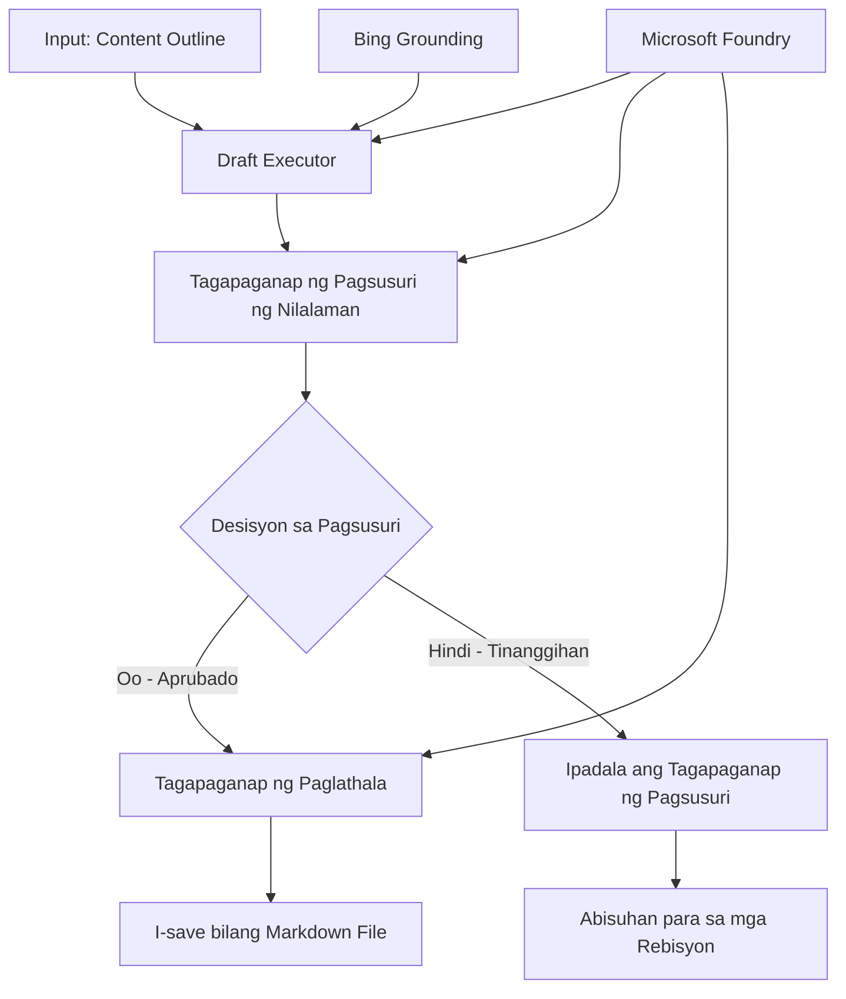

# 🔀 Mga Kondisyunal na Daloy ng Trabaho ng Ahente gamit ang Microsoft Foundry (.NET)

## 📋 Tutorial sa Matalinong Workflow na Batay sa Desisyon

Ipinapakita ng notebook na ito ang **mga pattern ng kondisyunal na daloy ng trabaho** gamit ang Microsoft Foundry at ang Microsoft Agent Framework para sa .NET. Matututuhan mo kung paano bumuo ng sopistikadong, desisyon-driven na mga daloy ng trabaho na matalino ang pagpapadala ng proseso base sa pagsusuri ng AI, mga patakaran sa negosyo, at mga dinamikong kondisyon para sa automation na pang-enterprise.

## 🎯 Mga Layunin sa Pagkatuto

### 🧠 **Matalinong Arkitektura ng Desisyon**
- **Pagpapatupad ng Kondisyunal na Lohika**: Bumuo ng komplikadong puno ng desisyon na may maraming sangay
- **AI-Powered Routing**: Gamitin ang mga modelo ng Microsoft Foundry upang gumawa ng matalinong mga desisyon sa ruta
- **Dynamic na Pagbabago ng Workflow**: Baguhin ang kilos ng workflow batay sa pagsusuri at kondisyon sa oras ng pagtakbo
- **Pagsasama ng Patakaran ng Enterprise**: Isama ang lohika ng negosyo at mga kinakailangan ng pagsunod sa mga workflow

### 🔀 **Mga Advanced na Pattern Kondisyunal**
- **Multi-Criteria na Paggawa ng Desisyon**: Suriin ang maraming salik para sa mga desisyon sa ruta
- **Context-Aware Processing**: Gumawa ng mga desisyon batay sa naipon na konteksto ng workflow at kasaysayan
- **Adaptive Workflow Modification**: Dinamikong iayos ang mga landas ng proseso base sa real-time na mga kondisyon
- **Pagsasama ng Rule Engine**: Magpatupad ng sopistikadong mga engine ng patakaran sa negosyo sa loob ng mga workflow

### 🏢 **Mga Kondisyunal na Aplikasyon sa Enterprise**
- **Pag-uuri ng Dokumento at Routing**: Awtomatikong iuri at ipadala ang mga dokumento sa angkop na mga workflow
- **Triage ng Serbisyong Pang-kustomer**: Matalinong pag-ruta ng mga tanong ng kustomer sa mga espesyalistang pangkat
- **Pagsunod at Pagproseso ng Panganib**: Ipatupad ang iba't ibang mga proseso ng pagsusuri batay sa pagtataya ng panganib
- **Mga Workflow ng Quality Assurance**: Ipadala ang nilalaman sa angkop na mga proseso ng pagsusuri batay sa mga sukatan ng kalidad

## ⚙️ Mga Kinakailangan at Setup

### 📦 **Kinakailangang NuGet Packages**

Mga advanced na pakete para sa kondisyunal na pagproseso ng workflow:

```xml
<!-- Core AI Framework -->
<PackageReference Include="Microsoft.Extensions.AI" Version="9.9.0" />

<!-- Azure AI Agents with Persistent State -->
<PackageReference Include="Azure.AI.Agents.Persistent" Version="1.2.0-beta.5" />

<!-- Azure Identity and Utilities -->
<PackageReference Include="Azure.Identity" Version="1.15.0" />
<PackageReference Include="System.Linq.Async" Version="6.0.3" />
<PackageReference Include="DotNetEnv" Version="3.1.1" />

<!-- Local Workflow Framework References -->
<!-- Microsoft.Agents.Workflows.dll - Advanced workflow orchestration -->
<!-- Microsoft.Agents.AI.AzureAI.dll - Microsoft Foundry integration -->
<!-- Microsoft.Agents.AI.dll - Core agent abstractions -->
```

### 🔑 **Pag-configure ng Microsoft Foundry**

**Kinakailangang Azure Resources:**
- Workspace ng Microsoft Foundry na may mga kondisyunal na modelo ng pagproseso
- Azure subscription na may angkop na compute quotas at permiso
- Na-deploy na mga modelo ng AI para sa paggawa ng desisyon at pagsusuri ng nilalaman
- (Opsyonal) Bing Search API na koneksyon para sa grounding capabilities

**Pag-configure ng Kapaligiran (file na .env):**
```env
# Microsoft Foundry Configuration
AZURE_AI_PROJECT_ENDPOINT=https://your-project.cognitiveservices.azure.com/
BING_CONNECTION_ID=your-bing-connection-id
```

**Setup ng Authentication:**
```csharp
// Azure CLI or Managed Identity authentication
using Azure.Identity;
var credential = new AzureCliCredential();

// Load environment configuration
DotNetEnv.Env.Load("../../../.env");
```

### 🏗️ **Arkitektura ng Kondisyunal na Workflow**



**Pangunahing Mga Komponent:**
- **Draft Executor**: Ahenteng AI na lumilikha ng paunang mga draft ng nilalaman mula sa mga balangkas
- **Content Review Executor**: Ahenteng AI na sumusuri sa kalidad at pagsunod ng draft
- **Conditional Routing**: Lohikang desisyon na nag-ruta base sa mga resulta ng pagsusuri
- **Publish/Review Paths**: Iba't ibang mga landas ng proseso para sa aprubado at tinanggihan na nilalaman
- **State Management**: Nagpapanatili ng konteksto ng nilalaman at pagsusuri sa buong workflow

## 🎨 **Mga Pattern sa Disenyo ng Kondisyunal na Workflow**

### 📋 **Produksyon ng Nilalaman na may Quality Gates**
```
Outline → Draft Creation → Quality Review → {Approve: Publish | Reject: Revise}
```

### 🎯 **Pagproseso ng Dokumento Batay sa Panganib**
```
Document → Risk Assessment → {Low: Standard | High: Enhanced Review}
```

### 🔍 **Matalinong Routing ng Serbisyo sa Kustomer**
```
Customer Query → Analysis → {Simple: FAQ Bot | Complex: Human Agent}
```

### 💼 **Mga Workflow na Batay sa Pagsunod**
```
Content → Compliance Check → {Pass: Publish | Fail: Legal Review}
```

## 🏢 **Mga Benepisyo ng Kondisyunal sa Enterprise**

### 🎯 **Matalinong Automation**
- **Matalinong Paggawa ng Desisyon**: AI-powered na mga desisyon sa ruta base sa pagsusuri ng nilalaman at konteksto
- **Adaptive Processing**: Mga workflow na awtomatikong inaayos base sa nagbabagong kondisyon
- **Pagpapatupad ng Patakaran sa Negosyo**: Awtomatikong aplikasyon ng komplikadong lohika at mga polisiyang pang-negosyo
- **Context-Aware Routing**: Mga desisyon base sa buong kasaysayan ng workflow at naipong konteksto

### 📈 **Kahusayan sa Operasyon**
- **Optimized Resource Allocation**: Ipadala ang trabaho sa pinaka-angkop na mga espesyalista at proseso
- **Bawas sa Manwal na Interbensyon**: Awtomatikong paggawa ng desisyon upang mabawasan ang pangangailangan ng manu-manong pag-ruta
- **Mas Mabilis na Oras ng Resolution**: Direktang pag-ruta sa angkop na kadalubhasaan at kakayahan sa pagproseso
- **Pare-parehong Aplikasyon**: Uniform na aplikasyon ng mga patakaran sa negosyo at pamantayan sa desisyon

### 🛡️ **Pamamahala ng Panganib at Pagsunod**
- **Awtomatikong Pagtatasa ng Panganib**: AI-powered na pagsusuri ng mga antas ng panganib ng nilalaman at sitwasyon
- **Pagpapatupad ng Pagsunod**: Awtomatikong pag-ruta sa mga kinakailangang prosesong pang-regulasyon
- **Paglalapat ng Mga Protokol sa Seguridad**: Pinalakas na mga hakbang sa seguridad na inilalapat base sa pagtatasa ng panganib
- **Pagpapanatili ng Audit Trail**: Kumpletong dokumentasyon ng mga desisyon sa ruta at mga paliwanag

### 📊 **Analytics at Patuloy na Pagpapabuti**
- **Decision Analytics**: Subaybayan ang bisa at katumpakan ng mga desisyon sa ruta
- **Pattern Recognition**: Tuklasin ang mga uso at pattern sa mga desisyon sa ruta sa paglipas ng panahon
- **Performance Optimization**: Patuloy na pagpapabuti ng mga pamantayan sa desisyon at kahusayan ng routing
- **Business Intelligence**: Mga pananaw sa mga katangian ng nilalaman at mga kinakailangan sa pagproseso

### 🔧 **Teknikal na Kahusayan**
- **Persistent State Management**: Panatilihin ang komplikadong estado sa buong pagpapatupad ng workflow
- **Scalable Architecture**: Pangasiwaan ang mataas na dami ng mga kinakailangan sa kondisyunal na pagproseso
- **Integration Capabilities**: Walang putol na integrasyon sa umiiral na mga sistema at proseso ng negosyo
- **Monitoring at Observability**: Komprehensibong pagsubaybay sa pagganap ng workflow at mga desisyon

Gawin nating matalino, desisyon-driven ang mga workflow ng enterprise gamit ang .NET! 🚀

## 💻 Pagpapatakbo ng Code

Ang kumpletong implementasyon ay makikita sa `04.dotnet-agent-framework-workflow-aifoundry-condition.cs`. Ipinapakita nito ang **workflow ng produksyon ng nilalaman na may quality gates**:

### 🏗️ **Arkitektura ng Workflow**

```
Content Outline → Draft Creation → Quality Review → Conditional Routing:
                                                      ├─ Approved (>200 words) → Publish
                                                      └─ Rejected (<200 words) → Review Notification
```

**Mga Ahente sa Workflow:**
1. **Evangelist Agent**: Lumilikha ng mga tutorial draft mula sa mga balangkas gamit ang grounding ng Bing
2. **Content Reviewer Agent**: Sinusuri ang kalidad ng draft (bilang ng salita, kumpletong nilalaman)
3. **Publisher Agent**: Nagsi-save ng aprubadong nilalaman bilang mga Markdown file na may timestamp

**Mga Custom Executor:**
1. **DraftExecutor**: Inaayos ang paggawa ng draft
2. **ContentReviewExecutor**: Gumagawa ng pagsusuri sa kalidad
3. **PublishExecutor**: Humahawak sa paglalathala ng aprubadong nilalaman
4. **SendReviewExecutor**: Pinamamahalaan ang mga notipikasyon ng tinanggihang nilalaman

### 🚀 Pagpapatakbo ng Halimbawa

**Mga Kinakailangan:**
- Na-configure na Microsoft Foundry workspace
- Azure CLI authentication (`az login`)
- (Opsyonal) Koneksyon ng Bing Search para sa grounding

```bash
# Gawing executable ang script (Unix/Linux/macOS)
chmod +x 04.dotnet-agent-framework-workflow-aifoundry-condition.cs

# Patakbuhin ang kundisyunal na workflow
./04.dotnet-agent-framework-workflow-aifoundry-condition.cs
```

O sa Windows:
```powershell
dotnet run 04.dotnet-agent-framework-workflow-aifoundry-condition.cs
```

### 📝 Inaasahang Output

Ang workflow ay:
1. **Lumikha ng mga Ahente**: I-initialize ang tatlong espesyalistang Microsoft Foundry agents
2. **Gumawa ng Draft**: Lumilikha ang evangelist agent ng tutorial draft mula sa balangkas
3. **Suriin ang Nilalaman**: Sinusuri ng Content Reviewer ang kalidad ng draft
4. **Kondisyunal na Pag-ruta**:
   - **Kung aprubado (>200 salita)**: Ini-save ng publish executor bilang Markdown file
   - **Kung tinanggihan (<200 salita)**: Nagpapadala ng notipikasyon ng pagsusuri
5. **Ipakita ang Resulta**: Ipakita ang huling resulta ng workflow

### 🔧 Mga Opsyon sa Pag-customize

**Baguhin ang Mga Pamantayan sa Pagsusuri:**
```csharp
const string ContentReviewerInstructions = @"
You are a content reviewer...
1. Check if content is more than 500 words (instead of 200)
2. Verify technical accuracy
3. Ensure proper formatting
...";
```

**Magdagdag ng Higit pang Mga Kondisyunal na Landas:**
```csharp
var workflow = new WorkflowBuilder(draftExecutor)
    .AddEdge(draftExecutor, contentReviewerExecutor)
    .AddEdge(contentReviewerExecutor, publishExecutor, condition: GetCondition("Excellent"))
    .AddEdge(contentReviewerExecutor, editExecutor, condition: GetCondition("Good"))
    .AddEdge(contentReviewerExecutor, sendReviewerExecutor, condition: GetCondition("Poor"))
    .Build();
```

**Baguhin ang Mga Kinakailangan sa Nilalaman:**
```csharp
string OUTLINE_Content = @"
# Your Custom Topic
## Section 1
https://your-reference-url
## Section 2
...
";
```

### 🎯 Mga Aplikasyon sa Totoong Mundo

Ang kondisyunal na pattern ng workflow na ito ay perpekto para sa:
- **Mga Sistema ng Pamamahala ng Nilalaman**: Awtomatikong mga editorial workflow na may quality gates
- **Pagproseso ng Dokumento**: Ipadala ang mga dokumento base sa klasipikasyon at pagsunod
- **Suporta sa Kustomer**: Matalinong pag-ruta ng ticket base sa kumpleksidad at pagmamadali
- **Pagsusuri sa Legal**: Ipadala ang mga kontrata base sa pagtatasa ng panganib at halaga
- **Mga Proseso ng HR**: Ipadala ang mga aplikasyon sa angkop na mga screening workflow

### 🔍 Pag-unawa sa Kondisyunal na Lohika

**Function ng Kondisyon:**
```csharp
public Func<object?, bool> GetCondition(string expectedResult) =>
    reviewResult => reviewResult is ReviewResult review && review.Result == expectedResult;
```

Gumagawa ang function na ito ng predicate na:
1. Sinusuri kung ang resulta ay ng uri na `ReviewResult`
2. Kinukumpara ang property na `Result` sa inaasahang halaga
3. Nagbabalik ng true/false upang tukuyin ang pag-ruta

**Mga Dulo ng Workflow na may Kondisyon:**
```csharp
.AddEdge(contentReviewerExecutor, publishExecutor, condition: GetCondition("Yes"))
.AddEdge(contentReviewerExecutor, sendReviewerExecutor, condition: GetCondition("No"))
```

### 📊 Mga Advanced na Tampok

**Pag-validate ng JSON Schema:**
Ginagamit ng workflow ang mga JSON schema upang matiyak ang nakaestrukturang tugon:

```csharp
// Define response structure
public class ReviewResult
{
    [JsonPropertyName("review_result")]
    public string Result { get; set; } = string.Empty;
    
    [JsonPropertyName("reason")]
    public string Reason { get; set; } = string.Empty;
    
    [JsonPropertyName("draft_content")]
    public string DraftContent { get; set; } = string.Empty;
}

// Apply to agent
ResponseFormat = ChatResponseFormat.ForJsonSchema(
    AIJsonUtilities.CreateJsonSchema(typeof(ReviewResult)), 
    "ReviewResult", 
    "Review Result From DraftContent"
)
```

**Integrasyon ng Bing Grounding:**
Ginagamit ng evangelist agent ang Bing grounding upang ma-access ang impormasyon sa real-time:

```csharp
var bingGroundingConfig = new BingGroundingSearchConfiguration(bing_conn_id);
BingGroundingToolDefinition bingGroundingTool = new(
    new BingGroundingSearchToolParameters([bingGroundingConfig])
);
```

Pinapayagan nito ang ahente na sundan ang mga URL sa balangkas at kunin ang kasalukuyang impormasyon.

### 🛡️ Pag-handle ng Error

May kasamang matibay na pag-handle ng error ang workflow para sa tinanggihang nilalaman:
- Ang mga pagkabigo sa pagsusuri ay nagti-trigger ng alternatibong landas
- Nagbibigay ang mga notipikasyon ng malinaw na dahilan ng pagtanggi
- Nanatiling nakatago ang nilalaman para sa rebisyon

### 🔄 Pagpapalawak ng Workflow

**Magdagdag ng Revision Loop:**
Gumawa ng feedback loop na awtomatikong nag-redraft ng nilalaman:

```csharp
.AddEdge(contentReviewerExecutor, publishExecutor, condition: GetCondition("Yes"))
.AddEdge(contentReviewerExecutor, draftExecutor, condition: GetCondition("No")) // Loop back
```

**Magpatupad ng Multi-Level Review:**
Magdagdag ng maraming yugto ng pagsusuri na may iba't ibang pamantayan:

```csharp
.AddEdge(draftExecutor, technicalReviewer)
.AddEdge(technicalReviewer, editorialReviewer, condition: GetCondition("TechPass"))
.AddEdge(editorialReviewer, publishExecutor, condition: GetCondition("EditPass"))
```

Ang kondisyunal na pattern ng workflow na ito ang nagbibigay ng pundasyon para sa pagbuo ng sopistikado, matalinong mga sistema ng automation ng enterprise! 🚀

---

<!-- CO-OP TRANSLATOR DISCLAIMER START -->
**Pagtatanggi**:
Ang dokumentong ito ay isinalin gamit ang serbisyo ng AI translation na [Co-op Translator](https://github.com/Azure/co-op-translator). Bagama't nagsusumikap kami para sa katumpakan, pakatandaan na ang awtomatikong pagsasalin ay maaaring maglaman ng mga pagkakamali o hindi pagkakatugma. Ang orihinal na dokumento sa orihinal nitong wika ang dapat ituring na pangunahing sanggunian. Para sa mahahalagang impormasyon, inirerekomenda ang propesyonal na pagsasalin ng tao. Hindi kami mananagot sa anumang maling pagkakaintindi o maling interpretasyon na nagmula sa paggamit ng pagsasaling ito.
<!-- CO-OP TRANSLATOR DISCLAIMER END -->