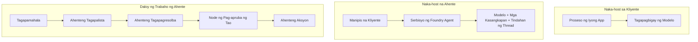
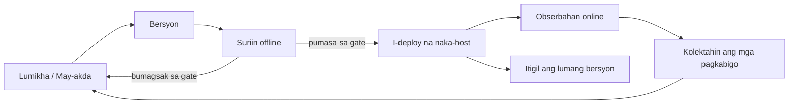
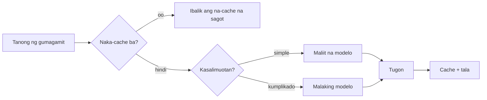
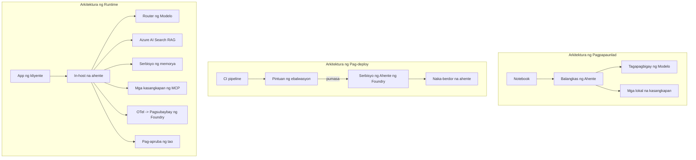

# Pag-deploy ng Mga Nasusukatang Ahente gamit ang Microsoft Foundry


Hanggang sa puntong ito sa kurso ay nakabuo ka na ng mga ahenteng tumatakbo sa iyong laptop, sa loob ng isang notebook, pinapatakbo ng `az login` at ilang environment variables. Iyon ay eksaktong tamang paraan para matuto. Hindi iyon ang tamang paraan para magpatakbo ng ahente na umaasa ang libu-libong customer sa alas-3 ng umaga.

Ang araling ito ay tungkol sa agwat sa pagitan ng "gumagana ito sa aking makina" at "gumagana ito nang maaasahan at abot-kaya sa produksyon." Isinasara namin ang agwat na iyon gamit ang **Microsoft Foundry** at ang **Microsoft Foundry Agent Service**, at ginagawa namin ito sa pamamagitan ng paggawa ng isang tunay na customer support agent na may mga kagamitan, retrieval, memorya, pagsusuri, at pagmamanman.

## Panimula

Tatalakayin ng araling ito:

- Ang kaibahan sa pagitan ng **prototype agent** at isang **deployed agent**, at bakit ang paglilipat ay kadalasang tungkol sa lahat ng nasa paligid ng modelo.
- **Mga pattern sa pag-deploy** para sa mga ahente: client-hosted, service-hosted (Hosted Agents), at workflow-orchestrated.
- Ang **agent lifecycle** sa Microsoft Foundry — lumikha, iba't ibang bersyon, mag-deploy, suriin, obserbahan, magretiro.
- **Mga estratehiya sa pagsu-scaling**: routing ng modelo, caching, concurrency, at stateless na disenyo.
- **Observability** gamit ang OpenTelemetry at Foundry tracing.
- **Pag-optimize ng gastos** sa pamamagitan ng pagpili ng modelo, routing, at mga evaluation gate.
- **Mga konsiderasyon sa enterprise**: pamamahala, human approval, at ligtas na pagpapatakbo ng MCP servers sa produksyon.

## Mga Layunin sa Pagkatuto

Pagkatapos makumpleto ang araling ito, malalaman mo kung paano:

- Pumili ng tamang deployment pattern para sa isang partikular na workload ng ahente.
- Mag-deploy ng ahente sa Microsoft Foundry Agent Service upang ma-beripika, mapamahalaan, at maobserbahan.
- Mag-instrument ng ahente para sa tracing at i-wire ang evaluation pipeline na tumatakbo bago ang bawat release.
- Mag-apply ng model routing at caching upang mapanatili ang latency at gastos sa ilalim ng kontrol sa malaking sukat.
- Magdagdag ng human approval gate para sa mga riskadong aksyon at i-integrate ang MCP server sa ligtas na paraan sa produksyon.

## Mga Kinakailangan Bago Magsimula

Inaasahan sa araling ito na natapos mo na ang mga naunang aralin at komportable ka sa:

- Pagbuo ng mga ahente gamit ang [Microsoft Agent Framework](../14-microsoft-agent-framework/README.md) (Lesson 14).
- [Paggamit ng Tools](../04-tool-use/README.md) (Lesson 4) at [Agentic RAG](../05-agentic-rag/README.md) (Lesson 5).
- [Agent Memory](../13-agent-memory/README.md) (Lesson 13) at [Agentic Protocols / MCP](../11-agentic-protocols/README.md) (Lesson 11).
- [Observability at Pagsusuri](../10-ai-agents-production/README.md) (Lesson 10) — ang araling ito ay direktang sumunod dito.

Kailangan mo rin:

- Isang **Azure subscription** at isang **Microsoft Foundry project** na may kahit isang na-deploy na chat model.
- Ang **Azure CLI** na na-authenticate (`az login`).
- Python 3.12+ at ang mga package sa repository [`requirements.txt`](../../../requirements.txt).

## Mula Prototype Hanggang Produksyon: Ano ang Talagang Nagbabago

Ang prototype agent at production agent ay may parehong core loop — pag-iisip, pagtawag ng mga kagamitan, pagsagot. Ang nagbabago ay lahat ng nakabalot sa loop na iyon. Ang modelo ay marahil 20% lamang ng isang production agent; ang natitirang 80% ay ang operational na balangkas.

| Usapin | Prototype | Produksyon |
| --- | --- | --- |
| **Hosting** | Tumakbo sa iyong notebook | Tumakbo bilang hosted service, may bersyon at inilalabas |
| **Identity** | Iyong `az login` token | Managed identity na may scoped RBAC |
| **State** | In-memory, nawawala sa restart | Na-externalize (thread store, memory service) |
| **Failure** | Nakikita mo ang traceback | Mag-retry, fallback, dead-letter, alerts |
| **Gastos** | "Ilang sentimo lang" | Sinusubaybayan bawat request, niruruta, cached, may budget |
| **Kalidad** | Tinitingnan mo ang output | Awtomatikong sinusuri bago ang bawat release |
| **Tiwala** | Inaaprubahan mo ang bawat aksyon | Patakaran + human-in-the-loop para sa mga riskadong aksyon |

Tandaan ang talahanayang ito. Bawat seksyon sa ibaba ay tumutugma sa isa sa mga hilera nito.

## Mga Pattern sa Pag-deploy ng Ahente

May tatlong pattern na gagamitin mo, madalas na sabay-sabay.

### 1. Client-Hosted Agents

Ang agent object ay nasa loob ng proseso ng *iyong* aplikasyon. Direktang tinatawag ng iyong code ang model provider; ang reasoning loop ay tumatakbo sa iyong serbisyo. Ito ang ginawa ng bawat naunang aralin.

- **Gamitin ito kapag** kailangan mo ng buong kontrol sa loop, custom middleware, o iniembed ang ahente sa isang umiiral na backend.
- **Trade-off**: ikaw ang nagmamay-ari ng scaling, estado, at tibay.

### 2. Hosted Agents (Foundry Agent Service)

Ang ahente ay *irehistro bilang isang resource* sa Microsoft Foundry. Ina-host ng Foundry ang reasoning loop, nag-iimbak ng mga thread, nagpapatupad ng content safety at RBAC, at ginagawang nakikita ang ahente sa Foundry portal. Ang iyong app ay nagiging manipis na kliyente na lumilikha ng mga thread at nagbabasa ng mga sagot.

- **Gamitin ito kapag** gusto mo ng tibay, built-in na observability, governance, at mas maliit na operational surface area.
- **Trade-off**: mas kaunting mababang-level na kontrol kapalit ng managed runtime.

### 3. Agent Workflows

Maraming ahente (at mga kagamitan) ang pinagsama sa isang grap na may malinaw na control flow — sunod-sunod na mga hakbang, branching, human approval nodes, at mga matibay na checkpoint na maaaring huminto at magpatuloy. Ito ang kakayahan ng Microsoft Agent Framework na **Workflows** na inilalapat sa deployment scale.

- **Gamitin ito kapag** ang isang gawain ay sumasaklaw sa ilang espesyalisadong ahente o nangangailangan ng approval step sa gitna.
- **Trade-off**: mas maraming bahagi; nangangailangan ng orchestration-level observability.



## Ang Lifecycle ng Ahente sa Microsoft Foundry

Ang pag-deploy ng ahente ay hindi isang isang beses na `push`. Ito ay isang loop, at kahalintulad ng cycle ng paglabas ng software dahil iyon talaga ang katangian nito.



Ang susi, na dinala mula sa [Aralin 10](../10-ai-agents-production/README.md): **ang offline evaluation ay isang gate, hindi lamang isang pansamantalang hakbang.** Hindi inilalabas ang bagong bersyon ng ahente maliban kung pumasa ito sa iyong evaluation thresholds. Ang online observability ay pagkatapos naghahatid ng mga totoong failure pabalik sa iyong offline test set. Iyan ang buong loop.

## Mga Estratehiya sa Scaling

Ang pagsu-scaling ng ahente ay naiiba sa pagsu-scaling ng stateless na web API, dahil bawat request ay maaaring mag-trigger ng maraming mahal na tawag sa modelo at kagamitan. Apat na teknik ang nagsasalo sa karamihan ng bigat.

**Stateless request handling.** Huwag magtago ng estado ng bawat user sa iyong process memory. I-save ang mga conversation thread sa Foundry thread store o memory service upang anumang instance ay makakapag-handle ng anumang request. Ito ang nagpapahintulot sa iyo na mag-scale nang pahalang — magdagdag ng mga instance, walang sticky sessions.

**Model routing.** Hindi lahat ng request ay nangangailangan ng iyong pinakakakayahang (at pinakamahal) na modelo. I-route ang mga simpleng request — intent classification, mga maikling sagot sa tanong — sa maliit at mabilis na modelo, at ireserba ang malaking modelo para sa tunay na pag-iisip. Maaari itong gawin ng Foundry's **Model Router** para sa iyo, o maaari kang gumawa ng sariling maliit na classifier. Gagawa ka ng bersyon ng DIY sa lab.

**Response caching.** Maraming support queries ay halos magkapareho ("paano ko na-reset ang aking password?"). I-cache ang mga sagot sa mga karaniwang tanong at ihain nang hindi hinahawakan ang modelo. Kahit katamtamang cache hit rate ay makabuluhang nagpapababa ng gastos at latency.

**Concurrency at backpressure.** May rate limit ang mga model provider. Limitahan ang concurrency, gumamit ng retries na may exponential backoff, at mag-fail nang maayos (ang naka-queue na "ginagawan namin nito" na tugon ay mas mabuti kaysa sa 500).



## Observability sa Produksyon

Hindi mo mapapatakbo ang hindi mo nakikita. Tulad ng tinalakay sa Aralin 10, ang Microsoft Agent Framework ay naglalabas ng **OpenTelemetry** traces nang native — bawat pagtawag ng modelo, pagpatawag ng kagamitan, at hakbang sa orchestration ay nagiging span. Sa produksyon, ine-export mo ang mga span sa Microsoft Foundry (o anumang OTel-compatible backend) upang:

- Masundan ang isang reklamo ng customer mula simula hanggang matapos sa bawat pagtawag ng modelo at kagamitan.
- Bantayan ang p50/p95 latency at gastos bawat request sa paglipas ng panahon.
- Mag-alerto sa pagtaas ng error rate at mga abnormalidad sa gastos bago pa man mapansin ng iyong mga user (o ng iyong finance team).

```python
from agent_framework.observability import get_tracer

tracer = get_tracer()

with tracer.start_as_current_span("support_request") as span:
    span.set_attribute("customer.tier", "enterprise")
    span.set_attribute("routed.model", "gpt-5-nano")
    # Ang pagsubaybay sa pagpapatupad ng agent ay awtomatikong ginagawa sa loob ng span na ito
```

Ang mga katangian tulad ng `customer.tier` at `routed.model` ang nagpapalit ng wall of traces sa mga tanong na may sagot ("madalas bang nairuruta ang mga enterprise customer sa maliit na modelo?").

## Pag-optimize ng Gastos

Ang gastos sa produksyon ng mga ahente ay pinalalaganap ng mga token. Tatlong mga paraan, ayon sa epekto:

1. **Tamang-tamang laki ng modelo.** Ang maliit na modelo na pumasa sa iyong evaluation gate ay halos palaging mas mura kaysa sa malaking modelo na rin namang pumasa. Gamitin ang evaluation upang *patunayan* na sapat na ang maliit na modelo sa halip na default na piliin ang pinakamalaki bilang pag-iingat.
2. **Route ayon sa kumplikasyon.** Gaya ng nabanggit — magbayad ng presyo para sa malaking modelo lamang sa mga request na kailangan ng malalim na pag-iisip.
3. **Mag-cache nang agresibo.** Ang pinakamurang pagtawag sa modelo ay yaong hindi mo kailangang gawin.

Ang mga evaluation gate at pagkontrol sa gastos ay parehong disiplina mula sa dalawang panig: ang evaluation ang nagsasabi ng *quality floor*, ang routing at caching ang nagpapanatili ng gastos na kasing lapit ng posibleng sa sahig na iyon.

## Mga Konsiderasyon sa Enterprise Deployment

**Pamamahala.** Ang Hosted Agents ay minana ang RBAC, content safety, at audit logging ng Foundry. Bigyan ang bawat ahente ng managed identity na may pinakamaliit na pribilehiyo na kailangan nito — read-only access sa knowledge base, scoped access sa ticketing API, at wala nang iba pa.

**Human-in-the-loop.** Ang ilan sa mga aksyon ay masyadong malaki ang epekto para i-automate nang tuluyan — pag-isyu ng refund, pagtanggal ng account, pag-eskala sa legal na koponan. Sinusuportahan ng Microsoft Agent Framework ang **approval-required** na mga tool: ang ahente ay nagmumungkahi ng aksyon, hihinto ang pagpapatupad, ie-evaluate ng tao at mag-aapruba o tatanggihan, tapos magpapatuloy ang workflow. Nakita mo ang primitive sa [Aralin 6](../06-building-trustworthy-agents/README.md); dito mo ito ide-deploy.

**MCP sa produksyon.** Pinapayagan ng [MCP](../11-agentic-protocols/README.md) ang iyong ahente na gumamit ng mga external tool sa pamamagitan ng standard interface. Sa produksyon, ituring ang bawat MCP server bilang hindi pinagkakatiwalaang hangganan: i-pin ang bersyon ng server, patakbuhin ito gamit ang scoped identity, i-validate ang output nito, at huwag kailanman ibunyag ang mga sekreto dito. Ang MCP server ay isang dependency, at ang mga dependency ay pinapa-patch, sinusuri, at nililimitahan ang rate.



Ang tatlong diagram na iyon — development, deployment, runtime — ay iisang ahente sa tatlong yugto ng buhay nito. Ang susunod na lab ay gagabay sa iyo sa paggawa nito.

## Hands-On Lab: Isang Production-Ready na Customer Support Agent

Buksan ang [`code_samples/16-python-agent-framework.ipynb`](./code_samples/16-python-agent-framework.ipynb) at sundan ito mula simula hanggang dulo. Bubuuin mo ang isang **Contoso customer support agent** na may lahat ng aspekto ng produksyon na naka-wire:

1. **Pagtawag ng Tool** — tingnan ang status ng order at magbukas ng support tickets.
2. **RAG** — sagutin ang mga tanong tungkol sa polisiya mula sa knowledge base (Azure AI Search, na may in-memory fallback para tumakbo ang notebook nang walang Search resource).
3. **Memorya** — tandaan ang customer sa bawat pag-ikot ng pag-uusap.
4. **Model routing** — isang complexity classifier ang nag-ruruta ng bawat request sa maliit o malaking modelo.
5. **Response caching** — ang mga paulit-ulit na tanong ay sinasagot mula sa cache.
6. **Human approval** — ang mga refund na lampas sa threshold ay hihintayin ang pirma ng tao.
7. **Evaluation pipeline** — isang maliit na offline test set ang nagsusuri sa ahente at nagsisilbing gate bago ilabas.
8. **Observability** — OpenTelemetry tracing sa bawat request.

### Gabay sa Paglakad

Ang notebook ay inayos upang ang bawat aspetong pang-produksyon ay isang nakahiwalay, tumatakbong seksyon. Ang puso nito ay ang routing-plus-caching request handler:

```python
async def handle_support_request(query: str, customer_id: str) -> str:
    # 1. Maglingkod mula sa cache kapag maaari.
    cached = response_cache.get(normalize(query))
    if cached:
        return cached

    # 2. Mag-route ayon sa pagiging kumplikado upang kontrolin ang gastos.
    model = "gpt-5-nano" if is_simple(query) else "gpt-5-mini"

    # 3. Patakbuhin ang ahente sa loob ng trace span para sa obserbabilidad.
    with tracer.start_as_current_span("support_request") as span:
        span.set_attribute("routed.model", model)
        span.set_attribute("customer.id", customer_id)
        response = await support_agent.run(query, model=model)

    # 4. I-cache at ibalik.
    response_cache.set(normalize(query), response.text)
    return response.text
```

Ganito ang hitsura ng evaluation gate na nagbabantay sa isang release:

```python
async def evaluation_gate(agent, test_cases, threshold: float = 0.8) -> bool:
    passed = 0
    for case in test_cases:
        result = await agent.run(case["input"])
        if score_response(result.text, case["expected"]) >= 0.8:
            passed += 1
    pass_rate = passed / len(test_cases)
    print(f"Evaluation pass rate: {pass_rate:.0%} (gate: {threshold:.0%})")
    return pass_rate >= threshold  # mag-deploy lamang kung pumasa ang gate
```

Basahin ang bawat linya — ang notebook ay ginawang maliit ang mga primitive upang walang itinatago sa likod ng isang framework call.

## Pagpapatunay ng Isang Na-deploy na Ahente gamit ang Smoke Tests

Ang evaluation gate sa itaas ay tumatakbo *offline* laban sa iyong agent object. Kapag ang ahente ay na-deploy na bilang Hosted Agent, kailangan mo pa ng isa pang mas mura na tseke: **sagot ba talaga ang endpoint na na-deploy?**

Ang matagumpay na pag-deploy ay pinatutunayan lang na tinanggap ng control plane ang depinisyon — hindi nito pinatutunayan na sumasagot ang ahente. Maaaring may kulang na dependency, maling model routing, o expired na koneksyon kaya ang green deployment ay walang sagot. Ang **smoke test** ang nakakakita niyan sa loob ng ilang segundo, sa bawat deploy, nang hindi kailangang gumastos ng buong evaluation.

Nagbibigay ang repositoryong ito ng handa-na-gamitin na smoke-test pipeline na ginawa gamit ang [AI Smoke Test](https://github.com/marketplace/actions/ai-smoke-test) GitHub Action:

- **Catalog** — ang [`tests/lesson-16-smoke-tests.json`](../../../tests/lesson-16-smoke-tests.json) ay naglalaman ng mga prompt at assertion para sa Contoso support agent (mga sagot na may batayan sa polisiya, paghahanap ng order, pananatili sa paksa, at multi-turn thread continuity). May catalog para sa mga ahente ng ibang aralin na nasa tabi nito — tingnan ang [`tests/README.md`](../tests/README.md).
- **Workflow** — ang [`.github/workflows/smoke-test.yml`](../../../.github/workflows/smoke-test.yml) ay nagla-login gamit ang Azure OIDC at ipinapadala ang bawat prompt sa Responses endpoint ng ahente, na pinapaso ang trabaho kung may maling assertion.

```yaml
- name: Smoke-test hosted agent
  uses: JFolberth/ai-smoketest@v1
  with:
    project_endpoint: ${{ inputs.project_endpoint }}
    agent_name: ContosoSupportAgent
    tests_file: tests/lesson-16-smoke-tests.json
```


Patakbuhin ito mula sa tab na **Actions** kapag na-deploy na ang iyong ahente, ibigay ang endpoint ng iyong Foundry project at pangalan ng ahente. Kailangang may role na **Azure AI User** ang federated identity sa saklaw ng Foundry project. Isipin ang mga layer bilang isang pyramid: mga smoke test (naaabot at tumutugon ba?) na tumatakbo sa bawat deploy, offline evaluation (sapat na ba para ipadala?) na tumatakbo bago itaas ang versyon, at online evaluation (paano ito gumagana sa aktwal na gamit?) na tumatakbo nang tuloy-tuloy.

## Knowledge Check

Subukan ang iyong pag-unawa bago lumipat sa assignment.

**1. Tinatayang gaano kalaki ng production agent ang "modelo," at ano ang natitira?**

<details>
<summary>Sagot</summary>

Ang modelo ay bahagi lamang ng sistema — kadalasang tinutukoy na mga 20%. Ang natitira ay ang operational skeleton: hosting at versioning, identity at RBAC, externalised state, failure handling, cost tracking, evaluation, at human-in-the-loop controls. Ang paglipat sa production ay karamihang tungkol sa pagtatayo ng lahat *sa paligid* ng reasoning loop.
</details>

**2. Kailan ka pipili ng Hosted Agent kaysa sa client-hosted agent?**

<details>
<summary>Sagot</summary>

Kapag gusto mo ng managed runtime na may built-in durability (threads na nagpapatuloy at maaaring mag-resume), observability, content safety, at RBAC, at handang isakripisyo ang ilang mababang antas na kontrol ng reasoning loop para sa mas kaunting operational surface area. MAS mainam ang client-hosted kapag kailangan mo ng ganap na kontrol sa loop o kapag inilalagay ang ahente sa isang existing backend.
</details>

**3. Bakit kailangang stateless sa sariling process memory ang scalable agent?**

<details>
<summary>Sagot</summary>

Para kahit anong instance ay makagawa ng kahit anong request, na siyang nagpapahintulot ng horizontal scaling nang walang sticky sessions. Ang per-user conversation state ay externalised sa thread store o memory service. Kung ang estado ay nasa process memory, mawawala ito sa pag-restart at hindi maayos ang distribusyon ng load.
</details>

**4. Anong problema ang nilulutas ng model routing, at paano ito konektado sa evaluation?**

<details>
<summary>Sagot</summary>

Pinapadala ng routing ang mga simpleng request sa maliit, mura, at mabilis na modelo at inireserba ang malaking modelo para sa tunay na reasoning, na kinokontrol ang latency at gastos. Konektado ito sa evaluation dahil ang evaluation ang *nagpapatunay* na sapat na ang maliit na modelo para sa isang klase ng mga request — ang routing na walang evaluation ay hulaan lamang.
</details>

**5. Ano ang "evaluation gate" at saan ito nakalagay sa lifecycle?**

<details>
<summary>Sagot</summary>

Ang evaluation gate ay nagpapatakbo ng offline test set laban sa bagong bersyon ng ahente at hinaharangan ang deployment maliban kung ang pass rate ay lampas sa threshold. Nakalagay ito sa pagitan ng "version" at "deploy" sa lifecycle, ginagawa ang kalidad bilang kondisyon bago mag-release sa halip na isang bagay na sinusuri pagkatapos ipadala.
</details>

**6. Bakit dapat tratuhin ang MCP server bilang untrusted boundary sa production?**

<details>
<summary>Sagot</summary>

Dahil ito ay isang external dependency na tinatawagan ng iyong ahente. Dapat i-pin ang bersyon nito, patakbuhin gamit ang scoped identity, i-validate ang mga output, limitahan ang rate, at huwag kailanman ibigay ang mga lihim dito — pareho ang disiplina na inilalapat sa anumang third-party dependency. Ang mga output nito ay pumapasok sa reasoning ng iyong ahente, kaya ang hindi na-validate na tiwala ay delikadong risk sa seguridad.
</details>

**7. Alin ang karaniwang pagbabago na may pinakamalaking epekto sa gastos ng production agent, at bakit?**

<details>
<summary>Sagot</summary>

Ang tamang sukat ng modelo — paggamit ng pinakamaliit na modelo na pumapasa sa iyong evaluation gate. Pinangungunahan ng token ang gastos, at ang mas maliit na modelo na nakakatugon sa kalidad ay halos palaging mas mura kaysa sa mas malaking isa. Binabawasan pa ng caching at routing ang gastos, ngunit ang pagpili ng tamang base model ang may pinakamalaking unang epekto.
</details>

**8. Anong papel ang ginagampanan ng mga span attributes tulad ng `customer.tier` at `routed.model` sa observability?**

<details>
<summary>Sagot</summary>

Ginagawa nilang mga masisagot na tanong sa negosyo ang mga raw traces. Kung walang attributes, parang pader ng spans lang; gamit ang mga ito, maaari mong itanong "napupunta ba ang mga enterprise customer sa maliit na modelo nang masyadong madalas?" o "alin sa mga modelo ang humahawak ng aming pinakamatagal na request?" Attributes ang ginagamit upang hatiin ang telemetry ayon sa mga dimensyon na mahalaga sa iyong operasyon.
</details>

## Assignment

Kuhanin ang customer support agent mula sa lab at patibayin ito para sa isang tiyak na senaryo: **isang subscription billing support agent para sa isang SaaS na kumpanya.**

Ang iyong pagsusumite ay dapat:

1. **Palitan ang mga tools** ng mga may kaugnayan sa billing: `get_subscription_status`, `get_invoice`, at `issue_credit` (ang mga kredito na higit sa $50 ay nangangailangan ng aprobasyon ng tao).
2. **Magdagdag ng tatlong RAG na dokumento** na sumasaklaw sa patakaran ng refund ng kumpanya, billing cycle, at patakaran sa pagkansela.
3. **Palawakin ang evaluation set** sa hindi bababa sa walong kaso, kasama ang hindi bababa sa dalawa na *dapat* mag-trigger ng human-approval path, at tiyaking tama ang pagpasa o pagkabigo ng iyong evaluation gate.
4. **Magdagdag ng isang ulat ng gastos**: pagkatapos patakbuhin ang sampung halo-halong mga query sa ahente, ipakita kung ilan ang napunta sa maliit na modelo, ilan sa malaking modelo, at ilan ang nagsilbi mula sa cache.

Sumulat ng maikling talata (sa isang markdown cell) na nagpapaliwanag kung aling patakaran sa model routing ang pinili mo at kung paano mo ito ibabase sa totoong trapiko. Walang iisang tamang sagot — sinusuri ka kung saan ang mga concerns sa production ay konektado nang maayos.

## Buod

Sa leksyong ito, nailipat mo ang ahente mula prototype papuntang production gamit ang Microsoft Foundry:

- Ang paglipat sa production ay tungkol sa **operational skeleton** sa paligid ng modelo — hosting, identity, state, failure handling, gastos, kalidad, at tiwala.
- Natutunan mo ang tatlong **deployment patterns** — client-hosted, Hosted Agents, at Agent Workflows — at kung kailan bagay ang bawat isa.
- Dinala mo ang **agent lifecycle**, kung saan ang offline **evaluation ay nagsisilbing release gate** at ang online observability ay nagtutulak ng feedback ng mga kabiguan sa test set.
- Inilapat mo ang **scaling strategies** — stateless design, model routing, caching, at bounded concurrency — at inugnay ang mga ito sa **cost optimisation**.
- Ikonekta mo ang **enterprise controls**: RBAC, human-in-the-loop approval, at production-safe MCP integration.
- Naitayo mo ang **production-ready customer support agent** na nag-uugnay sa bawat isang concern sa runnable na code.

Ang susunod na leksyon ay papunta naman sa kabaligtaran na paglalakbay: sa halip na i-scale ang mga ahente pataas sa cloud, dadalhin mo sila *pababa* sa isang solong makina ng developer at patakbuhin nang lokal nang lubusan.

## Karagdagang Mga Sanggunian

- <a href="https://learn.microsoft.com/azure/ai-foundry/what-is-azure-ai-foundry" target="_blank">Microsoft Foundry documentation</a>
- <a href="https://learn.microsoft.com/azure/ai-foundry/agents/overview" target="_blank">Microsoft Foundry Agent Service overview</a>
- <a href="https://aka.ms/ai-agents-beginners/agent-framework" target="_blank">Microsoft Agent Framework</a>
- <a href="https://learn.microsoft.com/azure/ai-foundry/concepts/model-router" target="_blank">Model Router in Microsoft Foundry</a>
- <a href="https://learn.microsoft.com/azure/search/search-what-is-azure-search" target="_blank">Azure AI Search</a>
- <a href="https://opentelemetry.io/" target="_blank">OpenTelemetry</a>
- <a href="https://github.com/marketplace/actions/ai-smoke-test" target="_blank">AI Smoke Test GitHub Action</a>
- <a href="https://modelcontextprotocol.io/" target="_blank">Model Context Protocol (MCP)</a>

## Nakaraang Leksiyon

[Building Computer Use Agents (CUA)](../15-browser-use/README.md)

## Susunod na Leksiyon

[Paglikha ng Lokal na AI Agents](../17-creating-local-ai-agents/README.md)

---

<!-- CO-OP TRANSLATOR DISCLAIMER START -->
**Pagtatanggi**:
Ang dokumentong ito ay isinalin gamit ang serbisyo ng AI translation na [Co-op Translator](https://github.com/Azure/co-op-translator). Bagama't nagsusumikap kami para sa katumpakan, pakatandaan na ang awtomatikong pagsasalin ay maaaring maglaman ng mga pagkakamali o hindi pagkakatugma. Ang orihinal na dokumento sa orihinal nitong wika ang dapat ituring na pangunahing sanggunian. Para sa mahahalagang impormasyon, inirerekomenda ang propesyonal na pagsasalin ng tao. Hindi kami mananagot sa anumang maling pagkakaintindi o maling interpretasyon na nagmula sa paggamit ng pagsasaling ito.
<!-- CO-OP TRANSLATOR DISCLAIMER END -->