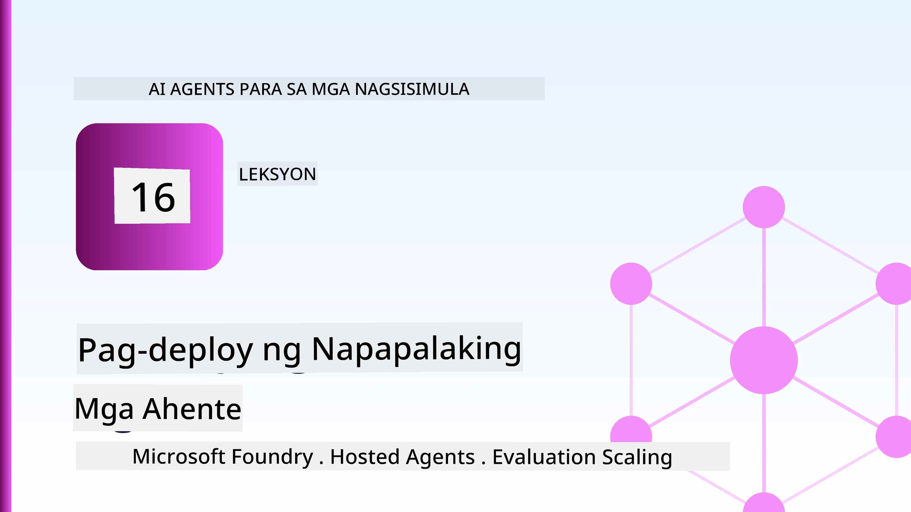
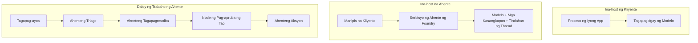
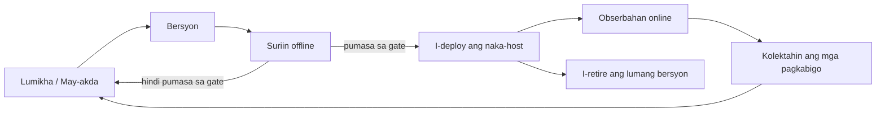
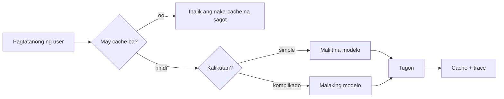
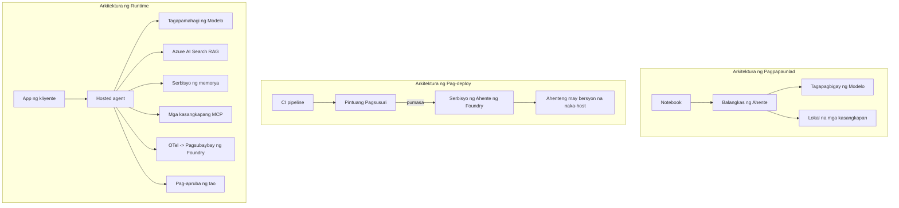

# Pag-deploy ng Mga Scalable na Ahente gamit ang Microsoft Foundry



Hanggang ngayon sa kurso, nakabuo ka ng mga ahente na tumatakbo sa iyong laptop, sa loob ng isang notebook, gamit ang `az login` at ilang environment variables. Ito ang tamang paraan ng pag-aaral. Hindi ito ang tamang paraan para magpatakbo ng ahente na umaasa ang libu-libo mong customer sa alas-3 ng umaga.

Ang araling ito ay tungkol sa pagitan ng "gumagana ito sa aking makina" at "gumagana ito nang maaasahan at abot-kaya sa produksyon." Pinipigilan natin ang agwat na iyon gamit ang **Microsoft Foundry** at ang **Microsoft Foundry Agent Service**, at ginagawa namin ito sa pamamagitan ng pagbuo ng isang tunay na customer support agent na may mga kagamitan, retrieval, memorya, pagsusuri, at pagmamatyag.

## Panimula

Tatalakayin sa araling ito ang:

- Ang kaibahan sa pagitan ng **prototype agent** at **deployed agent**, at bakit ang paglilipat ay higit na tungkol sa lahat ng bagay *palibot* ng modelo.
- **Mga pattern sa pag-deploy** para sa mga ahente: client-hosted, service-hosted (Hosted Agents), at workflow-orchestrated.
- Ang **life cycle ng ahente** sa Microsoft Foundry — gumawa, bersyon, deploy, suriin, obserbahan, magretiro.
- **Mga estratehiya sa pag-scale**: pag-route ng modelo, caching, concurrency, at disenyo na walang estado.
- **Pagmamatyag** gamit ang OpenTelemetry at Foundry tracing.
- **Pag-optimize ng gastos** sa pamamagitan ng pagpili ng modelo, pag-route, at mga gates ng pagsusuri.
- **Mga konsiderasyon sa enterprise**: pamamahala, pag-apruba ng tao, at ligtas na pagpapatakbo ng mga MCP server sa produksyon.

## Mga Layunin sa Pagkatuto

Matapos makumpleto ang araling ito, malalaman mo kung paano:

- Piliin ang tamang pattern sa pag-deploy para sa isang partikular na workload ng ahente.
- I-deploy ang isang ahente sa Microsoft Foundry Agent Service upang ito ay magkaroon ng bersyon, pamamahala, at pagmamatyag.
- I-instrument ang isang ahente para sa tracing at ikabit ang evaluation pipeline na tumatakbo bago ang bawat release.
- Mag-apply ng pag-route ng modelo at caching upang mapanatiling kontrolado ang latency at gastos sa saklaw.
- Magdagdag ng human approval gate para sa mga high-risk na aksyon at isama ang isang MCP server sa ligtas na paraan ng produksyon.

## Mga Kinakailangan

Inaasahan ng araling ito na nakumpleto mo na ang mga naunang aralin at komportable ka sa:

- Pagbuo ng mga ahente gamit ang [Microsoft Agent Framework](../14-microsoft-agent-framework/README.md) (Lesson 14).
- [Paggamit ng Tool](../04-tool-use/README.md) (Lesson 4) at [Agentic RAG](../05-agentic-rag/README.md) (Lesson 5).
- [Agent Memory](../13-agent-memory/README.md) (Lesson 13) at [Agentic Protocols / MCP](../11-agentic-protocols/README.md) (Lesson 11).
- [Pagmamatyag at Pagsusuri](../10-ai-agents-production/README.md) (Lesson 10) — ang araling ito ay direktang nakabase dito.

Kailangan mo rin:

- Isang **Azure subscription** at isang **Microsoft Foundry project** na may hindi bababa sa isang na-deploy na chat model.
- Ang **Azure CLI** na authenticated (`az login`).
- Python 3.12+ at mga packages sa repository [`requirements.txt`](../../../requirements.txt).

## Mula Prototype hanggang Produksyon: Ano ang Talagang Nagbabago

Ang prototype agent at production agent ay pareho ang core loop — mag-isip, tumawag ng mga tool, tumugon. Ang nagbabago ay lahat ng nakapaligid sa loop na iyon. Ang modelo ay maaaring 20% lamang ng production agent; ang natitirang 80% ay ang operational skeleton.

| Alalahanin | Prototype | Produksyon |
| --- | --- | --- |
| **Hosting** | Tumatakbo sa iyong notebook | Tumatakbo bilang isang hosted service, may bersyon at inilalabas nang paunti-unti |
| **Identity** | Iyong `az login` token | Managed identity na may scoped RBAC |
| **State** | In-memory, nawawala pag nirerekarga | Externalised (thread store, memory service) |
| **Failure** | Nakikita mo ang traceback | Retries, fallbacks, dead-letter, alerts |
| **Cost** | "Ilang sentimo lang" | Tinatala per request, niruruta, naka-cache, naka-budget |
| **Quality** | Tinitingnan mo ang output | Awtomatikong sinusuri bago ang bawat release |
| **Trust** | Inaaprubahan mo ang bawat aksyon | Patakaran + human-in-the-loop para sa mga delikadong aksyon |

Tandaan ang talahanayan na ito. Bawat seksyon sa ibaba ay tumutugma sa isa sa mga hilera nito.

## Mga Pattern sa Pag-deploy ng Ahente

May tatlong pattern na gagamitin mo, madalas na magkakasama.

### 1. Client-Hosted Agents

Ang agent object ay nasa loob ng *iyong* proseso ng aplikasyon. Direktang tinatawag ng iyong code ang model provider; ang reasoning loop ay tumatakbo sa iyong serbisyo. Ito ang ginawa ng bawat nakaraang aralin.

- **Gamitin kapag** kailangan mo ng buong kontrol sa loop, custom middleware, o ipinapasok mo ang ahente sa loob ng umiiral na backend.
- **Kapalit**: ikaw ang may pananagutan sa scaling, state, at resilience.

### 2. Hosted Agents (Foundry Agent Service)

Ang ahente ay *nakarehistro bilang isang resource* sa Microsoft Foundry. Pinapatakbo ng Foundry ang reasoning loop, nag-iimbak ng mga thread, nagpapatupad ng content safety at RBAC, at ipinapakita ang ahente sa Foundry portal. Ang iyong app ay nagiging isang magaan na client na lumilikha ng mga thread at nagbabasa ng mga tugon.

- **Gamitin kapag** gusto mo ng durability, built-in observability, governance, at mas maliit na operational surface area.
- **Kapalit**: mas kaunting low-level control kapalit ng managed runtime.

### 3. Agent Workflows

Maraming ahente (at mga tool) ang pinagsama sa isang graph na may malinaw na control flow — sunod-sunod na hakbang, branching, human approval nodes, at mga durable checkpoint na maaaring mag-pause at mag-resume. Ito ang kakayahan ng Microsoft Agent Framework na **Workflows** na inilalapat sa saklaw ng deployment.

- **Gamitin kapag** ang isang gawain ay sumasaklaw sa maraming specialised agents o nangangailangan ng approval step sa gitna.
- **Kapalit**: mas maraming kumikilos na bahagi; nangangailangan ng orchestration-level observability.



## Ang Life Cycle ng Ahente sa Microsoft Foundry

Ang pag-deploy ng ahente ay hindi isang minsanang `push`. Isa itong loop, at mukhang isang software release cycle dahil ganito talaga ito.



Ang pangunahing ideya, na dala mula sa [Lesson 10](../10-ai-agents-production/README.md): **ang offline evaluation ay isang gate, hindi isang afterthought.** Hindi maglalabas ang bagong bersyon ng ahente maliban kung ito ay pumasa sa iyong mga threshold ng pagsusuri. Ang online observability ay nirerepaso ang tunay na mga pagkabigo at ibinabalik ito sa offline test set. Iyan ang buong loop.

## Mga Estratehiya sa Pag-scale

Ang pag-scale ng ahente ay naiiba sa pag-scale ng isang stateless web API, dahil bawat request ay maaaring mag-trigger ng maraming magastos na tawag sa modelo at tool. Apat na teknik ang bumubuhay sa karamihan ng load.

**Stateless request handling.** Huwag magtago ng per-user state sa memory ng proseso mo. I-store ang mga usapan sa Foundry thread store o memory service para anumang instance ay makapagsagawa ng anumang request. Ito ang nagbibigay-daan para mag-scale nang pahalang — magdagdag ng mga instance, walang sticky sessions.

**Model routing.** Hindi lahat ng request ay nangangailangan ng pinaka-kakayahang (at pinakamahal) modelo mo. I-route ang mga simpleng request — clasificasyon ng layunin, maikling sagot na paktwal — sa maliit, mabilis na modelo, at i-reserba ang malaking modelo para sa tunay na pag-iisip. Ang **Model Router** ng Foundry ay pwedeng gawin ito para sa iyo, o maaari kang gumawa ng isang magaan na classifier nang mag-isa. Ibuo mo ang DIY na bersyon sa lab.

**Response caching.** Maraming mga query ng support ay halos pareho ("paano ko i-reset ang password ko?"). I-cache ang mga sagot sa karaniwang tanong at ihain ito nang hindi kinakailangang tawagan ang modelo. Kahit ang katamtamang cache hit rate ay makabuluhang nagpapababa ng gastos at latency.

**Concurrency at backpressure.** May rate limits ang mga model provider. I-limit ang concurrency, gamitin ang retries na may exponential backoff, at mag-fail nang maayos (mas mabuti ang naka-queue na "tinatapos namin ito" na tugon kaysa 500 error).



## Pagmamatyag sa Produksyon

Hindi mo mapapatakbo ang isang bagay kung hindi mo ito nakikita. Tulad ng tinalakay sa Lesson 10, ang Microsoft Agent Framework ay nagpapalabas ng **OpenTelemetry** traces nang natively — bawat tawag sa modelo, paggamit ng tool, at hakbang sa orchestration ay nagiging isang span. Sa produksyon, ine-export mo ang mga span na ito sa Microsoft Foundry (o anumang OTel-compatible backend) upang maaari mong:

- Subaybayan ang isang reklamo ng customer mula simula hanggang dulo sa bawat tawag sa modelo at tool.
- Bantayan ang p50/p95 latency at gastos bawat request sa paglipas ng panahon.
- Magbigay alam sa mga spike sa error rate at mga anomalya sa gastos bago pa man mapansin ng mga user (o ng team mo sa pananalapi).

```python
from agent_framework.observability import get_tracer

tracer = get_tracer()

with tracer.start_as_current_span("support_request") as span:
    span.set_attribute("customer.tier", "enterprise")
    span.set_attribute("routed.model", "gpt-4.1-mini")
    # ang pagsasagawa ng ahente ay awtomatikong nasusubaybayan sa loob ng span na ito
```

Mga attributes tulad ng `customer.tier` at `routed.model` ang nagpapalit ng maraming traces na parang isang pader sa mga tanong na maaaring sagutin ("madalas ba na nare-route ang enterprise customers sa maliit na modelo?").

## Pag-optimize ng Gastos

Pinangungunahan ng mga tokens ang gastos sa mga production agents. Tatlong mga lever, ayon sa epekto:

1. **Tamáng laki ng modelo.** Ang maliit na modelo na pumasa sa iyong gate ng pagsusuri ay halos palaging mas mura kaysa sa malaking modelo na pumasa rin. Gamitin ang pagsusuri upang *patunayan* na sapat na ang maliit na modelo kaysa mag-default sa pinakamalaki dahil sa pag-iingat.
2. **I-route ayon sa komplikasyon.** Tulad ng nasa itaas — magbayad lamang ng presyo ng malaking modelo para sa mga request na nangangailangan ng reasoning ng malaking modelo.
3. **Mag-cache nang agresibo.** Ang pinakamurang tawag sa modelo ay yung hindi mo na ginawa.

Ang mga evaluation gates at kontrol sa gastos ay parehong disiplina na tinitingnan mula sa dalawang anggulo: sinasabi ng pagsusuri ang *quality floor*, pinananatili ng pag-route at caching na malapit ka sa *gastos* ng sahig na iyon hangga't maaari.

## Mga Konsiderasyon sa Enterprise Deployment

**Pamamahala.** Namamana ng Hosted Agents ang RBAC, content safety, at audit logging ng Foundry. Bigyan ang bawat ahente ng managed identity na may pinakamababang karapatan na kailangan nito — read-only access sa knowledge base, nakaspecific na access sa ticketing API, walang iba pa.

**Human-in-the-loop.** Ang ilang aksyon ay masyadong mahalaga para i-automate agad-agad — pagbibigay refund, pagtanggal ng account, pagsasagawa ng escalation sa legal team. Sinusuportahan ng Microsoft Agent Framework ang mga tool na nangangailangan ng **approval**: ang ahente ay nagmumungkahi ng aksyon, nagpapause ang execution, isang tao ang nag-aapruba o tumatanggihan, at nagreresume ang workflow. Nakita mo ang primitive sa [Lesson 6](../06-building-trustworthy-agents/README.md); dito mo ito ide-deploy.

**MCP sa produksyon.** Pinapayagan ka ng [MCP](../11-agentic-protocols/README.md) na gamitin ng ahente mo ang mga external tool sa pamamagitan ng standard na interface. Sa produksyon, ituring ang bawat MCP server bilang hindi pinagkakatiwalaang hangganan: i-pin ang bersyon ng server, patakbuhin ito gamit ang scoped identity, i-validate ang mga output nito, at huwag kailanman ibunyag ang mga sikreto dito. Ang MCP server ay isang dependency, at ang mga dependency ay pinapatch, ina-audit, at nilalagyan ng rate limits.



Ang tatlong diagram na iyon — development, deployment, runtime — ay iisang ahente sa tatlong yugto ng buhay nito. Ang susunod na lab ay gagabay sa iyo sa pagbuo nito.

## Hands-On Lab: Isang Production-Ready Customer Support Agent

Buksan ang [`code_samples/16-python-agent-framework.ipynb`](./code_samples/16-python-agent-framework.ipynb) at pag-aralan ito nang buo. Bubuuin mo ang isang **Contoso customer support agent** na may lahat ng konsiderasyon sa produksyon:

1. **Pagtawag sa tool** — tingnan ang status ng order at magbukas ng support tickets.
2. **RAG** — sagutin ang mga tanong sa patakaran mula sa knowledge base (Azure AI Search, na may in-memory fallback para tumakbo ang notebook kahit walang Search resource).
3. **Memorya** — tandaan ang customer sa bawat bahagi ng usapan.
4. **Pag-route ng modelo** — isang complexity classifier ang nagru-route ng bawat request sa maliit o malaking modelo.
5. **Response caching** — ang mga paulit-ulit na tanong ay sinasagot mula sa cache.
6. **Pag-apruba ng tao** — ang mga refund na lampas sa threshold ay naghihintay ng pag-apruba ng tao.
7. **Evaluation pipeline** — isang maliit na offline test set ang nag-suscore ng ahente at nagsisilbing gate para sa release.
8. **Pagmamatyag** — OpenTelemetry tracing sa bawat request.

### Walkthrough

Ang notebook ay inayos upang ang bawat konsiderasyon sa produksyon ay isang self-contained, mapapatakbong seksyon. Ang puso nito ay ang routing-plus-caching request handler:

```python
async def handle_support_request(query: str, customer_id: str) -> str:
    # 1. Maglingkod mula sa cache kapag maaari.
    cached = response_cache.get(normalize(query))
    if cached:
        return cached

    # 2. I-route ayon sa kasalimuotan upang kontrolin ang gastos.
    model = "gpt-4.1-mini" if is_simple(query) else "gpt-4.1"

    # 3. Patakbuhin ang ahente sa loob ng trace span para sa obserbabilidad.
    with tracer.start_as_current_span("support_request") as span:
        span.set_attribute("routed.model", model)
        span.set_attribute("customer.id", customer_id)
        response = await support_agent.run(query, model=model)

    # 4. I-cache at ibalik.
    response_cache.set(normalize(query), response.text)
    return response.text
```

Ang evaluation gate na nagbabantay sa release ay ganito ang hitsura:

```python
async def evaluation_gate(agent, test_cases, threshold: float = 0.8) -> bool:
    passed = 0
    for case in test_cases:
        result = await agent.run(case["input"])
        if score_response(result.text, case["expected"]) >= 0.8:
            passed += 1
    pass_rate = passed / len(test_cases)
    print(f"Evaluation pass rate: {pass_rate:.0%} (gate: {threshold:.0%})")
    return pass_rate >= threshold  # i-deploy lamang kung pumasa ang gate
```

Basahin bawat linya — sinadya ng notebook na panatilihing maliit ang mga primitives para walang nakatago sa likod ng tawag sa framework.

## Pag-validate ng Na-deploy na Ahente gamit ang Smoke Tests

Ang evaluation gate sa itaas ay tumatakbo *offline* laban sa agent object mo. Kapag na-deploy na ang ahente bilang Hosted Agent, kailangan mo ng isa pang check, mas mura pa: **sumasagot ba talaga ang deployed endpoint?**

Ang matagumpay na deployment ay nagpapatunay lamang na tinanggap ng control plane ang depinisyon — hindi nito pinapatunayan na tumutugon ang ahente. Ang nawawalang dependency, maling model routing, o expired na koneksyon ay maaaring mag-iwan ng isang green deployment na walang sagot. Ang **smoke test** ay nakakakita nito sa loob ng ilang segundo, sa bawat deploy, nang hindi kailangan ang buong pagsusuri.

Naglalaman ang repository na ito ng handang-gamitin na smoke-test pipeline na nakabatay sa [AI Smoke Test](https://github.com/marketplace/actions/ai-smoke-test) GitHub Action:

- **Catalog** — Ang [`tests/lesson-16-smoke-tests.json`](../../../tests/lesson-16-smoke-tests.json) ay naglalaman ng mga prompt at mga assertions para sa Contoso support agent (grounded policy answers, pagtingin ng order, pananatiling on-topic, at continuity ng multil-turn na usapan). Ang mga katalogo para sa mga ahente ng ibang aralin ay makikita rin sa tabi nito — tingnan ang [`tests/README.md`](../tests/README.md).
- **Workflow** — Ang [`.github/workflows/smoke-test.yml`](../../../.github/workflows/smoke-test.yml) ay nagla-log in sa Azure OIDC at nag-POST ng bawat prompt sa endpoint ng Responses ng ahente, na pumapalpak ang trabaho kung may anumang assertion na hindi tumama.

```yaml
- name: Smoke-test hosted agent
  uses: JFolberth/ai-smoketest@v1
  with:
    project_endpoint: ${{ inputs.project_endpoint }}
    agent_name: ContosoSupportAgent
    tests_file: tests/lesson-16-smoke-tests.json
```


Patakbuhin ito mula sa tab na **Actions** kapag na-deploy na ang iyong agent, at ibigay ang endpoint ng iyong Foundry project at pangalan ng agent. Ang federated identity ay kailangang may **Azure AI User** role sa saklaw ng Foundry project. Isipin ang mga layer bilang isang pyramid: smoke tests (naaabot ba at tumutugon?) ay tumatakbo sa bawat deploy, offline evaluation (sapat na ba upang ipadala?) ay tumatakbo bago ang promotion, at online evaluation (kamusta ang takbo nito sa totoong mundo?) ay patuloy na tumatakbo.

## Pagsusulit sa Kaalaman

Subukan ang iyong pag-unawa bago lumipat sa assignment.

**1. Sa kabuuan, gaano kalaki ang bahagi ng isang production agent ay "ang modelo," at ano naman ang iba pa?**

<details>
<summary>Sagot</summary>

Ang modelo ay maliit na bahagi ng sistema — madalas na tinatayang nasa 20%. Ang natitira ay ang operational skeleton: hosting at versioning, pagkakakilanlan at RBAC, externalised state, failure handling, pagsubaybay sa gastos, evaluation, at mga kontrol na may human-in-the-loop. Ang paglipat sa production ay halos tungkol sa pagbuo ng lahat *sa paligid* ng reasoning loop.
</details>

**2. Kailan ka pipili ng Hosted Agent kaysa sa client-hosted agent?**

<details>
<summary>Sagot</summary>

Kapag gusto mo ng isang managed runtime na may built-in durability (mga thread na nagpapatuloy at maaaring ipagpatuloy), observability, content safety, at RBAC, at handa kang isakripisyo ang ilang low-level control sa reasoning loop para sa mas kaunting operational surface area. Mas gusto ang client-hosted kapag kailangan mo ng buong kontrol sa loop o ipinasasama ang agent sa umiiral na backend.
</details>

**3. Bakit kailangang maging stateless ang scalable agent sa sariling process memory nito?**

<details>
<summary>Sagot</summary>

Para anumang instance ay maaaring humawak ng anumang request, na siyang nagpapahintulot sa horizontal scaling nang walang sticky sessions. Ang per-user conversation state ay externalised sa isang thread store o memory service. Kung ang state ay nakatira sa process memory, mawawala ito sa pag-restart at hindi mo mailalagay nang malaya ang load.
</details>

**4. Anong problema ang nilulutas ng model routing, at paano ito nauugnay sa evaluation?**

<details>
<summary>Sagot</summary>

Ang routing ay nagpapadala ng simpleng mga request sa maliit, mura, at mabilis na modelo at inilalaan ang malaking modelo para sa tunay na reasoning, na kinokontrol ang latency at gastos. Nauugnay ito sa evaluation dahil ang evaluation ang *pinatutunayan* na sapat ang maliit na modelo para sa isang klase ng mga request — ang routing nang walang evaluation ay hula lamang.
</details>

**5. Ano ang "evaluation gate" at saan ito nakaupo sa lifecycle?**

<details>
<summary>Sagot</summary>

Ang evaluation gate ay nagpapatakbo ng offline test set laban sa bagong bersyon ng agent at hinahadlangan ang deployment maliban kung nalampasan ang threshold ng pass rate. Nasa pagitan ito ng "version" at "deploy" sa lifecycle, ginagawa ang kalidad na kondisyon bago ang release sa halip na isang tseke pagkatapos maipadala.
</details>

**6. Bakit kailangang ituring ang MCP server bilang hindi pinagkakatiwalaang boundary sa produksyon?**

<details>
<summary>Sagot</summary>

Dahil ito ay isang external na dependency na tinatawagan ng iyong agent. Dapat mong i-pin ang bersyon nito, patakbuhin ito gamit ang scoped identity, beripikahin ang mga output nito, limitahan ang rate nito, at huwag kailanman ilahad ang mga lihim dito — parehong disiplina sa anumang third-party na dependency. Ang mga output nito ay dumadaloy sa reasoning ng iyong agent, kaya ang hindi nabe-validate na tiwala ay isang panganib sa seguridad.
</details>

**7. Anong isang pagbabago ang karaniwang may pinakamalaking epekto sa gastos ng production agent, at bakit?**

<details>
<summary>Sagot</summary>

Tama ang laki ng modelo — paggamit ng pinakamaliit na modelo na pumapasa sa iyong evaluation gate. Pinangungunahan ng mga token ang gastos, at ang mas maliit na modelo na tumutugma sa kalidad ay halos palaging mas mura kaysa sa mas malaking isa. Ang caching at routing ay nagpapababa pa ng gastos, ngunit ang pagpili ng tamang base model ang may pinakamalaking unang epekto.
</details>

**8. Anong papel ang ginagampanan ng mga span attributes tulad ng `customer.tier` at `routed.model` sa observability?**

<details>
<summary>Sagot</summary>

Ginagawa nilang sagot na mga tanong sa negosyo ang mga raw traces. Kung walang attributes, mayroong pader ng mga span; kung mayroon, maaari mong itanong "madalas bang dinadala ang enterprise customers sa maliit na modelo?" o "alin na modelo ang humahawak sa pinakamabagal nating mga request?" Ang attributes ang paraan kung paano mo hinihiwalay ang telemetry ayon sa mga dimensyon na mahalaga sa iyong operasyon.
</details>

## Assignment

Kunin ang customer support agent mula sa lab at pahigpitin ito para sa isang partikular na scenario: **isang subscription billing support agent para sa isang kumpanya ng SaaS.**

Dapat ang iyong isusumite ay:

1. **Palitan ang mga tools** ng mga may kaugnayan sa billing: `get_subscription_status`, `get_invoice`, at `issue_credit` (ang mga credit na higit sa $50 ay nangangailangan ng apruba ng tao).
2. **Magdagdag ng tatlong RAG documents** na sumasaklaw sa polisiya ng refund, billing cycle, at polisiya ng pagkansela ng kumpanya.
3. **Palawakin ang evaluation set** sa hindi bababa sa walong kaso, kabilang ang hindi bababa sa dalawa na *dapat* mag-trigger ng human-approval path, at tiyakin ang evaluation gate ay tama ang pagpasa o pagkabigo.
4. **Magdagdag ng isang ulat sa gastos**: pagkatapos mapatakbo ang sampung halo-halong query sa agent, ilimbag kung ilan ang napunta sa maliit na modelo, ilan sa malaking modelo, at ilan ang na-serve mula sa cache.

Sumulat ng maikling talata (sa isang markdown cell) na nagpapaliwanag kung aling patakaran sa model-routing ang pinili mo at kung paano mo ito ba-beripika gamit ang totoong trapiko. Walang iisang tamang sagot — sinusuri ka batay sa kung ang mga production concern ay maayos na nakaugnay nang magkakaugnay.

## Buod

Sa araling ito, nailipat mo ang isang agent mula prototype papuntang produksyon gamit ang Microsoft Foundry:

- Ang paglipat sa produksyon ay halos tungkol sa **operational skeleton** sa paligid ng modelo — hosting, pagkakakilanlan, estado, failure handling, gastos, kalidad, at tiwala.
- Natutunan mo ang tatlong **deployment patterns** — client-hosted, Hosted Agents, at Agent Workflows — at kung kailan angkop ang bawat isa.
- Tinahak mo ang **agent lifecycle**, kung saan ang offline **evaluation ay nagsisilbing release gate** at ang online observability ay bumabalik sa failures sa test set.
- Inilapat mo ang **scaling strategies** — stateless design, model routing, caching, at bounded concurrency — at inugnay ang mga ito sa **optimizasyon ng gastos**.
- Pinag-ugnay mo ang **enterprise controls**: RBAC, human-in-the-loop approval, at production-safe MCP integration.
- Nagtayo ka ng **production-ready customer support agent** na nag-uugnay sa lahat ng mga concern na ito sa runnable code.

Ang susunod na aralin ay pupunta sa kabaligtaran na paglalakbay: sa halip na i-scale pataas ang mga agent sa cloud, lulunurin mo ang mga ito *pababa* sa isang solong developer machine at patakbuhin nang lokal.

## Karagdagang mga Mapagkukunan

- <a href="https://learn.microsoft.com/azure/ai-foundry/what-is-azure-ai-foundry" target="_blank">Microsoft Foundry documentation</a>
- <a href="https://learn.microsoft.com/azure/ai-foundry/agents/overview" target="_blank">Microsoft Foundry Agent Service overview</a>
- <a href="https://aka.ms/ai-agents-beginners/agent-framework" target="_blank">Microsoft Agent Framework</a>
- <a href="https://learn.microsoft.com/azure/ai-foundry/concepts/model-router" target="_blank">Model Router in Microsoft Foundry</a>
- <a href="https://learn.microsoft.com/azure/search/search-what-is-azure-search" target="_blank">Azure AI Search</a>
- <a href="https://opentelemetry.io/" target="_blank">OpenTelemetry</a>
- <a href="https://github.com/marketplace/actions/ai-smoke-test" target="_blank">AI Smoke Test GitHub Action</a>
- <a href="https://modelcontextprotocol.io/" target="_blank">Model Context Protocol (MCP)</a>

## Nakaraang Aralin

[Building Computer Use Agents (CUA)](../15-browser-use/README.md)

## Susunod na Aralin

[Creating Local AI Agents](../17-creating-local-ai-agents/README.md)

---

<!-- CO-OP TRANSLATOR DISCLAIMER START -->
**Pagtatanggi**:
Ang dokumentong ito ay isinalin gamit ang serbisyo ng AI translation na [Co-op Translator](https://github.com/Azure/co-op-translator). Bagama't nagsusumikap kami para sa katumpakan, pakatandaan na ang awtomatikong pagsasalin ay maaaring maglaman ng mga pagkakamali o hindi pagkakatugma. Ang orihinal na dokumento sa orihinal nitong wika ang dapat ituring na pangunahing sanggunian. Para sa mahahalagang impormasyon, inirerekomenda ang propesyonal na pagsasalin ng tao. Hindi kami mananagot sa anumang maling pagkakaintindi o maling interpretasyon na nagmula sa paggamit ng pagsasaling ito.
<!-- CO-OP TRANSLATOR DISCLAIMER END -->