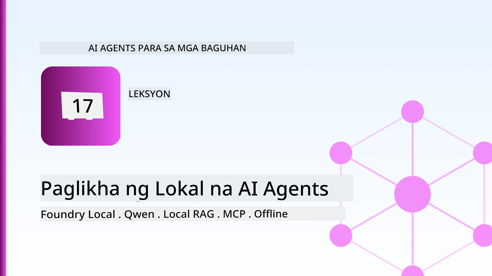
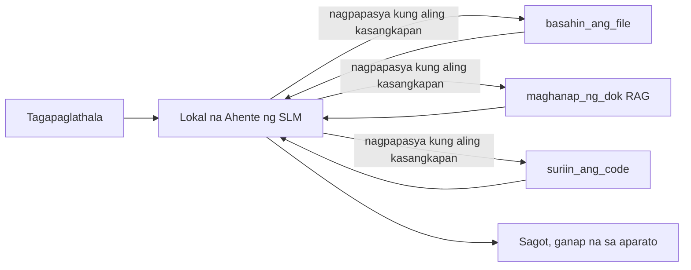
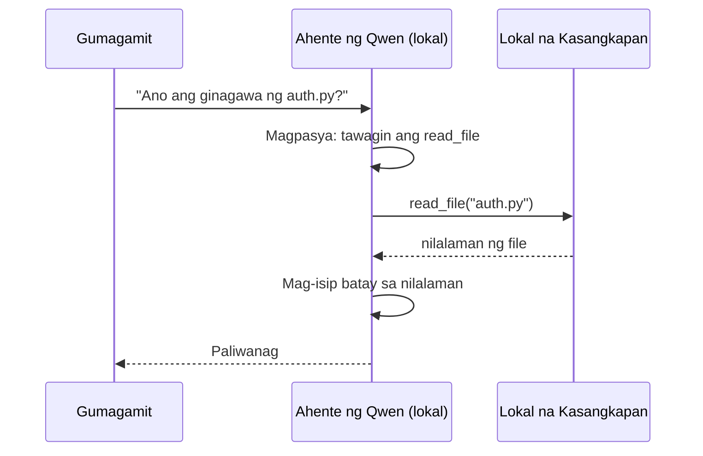
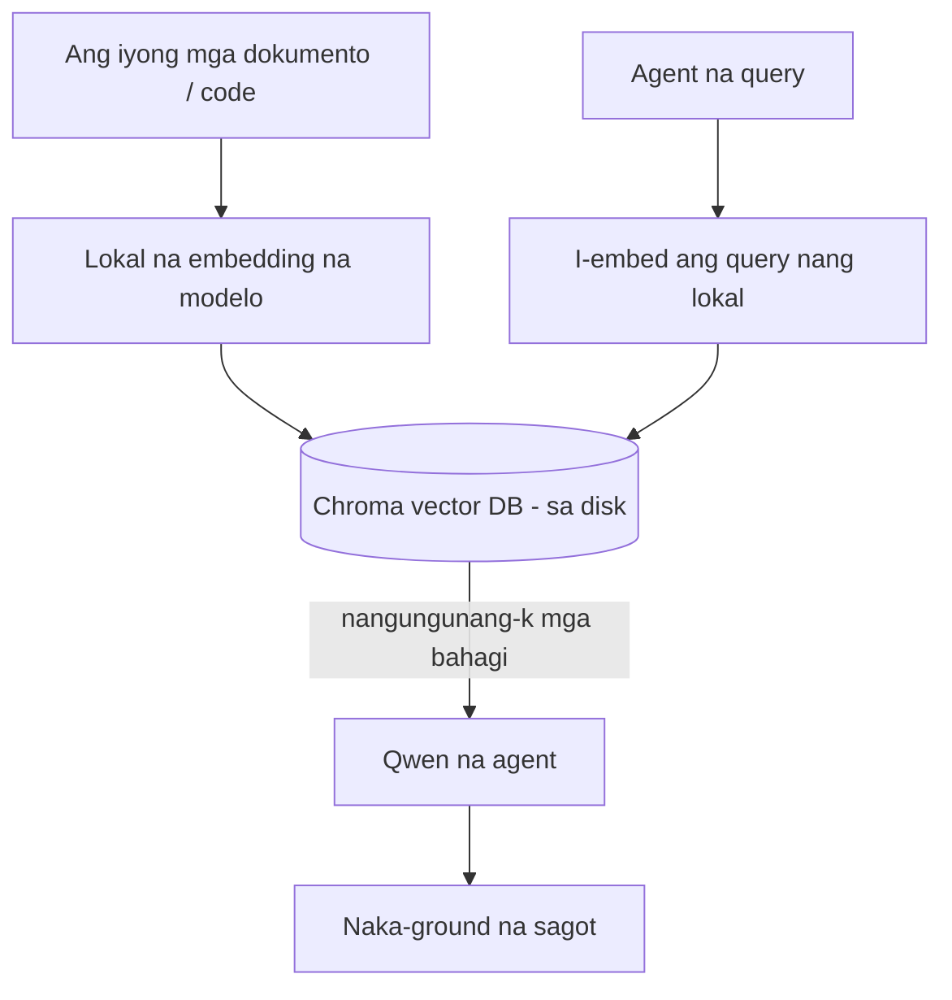
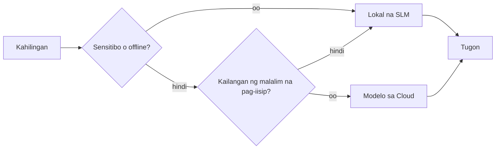

# Paggawa ng Mga Lokal na AI Agent Gamit ang Microsoft Foundry Local at Qwen



Ang nakaraang aralin ay nag-scale ng mga agent *pataas* sa cloud. Ang araling ito ay nagdadala sa kanila *pababa* sa isang solong makina. Sa katapusan, magkakaroon ka ng gumaganang engineering assistant na nakapag-iisip, tumatawag ng mga tool, nagbabasa ng iyong mga file, at naghahanap sa iyong dokumentasyon — **nang walang kahit isang tawag sa cloud inference.**

Bakit mo ito gugustuhing gawin? Tatlong dahilan na palaging lumilitaw sa totoong gawaing engineering:

- **Privacy.** Hindi kailanman umaalis sa makina ang code at mga dokumento. Walang prompt, walang snippet, walang data ng customer na tumatawid sa hangganan ng network.
- **Gastos.** Walang bayad-puna para sa lokal na inference. Maaari kang mag-iterate buong araw sa halagang koryente lamang.
- **Offline.** Sa eroplano, sa isang seguradong pasilidad, o sa panahon ng outage, gumagana pa rin ang agent.

Ang kapalit ay nagte-trade ka ng frontier cloud model para sa isang **Small Language Model (SLM)** na tumatakbo sa iyong CPU, GPU, o NPU. Ang araling ito ay tungkol sa pagbuo ng mga agent na *mabisa* sa loob ng limitasyong iyon kaysa magkunwari na wala itong limitasyon.

## Panimula

Tatalakayin sa araling ito:

- **Small Language Models (SLMs)** — ano ang mga ito, saan sila mahusay, at saan hindi.
- **Microsoft Foundry Local** — isang runtime na nagda-download at nagseserbisyo ng mga modelo nang lokal sa device gamit ang isang **OpenAI-compatible API**.
- **Qwen function-calling models** — mga SLM na maaasahang gumagawa ng mga tawag sa tool, na siyang dahilan kung bakit posible ang mga lokal na *agent* (hindi lamang lokal na chat).
- **Mga lokal na tool, lokal na RAG, at lokal na MCP** — na nagbibigay sa agent ng kapabilidad nang walang cloud.
- **Hybrid na mga pattern** — kailan panatilihin ang mga bagay na lokal at kailan kumonekta sa cloud.

## Mga Layunin sa Pagkatuto

Pagkatapos matapos ang araling ito, malalaman mo kung paano:

- Ipaliwanag ang mga trade-off ng SLMs at pumili ng mga angkop na lokal na kaso ng paggamit para sa agent.
- Maglingkod ng Qwen model nang lokal gamit ang Foundry Local at kumonekta dito sa pamamagitan ng OpenAI-compatible endpoint.
- Bumuo ng isang tool-calling agent na tumatakbo nang buo sa iyong workstation.
- Magdagdag ng lokal na RAG sa iyong sariling mga dokumento gamit ang lokal na vector database (Chroma).
- Ikonekta ang agent sa isang lokal na MCP server at mag-isip tungkol sa mga hybrid na disenyo na lokal/cloud.

## Mga Kailangang Kaalaman

Inaasahan ng araling ito na natapos mo na ang mga naunang aralin at komportable ka sa:

- [Tool Use](../04-tool-use/README.md) (Aralin 4) at [Agentic RAG](../05-agentic-rag/README.md) (Aralin 5).
- [Agentic Protocols / MCP](../11-agentic-protocols/README.md) (Aralin 11).
- Ang [Microsoft Agent Framework](../14-microsoft-agent-framework/README.md) (Aralin 14).

Kailangan mo rin:

- Isang developer workstation. **8 GB RAM ay isang makatotohanang minimum**; 16 GB+ ay komportable. Nakakatulong ang GPU o NPU pero hindi kailangang-kailangan.
- **Microsoft Foundry Local** na naka-install (tingnan ang seksyon ng setup sa ibaba).
- Python 3.12+ at ang mga pakete sa repository [`requirements.txt`](../../../requirements.txt), pati na ang `foundry-local-sdk`, `openai`, at `chromadb` para sa araling ito.

## Small Language Models: Ang Tamang Tool para sa Lokal na Trabaho

Ang frontier cloud model ay may daan-daang bilyong parameters at sinusuportahan ng isang data centre. Ang SLM ay may ilang bilyong parameters at kailangang magkasya sa RAM ng iyong laptop. Ang pagkakaibang iyon ang nagtatakda ng malinaw na mga inaasahan.

**Mahusay ang SLMs sa:**

- Mga istrukturadong, may hangganang gawain — klasipikasyon, pagkuha, pagbubuod ng isang kilalang dokumento.
- **Pagtawag ng tool** — pagpapasya kung aling function ang tatawagin at anong mga argumento ang gagamitin.
- Mabilis, mura, at pribadong iteration gamit ang iyong sariling data.

**Mahina ang SLMs sa:**

- Bukas na uri ng reasoning na multi-hop sa malaking konteksto.
- Malawak na kaalaman sa mundo (mas kaunti ang nakikita nila, mas madali silang nakakalimot).

Kaya ang winning strategy para sa mga lokal na agent ay: **hayaan ang SLM na mag-orchestrate, at hayaang ang mga tool ang gumawa ng mabibigat na gawain.** Hindi kailangang *alamin* ng model ang iyong codebase — kailangan lang nitong malaman kung kailan tatawagin ang `read_file` at `search_docs`. Ito ay direktang tumutugma sa mga lakas ng SLM.



## Microsoft Foundry Local

**Microsoft Foundry Local** ay isang magaan na runtime na nagda-download, nagma-manage, at nagseserbisyo ng mga modelo nang lubusan sa iyong makina. Ang pinakamahalagang katangian nito para sa atin ay naglalantad ito ng isang **OpenAI-compatible HTTP endpoint** — ibig sabihin, ang OpenAI SDK at ang Microsoft Agent Framework's OpenAI client ay gumagana laban dito sa pamamagitan lamang ng pagbabago ng `base_url`. Lahat ng natutunan mo tungkol sa paggawa ng mga agent ay direktang maililipat; ang endpoint lang ang lumilipat mula sa cloud papuntang `localhost`.

Pinipili rin ng Foundry Local ang pinakamainam na build ng isang model para sa iyong hardware nang awtomatiko — isang CPU build, CUDA/GPU build, o NPU build — kaya hindi mo na kailangang mano-manong i-optimize bawat makina.

### Setup

I-install ang Foundry Local (tingnan ang [dokumentasyon](https://learn.microsoft.com/azure/ai-foundry/foundry-local/) para sa iyong OS), pagkatapos kumpirmahin na ito ay gumagana:

```bash
# I-install (halimbawa; sundin ang mga dokumento para sa iyong plataporma)
winget install Microsoft.FoundryLocal      # Windows
# brew install microsoft/foundrylocal/foundrylocal   # macOS

# I-download at patakbuhin ang isang Qwen na modelo, pagkatapos simulan ang lokal na serbisyo
foundry model run qwen2.5-7b-instruct
foundry service status
```

Kapag tumatakbo na ang serbisyo, mayroon ka nang lokal na OpenAI-compatible endpoint (karaniwang `http://localhost:PORT/v1`). Ginagamit ng notebook ang `foundry-local-sdk` para awtomatikong mahanap ang endpoint, kaya hindi mo na kailangang i-hardcode ang port.

## Qwen Function Calling: Bakit Ito Mahalaga

Ang isang agent ay isang agent lamang kung kaya nitong tumawag ng mga tool. Maraming SLM ang maaaring makipag-chat pero naglalabas ng hindi maaasahan o maling porma ng mga tawag sa tool. Ang mga **Qwen** model ay sinanay para sa function calling at palaging naglalabas ng maayos na mga istruktura ng tawag sa tool — na siyang siyang nagbabago ng lokal na chat model para maging isang lokal na *agent*.

Ang proseso ay ang karaniwang tool-calling loop na kilala mo na, ngunit tumatakbo ito sa device:



## Lokal na RAG

Ang paghahanap sa dokumentasyon ang pinanggagalingan ng halaga ng mga lokal na agent. Sa halip na umasa na na-memorize ng SLM ang dokumentasyon ng iyong framework, inilalagay mo ang mga dokumentong iyon sa isang **lokal na vector database** at hinahayaan ang agent na kunin ang mga kaukulang bahagi kapag kailangan.

Ginagamit natin ang **Chroma**, isang embedded vector store na tumatakbo kasabay ng proseso nang walang kailangang server. Ang pipeline ay ganap na lokal: lokal na embedding model → lokal na vectors → lokal na retrieval → lokal na SLM.



Ito ay parehas na Agentic RAG pattern mula sa Aralin 5 — ang nag-iisang pagbabago ay bawat bahagi ay tumatakbo sa iyong makina.

## Lokal na MCP Servers

Ang [MCP](../11-agentic-protocols/README.md) ay isang transport, hindi isang cloud service. Maaaring tumakbo ang isang MCP server bilang lokal na proseso sa `stdio`, na nagpapakita ng mga tool sa iyong agent gamit ang standard na protocol. Pinapahintulutan ka nitong gamitin muli ang lumalaking ecosystem ng mga MCP server — access sa filesystem, mga operasyon sa git, mga query sa database — ganap na offline.

Iba ang security posture kaysa sa cloud, ngunit hindi ito nawawala: ang isang lokal na MCP server ay tumatakbo pa rin gamit ang mga permiso ng iyong user, kaya i-scope kung ano ang maaari nitong abutin (isang project directory lang, hindi ang buong home folder mo) at ituring ang mga output nito bilang mga input na kailangang i-validate.

## Mga Hybrid na Pattern sa Cloud at Lokal

Ang lokal muna ay hindi nangangahulugang lokal lang. Ang mga mature na sistema ay nagruruta base sa sensitivity at kahirapan:

| Sitwasyon | Kung saan ito tumatakbo |
| --- | --- |
| Sensitibong code / data, o offline | **Lokal na SLM** |
| Simpleng natuukoy na gawain | **Lokal na SLM** (murang, mabilis) |
| Mahirap na multi-hop na reasoning sa hindi sensitibong data | **Cloud model** |
| Lahat, sa panahon ng outage | **Lokal na SLM** (magandang pagbaba ng kalidad) |

Nilalarawan nito ang ideya ng **model routing** mula sa Aralin 16 — maliban na ngayon ang isa sa mga "modelo" ay ang sarili mong makina. Ang matibay na disenyo ay bumabalik sa lokal kapag hindi magagamit ang cloud, kaya ang agent ay bumababa ang kalidad sa halip na biglang mag-fail.



## Hands-On Lab: Isang Lokal na Engineering Assistant

Buksan ang [`code_samples/17-local-agent-foundry-local.ipynb`](./code_samples/17-local-agent-foundry-local.ipynb) at gawin ito. Magbuo ka ng isang **lokal na engineering assistant** na tumatakbo nang buo sa iyong workstation at kaya:

1. **Tumawag ng mga tool** — sa pamamagitan ng Qwen function calling gamit ang Foundry Local.
2. **Gumawa ng lokal na operasyon sa file** — ilista at basahin ang mga file sa isang project directory.
3. **Suriin ang code** — mag-ulat ng mga pangunahing metric sa isang source file.
4. **Maghanap ng dokumentasyon** — lokal na RAG sa folder ng docs gamit ang Chroma.
5. **Gumamit ng MCP** — kumonekta sa isang lokal na MCP server (na may magandang hindi paglabag kung wala man itong naka-configure).

Walang ginamit na cloud inference anumang oras.

### Gabay sa Paggawa

Kumokonekta ang assistant sa Foundry Local sa pamamagitan ng OpenAI-compatible endpoint, kaya halos pareho lang ang code ng agent sa mga aralin sa cloud — pagbabago lang ang client:

```python
from foundry_local import FoundryLocalManager
from openai import OpenAI

# Natagpuan/ng Download ng Foundry Local ang modelo at nagbibigay sa atin ng lokal na endpoint.
manager = FoundryLocalManager(\"qwen2.5-7b-instruct\")
client = OpenAI(base_url=manager.endpoint, api_key=manager.api_key)  # Ang api_key ay isang lokal na placeholder
```

Ang mga tool ay mga ordinaryong Python function na naka-scope sa isang project directory:

```python
def read_file(path: str) -> str:
    \"\"\"Read a file, but only inside the sandboxed project directory.\"\"\"
    full = (PROJECT_ROOT / path).resolve()
    if PROJECT_ROOT not in full.parents and full != PROJECT_ROOT:
        return \"Access denied: path is outside the project directory.\"
    return full.read_text(encoding=\"utf-8\")
```

Pansinin ang sandbox check — kahit lokal, ang tool na nagbabasa ng anumang path ay pabigat. Pinananatili ng notebook na bawat tool ay naka-scope sa isang project root lamang.

## Pagsusulit sa Kaalaman

Subukin ang iyong pang-unawa bago lumipat sa asignatura.

**1. Magbigay ng dalawang konkretong dahilan kung bakit mas maganda na patakbuhin ang agent nang lokal kaysa sa cloud.**

<details>
<summary>Sagot</summary>

Anumang dalawa sa: **privacy** (hindi kailanman umaalis sa makina ang code at data), **gastos** (walang bayad per-token na inference), at **offline capability** (gumagana kahit walang network — sa eroplano, sa isang seguradong pasilidad, o sa panahon ng outage). Ang mga regulasyon o pagsunod na nagbabawal magpadala ng data mula sa device ay karaniwang nagtutulak ng privacy na dahilan.
</details>

**2. Ano ang inirerekomendang hatian ng gawain sa pagitan ng SLM at ng mga tool nito sa isang lokal na agent, at bakit?**

<details>
<summary>Sagot</summary>

Hayaan ang SLM na **mag-orchestrate** (magpasya kung anong tool ang tatawagin at anong mga argumento ang gagamitin) at hayaang **gawin ng mga tool ang mabibigat na gawain** (pagbasa ng mga file, pagkuha ng mga docs, pagku-compute ng mga resulta). Malakas ang SLM sa mga natukoy na desisyon tulad ng pagpili ng tool ngunit mahina sa malawak na kaalaman at mahaba-habang multi-hop na reasoning, kaya nakikinabang sa paggamit sa mga tool.
</details>

**3. Ano ang nagpapahintulot na magamit muli ang cloud agent code sa Foundry Local?**

<details>
<summary>Sagot</summary>

Naglalantad ang Foundry Local ng isang **OpenAI-compatible HTTP endpoint**. Gumagana ang OpenAI SDK at ang Agent Framework's OpenAI client dito sa pamamagitan lamang ng pagbabago ng `base_url` (at paggamit ng lokal na placeholder na API key). Nanatiling pareho ang lahat ng iba pa tungkol sa code ng agent.
</details>

**4. Bakit partikular na gumagamit tayo ng Qwen function-calling model sa halip na anumang SLM?**

<details>
<summary>Sagot</summary>

Dahil ang isang agent ay kailangang makagawa ng maaasahan at maayos na **tawag sa tool**. Maraming SLM ang makakapag-chat pero naglalabas ng maling o hindi pare-parehong istruktura ng tawag sa tool. Ang mga Qwen model ay sinanay para sa function calling at laging naglalabas ng consistent na tawag sa tool, na siyang nagbabago ng lokal na chat model para maging gumaganang lokal na agent.
</details>

**5. Sa lokal na RAG pipeline, aling mga bahagi ang tumatakbo sa makina?**

<details>
<summary>Sagot</summary>

Lahat: ang embedding model, ang vector database (Chroma, sa disk), ang retrieval step, at ang SLM. Ang mga dokumento ay local na naka-embed, lokal na naka-imbak, lokal na kinukuha, at pinapakahulugan ng lokal na modelo — walang bahagi na kumokonekta sa cloud.
</details>

**6. Ang isang lokal na MCP server ay tumatakbo sa iyong makina. Ginagawa ba nitong awtomatikong ligtas ito? Ano ang dapat pa ring maging pag-iingat?**

<details>
<summary>Sagot</summary>

Hindi. Ang isang lokal na MCP server ay tumatakbo gamit ang mga permiso ng iyong user, kaya maaaring ma-access nito ang anumang kaya mo. I-scope ito sa kailangan nito (halimbawa, isang project directory lang at hindi ang buong home folder) at ituring ang mga output nito bilang mga input na kailangang i-validate bago kumilos.
</details>

**7. Ilahad ang isang makatwirang hybrid na patakaran sa routing na kasama ang lokal na modelo.**

<details>
<summary>Sagot</summary>

I-route ang mga sensitibo o offline na kahilingan sa lokal na SLM; i-route ang mga simpleng terminadong gawain sa lokal na SLM para sa bilis at gastusin; i-route ang mahirap na multi-hop na reasoning sa hindi sensitibong data sa cloud model; at bumalik sa lokal na SLM kapag hindi magagamit ang cloud upang ang agent ay unti-unting bumaba ang kalidad sa halip na biglang mag-fail. Ito ay model routing (Aralin 16) na may lokal na makina bilang isa sa mga modelo.
</details>

**8. Ano ang makatotohanang minimum na halaga ng RAM para patakbuhin ang lokal na agent sa araling ito, at ano ang naibibigay ng mas maraming RAM?**

<details>
<summary>Sagot</summary>

Mga **8 GB** ang makatotohanang minimum; 16 GB+ ay komportable. Mas maraming RAM ang nagbibigay-daan na patakbuhin ang mas malalaking, mas capable na mga modelo at mapanatili ang mas maraming konteksto sa memorya. Ang GPU o NPU ay nagpapabilis ng inference pero hindi kailangan — pinipili ng Foundry Local ang CPU build kapag walang available na accelerator.
</details>

## Asaynment

Palawakin ang lokal na engineering assistant upang maging isang **lokal na documentation reviewer** para sa maliit na proyekto ng iyong pagpili (pwedeng gamitin ang isa sa mga lesson folder ng repo na ito).

Ang iyong isusumite ay dapat:

1. **I-index ang totoong docs/code folder** sa Chroma (hindi bababa sa limang file).
2. **Magdagdag ng `find_todos` na tool** na sinusuri ang proyekto para sa mga `TODO`/`FIXME` na mga komento at ibinabalik ang mga ito kasama ang file at numero ng linya — na pinapanatili ang parehong sandbox check tulad ng `read_file`.

3. **Magtanong sa agent ng tatlong tanong** na magpipilit dito na pagsamahin ang mga tool: isang purong tanong sa RAG, isang humihingi ng pagbabasa ng isang tiyak na file, at isang humihingi ng paghahanap ng mga TODO.
4. **Sukatin ito**: sukatin ang oras ng bawat isa sa tatlong sagot at itala ang mga ito sa isang markdown cell. Magkomento kung ang latency ay katanggap-tanggap para sa iyong ninanais na workflow.

Pagkatapos ay sumulat ng isang maikling talata tungkol sa **ano ang ilalagay mo sa cloud at ano ang panatilihin mo lokal** para sa reviewer na ito, at bakit. Ikaw ay sinusuri kung ang mga lokal na bahagi ay maayos na nakakabit at kung ang iyong hybrid na pangangatwiran ay matibay — hindi sa kalidad ng modelo.

## Buod

Sa araling ito gumawa ka ng isang agent na patakbo nang buong-buo sa iyong sariling makina:

- **SLMs** nagpapalitan ng lawak para sa privacy, gastos, at offline na operasyon — at nangingibabaw kapag sila ay **nag-o-orchestrate ng mga tool** sa halip na dalhin ang lahat ng kaalaman mismo.
- **Foundry Local** ay naghahatid ng mga modelo sa device sa likod ng isang **OpenAI-compatible endpoint**, kaya ang iyong cloud agent na code ay naililipat sa isang linya lang ng pagbabago.
- **Qwen function-calling models** ay gumagawa ng maaasahang lokal na pagtawag sa tool — at kaya mga lokal na *agents* — posible.
- **Local RAG** (Chroma) at **local MCP** ay nagbibigay ng kakayahan sa agent nang hindi umaalis sa makina.
- **Hybrid patterns** ay nagpapahintulot sa iyo na mag-route ayon sa sensitibidad at kahirapan, na may lokal bilang maayos na fallback.

Tinapos nito ang deployment arc: Sa Lesson 16 pinalaki ang mga agent sa Microsoft Foundry, at sa araling ito pinaliit sila sa isang workstation lang. Ang susunod na aralin ay tungkol sa pagpapanatiling secure ng mga deplayadong agent.

## Karagdagang Mga Mapagkukunan

- <a href="https://learn.microsoft.com/azure/ai-foundry/foundry-local/" target="_blank">Microsoft Foundry Local documentation</a>
- <a href="https://learn.microsoft.com/azure/ai-foundry/what-is-azure-ai-foundry" target="_blank">Microsoft Foundry documentation</a>
- <a href="https://aka.ms/ai-agents-beginners/agent-framework" target="_blank">Microsoft Agent Framework</a>
- <a href="https://qwen.readthedocs.io/en/latest/framework/function_call.html" target="_blank">Qwen function calling documentation</a>
- <a href="https://modelcontextprotocol.io/" target="_blank">Model Context Protocol (MCP)</a>
- <a href="https://docs.trychroma.com/" target="_blank">Chroma vector database</a>

## Nakaraang Aralin

[Deploying Scalable Agents](../16-deploying-scalable-agents/README.md)

## Susunod na Aralin

[Securing AI Agents](../18-securing-ai-agents/README.md)

---

<!-- CO-OP TRANSLATOR DISCLAIMER START -->
**Pagtatanggi**:
Ang dokumentong ito ay isinalin gamit ang serbisyo ng AI translation na [Co-op Translator](https://github.com/Azure/co-op-translator). Bagama't nagsusumikap kami para sa katumpakan, pakatandaan na ang awtomatikong pagsasalin ay maaaring maglaman ng mga pagkakamali o hindi pagkakatugma. Ang orihinal na dokumento sa orihinal nitong wika ang dapat ituring na pangunahing sanggunian. Para sa mahahalagang impormasyon, inirerekomenda ang propesyonal na pagsasalin ng tao. Hindi kami mananagot sa anumang maling pagkakaintindi o maling interpretasyon na nagmula sa paggamit ng pagsasaling ito.
<!-- CO-OP TRANSLATOR DISCLAIMER END -->