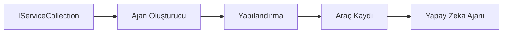

# 🎨 Azure OpenAI (Responses API) ile Agentik Tasarım Desenleri (.NET)

## 📋 Öğrenme Hedefleri

Bu örnek, Azure OpenAI (Responses API) entegrasyonuyla .NET'te Microsoft Agent Framework kullanarak akıllı ajanlar oluşturmak için kurumsal düzeyde tasarım desenlerini göstermektedir. Ajanları üretime hazır, sürdürülebilir ve ölçeklenebilir hale getiren profesyonel desenleri ve mimari yaklaşımları öğreneceksiniz.

### Kurumsal Tasarım Desenleri

- 🏭 **Fabrika Deseni**: Bağımlılık enjeksiyonu ile standart ajan oluşturma
- 🔧 **Yapıcı Deseni**: Akıcı ajan yapılandırması ve ayarı
- 🧵 **İş Parçacığı Güvenli Desenler**: Eşzamanlı konuşma yönetimi
- 📋 **Depo Deseni**: Düzenli araç ve yetenek yönetimi

## 🎯 .NET'e Özgü Mimari Avantajlar

### Kurumsal Özellikler

- **Güçlü Tip Desteği**: Derleme zamanı doğrulama ve IntelliSense desteği
- **Bağımlılık Enjeksiyonu**: Yerleşik DI konteyner entegrasyonu
- **Yapılandırma Yönetimi**: IConfiguration ve Options desenleri
- **Async/Await**: Birinci sınıf asenkron programlama desteği

### Üretime Hazır Desenler

- **Kayıt Entegrasyonu**: ILogger ve yapılandırılmış kayıt desteği
- **Sağlık Kontrolleri**: Yerleşik izleme ve teşhis
- **Yapılandırma Doğrulama**: Veri açıklamaları ile güçlü tip desteği
- **Hata Yönetimi**: Yapılandırılmış istisna yönetimi

## 🔧 Teknik Mimari

### Temel .NET Bileşenleri

- **Microsoft.Extensions.AI**: Birleşik AI servis soyutlamaları
- **Microsoft.Agents.AI**: Kurumsal ajan orkestrasyon çerçevesi
- **Azure OpenAI (Responses API)**: Yüksek performanslı API istemcisi desenleri
- **Yapılandırma Sistemi**: appsettings.json ve ortam entegrasyonu

### Tasarım Deseni Uygulaması



## 🏗️ Gösterilen Kurumsal Desenler

### 1. **Oluşturucu Desenler**

- **Ajan Fabrikası**: Tutarlı yapılandırmayla merkezi ajan oluşturma
- **Yapıcı Deseni**: Karmaşık ajan yapılandırması için akıcı API
- **Singleton Deseni**: Paylaşılan kaynaklar ve yapılandırma yönetimi
- **Bağımlılık Enjeksiyonu**: Gevşek bağlılık ve test edilebilirlik

### 2. **Davranışsal Desenler**

- **Strateji Deseni**: Değiştirilebilir araç yürütme stratejileri
- **Komut Deseni**: Geri al/ileri al destekli kapsüllenmiş ajan işlemleri
- **Gözlemci Deseni**: Olay odaklı ajan yaşam döngüsü yönetimi
- **Şablon Yöntemi**: Standart ajan yürütme iş akışları

### 3. **Yapısal Desenler**

- **Adaptör Deseni**: Azure OpenAI (Responses API) entegrasyon katmanı
- **Dekoratör Deseni**: Ajan yetenek geliştirme
- **Cephe Deseni**: Basitleştirilmiş ajan etkileşim arayüzleri
- **Vekil Deseni**: Performans için tembel yükleme ve önbellekleme

## 📚 .NET Tasarım İlkeleri

### SOLID İlkeleri

- **Tek Sorumluluk**: Her bileşenin net bir amacı vardır
- **Açık/Kapalı**: Değişiklik yapmadan genişletilebilir
- **Liskov İkamesi**: Arayüz tabanlı araç uygulamaları
- **Arayüz Ayrımı**: Odaklı, tutarlı arayüzler
- **Bağımlılık Tersine Çevirme**: Somut değil soyutlamalara bağımlılık

### Temiz Mimari

- **Alan Katmanı**: Temel ajan ve araç soyutlamaları
- **Uygulama Katmanı**: Ajan orkestrasyonu ve iş akışları
- **Altyapı Katmanı**: Azure OpenAI (Responses API) entegrasyonu ve dış servisler
- **Sunum Katmanı**: Kullanıcı etkileşimi ve yanıt biçimlendirme

## 🔒 Kurumsal Hususlar

### Güvenlik

- **Kimlik Bilgisi Yönetimi**: IConfiguration ile güvenli API anahtarı yönetimi
- **Girdi Doğrulama**: Güçlü tip ve veri açıklaması doğrulaması
- **Çıktı Temizleme**: Güvenli yanıt işleme ve filtreleme
- **Denetim Kaydı**: Kapsamlı işlem takibi

### Performans

- **Asenkron Desenler**: Engellemeyen G/Ç işlemleri
- **Bağlantı Havuzu**: Verimli HTTP istemci yönetimi
- **Önbellekleme**: Performansı artırmak için yanıt önbellekleme
- **Kaynak Yönetimi**: Doğru imha ve temizleme desenleri

### Ölçeklenebilirlik

- **İş Parçacığı Güvenliği**: Eşzamanlı ajan yürütme desteği
- **Kaynak Havuzlama**: Verimli kaynak kullanımı
- **Yük Yönetimi**: Oran sınırlama ve geri basınç yönetimi
- **İzleme**: Performans metrikleri ve sağlık kontrolleri

## 🚀 Üretim Dağıtımı

- **Yapılandırma Yönetimi**: Ortam özel ayarları
- **Kayıt Stratejisi**: Korelasyon kimlikleri ile yapılandırılmış kayıt
- **Hata Yönetimi**: Küresel istisna yönetimi ve uygun kurtarma
- **İzleme**: Uygulama içgörüleri ve performans sayacı
- **Test**: Birim testleri, entegrasyon testleri ve yük test desenleri

.NET ile kurumsal düzeyde akıllı ajanlar oluşturmaya hazır mısınız? Hadi sağlam bir mimari kuralım! 🏢✨

## 🚀 Başlarken

### Ön Koşullar

- [.NET 10 SDK](https://dotnet.microsoft.com/download/dotnet/10.0) veya üstü
- Azure OpenAI kaynağı ve model dağıtımı olan bir [Azure aboneliği](https://azure.microsoft.com/free/)
- [Azure CLI](https://learn.microsoft.com/cli/azure/install-azure-cli) — `az login` ile giriş yapın

### Gerekli Ortam Değişkenleri

```bash
# zsh/bash
export AZURE_OPENAI_ENDPOINT=https://<your-resource>.openai.azure.com
export AZURE_OPENAI_DEPLOYMENT=gpt-4.1-mini
# AzureCliCredential bir token alabilmesi için ardından giriş yapın
az login
```

```powershell
# PowerShell
$env:AZURE_OPENAI_ENDPOINT = "https://<your-resource>.openai.azure.com"
$env:AZURE_OPENAI_DEPLOYMENT = "gpt-4.1-mini"
# Ardından AzureCliCredential bir token alabilmesi için giriş yapın
az login
```

### Örnek Kod

Kod örneğini çalıştırmak için,

```bash
# zsh/bash
chmod +x ./03-dotnet-agent-framework.cs
./03-dotnet-agent-framework.cs
```

Ya da dotnet CLI kullanarak:

```bash
dotnet run ./03-dotnet-agent-framework.cs
```

Tam kod için [`03-dotnet-agent-framework.cs`](../../../../03-agentic-design-patterns/code_samples/03-dotnet-agent-framework.cs) dosyasına bakın.

```csharp
#!/usr/bin/dotnet run

#:package Microsoft.Extensions.AI@10.*
#:package Microsoft.Agents.AI.OpenAI@1.*-*
#:package Azure.AI.OpenAI@2.1.0
#:package Azure.Identity@1.13.1

using System.ComponentModel;

using Microsoft.Agents.AI;
using Microsoft.Extensions.AI;

using Azure.AI.OpenAI;
using Azure.Identity;

// Tool Function: Random Destination Generator
// This static method will be available to the agent as a callable tool
// The [Description] attribute helps the AI understand when to use this function
// This demonstrates how to create custom tools for AI agents
[Description("Provides a random vacation destination.")]
static string GetRandomDestination()
{
    // List of popular vacation destinations around the world
    // The agent will randomly select from these options
    var destinations = new List<string>
    {
        "Paris, France",
        "Tokyo, Japan",
        "New York City, USA",
        "Sydney, Australia",
        "Rome, Italy",
        "Barcelona, Spain",
        "Cape Town, South Africa",
        "Rio de Janeiro, Brazil",
        "Bangkok, Thailand",
        "Vancouver, Canada"
    };

    // Generate random index and return selected destination
    // Uses System.Random for simple random selection
    var random = new Random();
    int index = random.Next(destinations.Count);
    return destinations[index];
}

// Azure OpenAI with the Responses API (stable v1 endpoint). Sign in with `az login`.
var azureEndpoint = Environment.GetEnvironmentVariable("AZURE_OPENAI_ENDPOINT")
    ?? throw new InvalidOperationException("AZURE_OPENAI_ENDPOINT is not set.");
var deployment = Environment.GetEnvironmentVariable("AZURE_OPENAI_DEPLOYMENT") ?? "gpt-4.1-mini";

var azureClient = new AzureOpenAIClient(new Uri(azureEndpoint), new AzureCliCredential());

// Define Agent Identity and Comprehensive Instructions
// Agent name for identification and logging purposes
var AGENT_NAME = "TravelAgent";

// Detailed instructions that define the agent's personality, capabilities, and behavior
// This system prompt shapes how the agent responds and interacts with users
var AGENT_INSTRUCTIONS = """
You are a helpful AI Agent that can help plan vacations for customers.

Important: When users specify a destination, always plan for that location. Only suggest random destinations when the user hasn't specified a preference.

When the conversation begins, introduce yourself with this message:
"Hello! I'm your TravelAgent assistant. I can help plan vacations and suggest interesting destinations for you. Here are some things you can ask me:
1. Plan a day trip to a specific location
2. Suggest a random vacation destination
3. Find destinations with specific features (beaches, mountains, historical sites, etc.)
4. Plan an alternative trip if you don't like my first suggestion

What kind of trip would you like me to help you plan today?"

Always prioritize user preferences. If they mention a specific destination like "Bali" or "Paris," focus your planning on that location rather than suggesting alternatives.
""";

// Create AI Agent with Advanced Travel Planning Capabilities
// Get the Responses client for the deployment and create the AI agent
// Configure agent with name, detailed instructions, and available tools
// This demonstrates the .NET agent creation pattern with full configuration
AIAgent agent = azureClient
    .GetChatClient(deployment)
    .AsAIAgent(
        name: AGENT_NAME,
        instructions: AGENT_INSTRUCTIONS,
        tools: [AIFunctionFactory.Create(GetRandomDestination)]
    );

// Create New Conversation Session for Context Management
// Initialize a new conversation session to maintain context across multiple interactions
// Sessions enable the agent to remember previous exchanges and maintain conversational state
// This is essential for multi-turn conversations and contextual understanding
var session = await agent.CreateSessionAsync();

// Execute Agent: First Travel Planning Request
// Run the agent with an initial request that will likely trigger the random destination tool
// The agent will analyze the request, use the GetRandomDestination tool, and create an itinerary
// Using the session parameter maintains conversation context for subsequent interactions
await foreach (var update in agent.RunStreamingAsync("Plan me a day trip", session))
{
    await Task.Delay(10);
    Console.Write(update);
}

Console.WriteLine();

// Execute Agent: Follow-up Request with Context Awareness
// Demonstrate contextual conversation by referencing the previous response
// The agent remembers the previous destination suggestion and will provide an alternative
// This showcases the power of conversation sessions and contextual understanding in .NET agents
await foreach (var update in agent.RunStreamingAsync("I don't like that destination. Plan me another vacation.", session))
{
    await Task.Delay(10);
    Console.Write(update);
}
```

---

<!-- CO-OP TRANSLATOR DISCLAIMER START -->
**Feragatname**:
Bu belge, AI çeviri hizmeti [Co-op Translator](https://github.com/Azure/co-op-translator) kullanılarak çevrilmiştir. Doğruluk için çaba sarf etsek de, otomatik çevirilerin hata veya yanlışlık içerebileceğini lütfen unutmayınız. Orijinal belge, kendi dilinde yetkili kaynak olarak kabul edilmelidir. Kritik bilgiler için profesyonel insan çevirisi önerilir. Bu çevirinin kullanımı sonucu ortaya çıkabilecek yanlış anlamalardan veya yanlış yorumlamalardan sorumlu değiliz.
<!-- CO-OP TRANSLATOR DISCLAIMER END -->