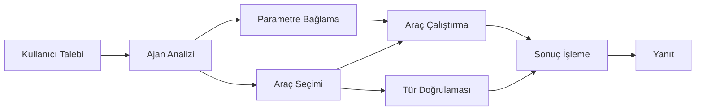

# 🛠️ Azure OpenAI ile Gelişmiş Araç Kullanımı (Yanıtlar API) (.NET)

## 📋 Öğrenme Hedefleri

Bu not defteri, .NET'te Microsoft Agent Framework kullanarak Azure OpenAI (Yanıtlar API) ile kurumsal düzeyde araç entegrasyon kalıplarını göstermektedir. C#'ın güçlü tip denetimi ve .NET'in kurumsal özelliklerinden yararlanarak birden çok uzmanlaşmış araç içeren gelişmiş ajanlar oluşturmayı öğreneceksiniz.

### Ustalaşacağınız Gelişmiş Araç Özellikleri

- 🔧 **Çoklu Araç Mimarisi**: Birden fazla uzmanlaşmış yetenekle ajanlar oluşturma
- 🎯 **Tip Güvenli Araç Çalıştırma**: C#'ın derleme zamanı doğrulamasından yararlanma
- 📊 **Kurumsal Araç Kalıpları**: Üretime hazır araç tasarımı ve hata yönetimi
- 🔗 **Araç Bileşimi**: Karmaşık iş akışları için araçların birleştirilmesi

## 🎯 .NET Araç Mimarisi Avantajları

### Kurumsal Araç Özellikleri

- **Derleme Zamanı Doğrulama**: Güçlü tip kullanımı araç parametrelerinin doğruluğunu sağlar
- **Bağımlılık Enjeksiyonu**: Araç yönetimi için IoC konteyner entegrasyonu
- **Async/Await Kalıpları**: Uygun kaynak yönetimi ile engellemeyen araç çalıştırma
- **Yapılandırılmış Günlük Kaydı**: Araç çalıştırma izleme için yerleşik günlük entegrasyonu

### Üretime Hazır Kalıplar

- **İstisna Yönetimi**: Tipli istisnalar ile kapsamlı hata yönetimi
- **Kaynak Yönetimi**: Uygun atma kalıpları ve bellek yönetimi
- **Performans İzleme**: Yerleşik metrikler ve performans sayıcıları
- **Yapılandırma Yönetimi**: Doğrulamalı tip güvenli yapılandırma

## 🔧 Teknik Mimari

### Temel .NET Araç Bileşenleri

- **Microsoft.Extensions.AI**: Birleşik araç soyutlama katmanı
- **Microsoft.Agents.AI**: Kurumsal düzeyde araç orkestrasyonu
- **Azure OpenAI (Yanıtlar API)**: Bağlantı havuzlu yüksek performanslı API istemcisi

### Araç Çalıştırma Hattı



## 🛠️ Araç Kategorileri ve Kalıpları

### 1. **Veri İşleme Araçları**

- **Girdi Doğrulama**: Veri açıklamaları ile güçlü tip kullanımı
- **Dönüşüm İşlemleri**: Tip güvenli veri dönüştürme ve biçimlendirme
- **İş Mantığı**: Alanlara özgü hesaplama ve analiz araçları
- **Çıktı Biçimlendirme**: Yapılandırılmış yanıt oluşturma

### 2. **Entegrasyon Araçları** 

- **API Bağlayıcıları**: HttpClient ile RESTful servis entegrasyonu
- **Veritabanı Araçları**: Veri erişimi için Entity Framework entegrasyonu
- **Dosya İşlemleri**: Doğrulamaya sahip güvenli dosya sistemi işlemleri
- **Dış Hizmetler**: Üçüncü taraf servis entegrasyon kalıpları

### 3. **Yardımcı Araçlar**

- **Metin İşleme**: Dize manipülasyonu ve biçimlendirme yardımcıları
- **Tarih/Saat İşlemleri**: Kültüre duyarlı tarih/saat hesaplamaları
- **Matematiksel Araçlar**: Hassas hesaplamalar ve istatistiksel işlemler
- **Doğrulama Araçları**: İş kuralı doğrulama ve veri denetimi

.NET'te güçlü, tip güvenli araç yetenekleriyle kurumsal düzey ajanlar geliştirmeye hazır mısınız? Haydi profesyonel düzey çözümler tasarlayalım! 🏢⚡

## 🚀 Başlarken

### Gereksinimler

- [.NET 10 SDK](https://dotnet.microsoft.com/download/dotnet/10.0) veya daha yüksek sürüm
- Azure OpenAI kaynağı ve model dağıtımı içeren bir [Azure aboneliği](https://azure.microsoft.com/free/)
- `az login` ile giriş yapacağınız [Azure CLI](https://learn.microsoft.com/cli/azure/install-azure-cli)

### Gerekli Ortam Değişkenleri

```bash
# zsh/bash
export AZURE_OPENAI_ENDPOINT=https://<your-resource>.openai.azure.com
export AZURE_OPENAI_DEPLOYMENT=gpt-4.1-mini
# Sonra AzureCliCredential'in bir token alabilmesi için giriş yapın
az login
```

```powershell
# PowerShell
$env:AZURE_OPENAI_ENDPOINT = "https://<your-resource>.openai.azure.com"
$env:AZURE_OPENAI_DEPLOYMENT = "gpt-4.1-mini"
# Daha sonra AzureCliCredential token alabilmesi için oturum açın
az login
```

### Örnek Kod

Kod örneğini çalıştırmak için,

```bash
# zsh/bash
chmod +x ./04-dotnet-agent-framework.cs
./04-dotnet-agent-framework.cs
```

Ya da dotnet CLI kullanarak:

```bash
dotnet run ./04-dotnet-agent-framework.cs
```

Tam kod için [`04-dotnet-agent-framework.cs`](../../../../04-tool-use/code_samples/04-dotnet-agent-framework.cs) dosyasına bakınız.

```csharp
#!/usr/bin/dotnet run

#:package Microsoft.Extensions.AI@10.*
#:package Microsoft.Agents.AI.OpenAI@1.*-*
#:package Azure.AI.OpenAI@2.1.0
#:package Azure.Identity@1.13.1

using System.ComponentModel;

using Microsoft.Agents.AI;
using Microsoft.Extensions.AI;

using Azure.AI.OpenAI;
using Azure.Identity;

// Tool Function: Random Destination Generator
// This static method will be available to the agent as a callable tool
// The [Description] attribute helps the AI understand when to use this function
// This demonstrates how to create custom tools for AI agents
[Description("Provides a random vacation destination.")]
static string GetRandomDestination()
{
    // List of popular vacation destinations around the world
    // The agent will randomly select from these options
    var destinations = new List<string>
    {
        "Paris, France",
        "Tokyo, Japan",
        "New York City, USA",
        "Sydney, Australia",
        "Rome, Italy",
        "Barcelona, Spain",
        "Cape Town, South Africa",
        "Rio de Janeiro, Brazil",
        "Bangkok, Thailand",
        "Vancouver, Canada"
    };

    // Generate random index and return selected destination
    // Uses System.Random for simple random selection
    var random = new Random();
    int index = random.Next(destinations.Count);
    return destinations[index];
}

// Azure OpenAI with the Responses API (stable v1 endpoint). Sign in with `az login`.
var azureEndpoint = Environment.GetEnvironmentVariable("AZURE_OPENAI_ENDPOINT")
    ?? throw new InvalidOperationException("AZURE_OPENAI_ENDPOINT is not set.");
var deployment = Environment.GetEnvironmentVariable("AZURE_OPENAI_DEPLOYMENT") ?? "gpt-4.1-mini";

var azureClient = new AzureOpenAIClient(new Uri(azureEndpoint), new AzureCliCredential());

// Define Agent Identity and Comprehensive Instructions
// Agent name for identification and logging purposes
var AGENT_NAME = "TravelAgent";

// Detailed instructions that define the agent's personality, capabilities, and behavior
// This system prompt shapes how the agent responds and interacts with users
var AGENT_INSTRUCTIONS = """
You are a helpful AI Agent that can help plan vacations for customers.

Important: When users specify a destination, always plan for that location. Only suggest random destinations when the user hasn't specified a preference.

When the conversation begins, introduce yourself with this message:
"Hello! I'm your TravelAgent assistant. I can help plan vacations and suggest interesting destinations for you. Here are some things you can ask me:
1. Plan a day trip to a specific location
2. Suggest a random vacation destination
3. Find destinations with specific features (beaches, mountains, historical sites, etc.)
4. Plan an alternative trip if you don't like my first suggestion

What kind of trip would you like me to help you plan today?"

Always prioritize user preferences. If they mention a specific destination like "Bali" or "Paris," focus your planning on that location rather than suggesting alternatives.
""";

// Create AI Agent with Advanced Travel Planning Capabilities
// Get the Responses client for the deployment and create the AI agent
// Configure agent with name, detailed instructions, and available tools
// This demonstrates the .NET agent creation pattern with full configuration
AIAgent agent = azureClient
    .GetChatClient(deployment)
    .AsAIAgent(
        name: AGENT_NAME,
        instructions: AGENT_INSTRUCTIONS,
        tools: [AIFunctionFactory.Create(GetRandomDestination)]
    );

// Create New Conversation Session for Context Management
// Initialize a new conversation session to maintain context across multiple interactions
// Sessions enable the agent to remember previous exchanges and maintain conversational state
// This is essential for multi-turn conversations and contextual understanding
await using var session = await agent.CreateSessionAsync();

// Execute Agent: First Travel Planning Request
// Run the agent with an initial request that will likely trigger the random destination tool
// The agent will analyze the request, use the GetRandomDestination tool, and create an itinerary
// Using the session parameter maintains conversation context for subsequent interactions
await foreach (var update in agent.RunStreamingAsync("Plan me a day trip", session))
{
    await Task.Delay(10);
    Console.Write(update);
}

Console.WriteLine();

// Execute Agent: Follow-up Request with Context Awareness
// Demonstrate contextual conversation by referencing the previous response
// The agent remembers the previous destination suggestion and will provide an alternative
// This showcases the power of conversation sessions and contextual understanding in .NET agents
await foreach (var update in agent.RunStreamingAsync("I don't like that destination. Plan me another vacation.", session))
{
    await Task.Delay(10);
    Console.Write(update);
}
```

---

<!-- CO-OP TRANSLATOR DISCLAIMER START -->
**Feragatname**:
Bu belge, AI çeviri hizmeti [Co-op Translator](https://github.com/Azure/co-op-translator) kullanılarak çevrilmiştir. Doğruluk için çaba sarf etsek de, otomatik çevirilerin hata veya yanlışlık içerebileceğini lütfen unutmayınız. Orijinal belge, kendi dilinde yetkili kaynak olarak kabul edilmelidir. Kritik bilgiler için profesyonel insan çevirisi önerilir. Bu çevirinin kullanımı sonucu ortaya çıkabilecek yanlış anlamalardan veya yanlış yorumlamalardan sorumlu değiliz.
<!-- CO-OP TRANSLATOR DISCLAIMER END -->