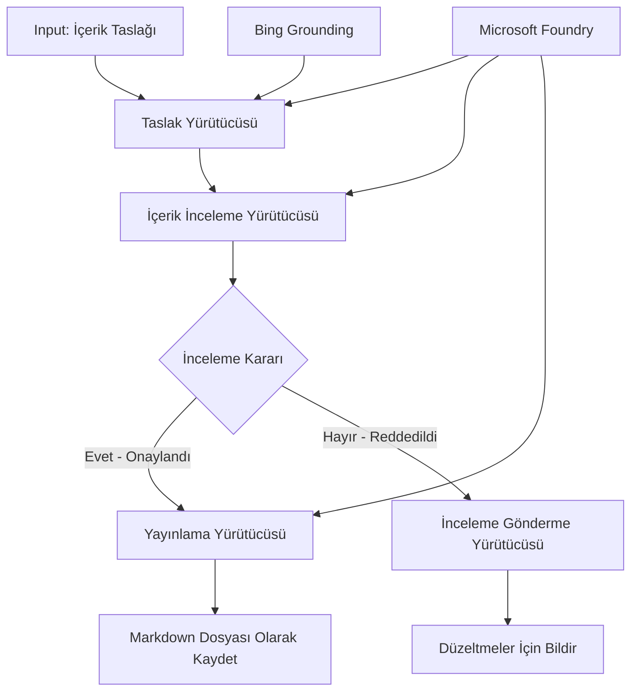

# 🔀 Microsoft Foundry (.NET) ile Koşullu Ajan İş Akışları

## 📋 Akıllı Karar Bazlı İş Akışı Eğitimi

Bu not defteri, Microsoft Foundry ve .NET için Microsoft Agent Framework kullanarak **koşullu iş akışı kalıplarını** göstermektedir. AI analizi, iş kuralları ve dinamik koşullara dayalı olarak işleme akışını akıllıca yönlendiren karmaşık, karar odaklı iş akışlarının nasıl oluşturulacağını öğreneceksiniz; bu da kurumsal düzeyde otomasyon sağlar.

## 🎯 Öğrenme Hedefleri

### 🧠 **Akıllı Karar Mimarisi**
- **Koşullu Mantık Uygulaması**: Çok dallanmalı karmaşık karar ağaçları oluşturun
- **AI Destekli Yönlendirme**: Microsoft Foundry modellerini kullanarak akıllı yönlendirme kararları alın
- **Dinamik İş Akışı Uyarlaması**: Çalışma zamanı analizi ve koşullara göre iş akışı davranışını değiştirin
- **Kurumsal Kural Entegrasyonu**: İş mantığı ve uyumluluk gereksinimlerini iş akışlarına dahil edin

### 🔀 **Gelişmiş Koşullu Kalıplar**
- **Çok Kriterli Karar Verme**: Yönlendirme kararları için birden fazla faktörü değerlendirin
- **Bağlama Duyarlı İşleme**: Biriken iş akışı bağlamı ve geçmişine göre kararlar alın
- **Uyarlanabilir İş Akışı Değişikliği**: Gerçek zamanlı koşullara dayanarak işleme yollarını dinamik olarak ayarlayın
- **Kural Motoru Entegrasyonu**: İş akışları içinde gelişmiş iş kuralı motorları uygulayın

### 🏢 **Kurumsal Koşullu Uygulamalar**
- **Belge Sınıflandırma ve Yönlendirme**: Belgeleri otomatik olarak sınıflandırıp uygun iş akışlarına yönlendirin
- **Müşteri Hizmetleri Sınıflandırması**: Müşteri taleplerini uzman ekiplerine akıllıca yönlendirin
- **Uyumluluk ve Risk İşleme**: Risk değerlendirmesine göre farklı doğrulama ve inceleme süreçlerini uygulayın
- **Kalite Güvence İş Akışları**: İçeriği kalite metriklerine göre uygun inceleme süreçlerine yönlendirin

## ⚙️ Ön Koşullar ve Kurulum

### 📦 **Gerekli NuGet Paketleri**

Koşullu iş akışı işlemleri için gelişmiş paketler:

```xml
<!-- Core AI Framework -->
<PackageReference Include="Microsoft.Extensions.AI" Version="9.9.0" />

<!-- Azure AI Agents with Persistent State -->
<PackageReference Include="Azure.AI.Agents.Persistent" Version="1.2.0-beta.5" />

<!-- Azure Identity and Utilities -->
<PackageReference Include="Azure.Identity" Version="1.15.0" />
<PackageReference Include="System.Linq.Async" Version="6.0.3" />
<PackageReference Include="DotNetEnv" Version="3.1.1" />

<!-- Local Workflow Framework References -->
<!-- Microsoft.Agents.Workflows.dll - Advanced workflow orchestration -->
<!-- Microsoft.Agents.AI.AzureAI.dll - Microsoft Foundry integration -->
<!-- Microsoft.Agents.AI.dll - Core agent abstractions -->
```

### 🔑 **Microsoft Foundry Yapılandırması**

**Gerekli Azure Kaynakları:**
- Koşullu işlem modellerine sahip Microsoft Foundry çalışma alanı
- Uygun hesaplama kotaları ve izinlere sahip Azure aboneliği
- Karar verme ve içerik analizi için dağıtılmış AI modelleri
- (İsteğe bağlı) Bing Search API bağlantısı ile kaynak sağlama

**Çevre Yapılandırması (.env dosyası):**
```env
# Microsoft Foundry Configuration
AZURE_AI_PROJECT_ENDPOINT=https://your-project.cognitiveservices.azure.com/
BING_CONNECTION_ID=your-bing-connection-id
```

**Kimlik Doğrulama Kurulumu:**
```csharp
// Azure CLI or Managed Identity authentication
using Azure.Identity;
var credential = new AzureCliCredential();

// Load environment configuration
DotNetEnv.Env.Load("../../../.env");
```

### 🏗️ **Koşullu İş Akışı Mimarisi**



**Temel Bileşenler:**
- **Taslak Yürütücü**: Ana hatlardan ilk içerik taslakları oluşturan AI ajanı
- **İçerik İnceleme Yürütücüsü**: Taslak kalitesini ve uyumluluğunu değerlendiren AI ajanı
- **Koşullu Yönlendirme**: İnceleme sonuçlarına göre yönlendirme yapan karar mantığı
- **Yayınlama/İnceleme Yolları**: Onaylanan ve reddedilen içerikler için ayrı işlem yolları
- **Durum Yönetimi**: İçerik ve inceleme bağlamını iş akışı boyunca korur

## 🎨 **Koşullu İş Akışı Tasarım Kalıpları**

### 📋 **Kalite Kontrol Noktaları ile İçerik Üretimi**
```
Outline → Draft Creation → Quality Review → {Approve: Publish | Reject: Revise}
```

### 🎯 **Risk Bazlı Belge İşleme**
```
Document → Risk Assessment → {Low: Standard | High: Enhanced Review}
```

### 🔍 **Akıllı Müşteri Hizmetleri Yönlendirmesi**
```
Customer Query → Analysis → {Simple: FAQ Bot | Complex: Human Agent}
```

### 💼 **Uyumluluk Odaklı İş Akışları**
```
Content → Compliance Check → {Pass: Publish | Fail: Legal Review}
```

## 🏢 **Kurumsal Koşullu Avantajlar**

### 🎯 **Akıllı Otomasyon**
- **Akıllı Karar Verme**: İçerik analizi ve bağlama dayalı AI destekli yönlendirme kararları
- **Uyarlanabilir İşleme**: Değişen koşullara otomatik uyum sağlayan iş akışları
- **İş Kuralı Uygulaması**: Karmaşık iş mantığı ve politikaların otomatik uygulanması
- **Bağlama Duyarlı Yönlendirme**: Tam iş akışı geçmişi ve birikmiş bağlama dayalı kararlar

### 📈 **Operasyonel Mükemmellik**
- **Optimize Edilmiş Kaynak Tahsisi**: İşleri en uygun uzmanlara ve süreçlere yönlendirme
- **Azaltılmış İnsan Müdahalesi**: Otomatik karar verme insan yönlendirmesini minimize eder
- **Daha Hızlı Çözüm Süreleri**: Uygun uzmanlığa ve işleme kapasitesine doğrudan yönlendirme
- **Tutarlı Uygulama**: İş kuralları ve karar kriterlerinin uniform uygulanması

### 🛡️ **Risk Yönetimi ve Uyumluluk**
- **Otomatik Risk Değerlendirmesi**: İçerik ve durum risk seviyelerinin AI destekli değerlendirmesi
- **Uyumluluk Uygulaması**: Gereken düzenleyici süreçlerden otomatik yönlendirme
- **Güvenlik Protokol Uygulaması**: Risk değerlendirmesine bağlı geliştirilmiş güvenlik önlemleri
- **Denetim Kaydının Korunması**: Yönlendirme kararları ve gerekçelerinin tam dokümantasyonu

### 📊 **Analitik ve Sürekli İyileştirme**
- **Karar Analitiği**: Yönlendirme kararlarının etkinlik ve doğruluğunu takip etme
- **Desen Tanıma**: Yönlendirme kararlarındaki eğilim ve kalıpları zamanla belirleme
- **Performans Optimizasyonu**: Karar kriterleri ve yönlendirme verimliliğinin sürekli iyileştirilmesi
- **İş Zekası**: İçerik özellikleri ve işlem gereksinimlerine dair içgörüler

### 🔧 **Teknik Mükemmellik**
- **Kalıcı Durum Yönetimi**: İş akışı yürütme boyunca karmaşık durumu koruma
- **Ölçeklenebilir Mimari**: Yüksek hacimli koşullu işleme gereksinimlerini karşılayabilme
- **Entegrasyon Yetkinlikleri**: Mevcut iş sistemleri ve süreçlerle sorunsuz entegrasyon
- **İzleme ve Gözlemlenebilirlik**: İş akışı performansı ve kararlarının kapsamlı takibi

.NET ile akıllı, karar odaklı kurumsal iş akışları oluşturalım! 🚀

## 💻 Kodu Çalıştırma

Tam uygulama `04.dotnet-agent-framework-workflow-aifoundry-condition.cs` içinde mevcuttur. Bu, **kalite kontrol noktalarıyla içerik üretim iş akışını** göstermektedir:

### 🏗️ **İş Akışı Mimarisi**

```
Content Outline → Draft Creation → Quality Review → Conditional Routing:
                                                      ├─ Approved (>200 words) → Publish
                                                      └─ Rejected (<200 words) → Review Notification
```

**İş Akışındaki Ajanlar:**
1. **Evangelist Ajanı**: Ana hatlardan eğitici taslaklar oluşturur, Bing kaynaklandırması ile
2. **İçerik İnceleme Ajanı**: Taslak kalitesini (kelime sayısı, tamlık) değerlendirir
3. **Yayıncı Ajan**: Onaylanan içerikleri zaman damgalı Markdown dosyaları olarak kaydeder

**Özel Yürütücüler:**
1. **DraftExecutor**: Taslak oluşturmayı koordine eder
2. **ContentReviewExecutor**: Kalite değerlendirmesi yapar
3. **PublishExecutor**: Onaylanan içeriğin yayınlanmasını yönetir
4. **SendReviewExecutor**: Reddedilen içerik bildirimlerini yönetir

### 🚀 Örneği Çalıştırma

**Ön Koşullar:**
- Microsoft Foundry çalışma alanı yapılandırılmış olmalı
- Azure CLI kimlik doğrulaması (`az login`)
- (İsteğe bağlı) Bing Search bağlantısı kaynak sağlama için

```bash
# Betiği çalıştırılabilir yap (Unix/Linux/macOS)
chmod +x 04.dotnet-agent-framework-workflow-aifoundry-condition.cs

# Koşullu iş akışını çalıştır
./04.dotnet-agent-framework-workflow-aifoundry-condition.cs
```

Veya Windows'ta:
```powershell
dotnet run 04.dotnet-agent-framework-workflow-aifoundry-condition.cs
```

### 📝 Beklenen Çıktı

İş akışı:
1. **Ajanları Oluşturur**: Üç uzman Microsoft Foundry ajanını başlatır
2. **Taslak Üretir**: Evangelist ajanı ana hatlardan eğitim taslağı oluşturur
3. **İçeriği İnceler**: İçerik İncelemesi yapan ajan taslak kalitesini değerlendirir
4. **Koşullu Yönlendirme**:
   - **Onaylanırsa (>200 kelime)**: Yayıncı ajan Markdown dosyası olarak kaydeder
   - **Reddedilirse (<200 kelime)**: İnceleme bildirimi gönderilir
5. **Sonuçları Gösterir**: Nihai iş akışı sonucunu gösterir

### 🔧 Özelleştirme Seçenekleri

**İnceleme Kriterlerini Değiştirin:**
```csharp
const string ContentReviewerInstructions = @"
You are a content reviewer...
1. Check if content is more than 500 words (instead of 200)
2. Verify technical accuracy
3. Ensure proper formatting
...";
```

**Daha Fazla Koşullu Yol Ekleyin:**
```csharp
var workflow = new WorkflowBuilder(draftExecutor)
    .AddEdge(draftExecutor, contentReviewerExecutor)
    .AddEdge(contentReviewerExecutor, publishExecutor, condition: GetCondition("Excellent"))
    .AddEdge(contentReviewerExecutor, editExecutor, condition: GetCondition("Good"))
    .AddEdge(contentReviewerExecutor, sendReviewerExecutor, condition: GetCondition("Poor"))
    .Build();
```

**İçerik Gereksinimlerini Değiştirin:**
```csharp
string OUTLINE_Content = @"
# Your Custom Topic
## Section 1
https://your-reference-url
## Section 2
...
";
```

### 🎯 Gerçek Dünya Uygulamaları

Bu koşullu iş akışı kalıbı için idealdir:
- **İçerik Yönetim Sistemleri**: Kalite kontrol noktalarıyla otomatik editoryal iş akışları
- **Belge İşleme**: Sınıflandırma ve uyumluluğa göre belgeleri yönlendirme
- **Müşteri Desteği**: Karmaşıklık ve önceliğe dayalı akıllı bilet yönlendirme
- **Hukuki İnceleme**: Risk ve değere göre sözleşmeleri yönlendirme
- **İK Süreçleri**: Başvuruları uygun tarama iş akışlarından geçirme

### 🔍 Koşullu Mantığı Anlamak

**Koşul Fonksiyonu:**
```csharp
public Func<object?, bool> GetCondition(string expectedResult) =>
    reviewResult => reviewResult is ReviewResult review && review.Result == expectedResult;
```

Bu fonksiyon şöyle bir önerme oluşturur:
1. Sonucun `ReviewResult` türünde olup olmadığını kontrol eder
2. `Result` özelliğini beklenen değerle karşılaştırır
3. Yönlendirmeyi belirlemek için doğru/yanlış döner

**Koşullarla İş Akışı Kenarları:**
```csharp
.AddEdge(contentReviewerExecutor, publishExecutor, condition: GetCondition("Yes"))
.AddEdge(contentReviewerExecutor, sendReviewerExecutor, condition: GetCondition("No"))
```

### 📊 Gelişmiş Özellikler

**JSON Şema Doğrulaması:**
İş akışı yapısal yanıtlar için JSON şemaları kullanır:

```csharp
// Define response structure
public class ReviewResult
{
    [JsonPropertyName("review_result")]
    public string Result { get; set; } = string.Empty;
    
    [JsonPropertyName("reason")]
    public string Reason { get; set; } = string.Empty;
    
    [JsonPropertyName("draft_content")]
    public string DraftContent { get; set; } = string.Empty;
}

// Apply to agent
ResponseFormat = ChatResponseFormat.ForJsonSchema(
    AIJsonUtilities.CreateJsonSchema(typeof(ReviewResult)), 
    "ReviewResult", 
    "Review Result From DraftContent"
)
```

**Bing Kaynak Sağlama Entegrasyonu:**
Evangelist ajanı gerçek zamanlı bilgi için Bing kaynaklandırmasını kullanır:

```csharp
var bingGroundingConfig = new BingGroundingSearchConfiguration(bing_conn_id);
BingGroundingToolDefinition bingGroundingTool = new(
    new BingGroundingSearchToolParameters([bingGroundingConfig])
);
```

Bu ajana ana hattaki URL'leri izleme ve güncel bilgi çıkarma olanağı sağlar.

### 🛡️ Hata Yönetimi

İş akışı reddedilen içerikler için sağlam hata yönetimi içerir:
- İnceleme başarısızlıkları alternatif yolu tetikler
- Bildirimler açık reddetme nedenleri sağlar
- İçerik revizyon için korunur

### 🔄 İş Akışını Genişletme

**Revizyon Döngüsü Ekleyin:**
İçeriği otomatik olarak yeniden taslaklayan bir geribildirim döngüsü oluşturun:

```csharp
.AddEdge(contentReviewerExecutor, publishExecutor, condition: GetCondition("Yes"))
.AddEdge(contentReviewerExecutor, draftExecutor, condition: GetCondition("No")) // Loop back
```

**Çok Aşamalı İncelemeyi Uygulayın:**
Farklı kriterlerle çoklu inceleme aşamaları ekleyin:

```csharp
.AddEdge(draftExecutor, technicalReviewer)
.AddEdge(technicalReviewer, editorialReviewer, condition: GetCondition("TechPass"))
.AddEdge(editorialReviewer, publishExecutor, condition: GetCondition("EditPass"))
```

Bu koşullu iş akışı kalıbı, gelişmiş akıllı kurumsal otomasyon sistemleri oluşturmak için temel sağlar! 🚀

---

<!-- CO-OP TRANSLATOR DISCLAIMER START -->
**Feragatname**:
Bu belge, AI çeviri hizmeti [Co-op Translator](https://github.com/Azure/co-op-translator) kullanılarak çevrilmiştir. Doğruluk için çaba sarf etsek de, otomatik çevirilerin hata veya yanlışlık içerebileceğini lütfen unutmayınız. Orijinal belge, kendi dilinde yetkili kaynak olarak kabul edilmelidir. Kritik bilgiler için profesyonel insan çevirisi önerilir. Bu çevirinin kullanımı sonucu ortaya çıkabilecek yanlış anlamalardan veya yanlış yorumlamalardan sorumlu değiliz.
<!-- CO-OP TRANSLATOR DISCLAIMER END -->