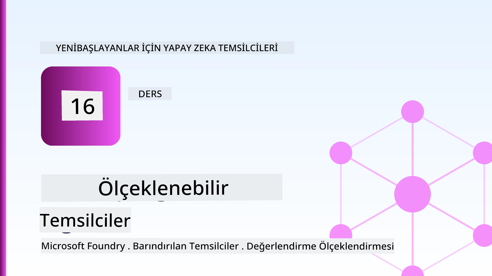
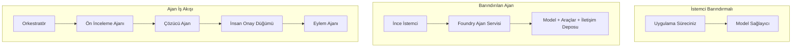
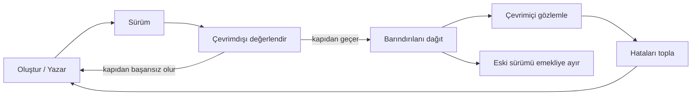
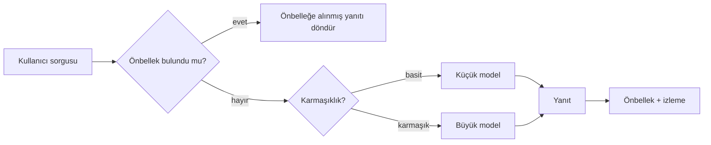
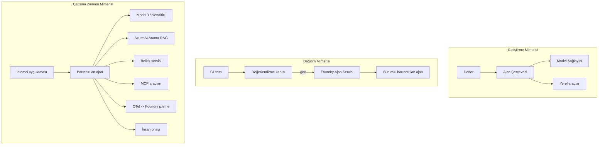

# Microsoft Foundry ile Ölçeklenebilir Ajanları Dağıtma



Bu noktaya kadar kursta, `az login` ve bir avuç ortam değişkeniyle çalışan, dizüstü bilgisayarınızda veya bir not defteri içinde çalışan ajanlar oluşturdunuz. Bu, öğrenmek için kesinlikle doğru yoldur. Ancak, binlerce müşterinin 03:00'te bağlı olduğu bir ajanı çalıştırmak için doğru yol değildir.

Bu ders, "makinemde çalışıyor" ile "üretimde güvenilir ve uygun maliyetli şekilde çalışıyor" arasındaki boşluktan bahseder. Bu boşluğu **Microsoft Foundry** ve **Microsoft Foundry Agent Service** kullanarak kapatıyoruz ve araçları, geri çağırmayı, hafızayı, değerlendirmeyi ve izlemi olan gerçek bir müşteri destek ajanı inşa ederek yapıyoruz.

## Giriş

Bu ders şunları ele alacak:

- Bir **prototip ajan** ile bir **dağıtılmış ajan** arasındaki fark ve geçişin çoğunlukla modelin *çevresindeki* her şeyle ilgili olması.
- Ajanlar için **dağıtım kalıpları**: istemci barındırmalı, servis barındırmalı (Barındırılan Ajanlar) ve iş akışı düzenlemeli.
- Microsoft Foundry üzerindeki **ajan yaşam döngüsü** — oluşturma, versiyonlama, dağıtma, değerlendirme, gözlemleme, emekliye ayırma.
- **Ölçeklendirme stratejileri**: model yönlendirme, önbellekleme, eşzamanlılık ve durumsuz tasarım.
- OpenTelemetry ve Foundry izleme ile **gözlemlenebilirlik**.
- Model seçimi, yönlendirme ve değerlendirme kapıları yoluyla **maliyet optimizasyonu**.
- **Kurumsal dikkat edilmesi gerekenler**: yönetişim, insan onayı ve MCP sunucularının üretimde güvenli şekilde çalıştırılması.

## Öğrenme Hedefleri

Bu dersi tamamladıktan sonra şunları bileceksiniz:

- Belirli bir ajan iş yükü için doğru dağıtım kalıbını seçmek.
- Bir ajanı Microsoft Foundry Agent Service'e dağıtarak versiyonlanmasını, yönetişimini ve gözlemlenebilir olmasını sağlamak.
- İzleme için bir ajanı enstrümante etmek ve her sürüm öncesi çalışan bir değerlendirme hattı oluşturmak.
- Ölçeklendirmede gecikme süresi ve maliyeti kontrol altında tutmak için model yönlendirmesi ve önbellekleme uygulamak.
- Yüksek riskli işlemler için insan onay kapısı eklemek ve üretimde güvenli bir şekilde MCP sunucusu entegre etmek.

## Önkoşullar

Bu ders, önceki dersleri tamamladığınızı ve şunlara aşina olduğunuzu varsayar:

- [Microsoft Agent Framework](../14-microsoft-agent-framework/README.md) kullanarak ajan inşa etme (Ders 14).
- [Araç Kullanımı](../04-tool-use/README.md) (Ders 4) ve [Agentic RAG](../05-agentic-rag/README.md) (Ders 5).
- [Ajan Hafızası](../13-agent-memory/README.md) (Ders 13) ve [Agentic Protokoller / MCP](../11-agentic-protocols/README.md) (Ders 11).
- [Gözlemlenebilirlik ve Değerlendirme](../10-ai-agents-production/README.md) (Ders 10) — bu ders buna doğrudan dayanır.

Şunlara da ihtiyacınız olacak:

- Bir **Azure aboneliği** ve en az bir konuşma modeli olan bir **Microsoft Foundry projesi**.
- Kimlik doğrulaması yapılmış **Azure CLI** (`az login`).
- Python 3.12+ ve depodaki [`requirements.txt`](../../../requirements.txt) paketleri.

## Prototipten Üretime: Aslında Ne Değişir

Bir prototip ajan ile üretim ajanı aynı temel döngüyü paylaşır — düşün, araçları çağır, yanıtla. Değişen ise o döngünün çevresindeki her şeydir. Model, üretim ajanının yaklaşık %20'si olabilir; diğer %80'i operasyonel iskeletidir.

| Endişe | Prototip | Üretim |
| --- | --- | --- |
| **Barındırma** | Not defterinizde çalışır | Barındırılan bir hizmet olarak çalışır, versiyonlanır ve yayılır |
| **Kimlik** | Sizin `az login` belirteciniz | Kapsamlı RBAC ile yönetilen kimlik |
| **Durum** | Bellekte, yeniden başlatmada kaybolur | Dışa aktarılmış (thread deposu, hafıza servisi) |
| **Hata** | İz önünü görürsünüz | Yeniden denemeler, geri dönüşler, ölü-mesaj, uyarılar |
| **Maliyet** | "Birkaç kuruş" | İstek başına izlenir, yönlendirilir, önbelleğe alınır, bütçelenir |
| **Kalite** | Çıktıya göz atarsınız | Her sürüm öncesi otomatik değerlendirilir |
| **Güven** | Her işlemi onaylarsınız | Politika + riskli işlemler için insan kontrollü döngü |

Bu tabloyu aklınızda tutun. Aşağıdaki her bölüm bu satırlardan biriyle eşleşir.

## Ajan Dağıtım Kalıpları

Sıklıkla birleştirerek kullanacağınız üç kalıp vardır.

### 1. İstemci Barındırmalı Ajanlar

Ajan nesnesi *siz* uygulama işleminizin içindedir. Kodunuz modeli doğrudan çağırır; düşünme döngüsü hizmetinizde çalışır. Önceki derslerde hep böyle yapıldı.

- **Ne zaman kullanılır** döngü üzerinde tam kontrol istediğinizde, özel ara katmanlar gerektiğinde veya ajanı mevcut bir arka ucun içine gömüyorsanız.
- **Dezavantajı**: Ölçeklendirme, durum ve dayanıklılığın size ait olması.

### 2. Barındırılan Ajanlar (Foundry Agent Service)

Ajan Microsoft Foundry’de *bir kaynak olarak kaydedilir*. Foundry düşünme döngüsünü barındırır, threadleri saklar, içerik güvenliği ve RBAC uygular ve ajanı Foundry portalında görünür kılar. Uygulamanız hafif bir istemci olur; thread oluşturur ve yanıtları okur.

- **Ne zaman kullanılır** dayanıklılık, yerleşik gözlemlenebilirlik, yönetişim ve daha az operasyonel yüzey alanı istediğinizde.
- **Dezavantajı**: yönetilen çalışma zamanı karşılığında daha az düşük seviye kontrol.

### 3. Ajan İş Akışları

Birden fazla ajan (ve araç) açık kontrol akışı ile bir grafikte birleştirilir — sıralı adımlar, dallanma, insan onay düğümleri ve durdurup devam ettirilebilen dayanıklı kontrol noktaları. Bu, Microsoft Agent Framework'ün **İş Akışları** özelliğinin dağıtım ölçeğinde kullanımıdır.

- **Ne zaman kullanılır** tek bir görev birkaç uzmanlaşmış ajanı kapsıyorsa veya ortasında onay adımı gerekiyorsa.
- **Dezavantajı**: daha çok hareketli parça; düzenleme seviyesi gözlemlenebilirlik gerektirir.



## Microsoft Foundry'de Ajan Yaşam Döngüsü

Bir ajan dağıtmak tek seferlik bir `push` değildir. Bu bir döngüdür ve oldukça yazılım sürüm döngüsüne benzer çünkü aslında odur.



[Ders 10](../10-ai-agents-production/README.md)'den alınan temel fikir: **çevrimdışı değerlendirme bir kapıdır, sonradan yapılan bir düşünce değildir.** Yeni bir ajan versiyonu değerlendirme eşiklerinizi geçmeden yayınlanmaz. Çevrimiçi gözlemlenebilirlik, gerçek dünya hatalarını çevrimdışı test setinize geri besler. İşte tüm döngü budur.

## Ölçeklendirme Stratejileri

Bir ajanı ölçeklendirmek, durumsuz web API'si ölçeklendirmekten farklıdır çünkü her istek birden çok pahalı model ve araç çağrısını tetikleyebilir. Dört teknik yükün çoğunu taşır.

**Durumsuz istek işleme.** İşlem belleğinizde kullanıcı başına durum tutmayın. Konuşma threadlerini Foundry thread deposunda veya bir hafıza servisinde tutun, böylece herhangi bir örnek herhangi bir isteği işleyebilir. Bu, yatay ölçeklendirmeye olanak tanır — örnekler ekleyin, yapışkan oturum yok.

**Model yönlendirme.** Her istek en yetenekli (ve en pahalı) modeli gerektirmez. Basit istekleri — niyet sınıflandırma, kısa gerçekçi yanıtlar — küçük, hızlı bir modele yönlendirin ve büyük modeli gerçek mantık için ayırın. Foundry'nin **Model Yönlendiricisi** bunu sizin için yapabilir veya hafif bir sınıflandırıcı kendiniz uygulayabilirsiniz. Laboratuvarda DIY sürümünü yapacaksınız.

**Yanıt önbellekleme.** Birçok destek sorgusu neredeyse tekrardır ("şifremi nasıl sıfırlarım?"). Yaygın soruların yanıtlarını önbelleğe alın ve modeli hiç çağırmadan hizmet verin. Orta düzey bir önbellek isabet oranı bile maliyet ve gecikmeyi anlamlı şekilde azaltır.

**Eşzamanlılık ve geri basınç.** Model sağlayıcılarının oran sınırları vardır. Eşzamanlılığı sınırlandırın, üssel tekrar deney kullanın ve zarif şekilde hata verin (sıralanan "üzerindeyiz" yanıtı 500'dan iyidir).



## Üretimde Gözlemlenebilirlik

Görmeden işletemezsiniz. Ders 10’da anlatıldığı gibi Microsoft Agent Framework yerel olarak **OpenTelemetry** izleri yayımlar — her model çağrısı, araç çağrısı ve düzenleme adımı bir span olur. Üretimde bu spanları Microsoft Foundry'ye (veya herhangi bir OTel uyumlu arka uca) aktarır ve şunları yapabilirsiniz:

- Tek bir müşteri şikayetini baştan sona her model ve araç çağrısında izlemek.
- Zaman içinde istek başı p50/p95 gecikme ve maliyeti takip etmek.
- Hata oranı yükselişi ve maliyet anormalliklerinde kullanıcılarınız (veya finans ekibiniz) fark etmeden önce uyarı vermek.

```python
from agent_framework.observability import get_tracer

tracer = get_tracer()

with tracer.start_as_current_span("support_request") as span:
    span.set_attribute("customer.tier", "enterprise")
    span.set_attribute("routed.model", "gpt-4.1-mini")
    # ajan yürütmesi bu aralık içinde otomatik olarak izlenir
```

`customer.tier` ve `routed.model` gibi özellikler bir iz duvarını cevaplanabilir sorulara dönüştürür ("kurumsal müşteriler çok sık küçük modele mi yönlendiriliyor?").

## Maliyet Optimizasyonu

Üretim ajanlarında maliyeti belirleyen tokenlardır. Etki sırasına göre üç kaldıraç:

1. **Modeli doğru boyutlandırın.** Değerlendirme kapısını geçen küçük model, yine geçen büyük modele kıyasla neredeyse her zaman daha ucuzdur. Küçük modelin yeterli olduğunu *kanıtlamak* için değerlendirme kullanın; varsayılan olarak en büyük modele karar vermeyin.
2. **Karmaşıklığa göre yönlendirme yapın.** Yukarıdaki gibi — büyük model fiyatını sadece büyük model mantığı gerektiren istekler için ödeyin.
3. **Agresif önbellekleme yapın.** En ucuz model çağrısı, asla yapmadığınızdır.

Değerlendirme kapıları ve maliyet kontrolü aynı disiplinin iki açıdan görünümü gibidir: değerlendirme size *kalite alt sınırını* söyler, yönlendirme ve önbellekleme bu sınırın *maliyetine* mümkün olduğunca yakın kalmanızı sağlar.

## Kurumsal Dağıtım Dikkat Edilecekler

**Yönetişim.** Barındırılan Ajanlar Foundry'nin RBAC, içerik güvenliği ve denetim günlüğü özelliklerini devralır. Her ajana ihtiyacı olan en az ayrıcalıkta bir yönetilen kimlik verin — bilgi tabanına salt okunur erişim, biletleme API’sine kapsamlı erişim, daha fazlası değil.

**İnsan döngüsünde.** Bazı işlemler otomatikleştirilemeyecek kadar önemlidir — iadeyi onaylama, hesap silme, yasal ekibe yükseltme. Microsoft Agent Framework **onay gerektiren** araçları destekler: ajan işlemi önerir, yürütme durur, insan onaylar veya reddeder ve iş akışı devam eder. Bu yapıyı [Ders 6](../06-building-trustworthy-agents/README.md) de gördünüz; burada dağıtıyorsunuz.

**Üretimde MCP.** [MCP](../11-agentic-protocols/README.md), ajanın harici araçları standart bir arayüzle kullanmasını sağlar. Üretimde her MCP sunucusunu güvenilmeyen bir sınır olarak görün: sunucu sürümünü sabitleyin, kapsamlı kimlikle çalıştırın, çıktılarını doğrulayın ve ona asla sırları açığa çıkarmayın. MCP sunucusu bir bağımlılıktır ve bağımlılıklar yamalanır, denetlenir ve oran sınırına tabi tutulur.



Bu üç diyagram — geliştirme, dağıtım, çalışma zamanı — ajanın yaşamının üç aşamasındaki halidir. Aşağıdaki laboratuvar bunu oluşturmanızı sağlayacak.

## Uygulamalı Laboratuvar: Üretime Hazır Bir Müşteri Destek Ajanı

[`code_samples/16-python-agent-framework.ipynb`](./code_samples/16-python-agent-framework.ipynb) dosyasını açın ve baştan sona ilerleyin. Tüm üretim dikkatlerini içeren bir **Contoso müşteri destek ajanı** oluşturacaksınız:

1. **Araç çağırma** — sipariş durumunu sorgulama ve destek talepleri açma.
2. **RAG** — bilgi tabanından politika sorularına yanıt verme (Azure AI Search, ve not defteri içinde Search kaynağı olmadan çalışan bellek geri dönüşü).
3. **Hafıza** — konuşma adımları boyunca müşteriyi hatırlama.
4. **Model yönlendirme** — karmaşıklık sınıflandırıcısı her isteği küçük veya büyük modele yönlendirir.
5. **Yanıt önbellekleme** — tekrar eden sorular önbellekten karşılanır.
6. **İnsan onayı** — eşik üzerindeki iadeler insan onayı için duraklatılır.
7. **Değerlendirme hattı** — küçük çevrimdışı test seti ajanı puanlar ve sürüm kapısı olarak görev yapar.
8. **Gözlemlenebilirlik** — her istek etrafında OpenTelemetry izleme.

### Yürütme

Not defteri, her üretim dikkatini kendine ait, çalıştırılabilir bir bölüm olarak düzenlenmiştir. Kalbi ise yönlendirme artı önbellekleme istek işleyicisidir:

```python
async def handle_support_request(query: str, customer_id: str) -> str:
    # 1. Yapabiliyorsak önbellekten hizmet verin.
    cached = response_cache.get(normalize(query))
    if cached:
        return cached

    # 2. Maliyeti kontrol etmek için karmaşıklığa göre yönlendirin.
    model = "gpt-4.1-mini" if is_simple(query) else "gpt-4.1"

    # 3. Gözlemlenebilirlik için ajanı bir izleme aralığı içinde çalıştırın.
    with tracer.start_as_current_span("support_request") as span:
        span.set_attribute("routed.model", model)
        span.set_attribute("customer.id", customer_id)
        response = await support_agent.run(query, model=model)

    # 4. Önbelleğe alın ve geri döndürün.
    response_cache.set(normalize(query), response.text)
    return response.text
```

Sürümü koruyan değerlendirme kapısı şu şekildedir:

```python
async def evaluation_gate(agent, test_cases, threshold: float = 0.8) -> bool:
    passed = 0
    for case in test_cases:
        result = await agent.run(case["input"])
        if score_response(result.text, case["expected"]) >= 0.8:
            passed += 1
    pass_rate = passed / len(test_cases)
    print(f"Evaluation pass rate: {pass_rate:.0%} (gate: {threshold:.0%})")
    return pass_rate >= threshold  # kapı geçerse yalnızca dağıtımı yap
```

Her satırı okuyun — not defteri, hiçbir şeyin bir framework çağrısının arkasına gizlenmemesi için yapıtaşlarını kasıtlı olarak küçük tutar.

## Dağıtılmış Ajanı Duman Testleri ile Doğrulama

Yukarıdaki değerlendirme kapısı ajan nesnenize karşı *çevrimdışı* çalışır. Ajan bir Barındırılan Ajan olarak dağıtıldığında bir kontrol daha gerekir, daha da ucuz: **dağıtılan uç nokta gerçekten yanıt veriyor mu?**

"Başarılı" dağıtmak yalnızca kontrol düzleminin tanımı kabul ettiğini gösterir — ajanın yanıt verdiğini kanıtlamaz. Eksik bağımlılık, kötü model yönlendirme veya süresi dolmuş bağlantı, boş bir yeşil dağıtıma yol açabilir. Bir **duman testi** bunu saniyeler içinde, her dağıtımda ve tam değerlendirme maliyeti olmadan yakalar.

Bu depo, kullanıma hazır bir duman testi hattını [AI Smoke Test](https://github.com/marketplace/actions/ai-smoke-test) GitHub Action üzerine paket olarak sağlar:

- **Katalog** — [`tests/lesson-16-smoke-tests.json`](../../../tests/lesson-16-smoke-tests.json) Contoso destek ajanına ait istemler ve doğrulamalar içerir (temelli politika cevapları, sipariş sorgulaması, konu dışı kalmama ve çok adımlı thread sürekliliği). Diğer ders ajanlarının katalogları da yanında durur — bkz. [`tests/README.md`](../tests/README.md).
- **İş akışı** — [`.github/workflows/smoke-test.yml`](../../../.github/workflows/smoke-test.yml) Azure OIDC ile giriş yapar ve her istemi ajanın Responses uç noktasına POST eder, herhangi bir doğrulama başarısızlığında işi başarısız sayar.

```yaml
- name: Smoke-test hosted agent
  uses: JFolberth/ai-smoketest@v1
  with:
    project_endpoint: ${{ inputs.project_endpoint }}
    agent_name: ContosoSupportAgent
    tests_file: tests/lesson-16-smoke-tests.json
```


Ajanınız dağıtıldıktan sonra, Foundry proje uç noktanızı ve ajan adınızı sağlayarak **Actions** sekmesinden çalıştırın. Federated identity, Foundry proje kapsamındaki **Azure AI User** rolüne ihtiyaç duyar. Katmanları bir piramit olarak düşünün: dumansız testler (erişilebilir ve yanıt veriyor mu?) her dağıtımda çalışır, çevrimdışı değerlendirme (gönderime uygun mu?) terfiden önce çalışır ve çevrimiçi değerlendirme (sahadaki performansı nasıl?) sürekli olarak çalışır.

## Bilgi Kontrolü

Ödeve geçmeden önce anladığınızdan emin olun.

**1. Üretim ajanının yaklaşık ne kadarı 'model'dir ve geri kalanı nedir?**

<details>
<summary>Cevap</summary>

Model sistemin azınlığıdır — genellikle yaklaşık %20 civarında belirtilir. Geri kalanı operasyonel iskelettir: barındırma ve sürümlendirme, kimlik ve RBAC, dışsallaştırılmış durum, hata yönetimi, maliyet takibi, değerlendirme ve insan döngüsü kontrolleri. Üretime geçmek çoğunlukla muhakeme döngüsünün *çevresindeki* her şeyi inşa etmektir.
</details>

**2. Bir Hosted Agent'ı ne zaman istemci barındırılan ajan yerine tercih edersiniz?**

<details>
<summary>Cevap</summary>

Yerleşik dayanıklılık (kalıcı ve devam edebilen iş parçacıkları), gözlemlenebilirlik, içerik güvenliği ve RBAC özelliklerine sahip yönetilen bir çalışma zamanı istiyorsanız ve muhakeme döngüsünün düşük seviyedeki kontrolünden biraz ödün verip daha az operasyonel yükü tercih ediyorsanız Hosted Agent seçilir. İstemci barındırılan tercih edilirken, tam döngü kontrolü gerektiğinde veya ajan mevcut bir backend'e gömülü olduğunda kullanılır.
</details>

**3. Ölçeklenebilir bir ajanın kendi işlem belleğinde durumsuz olması neden zorunludur?**

<details>
<summary>Cevap</summary>

Böylece herhangi bir örnek herhangi bir isteği karşılayabilir, bu da yapışkan oturumlar olmadan yatay ölçeklemeye olanak sağlar. Kullanıcı başına konuşma durumu iş parçacığı deposu veya bellek servisine dışsallaştırılır. Durum işlem belleğinde olsaydı, yeniden başlatmada kaybolur ve yükü serbestçe dağıtamazdınız.
</details>

**4. Model yönlendirme hangi sorunu çözer ve değerlendirme ile nasıl ilişkilidir?**

<details>
<summary>Cevap</summary>

Yönlendirme, basit istekleri küçük, ucuz ve hızlı bir modele gönderip, büyük modeli gerçek muhakeme için ayırır; böylece gecikme ve maliyet kontrol edilir. Değerlendirme, küçük modelin belirli istek sınıfı için yeterince iyi olduğunu *kanıtladığı* için önemlidir — değerlendirilmeyen yönlendirme tahminden ibarettir.
</details>

**5. "Değerlendirme kapısı" nedir ve yaşam döngüsünde nerede yer alır?**

<details>
<summary>Cevap</summary>

Bir değerlendirme kapısı, yeni ajan sürümüne çevrimdışı bir test seti uygular ve geçme oranı bir eşik değerini sağlamazsa dağıtımı engeller. Yaşam döngüsünde "sürüm" ve "dağıtım" arasında yer alır, böylece kalite gönderim önkoşulu olur ve sevkiyat sonrası kontrol edilmez.
</details>

**6. Üretimde bir MCP sunucusu neden güvenilmeyen bir sınır olarak değerlendirilmelidir?**

<details>
<summary>Cevap</summary>

Çünkü ajanınızın çağırdığı harici bir bağımlılıktır. Sürümünü sabitlemeli, kapsamlı bir kimlikle çalıştırmalı, çıktıları doğrulamalı, oran sınırlaması yapmalı ve kesinlikle sırları ifşa etmemelisiniz — diğer üçüncü taraf bağımlılıklara uyguladığınız disiplin aynısıdır. Çıktıları ajanınızın muhakemesine akar, bu yüzden doğrulanmamış güvenlik riski oluşturur.
</details>

**7. Üretim ajan maliyetini en çok etkileyen tek değişiklik genellikle nedir ve neden?**

<details>
<summary>Cevap</summary>

Modeli doğru boyutlandırmak — değerlendirme kapısını geçebilen en küçük modeli kullanmak. Maliyet belirleyici olarak tokenlar tarafından yönlendirilir ve kalite barını karşılayan küçük model, büyük modelden genellikle daha ucuzdur. Önbellekleme ve yönlendirme maliyeti daha da düşürür, ancak doğru temel modeli seçmek en büyük birincil etkendir.
</details>

**8. `customer.tier` ve `routed.model` gibi span özellikleri gözlemlenebilirlikte ne rol oynar?**

<details>
<summary>Cevap</summary>

Hammal izleri cevaplanabilir iş sorularına dönüştürürler. Özellikler olmadan bir duvar gibi spansiniz olur; özelliklerle "kurumsal müşteriler çok sık küçük modele mi yönlendiriliyor?" veya "en yavaş isteklerimizi hangi model karşılıyor?" gibi sorular sorabilirsiniz. Özellikler telemetriyi operasyonunuz için önemli boyutlara göre dilimlemenin yoludur.
</details>

## Ödev

Laboratuvardan müşteri destek ajanını alın ve belirli bir senaryo için güçlendirin: **bir SaaS şirketi için abonelik faturalama destek ajanı.**

Gönderiminiz aşağıdakileri içermelidir:

1. **Araçları** faturalama ile ilgili olanlarla değiştirin: `get_subscription_status`, `get_invoice` ve `issue_credit` (50$ üzeri krediler insan onayı gerektirir).
2. Şirketin iade politikası, faturalama döngüsü ve iptal politikası hakkında üç RAG dokümanı **ekleyin.**
3. En az iki insan onayı yolunu tetiklemesi gereken en az sekiz durumu içerecek şekilde değerlendirme setini **genişletin** ve değerlendirme kapınızın doğru şekilde geçip kalmadığını doğrulayın.
4. On karışık sorguyu ajan üzerinden geçirdikten sonra küçük modele kaç sorgu, büyük modele kaç sorgu gitti ve kaç tane önbellekten karşılandı gibi bilgileri içeren **bir maliyet raporu ekleyin.**

Kısa bir paragraf (markdown hücresinde) yazarak hangi model yönlendirme kuralını seçtiğinizi ve gerçek trafikle bunu nasıl doğrulayacağınızı açıklayın. Tek doğru cevap yoktur — siz üretim endişelerinin tutarlı şekilde bağlanıp bağlanmadığına göre değerlendirileceksiniz.

## Özet

Bu derste Microsoft Foundry ile bir ajanı prototipten üretime taşıdınız:

- Üretime geçiş çoğunlukla modelin çevresindeki **operasyonel iskelet** ile ilgilidir — barındırma, kimlik, durum, hata yönetimi, maliyet, kalite ve güven.
- Üç **dağıtım deseni** öğrendiniz — istemci barındırılan, Hosted Agents ve Agent Workflows — ve ne zaman uygun olduklarını gördünüz.
- **Ajan yaşam döngüsünün** içinden geçtiniz, burada çevrimdışı **değerlendirme sürüm kapısı işlevi görür** ve çevrimiçi gözlemlenebilirlik hataları test setine geri besler.
- **Ölçekleme stratejileri** uyguladınız — durumsuz tasarım, model yönlendirme, önbellekleme ve sınırlı eşzamanlılık — ve bunları **maliyet optimizasyonu** ile bağladınız.
- **Kurumsal kontroller** eklediniz: RBAC, insan onaylı döngü ve üretim güvenli MCP entegrasyonu.
- Tüm bu endişeleri çalışan koda bağlayan **üretim hazır müşteri destek ajanı** geliştirdiniz.

Sonraki derste ters yolu izleyeceksiniz: ajanları buluta ölçeklemek yerine, onları *aşağı* indirip tek bir geliştirici makinesinde tamamen yerel çalıştıracaksınız.

## Ek Kaynaklar

- <a href="https://learn.microsoft.com/azure/ai-foundry/what-is-azure-ai-foundry" target="_blank">Microsoft Foundry dokümantasyonu</a>
- <a href="https://learn.microsoft.com/azure/ai-foundry/agents/overview" target="_blank">Microsoft Foundry Ajan Servisi genel bakış</a>
- <a href="https://aka.ms/ai-agents-beginners/agent-framework" target="_blank">Microsoft Agent Framework</a>
- <a href="https://learn.microsoft.com/azure/ai-foundry/concepts/model-router" target="_blank">Microsoft Foundry'de Model Router</a>
- <a href="https://learn.microsoft.com/azure/search/search-what-is-azure-search" target="_blank">Azure AI Search</a>
- <a href="https://opentelemetry.io/" target="_blank">OpenTelemetry</a>
- <a href="https://github.com/marketplace/actions/ai-smoke-test" target="_blank">AI Smoke Test GitHub Action</a>
- <a href="https://modelcontextprotocol.io/" target="_blank">Model Context Protocol (MCP)</a>

## Önceki Ders

[Bilgisayar Kullanım Ajanları (CUA) Yapımı](../15-browser-use/README.md)

## Sonraki Ders

[Yerel AI Ajanları Oluşturma](../17-creating-local-ai-agents/README.md)

---

<!-- CO-OP TRANSLATOR DISCLAIMER START -->
**Feragatname**:
Bu belge, AI çeviri hizmeti [Co-op Translator](https://github.com/Azure/co-op-translator) kullanılarak çevrilmiştir. Doğruluk için çaba sarf etsek de, otomatik çevirilerin hata veya yanlışlık içerebileceğini lütfen unutmayınız. Orijinal belge, kendi dilinde yetkili kaynak olarak kabul edilmelidir. Kritik bilgiler için profesyonel insan çevirisi önerilir. Bu çevirinin kullanımı sonucu ortaya çıkabilecek yanlış anlamalardan veya yanlış yorumlamalardan sorumlu değiliz.
<!-- CO-OP TRANSLATOR DISCLAIMER END -->