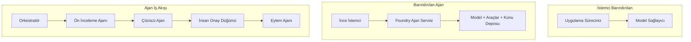
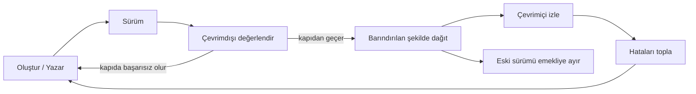
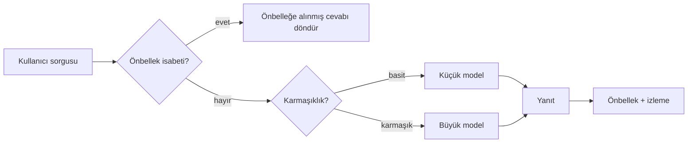
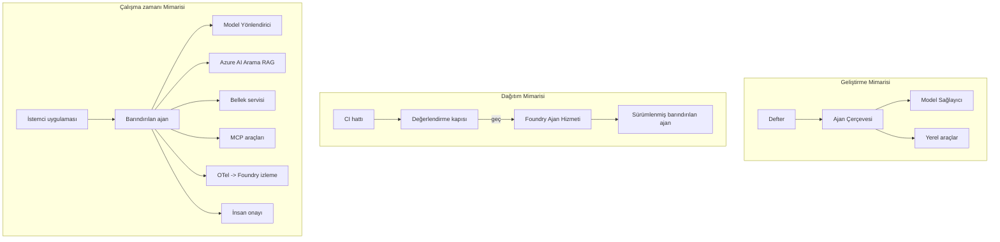

# Microsoft Foundry ile Ölçeklenebilir Ajanların Dağıtımı


Kursun bu noktasına kadar, dizüstü bilgisayarınızda, `az login` ve bir avuç ortam değişkeniyle çalışan ajanlar oluşturdunuz. Bu, öğrenmek için tam doğru yoldur. Ancak binlerce müşterinin 3 sabah saatinde bağlı olduğu bir ajanı çalıştırmak için doğru yol değildir.

Bu ders, "makinemde çalışıyor" ile "üretimde güvenilir ve uygun maliyetli şekilde çalışıyor" arasındaki farkla ilgilidir. Bu farkı **Microsoft Foundry** ve **Microsoft Foundry Agent Service** kullanarak kapatıyoruz ve araçlar, geri getirme, hafıza, değerlendirme ve izleme özelliklerine sahip gerçek bir müşteri destek ajanı oluşturarak yapıyoruz.

## Giriş

Bu ders şunları kapsayacak:

- **Prototip ajan** ile **dağıtılmış ajan** arasındaki fark ve geçişin büyük ölçüde modelin *etrafındaki* her şeyle ilgili olması.
- Ajanlar için **Dağıtım kalıpları**: istemci barındırmalı, hizmet barındırmalı (Hosted Agents) ve iş akışı orkestrasyonlu.
- Microsoft Foundry'deki **ajan yaşam döngüsü** — oluşturma, sürümlendirme, dağıtma, değerlendirme, gözlemleme, emekliye ayırma.
- **Ölçeklendirme stratejileri**: model yönlendirme, önbellekleme, eşzamanlılık ve durumsuz tasarım.
- OpenTelemetry ve Foundry izleme ile **gözlemlenebilirlik**.
- Model seçimi, yönlendirme ve değerlendirme kapıları ile **maliyet optimizasyonu**.
- **Kurumsal hususlar**: yönetişim, insan onayı ve MCP sunucularının üretimde güvenli çalıştırılması.

## Öğrenme Hedefleri

Bu dersi tamamladıktan sonra şunları bileceksiniz:

- Belirli bir ajan iş yükü için doğru dağıtım kalıbını seçmek.
- Bir ajanı Microsoft Foundry Agent Service'e dağıtarak sürümlendirmek, yönetmek ve gözlemlenebilir yapmak.
- Bir ajanı izleme için donatmak ve her sürüm öncesi çalışan değerlendirme hattı kurmak.
- Ölçeklendirmede gecikme ve maliyeti kontrol altında tutmak için model yönlendirme ve önbellekleme uygulamak.
- Yüksek riskli işlemler için insan onay kapısı eklemek ve MCP sunucusunu üretim açısından güvenli şekilde entegre etmek.

## Ön Koşullar

Bu ders, önceki dersleri tamamladığınızı ve şunlara hakim olduğunuzu varsayar:

- [Microsoft Agent Framework](../14-microsoft-agent-framework/README.md) ile ajan oluşturmaya (Ders 14).
- [Araç Kullanımı](../04-tool-use/README.md) (Ders 4) ve [Agentic RAG](../05-agentic-rag/README.md) (Ders 5).
- [Agent Belleği](../13-agent-memory/README.md) (Ders 13) ve [Agentic Protokoller / MCP](../11-agentic-protocols/README.md) (Ders 11).
- [Gözlemlenebilirlik ve Değerlendirme](../10-ai-agents-production/README.md) (Ders 10) — bu ders onun üzerine doğrudan inşa edilir.

Ayrıca ihtiyacınız olacak:

- En az bir dağıtılmış sohbet modeli olan **Azure aboneliği** ve **Microsoft Foundry projesi**.
- Kimlik doğrulamalı **Azure CLI** (`az login`).
- Python 3.12+ ve depodaki [`requirements.txt`](../../../requirements.txt) içindeki paketler.

## Prototipten Üretime: Aslında Neler Değişir

Prototip ajan ile üretim ajanı aynı temel döngüyü paylaşır — mantık yürütme, araç çağırma, yanıt verme. Değişen, bu döngünün etrafında bulunan her şeydir. Model, bir üretim ajanının belki %20'sidir; diğer %80 operasyonel iskeletdir.

| Husus | Prototip | Üretim |
| --- | --- | --- |
| **Barındırma** | Dizüstünüzde çalışır | Barındırılan hizmet olarak çalışır, sürümlenir ve yayılır |
| **Kimlik** | Sizin `az login` belirteciniz | Kapsamlı RBAC ile yönetilen kimlik |
| **Durum** | Bellekte, yeniden başlatmada kaybolur | Dışsallaştırılmış (dizi deposu, bellek servisi) |
| **Hata** | İzlemeyi görürsünüz | Tekrarlar, geri dönüşler, ölü mektup, uyarılar |
| **Maliyet** | "Birkaç sent" | İstek bazında takip, yönlendirme, önbellekleme, bütçeleme |
| **Kalite** | Çıktıyı gözle kontrol edersiniz | Her sürüm öncesi otomatik değerlendirilir |
| **Güven** | Her işlemi siz onaylarsınız | Politikalar + riskli işlemler için insan denetimi |

Bu tabloyu aklınızda tutun. Aşağıdaki her bölüm bu satırlardan birine karşılık gelir.

## Ajan Dağıtım Kalıpları

Sıklıkla birlikte kullandığınız üç kalıp vardır.

### 1. İstemci Barındırmalı Ajanlar

Ajan nesnesi *sizin* uygulama işleminizin içindedir. Kodunuz model sağlayıcısını doğrudan çağırır; mantık döngüsü hizmetinizde çalışır. Önceki tüm dersler bunu yaptı.

- **Ne zaman kullanılır** döngü üzerinde tam kontrol, özel ara katmanlar gerektiğinde veya ajan zaten var olan bir altyapıya gömüldüğünde.
- **Dezavantaj**: ölçeklendirme, durum ve dayanıklılıktan siz sorumlusunuz.

### 2. Barındırmalı Ajanlar (Foundry Agent Service)

Ajan Microsoft Foundry'de *bir kaynak olarak kaydedilir*. Foundry mantık döngüsünü barındırır, dizileri depolar, içerik güvenliği ve RBAC uygular ve ajanı Foundry portalında görünür kılar. Uygulamanız ise dizileri oluşturan ve yanıtları okuyan ince bir istemci olur.

- **Ne zaman kullanılır** dayanıklılık, yerleşik gözlemlenebilirlik, yönetişim ve daha az operasyonel yüzey alanı istendiğinde.
- **Dezavantaj**: yönetilen çalışma zamanında daha az düşük seviyeli kontrol.

### 3. Ajan İş Akışları

Birden çok ajan (ve araç) açık kontrol akışıyla grafik halinde birleştirilir — ardışık adımlar, dallanma, insan onay düğümleri ve durdurulup devam edilebilen kalıcı kontrol noktaları. Bu, Microsoft Agent Framework **İş Akışları** özelliğinin dağıtım ölçeğinde uygulanmasıdır.

- **Ne zaman kullanılır** tek görev birçok uzmanlaşmış ajanı kapsıyorsa veya ortasında onay gerektiren bir adım varsa.
- **Dezavantaj**: daha fazla hareketli parça; orkestrasyon seviyesi gözlemlenebilirlik gerekir.



## Microsoft Foundry'de Ajan Yaşam Döngüsü

Ajan dağıtımı tek seferlik bir `push` değildir. Bir döngüdür ve yazılım sürüm döngüsüne çok benzer çünkü tam olarak odur.



Ana fikir, [Ders 10](../10-ai-agents-production/README.md)'dan aktarılmıştır: **çevrimdışı değerlendirme bir kapıdır, sonrasında düşünülmez.** Yeni ajan sürümü, değerlendirme eşiklerini geçmediği sürece yayımlanmaz. Çevrimiçi gözlemlenebilirlik gerçek dünyadaki hataları çevrimdışı test setine geri besler. Bu döngünün tamamıdır.

## Ölçeklendirme Stratejileri

Bir ajanı ölçeklendirmek, durumsuz web API'si ölçeklendirmekten farklıdır çünkü her istek birden çok pahalı model ve araç çağrısı tetikleyebilir. Yükü taşıyan dört teknik vardır.

**Durumsuz istek işleme.** İşlem belleğinizde kullanıcı başına durum tutmayın. Konuşma dizilerini Foundry dizi deposunda veya bellek servisinde kalıcı hale getirin ki herhangi bir örnek her isteği işleyebilsin. Bu yatay ölçeklendirmeyi sağlar — yeni örnekler ekleyin, yapışkan oturum yok.

**Model yönlendirme.** Her istek sizin en güçlü (ve en pahalı) modelinizi gerektirmez. Basit istekleri — niyet sınıflandırma, kısa gerçek cevaplar — küçük, hızlı bir modele yönlendirin ve büyük modeli gerçek akıl yürütme için ayırın. Foundry'nin **Model Yönlendiricisi** bunu sizin için yapabilir veya hafif bir sınıflandırıcı kendiniz oluşturabilirsiniz. Laboratuvarda bu kendin-yap versiyonunu yapacaksınız.

**Yanıt önbellekleme.** Birçok destek sorgusu neredeyse tekrar ("şifremi nasıl sıfırlarım?"). Yaygın soruların cevaplarını önbelleğe alın ve modeli hiç çağırmadan sunun. Orta seviyede bir önbellek vurma oranı bile maliyet ve gecikmeyi anlamlı ölçüde azaltır.

**Eşzamanlılık ve geri basınç.** Model sağlayıcıların oran limitleri vardır. Eşzamanlılığınızı sınırlandırın, üssel geri çekilme ile tekrarlar kullanın ve nazikçe başarısız olun (kuyruğa alınmış "Üstündeyiz" yanıtı 500'den iyidir).



## Üretimde Gözlemlenebilirlik

Göremediğinizi işletemezsiniz. Ders 10’da ele alındığı gibi, Microsoft Agent Framework yerleşik olarak **OpenTelemetry** izleri yayımlar — her model çağrısı, araç çağrısı ve orkestrasyon adımı bir span olur. Üretimde bu spanlar Microsoft Foundry (veya OTel uyumlu herhangi bir arka uç) 'a aktarılır ki:

- Tek bir müşteri şikayetini her model ve araç çağrısı boyunca uçtan uca izleyin.
- Zaman içinde her istek için p50/p95 gecikme ve maliyete bakın.
- Hataların artışı ve maliyet anormallikleri konusunda kullanıcılarınız (veya finans ekibiniz) fark etmeden önce uyarı alın.

```python
from agent_framework.observability import get_tracer

tracer = get_tracer()

with tracer.start_as_current_span("support_request") as span:
    span.set_attribute("customer.tier", "enterprise")
    span.set_attribute("routed.model", "gpt-5-nano")
    # ajan yürütülmesi bu kapsam içinde otomatik olarak izlenir
```

`customer.tier` ve `routed.model` gibi öznitelikler, izler duvarını yanıtlanabilir sorulara dönüştürür ("kurumsal müşteriler küçük modele çok sık mı yönlendiriliyor?").

## Maliyet Optimizasyonu

Üretim ajanlarındaki maliyetler tokenlar tarafından domine edilir. Üç kol var, etki sırasına göre:

1. **Modeli doğru boyutta seçmek.** Değerlendirme kapısından geçen küçük model, genellikle geçen büyük modelden daha ucuzdur. Korkudan en büyük modeli varsayılan olarak kullanmak yerine, küçük modelin yeterli olduğunu değerlendirmeyle *kanıtlayın.*
2. **Kompleksiteye göre yönlendirme.** Yukarıda belirtildiği gibi — yalnızca büyük model gerekliyse onun fiyatını ödeyin.
3. **Agresif önbellekleme.** En ucuz model çağrısı, hiç yapmadığınızdır.

Değerlendirme kapıları ve maliyet kontrolü, iki açıdan görülen aynı disiplindir: değerlendirme size *kalite tabanını* söyler, yönlendirme ve önbellekleme sizi o tabanın *maliyeti*ne mümkün olduğunca yaklaştırır.

## Kurumsal Dağıtım Düşünceleri

**Yönetişim.** Hosted Agents, Foundry'nin RBAC, içerik güvenliği ve denetim kayıtlarını miras alır. Her ajana ihtiyaç duyduğu en az ayrıcalıkla yönetilen kimlik verin — bilgi tabanına salt okunur erişim, bilet API'sine kapsamlı erişim, başka hiçbir şey yok.

**İnsan-tam döngüde.** Bazı işlemler tamamen otomatikleştirilemeyecek kadar sonuçludur — iade yapmak, hesap silmek, hukuk ekibine yükseltmek. Microsoft Agent Framework **onay-gerekli** araçları destekler: ajan işlemi önerir, yürütme duraklar, bir insan onaylar ya da reddeder, iş akışı devam eder. Bunu [Ders 6](../06-building-trustworthy-agents/README.md)'da gördünüz; burada dağıtıyoruz.

**Üretimde MCP.** [MCP](../11-agentic-protocols/README.md), ajanın dış araçları standart arayüzle tüketmesini sağlar. Üretimde her MCP sunucusunu güvenilmeyen bir sınır olarak değerlendirin: sunucu sürümünü sabitleyin, kısıtlı kimlik ile çalıştırın, çıktısını doğrulayın ve ona asla gizli bilgi ifşa etmeyin. MCP sunucusu bir bağımlılıktır ve bağımlılıklar yamalanır, denetlenir ve oran sınırlandırılır.



Bu üç diyagram — geliştirme, dağıtım, çalışma zamanı — ajanın yaşamının üç aşamasındaki aynı hali. Takip eden laboratuvar sizi bunu kurmaya götürecek.

## Uygulamalı Laboratuvar: Üretime Hazır Bir Müşteri Destek Ajanı

[`code_samples/16-python-agent-framework.ipynb`](./code_samples/16-python-agent-framework.ipynb) dosyasını açın ve baştan sona ilerleyin. Her üretim endişesi kablolanmış bir **Contoso müşteri destek ajanı** oluşturacaksınız:

1. **Araç çağırma** — sipariş durumu sorgula ve destek biletleri aç.
2. **RAG** — bilgi tabanından politika sorularını yanıtla (Azure AI Search, dizüstü bilgisayarın Arama kaynağı olmadan çalışması için bellek içi yedek).
3. **Bellek** — müşteriyle konuşmanın turlarında hatırlama.
4. **Model yönlendirme** — karmaşıklık sınıflandırıcısı her isteği küçük ya da büyük modele yönlendirir.
5. **Yanıt önbellekleme** — tekrarlanan sorular önbellekten yanıtlanır.
6. **İnsan onayı** — eşiğin üzerindeki iadeler insan onayı için duraklar.
7. **Değerlendirme hattı** — küçük bir çevrimdışı test seti ajanı puanlar ve sürüm kapısı olarak hareket eder.
8. **Gözlemlenebilirlik** — her istek için OpenTelemetry izleme.

### Yürütme

Dizüstü, her üretim endişesini kendi içinde çalışan bir bölüm olarak organize eder. Kalbi, yönlendirme artı önbellekleme istek işlemcisidir:

```python
async def handle_support_request(query: str, customer_id: str) -> str:
    # 1. Mümkün olduğunda önbellekten sun.
    cached = response_cache.get(normalize(query))
    if cached:
        return cached

    # 2. Maliyeti kontrol etmek için karmaşıklığa göre yönlendir.
    model = "gpt-5-nano" if is_simple(query) else "gpt-5-mini"

    # 3. Gözlemlenebilirlik için ajanı bir iz süresi içinde çalıştır.
    with tracer.start_as_current_span("support_request") as span:
        span.set_attribute("routed.model", model)
        span.set_attribute("customer.id", customer_id)
        response = await support_agent.run(query, model=model)

    # 4. Önbelleğe al ve döndür.
    response_cache.set(normalize(query), response.text)
    return response.text
```

Bir sürümü koruyan değerlendirme kapısı şöyle görünür:

```python
async def evaluation_gate(agent, test_cases, threshold: float = 0.8) -> bool:
    passed = 0
    for case in test_cases:
        result = await agent.run(case["input"])
        if score_response(result.text, case["expected"]) >= 0.8:
            passed += 1
    pass_rate = passed / len(test_cases)
    print(f"Evaluation pass rate: {pass_rate:.0%} (gate: {threshold:.0%})")
    return pass_rate >= threshold  # sadece kapı geçerse dağıtım yap
```

Her satırı okuyun — dizüstü parçacıkları bilinçli olarak küçük tutar, böylece hiçbir şey bir framework çağrısının arkasında gizlenmez.

## Dağıtılmış Ajanı Duman Testleri ile Doğrulama

Yukarıdaki değerlendirme kapısı *çevrimdışıdır* ve ajan nesnenize karşı çalışır. Ajan Hosted Agent olarak dağıtıldıktan sonra, bir kontrol daha gerekir, çok daha ucuz: **dağıtılmış uç nokta gerçekten cevap veriyor mu?**

"Başarılı" dağıtım yalnızca kontrol düzleminin tanımı kabul ettiğini gösterir — ajanın yanıt verdiğini kanıtlamaz. Eksik bir bağımlılık, yanlış model yönlendirmesi veya süresi dolmuş bağlantı, hiçbir şey döndürmeyen yeşil bir dağıtım sonucu verir. Bir **duman testi** bunu saniyeler içinde, her dağıtımda, tam değerlendirme maliyeti olmadan yakalar.

Bu depo, [AI Smoke Test](https://github.com/marketplace/actions/ai-smoke-test) GitHub Action tabanlı hazır bir duman testi hattı sağlar:

- **Katalog** — [`tests/lesson-16-smoke-tests.json`](../../../tests/lesson-16-smoke-tests.json), Contoso destek ajanı için istemler ve doğrulamaları içerir (temelli politika yanıtları, sipariş sorgulama, konu dışına çıkmama ve çok tur dizin sürekliliği). Diğer ders ajanlarının katalogları da yanındadır — bkz. [`tests/README.md`](../tests/README.md).
- **İş akışı** — [`.github/workflows/smoke-test.yml`](../../../.github/workflows/smoke-test.yml), Azure OIDC ile oturum açar ve her istemi ajanın Responses uç noktasına POST eder, herhangi bir doğrulama kaçarsa işi başarısız kılar.

```yaml
- name: Smoke-test hosted agent
  uses: JFolberth/ai-smoketest@v1
  with:
    project_endpoint: ${{ inputs.project_endpoint }}
    agent_name: ContosoSupportAgent
    tests_file: tests/lesson-16-smoke-tests.json
```


Ajanınız dağıtıldıktan sonra **Actions** sekmesinden, Foundry proje uç noktanızı ve ajan adını sağlayarak çalıştırın. Federasyon kimliğinin, Foundry proje kapsamı içinde **Azure AI Kullanıcısı** rolüne ihtiyacı vardır. Katmanları bir piramit gibi düşünün: duman testleri (erişilebilir ve yanıt veriyor mu?) her dağıtımda çalışır, çevrimdışı değerlendirme (gönderilmeye yeterince iyi mi?) terfi öncesinde yapılır ve çevrimiçi değerlendirme (yaban hayatında nasıl gidiyor?) sürekli olarak çalışır.

## Bilgi Kontrolü

Göreve geçmeden önce anlayışınızı test edin.

**1. Bir üretim ajanının yaklaşık ne kadar kısmı “model”dir ve geriye kalan nerede?**

<details>
<summary>Cevap</summary>

Model, sistemin azınlığıdır — genellikle %20 civarında belirtilir. Geri kalanı ise operasyonel iskelet: barındırma ve sürümleme, kimlik ve RBAC, dışsal durum, hata yönetimi, maliyet takibi, değerlendirme ve insan denetimi kontrolleridir. Üretime geçiş, aslında akıl döngüsünün *etrafında* her şeyi inşa etmekle ilgilidir.
</details>

**2. Ne zaman bir Barındırılan Ajanı, istemci barındırmalı ajan yerine seçersiniz?**

<details>
<summary>Cevap</summary>

Yerleşik dayanıklılık (devam eden ve yeniden başlayabilen iş parçacıkları), gözlemlenebilirlik, içerik güvenliği ve RBAC sunan yönetilen bir çalışma zamanı istediğinizde ve mantık döngüsünün düşük seviyeli kontrolünden biraz vazgeçip operasyonel yüzey alanını küçültmek istediğinizde Barındırılan tercih edilir. Döngü üzerinde tam kontrol gerektiren ya da ajanı mevcut arka uçta gömmek isteyenler için istemci barındırmalı tercih edilmelidir.
</details>

**3. Ölçeklenebilir bir ajanın neden kendi işlem belleğinde durumsuz (stateless) olması gerekir?**

<details>
<summary>Cevap</summary>

Böylece herhangi bir örnek herhangi bir isteği işleyebilir, bu da yapışkan oturumlar olmadan yatay ölçeklendirmeyi mümkün kılar. Kullanıcı başına konuşma durumu iş parçacığı deposu ya da bellek hizmetine dışsal olarak çıkarılır. Durum işlem belleğinde olsaydı, yeniden başlatmada kaybolur ve yükü özgürce dağıtamazdınız.
</details>

**4. Model yönlendirme hangi sorunu çözer ve değerlendirme ile nasıl ilişkilidir?**

<details>
<summary>Cevap</summary>

Yönlendirme, basit istekleri küçük, ucuz ve hızlı modele gönderir ve büyük modeli gerçek mantık yürütme için ayırır; böylece hem gecikme hem maliyeti kontrol eder. Değerlendirmeyle ilişkisi şu: değerlendirme, küçük modelin belirli istekler için yeterince iyi olduğunu *kanıtlarken* — değerlendirme olmadan yönlendirme yalnızca tahmindir.
</details>

**5. Bir “değerlendirme kapısı” nedir ve yaşam döngüsünde nerede yer alır?**

<details>
<summary>Cevap</summary>

Değerlendirme kapısı, yeni bir ajan sürümüne karşı çevrimdışı bir test seti çalıştırır ve geçme oranı eşik değerini aşmadıkça dağıtımı engeller. Yaşam döngüsünde “sürüm” ile “dağıtım” arasında yer alır, böylece kaliteyi yayın sonrası kontrol etmek yerine yayın için ön koşul yapar.
</details>

**6. Neden MCP sunucusu üretimde güvenilmeyen bir sınır olarak ele alınmalıdır?**

<details>
<summary>Cevap</summary>

Çünkü ajanınızın eriştiği dış bir bağımlılıktır. Sürümünü sabitlemeli, kapsamlı bir kimlikle çalıştırmalı, çıktılarının doğruluğunu kontrol etmeli, hız sınırlaması uygulamalı ve ona asla sır vermemelisiniz — herhangi bir üçüncü taraf bağımlılığına uyguladığınız disiplinle aynı. Çıktıları ajanın akıl yürütmesine akar, dolayısıyla doğrulanmamış güvenlik riski oluşturur.
</details>

**7. Genellikle üretim ajanı maliyetini en çok etkileyen tek değişiklik nedir ve neden?**

<details>
<summary>Cevap</summary>

Modeli doğru boyutlandırmak — değerlendirme kapınızı geçen en küçük modeli kullanmak. Maliyet çoğunlukla tokenlar tarafından domine edilir ve kaliteyi karşılayan daha küçük model çoğu zaman daha büyük bir modelden daha ucuzdur. Önbellekleme ve yönlendirme maliyeti daha da azaltır ama doğru taban modeli seçmek ilk derecede en büyük etkiye sahiptir.
</details>

**8. `customer.tier` ve `routed.model` gibi span (iz) özelliklerinin gözlemlenebilirlikteki rolü nedir?**

<details>
<summary>Cevap</summary>

Ham izleri yanıtlanabilir iş sorularına dönüştürürler. Özellikler olmadan sadece bir span duvarına sahipsiniz; özelliklerle “kurumsal müşteriler çok sık küçük modele yönlendiriliyor mu?” veya “en yavaş isteğimizi hangi model işliyor?” gibi sorular sorabilirsiniz. Özellikler, telemetriyi operasyonunuz için önemli boyutlara göre dilimlemenin yoludur.
</details>

## Ödev

Laboratuvardan müşteri destek ajanını alın ve belirli bir senaryo için güçlendirin: **bir SaaS şirketi için abonelik faturalama destek ajanı.**

Gönderiminiz aşağıdakileri içermelidir:

1. Faturalamayla ilgili araçlarla **araçları değiştirin**: `get_subscription_status`, `get_invoice` ve `issue_credit` (50$ üzeri krediler insan onayı gerektirir).
2. Şirketin iade politikası, fatura döngüsü ve iptal politikası hakkında üç RAG dökümanı **ekleyin.**
3. En az iki insan onay yolunu tetiklemesi gereken vaka dahil olmak üzere, değerlendirme setini **en az sekiz vaka** olarak genişletin ve değerlendirme kapısının doğru geçiş veya başarısızlık durumunu doğrulayın.
4. On karışık sorguyu ajandan geçirip, küçük modele kaç tane, büyük modele kaç tane, önbellekten kaç tane hizmet verildiğini yazdıran bir **maliyet raporu ekleyin.**

Kısa bir paragraf (markdown hücresinde) yazın; hangi model yönlendirme kuralını seçtiğinizi ve gerçek trafik ile nasıl doğrulayacağınızı açıklayın. Tek doğru cevap yok — değerlendirme, üretim kaygılarının mantıklı şekilde birleştirilip birleştirilmediği üzerine olacaktır.

## Özet

Bu derste, bir ajanı Microsoft Foundry ile prototipten üretime taşıdınız:

- Üretime geçiş esas olarak modelin etrafındaki **operasyonel iskelet** hakkındadır — barındırma, kimlik, durum, hata yönetimi, maliyet, kalite ve güven.
- Üç **dağıtım modelini** öğrendiniz — istemci barındırmalı, Barındırılan Ajanlar ve Ajan İş Akışları — ve her birinin ne zaman uygun olduğunu.
- **Ajan yaşam döngüsünü** takip ettiniz, çevrimdışı **değerlendirmenin sürüm kapısı** gibi davrandığını ve çevrimiçi gözlemlenebilirliğin hataları test setine geri beslediğini öğrendiniz.
- **Ölçeklendirme stratejileri** — durumsuz tasarım, model yönlendirme, önbellekleme ve sınırlı eşzamanlılık — uyguladınız ve bunları **maliyet optimizasyonu** ile bağdaştırdınız.
- **Kurumsal kontrolleri** entegre ettiniz: RBAC, insan denetimi onayı ve üretime uygun MCP entegrasyonu.
- Hepsini çalışır koda bağlayan **üretime hazır müşteri destek ajanı** inşa ettiniz.

Sonraki derste tam tersi yolculuk olacak: ajanları bulut yerine tek bir geliştirici makinesine *indirecek* ve tamamen yerel çalıştıracaksınız.

## Ek Kaynaklar

- <a href="https://learn.microsoft.com/azure/ai-foundry/what-is-azure-ai-foundry" target="_blank">Microsoft Foundry dokümantasyonu</a>
- <a href="https://learn.microsoft.com/azure/ai-foundry/agents/overview" target="_blank">Microsoft Foundry Ajan Servisi genel bakış</a>
- <a href="https://aka.ms/ai-agents-beginners/agent-framework" target="_blank">Microsoft Ajan Çerçevesi</a>
- <a href="https://learn.microsoft.com/azure/ai-foundry/concepts/model-router" target="_blank">Microsoft Foundry’de Model Yönlendirme</a>
- <a href="https://learn.microsoft.com/azure/search/search-what-is-azure-search" target="_blank">Azure AI Search</a>
- <a href="https://opentelemetry.io/" target="_blank">OpenTelemetry</a>
- <a href="https://github.com/marketplace/actions/ai-smoke-test" target="_blank">AI Smoke Test GitHub Eylemi</a>
- <a href="https://modelcontextprotocol.io/" target="_blank">Model Context Protocol (MCP)</a>

## Önceki Ders

[Bilgisayar Kullanım Ajanları Oluşturma (CUA)](../15-browser-use/README.md)

## Sonraki Ders

[Yerel AI Ajanları Oluşturma](../17-creating-local-ai-agents/README.md)

---

<!-- CO-OP TRANSLATOR DISCLAIMER START -->
**Feragatname**:
Bu belge, AI çeviri hizmeti [Co-op Translator](https://github.com/Azure/co-op-translator) kullanılarak çevrilmiştir. Doğruluk için çaba sarf etsek de, otomatik çevirilerin hata veya yanlışlık içerebileceğini lütfen unutmayınız. Orijinal belge, kendi dilinde yetkili kaynak olarak kabul edilmelidir. Kritik bilgiler için profesyonel insan çevirisi önerilir. Bu çevirinin kullanımı sonucu ortaya çıkabilecek yanlış anlamalardan veya yanlış yorumlamalardan sorumlu değiliz.
<!-- CO-OP TRANSLATOR DISCLAIMER END -->