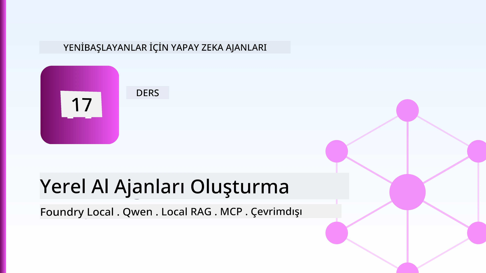
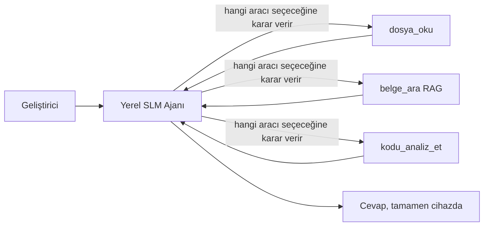
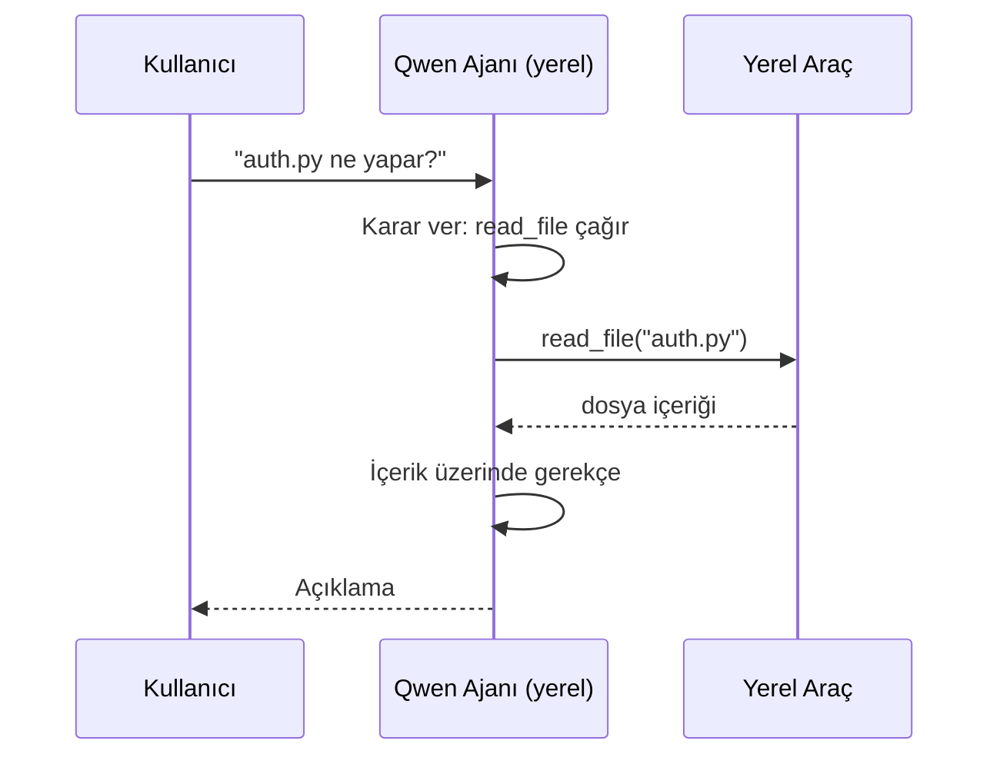
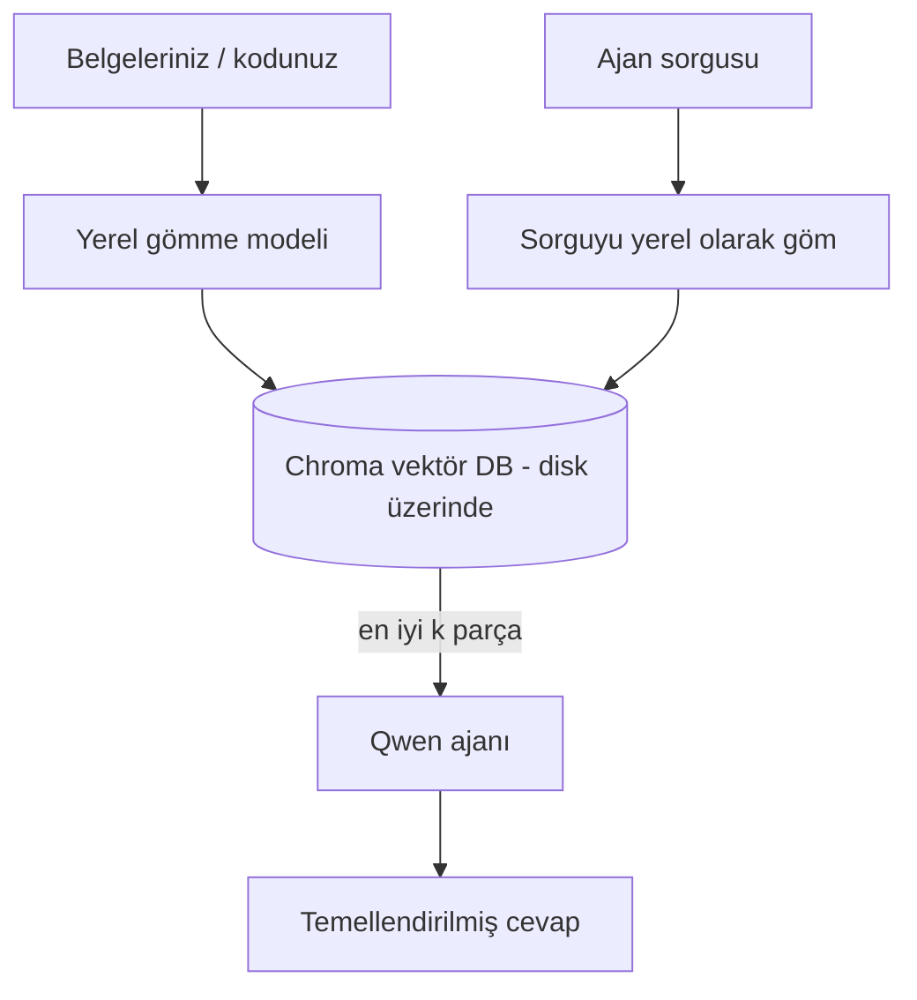
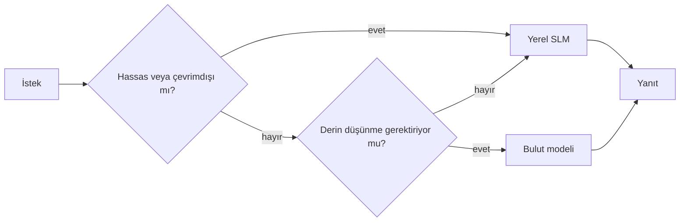

# Microsoft Foundry Local ve Qwen Kullanarak Yerel AI Ajanları Oluşturma



Önceki ders, ajanları buluta *yukarı* ölçeklendirdi. Bu ders ise onları tek bir makineye *aşağı* indiriyor. Dersin sonunda, mantık yürüten, araçları çağıran, dosyalarınızı okuyan ve dokümantasyonunuzu arayan çalışan bir mühendislik asistanınız olacak — **tek bir bulut çıkarım çağrısı olmadan.**

Neden bunu istersiniz? Gerçek mühendislik işlerinde sürekli karşımıza çıkan üç neden:

- **Gizlilik.** Kod ve dökümanlar asla makineden dışarı çıkmaz. Hiçbir istem, parça veya müşteri verisi ağ sınırını geçmez.
- **Maliyet.** Yerel çıkarım için token başına ücret yoktur. Elektrik fiyatına bütün gün yineleyebilirsiniz.
- **Çevrimdışı.** Uçakta, güvenli bir tesiste ya da kesinti sırasında ajan yine çalışır.

Fakat burada değiş tokuş ettiğiniz şey öncü bir bulut modeli yerine CPU, GPU veya NPU’nuzda çalışan bir **Küçük Dil Modeli (SLM)**. Bu ders, kısıt altında *iyi* yerel ajanlar inşa etmekle ilgili, kısıtı yok saymak değil.

## Giriş

Bu ders şunları kapsayacak:

- **Küçük Dil Modelleri (SLM’ler)** — ne oldukları, nerede başarılı oldukları ve nerede olmadıkları.
- **Microsoft Foundry Local** — cihazda modelleri indirip servis eden ve **OpenAI uyumlu API** sunan bir çalışma zamanı.
- **Qwen fonksiyon çağırma modelleri** — yerel *ajanları* (sadece yerel sohbet değil) mümkün kılan güvenilir araç çağrıları üreten SLM’ler.
- **Yerel araçlar, yerel RAG ve yerel MCP** — ajanı bulut olmadan yeteneklendirmek.
- **Hibrit desenler** — ne zaman yerelde kalmalı, ne zaman buluta yönelmeli.

## Öğrenme Hedefleri

Bu dersi tamamladıktan sonra şunları yapabileceksiniz:

- SLM’lerin avantajlarını ve dezavantajlarını açıklamak ve uygun yerel ajan kullanım senaryolarını seçmek.
- Foundry Local ile bir Qwen modelini yerelde servis etmek ve OpenAI uyumlu uç nokta üzerinden bağlantı kurmak.
- Tümüyle kendi çalışma istasyonunuzda çalışan araç çağıran bir ajan inşa etmek.
- Yerel vektör veritabanı (Chroma) kullanarak kendi dökümanlarınız üzerinde yerel RAG eklemek.
- Ajanı yerel MCP sunucusuna bağlamak ve hibrit yerel/bulut tasarımlar hakkında düşünmek.

## Önkoşullar

Bu ders, önceki dersleri tamamladığınızı ve şunlarda rahat olduğunuzu varsayar:

- [Araç Kullanımı](../04-tool-use/README.md) (Ders 4) ve [Agentic RAG](../05-agentic-rag/README.md) (Ders 5).
- [Agentic Protokoller / MCP](../11-agentic-protocols/README.md) (Ders 11).
- [Microsoft Agent Framework](../14-microsoft-agent-framework/README.md) (Ders 14).

Ayrıca ihtiyacınız olacak:

- Bir geliştirici çalışma istasyonu. **8 GB RAM gerçekçi bir minimumdur**; 16 GB+ ise rahat bir kullanımı sağlar. GPU veya NPU yardımcı olur ama zorunlu değildir.
- **Microsoft Foundry Local** yüklü (aşağıdaki kurulum bölümüne bakınız).
- Python 3.12+ ve bu ders için depodaki [`requirements.txt`](../../../requirements.txt), ayrıca `foundry-local-sdk`, `openai` ve `chromadb` paketleri.

## Küçük Dil Modelleri: Yerel İş İçin Doğru Araç

Öncü bir bulut modeli yüzlerce milyar parametreye ve arkasında bir veri merkezine sahiptir. Bir SLM ise birkaç milyar parametreye sahip ve dizüstü bilgisayarınızın RAM’ine sığmak zorundadır. Bu fark net beklentiler belirler.

**SLM’ler şu konularda iyidir:**

- Yapılandırılmış, sınırlı görevler — sınıflandırma, çıkarım, bilinen bir belgenin özetlenmesi.
- **Araç çağırma** — hangi fonksiyonun hangi argümanlarla çağrılacağına karar verme.
- Kendi verileriniz üzerinde hızlı, ucuz ve gizli yinelemeler yapma.

**SLM’ler şu konularda zayıftır:**

- Açık uçlu, çok adımlı büyük bağlamlarda akıl yürütme.
- Geniş dünya bilgisi (daha az görmüşler ve daha fazla unutmuşlar).

Bu yüzden yerel ajanlar için kazanan strateji: **SLM düzenleyici olsun, ağır işleri araçlar yapsın.** Model kod tabanınızı *bilmek* zorunda değil; `read_file` ve `search_docs` fonksiyonlarını ne zaman çağıracağını bilmek yeter. Bu, SLM’nin güçlü yönlerine doğrudan hizmet eder.



## Microsoft Foundry Local

**Microsoft Foundry Local**, modelleri tamamen makinenizde indirip yöneten ve servis eden hafif bir çalışma zamanıdır. Bizim için en önemli özelliği, **OpenAI uyumlu bir HTTP uç noktası** sunmasıdır — bu da OpenAI SDK ve Microsoft Agent Framework’un OpenAI istemcisinin sadece `base_url` değiştirerek çalışması demektir. Ajan inşa etmede öğrendiğiniz her şey doğrudan aktarılır; tek değişen buluttan `localhost`a uç noktanın taşınmasıdır.

Foundry Local ayrıca donanımınıza otomatik olarak en uygun model yapısını seçer — CPU yapısı, CUDA/GPU yapısı veya NPU yapısı — böylece her makine için elle optimizasyon yapmanıza gerek kalmaz.

### Kurulum

Foundry Local’ı kurun (işletim sisteminiz için [belgelere](https://learn.microsoft.com/azure/ai-foundry/foundry-local/) bakabilirsiniz), ardından çalıştığını doğrulayın:

```bash
# Kurulum (örnek; platformunuz için belgeleri takip edin)
winget install Microsoft.FoundryLocal      # Windows
# brew install microsoft/foundrylocal/foundrylocal   # macOS

# Bir Qwen modeli indirip çalıştırın, ardından yerel servisi başlatın
foundry model run qwen2.5-7b-instruct
foundry service status
```

Hizmet çalışmaya başladıktan sonra yerel, OpenAI uyumlu bir uç noktanız olur (genellikle `http://localhost:PORT/v1`). Dizüstü defter `foundry-local-sdk` kullanarak uç noktayı otomatik keşfeder, böylece portu sabit kodlamanız gerekmez.

## Qwen Fonksiyon Çağırma: Neden Önemli?

Bir ajan sadece araç çağırabiliyorsa gerçek bir ajandır. Birçok SLM sohbet edebilir ama güvenilir olmayan, yanlış biçimlendirilmiş araç çağrıları üretir. **Qwen** modelleri fonksiyon çağırmaya yönelik eğitilmiş ve tutarlı biçimde iyi biçimlendirilmiş araç çağrıları üretir — bu, bir yerel sohbet modelini yerel *ajan* haline getirir.

Akış, zaten bildiğiniz standart araç çağırma döngüsü, sadece cihazda çalışıyor:



## Yerel RAG

Dokümantasyon araması, yerel ajanların değer kazandığı yerdir. SLM’nin çerçevenizin dokümanlarını ezberlediğini ummak yerine, o dokümanları **yerel vektör veritabanına** gömüyor ve ajan talep üzerine ilgili parçaları getiriyor.

Biz **Chroma** kullanıyoruz, yönetilmesi için sunucusu olmayan, işlem içinde çalışan gömülü bir vektör deposu. İşlem tamamen yereldir: yerel gömme modeli → yerel vektörler → yerel getirme → yerel SLM.



Bu, Ders 5’teki aynı Agentic RAG desenidir — tek fark bütün bileşenlerin makinenizde çalışmasıdır.

## Yerel MCP Sunucuları

[MCP](../11-agentic-protocols/README.md) bir taşıma protokolüdür, bulut servisi değil. Bir MCP sunucu yerel süreç olarak `stdio` üzerinde çalışabilir ve standart protokol üzerinden araçları ajanınıza açabilir. Bu, dosya sistemi erişimi, git işlemleri, veri tabanı sorguları gibi MCP sunucu ekosistemini tamamen çevrimdışı olarak yeniden kullanmanıza olanak sağlar.

Güvenlik duruşu buluttan farklıdır ama yok değildir: yerel MCP sunucu hala kullanıcınızın izinleriyle çalışır, o yüzden erişebileceği alanı sınırlandırın (örneğin tüm ev klasörünüz değil, bir proje dizini) ve çıktıları işlemden önce doğrulamak için girdi gibi ele alın.

## Hibrit Bulut ve Yerel Desenler

Yerel öncelik, sadece yerel anlamına gelmez. Olgun sistemler duyarlılığa ve zorluğa göre yönlendirme yapar:

| Durum | Nerede çalışır |
| --- | --- |
| Hassas kod / veri ya da çevrimdışı | **Yerel SLM** |
| Basit, sınırlı görev | **Yerel SLM** (ucuz, hızlı) |
| Hassas olmayan verilerde zor çok adımlı akıl yürütme | **Bulut modeli** |
| Kesinti sırasında her şey | **Yerel SLM** (zarif bozulma) |

Bu, Ders 16’daki **model yönlendirmesi** fikrini yansıtıyor — ancak "modellerden" biri artık kendi makineniz. Sağlam bir tasarım bulut kullanılamadığında yerel yola geri döner, böylece ajan tamamen başarısız olmak yerine kalite olarak düşer.



## Uygulamalı Laboratuvar: Yerel Bir Mühendislik Asistanı

[`code_samples/17-local-agent-foundry-local.ipynb`](./code_samples/17-local-agent-foundry-local.ipynb) dosyasını açın ve üzerinden geçin. Tümüyle çalışma istasyonunuzda çalışan **yerel bir mühendislik asistanı** inşa edeceksiniz ve bu asistan:

1. **Araçları çağırabilir** — Foundry Local üzerinden Qwen fonksiyon çağrısı yaparak.
2. **Yerel dosya işlemleri yapabilir** — bir proje dizinindeki dosyaları listeleyip okuyabilir.
3. **Kodu analiz edebilir** — bir kaynak dosya üzerinde temel metrikler raporlar.
4. **Dokümantasyonu arayabilir** — Chroma ile yerel RAG kullanarak bir dokümanlar klasöründe.
5. **MCP kullanabilir** — yerel bir MCP sunucuya bağlanabilir (hiçbiri yapılandırılmamışsa zarifçe atlar).

Hiçbir aşamada bulut çıkarımı kullanılmaz.

### Adım Adım Açıklama

Asistan Foundry Local’a OpenAI uyumlu uç nokta üzerinden bağlanır, yani ajan kodu bulut derslerine neredeyse tamamen benzer — sadece istemci değişir:

```python
from foundry_local import FoundryLocalManager
from openai import OpenAI

# Foundry Local modeli bulur/indirir ve bize yerel bir uç nokta sağlar.
manager = FoundryLocalManager(\"qwen2.5-7b-instruct\")
client = OpenAI(base_url=manager.endpoint, api_key=manager.api_key)  # api_key yerel bir yer tutucudur
```

Araçlar, bir proje dizinine bağlı sıradan Python fonksiyonlarıdır:

```python
def read_file(path: str) -> str:
    \"\"\"Read a file, but only inside the sandboxed project directory.\"\"\"
    full = (PROJECT_ROOT / path).resolve()
    if PROJECT_ROOT not in full.parents and full != PROJECT_ROOT:
        return \"Access denied: path is outside the project directory.\"
    return full.read_text(encoding=\"utf-8\")
```

Sandbox kontrolüne dikkat edin — hatta yerel olarak bile, keyfi yolları okuyan bir araç risklidir. Dizüstü defter her aracı tek bir proje köküne sınırlar.

## Bilgi Kontrolü

Göreve geçmeden önce anladığınızdan emin olun.

**1. Bulut yerine ajanı yerelde çalıştırmak için iki somut sebep verin.**

<details>
<summary>Cevap</summary>

Şunlardan herhangi ikisi: **gizlilik** (kod ve veri asla makineden çıkmaz), **maliyet** (token başına çıkarım faturası yok), ve **çevrimdışı çalışma yeteneği** (ağ olmadan, uçakta, güvenli tesiste ya da kesinti sırasında çalışır). Veriyi cihaz dışına gönderme yasağı getiren düzenleyici/talimat kısıtlamaları gizlilik nedenine sıkça yol açar.
</details>

**2. Yerel ajanda SLM ile araçlar arasında önerilen iş bölümü nedir ve neden?**

<details>
<summary>Cevap</summary>

SLM **düzenleyici olsun** (hangi aracı hangi argümanla çağıracağına karar versin) ve **ağır işleri araçlar yapsın** (dosyaları okumak, dokümanları getirmek, sonuçları hesaplamak). SLM’ler araç seçimi gibi sınırlı kararlarda güçlü ama geniş bilgi ve uzun çok adımlı akıl yürütmede zayıftır, bu yüzden araçlara dayanmak onların güçlü yönlerine hizmet eder.
</details>

**3. Bulut ajan kodunu Foundry Local ile yeniden kullanmak nasıl mümkün oluyor?**

<details>
<summary>Cevap</summary>

Foundry Local **OpenAI uyumlu bir HTTP uç noktası** sunar. OpenAI SDK ve Agent Framework'un OpenAI istemcisi sadece `base_url` değiştirerek (ve yerel bir sahte API anahtarı kullanarak) bu uç noktaya bağlanır. Ajan kodundaki diğer her şey aynı kalır.
</details>

**4. Neden herhangi bir SLM yerine özellikle Qwen fonksiyon çağırma modeli kullanıyoruz?**

<details>
<summary>Cevap</summary>

Çünkü ajan güvenilir, iyi biçimlendirilmiş **araç çağrıları** üretmek zorunda. Birçok SLM sohbet edebilir ama biçimsiz veya tutarsız araç çağrıları üretir. Qwen modeller fonksiyon çağırmaya yönelik eğitilmiş ve tutarlı araç çağrıları üretir; bu, yerel sohbet modelini çalışan bir yerel ajana dönüştürür.
</details>

**5. Yerel RAG boru hattında hangi bileşenler makinede çalışır?**

<details>
<summary>Cevap</summary>

Hepsi: gömme modeli, vektör veritabanı (Chroma, disk üzerinde), getirme adımı ve SLM. Dokümanlar yerelde gömülür, yerelde saklanır, yerelde getirilir ve yerel model tarafından mantık yürütülür — hiçbir bileşen bulutla temas etmez.
</details>

**6. Yerel bir MCP sunucu makinenizde çalışıyor. Bu onu otomatik olarak güvenli yapar mı? Hangi önlemi almalısınız?**

<details>
<summary>Cevap</summary>

Hayır. Yerel MCP sunucu kullanıcı izinlerinizle çalışır, dolayısıyla sizin erişebileceğiniz her şeye erişebilir. İhtiyacı olanla sınırlandırın (örneğin tüm ev klasörünüz değil, tek bir proje dizini) ve çıktıları işlem yapmadan önce doğrulamak için girdi gibi ele alın.
</details>

**7. Yerel modeli içeren mantıklı bir hibrit yönlendirme kuralını tanımlayın.**

<details>
<summary>Cevap</summary>

Hassas veya çevrimdışı istekleri yerel SLM’ye yönlendir; basit sınırlı görevleri hız ve maliyet için yerel SLM’ye yönlendir; hassas olmayan verilerde zor çok adımlı akıl yürütmeyi bulut modeline yönlendir; bulut kullanılamazsa yerel SLM’ye geri dönerek ajanın tamamen başarısız olmak yerine nazikçe bozulmasını sağla. Bu, Ders 16’daki model yönlendirme olup yerel makinenin modellerden biri olmasıdır.
</details>

**8. Bu derste yerel ajanı çalıştırmak için gerçekçi minimum RAM miktarı nedir ve daha fazla RAM size ne sağlar?**

<details>
<summary>Cevap</summary>

Yaklaşık **8 GB** gerçekçi bir minimumdur; 16 GB+ rahat bir kullanımdır. Daha fazla RAM, daha büyük ve yetenekli modeller çalıştırmanızı ve daha fazla bağlamı hafızada tutmanızı sağlar. GPU veya NPU çıkarımı hızlandırır ama zorunlu değildir — Foundry Local hızlandırıcı yoksa CPU yapısını seçer.
</details>

## Ödev

Yerel mühendislik asistanınızı, seçtiğiniz küçük bir proje için **yerel bir dokümantasyon inceliyicisi** olarak genişletin (isterseniz bu repodaki ders klasörlerinden birini kullanabilirsiniz).

Teslimatınız şunları içermelidir:

1. Beş dosyadan az olmamak üzere gerçek bir dokümanlar/kod klasörünü Chroma’ya **indekslemek**.
2. Projeyi `TODO`/`FIXME` yorumları için tarayan ve bunları dosya ve satır numarası ile birlikte geri döndüren bir `find_todos` aracı eklemek — `read_file` için geçen sandbox kontrolünü koruyarak.

3. **Ajanı, araçları birleştirmeye zorlayan üç soru sorun**: biri saf RAG sorusu, biri belirli bir dosyayı okumayı gerektiren ve biri TODO'ları bulmayı gerektiren.
4. **Ölçün**: üç cevabın her birinin sürelerini alın ve bunları bir markdown hücresinde not edin. Gecikmenin niyet ettiğiniz iş akışı için kabul edilebilir olup olmadığını yorumlayın.

Ardından bu değerlendirici için **buluta neyi taşıyacağınızı ve yerelde neyi tutacağınızı** ve nedenini kısa bir paragraf halinde yazın. Değerlendirme, yerel bileşenlerin doğru şekilde bir araya getirilip getirilmediği ve hibrit akıl yürütmenizin sağlam olup olmadığı üzerinden yapılır — model kalitesi üzerinden değil.

## Özet

Bu derste tamamen kendi makinenizde çalışan bir ajan oluşturdunuz:

- **SLM'ler** kapsamı gizlilik, maliyet ve çevrimdışılık karşılığında değiş tokuş eder — ve tüm bilgiyi kendileri taşımaktansa **araçları koordine ettiklerinde** parıldarlar.
- **Foundry Local**, modelleri cihazda **OpenAI uyumlu bir uç noktanın** arkasında sunar, böylece bulut ajan kodunuz tek satırlık bir değişiklikle transfer olur.
- **Qwen işlev çağırma modelleri**, güvenilir yerel araç çağrısını — ve dolayısıyla yerel *ajanları* — mümkün kılar.
- **Yerel RAG** (Chroma) ve **yerel MCP** makineyi terk etmeden ajan yeteneği verir.
- **Hibrit desenler**, duyarlılık ve zorluk bazında yönlendirme yapmanızı sağlar, yerel ise zarif bir yedekleme olarak kullanılır.

Bu, dağıtım yayını tamamlar: 16. Ders, ajanları Microsoft Foundry'ye ölçeklendirdi, bu ders ise onları tek bir çalışma istasyonuna küçülttü. Bir sonraki ders, dağıtılmış ajanların güvenliğini sağlamaya odaklanır.

## Ek Kaynaklar

- <a href="https://learn.microsoft.com/azure/ai-foundry/foundry-local/" target="_blank">Microsoft Foundry Local dokümantasyonu</a>
- <a href="https://learn.microsoft.com/azure/ai-foundry/what-is-azure-ai-foundry" target="_blank">Microsoft Foundry dokümantasyonu</a>
- <a href="https://aka.ms/ai-agents-beginners/agent-framework" target="_blank">Microsoft Agent Framework</a>
- <a href="https://qwen.readthedocs.io/en/latest/framework/function_call.html" target="_blank">Qwen işlev çağırma dokümantasyonu</a>
- <a href="https://modelcontextprotocol.io/" target="_blank">Model Context Protocol (MCP)</a>
- <a href="https://docs.trychroma.com/" target="_blank">Chroma vektör veritabanı</a>

## Önceki Ders

[Ölçeklenebilir Ajanların Dağıtımı](../16-deploying-scalable-agents/README.md)

## Sonraki Ders

[AI Ajanlarının Güvenliğini Sağlama](../18-securing-ai-agents/README.md)

---

<!-- CO-OP TRANSLATOR DISCLAIMER START -->
**Feragatname**:
Bu belge, AI çeviri hizmeti [Co-op Translator](https://github.com/Azure/co-op-translator) kullanılarak çevrilmiştir. Doğruluk için çaba sarf etsek de, otomatik çevirilerin hata veya yanlışlık içerebileceğini lütfen unutmayınız. Orijinal belge, kendi dilinde yetkili kaynak olarak kabul edilmelidir. Kritik bilgiler için profesyonel insan çevirisi önerilir. Bu çevirinin kullanımı sonucu ortaya çıkabilecek yanlış anlamalardan veya yanlış yorumlamalardan sorumlu değiliz.
<!-- CO-OP TRANSLATOR DISCLAIMER END -->