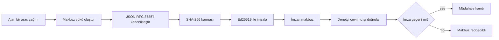
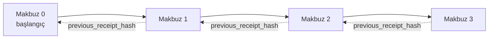

[Ders videosunu izleyin: Kriptografik Makbuzlarla AI Ajanlarını Güvenceye Alma](https://youtu.be/PLACEHOLDER_VIDEO_ID)

> _(Ders videosu ve küçük resim, birleştirme sonrası Microsoft içerik ekibi tarafından eklenecek, ders 14 / 15 kalıbıyla uyumlu olacak.)_

# Kriptografik Makbuzlarla AI Ajanlarını Güvenceye Alma

## Giriş

Bu ders şunları kapsayacak:

- AI ajanları için denetim izlerinin uyumluluk, hata ayıklama ve güven açısından neden önemli olduğu.
- Kriptografik makbuzun ne olduğu ve imzasız bir günlük satırından nasıl farklılaştığı.
- Bir ajanın araç çağrısı için imzalı makbuzun sade Python'da nasıl üretileceği.
- Bir makbuzun çevrimdışı nasıl doğrulanacağı ve tahrifatın nasıl tespit edileceği.
- Makbuzların nasıl zincirlenebileceği, böylece bir makbuzun çıkarılması veya sırasının değiştirilmesinin zinciri bozması.
- Makbuzların neyi kanıtladığı ve neyi açıkça kanıtlamadığı.

## Öğrenme Hedefleri

Bu dersi tamamladıktan sonra şunları bileceksiniz:

- Kriptografik kökenin ajanın eylemleri için neden gerekli olduğunu açıklayan başarısızlık modlarını tanımlamak.
- Kanonik JSON yükü üzerinde Ed25519 imzalı bir makbuz üretmek.
- Sadece imzalayanın açık anahtarını kullanarak bir makbuzun bağımsız doğrulamasını yapmak.
- Değiştirilmiş bir makbuz üzerinde doğrulamayı tekrar çalıştırarak tahrifatı tespit etmek.
- Hash zincirli bir makbuz dizisi oluşturmak ve zincirin neden önemli olduğunu açıklamak.
- Makbuzların kanıtladığı (aitiyet, bütünlük, sıralama) ile kanıtlamadığı (eylemin doğruluğu, politikanın sağlamlığı) arasındaki sınırı fark etmek.

## Sorun: Ajanınızın Denetim Kaydı

Contoso Travel için bir AI ajanı dağıttığınızı hayal edin. Ajan müşteri taleplerini okur, uçuş API'sini çağırarak seçeneklere bakar ve müşterinin adına koltuk rezervasyonu yapar. Geçen çeyrekte, ajan 50.000 rezervasyon işledi.

Bugün bir denetçi gelir. Basit bir soru sorar: "Ajanınızın ne yaptığını gösterin."

Günlük dosyalarınızı teslim edersiniz. Denetçi belgeleri inceler ve zor soruyu sorar: "Bu günlüklerin değiştirilmediğini nasıl biliyorum?"

Bu denetim izi sorunudur. Bugün çoğu ajan dağıtımı şunlara güvenir:

- **Uygulama günlükleri**: ajanın kendisi tarafından yazılır, dosya sistemi erişimi olan herkes tarafından düzenlenebilir.
- **Bulut kayıt hizmetleri**: platform düzeyinde tahrifata karşı korumalı ancak sadece denetçi platform işletmecisine güvenirse geçerli.
- **Veritabanı işlem günlükleri**: veritabanı değişiklikleri için uygundur ama rastgele araç çağrıları için değil.

Bu hiçbirisi denetçinin sorusunu cevaplayamaz, denetçinin birine (size, bulut sağlayıcınıza, veritabanı satıcınıza) güvenmesini gerektirir. Dahili kullanımda bu güven genellikle kabul edilir. Düzenlenen iş yükleri için (finans, sağlık, AB AI Yasası kapsamındakiler) kabul edilmez.

Kriptografik makbuzlar, her ajan eyleminin bağımsız olarak doğrulanabilmesini sağlayarak bunu çözer. Denetçinin size güvenmesi gerekmez; sadece açık anahtarınız ve makbuz yeterlidir.

## Kriptografik Makbuz Nedir?

Makbuz, bir ajanın ne yaptığını kaydeden ve dijital imzayla imzalanan bir JSON nesnesidir.



Minimal bir makbuz şöyle görünür:

```json
{
  "type": "agent.tool_call.v1",
  "agent_id": "contoso-travel-bot",
  "tool_name": "lookup_flights",
  "tool_args_hash": "sha256:a3f9c1...",
  "result_hash": "sha256:7b2e1d...",
  "policy_id": "contoso-travel-policy-v3",
  "timestamp": "2026-04-25T14:30:00Z",
  "sequence": 47,
  "previous_receipt_hash": "sha256:9d4e6a...",
  "signature": {
    "alg": "EdDSA",
    "sig": "c5af83...",
    "public_key": "8f3b2c..."
  }
}
```

Üç özellik görev yapmaktadır:

1. **İmza**. Makbuz, ajanın geçidi tarafından Ed25519 özel anahtarı kullanılarak imzalanır. İlgili açık anahtara sahip herkes imzayı çevrimdışı doğrulayabilir. Herhangi bir alanın tahrif edilmesi imzayı geçersiz kılar.

2. **Kanonik kodlama**. İmzalamadan önce makbuz JSON Kanonikleştirme Şeması (JCS, RFC 8785) kullanılarak serileştirilir. Bu, aynı mantıksal makbuzu üreten iki uygulamanın aynı baytlar dizisini vermesini sağlar. Kanonikleştirme olmadan farklı JSON serileştiriciler aynı içerik için farklı imzalar üretirdi.

3. **Hash zincirleme**. `previous_receipt_hash` alanı her makbuzu bir öncekine bağlar. Bir makbuzun çıkarılması veya sırasının değiştirilmesi sonrasındaki tüm makbuzları geçersiz kılar. Bireysel imzalar atlanmış olsa bile zincir düzeyinde tahrifat görünür hale gelir.

Birlikte bu özellikler üç garanti sağlar:

- **Aitiyet**: bu anahtar bu içeriği imzaladı.
- **Bütünlük**: içerik imzalandığından beri değişmedi.
- **Sıralama**: bu makbuz zincirde o makbuzdan sonra geldi.

## Python'da Makbuz Üretmek

Makbuz üretmek için özel bir kütüphaneye ihtiyacınız yok. Kriptografik ilkel araçlar yaygın ve mantık birkaç düzine Python satırından oluşur.

`code_samples/18-signed-receipts.ipynb` elinizdeki pratik uygulamalar tam akışı anlatır. Özet sürümü:

```python
import json
import hashlib
import base64
from nacl import signing
from jcs import canonicalize  # RFC 8785 kanonik JSON

def b64url_nopad(data: bytes) -> str:
    return base64.urlsafe_b64encode(data).decode("ascii").rstrip("=")

def sha256_canonical(obj) -> str:
    """SHA-256 of a Python object's JCS-canonical JSON form."""
    return f"sha256:{hashlib.sha256(canonicalize(obj)).hexdigest()}"

# İmzalama anahtarı oluştur veya yükle (üretimde, bir anahtar kasasında sakla)
signing_key = signing.SigningKey.generate()
verify_key = signing_key.verify_key

# Makbuz yükünü oluştur (henüz imza yok)
tool_args = {"origin": "SYD", "destination": "LAX"}
tool_result = [{"flight": "QF11", "price": 1850, "stops": 0}]

payload = {
    "type": "agent.tool_call.v1",
    "agent_id": "contoso-travel-bot",
    "tool_name": "lookup_flights",
    "tool_args_hash": sha256_canonical(tool_args),
    "result_hash": sha256_canonical(tool_result),
    "policy_id": "contoso-travel-policy-v3",
    "timestamp": "2026-04-25T14:30:00Z",
    "sequence": 0,
    "previous_receipt_hash": None,
}

# Kanonik hale getir, hashle, imzala.
canonical_bytes = canonicalize(payload)
message_hash = hashlib.sha256(canonical_bytes).digest()
signature_bytes = signing_key.sign(message_hash).signature

# Yapılandırılmış bir imza nesnesi ekle.
receipt = {
    **payload,
    "signature": {
        "alg": "EdDSA",
        "sig": b64url_nopad(signature_bytes),
        "public_key": b64url_nopad(bytes(verify_key)),
    },
}
```

Bu tüm imzalama hattıdır. Defterdeki alıştırmalar her adımı detaylandırır.

## Makbuzu Doğrulamak ve Tahrifatı Tespit Etmek

Doğrulama işleminin tersi şeklidir:

```python
import base64
import hashlib
from nacl import signing
from nacl.exceptions import BadSignatureError
from jcs import canonicalize

def b64url_decode(s: str) -> bytes:
    padding = "=" * ((4 - len(s) % 4) % 4)
    return base64.urlsafe_b64decode(s + padding)

def verify_receipt(receipt: dict) -> bool:
    # İmza yapılandırılmış bir nesnedir: {"alg", "sig", "public_key"}.
    sig_obj = receipt.get("signature")
    if not sig_obj or sig_obj.get("alg") != "EdDSA":
        return False

    # Gerçekten imzalanan yükü yeniden oluşturun (imza dışındaki her şey).
    payload = {k: v for k, v in receipt.items() if k != "signature"}

    canonical_bytes = canonicalize(payload)
    message_hash = hashlib.sha256(canonical_bytes).digest()

    try:
        verify_key = signing.VerifyKey(b64url_decode(sig_obj["public_key"]))
        verify_key.verify(message_hash, b64url_decode(sig_obj["sig"]))
        return True
    except BadSignatureError:
        return False
```

Bu fonksiyon bir makbuz alır ve imza geçerliyse `True`, değilse `False` döner. Ağ çağrısı yok, servis bağımlılığı yok, üçüncü taraf güveni gerektirmez.

Tahrifat tespitinin çalışmasını görmek için defterde şunlar anlatılır:

1. Geçerli bir makbuz üretmek ve doğrulamanın başarılı olduğunu görmek.
2. `tool_args_hash` alanından bir bayt değiştirmek.
3. Tekrar doğrulamayı çalıştırmak ve başarısız olduğunu görmek.

Bu, makbuzların tahrifata karşı korumalı olduğunu pratikte gösterir: her türlü değişiklik, çok küçük olsa bile, imzayı bozar.

## Çok Adımlı Ajanlar İçin Makbuz Zinciri

Tek bir imzalı makbuz bir eylemi korur. Bir makbuz zinciri bir diziyi korur.



Her makbuz, öncekine ait makbuzun hash'ini kaydeder. Makbuz 2'yi sessizce kaldırmak isteyen bir saldırgan şunlardan birini yapmak zorundadır:

- Makbuz 3'ün `previous_receipt_hash` alanını değiştirmek (makbuz 3'ün imzası bozulur) YA DA
- Değiştirilmiş makbuz 3 üzerinde yeni bir imza sahtelemek (ajanın özel anahtarı gereklidir).

Özel anahtar bir donanım anahtar kasasında ise ve her makbuzla açık anahtar yayınlanıyorsa, hiçbir saldırı tespit edilmeden mümkün değildir.

Defterde şunlar anlatılır:

1. Üç makbuzluk bir zincir inşa etmek.
2. Her makbuzun `previous_receipt_hash` değerinin önceki makbuzun gerçek hash'i olduğunun doğrulanması.
3. Ortadaki bir makbuzda tahrifat yapmak ve zincirin tam o noktada kırıldığını görmek.

Bu, harici bir denetçinin size güvenmeden doğrulayabileceği bir denetim izi nasıl üretilir onu gösterir.

## Makbuzların Kanıtladıkları (Ve Kanıtlamadıkları)

Bu dersin en önemli bölümüdür. Makbuzlar güçlüdür ama gücü sınırlandırılmıştır.

**Makbuzlar üç şey kanıtlar:**

1. **Aitiyet**: belirli bir anahtar belirli bir yükü imzaladı.
2. **Bütünlük**: yük imzalandığından beri değişmedi.
3. **Sıralama**: bu makbuz hash zincirinde önceki makbuzdan sonra geldi.

**Makbuzlar şunları kanıtlamaz:**

1. **Doğruluk**: ajanın eyleminin doğru eylem olduğu. Yanıt doğru olsa da yanlış olsa da makbuz imzalanabilir.
2. **Politika uyumu**: `policy_id` içindeki politikanın gerçekten değerlendirildiği ya da kontrol edilse eyleme izin verip vermeyeceği. Makbuz, ne iddia edildiğini kaydeder, ne uygulanandan bahsetmez.
3. **Anahtar dışı kimlik**: makbuz "bu anahtar bu içeriği imzaladı" der, "bu insan yetkilendirdi" demez. Anahtarın bir kişiye ya da kuruluşa bağlanması ayrı kimlik altyapısı gerektirir (dizin, açık anahtar kaydına vs.).
4. **Girdilerin doğruluğu**: ajan manipüle edilmiş bir komut alır ve buna göre hareket ederse, makbuz bu eylemi olduğu gibi kaydeder. Makbuzlar giriş doğrulamanın yerine değil, sonrasındadır.

Bu sınır iki nedenle önemlidir:

- Makbuzların ne işe yaradığını gösterir: ajan davranışını denetlenebilir ve tahrifata karşı korumalı yapmak, hatta organizasyon sınırlarında bile.
- Hangi ek katmanlara ihtiyacınız olduğunu belirtir: giriş doğrulama (Ders 6), politika uygulama (aşağıda kısa anlatım), ve kimlik altyapısı (bu ders kapsamı dışı).

Yaygın hata, "makbuzlarımız var" demenin "denetleniyoruz" demek olduğunu varsaymaktır. Değil. Makbuzlar temeldir. Denetim, üzerine inşa ettiğiniz sistemdir.

## Bir İnsan Tam Yetkilendirmeyi Kanıtlamak

Üstteki madde 3 kendi bölümünü hak eder: bir eylem makbuzu "bu anahtar bu içeriği imzaladı" der, "bir insan yetkilendirdi" demez. Yüksek riskli eylemler için (iade, silme, havale) yönetişim çerçeveleri giderek bu eksik ifadeyi zorunlu kılmakta ve bunu bu derste zaten kurduğunuz ilkelere dayanarak üretmek mümkün.

Sonraki defter `code_samples/human-authorization-receipts.ipynb`, ders makbuzlarıyla aynı zarfta ikinci bir makbuz türü `human.approval.v1` ekler (typed payload, Ed25519 ile kanonik SHA-256 üzerinde imzalanmış, imza objesi imzalanan baytların dışındadır). İmzacı, **tam kanonik eylemi ve onun özeti** yürütmeden önce imzalar; ajanın eylem makbuzu **aynı eylem özetine** ve `parent_approval_ref` — onay makbuzunun `receipt_hash`ı — sahiptir, bu zincirde oluşturduğunuz `previous_receipt_hash` ile aynı sözleşme. Bir tane `verify_chain`, iki farklı anahtar kaydı altında (onaycı anahtarları ve ajan anahtarları) her iki belgeyi de doğrular, böylece kod ortak ama yetkililer hiç ortak değildir.

Bu özellik dikkatli ifade edilirse: *insan bu tam eylemi onayladı ve ajan da tam olarak onaylanan eylemi gerçekleştirdi.* Defterdeki ret durumları bu özelliği varsayılan değil gerçek yapar:

- klasik set: tahrifat, karışık aracı, tekrar oynatma, iki taraflı sahte anahtarlar, hatalı giriş;
- **eski yetki**: hâlâ doğrulanan ama reddedilen imzalar, çünkü politika versiyonu değişti, onaycı anahtarı kayıttan çıkarıldı ya da onay yürütmeden önce süresi doldu;
- **özüt ikamesi**: gerçek bir onaya işaret eden geçerli imzalı eylem makbuzu ama farklı bir kanonik eylemi bağlar.

Her hata farklı bir gerekçe ile reddedilir, böylece bir denetçi bir reddi okuduğunda yetkinin eski mi yoksa yürütülen eylemin mi değiştiğini anlayabilir. Defterde öğretilen kural: imzalı onay tek başına yetki değildir. Yetki ancak her iki makbuz da yürütme zamanında aynı kanonik eylemi bağlıyorsa vardır. Bu dersin takip ettiği aynı Internet Taslağındaki (`draft-farley-acta-signed-receipts`) ortak imzalama yolu bu desenin standart yoludur.

## Üretim İçin Referanslar

Bu derste Python kodu kasıtlı olarak minimaldır, böylece her satırı okuyup tam olarak ne olduğunu anlayabilirsiniz. Üretimde iki seçeneğiniz vardır:

1. **Kriptografik ilkelere doğrudan dayanın.** Yukarıdaki 50 satır birçok kullanım durumu için yeterlidir. PyNaCl (Ed25519) ve `jcs` paketi (kanonik JSON) iyi bakılan ve denetlenen kütüphanelerdir.

2. **Üretim makbuz kütüphanesi kullanın.** Birkaç açık kaynak proje aynı deseni ek özelliklerle uygular (anahtar rotasyonu, toplu doğrulama, JWK Set dağıtımı, politika motorları ile entegrasyon):
   - Bu derste kullanılan makbuz formatı IETF Internet Taslağıdır ([`draft-farley-acta-signed-receipts`](https://datatracker.ietf.org/doc/draft-farley-acta-signed-receipts/), revizyon 02) ve şu anda standart sürecindedir, bağımsız uygulamaların bayt olarak aynı kanonik çıktıyı doğruladığı ortak bir uyum testi setiyle ([agent-governance-testvectors](https://github.com/ScopeBlind/agent-governance-testvectors)).
   - Microsoft Agent Governance Toolkit, Cedar tabanlı politika kararları ile makbuzlar oluşturur; uçtan uca örnek için o depoda Tutorial 33'e bakın.
   - `protect-mcp` (npm) ve `@veritasacta/verify` (npm) paketleri, imzalama ve çevrimdışı doğrulamayı sağlayan Node tabanlı uygulama sunar; MCP sunucusunu tahrifat karşıt denetimle sarmak için, eş imza bekleyen bir akış dahil, masaüstü akışında WebAuthn destekli onay makbuzu verilen durdurulmuş eylemi kapsar; yukarıdaki insan-izin defterinde anlatılan onay-makbuz kalıbı ile aynıdır.
   - **[nobulex](https://github.com/arian-gogani/nobulex)** Python SDK (`pip install nobulex`), Python'da LangChain ve CrewAI entegrasyonlarıyla aynı Ed25519 + JCS imzalama kalıbını sağlar, yayınlanmış çapraz doğrulama test vektörleri ve OWASP PR #2210 ([OWASP PR #2210](https://github.com/OWASP/CheatSheetSeries/pull/2210)) aracılığıyla katkı sağlanmış uygunluk haritası da içerir.

Kendi başınıza yazmakla bir kütüphane kullanmak arasındaki karar, kendi JWT kütüphanenizi yazmak ile test edilmiş birini kullanmak arasındaki kararlara benzer: her ikisi de makul; kütüphane zaman kazandırır ve denetim yüzeyini azaltır; sıfırdan yaklaşım her ilkeyi anlamanızı sağlar. Bu ders sıfırdan yolu öğretir ki her iki seçenek için temelinizi oluşturun.

## Bilgi Kontrolü

Uygulama alıştırmasına geçmeden önce anlayışınızı test edin.

**1. Makbuz, ajanın Ed25519 özel anahtarı ile imzalanmıştır. Denetçinin sadece açık anahtarı vardır. Denetçi makbuzu çevrimdışı doğrulayabilir mi?**

<details>
<summary>Cevap</summary>

Evet. Ed25519 doğrulaması sadece açık anahtar ve imzalanmış baytları gerektirir. Ağ çağrısı, servis bağımlılığı yoktur. Bu özellik, makbuzları hava boşluklu, çoklu organizasyonlu veya düşük güven ortamlarında kullanışlı kılar.
</details>

**2. Bir saldırgan, makbuzdaki `policy_id` alanını, daha izin veren bir politika ile yönetildiğini iddia edecek şekilde değiştirir. İmza orijinal yükü kapsıyordu. Doğrulama sırasında ne olur?**

<details>
<summary>Cevap</summary>


Doğrulama başarısız oldu. İmza, orijinal yükün kanonik baytları üzerinde hesaplandı; herhangi bir alanın değiştirilmesi kanonik baytları değiştirir, bu da SHA-256 karmasını değiştirir ve imzayı geçersiz kılar. Saldırganın geçerli yeni bir imza üretebilmesi için özel anahtara ihtiyacı vardır, ancak böyle bir anahtarı yoktur.
</details>

**3. Makbuzda neden ham argümanlar ve sonuç yerine `tool_args_hash` ve `result_hash` bulunuyor?**

<details>
<summary>Cevap</summary>

İki nedeni var. Birincisi, makbuzun ham içerik (PII, iş verisi) sızdırmanın sorun olduğu ortamlarda arşivlenmesi veya iletilmesi gerekebilir. Hashing, makbuzu küçük tutar ve içeriği gizli tutar; denetleyici, hash'in ayrı bir yerde saklanan gerçek içerik kopyasıyla eşleştiğini doğrular. İkincisi, hash'ler sabit boyutludur; hash'li makbuzun boyutu, girişler ve çıkışlar ne kadar büyük olursa olsun sınırlıdır.
</details>

**4. `previous_receipt_hash` alanı her makbuzu önceki makbuza bağlar. Bir saldırgan zincirin ortasından sessizce bir makbuzu silerse, ne geçersiz olur?**

<details>
<summary>Cevap</summary>

Silinen makbuzdan sonraki her makbuz. Onların `previous_receipt_hash` alanları artık gerçek zincirle eşleşmez (çünkü referans verdikleri makbuz artık yoktur veya zincir farklı bir önceki makbuza işaret eder). Silinmeyi gizlemek için saldırgan, daha sonraki her makbuzu yeniden imzalamak zorunda kalır, bu da özel anahtar gerektirir.
</details>

**5. Bir makbuz sorunsuzca doğrulanıyor. Bu, ajan eyleminin doğru, sağlam veya politika ile uyumlu olduğunu kanıtlar mı?**

<details>
<summary>Cevap</summary>

Hayır. Geçerli bir makbuz üç şeyi kanıtlar: atıf (bu anahtar bu içeriği imzaladı), bütünlük (içerik değişmedi), ve sıralama (bu makbuz şu makbuza sonradan geldi). Eylemin doğru olduğunu, `policy_id` ile belirtilen politikanın gerçekten değerlendirildiğini veya ajanın her kuralı takip ettiğini KANITLAMAZ. Makbuzlar ajan davranışını denetlenebilir yapar, mutlaka doğru değil. Bu dersin en önemli sınırıdır.
</details>

## Uygulama Alıştırması

`code_samples/18-signed-receipts.ipynb` dosyasını açın ve dört bölümü tamamlayın:

1. **Bölüm 1**: İlk makbuzunuzu imzalayın ve doğrulayın.
2. **Bölüm 2**: Makbuza müdahale edin ve doğrulamanın başarısız olduğunu gözlemleyin.
3. **Bölüm 3**: Üç makbuzlu bir zincir oluşturun ve zincirin bütünlüğünü doğrulayın.
4. **Bölüm 4**: Deseni, Microsoft Agent Framework ile oluşturulmuş bir ajan üzerinde uygulayın: bir araç çağrısını makbuz imzalama ile sarın, sonra makbuzu bağımsız olarak doğrulayın.

**Ek meydan okuma 1:** Makbuz şemasını kendi seçtiğiniz ek bir alanla genişletin (örneğin, izleme için istek kimliği), kanonik imzalama mantığını buna göre güncelleyin ve makbuzun doğrulamada hala tam olarak çalıştığını doğrulayın. Ardından imzalama sonrası alanı değiştirin ve doğrulamanın başarısız olduğunu teyit edin. Bu, kanonik kodlamanın her baytının imzaya nasıl katkıda bulunduğunu anlamanızı sağlar.

**Ek meydan okuma 2:** İki makbuzunuzun kanonik baytlarını belirleyici bir sırada birleştirip SHA-256 hash'ini alın ve sonuç özeti üçüncü bir makbuza yeni bir alan olarak gömün, sonra onu imzalayın. Üç makbuzun da hâlâ tam olarak doğrulandığını kontrol edin. Bu, bir adımlı kapsama kanıtı oluşturur: üçüncü makbuzu tutan biri, ilk ikisinin imzalandığı zamanda var olduklarını kanıtlayabilir, içeriklerini ifşa etmeden. Seçici açıklama makbuzlarının bu deseni kullandığını unutmayın (Merkle taahhütleri, RFC 6962).

## Sonuç

Kriptografik makbuzlar, AI ajanlarına aşağıdaki denetim izini verir:

- **Bağımsız olarak doğrulanabilir**: herkese açık anahtara sahip taraflar doğrulayabilir, servis bağımlılığı yok.
- **Değiştirilmeye karşı korunmalı**: herhangi bir değişiklik imzayı geçersiz kılar.
- **Taşınabilir**: makbuz küçük bir JSON dosyasıdır; her yerde arşivlenebilir, iletilebilir ve doğrulanabilir.
- **Standartlara uyumlu**: Ed25519 (RFC 8032), JCS (RFC 8785) ve SHA-256 üzerine inşa edilmiştir, hepsi yaygın kullanılan primitiflerdir.

Bunlar girdi doğrulama, politika uygulama veya kimlik altyapısının yerine geçmez. Bu katmanların temelini oluştururlar. Regüle edilmiş iş yüklerine, çoklu organizasyon uygulamalarına veya gelecekteki denetleyicilerin size güvenemeyeceği herhangi bir ortamda ajanlar dağıtırken, makbuzlar denetim izini dürüst yapmanın yoludur.

En önemli çıkarım: makbuzlar kimin ne zaman ne dediğini kanıtlar. Ne söylendiğinin doğru veya haklı olduğunu kanıtlamaz. Bu ayrımı sıkı tutun. Bu, dürüst bir köken sistemi ile yanıltıcı bir sistem arasındaki farktır.

## Üretim Kontrol Listesi

Bu dersten gerçek ortamda makbuz imzalı ajanlar dağıtmaya geçmeye hazır olduğunuzda:

- [ ] **İmzalama anahtarını geliştirici dizüstü bilgisayarından çıkarın.** Azure Key Vault, AWS KMS veya donanım güvenlik modülü kullanın. Makbuzlarınızı imzalayan özel anahtar asla kaynak kontrolünde veya uygulama makinelerinde açık metin olarak bulunmamalıdır.
- [ ] **Doğrulama açık anahtarını yayınlayın.** Denetleyiciler çevrimdışı doğrulama için buna ihtiyaç duyar. Standart desen, iyi bilinen bir URL'de JWK Set olarak yayınlamaktır (RFC 7517), örn. `https://your-org.example.com/.well-known/agent-keys.json`.
- [ ] **Zinciri dışsal olarak bağlayın.** Periyodik olarak en son zincir başı karmasını bir şeffaflık kaydına yazın (Sigstore Rekor, RFC 3161 zaman damgası yetkilisi veya ikinci dahili sistem), böylece dış taraf "bu zincir o tarihte vardı" diyebilir.
- [ ] **Makbuzları değiştirilemez şekilde saklayın.** Sadece ekleme yapılabilen blob depolama (Azure Storage'da değiştirilemezlik politikaları, AWS S3 Nesne Kilidi) içinden biri tarihçeyi yazmasını engeller.
- [ ] **Saklama politikasına karar verin.** Birçok uyumluluk rejimi çok yıllı saklama ister. Makbuz büyümesini planlayın (her makbuz yaklaşık 500 bayt; günde 10K çağrı yapan ajan yılda yaklaşık 1.8 GB üretir).
- [ ] **Makbuzların neleri kapsamadığını belgeleyin.** Makbuzlar atıf, bütünlük ve sıralamayı kanıtlar. Çalışma kılavuzunuzda, makbuzların yanında yer alan diğer kontrolleri (girdi doğrulama, politika uygulama, oran sınırlama, kimlik altyapısı) açıkça listeleyin.

### AI Ajanlarını Güvenceye Alma Hakkında Daha Fazla Sorunuz mu Var?

Diğer öğrenenlerle tanışmak, ofis saatlerine katılmak ve AI Ajanları ile ilgili sorularınızı yanıtlamak için [Microsoft Foundry Discord](https://aka.ms/ai-agents/discord)’a katılın.

## Bu Dersten Sonra

Bu ders tek makbuz imzalama ve hash zincirli sıraları kapsar. Aynı primitifler, yönetişim tutumunuz olgunlaştıkça karşılaşabileceğiniz birkaç daha gelişmiş deseni oluşturur:

- **Seçmeli açıklama.** Bir makbuzun alanları bağımsız taahhüt edildiğinde (RFC 6962 tarzı Merkle ağacı), belirli alanları belirli denetleyicilere gösterebilir ve geri kalanın değişmediğini ifşa etmeden kanıtlayabilirsiniz. Aynı makbuz hem kapsamlı denetim (tamlık isteyen) hem de GDPR gibi veri minimizasyonu düzenlemelerini karşılamak zorunda olduğunda faydalıdır.
- **Makbuz iptali.** İmzalama anahtarı ele geçirilirse, o anahtarın imzaladığı tüm makbuzların belirli bir zamandan itibaren güvensiz sayılması gerekir. Standart desenler: kısa ömürlü imzalama anahtarları artı yayınlanan iptal listesi veya iptal kayıtları içeren şeffaflık kaydı.
- **İki taraflı / bölünmüş imza makbuzları.** Bazı uygulamalarda imzalanan yük, yürütme öncesi (`authorization_*`) ve yürütme sonrası (`result_*`) olarak bağımsız imzalarla ayrılır; yetkilendirme kararı ve gözlemlenen sonuç farklı aktörler veya zamanlarda üretildiğinde faydalıdır. Bu dersin makbuz formatının üzerine ek olarak eklenir.
- **Yük kompozisyonu.** Bir makbuz, `result_hash` içine koyduğunuz baytları mühürler. Gerçek dünya yükleri genellikle tek bir araç çağrısından daha zengindir: karar öncesi muhakeme (model tahmini, düşünülen seçenekler, kanıt ve tamlığı, risk durumu, hesap verebilirlik zinciri, kapı sonucu) tümü bir makbuz tarafından mühürlenebilir. Bu makbuz formatını minimal tutar ve yük şemalarının alan bazında evrilmesine izin verir.
- **Uygulamalar arası uyumluluk.** Aynı makbuz formatının birden fazla bağımsız uygulaması (Python, TypeScript, Rust, Go) ortak test vektörlerine karşı çapraz doğrulama yapar. Kendi uygulamanızı yaparsanız, yayınlanmış vektörlere karşı doğrulama, kablo uyumluluğunu garanti eder.
- **Kuantuma karşı taşıma.** Ed25519 bugün yaygın ama kuantuma karşı dirençli değil. Makbuz formatı algoritma esneklidir: `signature.alg` alanı gerektiğinde `ML-DSA-65` (NIST post-kuantum imza standardı) taşıyabilir. İki imzalı geçiş dönemi planlayın.

## Ek Kaynaklar

- <a href="https://datatracker.ietf.org/doc/draft-farley-acta-signed-receipts/" target="_blank">IETF Internet Taslağı: Makineden Makineye Erişim Kontrolü için İmzalı Karar Makbuzları</a>
- <a href="https://learn.microsoft.com/azure/ai-studio/responsible-use-of-ai-overview" target="_blank">Sorumlu AI genel bakış (Azure AI)</a>
- <a href="https://datatracker.ietf.org/doc/html/rfc8032" target="_blank">RFC 8032: Edwards-Kavis Dijital İmza Algoritması (EdDSA)</a>
- <a href="https://datatracker.ietf.org/doc/html/rfc8785" target="_blank">RFC 8785: JSON Kanonikleştirme Şeması (JCS)</a>
- <a href="https://datatracker.ietf.org/doc/html/rfc6962" target="_blank">RFC 6962: Sertifika Şeffaflığı</a> (Seçmeli açıklama makbuzları tarafından kullanılan Merkle ağacı yapısı)
- <a href="https://github.com/microsoft/agent-governance-toolkit/blob/main/docs/tutorials/33-offline-verifiable-receipts.md" target="_blank">Microsoft Agent Governance Toolkit, Eğitim 33: Çevrimdışı Doğrulanabilir Karar Makbuzları</a>
- <a href="https://github.com/ScopeBlind/agent-governance-testvectors" target="_blank">Bu ders için kullanılan makbuz formatı çapraz-uyumluluk test vektörleri</a> (Apache-2.0)
- <a href="https://pynacl.readthedocs.io/" target="_blank">PyNaCl dokümantasyonu</a> (Python'da Ed25519)

## Önceki Ders

[Yerel AI Ajanları Oluşturma](../17-creating-local-ai-agents/README.md)

---

<!-- CO-OP TRANSLATOR DISCLAIMER START -->
**Feragatname**:
Bu belge, AI çeviri hizmeti [Co-op Translator](https://github.com/Azure/co-op-translator) kullanılarak çevrilmiştir. Doğruluk için çaba sarf etsek de, otomatik çevirilerin hata veya yanlışlık içerebileceğini lütfen unutmayınız. Orijinal belge, kendi dilinde yetkili kaynak olarak kabul edilmelidir. Kritik bilgiler için profesyonel insan çevirisi önerilir. Bu çevirinin kullanımı sonucu ortaya çıkabilecek yanlış anlamalardan veya yanlış yorumlamalardan sorumlu değiliz.
<!-- CO-OP TRANSLATOR DISCLAIMER END -->