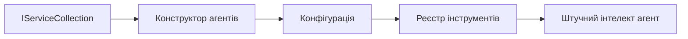

# 🎨 Шаблони агентного дизайну з Azure OpenAI (Responses API) (.NET)

## 📋 Цілі навчання

Цей приклад демонструє корпоративні шаблони дизайну для побудови інтелектуальних агентів із використанням Microsoft Agent Framework у .NET з інтеграцією Azure OpenAI (Responses API). Ви дізнаєтесь професійні шаблони та архітектурні підходи, які роблять агентів готовими до виробництва, підтримуваними та масштабованими.

### Корпоративні шаблони дизайну

- 🏭 **Factory Pattern**: Стандартизоване створення агентів із впровадженням залежностей
- 🔧 **Builder Pattern**: Легке конфігурування та налаштування агентів
- 🧵 **Потокобезпечні шаблони**: Керування конкурентними бесідами
- 📋 **Repository Pattern**: Організоване керування інструментами та можливостями

## 🎯 Особливості архітектури для .NET

### Корпоративні функції

- **Сильна типізація**: Валідація на етапі компіляції та підтримка IntelliSense
- **Впровадження залежностей**: Вбудована інтеграція DI-контейнера
- **Керування конфігурацією**: Патерни IConfiguration та Options
- **Async/Await**: Підтримка асинхронного програмування першого класу

### Шаблони для виробничого використання

- **Інтеграція логування**: Підтримка ILogger та структурованого логування
- **Health Checks**: Вбудований моніторинг та діагностика
- **Валідація конфігурації**: Сильна типізація з анотаціями даних
- **Обробка помилок**: Структуроване керування виключеннями

## 🔧 Технічна архітектура

### Основні компоненти .NET

- **Microsoft.Extensions.AI**: Уніфіковані абстракції AI-сервісів
- **Microsoft.Agents.AI**: Корпоративний фреймворк оркестрації агентів
- **Azure OpenAI (Responses API)**: Високопродуктивні патерни клієнта API
- **Система конфігурації**: appsettings.json та інтеграція середовища

### Реалізація шаблонів дизайну



## 🏗️ Демонстровані корпоративні шаблони

### 1. **Порожженькі шаблони**

- **Agent Factory**: Центральне створення агентів із узгодженим налаштуванням
- **Builder Pattern**: Fluent API для складного конфігурування агентів
- **Singleton Pattern**: Спільне використання ресурсів і керування налаштуваннями
- **Dependency Injection**: Слабке зв’язування і тестованість

### 2. **Поведенкові шаблони**

- **Strategy Pattern**: Взаємозамінні стратегії виконання інструментів
- **Command Pattern**: Інкапсульовані операції агента з підтримкою undo/redo
- **Observer Pattern**: Подієвий контроль життєвого циклу агента
- **Template Method**: Стандартизовані робочі процеси виконання агента

### 3. **Структурні шаблони**

- **Adapter Pattern**: Шар інтеграції Azure OpenAI (Responses API)
- **Decorator Pattern**: Розширення можливостей агента
- **Facade Pattern**: Спрощені інтерфейси взаємодії з агентом
- **Proxy Pattern**: Ледаче завантаження та кешування для продуктивності

## 📚 Принципи дизайну .NET

### Принципи SOLID

- **Single Responsibility**: Кожен компонент має одну чітку відповідальність
- **Open/Closed**: Розширюваність без змін у коді
- **Liskov Substitution**: Інтерфейсні реалізації інструментів
- **Interface Segregation**: Вузькоспеціалізовані, послідовні інтерфейси
- **Dependency Inversion**: Залежність від абстракцій, а не конкретних класів

### Чиста архітектура

- **Доменний шар**: Основні абстракції агента та інструментів
- **Прикладний шар**: Оркестрація агента та робочі процеси
- **Інфраструктурний шар**: Інтеграція Azure OpenAI (Responses API) та зовнішні сервіси
- **Презентаційний шар**: Взаємодія з користувачем та форматування відповіді

## 🔒 Корпоративні міркування

### Безпека

- **Керування обліковими даними**: Безпечне опрацювання API ключів через IConfiguration
- **Валідація введення**: Сильна типізація та валідація через анотації даних
- **Санітизація виводу**: Безпечна обробка та фільтрація відповідей
- **Логування аудиту**: Повний трекінг операцій

### Продуктивність

- **Асинхронні патерни**: Неблокуючі I/O операції
- **Pooling з’єднань**: Ефективне керування HTTP-клієнтами
- **Кешування**: Кешування відповідей для покращення продуктивності
- **Управління ресурсами**: Коректне звільнення та очищення ресурсів

### Масштабованість

- **Потокобезпечність**: Підтримка паралельного виконання агентів
- **Пулінг ресурсів**: Ефективне використання ресурсів
- **Управління навантаженням**: Обмеження швидкості та обробка зворотного тиску
- **Моніторинг**: Метрики продуктивності та health checks

## 🚀 Розгортання у виробництві

- **Керування конфігурацією**: Налаштування для конкретного середовища
- **Стратегія логування**: Структуроване логування з ідентифікаторами кореляції
- **Обробка помилок**: Глобальне керування виключеннями з відновленням
- **Моніторинг**: Application insights та лічильники продуктивності
- **Тестування**: Юніт-тести, інтеграційні тести та патерни навантажувального тестування

Готові створювати інтелектуальних агентів корпоративного рівня з .NET? Давайте спроєктуємо щось надійне! 🏢✨

## 🚀 Початок роботи

### Вимоги

- [.NET 10 SDK](https://dotnet.microsoft.com/download/dotnet/10.0) або новіша версія
- [Підписка Azure](https://azure.microsoft.com/free/) з ресурсом Azure OpenAI та розгортанням моделі
- [Azure CLI](https://learn.microsoft.com/cli/azure/install-azure-cli) — увійдіть через `az login`

### Необхідні змінні середовища

```bash
# zsh/bash
export AZURE_OPENAI_ENDPOINT=https://<your-resource>.openai.azure.com
export AZURE_OPENAI_DEPLOYMENT=gpt-4.1-mini
# Потім увійдіть, щоб AzureCliCredential міг отримати токен
az login
```

```powershell
# PowerShell
$env:AZURE_OPENAI_ENDPOINT = "https://<your-resource>.openai.azure.com"
$env:AZURE_OPENAI_DEPLOYMENT = "gpt-4.1-mini"
# Потім увійдіть, щоб AzureCliCredential міг отримати токен
az login
```

### Приклад коду

Щоб запустити приклад коду,

```bash
# zsh/bash
chmod +x ./03-dotnet-agent-framework.cs
./03-dotnet-agent-framework.cs
```

Або використайте dotnet CLI:

```bash
dotnet run ./03-dotnet-agent-framework.cs
```

Дивіться [`03-dotnet-agent-framework.cs`](../../../../03-agentic-design-patterns/code_samples/03-dotnet-agent-framework.cs) для повного коду.

```csharp
#!/usr/bin/dotnet run

#:package Microsoft.Extensions.AI@10.*
#:package Microsoft.Agents.AI.OpenAI@1.*-*
#:package Azure.AI.OpenAI@2.1.0
#:package Azure.Identity@1.13.1

using System.ComponentModel;

using Microsoft.Agents.AI;
using Microsoft.Extensions.AI;

using Azure.AI.OpenAI;
using Azure.Identity;

// Tool Function: Random Destination Generator
// This static method will be available to the agent as a callable tool
// The [Description] attribute helps the AI understand when to use this function
// This demonstrates how to create custom tools for AI agents
[Description("Provides a random vacation destination.")]
static string GetRandomDestination()
{
    // List of popular vacation destinations around the world
    // The agent will randomly select from these options
    var destinations = new List<string>
    {
        "Paris, France",
        "Tokyo, Japan",
        "New York City, USA",
        "Sydney, Australia",
        "Rome, Italy",
        "Barcelona, Spain",
        "Cape Town, South Africa",
        "Rio de Janeiro, Brazil",
        "Bangkok, Thailand",
        "Vancouver, Canada"
    };

    // Generate random index and return selected destination
    // Uses System.Random for simple random selection
    var random = new Random();
    int index = random.Next(destinations.Count);
    return destinations[index];
}

// Azure OpenAI with the Responses API (stable v1 endpoint). Sign in with `az login`.
var azureEndpoint = Environment.GetEnvironmentVariable("AZURE_OPENAI_ENDPOINT")
    ?? throw new InvalidOperationException("AZURE_OPENAI_ENDPOINT is not set.");
var deployment = Environment.GetEnvironmentVariable("AZURE_OPENAI_DEPLOYMENT") ?? "gpt-4.1-mini";

var azureClient = new AzureOpenAIClient(new Uri(azureEndpoint), new AzureCliCredential());

// Define Agent Identity and Comprehensive Instructions
// Agent name for identification and logging purposes
var AGENT_NAME = "TravelAgent";

// Detailed instructions that define the agent's personality, capabilities, and behavior
// This system prompt shapes how the agent responds and interacts with users
var AGENT_INSTRUCTIONS = """
You are a helpful AI Agent that can help plan vacations for customers.

Important: When users specify a destination, always plan for that location. Only suggest random destinations when the user hasn't specified a preference.

When the conversation begins, introduce yourself with this message:
"Hello! I'm your TravelAgent assistant. I can help plan vacations and suggest interesting destinations for you. Here are some things you can ask me:
1. Plan a day trip to a specific location
2. Suggest a random vacation destination
3. Find destinations with specific features (beaches, mountains, historical sites, etc.)
4. Plan an alternative trip if you don't like my first suggestion

What kind of trip would you like me to help you plan today?"

Always prioritize user preferences. If they mention a specific destination like "Bali" or "Paris," focus your planning on that location rather than suggesting alternatives.
""";

// Create AI Agent with Advanced Travel Planning Capabilities
// Get the Responses client for the deployment and create the AI agent
// Configure agent with name, detailed instructions, and available tools
// This demonstrates the .NET agent creation pattern with full configuration
AIAgent agent = azureClient
    .GetChatClient(deployment)
    .AsAIAgent(
        name: AGENT_NAME,
        instructions: AGENT_INSTRUCTIONS,
        tools: [AIFunctionFactory.Create(GetRandomDestination)]
    );

// Create New Conversation Session for Context Management
// Initialize a new conversation session to maintain context across multiple interactions
// Sessions enable the agent to remember previous exchanges and maintain conversational state
// This is essential for multi-turn conversations and contextual understanding
var session = await agent.CreateSessionAsync();

// Execute Agent: First Travel Planning Request
// Run the agent with an initial request that will likely trigger the random destination tool
// The agent will analyze the request, use the GetRandomDestination tool, and create an itinerary
// Using the session parameter maintains conversation context for subsequent interactions
await foreach (var update in agent.RunStreamingAsync("Plan me a day trip", session))
{
    await Task.Delay(10);
    Console.Write(update);
}

Console.WriteLine();

// Execute Agent: Follow-up Request with Context Awareness
// Demonstrate contextual conversation by referencing the previous response
// The agent remembers the previous destination suggestion and will provide an alternative
// This showcases the power of conversation sessions and contextual understanding in .NET agents
await foreach (var update in agent.RunStreamingAsync("I don't like that destination. Plan me another vacation.", session))
{
    await Task.Delay(10);
    Console.Write(update);
}
```

---

<!-- CO-OP TRANSLATOR DISCLAIMER START -->
**Відмова від відповідальності**:
Цей документ було перекладено за допомогою сервісу штучного інтелекту для перекладу [Co-op Translator](https://github.com/Azure/co-op-translator). Хоча ми прагнемо до точності, будь ласка, майте на увазі, що автоматичні переклади можуть містити помилки або неточності. Оригінальний документ рідною мовою слід вважати авторитетним джерелом. Для критично важливої інформації рекомендується професійний людський переклад. Ми не несемо відповідальності за будь-які непорозуміння або неправильні тлумачення, що виникли внаслідок використання цього перекладу.
<!-- CO-OP TRANSLATOR DISCLAIMER END -->