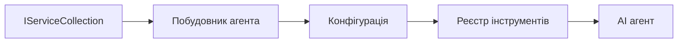

# 🎨 Шаблони агентського дизайну з Azure OpenAI (Responses API) (.NET)

## 📋 Мета навчання

Цей приклад демонструє корпоративні шаблони проектування для створення інтелектуальних агентів із використанням Microsoft Agent Framework в .NET з інтеграцією Azure OpenAI (Responses API). Ви навчитесь професійним шаблонам і архітектурним підходам, які роблять агентів готовими до виробництва, керованими та масштабованими.

### Корпоративні шаблони проектування

- 🏭 **Factory Pattern**: Стандартизоване створення агентів з впровадженням залежностей
- 🔧 **Builder Pattern**: Fluent конфігурація та налаштування агентів
- 🧵 **Thread-Safe Patterns**: Керування одночасними розмовами
- 📋 **Repository Pattern**: Організоване управління інструментами та можливостями

## 🎯 Специфічні переваги архітектури .NET

### Корпоративні функції

- **Strong Typing**: Валідація під час компіляції та підтримка IntelliSense
- **Dependency Injection**: Вбудована інтеграція DI контейнера
- **Configuration Management**: IConfiguration і патерни Options
- **Async/Await**: Першокласна підтримка асинхронного програмування

### Патерни, готові до виробництва

- **Logging Integration**: Підтримка ILogger і структурованого логування
- **Health Checks**: Вбудований моніторинг і діагностика
- **Configuration Validation**: Сильна типізація з анотаціями даних
- **Error Handling**: Структуроване управління виключеннями

## 🔧 Технічна архітектура

### Основні компоненти .NET

- **Microsoft.Extensions.AI**: Уніфіковані абстракції AI сервісів
- **Microsoft.Agents.AI**: Корпоративний фреймворк оркестрації агентів
- **Azure OpenAI (Responses API)**: Шаблони високопродуктивних клієнтів API
- **Configuration System**: appsettings.json і інтеграція зі середовищем

### Реалізація шаблонів проектування



## 🏗️ Демонстровані корпоративні шаблони

### 1. **Створюючі патерни**

- **Agent Factory**: Централізоване створення агентів з узгодженою конфігурацією
- **Builder Pattern**: Fluent API для складної конфігурації агентів
- **Singleton Pattern**: Спільні ресурси та управління конфігурацією
- **Dependency Injection**: Слабке зв’язування та тестованість

### 2. **Поведенкові патерни**

- **Strategy Pattern**: Змінні стратегії виконання інструментів
- **Command Pattern**: Інкапсульовані операції агента з підтримкою скасування/повторення
- **Observer Pattern**: Керування життєвим циклом агента на основі подій
- **Template Method**: Стандартизовані робочі процеси виконання агента

### 3. **Структурні патерни**

- **Adapter Pattern**: Інтеграційний шар Azure OpenAI (Responses API)
- **Decorator Pattern**: Розширення можливостей агента
- **Facade Pattern**: Спрощені інтерфейси взаємодії агента
- **Proxy Pattern**: Ліниве завантаження та кешування для продуктивності

## 📚 Принципи дизайну .NET

### Принципи SOLID

- **Single Responsibility**: Кожен компонент має чітку одну відповідальність
- **Open/Closed**: Розширюваний без зміни коду
- **Liskov Substitution**: Реалізації інструментів на основі інтерфейсів
- **Interface Segregation**: Зосереджені, згуртовані інтерфейси
- **Dependency Inversion**: Залежність від абстракцій, а не від конкретних класів

### Чиста архітектура

- **Domain Layer**: Основні абстракції агента та інструментів
- **Application Layer**: Оркестрація агентів і робочі процеси
- **Infrastructure Layer**: Інтеграція Azure OpenAI (Responses API) та зовнішніх сервісів
- **Presentation Layer**: Взаємодія з користувачем і форматування відповідей

## 🔒 Корпоративні міркування

### Безпека

- **Credential Management**: Безпечне зберігання ключів API з IConfiguration
- **Input Validation**: Сильна типізація і валідація анотацій даних
- **Output Sanitization**: Безпечна обробка та фільтрація відповідей
- **Audit Logging**: Повний трекінг операцій

### Продуктивність

- **Async Patterns**: Не блокуючі I/O операції
- **Connection Pooling**: Ефективне управління HTTP клієнтами
- **Caching**: Кешування відповідей для підвищення продуктивності
- **Resource Management**: Коректне звільнення ресурсів та шаблони очистки

### Масштабованість

- **Thread Safety**: Підтримка одночасного виконання агентів
- **Resource Pooling**: Ефективне використання ресурсів
- **Load Management**: Лімітування навантаження і обробка зворотного тиску
- **Monitoring**: Метрики продуктивності та перевірки стану

## 🚀 Розгортання у виробництві

- **Configuration Management**: Налаштування під конкретне середовище
- **Logging Strategy**: Структуроване логування з кореляційними ID
- **Error Handling**: Глобальна обробка виключень з коректним відновленням
- **Monitoring**: Application Insights і лічильники продуктивності
- **Testing**: Юніт-тести, інтеграційні тести та шаблони навантажувального тестування

Готові створювати інтелектуальних агентів корпоративного рівня з .NET? Давайте спроєктуємо щось надійне! 🏢✨

## 🚀 Початок роботи

### Попередні умови

- [.NET 10 SDK](https://dotnet.microsoft.com/download/dotnet/10.0) або вище
- Підписка [Azure](https://azure.microsoft.com/free/) з ресурсом Azure OpenAI та розгортанням моделі
- [Azure CLI](https://learn.microsoft.com/cli/azure/install-azure-cli) — увійдіть за допомогою `az login`

### Потрібні змінні середовища

```bash
# zsh/bash
export AZURE_OPENAI_ENDPOINT=https://<your-resource>.openai.azure.com
export AZURE_OPENAI_DEPLOYMENT=gpt-5-mini
# Потім увійдіть, щоб AzureCliCredential міг отримати токен
az login
```

```powershell
# PowerShell
$env:AZURE_OPENAI_ENDPOINT = "https://<your-resource>.openai.azure.com"
$env:AZURE_OPENAI_DEPLOYMENT = "gpt-5-mini"
# Потім увійдіть, щоб AzureCliCredential міг отримати токен
az login
```

### Приклад коду

Щоб виконати приклад коду,

```bash
# zsh/bash
chmod +x ./03-dotnet-agent-framework.cs
./03-dotnet-agent-framework.cs
```

Або використовуючи CLI dotnet:

```bash
dotnet run ./03-dotnet-agent-framework.cs
```

Дивіться [`03-dotnet-agent-framework.cs`](../../../../03-agentic-design-patterns/code_samples/03-dotnet-agent-framework.cs) для повного коду.

```csharp
#!/usr/bin/dotnet run

#:package Microsoft.Extensions.AI@10.*
#:package Microsoft.Agents.AI.OpenAI@1.*-*
#:package Azure.AI.OpenAI@2.1.0
#:package Azure.Identity@1.13.1

using System.ComponentModel;

using Microsoft.Agents.AI;
using Microsoft.Extensions.AI;

using Azure.AI.OpenAI;
using Azure.Identity;

// Tool Function: Random Destination Generator
// This static method will be available to the agent as a callable tool
// The [Description] attribute helps the AI understand when to use this function
// This demonstrates how to create custom tools for AI agents
[Description("Provides a random vacation destination.")]
static string GetRandomDestination()
{
    // List of popular vacation destinations around the world
    // The agent will randomly select from these options
    var destinations = new List<string>
    {
        "Paris, France",
        "Tokyo, Japan",
        "New York City, USA",
        "Sydney, Australia",
        "Rome, Italy",
        "Barcelona, Spain",
        "Cape Town, South Africa",
        "Rio de Janeiro, Brazil",
        "Bangkok, Thailand",
        "Vancouver, Canada"
    };

    // Generate random index and return selected destination
    // Uses System.Random for simple random selection
    var random = new Random();
    int index = random.Next(destinations.Count);
    return destinations[index];
}

// Azure OpenAI with the Responses API (stable v1 endpoint). Sign in with `az login`.
var azureEndpoint = Environment.GetEnvironmentVariable("AZURE_OPENAI_ENDPOINT")
    ?? throw new InvalidOperationException("AZURE_OPENAI_ENDPOINT is not set.");
var deployment = Environment.GetEnvironmentVariable("AZURE_OPENAI_DEPLOYMENT") ?? "gpt-5-mini";

var azureClient = new AzureOpenAIClient(new Uri(azureEndpoint), new AzureCliCredential());

// Define Agent Identity and Comprehensive Instructions
// Agent name for identification and logging purposes
var AGENT_NAME = "TravelAgent";

// Detailed instructions that define the agent's personality, capabilities, and behavior
// This system prompt shapes how the agent responds and interacts with users
var AGENT_INSTRUCTIONS = """
You are a helpful AI Agent that can help plan vacations for customers.

Important: When users specify a destination, always plan for that location. Only suggest random destinations when the user hasn't specified a preference.

When the conversation begins, introduce yourself with this message:
"Hello! I'm your TravelAgent assistant. I can help plan vacations and suggest interesting destinations for you. Here are some things you can ask me:
1. Plan a day trip to a specific location
2. Suggest a random vacation destination
3. Find destinations with specific features (beaches, mountains, historical sites, etc.)
4. Plan an alternative trip if you don't like my first suggestion

What kind of trip would you like me to help you plan today?"

Always prioritize user preferences. If they mention a specific destination like "Bali" or "Paris," focus your planning on that location rather than suggesting alternatives.
""";

// Create AI Agent with Advanced Travel Planning Capabilities
// Get the Responses client for the deployment and create the AI agent
// Configure agent with name, detailed instructions, and available tools
// This demonstrates the .NET agent creation pattern with full configuration
AIAgent agent = azureClient
    .GetChatClient(deployment)
    .AsAIAgent(
        name: AGENT_NAME,
        instructions: AGENT_INSTRUCTIONS,
        tools: [AIFunctionFactory.Create(GetRandomDestination)]
    );

// Create New Conversation Session for Context Management
// Initialize a new conversation session to maintain context across multiple interactions
// Sessions enable the agent to remember previous exchanges and maintain conversational state
// This is essential for multi-turn conversations and contextual understanding
var session = await agent.CreateSessionAsync();

// Execute Agent: First Travel Planning Request
// Run the agent with an initial request that will likely trigger the random destination tool
// The agent will analyze the request, use the GetRandomDestination tool, and create an itinerary
// Using the session parameter maintains conversation context for subsequent interactions
await foreach (var update in agent.RunStreamingAsync("Plan me a day trip", session))
{
    await Task.Delay(10);
    Console.Write(update);
}

Console.WriteLine();

// Execute Agent: Follow-up Request with Context Awareness
// Demonstrate contextual conversation by referencing the previous response
// The agent remembers the previous destination suggestion and will provide an alternative
// This showcases the power of conversation sessions and contextual understanding in .NET agents
await foreach (var update in agent.RunStreamingAsync("I don't like that destination. Plan me another vacation.", session))
{
    await Task.Delay(10);
    Console.Write(update);
}
```

---

<!-- CO-OP TRANSLATOR DISCLAIMER START -->
**Відмова від відповідальності**:
Цей документ було перекладено за допомогою сервісу штучного інтелекту для перекладу [Co-op Translator](https://github.com/Azure/co-op-translator). Хоча ми прагнемо до точності, будь ласка, майте на увазі, що автоматичні переклади можуть містити помилки або неточності. Оригінальний документ рідною мовою слід вважати авторитетним джерелом. Для критично важливої інформації рекомендується професійний людський переклад. Ми не несемо відповідальності за будь-які непорозуміння або неправильні тлумачення, що виникли внаслідок використання цього перекладу.
<!-- CO-OP TRANSLATOR DISCLAIMER END -->