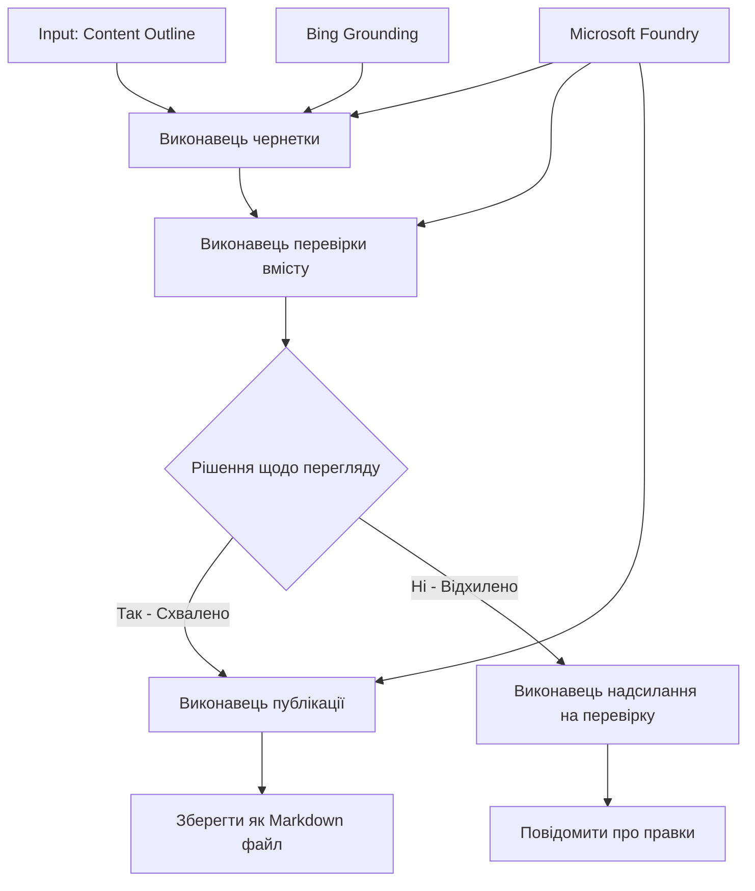

# 🔀 Умовні робочі процеси агентів з Microsoft Foundry (.NET)

## 📋 Покроковий посібник зі створення інтелектуального робочого процесу на основі прийняття рішень

У цьому ноутбуку демонструються **шаблони умовних робочих процесів** з використанням Microsoft Foundry та Microsoft Agent Framework для .NET. Ви навчитеся створювати складні робочі процеси, керовані прийняттям рішень, які інтелектуально направляють обробку на основі AI-аналізу, бізнес-правил та динамічних умов для автоматизації корпоративного рівня.

## 🎯 Цілі навчання

### 🧠 **Інтелектуальна архітектура прийняття рішень**
- **Реалізація умовної логіки**: Створення складних дерев рішень з кількома гілками
- **Маршрутизація на основі ШІ**: Використання моделей Microsoft Foundry для інтелектуальних рішень про маршрутизацію
- **Динамічна адаптація робочого процесу**: Зміна поведінки робочого процесу на основі аналізу та умов під час виконання
- **Інтеграція бізнес-правил**: Включення бізнес-логіки та вимог відповідності у робочі процеси

### 🔀 **Розвинені умовні шаблони**
- **Прийняття рішень за кількома критеріями**: Оцінка кількох факторів для маршрутизації
- **Обробка з урахуванням контексту**: Прийняття рішень на основі накопиченого контексту та історії робочого процесу
- **Адаптивна зміна робочого процесу**: Динамічна корекція шляхів обробки на основі поточних умов
- **Інтеграція з рушіями правил**: Реалізація складних бізнес-рушіїв правил у робочих процесах

### 🏢 **Корпоративні умовні застосунки**
- **Класифікація документації та маршрутизація**: Автоматична класифікація та направлення документів до відповідних робочих процесів
- **Тріаж клієнтської підтримки**: Інтелектуальна маршрутизація запитів клієнтів до спеціалізованих команд
- **Обробка відповідності та ризиків**: Застосування різних процесів перевірки на основі оцінки ризиків
- **Робочі процеси контролю якості**: Напрямок контенту через відповідні процеси перегляду на основі метрик якості

## ⚙️ Необхідні умови та налаштування

### 📦 **Необхідні пакети NuGet**

Розширені пакети для умовної обробки робочих процесів:

```xml
<!-- Core AI Framework -->
<PackageReference Include="Microsoft.Extensions.AI" Version="9.9.0" />

<!-- Azure AI Agents with Persistent State -->
<PackageReference Include="Azure.AI.Agents.Persistent" Version="1.2.0-beta.5" />

<!-- Azure Identity and Utilities -->
<PackageReference Include="Azure.Identity" Version="1.15.0" />
<PackageReference Include="System.Linq.Async" Version="6.0.3" />
<PackageReference Include="DotNetEnv" Version="3.1.1" />

<!-- Local Workflow Framework References -->
<!-- Microsoft.Agents.Workflows.dll - Advanced workflow orchestration -->
<!-- Microsoft.Agents.AI.AzureAI.dll - Microsoft Foundry integration -->
<!-- Microsoft.Agents.AI.dll - Core agent abstractions -->
```

### 🔑 **Конфігурація Microsoft Foundry**

**Необхідні ресурси Azure:**
- Робоче середовище Microsoft Foundry з моделями для умовної обробки
- Підписка Azure з відповідним квотами обчислень та дозволами
- Розгорнуті AI-моделі для прийняття рішень і аналізу контенту
- (Опціонально) Підключення Bing Search API для функції підґрунтя

**Конфігурація середовища (.env файл):**
```env
# Microsoft Foundry Configuration
AZURE_AI_PROJECT_ENDPOINT=https://your-project.cognitiveservices.azure.com/
BING_CONNECTION_ID=your-bing-connection-id
```

**Налаштування автентифікації:**
```csharp
// Azure CLI or Managed Identity authentication
using Azure.Identity;
var credential = new AzureCliCredential();

// Load environment configuration
DotNetEnv.Env.Load("../../../.env");
```

### 🏗️ **Архітектура умовних робочих процесів**



**Ключові компоненти:**
- **Draft Executor**: AI-агент, який створює початкові чернетки контенту з планів
- **Content Review Executor**: AI-агент, що оцінює якість і відповідність чернеток
- **Умовна маршрутизація**: Логіка прийняття рішень, що направляє за результатами перегляду
- **Шляхи публікації/перегляду**: Розділення шляхів обробки для затвердженого та відхиленого контенту
- **Управління станом**: Підтримка контексту контенту та перегляду впродовж робочого процесу

## 🎨 **Шаблони дизайну умовних робочих процесів**

### 📋 **Виробництво контенту з кваліфікаційними критеріями**
```
Outline → Draft Creation → Quality Review → {Approve: Publish | Reject: Revise}
```

### 🎯 **Обробка документів на основі ризиків**
```
Document → Risk Assessment → {Low: Standard | High: Enhanced Review}
```

### 🔍 **Інтелектуальна маршрутизація клієнтської підтримки**
```
Customer Query → Analysis → {Simple: FAQ Bot | Complex: Human Agent}
```

### 💼 **Робочі процеси, керовані відповідністю**
```
Content → Compliance Check → {Pass: Publish | Fail: Legal Review}
```

## 🏢 **Корпоративні переваги умовних робочих процесів**

### 🎯 **Інтелектуальна автоматизація**
- **Розумне прийняття рішень**: Рішення про маршрутизацію на основі AI-аналізу контенту та контексту
- **Адаптивна обробка**: Робочі процеси, що автоматично підлаштовуються під змінні умови
- **Застосування бізнес-правил**: Автоматичне впровадження складної бізнес-логіки та політик
- **Маршрутизація з урахуванням контексту**: Прийняття рішень на основі повної історії та накопиченого контексту робочого процесу

### 📈 **Операційна досконалість**
- **Оптимізація розподілу ресурсів**: Напрямок завдань до найбільш відповідних спеціалістів і процесів
- **Зменшення ручного втручання**: Автоматизовані рішення мінімізують потребу у людській маршрутизації
- **Прискорення вирішення**: Пряма маршрутизація до відповідної експертизи та потужностей обробки
- **Послідовне застосування**: Однорідне застосування бізнес-правил і критеріїв прийняття рішень

### 🛡️ **Управління ризиками та відповідність**
- **Автоматизована оцінка ризиків**: Оцінка ризикового рівня контенту та ситуацій за допомогою AI
- **Забезпечення відповідності**: Автоматична маршрутизація через необхідні регуляторні процеси
- **Застосування протоколів безпеки**: Посилені заходи безпеки на основі оцінки ризиків
- **Ведення журналу аудиту**: Повна документація рішень про маршрутизацію та мотивації

### 📊 **Аналітика та постійне вдосконалення**
- **Аналітика прийняття рішень**: Відстеження ефективності та точності маршрутизації
- **Розпізнавання шаблонів**: Виявлення тенденцій і закономірностей у рішеннях про маршрутизацію з часом
- **Оптимізація продуктивності**: Постійне вдосконалення критеріїв рішень і ефективності маршрутизації
- **Бізнес-аналітика**: Інсайти про характеристики контенту та вимоги обробки

### 🔧 **Технічна досконалість**
- **Управління збереженим станом**: Підтримка складного стану впродовж виконання робочого процесу
- **Масштабована архітектура**: Обробка великих обсягів умовної обробки
- **Можливості інтеграції**: Безшовна інтеграція з існуючими бізнес-системами і процесами
- **Моніторинг та спостережуваність**: Комплексне відстеження продуктивності робочого процесу та рішень

Давайте створювати інтелектуальні, керовані рішеннями корпоративні робочі процеси з .NET! 🚀

## 💻 Запуск коду

Повна реалізація доступна у файлі `04.dotnet-agent-framework-workflow-aifoundry-condition.cs`. Вона демонструє **робочий процес виробництва контенту з кваліфікаційними критеріями**:

### 🏗️ **Архітектура робочого процесу**

```
Content Outline → Draft Creation → Quality Review → Conditional Routing:
                                                      ├─ Approved (>200 words) → Publish
                                                      └─ Rejected (<200 words) → Review Notification
```

**Агенти у робочому процесі:**
1. **Агент Євангеліст**: Створює чернетки підручника з планів із підґрунтям Bing
2. **Агент Рецензент контенту**: Оцінює якість чернетки (кількість слів, повноту)
3. **Агент Публікатор**: Зберігає затверджений контент у вигляді файлів Markdown з мітками часу

**Користувацькі виконавці:**
1. **DraftExecutor**: Організовує створення чернеток
2. **ContentReviewExecutor**: Виконує оцінку якості
3. **PublishExecutor**: Обробляє публікацію затвердженого контенту
4. **SendReviewExecutor**: Керує повідомленнями про відхилений контент

### 🚀 Запуск прикладу

**Вимоги:**
- Налаштоване робоче середовище Microsoft Foundry
- Аутентифікація в Azure CLI (`az login`)
- (Опціонально) Підключення Bing Search для підґрунтя

```bash
# Зробіть скрипт виконуваним (Unix/Linux/macOS)
chmod +x 04.dotnet-agent-framework-workflow-aifoundry-condition.cs

# Запустіть умовний робочий процес
./04.dotnet-agent-framework-workflow-aifoundry-condition.cs
```

Або у Windows:
```powershell
dotnet run 04.dotnet-agent-framework-workflow-aifoundry-condition.cs
```

### 📝 Очікуваний результат

Робочий процес:
1. **Створить агентів**: Ініціалізує три спеціалізованих агенти Microsoft Foundry
2. **Згенерує чернетку**: Агент Євангеліст створить чернетку підручника за планом
3. **Перевірить контент**: Рецензент контенту оцінить якість чернетки
4. **Умовна маршрутизація**:
   - **Якщо затверджено (>200 слів)**: Виконавець публікації зберігає файл Markdown
   - **Якщо відхилено (<200 слів)**: Надсилання повідомлення про відмову на перегляд
5. **Показ результатів**: Відобразить фінальний результат робочого процесу

### 🔧 Опції налаштування

**Змінити критерії перегляду:**
```csharp
const string ContentReviewerInstructions = @"
You are a content reviewer...
1. Check if content is more than 500 words (instead of 200)
2. Verify technical accuracy
3. Ensure proper formatting
...";
```

**Додати більше умовних шляхів:**
```csharp
var workflow = new WorkflowBuilder(draftExecutor)
    .AddEdge(draftExecutor, contentReviewerExecutor)
    .AddEdge(contentReviewerExecutor, publishExecutor, condition: GetCondition("Excellent"))
    .AddEdge(contentReviewerExecutor, editExecutor, condition: GetCondition("Good"))
    .AddEdge(contentReviewerExecutor, sendReviewerExecutor, condition: GetCondition("Poor"))
    .Build();
```

**Змінити вимоги до контенту:**
```csharp
string OUTLINE_Content = @"
# Your Custom Topic
## Section 1
https://your-reference-url
## Section 2
...
";
```

### 🎯 Практичне застосування

Цей шаблон умовного робочого процесу ідеальний для:
- **Систем управління контентом**: Автоматизовані редакційні процеси з кваліфікаційною перевіркою
- **Обробки документів**: Маршрутизація документів за класифікацією та відповідністю
- **Підтримки клієнтів**: Інтелектуальна маршрутизація звернень на основі складності і терміновості
- **Юридичного перегляду**: Маршрутизація контрактів за оцінкою ризиків та вартості
- **HR-процесів**: Напрямок заявок через відповідні скринінгові робочі процеси

### 🔍 Розуміння умовної логіки

**Функція умови:**
```csharp
public Func<object?, bool> GetCondition(string expectedResult) =>
    reviewResult => reviewResult is ReviewResult review && review.Result == expectedResult;
```

Ця функція створює предикат, який:
1. Перевіряє, чи результат є типу `ReviewResult`
2. Порівнює властивість `Result` з очікуваним значенням
3. Повертає true/false для визначення маршрутизації

**Краї робочого процесу з умовами:**
```csharp
.AddEdge(contentReviewerExecutor, publishExecutor, condition: GetCondition("Yes"))
.AddEdge(contentReviewerExecutor, sendReviewerExecutor, condition: GetCondition("No"))
```

### 📊 Розвинені можливості

**Перевірка JSON-схем:**
Робочий процес використовує JSON-схеми для забезпечення структурованих відповідей:

```csharp
// Define response structure
public class ReviewResult
{
    [JsonPropertyName("review_result")]
    public string Result { get; set; } = string.Empty;
    
    [JsonPropertyName("reason")]
    public string Reason { get; set; } = string.Empty;
    
    [JsonPropertyName("draft_content")]
    public string DraftContent { get; set; } = string.Empty;
}

// Apply to agent
ResponseFormat = ChatResponseFormat.ForJsonSchema(
    AIJsonUtilities.CreateJsonSchema(typeof(ReviewResult)), 
    "ReviewResult", 
    "Review Result From DraftContent"
)
```

**Інтеграція з Bing для підґрунтя:**
Агент Євангеліст використовує Bing для доступу до актуальної інформації:

```csharp
var bingGroundingConfig = new BingGroundingSearchConfiguration(bing_conn_id);
BingGroundingToolDefinition bingGroundingTool = new(
    new BingGroundingSearchToolParameters([bingGroundingConfig])
);
```

Це дозволяє агенту слідувати за URL у плані та витягувати поточну інформацію.

### 🛡️ Обробка помилок

Робочий процес містить надійну обробку помилок для відхиленого контенту:
- Помилки перевірки спричиняють альтернативний шлях
- Повідомлення містять чіткі причини відхилення
- Контент зберігається для доопрацювання

### 🔄 Розширення робочого процесу

**Додати цикл доопрацювання:**
Створити зворотний зв’язок, що автоматично переписує контент:

```csharp
.AddEdge(contentReviewerExecutor, publishExecutor, condition: GetCondition("Yes"))
.AddEdge(contentReviewerExecutor, draftExecutor, condition: GetCondition("No")) // Loop back
```

**Реалізувати багаторівневий перегляд:**
Додати кілька стадій перегляду з різними критеріями:

```csharp
.AddEdge(draftExecutor, technicalReviewer)
.AddEdge(technicalReviewer, editorialReviewer, condition: GetCondition("TechPass"))
.AddEdge(editorialReviewer, publishExecutor, condition: GetCondition("EditPass"))
```

Цей умовний шаблон робочого процесу становить основу для створення складних, інтелектуальних корпоративних систем автоматизації! 🚀

---

<!-- CO-OP TRANSLATOR DISCLAIMER START -->
**Відмова від відповідальності**:
Цей документ було перекладено за допомогою сервісу штучного інтелекту для перекладу [Co-op Translator](https://github.com/Azure/co-op-translator). Хоча ми прагнемо до точності, будь ласка, майте на увазі, що автоматичні переклади можуть містити помилки або неточності. Оригінальний документ рідною мовою слід вважати авторитетним джерелом. Для критично важливої інформації рекомендується професійний людський переклад. Ми не несемо відповідальності за будь-які непорозуміння або неправильні тлумачення, що виникли внаслідок використання цього перекладу.
<!-- CO-OP TRANSLATOR DISCLAIMER END -->