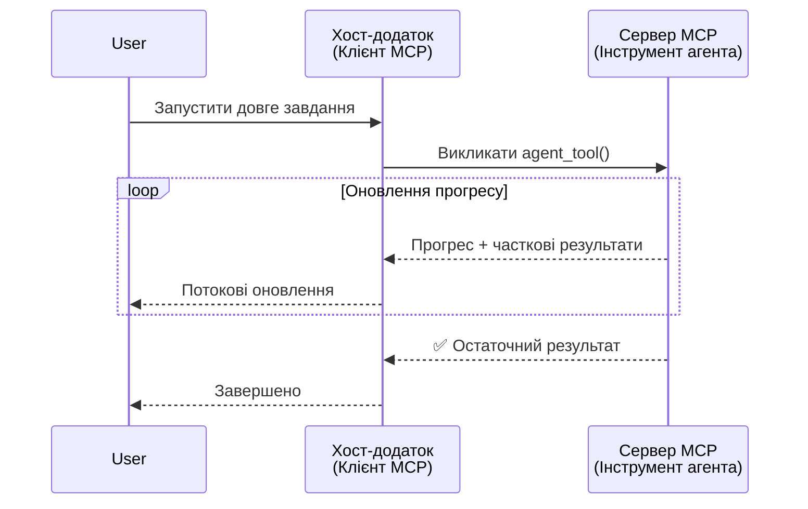
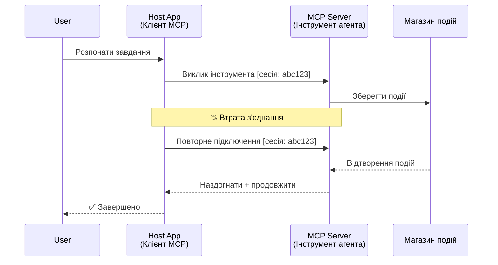
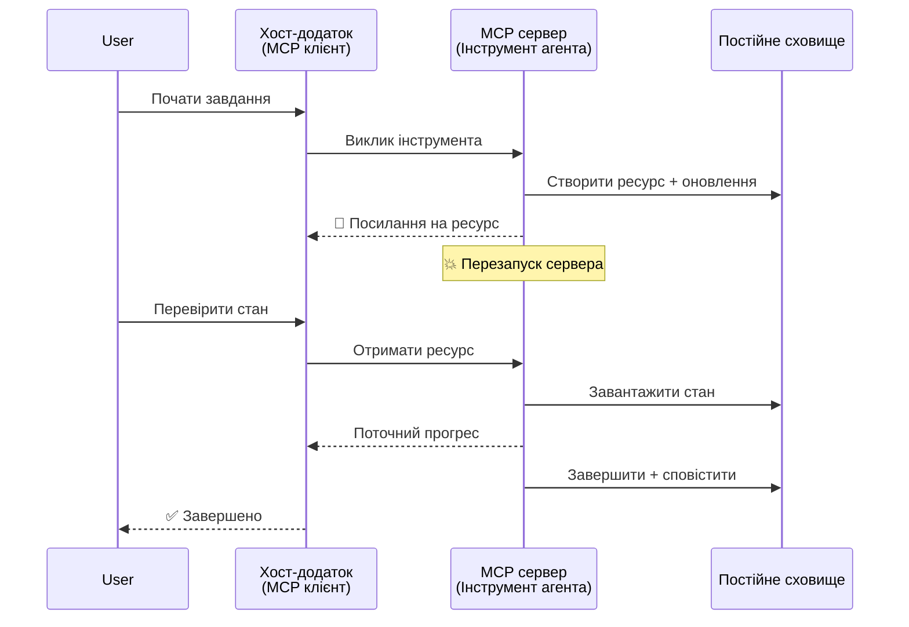
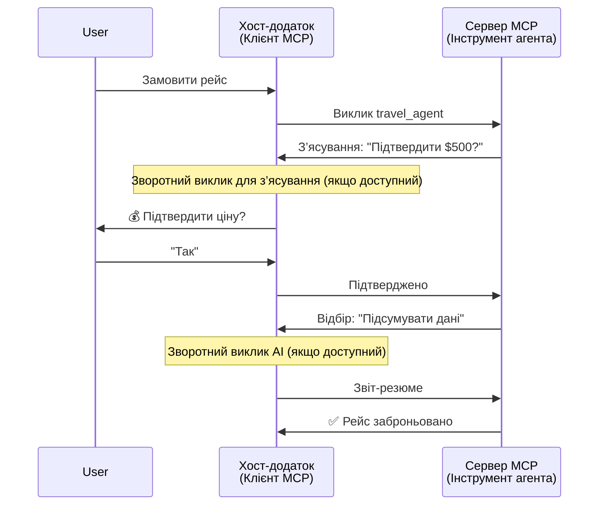
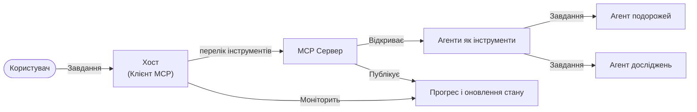

# Побудова систем комунікації агент-до-агента за допомогою MCP

> Коротко - Чи можна побудувати Agent2Agent комунікацію на MCP? Так!

MCP значно еволюціонував за межі своєї початкової мети «надання контексту для LLM». Завдяки нещодавнім покращенням, включаючи [відновлювані потоки](https://modelcontextprotocol.io/docs/concepts/transports#resumability-and-redelivery), [виявлення](https://modelcontextprotocol.io/specification/2025-06-18/client/elicitation), [відбір зразків](https://modelcontextprotocol.io/specification/2025-06-18/client/sampling) і сповіщення ([про прогрес](https://modelcontextprotocol.io/specification/2025-06-18/basic/utilities/progress) та [про ресурси](https://modelcontextprotocol.io/specification/2025-06-18/schema#resourceupdatednotification)), MCP тепер надає надійну основу для побудови складних систем комунікації агент-до-агента.

## Помилка у розумінні агента/інструмента

У міру того, як все більше розробників досліджують інструменти з агентною поведінкою (що працюють тривалий час, можуть вимагати додаткового вводу під час виконання тощо), поширена помилка полягає у вважанні, що MCP непридатний, оскільки ранні приклади інструментів були примітивними і зосереджувалися на простих схемах запит-відповідь.

Це уявлення застаріле. Специфікація MCP була суттєво покращена за останні місяці можливостями, що усувають прогалини для побудови довготривалої агентної поведінки:

- **Потокова передача та часткові результати**: Оновлення прогресу в режимі реального часу під час виконання
- **Відновлюваність**: Клієнти можуть перепідключатися та продовжувати після розриву зв’язку
- **Стійкість**: Результати зберігаються під час перезавантажень сервера (наприклад, через посилання на ресурс)
- **Багатокроковість**: Інтерактивний ввід під час виконання через виявлення та відбір зразків

Ці функції можна комбінувати для створення складних агентних та багатоагентних застосунків, усі вони працюють на протоколі MCP.

Для прикладу ми називатимемо агента «інструментом», доступним на сервері MCP. Це передбачає наявність хост-застосунку, який реалізує клієнта MCP, що встановлює сесію із сервером MCP і може викликати агента.

## Що робить інструмент MCP «агентним»?

Перед початком реалізації визначимо, які можливості інфраструктури потрібні для підтримки довготривалих агентів.

> Ми визначимо агента як сутність, здатну автономно працювати протягом тривалого часу, виконуючи комплексні завдання, які можуть вимагати кількох взаємодій або коригувань на основі зворотного зв’язку в реальному часі.

### 1. Потокова передача та часткові результати

Традиційні схеми «запит-відповідь» не працюють для довготривалих завдань. Агенти мають надавати:

- Оновлення прогресу в режимі реального часу
- Проміжні результати

**Підтримка MCP**: Сповіщення про оновлення ресурсів дозволяють потокову передачу часткових результатів, хоча це потребує ретельного проєктування, щоб уникнути конфліктів із моделлю запит/відповідь JSON-RPC 1:1.

| Функція                   | Випадок використання                                                                                                                                                          | Підтримка MCP                                                                              |
| ------------------------- | ---------------------------------------------------------------------------------------------------------------------------------------------------------------------------- | ------------------------------------------------------------------------------------------ |
| Оновлення прогресу в режимі реального часу | Користувач запускає завдання з міграції коду. Агент передає прогрес: «10% – аналіз залежностей... 25% – конвертація файлів TypeScript... 50% – оновлення імпортів...»        | ✅ Сповіщення про прогрес                                                                   |
| Часткові результати       | Завдання «Створити книгу» передає часткові результати, наприклад, 1) Контур сюжету, 2) Список розділів, 3) Кожен розділ по мірі готовності. Хост може переглядати, скасовувати або змінювати на будь-якому етапі. | ✅ Сповіщення можна “розширити” для включення часткових результатів, див. пропозиції в PR 383, 776 |

<div align="center" style="font-style: italic; font-size: 0.95em; margin-bottom: 0.5em;">
<strong>Рисунок 1:</strong> Ця діаграма ілюструє, як агент MCP передає хост-застосунку оновлення прогресу та часткові результати в режимі реального часу під час довготривалого завдання, дозволяючи користувачу моніторити виконання в реальному часі.
</div>



### 2. Відновлюваність

Агенти повинні коректно обробляти перебої у мережі:

- Перепідключення після роз’єднання клієнта
- Продовження з місця зупинки (повторна доставка повідомлень)

**Підтримка MCP**: На сьогодні транспорт MCP StreamableHTTP підтримує відновлення сесії та повторну доставку повідомлень із сесійними ID та останніми ID подій. Важливо, що сервер має реалізувати EventStore, який дозволяє відтворювати події при перепідключенні клієнта.  
Є спільнотна пропозиція (PR #975), що досліджує транспортно-незалежні відновлювані потоки.

| Функція     | Випадок використання                                                                                                                                        | Підтримка MCP                                                             |
| ----------- | ----------------------------------------------------------------------------------------------------------------------------------------------------------- | ------------------------------------------------------------------------- |
| Відновлюваність | Клієнт відключається під час тривалого завдання. Після перепідключення сесія продовжується з відтворенням пропущених подій, без втрати прогресу.             | ✅ Транспорт StreamableHTTP із сесійними ID, відтворенням подій та EventStore |

<div align="center" style="font-style: italic; font-size: 0.95em; margin-bottom: 0.5em;">
<strong>Рисунок 2:</strong> Ця діаграма демонструє, як транспорт StreamableHTTP MCP та сховище подій забезпечують безперебійне відновлення сесії: якщо клієнт відключається, він може перепідключитися і відтворити пропущені події для продовження завдання без втрати прогресу.
</div>



### 3. Стійкість

Довготривалі агенти потребують збереження стану:

- Результати зберігаються при перезавантаженні сервера
- Статус можна отримувати по поза-запиту
- Відслідковування прогресу між сесіями

**Підтримка MCP**: MCP тепер підтримує тип повернення посилання на ресурс для викликів інструментів. Сьогодні можливим є патерн, коли інструмент створює ресурс і миттєво повертає посилання на нього. Інструмент може працювати над завданням у фоновому режимі та оновлювати ресурс. Клієнт може опитувати цей ресурс для отримання часткових або повних результатів (залежно від того, які оновлення ресурсів надсилає сервер) або підписатися на ресурс для отримання сповіщень.

Одним з обмежень є те, що опитування ресурсів або підписка на оновлення можуть споживати ресурси, що має наслідки на масштабі. Існує відкрита спільнотна пропозиція (включно з #992), що досліджує можливість включення вебхуків або тригерів, які сервер може викликати, щоб повідомити клієнта/хост-застосунок про оновлення.

| Функція   | Випадок використання                                                                                                                                  | Підтримка MCP                                                    |
| --------- | ----------------------------------------------------------------------------------------------------------------------------------------------------- | ---------------------------------------------------------------- |
| Стійкість | Сервер аварійно зупиняється під час міграції даних. Результати та прогрес зберігаються після перезапуску, клієнт може перевірити статус і продовжити із збереженого ресурсу. | ✅ Посилання на ресурси з персистентним зберіганням та сповіщеннями про статус |

Сьогодні поширений патерн полягає у проєктуванні інструмента, що створює ресурс і миттєво повертає посилання на нього. Інструмент у фоновому режимі працює над завданням, надсилає сповіщення про ресурс як оновлення прогресу або включає часткові результати, та оновлює вміст ресурсів за потреби.

<div align="center" style="font-style: italic; font-size: 0.95em; margin-bottom: 0.5em;">
<strong>Рисунок 3:</strong> Ця діаграма демонструє, як агенти MCP використовують персистентні ресурси та сповіщення про статус, щоб забезпечити збереження довготривалих завдань навіть після перезавантаження сервера, дозволяючи клієнтам перевіряти прогрес і отримувати результати навіть після збоїв.
</div>



### 4. Багатокрокові взаємодії

Часто агенти потребують додаткового вводу під час виконання:

- Пояснення або підтвердження від людини
- Допомога ШІ у складних рішеннях
- Динамічне налаштування параметрів

**Підтримка MCP**: Повністю підтримується через відбір зразків (для вводу ШІ) та виявлення (для людського вводу).

| Функція                | Випадок використання                                                                                                                                  | Підтримка MCP                                           |
| ---------------------- | ----------------------------------------------------------------------------------------------------------------------------------------------------- | ------------------------------------------------------- |
| Багатокрокові взаємодії | Агент бронювання подорожі запитує у користувача підтвердження ціни, потім просить ШІ підсумувати дані подорожі перед завершенням транзакції бронювання. | ✅ Виявлення для людського вводу, відбір зразків для вводу ШІ |

<div align="center" style="font-style: italic; font-size: 0.95em; margin-bottom: 0.5em;">
<strong>Рисунок 4:</strong> Ця діаграма ілюструє, як агенти MCP можуть інтерактивно отримувати від людини додатковий ввод або запитувати допомогу ШІ під час виконання, підтримуючи складні багатокрокові робочі процеси, такі як підтвердження та динамічне прийняття рішень.
</div>



## Реалізація довготривалих агентів на MCP - огляд коду

У межах цієї статті ми надаємо [репозиторій коду](https://github.com/victordibia/ai-tutorials/tree/main/MCP%20Agents), який містить повну реалізацію довготривалих агентів з використанням MCP Python SDK із транспортом StreamableHTTP для відновлення сесії та повторної доставки повідомлень. Реалізація демонструє, як можливості MCP можна комбінувати для створення складної агентної поведінки.

Зокрема, ми реалізуємо сервер із двома основними агентними інструментами:

- **Агент подорожей** — симулює сервіс бронювання з підтвердженням ціни через виявлення
- **Агент досліджень** — виконує дослідницькі завдання з AI-допомогою у вигляді підсумків через відбір зразків

Обидва агенти демонструють оновлення прогресу в реальному часі, інтерактивні підтвердження та повну можливість відновлення сесії.

### Основні концепції реалізації

Наступні розділи показують реалізацію агента на серверній стороні та обробку хостом на клієнтській стороні для кожної можливості:

#### Потокова передача та оновлення прогресу — статус завдання в реальному часі

Потокова передача дозволяє агентам надавати оновлення прогресу під час довготривалих завдань, інформуючи користувачів про статус і проміжні результати.

**Реалізація на сервері (агент надсилає сповіщення про прогрес):**

```python
# З server/server.py - Туристичний агент надсилає оновлення про прогрес
for i, step in enumerate(steps):
    await ctx.session.send_progress_notification(
        progress_token=ctx.request_id,
        progress=i * 25,
        total=100,
        message=step,
        related_request_id=str(ctx.request_id)
    )
    await anyio.sleep(2)  # Імітація роботи

# Альтернатива: журналювання повідомлень для детальних покрокових оновлень
await ctx.session.send_log_message(
    level="info",
    data=f"Processing step {current_step}/{steps} ({progress_percent}%)",
    logger="long_running_agent",
    related_request_id=ctx.request_id,
)
```

**Реалізація на клієнті (хост отримує оновлення прогресу):**

```python
# З файлу client/client.py - Клієнт, що обробляє сповіщення в реальному часі
async def message_handler(message) -> None:
    if isinstance(message, types.ServerNotification):
        if isinstance(message.root, types.LoggingMessageNotification):
            console.print(f"📡 [dim]{message.root.params.data}[/dim]")
        elif isinstance(message.root, types.ProgressNotification):
            progress = message.root.params
            console.print(f"🔄 [yellow]{progress.message} ({progress.progress}/{progress.total})[/yellow]")

# Зареєструвати обробник повідомлень при створенні сесії
async with ClientSession(
    read_stream, write_stream,
    message_handler=message_handler
) as session:
```

#### Виявлення — запит користувацького вводу

Виявлення дозволяє агентам запитувати користувача про додатковий ввід під час виконання. Це необхідно для підтверджень, уточнень або погоджень у довготривалих завданнях.

**Реалізація на сервері (агент запитує підтвердження):**

```python
# З сервера/server.py - Туристичний агент запитує підтвердження ціни
elicit_result = await ctx.session.elicit(
    message=f"Please confirm the estimated price of $1200 for your trip to {destination}",
    requestedSchema=PriceConfirmationSchema.model_json_schema(),
    related_request_id=ctx.request_id,
)

if elicit_result and elicit_result.action == "accept":
    # Продовжити бронювання
    logger.info(f"User confirmed price: {elicit_result.content}")
elif elicit_result and elicit_result.action == "decline":
    # Скасувати бронювання
    booking_cancelled = True
```

**Реалізація на клієнті (хост надає callback для виявлення):**

```python
# З файлу client/client.py - Обробка клієнтом запитів на отримання інформації
async def elicitation_callback(context, params):
    console.print(f"💬 Server is asking for confirmation:")
    console.print(f"   {params.message}")

    response = console.input("Do you accept? (y/n): ").strip().lower()

    if response in ['y', 'yes']:
        return types.ElicitResult(
            action="accept",
            content={"confirm": True, "notes": "Confirmed by user"}
        )
    else:
        return types.ElicitResult(
            action="decline",
            content={"confirm": False, "notes": "Declined by user"}
        )

# Зареєструвати зворотний виклик під час створення сесії
async with ClientSession(
    read_stream, write_stream,
    elicitation_callback=elicitation_callback
) as session:
```

#### Відбір зразків — запит допомоги ШІ

Відбір зразків дозволяє агентам звертатися по допомогу до LLM для складних рішень або генерації контенту під час виконання. Це підтримує гібридні робочі процеси людина-ШІ.

**Реалізація на сервері (агент запитує допомогу ШІ):**

```python
# З server/server.py - Агент дослідження запитує резюме ШІ
sampling_result = await ctx.session.create_message(
    messages=[
        SamplingMessage(
            role="user",
            content=TextContent(type="text", text=f"Please summarize the key findings for research on: {topic}")
        )
    ],
    max_tokens=100,
    related_request_id=ctx.request_id,
)

if sampling_result and sampling_result.content:
    if sampling_result.content.type == "text":
        sampling_summary = sampling_result.content.text
        logger.info(f"Received sampling summary: {sampling_summary}")
```

**Реалізація на клієнті (хост надає callback для відбору зразків):**

```python
# З файлу client/client.py - Обробка клієнтом запитів на вибірку
async def sampling_callback(context, params):
    message_text = params.messages[0].content.text if params.messages else 'No message'
    console.print(f"🧠 Server requested sampling: {message_text}")

    # У реальному застосунку це може викликати API великої мовної моделі
    # Для демонстрації ми надаємо імітаційну відповідь
    mock_response = "Based on current research, MCP has evolved significantly..."

    return types.CreateMessageResult(
        role="assistant",
        content=types.TextContent(type="text", text=mock_response),
        model="interactive-client",
        stopReason="endTurn"
    )

# Зареєструвати зворотний виклик при створенні сесії
async with ClientSession(
    read_stream, write_stream,
    sampling_callback=sampling_callback,
    elicitation_callback=elicitation_callback
) as session:
```

#### Відновлюваність — безперервність сесії при роз’єднаннях

Відновлюваність гарантує, що довготривалі завдання агента переживуть роз’єднання клієнта і безперебійно продовжаться після перепідключення. Це реалізується за допомогою сховищ подій і токенів відновлення.

**Реалізація сховища подій (сервер зберігає стан сесії):**

```python
# З файлу server/event_store.py - Просте подієве сховище в пам'яті
class SimpleEventStore(EventStore):
    def __init__(self):
        self._events: list[tuple[StreamId, EventId, JSONRPCMessage]] = []
        self._event_id_counter = 0

    async def store_event(self, stream_id: StreamId, message: JSONRPCMessage) -> EventId:
        """Store an event and return its ID."""
        self._event_id_counter += 1
        event_id = str(self._event_id_counter)
        self._events.append((stream_id, event_id, message))
        return event_id

    async def replay_events_after(self, last_event_id: EventId, send_callback: EventCallback) -> StreamId | None:
        """Replay events after the specified ID for resumption."""
        # Знаходить події після останньої відомої події та відтворює їх
        for _, event_id, message in self._events[start_index:]:
            await send_callback(EventMessage(message, event_id))

# З файлу server/server.py - Передача подієвого сховища менеджеру сесій
def create_server_app(event_store: Optional[EventStore] = None) -> Starlette:
    server = ResumableServer()

    # Створити менеджер сесій із подієвим сховищем для відновлення
    session_manager = StreamableHTTPSessionManager(
        app=server,
        event_store=event_store,  # Подієве сховище дозволяє відновлювати сесію
        json_response=False,
        security_settings=security_settings,
    )

    return Starlette(routes=[Mount("/mcp", app=session_manager.handle_request)])

# Використання: Ініціалізація з подієвим сховищем
event_store = SimpleEventStore()
app = create_server_app(event_store)
```

**Метадані клієнта з токеном відновлення (клієнт перепідключається, використовуючи збережений стан):**

```python
# З клієнта client/client.py - Відновлення клієнта з метаданими
if existing_tokens and existing_tokens.get("resumption_token"):
    # Використовуйте існуючий токен відновлення, щоб продовжити з того місця, де ми зупинилися
    metadata = ClientMessageMetadata(
        resumption_token=existing_tokens["resumption_token"],
    )
else:
    # Створіть зворотний виклик для збереження токена відновлення при отриманні
    def enhanced_callback(token: str):
        protocol_version = getattr(session, 'protocol_version', None)
        token_manager.save_tokens(session_id, token, protocol_version, command, args)

    metadata = ClientMessageMetadata(
        on_resumption_token_update=enhanced_callback,
    )

# Надішліть запит з метаданими відновлення
result = await session.send_request(
    types.ClientRequest(
        types.CallToolRequest(
            method="tools/call",
            params=types.CallToolRequestParams(name=command, arguments=args)
        )
    ),
    types.CallToolResult,
    metadata=metadata,
)
```

Хост-застосунок локально зберігає сесійні ID та токени відновлення, що дозволяє перепідключатися до наявних сесій без втрати прогресу чи стану.

### Організація коду

<div align="center" style="font-style: italic; font-size: 0.95em; margin-bottom: 0.5em;">
<strong>Рисунок 5:</strong> Архітектура системи агентів на основі MCP
</div>



**Ключові файли:**

- **`server/server.py`** — MCP сервер з можливістю відновлення сесії з агентами подорожей та досліджень, які демонструють виявлення, відбір зразків і оновлення прогресу
- **`client/client.py`** — інтерактивний хост-застосунок із підтримкою відновлення, обробниками callback і керуванням токенами
- **`server/event_store.py`** — реалізація сховища подій, що підтримує відновлення сесій і повторну доставку повідомлень

## Розширення до багатоагентної комунікації на MCP

Вищевказану реалізацію можна розширити до багатоагентних систем, підвищуючи інтелект і рамки хост-застосунку:

- **Інтелектуальне розбиття завдань**: Хост аналізує комплексні запити користувача і розбиває їх на підзавдання для різних спеціалізованих агентів
- **Координація між кількома серверами**: Хост підтримує з’єднання з кількома серверами MCP, кожен з яких надає різні агентні можливості
- **Управління станом завдань**: Хост відслідковує прогрес за кількома одночасними агентними завданнями, керуючи залежностями та послідовністю
- **Стійкість та повторні спроби**: Хост управляє збоєм, реалізує логіку повторних спроб і перенаправляє завдання, якщо агенти стають недоступними
- **Синтез результатів**: Хост об’єднує результати від кількох агентів у цілісні підсумкові результати

Хост розвивається з простого клієнта у інтелектуального оркестратора, координуючи розподілені агентні можливості, зберігаючи при цьому фундамент MCP-протоколу.

## Висновок

Покращені можливості MCP — сповіщення про ресурси, виявлення/відбір зразків, відновлювані потоки та персистентні ресурси — дозволяють складні взаємодії агент-до-агента при збереженні простоти протоколу.

## Початок роботи

Готові побудувати власну систему agent2agent? Слідуйте цим крокам:

### 1. Запустіть демонстрацію

```bash
# Запустіть сервер із збереженням подій для відновлення
python -m server.server --port 8006

# У іншому терміналі запустіть інтерактивного клієнта
python -m client.client --url http://127.0.0.1:8006/mcp
```

**Доступні команди в інтерактивному режимі:**

- `travel_agent` — бронюйте подорож із підтвердженням ціни через виявлення
- `research_agent` — досліджуйте теми з AI-допомогою у вигляді підсумків через відбір зразків
- `list` — показати всі доступні інструменти
- `clean-tokens` — очистити токени відновлення
- `help` — показати детальну допомогу по командах
- `quit` — вихід з клієнта

### 2. Перевірте можливості відновлення

- Запустіть довготривалого агента (наприклад, `travel_agent`)
- Перервіть клієнта під час виконання (Ctrl+C)
- Перезапустіть клієнта — він автоматично продовжить із місця зупинки

### 3. Досліджуйте та розширюйте

- **Досліджуйте приклади**: Перегляньте цей [mcp-agents](https://github.com/victordibia/ai-tutorials/tree/main/MCP%20Agents)
- **Приєднуйтесь до спільноти**: Беріть участь у обговореннях MCP на GitHub
- **Експериментуйте**: Почніть із простого довготривалого завдання і поступово додавайте потокову передачу, відновлюваність і багатоагентну координацію

Це демонструє, як MCP забезпечує інтелектуальну поведінку агентів при збереженні простоти інструментів.

Загалом специфікація протоколу MCP розвивається швидко; читачам рекомендується переглядати офіційну документацію для найсвіжіших оновлень — https://modelcontextprotocol.io/introduction

---

<!-- CO-OP TRANSLATOR DISCLAIMER START -->
**Відмова від відповідальності**:
Цей документ було перекладено за допомогою сервісу штучного інтелекту для перекладу [Co-op Translator](https://github.com/Azure/co-op-translator). Хоча ми прагнемо до точності, будь ласка, майте на увазі, що автоматичні переклади можуть містити помилки або неточності. Оригінальний документ рідною мовою слід вважати авторитетним джерелом. Для критично важливої інформації рекомендується професійний людський переклад. Ми не несемо відповідальності за будь-які непорозуміння або неправильні тлумачення, що виникли внаслідок використання цього перекладу.
<!-- CO-OP TRANSLATOR DISCLAIMER END -->