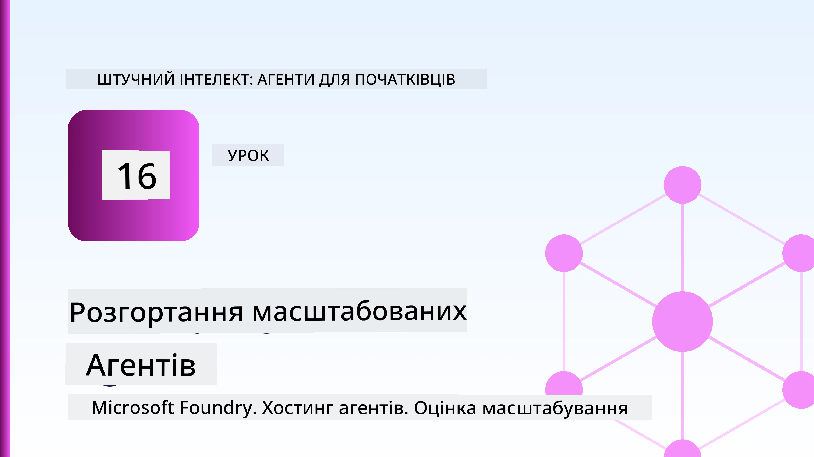
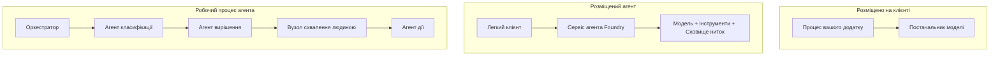
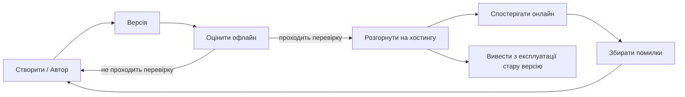
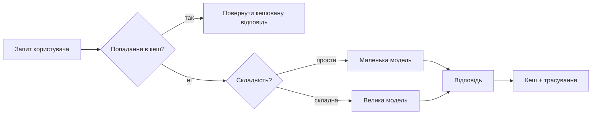

# Розгортання масштабованих агентів за допомогою Microsoft Foundry



До цього моменту курсу ви створювали агентів, які запускалися на вашому ноутбуці, всередині блокнота, керовані `az login` та кількома змінними оточення. Це саме правильний спосіб навчання. Але це не правильний спосіб запуску агента, від якого залежить тисячі клієнтів о 3-й годині ночі.

Цей урок про розрив між "це працює на моєму комп’ютері" та "це працює надійно та доступно в продакшені". Ми долаємо цей розрив, використовуючи **Microsoft Foundry** та **Microsoft Foundry Agent Service**, створюючи справжнього агента служби підтримки клієнтів із інструментами, пошуком, пам’яттю, оцінкою та моніторингом.

## Вступ

У цьому уроці буде розглянуто:

- Різницю між **прототипом агента** та **розгорнутим агентом**, і чому перехід стосується здебільшого всього *навколо* моделі.
- **Шаблони розгортання** агентів: клієнтський хостинг, хостинг сервісом (Hosted Agents), та оркестровані робочі процеси.
- **Життєвий цикл агента** у Microsoft Foundry — створення, версія, розгортання, оцінка, спостереження, відкликання.
- **Стратегії масштабування**: маршрутизація моделей, кешування, паралельність, та безстанний дизайн.
- **Спостережуваність** за допомогою OpenTelemetry та трасування Foundry.
- **Оптимізація витрат** через вибір моделей, маршрутизацію та фільтри оцінки.
- **Корпоративні міркування**: управління, людське затвердження та безпечне розгортання MCP-серверів у продакшені.

## Цілі навчання

Після завершення уроку ви будете знати, як:

- Обрати правильний шаблон розгортання для конкретного навантаження агента.
- Розгорнути агента до Microsoft Foundry Agent Service так, щоб він був версійованим, керованим та спостережуваним.
- Інструментувати агента для трасування і підключити конвеєр оцінки, що виконується перед кожним релізом.
- Застосувати маршрутизацію моделей та кешування для контролю затримок і вартості при масштабуванні.
- Додати людину в ланцюг затвердження для ризикованих дій та інтегрувати MCP сервер у безпечний для продакшену спосіб.

## Попередні вимоги

Для цього уроку припускається, що ви пройшли попередні уроки і впевнено володієте:

- Створенням агентів з використанням [Microsoft Agent Framework](../14-microsoft-agent-framework/README.md) (Урок 14).
- [Використання інструментів](../04-tool-use/README.md) (Урок 4) та [Agentic RAG](../05-agentic-rag/README.md) (Урок 5).
- [Пам’ять агента](../13-agent-memory/README.md) (Урок 13) та [Agentic Protocols / MCP](../11-agentic-protocols/README.md) (Урок 11).
- [Спостережуваність та оцінка](../10-ai-agents-production/README.md) (Урок 10) — цей урок безпосередньо на ньому базується.

Вам також знадобиться:

- **Підписка Azure** та **проект Microsoft Foundry** з принаймні однією розгорнутою моделлю чату.
- **Azure CLI** з автентифікацією (`az login`).
- Python 3.12+ та пакети, перелічені у репозиторії [`requirements.txt`](../../../requirements.txt).

## Від прототипу до продакшену: що насправді змінюється

Прототип агента та продакшен-агент мають однаковий основний цикл — подумати, викликати інструменти, відповісти. Змінюється все, що оточує цей цикл. Модель — приблизно 20% продакшен-агента; решта 80% — це операційний каркас.

| Питання | Прототип | Продакшен |
| --- | --- | --- |
| **Хостинг** | Працює у вашому блокноті | Працює як хостинг сервіс, версійований та розгорнутий |
| **Ідентичність** | Ваш `az login` токен | Керована ідентичність з обмеженим RBAC |
| **Стан** | В пам’яті, втрачається при рестарті | Зовнішній (зберігання ниток, сервіс пам’яті) |
| **Помилки** | Ви бачите трасування помилки | Повторні спроби, резервні варіанти, dead-letter, повідомлення |
| **Вартість** | "Кілька центів" | Відслідковується на запит, маршрутизується, кешується, бюджетується |
| **Якість** | Ви оцінюєте результат візуально | Оцінюється автоматично перед кожним релізом |
| **Довіра** | Ви затверджуєте кожну дію | Політика + людина в циклі для ризикованих дій |

Запам’ятайте цю таблицю. Кожен розділ нижче відповідає одному з цих рядків.

## Шаблони розгортання агентів

Є три шаблони, які ви часто будете комбінувати.

### 1. Клієнтські агенти

Об'єкт агента живе всередині *вашого* процесу приложення. Ваш код викликає провайдера моделі напряму; цикл роздумів працює у вашому сервісі. Це те, що було в кожному попередньому уроці.

- **Використовуйте, коли** вам потрібний повний контроль над циклом, власний middleware або ви вбудовуєте агента в існуючий бекенд.
- **Компроміс**: ви самі відповідаєте за масштабування, стан і стійкість.

### 2. Хостинговані агенти (Foundry Agent Service)

Агент *реєструється як ресурс* у Microsoft Foundry. Foundry хостить цикл роздумів, зберігає нитки, застосовує безпеку контенту та RBAC, робить агента видимим у порталі Foundry. Ваш додаток стає тонким клієнтом, що створює нитки й читає відповіді.

- **Використовуйте, коли** потрібна надійність, вбудована спостережуваність, керування та менша операційна поверхня.
- **Компроміс**: менший низькорівневий контроль в обмін на кероване середовище виконання.

### 3. Робочі процеси агента

Декілька агентів (та інструментів) з'єднуються у граф із явним контролем потоку — послідовні кроки, розгалуження, вузли людського затвердження, стійкі контрольні точки, що можуть призупиняти та відновлювати роботу. Це можливість Microsoft Agent Framework **Workflows** на рівні масштабного розгортання.

- **Використовуйте, коли** одне завдання охоплює кілька спеціалізованих агентів або потребує кроку затвердження посередині.
- **Компроміс**: більше рухомих частин; потрібна спостережуваність оркестраторного рівня.



## Життєвий цикл агента на Microsoft Foundry

Розгортання агента — це не одноразове `push`. Це цикл, який дуже схожий на цикл випуску програмного забезпечення, тому що саме ним є.



Ключова ідея, перенесена з [Уроку 10](../10-ai-agents-production/README.md): **офлайн оцінка — це фільтр, а не другорядний момент.** Нова версія агента не випускається, якщо не проходить ваші пороги оцінки. Онлайн спостережуваність потім повертає реальні збої у ваш офлайн тестовий набір. Ось увесь цикл.

## Стратегії масштабування

Масштабування агента відрізняється від масштабування безстанного веб-API, оскільки кожен запит може викликати кілька дорогих моделей і інструментів. Чотири техніки несуть основне навантаження.

**Обробка запитів без стану.** Не зберігайте стан користувача в пам’яті процесу. Збережіть нитки розмов у сховищі ниток Foundry або сервісі пам’яті, щоби будь-який екземпляр міг обробити будь-який запит. Це дозволяє маштабуватися горизонтально — додавайте екземпляри без «прикріплених» сесій.

**Маршрутизація моделей.** Не кожен запит потребує вашої найпотужнішої (і найдорожчої) моделі. Маршрутизуйте прості запити — класифікація намірів, короткі фактичні відповіді — до маленької, швидкої моделі, і залишайте велику модель для справжніх роздумів. Foundry **Model Router** може зробити це за вас, або ви можете реалізувати легку класифікацію самостійно. Ви створите DIY версію у лабораторії.

**Кешування відповідей.** Багато запитів до служби підтримки мають майже ідентичний зміст ("як скинути пароль?"). Кешуйте відповіді на поширені запитання і подавайте їх без виклику моделі. Навіть помірна кількість попадань у кеш суттєво знижує вартість і затримку.

**Паралельність і керування навантаженням.** Провайдери моделей мають обмеження по частоті викликів. Обмежуйте паралельність, використовуйте повторні спроби з експоненціальним збільшенням інтервалу, і коректно обробляйте відмови (черга з повідомленням "ми працюємо" краща за помилку 500).



## Спостережуваність у продакшені

Ви не можете керувати тим, чого не бачите. Як було розглянуто в Уроці 10, Microsoft Agent Framework нативно емінує трасування **OpenTelemetry** — кожен виклик моделі, запуск інструменту, або крок оркестрації стає спеном. У продакшені ви експортуєте ці спени в Microsoft Foundry (або будь-який бекенд, сумісний з OTel), щоби:

- Відслідковувати скаргу окремого клієнта наскрізь через усі виклики моделей і інструментів.
- Спостерігати p50/p95 затримки та вартість на запит з часом.
- Сповіщати про стрибки рівня помилок та аномалії вартості раніше за користувачів (або фінансову команду).

```python
from agent_framework.observability import get_tracer

tracer = get_tracer()

with tracer.start_as_current_span("support_request") as span:
    span.set_attribute("customer.tier", "enterprise")
    span.set_attribute("routed.model", "gpt-4.1-mini")
    # виконання агента відстежується автоматично в межах цього проміжку
```

Атрибути як `customer.tier` та `routed.model` перетворюють стіну трасувань у осмислені запитання ("чи занадто часто клієнтів бізнес-класу направляють на малу модель?").

## Оптимізація вартості

Вартість у продакшен-агентах переважно визначається токенами. Три важелі за впливом:

1. **Підібрати модель по розміру.** Маленька модель, що проходить оцінку, майже завжди дешевша за велику, що її також пройшла. Використовуйте оцінювання, щоб *довести*, що маленька модель достатньо хороша, замість того, щоб із пересторогою брати найбільшу модель.
2. **Маршрутизація за складністю.** Як вище — платіть за велику модель лише для запитів, що потребують складних роздумів.
3. **Агресивне кешування.** Найдешевший виклик моделі — це той, який ніколи не зроблено.

Фільтри оцінки та контроль вартості — це одна дисципліна з двох боків: оцінка показує *підлогу якості*, маршрутизація і кешування тримають вас якнайближче до *вартості* цієї підлоги.

## Корпоративні міркування при розгортанні

**Управління.** Хостинговані агенти успадковують RBAC Foundry, безпеку контенту і аудит логів. Дайте кожному агенту керовану ідентичність із мінімальними необхідними правами — доступ тільки для читання до бази знань, обмежений доступ до API для квитків, нічого зайвого.

**Людина в циклі.** Деякі дії занадто важливі для повної автоматизації — видача повернення коштів, видалення акаунту, ескалація до юридичного відділу. Microsoft Agent Framework підтримує інструменти з **потребою в затвердженні**: агент пропонує дію, виконання призупиняється, людина затверджує чи відхиляє, і робочий процес продовжується. Ви бачили цей примітив у [Уроці 6](../06-building-trustworthy-agents/README.md); тут ви його розгортаєте.

**MCP в продакшені.** [MCP](../11-agentic-protocols/README.md) дозволяє агенту використовувати зовнішні інструменти через стандартний інтерфейс. У продакшені кожен MCP сервер вважається недовіреною межею: фіксуйте версію сервера, запускайте з обмеженою ідентичністю, перевіряйте вихідні дані й ніколи не передавайте секрети. MCP сервер — залежність, а залежності потрібно патчити, аудитувати і обмежувати за частотою викликів.

```mermaid
flowchart TB
    subgraph Dev[Архітектура розробки]
        D1[Ноутбук] --> D2[Фреймворк агента]
        D2 --> D3[Провайдер моделі]
        D2 --> D4[Локальні інструменти]
    end
    subgraph Deploy[Архітектура розгортання]
        E1[CI pipeline] --> E2[Контроль якості (evaluation gate)]
        E2 -->|пройшов| E3[Сервіс агента Foundry]
        E3 --> E4[Версійований хостинговий агент]
    end
    subgraph Run[Архітектура виконання]
        F1[Клієнтський додаток] --> F2[Хостинговий агент]
        F2 --> F3[Роутер моделей]
        F2 --> F4[Azure AI Search RAG]
        F2 --> F5[Сервіс пам’яті]
        F2 --> F6[Інструменти MCP]
        F2 --> F7[OTel -> трасування Foundry]
        F2 --> F8[Людське затвердження]
    end
```

Ці три діаграми — розробка, розгортання, час виконання — це один агент на трьох етапах життя. Наступна лабораторна робота проведе вас через процес створення.

## Практична лабораторія: Агент служби підтримки, готовий до продакшену

Відкрийте [`code_samples/16-python-agent-framework.ipynb`](./code_samples/16-python-agent-framework.ipynb) і пройдіть його повністю. Ви зберете **агента служби підтримки Contoso**, у якого враховано всі продакшен-проблеми:

1. **Виклик інструментів** — перевірка статусу замовлення та відкриття запитів підтримки.
2. **RAG** — відповіді на запитання політики з бази знань (Azure AI Search, із резервною пам’яттю в пам’яті, щоб блокнот працював без Search ресурсу).
3. **Пам’ять** — запам’ятовування клієнта в ході розмови.
4. **Маршрутизація моделей** — класифікатор складності маршрутизує кожен запит до маленької або великої моделі.
5. **Кешування відповідей** — повторні запитання обслуговуються з кешу.
6. **Людське затвердження** — повернення коштів вище порогу призупиняються для підпису людини.
7. **Конвеєр оцінки** — невеликий офлайн тестовий набір оцінює агента і служить фільтром релізу.
8. **Спостережуваність** — OpenTelemetry трасування для кожного запиту.

### Покрокова демонстрація

Блокнот організований так, щоб кожна продакшен-залежність була автономним, виконуваним розділом. Серцем є обробник запитів із маршрутизацією та кешуванням:

```python
async def handle_support_request(query: str, customer_id: str) -> str:
    # 1. Обслуговувати з кешу, коли це можливо.
    cached = response_cache.get(normalize(query))
    if cached:
        return cached

    # 2. Маршрутизувати за складністю для контролю витрат.
    model = "gpt-4.1-mini" if is_simple(query) else "gpt-4.1"

    # 3. Запускати агент всередині спану трасування для спостереження.
    with tracer.start_as_current_span("support_request") as span:
        span.set_attribute("routed.model", model)
        span.set_attribute("customer.id", customer_id)
        response = await support_agent.run(query, model=model)

    # 4. Кешувати і повертати.
    response_cache.set(normalize(query), response.text)
    return response.text
```

Фільтр оцінки, що охороняє реліз, виглядає так:

```python
async def evaluation_gate(agent, test_cases, threshold: float = 0.8) -> bool:
    passed = 0
    for case in test_cases:
        result = await agent.run(case["input"])
        if score_response(result.text, case["expected"]) >= 0.8:
            passed += 1
    pass_rate = passed / len(test_cases)
    print(f"Evaluation pass rate: {pass_rate:.0%} (gate: {threshold:.0%})")
    return pass_rate >= threshold  # розгортати лише якщо ворота проходять перевірку
```

Читайте кожен рядок — блокнот тримає примітиви навмисно маленькими, щоб нічого не було приховано за викликом фреймворку.

## Перевірка розгорнутого агента за допомогою смок-тестів

Фільтр оцінки вище працює *офлайн* з вашим об’єктом агента. Після розгортання як Hosted Agent потрібно додатковий, ще дешевший перевірочний тест: **ч чи справді розгорнутий кінцевий пункт відповідає?**

Розгортання «успішне» лише доводить, що контрольна площина прийняла визначення — це не означає, що агент відповідає. Відсутність залежності, неправильна маршрутизація моделі або протерміноване з’єднання можуть залишити зелене розгортання, що нічого не повертає. **Смок-тест** виявляє це за секунди, при кожному розгортанні, без витрат на повну оцінку.

У цьому репозиторії є готовий до використання конвеєр смок-тестів, побудований на GitHub Action [AI Smoke Test](https://github.com/marketplace/actions/ai-smoke-test):

- **Каталог** — [`tests/lesson-16-smoke-tests.json`](../../../tests/lesson-16-smoke-tests.json) містить підказки та твердження для агента підтримки Contoso (відповіді на запити політики, пошук замовлення, залишатись в темі й підтримка багатокрокових ниток). Каталоги для агентів інших уроків лежать поруч — див. [`tests/README.md`](../tests/README.md).
- **Робочий процес** — [`.github/workflows/smoke-test.yml`](../../../.github/workflows/smoke-test.yml) виконує вхід через Azure OIDC і POST-ить кожну підказку до кінцевої точки Responses агента, відхиляючи завдання при будь-якому пропуску тверджень.

```yaml
- name: Smoke-test hosted agent
  uses: JFolberth/ai-smoketest@v1
  with:
    project_endpoint: ${{ inputs.project_endpoint }}
    agent_name: ContosoSupportAgent
    tests_file: tests/lesson-16-smoke-tests.json
```


Запустіть це з вкладки **Actions**, коли ваш агент буде розгорнутий, вказуючи кінцеву точку проєкту Foundry і ім’я агента. Федерованій ідентичності потрібна роль **Azure AI User** у межах проєкту Foundry. Уявіть шари як піраміду: димові тести (доступний і відповідає?) запускаються при кожному розгортанні, офлайн оцінка (достатньо добра для запуску?) — перед підвищенням версії, а онлайн оцінка (як він працює у реальних умовах?) — постійно.

## Перевірка знань

Перевірте свої знання перед переходом до завдання.

**1. Приблизно яка частина виробничого агента — це «модель», а що таке решта?**

<details>
<summary>Відповідь</summary>

Модель — це меншість системи — часто вважають близько 20%. Решта — це операційний каркас: хостинг і версіонування, ідентичність і RBAC, зовнішній стан, обробка збоїв, відстеження вартості, оцінка та управління за участю людини в циклі. Перехід у виробництво — це здебільшого побудова всього *навколо* циклу розуміння.
</details>

**2. Коли ви обрали б Hosted Agent замість агента, розміщеного на клієнті?**

<details>
<summary>Відповідь</summary>

Коли вам потрібне кероване середовище виконання з вбудованою стійкістю (потоки, що зберігаються та можуть відновлюватися), спостережуваністю, безпекою контенту та RBAC, і ви готові пожертвувати частиною низькорівневого контролю циклу розуміння задля зменшення операційної поверхні. Клієнтське розміщення переважне, коли потрібен повний контроль циклу або агент інтегрують у існуючу бекенд-інфраструктуру.
</details>

**3. Чому масштабований агент повинен бути безстанним у пам’яті власного процесу?**

<details>
<summary>Відповідь</summary>

Щоб будь-який екземпляр міг обробити будь-який запит, що дає можливість горизонтального масштабування без прив’язки до сесій (sticky sessions). Стан розмови користувача зберігається зовні, у сховищі потоків або службі пам’яті. Якби стан зберігався в пам’яті процесу, його було б втрачено після перезапуску, і не можна було б вільно розподіляти навантаження.
</details>

**4. Яку проблему вирішує маршрутизація моделей і як це пов’язано з оцінкою?**

<details>
<summary>Відповідь</summary>

Маршрутизація направляє прості запити до маленької, дешевої, швидкої моделі та резервує велику модель для справжнього розуміння, контролюючи затримки й вартість. Це пов’язано з оцінкою, оскільки лише оцінка доводить, що маленька модель достатньо хороша для певного класу запитів — маршрутизація без оцінки — це здогадка.
</details>

**5. Що таке «ворота оцінки» і де вони знаходяться в життєвому циклі?**

<details>
<summary>Відповідь</summary>

Ворота оцінки запускають офлайн тестовий набір для нової версії агента і блокують розгортання, якщо відсоток проходження не перевищує поріг. Вони розташовані між «версією» та «розгортанням» у життєвому циклі, роблячи якість передумовою для релізу, а не перевіркою після запуску.
</details>

**6. Чому сервер MCP слід вважати незахищеним кордоном у виробництві?**

<details>
<summary>Відповідь</summary>

Бо це зовнішня залежність, до якої звертається ваш агент. Версію сервера слід зафіксувати, запускати з ідентичністю з обмеженими правами, валідовувати його вихідні дані, обмежувати швидкість звернень і ніколи не передавати йому секрети — ту ж дисципліну, що і до будь-якої сторонньої залежності. Його виводи впливають на розуміння агента, тому недовірена перевірка — це ризик безпеки.
</details>

**7. Яка єдина зміна зазвичай найбільше впливає на вартість виробничого агента і чому?**

<details>
<summary>Відповідь</summary>

Правильний вибір розміру моделі — використання найменшої моделі, яка все ще проходить ваші ворота оцінки. Вартість здебільшого формується токенами, і менша модель, що відповідає вимогам якості, майже завжди дешевша за більшу. Кешування і маршрутизація знижують вартість ще більше, але вибір правильної базової моделі має найбільший первинний ефект.
</details>

**8. Яку роль відіграють атрибути спану, такі як `customer.tier` і `routed.model`, у спостережуваності?**

<details>
<summary>Відповідь</summary>

Вони перетворюють сирі трасування в зрозумілі бізнес-запитання. Без атрибутів ви маєте стіну спанів; з атрибутами можна запитувати: «чи часто корпоративних клієнтів маршрутизують на маленьку модель?» або «яка модель обробляє наші найповільніші запити?» Атрибути допомагають розрізати телеметрію за вимірами, важливими для вашої роботи.
</details>

## Завдання

Візьміть агента підтримки клієнтів із лабораторії і адаптуйте його для конкретного сценарію: **агент підтримки з питаннями підписки для SaaS-компанії.**

Ваше завдання має містити:

1. **Замініть інструменти** на релевантні для білінгу: `get_subscription_status`, `get_invoice`, і `issue_credit` (кредити понад $50 потребують схвалення людиною).
2. **Додайте три RAG документи**, що охоплюють політику повернення коштів, білінговий цикл і політику скасування.
3. **Розширте набір оцінок** до щонайменше восьми випадків, включно з щонайменше двома, що *мають* активувати шлях схвалення людиною, і підтвердіть, що ваші ворота оцінки правильно приймають або відхиляють.
4. **Додайте один звіт вартості**: після запуску десяти напівзмішаних запитів через агента виведіть, скільки запитів було спрямовано до маленької моделі, скільки — до великої, і скільки обслуговано з кешу.

Напишіть короткий абзац (у markdown-клітинці), у якому поясніть, яке правило маршрутизації моделей ви обрали і як ви б його валідували на реальному трафіку. Однієї правильної відповіді немає — вас оцінюють за узгодженість інтеграції виробничих аспектів.

## Підсумок

У цьому уроці ви перевели агента від прототипу до виробництва з Microsoft Foundry:

- Перехід до виробництва — це здебільшого про **операційний каркас** навколо моделі — хостинг, ідентичність, стан, обробку збоїв, вартість, якість і довіру.
- Ви вивчили три **патерни розгортання** — клієнтське розміщення, Hosted Agents і Agent Workflows — і коли кожен з них підходить.
- Ви пройшли **життєвий цикл агента**, де офлайн **оцінка виконує роль воріт релізу**, а онлайн спостережуваність повертає інформацію про збої в набір тестів.
- Ви застосували **стратегії масштабування** — безстанний дизайн, маршрутизацію моделі, кешування та обмежену паралельність — і пов’язали їх з **оптимізацією вартості**.
- Ви інтегрували **корпоративний контроль**: RBAC, схвалення за участю людини і безпечну для виробництва інтеграцію MCP.
- Ви побудували **агента підтримки клієнтів, готового до виробництва**, що поєднує всі ці аспекти в робочому коді.

Наступний урок пройде зворотній шлях: замість масштабування агентів у хмару, ви розмістите їх *на одному* комп’ютері розробника і запустите повністю локально.

## Додаткові ресурси

- <a href="https://learn.microsoft.com/azure/ai-foundry/what-is-azure-ai-foundry" target="_blank">Документація Microsoft Foundry</a>
- <a href="https://learn.microsoft.com/azure/ai-foundry/agents/overview" target="_blank">Огляд Microsoft Foundry Agent Service</a>
- <a href="https://aka.ms/ai-agents-beginners/agent-framework" target="_blank">Microsoft Agent Framework</a>
- <a href="https://learn.microsoft.com/azure/ai-foundry/concepts/model-router" target="_blank">Маршрутизатор моделей у Microsoft Foundry</a>
- <a href="https://learn.microsoft.com/azure/search/search-what-is-azure-search" target="_blank">Azure AI Search</a>
- <a href="https://opentelemetry.io/" target="_blank">OpenTelemetry</a>
- <a href="https://github.com/marketplace/actions/ai-smoke-test" target="_blank">AI Smoke Test GitHub Action</a>
- <a href="https://modelcontextprotocol.io/" target="_blank">Model Context Protocol (MCP)</a>

## Попередній урок

[Створення агентів використання комп’ютера (CUA)](../15-browser-use/README.md)

## Наступний урок

[Створення локальних AI агентів](../17-creating-local-ai-agents/README.md)

---

<!-- CO-OP TRANSLATOR DISCLAIMER START -->
**Відмова від відповідальності**:
Цей документ було перекладено за допомогою сервісу штучного інтелекту для перекладу [Co-op Translator](https://github.com/Azure/co-op-translator). Хоча ми прагнемо до точності, будь ласка, майте на увазі, що автоматичні переклади можуть містити помилки або неточності. Оригінальний документ рідною мовою слід вважати авторитетним джерелом. Для критично важливої інформації рекомендується професійний людський переклад. Ми не несемо відповідальності за будь-які непорозуміння або неправильні тлумачення, що виникли внаслідок використання цього перекладу.
<!-- CO-OP TRANSLATOR DISCLAIMER END -->