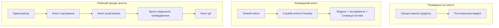
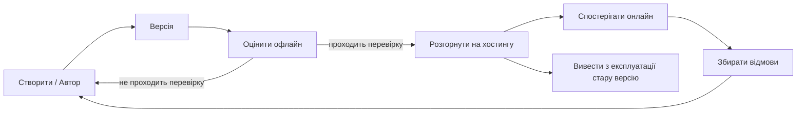
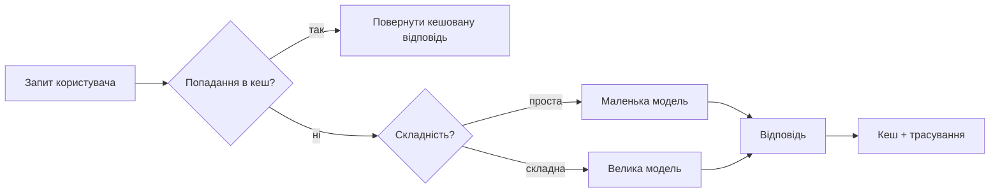
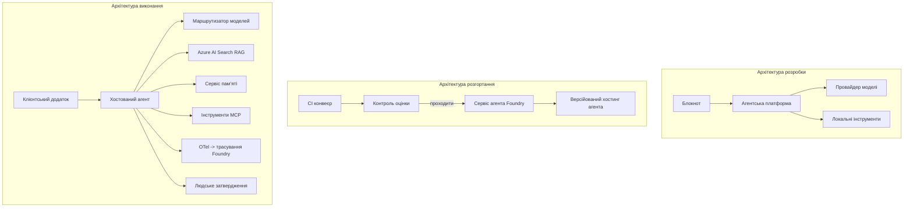

# Розгортання масштабованих агентів за допомогою Microsoft Foundry


До цього моменту в курсі ви створювали агентів, які працюють на вашому ноутбуці, всередині блокнота, керовані `az login` та кількома змінними оточення. Це саме той правильний спосіб навчання. Це не той спосіб запуску агента, на якого тисячі клієнтів покладаються о 3 годині ночі.

Цей урок присвячений розриву між "це працює на моїй машині" і "це працює надійно і доступно у виробництві". Ми закриваємо цей розрив за допомогою **Microsoft Foundry** та **Microsoft Foundry Agent Service**, створюючи реального агента підтримки клієнтів з інструментами, пошуком, пам’яттю, оцінкою та моніторингом.

## Вступ

У цьому уроці буде розглянуто:

- Різницю між **прототипним агентом** і **розгорнутим агентом**, та чому перехід переважно стосується всього, що *навколо* моделі.
- **Патерни розгортання** агентів: розміщення на клієнті, на сервісі (Hosted Agents) та оркестрація робочих процесів.
- **Життєвий цикл агента** у Microsoft Foundry — створення, версіювання, розгортання, оцінка, спостереження, виведення з експлуатації.
- **Стратегії масштабування**: маршрутизація моделей, кешування, конкурентність і безстанний дизайн.
- **Спостережуваність** з OpenTelemetry та трасуванням у Foundry.
- **Оптимізація вартості** через вибір моделей, маршрутизацію та ворота оцінки.
- **Питання підприємства**: управління, затвердження людиною та безпечне виконання серверів MCP у виробництві.

## Цілі навчання

Після проходження цього уроку ви знатимете, як:

- Вибрати правильний патерн розгортання для навантаження агента.
- Розгорнути агента в Microsoft Foundry Agent Service, щоб він мав версії, був керованим та спостережуваним.
- Інструментувати агента для трасування і налаштувати конвеєр оцінок, який працює перед кожним релізом.
- Застосовувати маршрутизацію моделей та кешування, щоб зберігати затримки і вартість під контролем при масштабі.
- Додати ворота затвердження людиною для високоризикових дій і інтегрувати сервер MCP у безпечний спосіб для виробництва.

## Попередні умови

Цей урок передбачає, що ви завершили попередні уроки і впевнені в:

- Створенні агентів за допомогою [Microsoft Agent Framework](../14-microsoft-agent-framework/README.md) (Урок 14).
- [Використанні інструментів](../04-tool-use/README.md) (Урок 4) та [Agentic RAG](../05-agentic-rag/README.md) (Урок 5).
- [Пам’яті агента](../13-agent-memory/README.md) (Урок 13) та [Agentic Protocols / MCP](../11-agentic-protocols/README.md) (Урок 11).
- [Спостережуваності та оцінки](../10-ai-agents-production/README.md) (Урок 10) — цей урок безпосередньо на ньому базується.

Вам також знадобиться:

- **Підписка Azure** та **проект Microsoft Foundry** з принаймні однією розгорнутою моделлю чату.
- Аутентифікований **Azure CLI** (`az login`).
- Python 3.12+ та пакети з репозиторію [`requirements.txt`](../../../requirements.txt).

## Від прототипу до виробництва: що насправді змінюється

Прототип агент і виробничий агент мають однаковий основний цикл — мислити, викликати інструменти, відповідати. Змінюється все, що обгортає цей цикл. Модель — це приблизно 20% виробничого агента; інші 80% — це операційний каркас.

| Питання | Прототип | Виробництво |
| --- | --- | --- |
| **Хостинг** | Працює у вашому блокноті | Працює як сервіс з версіями і розгортанням |
| **Ідентичність** | Ваш токен `az login` | Керована ідентичність з обмеженим RBAC |
| **Статус** | У пам’яті, втрачається при рестарті | Зовнішнє зберігання (thread store, memory service) |
| **Несправності** | Ви бачите трасування помилок | Повторні спроби, резервні варіанти, dead-letter, оповіщення |
| **Вартість** | "Кілька центів" | Відстежується по запитах, маршрутизується, кешується, бюджетування |
| **Якість** | Ви оцінюєте вручну | Автоматична оцінка перед кожним релізом |
| **Довіра** | Ви затверджуєте кожну дію | Політика + людина в циклі для ризикових дій |

Запам'ятайте цю таблицю. Кожен розділ нижче відноситься до одного з рядків.

## Патерни розгортання агентів

Існує три патерни, які ви використовуватимете, часто у комбінації.

### 1. Агент, хостований на клієнті

Об’єкт агента знаходиться всередині *вашого* процесу додатку. Ваш код викликає модель безпосередньо; цикл роздумів працює у вашому сервісі. Це те, що було у всіх попередніх уроках.

- **Використовуйте, коли** потрібен повний контроль над циклом, кастомний middleware або агент вбудовується всередину існуючого бекенду.
- **Компроміс**: ви берете на себе масштабування, стан та стійкість.

### 2. Hosted Agents (Foundry Agent Service)

Агент *зареєстрований як ресурс* у Microsoft Foundry. Foundry хостить цикл роздумів, зберігає треди, забезпечує безпеку контенту та RBAC, робить агента видимим у порталі Foundry. Ваш додаток стає тонким клієнтом, що створює треди і читає відповіді.

- **Використовуйте, коли** потрібна надійність, вбудована спостережуваність, керування та менша операційна площа.
- **Компроміс**: менший низькорівневий контроль в обмін на кероване виконання.

### 3. Робочі процеси агента

Кілька агентів (і інструментів) складаються у граф із явним потоком управління — послідовні кроки, розгалуження, вузли затвердження людиною та довготривалі контрольні точки, які можна призупиняти та відновлювати. Це можливість Microsoft Agent Framework **Workflows**, застосована для масштабного розгортання.

- **Використовуйте, коли** одна задача охоплює кілька спеціалізованих агентів або потребує кроку затвердження посередині.
- **Компроміс**: більше рухомих частин; потребує спостережуваності на рівні оркестрації.



## Життєвий цикл агента у Microsoft Foundry

Розгортання агента — це не одноразовий `push`. Це цикл, і він дуже схожий на цикл випуску софту, бо це і є такий цикл.



Ключова ідея, взята з [Уроку 10](../10-ai-agents-production/README.md): **офлайн-оцінка — це ворота, а не думка на потім.** Нова версія агента не виходить у реліз, поки не пройде ваші критерії оцінки. Онлайн-спостережуваність потім подає реальні помилки назад у офлайн-набір тестів. Це весь цикл.

## Стратегії масштабування

Масштабування агента відрізняється від масштабування безстанного веб-API, бо кожен запит може викликати кілька дорогих звернень до моделі і інструментів. Чотири техніки несуть основне навантаження.

**Обробка без стану.** Не зберігайте стан користувача в пам’яті процесу. Зберігайте треди розмов у Foundry thread store або memory service, щоб будь-який інстанс міг обробити будь-який запит. Це дозволяє масштабуватися горизонтально — додайте інстанси, без «липких» сесій.

**Маршрутизація моделей.** Не кожен запит потребує вашої найпотужнішої (і найдорогої) моделі. Напрямуйте прості запити — класифікацію намірів, короткі фактичні відповіді — до маленької, швидкої моделі, і залиште велику модель для справжніх міркувань. Foundry's **Model Router** може зробити це для вас, або ви можете реалізувати легкий класифікатор самі. Ви побудуєте DIY варіант у лабораторній роботі.

**Кешування відповідей.** Багато запитів підтримки — майже дублікати ("як скинути мій пароль?"). Кешуйте відповіді на поширені питання і подавайте їх без звернення до моделі. Навіть скромний відсоток попадань у кеш суттєво знижує вартість і затримки.

**Конкурентність і зворотний тиск.** Постачальники моделей мають обмеження швидкості. Обмежуйте конкурентність, використовуйте повторні спроби з експоненціальним відступом і м’яко відмовляйте (черговий відповідь «ми над цим працюємо» краще за помилку 500).



## Спостережуваність у виробництві

Ви не можете керувати тим, чого не бачите. Як описано в Уроці 10, Microsoft Agent Framework нативно емить **OpenTelemetry** трейси — кожен виклик моделі, інструменту і крок оркестрації стає спаном. У виробництві ви експортуєте спани до Microsoft Foundry (або будь-якої сумісної з OTel системи), щоб:

- Відслідкувати одну скаргу клієнта від початку до кінця через усі виклики моделей і інструментів.
- Слідкувати за латентністю p50/p95 і вартістю на запит у часі.
- Сповіщати про сплески помилок і аномалії вартості раніше, ніж користувачі (або ваш фінансовий відділ) це помітять.

```python
from agent_framework.observability import get_tracer

tracer = get_tracer()

with tracer.start_as_current_span("support_request") as span:
    span.set_attribute("customer.tier", "enterprise")
    span.set_attribute("routed.model", "gpt-5-nano")
    # виконання агента автоматично відслідковується всередині цього проміжку часу
```

Атрибути на кшталт `customer.tier` і `routed.model` перетворюють суцільний потік трейсов у відповіді на запитання ("чи занадто часто корпоративних клієнтів направляють до маленької моделі?").

## Оптимізація вартості

Вартість у виробничих агентах переважно залежить від токенів. Три важелі у порядку впливу:

1. **Правильний розмір моделі.** Маленька модель, що проходить оцінку, майже завжди дешевша за велику, яка також проходить. Використовуйте оцінку, щоб *довести*, що маленька модель достатньо хороша натомість за замовчуванням брати найбільшу модель з пересторогою.
2. **Маршрутизація за складністю.** Як вище — платіть за великі моделі лише за запити, що потребують великої моделі.
3. **Агресивне кешування.** Найдешевший виклик моделі — це той, що ви ніколи не робите.

Ворота оцінки і контроль вартості — це одна дисципліна, розглянута з двох боків: оцінка дає *підлогу якості*, маршрутизація і кешування тримають вас якомога ближче до *вартості* цієї підлоги.

## Питання розгортання для підприємств

**Управління.** Hosted Agents наслідують RBAC Foundry, безпеку контенту і аудит-логування. Дайте кожному агенту керовану ідентичність з мінімальними привілеями — доступ лише для читання бази знань, обмежений доступ до API ticketing, нічого більше.

**Людина в циклі.** Деякі дії надто відповідальні для повної автоматизації — видача відшкодування, видалення акаунту, ескалація до юридичної команди. Microsoft Agent Framework підтримує інструменти з **потрібним затвердженням**: агент пропонує дію, виконання призупиняється, людина затверджує чи відхиляє, і робочий процес продовжується. Ви бачили примітив у [Уроці 6](../06-building-trustworthy-agents/README.md); тут ви його розгортаєте.

**MCP у виробництві.** [MCP](../11-agentic-protocols/README.md) дозволяє вашому агенту використовувати зовнішні інструменти через стандартний інтерфейс. У виробництві розглядайте кожен MCP сервер як недовірену межу: прив’язуйте версію сервера, запускайте з обмеженою ідентичністю, перевіряйте його результати та ніколи не розкривайте йому секрети. MCP сервер — це залежність, а залежності потрібно патчити, аудіювати і обмежувати за частотою.



Ці три діаграми — розробка, розгортання, виконання — це той самий агент у трьох стадіях життя. Наступна лабораторна робота проведе вас крізь процес створення.

## Практична лабораторна: Агент підтримки клієнтів готовий до виробництва

Відкрийте [`code_samples/16-python-agent-framework.ipynb`](./code_samples/16-python-agent-framework.ipynb) і пройдіть його повністю. Ви зібраєте **агента підтримки клієнтів Contoso** зі всіма виробничими вимогами:

1. **Виклик інструментів** — пошук статусу замовлення та відкриття звернень підтримки.
2. **RAG** — відповідь на політичні питання з бази знань (Azure AI Search, з резервною пам’яттю, щоб блокнот працював без Search ресурсу).
3. **Пам’ять** — запам’ятовування клієнта через ходи розмови.
4. **Маршрутизація моделей** — класифікатор складності направляє кожний запит до маленької чи великої моделі.
5. **Кешування відповідей** — повторювані питання віддаються з кешу.
6. **Затвердження людиною** — відшкодування понад поріг призупиняються на підпис людини.
7. **Конвеєр оцінки** — невеликий офлайн-набір тестів оцінює агента та служить воротами релізу.
8. **Спостережуваність** — трасування OpenTelemetry навколо кожного запиту.

### Покроково

Блокнот організований так, що кожна виробнича турбота — це самодостатній, виконуваний розділ. Серцем є обробник запитів з маршрутизацією і кешуванням:

```python
async def handle_support_request(query: str, customer_id: str) -> str:
    # 1. Обслуговувати з кешу, коли це можливо.
    cached = response_cache.get(normalize(query))
    if cached:
        return cached

    # 2. Маршрутизувати за складністю, щоб контролювати вартість.
    model = "gpt-5-nano" if is_simple(query) else "gpt-5-mini"

    # 3. Запустити агент в межах трасувального спану для спостереження.
    with tracer.start_as_current_span("support_request") as span:
        span.set_attribute("routed.model", model)
        span.set_attribute("customer.id", customer_id)
        response = await support_agent.run(query, model=model)

    # 4. Кешувати і повертати.
    response_cache.set(normalize(query), response.text)
    return response.text
```

Ворота оцінки, що охороняють реліз, виглядають так:

```python
async def evaluation_gate(agent, test_cases, threshold: float = 0.8) -> bool:
    passed = 0
    for case in test_cases:
        result = await agent.run(case["input"])
        if score_response(result.text, case["expected"]) >= 0.8:
            passed += 1
    pass_rate = passed / len(test_cases)
    print(f"Evaluation pass rate: {pass_rate:.0%} (gate: {threshold:.0%})")
    return pass_rate >= threshold  # розгортати лише якщо ворота проходять перевірку
```

Читайте кожен рядок — блокнот тримає примітиви свідомо маленькими, щоб нічого не було приховано за викликом фреймворка.

## Валідація розгорнутого агента димовими тестами

Ворота оцінки вище працюють *офлайн* із вашим об’єктом агента. Коли агент розгорнутий як Hosted Agent, потрібна ще одна, навіть дешевша перевірка: **чи відповідає розгорнута кінцева точка?**

Успішне розгортання лише доводить, що керуюча площина прийняла опис — це не доводить, що агент відповідає. Відсутність залежності, неправильна маршрутизація моделі чи прострочене з’єднання можуть залишити зелене розгортання, що нічого не повертає. **Димовий тест** ловить це за секунди, при кожному розгортанні, без вартості повної оцінки.

У цьому репозиторії є готовий до використання конвеєр димового тестування, побудований на дії GitHub [AI Smoke Test](https://github.com/marketplace/actions/ai-smoke-test):

- **Каталог** — [`tests/lesson-16-smoke-tests.json`](../../../tests/lesson-16-smoke-tests.json) містить попити і твердження для агента підтримки Contoso (фундаментальні політичні відповіді, пошук замовлення, утримання теми і багатокрокова послідовність). Каталоги для агентів інших уроків живуть поруч — див. [`tests/README.md`](../tests/README.md).
- **Робочий процес** — [`.github/workflows/smoke-test.yml`](../../../.github/workflows/smoke-test.yml) виконує вхід через Azure OIDC і відправляє кожен запит до кінцевої точки Responses агента, припиняючи завдання при будь-якому невідповідності тверджень.

```yaml
- name: Smoke-test hosted agent
  uses: JFolberth/ai-smoketest@v1
  with:
    project_endpoint: ${{ inputs.project_endpoint }}
    agent_name: ContosoSupportAgent
    tests_file: tests/lesson-16-smoke-tests.json
```


Запустіть це з вкладки **Actions**, коли ваш агент буде розгорнутий, вказавши кінцеву точку проекту Foundry і ім’я агента. Федерована ідентичність повинна мати роль **Azure AI User** у межах проекту Foundry. Уявіть шари як піраміду: smoke-тести (чи досяжний і відповідає?) запускаються при кожному розгортанні, офлайн-оцінка (достатньо якісний, щоб відвантажувати?) – перед промоцією, і онлайн-оцінка (як він працює в реальних умовах?) виконується постійно.

## Перевірка знань

Перевірте своє розуміння перед перехідом до завдання.

**1. Яка приблизна частка "моделі" в виробничому агенті, і що складає решту?**

<details>
<summary>Відповідь</summary>

Модель становить меншість системи – зазвичай вважають близько 20%. Решта – це операційний каркас: хостинг і версіонування, ідентичність і RBAC, зовнішній стан, обробка збоїв, відстеження витрат, оцінка та керування залученням людини в цикл. Перехід у виробництво переважно полягає в побудові всього *навколо* циклу мислення.
</details>

**2. Коли ви оберете Hosted Agent замість клієнтського агента?**

<details>
<summary>Відповідь</summary>

Коли хочете мати кероване середовище виконання з вбудованою надійністю (потоки, які зберігаються і можуть відновлюватись), спостережливістю, безпекою контенту і RBAC, і готові пожертвувати деяким низькорівневим контролем над циклом мислення заради меншої операційної складності. Клієнтський агент кращий, коли потрібен повний контроль над циклом або агент вбудовується в існуючий бекенд.
</details>

**3. Чому масштабований агент повинен бути безстанним (stateless) у власній пам’яті процесу?**

<details>
<summary>Відповідь</summary>

Щоб будь-який екземпляр міг обробляти будь-який запит, що дозволяє горизонтальне масштабування без прив’язки сесій. Стан розмови для користувача винесено у сховище потоків або сервіс пам’яті. Якщо б стан зберігався у пам’яті процесу, він губився б під час перезапуску і навантаження не можна було б розподіляти вільно.
</details>

**4. Яку проблему вирішує маршрутизація моделі, і як вона пов’язана з оцінюванням?**

<details>
<summary>Відповідь</summary>

Маршрутизація відправляє прості запити до маленької, дешевої та швидкої моделі, а більшу модель залишає для справжнього розуміння, контролюючи затримки та витрати. Це пов’язано з оцінкою, бо саме оцінка *доводить*, що маленька модель достатньо хороша для певного типу запитів — маршрутизація без оцінки – це вгадування.
</details>

**5. Що таке "evaluaton gate" і де він розташований у життєвому циклі?**

<details>
<summary>Відповідь</summary>

Evaluation gate запускає офлайн набір тестів на новій версії агента і блокує розгортання, якщо показник проходження не перевищує поріг. Він розташований між "version" і "deploy" у життєвому циклі, встановлюючи якість як умову для випуску, а не щось, що перевіряють після релізу.
</details>

**6. Чому MCP сервер у виробництві слід розглядати як недовірений кордон?**

<details>
<summary>Відповідь</summary>

Бо це зовнішня залежність, до якої звертається ваш агент. Ви повинні закріпити його версію, запускати зі scoped identity, перевіряти його відповіді, обмежувати кількість викликів і ніколи не розкривати йому секрети – так само, як і з будь-якою сторонньою залежністю. Його відповіді потрапляють у логіку мислення вашого агента, тож неперевірена довіра – це ризик безпеки.
</details>

**7. Яка зазвичай найсуттєвіша зміна вартість виробничого агента, і чому?**

<details>
<summary>Відповідь</summary>

Підбір розміру моделі — використання найменшої моделі, яка проходить evaluation gate. Вартість домінує кількість токенів, і менша модель, що відповідає вимогам якості, зазвичай дешевша за більшу. Кешування і маршрутизація додатково знижують витрати, але вибір базової моделі дає найбільший первинний ефект.
</details>

**8. Яку роль спан-атрибути на кшталт `customer.tier` і `routed.model` відіграють у спостережливості?**

<details>
<summary>Відповідь</summary>

Вони перетворюють сирі трасування на відповіді на бізнес-запитання. Без атрибутів у вас стіна спанів; з ними можна запитати "чи часто корпоративних клієнтів спрямовують до маленької моделі?" або "яка модель обробляє наші найповільніші запити?" Атрибути – це спосіб розрізняти телеметрію за вимірами, важливими для вашої операції.
</details>

## Завдання

Візьміть агента підтримки клієнтів з лабораторної роботи і підготуйте його для конкретного сценарію: **агент підтримки підписки для SaaS-компанії.**

Ваше завдання має:

1. **Замінити інструменти** на релевантні для білінгу: `get_subscription_status`, `get_invoice`, та `issue_credit` (кредити понад 50 доларів вимагають людського схвалення).
2. **Додати три документи RAG**, які висвітлюють політику повернення коштів компанії, білінговий цикл та політику скасування.
3. **Розширити набір оцінок** до щонайменше восьми випадків, включно з щонайменше двома, які *мають* спровокувати шлях людського схвалення, і підтвердити, що evaluation gate правильно проходить або блокує.
4. **Додати один звіт про витрати**: після запуску десяти змішаних запитів через агента надрукуйте, скільки пішло до маленької моделі, скільки — до великої, і скільки обслужено з кешу.

Напишіть короткий абзац (в markdown-клітинці), який пояснює, яке правило маршрутизації моделі ви обрали і як би ви його валідировали на реальному трафіку. Однієї правильної відповіді немає — оцінюється, чи логічно пов’язані виробничі аспекти.

## Підсумок

У цьому уроці ви перевели агента з прототипу у виробництво з Microsoft Foundry:

- Переходити у виробництво значно означає побудувати **операційний каркас** навколо моделі — хостинг, ідентифікація, стан, обробка збоїв, вартість, якість і довіра.
- Ви дізналися про три **шаблони розгортання** — клієнтський хостинг, Hosted Agents і Agent Workflows — і коли кожен підходить.
- Ви пройшли **життєвий цикл агента**, де офлайн-оцінка виконує роль "випускного шлюзу", а онлайн-спостережливість повертає помилки назад у набір тестів.
- Ви застосували **стратегії масштабування** — безстанний дизайн, маршрутизація моделей, кешування та обмежену паралельність — і зв’язали їх з **оптимізацією витрат**.
- Ви інтегрували **корпоративні контролі**: RBAC, схвалення з участю людини і безпечну інтеграцію MCP у виробництві.
- Ви створили **готового до виробництва агента підтримки клієнтів**, що об’єднує всі ці аспекти у запускний код.

Наступний урок йде у зворотньому напрямку: замість масштабування агентів у хмару ви спустите їх *назад* на один розробницький комп’ютер і запустите повністю локально.

## Додаткові ресурси

- <a href="https://learn.microsoft.com/azure/ai-foundry/what-is-azure-ai-foundry" target="_blank">Документація Microsoft Foundry</a>
- <a href="https://learn.microsoft.com/azure/ai-foundry/agents/overview" target="_blank">Огляд Microsoft Foundry Agent Service</a>
- <a href="https://aka.ms/ai-agents-beginners/agent-framework" target="_blank">Microsoft Agent Framework</a>
- <a href="https://learn.microsoft.com/azure/ai-foundry/concepts/model-router" target="_blank">Маршрутизатор моделей у Microsoft Foundry</a>
- <a href="https://learn.microsoft.com/azure/search/search-what-is-azure-search" target="_blank">Azure AI Search</a>
- <a href="https://opentelemetry.io/" target="_blank">OpenTelemetry</a>
- <a href="https://github.com/marketplace/actions/ai-smoke-test" target="_blank">GitHub Action для AI Smoke Test</a>
- <a href="https://modelcontextprotocol.io/" target="_blank">Model Context Protocol (MCP)</a>

## Попередній урок

[Створення агентів для використання комп’ютера (CUA)](../15-browser-use/README.md)

## Наступний урок

[Створення локальних AI агентів](../17-creating-local-ai-agents/README.md)

---

<!-- CO-OP TRANSLATOR DISCLAIMER START -->
**Відмова від відповідальності**:
Цей документ було перекладено за допомогою сервісу штучного інтелекту для перекладу [Co-op Translator](https://github.com/Azure/co-op-translator). Хоча ми прагнемо до точності, будь ласка, майте на увазі, що автоматичні переклади можуть містити помилки або неточності. Оригінальний документ рідною мовою слід вважати авторитетним джерелом. Для критично важливої інформації рекомендується професійний людський переклад. Ми не несемо відповідальності за будь-які непорозуміння або неправильні тлумачення, що виникли внаслідок використання цього перекладу.
<!-- CO-OP TRANSLATOR DISCLAIMER END -->