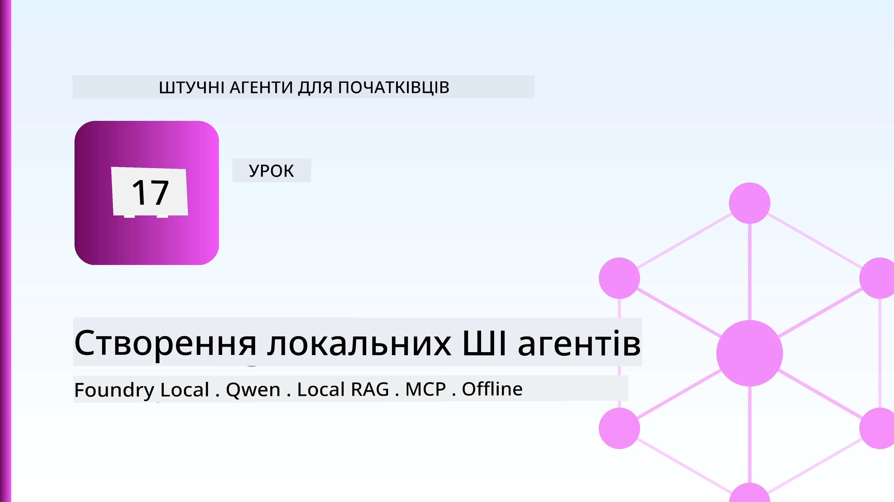
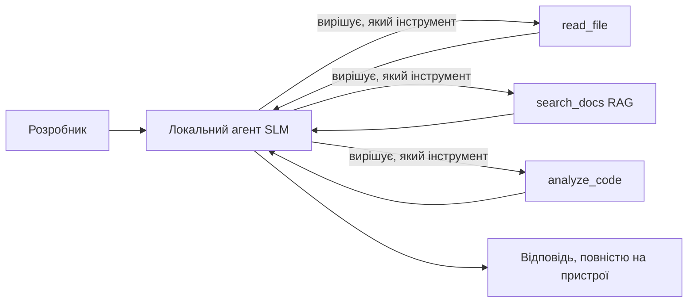
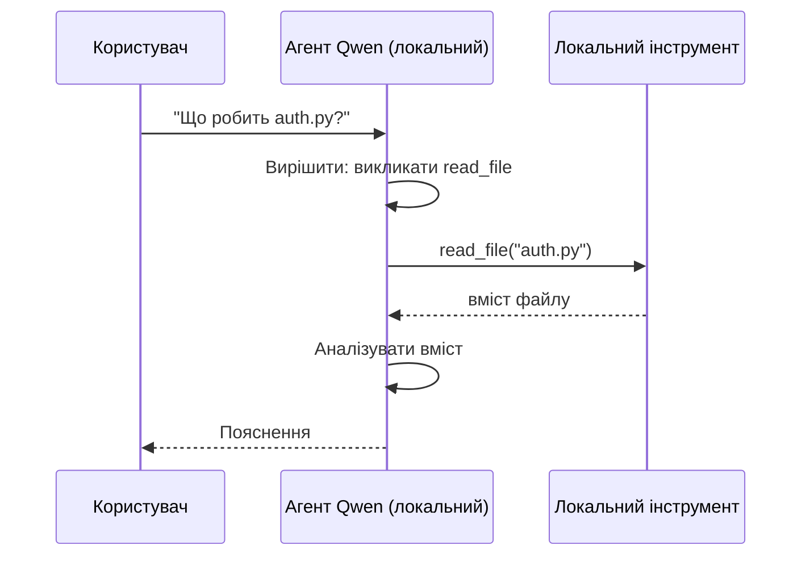
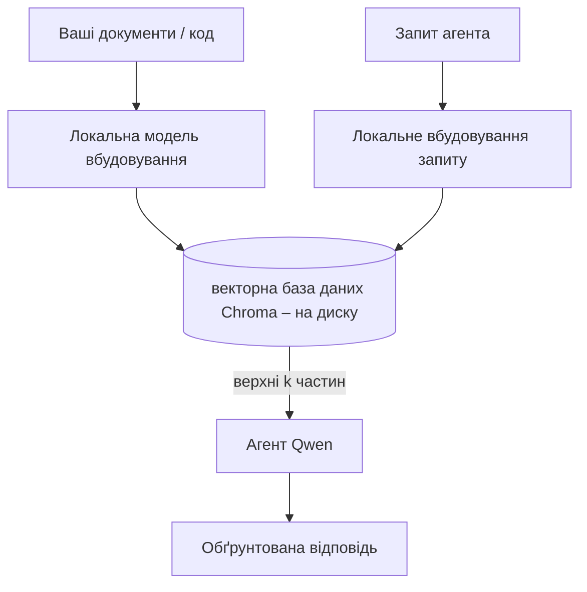
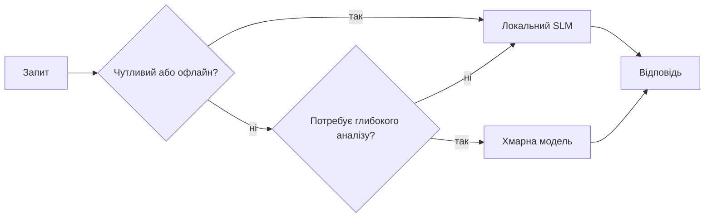

# Створення локальних AI агентів за допомогою Microsoft Foundry Local та Qwen



Попередній урок масштабував агентів *у хмару*. Цей переносить їх *на одну машину*. До кінця ви матимете робочого інженерного помічника, який робить висновки, виконує виклики інструментів, читає ваші файли та шукає у вашій документації — **без жодного хмарного виклику inference.**

Чому б ви цього хотіли? Три причини, які постійно виникають у реальній інженерній роботі:

- **Конфіденційність.** Код і документи ніколи не залишають машину. Жоден запит, жоден фрагмент, жодні дані клієнта не перетинають межі мережі.
- **Вартість.** Локальний inference не має рахунку за токени. Ви можете ітеруватися весь день за ціну електроенергії.
- **Оффлайн.** На літаку, у захищеній установі або під час збоїв агент все ще працює.

Умовою є те, що ви міняєте передовий хмарний модель на **незначну мовну модель (SLM)**, що працює на вашому CPU, GPU або NPU. Цей урок про те, як будувати агентів, які *добрі* у цих обмеженнях, а не імітувати, що обмежень немає.

## Вступ

Цей урок охопить:

- **Незначні мовні моделі (SLM)** — що це таке, де вони добре працюють і де ні.
- **Microsoft Foundry Local** — рантайм, що завантажує та обслуговує моделі на пристрої через **OpenAI-сумісний API**.
- **Qwen моделі з викликом функцій** — SLM, які надійно генерують виклики інструментів, що робить можливим місцевих *агентів* (не лише чат).
- **Локальні інструменти, локальний RAG і локальний MCP** — надання агенту спроможності без хмари.
- **Гібридні патерни** — коли тримати все локально, а коли звертатися до хмари.

## Цілі навчання

Після завершення цього уроку ви знатимете, як:

- Пояснити компроміси SLM і вибрати відповідні кейси використання локальних агентів.
- Запустити модель Qwen локально через Foundry Local і підключитися до неї через OpenAI-сумісний endpoint.
- Побудувати агента з викликом інструментів, який працює цілком на вашій робочій станції.
- Додати локальний RAG поверх власних документів, використовуючи локальну векторну базу даних (Chroma).
- Підключити агента до локального MCP сервера та розглянути гібридні дизайни локально/хмара.

## Вимоги

Для цього уроку передбачається, що ви завершили попередні уроки і впевнено працюєте з:

- [Використання інструментів](../04-tool-use/README.md) (Урок 4) та [Агентний RAG](../05-agentic-rag/README.md) (Урок 5).
- [Агентні протоколи / MCP](../11-agentic-protocols/README.md) (Урок 11).
- [Microsoft Agent Framework](../14-microsoft-agent-framework/README.md) (Урок 14).

Також вам знадобиться:

- Робоча станція розробника. **8 ГБ оперативної пам’яті — це реалістичний мінімум**; 16 ГБ і більше — комфортно. GPU або NPU допомагають, але не обов’язкові.
- Встановлений **Microsoft Foundry Local** (див. розділ налаштування нижче).
- Python 3.12+ та пакети з репозиторію [`requirements.txt`](../../../requirements.txt), а також `foundry-local-sdk`, `openai` і `chromadb` для цього уроку.

## Незначні мовні моделі: правильний інструмент для локальної роботи

Переважна хмарна модель має сотні мільярдів параметрів і працює в дата-центрі. SLM має кілька мільярдів параметрів і повинна вміщатися в оперативну пам’ять вашого ноутбука. Ця різниця встановлює чіткі очікування.

**SLM добре справляються з:**

- Структурованими, обмеженими завданнями — класифікацією, витяганням, зведенням відомого документа.
- **Викликами інструментів** — вибором, яку функцію викликати і з якими аргументами.
- Швидкою, дешевою, конфіденційною ітерацією на власних даних.

**SLM слабші у:**

- Відкритому, багатокроковому міркуванні на великому контексті.
- Широких знаннях про світ (вони бачили менше і швидше забувають).

Переможна стратегія для локальних агентів: **дозвольте SLM координувати, а інструментам виконувати важку роботу.** Модель не повинна *знати* ваш код — їй потрібно знати, коли викликати `read_file` та `search_docs`. Це напряму грає на сильних сторонах SLM.



## Microsoft Foundry Local

**Microsoft Foundry Local** — це легковажний рантайм, який завантажує, керує й обслуговує моделі повністю на вашій машині. Найважливіша його функція для нас — це відкриття **OpenAI-сумісного HTTP endpoint** — отже OpenAI SDK і OpenAI клієнт Microsoft Agent Framework працюють з ним, змінивши лише `base_url`. Усе, що ви вивчили про створення агентів, залишається таким же; лише endpoint переноситься з хмари на `localhost`.

Foundry Local також автоматично вибирає найкращу збірку моделі для вашого обладнання — CPU, CUDA/GPU чи NPU збірку — тож вам не потрібно оптимізувати під кожну машину вручну.

### Налаштування

Встановіть Foundry Local (див. [документацію](https://learn.microsoft.com/azure/ai-foundry/foundry-local/) для вашої ОС), потім підтвердіть, що він працює:

```bash
# Встановіть (наприклад; слідуйте документації для вашої платформи)
winget install Microsoft.FoundryLocal      # Windows
# brew install microsoft/foundrylocal/foundrylocal   # macOS

# Завантажте і запустіть модель Qwen, потім запустіть локальний сервіс
foundry model run qwen2.5-7b-instruct
foundry service status
```

Коли сервіс запущений, у вас є локальний OpenAI-сумісний endpoint (зазвичай `http://localhost:PORT/v1`). Ноутбук використовує `foundry-local-sdk` для автоматичного виявлення endpoint, тож вам не доводиться жорстко прописувати порт.

## Виклики функцій Qwen: Чому це важливо

Агент — це агент лише якщо він може викликати інструменти. Багато SLM можуть чатувати, але видають ненадійні, некоректні виклики інструментів. Моделі **Qwen** треновані для викликів функцій і послідовно генерують коректні структури виклику — що робить локальну чат-модель повноцінним локальним *агентом*.

Потік такий самий стандартний цикл виклику інструментів, який ви вже знаєте, але він працює на пристрої:



## Локальний RAG

Пошук по документації — це те, де локальні агенти виправдовують себе. Замість того, щоб сподіватися, що SLM запам’ятав документацію вашого фреймворку, ви вкладаєте цю документацію у **локальну векторну базу даних** і дозволяєте агенту вибирати релевантні частини за потреби.

Ми використовуємо **Chroma**, вбудований векторний сховище, що працює в процесі, без сервера для керування. Конвеєр повністю локальний: локальна модель для embedding → локальні вектори → локальний пошук → локальний SLM.



Це той самий патерн Agentic RAG з Уроку 5 — єдина зміна в тому, що всі компоненти запускаються на вашій машині.

## Локальні MCP сервери

[MCP](../11-agentic-protocols/README.md) — це транспорт, а не хмарний сервіс. MCP сервер може працювати як локальний процес на `stdio`, відкриваючи інструменти вашому агенту через стандартний протокол. Це дозволяє повторно використовувати розвиваючуся екосистему MCP серверів — доступ до файлової системи, операції git, запити до баз даних — повністю офлайн.

Безпека інша, ніж у хмарі, але не відсутня: локальний MCP сервер працює з правами вашого користувача, тож обмежуйте, до чого він має доступ (наприклад, директорія проекту, а не ваша домашня папка) і відносіться до його результатів як до вхідних даних, які треба перевіряти.

## Гібридні патерни локально й у хмарі

Локальний підхід не означає виключно локальний. Дорослі системи маршрутизують за чутливістю та складністю:

| Ситуація | Де виконується |
| --- | --- |
| Чутливий код / дані, або офлайн | **Локальний SLM** |
| Прості, обмежені завдання | **Локальний SLM** (дешево, швидко) |
| Складне багатокрокове міркування над нечутливими даними | **Хмарна модель** |
| Всі задачі під час збою мережі | **Локальний SLM** (грейсфул деградація) |

Це відображає ідею **маршрутизації моделей** з Уроку 16 — але тепер один із «моделей» — ваша власна машина. Стабільний дизайн повертається до локального, коли хмара недоступна, тож агент знижується в якості, а не припиняє роботу.



## Практична лабораторія: локальний інженерний помічник

Відкрийте [`code_samples/17-local-agent-foundry-local.ipynb`](./code_samples/17-local-agent-foundry-local.ipynb) і проробіть його. Ви створите **локального інженерного помічника**, який працює цілком на вашій робочій станції та може:

1. **Викликати інструменти** — через виклики функцій Qwen через Foundry Local.
2. **Виконувати локальні операції з файлами** — перераховувати та читати файли у директорії проекту.
3. **Аналізувати код** — звітувати базову метрику про вихідний файл.
4. **Шукати документацію** — локальний RAG по папці з docs за допомогою Chroma.
5. **Використовувати MCP** — підключатися до локального MCP сервера (з плавним пропуском, якщо жоден не налаштований).

На жодному етапі не використовується хмарний inference.

### Покрокове керівництво

Помічник підключається до Foundry Local через OpenAI-сумісний endpoint, тож код агента виглядає майже ідентично до уроків у хмарі — лише змінюється клієнт:

```python
from foundry_local import FoundryLocalManager
from openai import OpenAI

# Foundry Local знаходить/завантажує модель і надає нам локальну кінцеву точку.
manager = FoundryLocalManager(\"qwen2.5-7b-instruct\")
client = OpenAI(base_url=manager.endpoint, api_key=manager.api_key)  # api_key є локальним заповнювачем
```

Інструменти — це звичайні функції Python, обмежені директорією проекту:

```python
def read_file(path: str) -> str:
    \"\"\"Read a file, but only inside the sandboxed project directory.\"\"\"
    full = (PROJECT_ROOT / path).resolve()
    if PROJECT_ROOT not in full.parents and full != PROJECT_ROOT:
        return \"Access denied: path is outside the project directory.\"
    return full.read_text(encoding=\"utf-8\")
```

Зверніть увагу на перевірку sandbox — навіть локально інструмент, що читає довільні шляхи, є ризиком. Ноутбук обмежує всі інструменти коренем проекту.

## Перевірка знань

Перевірте розуміння перед переходом до завдання.

**1. Назвіть дві конкретні причини запускати агента локально замість у хмарі.**

<details>
<summary>Відповідь</summary>

Будь-які дві з: **конфіденційність** (код та дані не покидають машину), **вартість** (немає рахунку за токени inference), і **офлайн можливість** (працює без мережі — на літаку, у захищеній установі або під час збою). Регуляторні/комплаєнс обмеження, що забороняють відсилати дані за межі пристрою, часто є драйвером причини конфіденційності.
</details>

**2. Який рекомендований розподіл роботи між SLM і її інструментами в локальному агенті, і чому?**

<details>
<summary>Відповідь</summary>

Нехай SLM **координує** (вирішує, який інструмент викликати і з якими аргументами), а **інструменти роблять важку роботу** (читання файлів, отримання документів, обчислення результатів). SLM сильні в обмежених рішеннях, як вибір інструменту, але слабші в широких знаннях і довгих багатокрокових міркуваннях, тож опора на інструменти грає на їх сильних сторонах.
</details>

**3. Що робить можливим повторне використання коду хмарного агента з Foundry Local?**

<details>
<summary>Відповідь</summary>

Foundry Local відкриває **OpenAI-сумісний HTTP endpoint**. OpenAI SDK та клієнт Agent Framework працюють з ним, змінивши лише `base_url` (і використовуючи локальний фейковий API ключ). Увесь інший код агента залишається однаковим.
</details>

**4. Чому ми спеціально використовуємо модель виклику функцій Qwen, а не будь-який SLM?**

<details>
<summary>Відповідь</summary>

Тому що агент має генерувати надійні, коректні **виклики інструментів**. Багато SLM можуть чатувати, але видають некоректні чи непослідовні структури викликів. Моделі Qwen треновані для викликів функцій і послідовно генерують правильні виклики, що перетворює локальну чат-модель на робочого локального агента.
</details>

**5. Які компоненти в локальному RAG конвеєрі працюють на машині?**

<details>
<summary>Відповідь</summary>

Всі: модель embedding, векторна база даних (Chroma на диску), крок пошуку, і SLM. Документи embedding’яться локально, зберігаються локально, шукаються локально, і ними оперує локальна модель — жодна складова не виходить у хмару.
</details>

**6. Локальний MCP сервер працює на вашій машині. Чи робить це його автоматично безпечним? Які запобіжні заходи слід застосувати?**

<details>
<summary>Відповідь</summary>

Ні. Локальний MCP сервер працює з правами вашого користувача, тож він має доступ до всього, до чого маєте доступ ви. Обмежте його доступ до необхідного (наприклад, лише директорію проекту, а не всю домашню папку) і ставтеся до його результатів як до вхідних даних, які потрібно перевіряти перед виконанням.
</details>

**7. Опишіть розумне гібридне правило маршрутизації, яке включає локальну модель.**

<details>
<summary>Відповідь</summary>

Направляйте чутливі або офлайн-запити до локального SLM; прості обмежені задачі — до локального SLM заради швидкості та вартості; складні багатокрокові міркування над нечутливими даними — до хмарної моделі; і використовуйте локальний SLM як запас, коли хмара недоступна, щоб агент „грейсфул деградував“, а не припиняв роботу. Це маршрутизація моделей (Урок 16) з локальною машиною як однією з моделей.
</details>

**8. Який реалистичний мінімум оперативної пам’яті для запуску локального агента в цьому уроці, і що дає більше RAM?**

<details>
<summary>Відповідь</summary>

Приблизно **8 ГБ** — реалистичний мінімум; 16 ГБ і більше — комфортно. Більше оперативної пам’яті дозволяє запускати більші, потужніші моделі та тримати більше контексту в пам’яті. GPU або NPU прискорюють inference, але не є обов’язковими — Foundry Local обирає CPU збірку, коли акселератора немає.
</details>

## Завдання

Розширте локального інженерного помічника до **локального рев’юера документації** для невеликого проєкту на ваш вибір (можете використати будь-яку з папок уроків цього репозиторію).

Ваш проєкт має:

1. **Індексувати реальну папку з документацією/кодом** у Chroma (щонайменше п’ять файлів).
2. **Додати інструмент `find_todos`**, який сканує проєкт на предмет коментарів `TODO`/`FIXME` і повертає їх з файлами і номерами рядків — з тією ж перевіркою sandbox, що й у `read_file`.

3. **Задайте агенту три питання**, які змушують його комбінувати інструменти: одне чисте питання RAG, одне, що вимагає прочитання конкретного файлу, та одне, що вимагає пошуку TODO.
4. **Виміряйте це**: заміряйте час кожної з трьох відповідей і запишіть їх у markdown комірці. Прокоментуйте, чи є затримка прийнятною для вашого запланованого робочого процесу.

Потім напишіть короткий абзац про те, **що б ви перенесли в хмару, а що залишили локально** для цього рецензента, і чому. Ваша оцінка залежить від того, наскільки правильно підключено локальні компоненти та наскільки обґрунтоване ваше гібридне мислення — а не від якості моделі.

## Підсумок

У цьому уроці ви створили агента, який працює повністю на вашій власній машині:

- **SLM** жертвують широтою охоплення заради приватності, вартості та роботи офлайн — і проявляють себе, коли **організовують інструменти**, а не несуть усі знання самі.
- **Foundry Local** обслуговує моделі на пристрої за допомогою **OpenAI-сумісної кінцевої точки**, тому код вашого хмарного агента переноситься з одним рядком змін.
- **Qwen models із викликом функцій** роблять можливим надійний локальний виклик інструментів — а отже й локальних *агентів*.
- **Локальний RAG** (Chroma) і **локальний MCP** дають агенту можливості, не залишаючи машину.
- **Гібридні патерни** дозволяють маршрутизувати за чутливістю та складністю, за локальним варіантом як плавним запасним варіантом.

Це завершує арку розгортання: Урок 16 масштабував агентів у Microsoft Foundry, а цей урок зменшив їх до одного робочого столу. Наступний урок присвячено збереженню безпеки розгорнутих агентів.

## Додаткові ресурси

- <a href="https://learn.microsoft.com/azure/ai-foundry/foundry-local/" target="_blank">Документація Microsoft Foundry Local</a>
- <a href="https://learn.microsoft.com/azure/ai-foundry/what-is-azure-ai-foundry" target="_blank">Документація Microsoft Foundry</a>
- <a href="https://aka.ms/ai-agents-beginners/agent-framework" target="_blank">Microsoft Agent Framework</a>
- <a href="https://qwen.readthedocs.io/en/latest/framework/function_call.html" target="_blank">Документація з виклику функцій Qwen</a>
- <a href="https://modelcontextprotocol.io/" target="_blank">Model Context Protocol (MCP)</a>
- <a href="https://docs.trychroma.com/" target="_blank">Векторна база даних Chroma</a>

## Попередній урок

[Deploying Scalable Agents](../16-deploying-scalable-agents/README.md)

## Наступний урок

[Securing AI Agents](../18-securing-ai-agents/README.md)

---

<!-- CO-OP TRANSLATOR DISCLAIMER START -->
**Відмова від відповідальності**:
Цей документ було перекладено за допомогою сервісу штучного інтелекту для перекладу [Co-op Translator](https://github.com/Azure/co-op-translator). Хоча ми прагнемо до точності, будь ласка, майте на увазі, що автоматичні переклади можуть містити помилки або неточності. Оригінальний документ рідною мовою слід вважати авторитетним джерелом. Для критично важливої інформації рекомендується професійний людський переклад. Ми не несемо відповідальності за будь-які непорозуміння або неправильні тлумачення, що виникли внаслідок використання цього перекладу.
<!-- CO-OP TRANSLATOR DISCLAIMER END -->