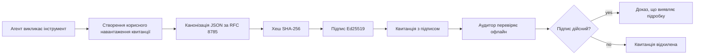
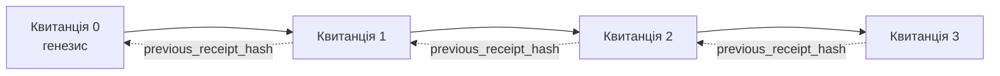

[Перегляньте відеоурок: Захист агента ШІ за допомогою криптографічних квитанцій](https://youtu.be/PLACEHOLDER_VIDEO_ID)

> _(Відеоурок і мініатюру додасть команда Microsoft після злиття, відповідно до шаблону уроків 14 / 15.)_

# Захист агентів ШІ за допомогою криптографічних квитанцій

## Вступ

У цьому уроці буде розглянуто:

- Чому журналювання дій агентів ШІ важливе для відповідності, налагодження та довіри.
- Що таке криптографічна квитанція і чим вона відрізняється від незаписаного рядка журналу.
- Як створити підписану квитанцію для виклику інструменту агента на чистому Python.
- Як перевірити квитанцію офлайн і виявити підробку.
- Як зв’язати квитанції в ланцюжок так, щоб видалення або переміщення однієї ламало ланцюжок.
- Що доводять квитанції і що вони явно не доводять.

## Цілі навчання

Після завершення цього уроку ви знатимете, як:

- Визначити режим відмов, які мотивують криптографічне підтвердження походження дій агента.
- Створити квитанцію з підписом Ed25519 для канонічного JSON-пакета.
- Перевірити квитанцію незалежно, використовуючи лише відкритий ключ підписувача.
- Виявити підробку, повторно виконавши перевірку зміненої квитанції.
- Побудувати ланцюг квитанцій із хеш-ланцюженням і пояснити, чому цей ланцюг важливий.
- Усвідомити межу між тим, що доводять квитанції (атрибуція, цілісність, впорядкування) і тим, що вони не доводять (коректність дії, обґрунтованість політики).

## Проблема: журнал дій вашого агента

Уявіть, що ви розгорнули агента ШІ для Contoso Travel. Агент читає запити клієнтів, звертається до API авіарейсів для пошуку варіантів і бронює місця від імені клієнта. Минулого кварталу агент обробив 50 000 бронювань.

Сьогодні приходить аудитор. Він ставить просте питання: "Покажіть, що зробив ваш агент."

Ви передаєте свої журнали. Аудитор переглядає їх і ставить складніше питання: "Як я можу бути впевненим, що ці журнали не редагувалися?"

Ось у чому проблема аудиту. Більшість розгортань агентів сьогодні покладаються на:

- **Журнали додатків**: пишуться самим агентом, редагуються будь-ким із доступом до файлової системи.
- **Хмарні служби журналювання**: мають захист від підробки на рівні платформи, але тільки якщо аудитор довіряє оператору платформи.
- **Журнали транзакцій бази даних**: добре підходять для змін у базі даних, але не для довільних викликів інструментів.

Жоден із цих варіантів не може відповісти аудитору без необхідності довіряти комусь (вам, вашому хмарному провайдеру, вашому постачальнику бази даних). Для внутрішнього використання така довіра зазвичай прийнятна. Для регульованих робіт (фінанси, охорона здоров'я, усе, що підпадає під Закон ЄС про ШІ) — ні.

Криптографічні квитанції розв’язують це, роблячи кожну дію агента незалежно перевірюваною. Аудитору не потрібно довіряти вам. Потрібні лише ваш відкритий ключ і сама квитанція.

## Що таке криптографічна квитанція?

Квитанція — це об’єкт JSON, який фіксує, що зробив агент, підписаний цифровим підписом.



Мінімальна квитанція виглядає так:

```json
{
  "type": "agent.tool_call.v1",
  "agent_id": "contoso-travel-bot",
  "tool_name": "lookup_flights",
  "tool_args_hash": "sha256:a3f9c1...",
  "result_hash": "sha256:7b2e1d...",
  "policy_id": "contoso-travel-policy-v3",
  "timestamp": "2026-04-25T14:30:00Z",
  "sequence": 47,
  "previous_receipt_hash": "sha256:9d4e6a...",
  "signature": {
    "alg": "EdDSA",
    "sig": "c5af83...",
    "public_key": "8f3b2c..."
  }
}
```

Три властивості виконують основну роботу:

1. **Підпис**. Квитанція підписується шлюзом агента за допомогою приватного ключа Ed25519. Будь-хто із відповідним відкритим ключем може перевірити підпис офлайн. Будь-яке втручання в будь-яке поле робить підпис недійсним.

2. **Канонічне кодування**. Перед підписом квитанція серіалізується за схемою канонічного JSON (JCS, RFC 8785). Це гарантує, що дві реалізації, які створюють однакову логічну квитанцію, породять бінарно ідентичний вихідний файл. Без канонізації різні JSON-серіалізатори створили б різні підписи для того самого вмісту.

3. **Хеш-ланцюжок**. Поле `previous_receipt_hash` пов’язує кожну квитанцію з попередньою. Видалення або переміщення квитанції порушує всі подальші квитанції в ланцюжку. Втручання видно на рівні ланцюжка навіть якщо індивідуальні підписи обійдені.

Разом ці властивості дають три гарантії:

- **Атрибуція**: цей ключ підписав цей вміст.
- **Цілісність**: вміст не змінювався після підпису.
- **Впорядкування**: ця квитанція йде після тієї квитанції в ланцюжку.

## Створення квитанції на Python

Для створення квитанції не потрібна спеціальна бібліотека. Криптографічні примітиви доступні повсюдно, а логіка займає лише кілька десятків рядків коду Python.

Практичні вправи в `code_samples/18-signed-receipts.ipynb` проходять через увесь процес. Основна версія:

```python
import json
import hashlib
import base64
from nacl import signing
from jcs import canonicalize  # Канонічний JSON за RFC 8785

def b64url_nopad(data: bytes) -> str:
    return base64.urlsafe_b64encode(data).decode("ascii").rstrip("=")

def sha256_canonical(obj) -> str:
    """SHA-256 of a Python object's JCS-canonical JSON form."""
    return f"sha256:{hashlib.sha256(canonicalize(obj)).hexdigest()}"

# Згенерувати або завантажити ключ підпису (у виробництві зберігати у сховищі ключів)
signing_key = signing.SigningKey.generate()
verify_key = signing_key.verify_key

# Побудувати корисне навантаження квитанції (підпис поки відсутній)
tool_args = {"origin": "SYD", "destination": "LAX"}
tool_result = [{"flight": "QF11", "price": 1850, "stops": 0}]

payload = {
    "type": "agent.tool_call.v1",
    "agent_id": "contoso-travel-bot",
    "tool_name": "lookup_flights",
    "tool_args_hash": sha256_canonical(tool_args),
    "result_hash": sha256_canonical(tool_result),
    "policy_id": "contoso-travel-policy-v3",
    "timestamp": "2026-04-25T14:30:00Z",
    "sequence": 0,
    "previous_receipt_hash": None,
}

# Канонізувати, захешувати, підписати.
canonical_bytes = canonicalize(payload)
message_hash = hashlib.sha256(canonical_bytes).digest()
signature_bytes = signing_key.sign(message_hash).signature

# Додати структурований об'єкт підпису.
receipt = {
    **payload,
    "signature": {
        "alg": "EdDSA",
        "sig": b64url_nopad(signature_bytes),
        "public_key": b64url_nopad(bytes(verify_key)),
    },
}
```

Це вся пайплайн підписування. У вправі в ноутбуці розглянуто кожен крок.

## Перевірка квитанції і виявлення підробки

Перевірка — це зворотня операція:

```python
import base64
import hashlib
from nacl import signing
from nacl.exceptions import BadSignatureError
from jcs import canonicalize

def b64url_decode(s: str) -> bytes:
    padding = "=" * ((4 - len(s) % 4) % 4)
    return base64.urlsafe_b64decode(s + padding)

def verify_receipt(receipt: dict) -> bool:
    # Підпис є структурованим об'єктом: {"alg", "sig", "public_key"}.
    sig_obj = receipt.get("signature")
    if not sig_obj or sig_obj.get("alg") != "EdDSA":
        return False

    # Відтворіть корисне навантаження, яке фактично було підписано (все, крім підпису).
    payload = {k: v for k, v in receipt.items() if k != "signature"}

    canonical_bytes = canonicalize(payload)
    message_hash = hashlib.sha256(canonical_bytes).digest()

    try:
        verify_key = signing.VerifyKey(b64url_decode(sig_obj["public_key"]))
        verify_key.verify(message_hash, b64url_decode(sig_obj["sig"]))
        return True
    except BadSignatureError:
        return False
```

Ця функція приймає квитанцію і повертає `True`, якщо підпис дійсний, і `False` в іншому випадку. Жодних мережевих викликів, жодних залежностей від сервісів, жодної довіри до третіх сторін.

Щоб побачити в дії виявлення підробки, ноутбук проходить через:

1. Створення дійсної квитанції і підтвердження, що вона проходить перевірку.
2. Зміну одного байта в полі `tool_args_hash`.
3. Повторний запуск перевірки з невдачею.

Це практична демонстрація того, що квитанції захищені від підробки: будь-яка зміна, якою б маленькою вона не була, руйнує підпис.

## Ланцюжок квитанцій для багатокрокових агентів

Одна підписана квитанція захищає одну дію. Ланцюжок квитанцій захищає послідовність.



Кожна квитанція містить хеш попередньої квитанції. Щоб непомітно видалити квитанцію 2, атакуючий мусив би:

- Змінити поле `previous_receipt_hash` квитанції 3 (порушить підпис квитанції 3), АБО
- Підробити новий підпис для зміненої квитанції 3 (потрібен приватний ключ агента).

Якщо приватний ключ зберігається в апаратному сховищі ключів і ви публікуєте відкритий ключ з кожною квитанцією, жоден із цих варіантів атаки неможливий без виявлення.

У ноутбуці проходять:

1. Створення ланцюга з трьох квитанцій.
2. Перевірка, що `previous_receipt_hash` кожної квитанції збігається з реальним хешем попередньої.
3. Втручання в одну квитанцію посередині і спостереження, як ланцюг розривається саме там.

Ось як створити журнал дій, який зовнішній аудитор може перевірити без довіри до вас.

## Що доводять квитанції (і що не доводять)

Це найважливіший розділ цього уроку. Квитанції — потужний інструмент, але їх сила обмежена.

**Квитанції доводять три речі:**

1. **Атрибуція**: конкретний ключ підписав конкретний пакет.
2. **Цілісність**: пакет не змінювався з моменту підпису.
3. **Впорядкування**: ця квитанція з’явилася після тієї в хеш-ланцюжку.

**Квитанції НЕ доводять:**

1. **Коректність**: що дія агента була правильною. Квитанція може бути підписана для неправильної відповіді так само чисто, як і для правильної.

2. **Відповідність політиці**: що політика, на яку посилається `policy_id`, була фактично перевірена, або що вона дозволила б цю дію, якби її перевіряли. Квитанція фіксує те, що було заявлено, а не те, що було виконано.
3. **Ідентичність понад ключем**: квитанція каже: "цей ключ підписав цей вміст." Вона не каже: "ця людина авторизувала це." Для зв’язку ключа з особою або організацією потрібна окрема інфраструктура ідентичності (каталог, реєстр публічних ключів тощо).
4. **Правдивість вхідних даних**: якщо агент отримує змінений запит і діє на його основі, квитанція достовірно зафіксує дію. Квитанції знаходяться після перевірки вхідних даних і не є її заміною.

Ця межа важлива з двох причин:

- Вона пояснює, для чого корисні квитанції: зробити поведінку агента аудитованою й захищеною від підробок, навіть між організаційними межами.
- Вона показує, які додаткові шари ще потрібні: перевірка вхідних даних (Урок 6), примусове дотримання політики (коротко описано далі) та інфраструктура ідентичності (поза межами цього уроку).

Загальна помилка — вважати, що "ми маємо квитанції" означає "ми управляємо процесом". Це не так. Квитанції — це основа. Управління — це система, яку ви будуєте на її основі.

## Доведення, що людина схвалила саме цю дію

Пункт 3 вище заслуговує власного розділу: квитанція про дію каже "цей ключ підписав цей вміст," ніколи не каже "людина авторизувала це." Для ризикованих дій (повернення грошей, вилучення, перекази) рамки управління все більше вимагають саме цієї відсутньої заяви, і її можна створити за допомогою тих самих примітивів, які ви вже побудували в цьому уроці.

Наступна блокнот `code_samples/human-authorization-receipts.ipynb` додає другий тип квитанції, `human.approval.v1`, у тому ж форматі конверта, що квитанції уроку (типізований завантажувач підписаний Ed25519 над канонічним SHA-256, при цьому об’єкт `signature` поза підписаними байтами). Іменований схвалювач підписує **повну канонічну дію і її дайджест** до виконання; квитанція агента про дію несе **той самий дайджест дії** і `parent_approval_ref`, `receipt_hash` схвалення, так само, як `previous_receipt_hash` у ланцюжку, який ви побудували вище. Один `verify_chain` перевіряє обидва об’єкти під **окремими керованими реєстрами ключів** (ключі схвалювачів проти ключів агентів), тому код однаковий, але влада ніколи не перетинається.

Властивість, яку це дає, сформульована чітко: *людина схвалила саме цю дію, а агент виконав саме ту схвалену дію.* Відмови, задані в блокноті, роблять цю властивість реальною, а не заявленою:

- класичний набір: підробка, "помилковий заступник", повторні атаки, підроблені ключі з будь-якого боку, пошкоджені вхідні дані;
- **застаріла влада**: підпис, що все ще верифікується, але відхиляється через зміну версії політики, видалення ключа схвалювача з реєстру або закінчення терміну дії схвалення перед виконанням;
- **підміна дайджеста**: правильно підписана квитанція про дію, яка посилається на *реальне* схвалення, що пов’язує *іншу* канонічну дію.

Кожна відмова має окрему причину, щоб аудитор міг зрозуміти, чи втратила влада чинність, чи змінилася виконана дія. Правило, яке викладає блокнот: підписане схвалення саме по собі не є владою. Влада існує лише якщо обидві квитанції все ще пов’язані з тією ж канонічною дією на момент виконання. Спільний шлях співпідпису в тому самому Internet-Draft, на якому базується цей урок (`draft-farley-acta-signed-receipts`), є типовою формою цього паттерна.

## Продакшн-ресурси

Python-код у цьому уроці навмисно мінімальний, щоб ви могли прочитати кожен рядок і точно зрозуміти, що відбувається. Упродакшені ви маєте два варіанти:

1. **Створити безпосередньо на криптографічних примітивах.** 50 рядків, які ви бачили вище, достатньо для багатьох випадків. PyNaCl (Ed25519) і пакет `jcs` (канонічний JSON) — це добре підтримувані та перевірені бібліотеки.

2. **Використати бібліотеку для роботи з квитанціями у продакшені.** Кілька opensource-проєктів реалізують той самий паттерн із додатковими функціями (обертання ключів, пакетна перевірка, розповсюдження JWK-наборів, інтеграція з політичними движками):
   - Формат квитанції з цього уроку відповідає IETF Internet-Draft ([`draft-farley-acta-signed-receipts`](https://datatracker.ietf.org/doc/draft-farley-acta-signed-receipts/), ревізія 02), що наразі проходить стандартизацію, з набором тестів для відповідності ([agent-governance-testvectors](https://github.com/ScopeBlind/agent-governance-testvectors)), які незалежні реалізації перевіряють, щоб отримати біт-в-біт канонічний результат.
   - Microsoft Agent Governance Toolkit використовує квитанції з рішеннями на основі Cedar; дивіться Tutorial 33 у тому репозиторії для прикладу від початку до кінця.
   - Пакети `protect-mcp` (npm) і `@veritasacta/verify` (npm) надають Node-реалізацію підписання квитанцій та офлайн-перевірку, призначені для обгортання будь-якого MCP-сервера з аудиторським слідом, захищеним від підробок, включно з режимом зберігання для співпідпису, де призупинена дія породжує квитанцію схвалення, пов’язану з дайджестом дії (підтримка WebAuthn у десктопному потоці), такий самий паттерн схвалення, як у блокноті для авторизації людиною вище.
   - **[nobulex](https://github.com/arian-gogani/nobulex)** Python SDK (`pip install nobulex`) надає той самий паттерн підписання Ed25519 + JCS у Python з інтеграціями LangChain і CrewAI, включно з опублікованими тест-векторами валідації та мапінгом відповідності, запропонованим через [OWASP PR #2210](https://github.com/OWASP/CheatSheetSeries/pull/2210).

Вибір між створенням власного рішення та використанням бібліотеки схожий на вибір між створенням власної JWT-бібліотеки і використанням перевіреної: обидва варіанти розумні; бібліотека економить час і зменшує площу аудиту; підхід з нуля змушує вас розуміти кожен примітив. Цей урок навчає підходу з нуля, щоб ви мали основу для будь-якого вибору.

## Перевірка знань

Перевірте розуміння перед переходом до практичного завдання.

**1. Квитанція підписана приватним Ed25519 ключем агента. Аудитор має лише публічний ключ. Чи може аудитор перевірити квитанцію офлайн?**

<details>
<summary>Відповідь</summary>

Так. Для верифікації Ed25519 потрібні лише публічний ключ і підписані байти. Нема потреби у мережевому виклику чи залежності від сервісу. Це властивість робить квитанції корисними в умовах із роз'єднаними мережами, мультиорганізаційними або з низькою довірою.
</details>

**2. Зловмисник змінює поле `policy_id` квитанції, щоб стверджувати, що вона регулювалася більш ліберальною політикою. Підпис накладено на оригінальне завантаження. Що відбувається під час перевірки?**

<details>
<summary>Відповідь</summary>


Не вдається пройти перевірку. Підпис було обчислено за канонічними байтами оригінального навантаження; зміна будь-якого поля змінює канонічні байти, що змінює хеш SHA-256, через що підпис стає недійсним. Зловмиснику потрібен приватний ключ, щоб створити новий дійсний підпис, якого у нього немає.
</details>

**3. Чому квитанція містить `tool_args_hash` і `result_hash`, а не сирі аргументи та результат?**

<details>
<summary>Відповідь</summary>

Дві причини. По-перше, квитанцію потрібно може архівувати або пересилати в умовах, де розкриття сирого вмісту (ПІД, бізнес-дані) є проблемою. Хешування зберігає квитанцію маленькою та вміст приватним; аудитор перевіряє, що хеш відповідає окремо збереженій копії фактичного вмісту. По-друге, хеші мають фіксований розмір; квитанція з хешами має обмежений розмір незалежно від розміру вхідних та вихідних даних.
</details>

**4. Поле `previous_receipt_hash` пов’язує кожну квитанцію з попередником. Якщо зловмисник тихо видаляє одну квитанцію з середини ланцюжка, що стає недійсним?**

<details>
<summary>Відповідь</summary>

Всі квитанції, що йдуть після видаленої. Їхні поля `previous_receipt_hash` більше не відповідають фактичному ланцюжку (бо квитанція, яку вони посилали, більше не існує або ланцюжок тепер вказує на іншого попередника). Щоб приховати видалення, зловмиснику довелося б перезаписати кожну наступну квитанцію, що вимагає приватного ключа.
</details>

**5. Квитанція проходить перевірку. Чи доводить це, що дії агента були правильними, правильними або відповідали політиці?**

<details>
<summary>Відповідь</summary>

Ні. Дійсна квитанція доводить три речі: авторство (цей ключ підписав цей вміст), цілісність (вміст не змінено) і порядок (ця квитанція йде після тієї). Вона НЕ доводить, що дія була правильною, що політика з `policy_id` дійсно була оцінена або що агент дотримувався всіх правил. Квитанції роблять поведінку агента аудиторською, але не обов’язково правильною. Це найважливіша межа уроку.
</details>

## Практичне завдання

Відкрийте `code_samples/18-signed-receipts.ipynb` і виконайте всі чотири розділи:

1. **Розділ 1**: Підпишіть вашу першу квитанцію та перевірте її.
2. **Розділ 2**: Поруште квитанцію та спостерігайте за невдачею перевірки.
3. **Розділ 3**: Побудуйте ланцюжок з трьох квитанцій і перевірте цілісність ланцюжка.
4. **Розділ 4**: Застосуйте патерн до агента, створеного з Microsoft Agent Framework: обгорніть виклик інструменту в підписання квитанції, потім перевірте квитанцію незалежно.

**Додаткове завдання 1:** розширте схему квитанції додатковим полем на ваш вибір (наприклад, ID запиту для трасування), оновіть логіку канонічного підписування, щоб включити його, і підтвердіть, що квитанція все ще проходить перевірку. Потім змініть поле після підписання і переконайтеся, що перевірка не проходить. Це змусить вас зрозуміти, як кожен байт канонічного кодування впливає на підпис.

**Додаткове завдання 2:** обчисліть SHA-256 хеш двох ваших квитанцій разом (конкатенація їхніх канонічних байтів у детермінованому порядку) і вставте отриманий дайджест як нове поле у третю квитанцію до підписання. Перевірте, що всі три квитанції все ще проходять перевірку. Ви щойно побудували одноступеневе доказ включення: будь-хто, хто має третю квитанцію, може довести, що перші дві існували на момент її підписання, не розкриваючи їхнього вмісту. Це патерн, який використовують квитанції з вибірковим розкриттям на великих масштабах (Merkle commitments, RFC 6962).

## Висновок

Криптографічні квитанції дають агентам ШІ аудиторський слід, який є:

- **Незалежно перевірним**: будь-хто з публічним ключем може перевірити, без залежності від сервісу.
- **Виявлення підробок**: будь-яка зміна робить підпис недійсним.
- **Портативним**: квитанція — це невеликий JSON-файл; її можна архівувати, передавати й перевіряти будь-де.
- **Відповідним стандартам**: заснований на Ed25519 (RFC 8032), JCS (RFC 8785) і SHA-256, всі широко розповсюджені примітиви.

Вони не замінюють валідацію вхідних даних, виконання політики або інфраструктуру ідентичності. Вони є основою для цих шарів. Коли ви розгортаєте агентів у регульованих навантаженнях, багатодержавних робочих процесах чи будь-яких умовах, де майбутній аудитор не може вам повністю довіряти, квитанції роблять аудиторський слід чесним.

Найголовніший висновок: квитанції доводять, хто що сказав і коли. Вони не доводять, що сказане було правдою або правильним. Утримуйте цю відмінність чітко. Це різниця між чесною системою походження і оманливою.

## Контрольний список для виробництва

Коли будете готові перейти від цього уроку до розгортання агентів із підписаними квитанціями у реальній системі:

- [ ] **Перенесіть ключ підпису з ноутбука розробника.** Використовуйте Azure Key Vault, AWS KMS або апаратний модуль безпеки. Приватний ключ, який підписує ваші квитанції, ніколи не повинен зберігатися у системі контролю версій або у відкритому вигляді на машинах застосунку.
- [ ] **Опублікуйте публічний ключ для перевірки.** Аудиторам потрібен він для офлайнової перевірки. Стандартний паттерн — JWK Set за відомою URL-адресою (RFC 7517), наприклад, `https://your-org.example.com/.well-known/agent-keys.json`.
- [ ] **Захоплюйте стан ланцюжка зовні.** Періодично записуйте оновлений хеш голови ланцюжка у журнал прозорості (Sigstore Rekor, RFC 3161 timestamp authority або друга внутрішня система), щоб зовнішня сторона могла підтвердити, що «цей ланцюжок існував у цей час».
- [ ] **Зберігайте квитанції незмінними.** Сховище з додаванням лише нових об’єктів (Azure Storage з політиками незмінності, AWS S3 Object Lock) перешкоджає внутрішнім користувачам переписувати історію на рівні сховища.
- [ ] **Визначте політику зберігання.** Багато регуляторних режимів вимагають зберігати дані протягом кількох років. Плануйте зростання обсягу квитанцій (кожна квитанція близько 500 байт; агент, що робить 10К викликів на добу, генерує ~1,8 ГБ на рік).
- [ ] **Описуйте, що квитанції не охоплюють.** Квитанції доводять авторство, цілісність і порядок. Ваш документ запуску повинен явно вказувати, які додаткові контролі (валідація вхідних, виконання політик, обмеження швидкості, інфраструктура ідентичності) доповнюють квитанції в системі управління.

### Є ще запитання про захист агентів ШІ?

Приєднуйтесь до [Microsoft Foundry Discord](https://aka.ms/ai-agents/discord), щоб спілкуватися з іншими студентами, відвідувати години консультацій і отримувати відповіді на питання щодо агентів ШІ.

## Поза межами цього уроку

Цей урок охоплює підписання однієї квитанції та ланцюжки з хешами. Ті самі примітиви складають кілька більш просунутих патернів, які ви можете зустріти в міру розвитку вашої системи управління:

- **Вибіркове розкриття.** Коли поля квитанції зафіксовані незалежно (RFC 6962-стиль Merkle-дерево), ви можете розкрити окремі поля конкретним аудиторам і довести, що решта не змінилася, не розкриваючи їх. Корисно, коли одна й та сама квитанція повинна задовольняти повний аудит (який хоче повноти) і регулювання мінімізації даних, наприклад GDPR (коли аудитор має бачити якомога менше).
- **Анулювання квитанції.** Якщо ключ для підписування скомпрометовано, потрібен спосіб позначити всі квитанції, підписані цим ключем, як недовіру починаючи з певного часу. Стандартні патерни: ключі з коротким терміном життя плюс опублікований список анулювань, або журнал прозорості з записами анулювання.
- **Двосторонні / поділені підписані квитанції.** Деякі реалізації ділять підписане навантаження на передвиконавчу (`authorization_*`) та післявиконавчу (`result_*`) частини з незалежними підписами, корисно, коли рішення про дозвіл і спостережений результат створюються різними акторами або у різний час. Це додатково накладається на формат квитанції з цього уроку.
- **Композиція навантаження.** Квитанція закриває будь-які байти, які ви покладете в `result_hash`. Реальні навантаження часто більш насичені, ніж просто результат виклику інструмента: логіка перед рішенням (прогноз моделі, розглянуті варіанти, докази та їх повнота, ризик, ланцюг відповідальності, результат проходження перевірки) можуть міститися в навантаженні, закритому однією квитанцією. Це утримує формат квитанції мінімальним і дозволяє еволюцію схем навантажень для кожної доменної області.
- **Міжреалізаційна сумісність.** Кілька незалежних реалізацій одного формату квитанції (Python, TypeScript, Rust, Go) перевіряють один одного за спільними тестовими векторами. Якщо ви створюєте власну реалізацію, перевірка за опублікованими векторами підтверджує сумісність.
- **Перехід на постквантові алгоритми.** Ed25519 широко застосовується сьогодні, але не є квантово-стійким. Формат квитанції адаптивний до алгоритмів: поле `signature.alg` може містити `ML-DSA-65` (постквантовий стандарт підпису NIST), коли потрібно здійснити міграцію. Плануйте період переходу з подвійним підписом квитанцій.

## Додаткові ресурси

- <a href="https://datatracker.ietf.org/doc/draft-farley-acta-signed-receipts/" target="_blank">IETF Internet-Draft: Signed Decision Receipts for Machine-to-Machine Access Control</a>
- <a href="https://learn.microsoft.com/azure/ai-studio/responsible-use-of-ai-overview" target="_blank">Огляд відповідального використання ШІ (Azure AI)</a>
- <a href="https://datatracker.ietf.org/doc/html/rfc8032" target="_blank">RFC 8032: Алгоритм цифрового підпису на основі кривої Едвардса (EdDSA)</a>
- <a href="https://datatracker.ietf.org/doc/html/rfc8785" target="_blank">RFC 8785: Схема канонізації JSON (JCS)</a>
- <a href="https://datatracker.ietf.org/doc/html/rfc6962" target="_blank">RFC 6962: Сертифікат прозорості</a> (конструкція Merkle-дерева, що використовується в квитанціях із вибірковим розкриттям)
- <a href="https://github.com/microsoft/agent-governance-toolkit/blob/main/docs/tutorials/33-offline-verifiable-receipts.md" target="_blank">Microsoft Agent Governance Toolkit, Tutorial 33: Offline-Verifiable Decision Receipts</a>
- <a href="https://github.com/ScopeBlind/agent-governance-testvectors" target="_blank">Тестові вектори для перевірки сумісності реалізацій формату квитанції з цього уроку (Apache-2.0)</a>
- <a href="https://pynacl.readthedocs.io/" target="_blank">Документація PyNaCl</a> (Ed25519 у Python)

## Попередній урок

[Створення локальних агентів ШІ](../17-creating-local-ai-agents/README.md)

---

<!-- CO-OP TRANSLATOR DISCLAIMER START -->
**Відмова від відповідальності**:
Цей документ було перекладено за допомогою сервісу штучного інтелекту для перекладу [Co-op Translator](https://github.com/Azure/co-op-translator). Хоча ми прагнемо до точності, будь ласка, майте на увазі, що автоматичні переклади можуть містити помилки або неточності. Оригінальний документ рідною мовою слід вважати авторитетним джерелом. Для критично важливої інформації рекомендується професійний людський переклад. Ми не несемо відповідальності за будь-які непорозуміння або неправильні тлумачення, що виникли внаслідок використання цього перекладу.
<!-- CO-OP TRANSLATOR DISCLAIMER END -->