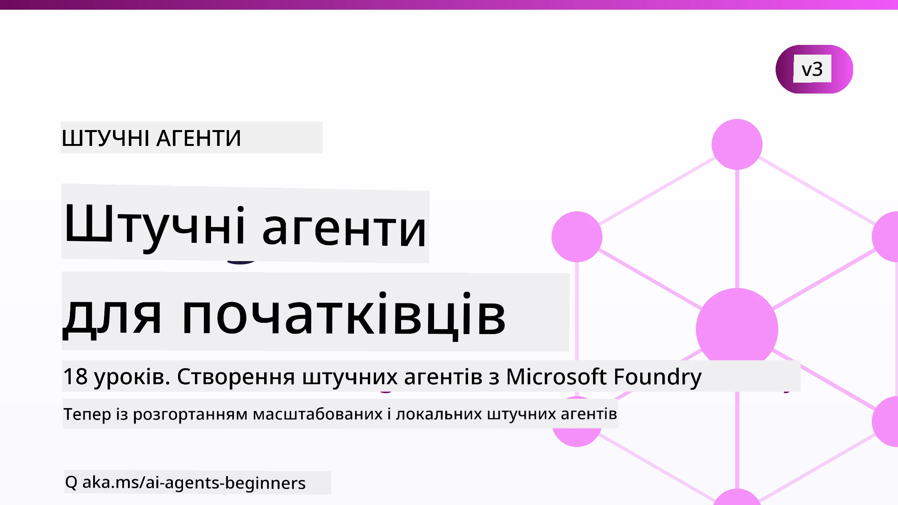

# Агент AI для початківців - Курс



## Курс, який навчає всьому, що потрібно знати, щоб почати створювати агентів AI

[](https://github.com/microsoft/ai-agents-for-beginners/blob/master/LICENSE?WT.mc_id=academic-105485-koreyst)
[](https://GitHub.com/microsoft/ai-agents-for-beginners/graphs/contributors/?WT.mc_id=academic-105485-koreyst)
[](https://GitHub.com/microsoft/ai-agents-for-beginners/issues/?WT.mc_id=academic-105485-koreyst)
[](https://GitHub.com/microsoft/ai-agents-for-beginners/pulls/?WT.mc_id=academic-105485-koreyst)
[](http://makeapullrequest.com?WT.mc_id=academic-105485-koreyst)

### 🌐 Підтримка кількох мов

#### Підтримується через GitHub Action (автоматизовано та завжди актуально)

<!-- CO-OP TRANSLATOR LANGUAGES TABLE START -->
[Arabic](../ar/README.md) | [Bengali](../bn/README.md) | [Bulgarian](../bg/README.md) | [Burmese (Myanmar)](../my/README.md) | [Chinese (Simplified)](../zh-CN/README.md) | [Chinese (Traditional, Hong Kong)](../zh-HK/README.md) | [Chinese (Traditional, Macau)](../zh-MO/README.md) | [Chinese (Traditional, Taiwan)](../zh-TW/README.md) | [Croatian](../hr/README.md) | [Czech](../cs/README.md) | [Danish](../da/README.md) | [Dutch](../nl/README.md) | [Estonian](../et/README.md) | [Finnish](../fi/README.md) | [French](../fr/README.md) | [German](../de/README.md) | [Greek](../el/README.md) | [Hebrew](../he/README.md) | [Hindi](../hi/README.md) | [Hungarian](../hu/README.md) | [Indonesian](../id/README.md) | [Italian](../it/README.md) | [Japanese](../ja/README.md) | [Kannada](../kn/README.md) | [Khmer](../km/README.md) | [Korean](../ko/README.md) | [Lithuanian](../lt/README.md) | [Malay](../ms/README.md) | [Malayalam](../ml/README.md) | [Marathi](../mr/README.md) | [Nepali](../ne/README.md) | [Nigerian Pidgin](../pcm/README.md) | [Norwegian](../no/README.md) | [Persian (Farsi)](../fa/README.md) | [Polish](../pl/README.md) | [Portuguese (Brazil)](../pt-BR/README.md) | [Portuguese (Portugal)](../pt-PT/README.md) | [Punjabi (Gurmukhi)](../pa/README.md) | [Romanian](../ro/README.md) | [Russian](../ru/README.md) | [Serbian (Cyrillic)](../sr/README.md) | [Slovak](../sk/README.md) | [Slovenian](../sl/README.md) | [Spanish](../es/README.md) | [Swahili](../sw/README.md) | [Swedish](../sv/README.md) | [Tagalog (Filipino)](../tl/README.md) | [Tamil](../ta/README.md) | [Telugu](../te/README.md) | [Thai](../th/README.md) | [Turkish](../tr/README.md) | [Ukrainian](./README.md) | [Urdu](../ur/README.md) | [Vietnamese](../vi/README.md)

> **Віддаєте перевагу клонуванню локально?**
>
> У цьому репозиторії понад 50 мовних перекладів, що суттєво збільшує розмір завантаження. Щоб клонувати без перекладів, використовуйте sparse checkout:
>
> **Bash / macOS / Linux:**
> ```bash
> git clone --filter=blob:none --sparse https://github.com/microsoft/ai-agents-for-beginners.git
> cd ai-agents-for-beginners
> git sparse-checkout set --no-cone '/*' '!translations' '!translated_images'
> ```
>
> **CMD (Windows):**
> ```cmd
> git clone --filter=blob:none --sparse https://github.com/microsoft/ai-agents-for-beginners.git
> cd ai-agents-for-beginners
> git sparse-checkout set --no-cone "/*" "!translations" "!translated_images"
> ```
>
> Це надасть вам усе необхідне для проходження курсу з набагато швидшим завантаженням.
<!-- CO-OP TRANSLATOR LANGUAGES TABLE END -->

**Якщо ви хочете, щоб додаткові мови перекладу були підтримані, вони наведені [тут](https://github.com/Azure/co-op-translator/blob/main/getting_started/supported-languages.md).**

[](https://GitHub.com/microsoft/ai-agents-for-beginners/watchers/?WT.mc_id=academic-105485-koreyst)
[](https://GitHub.com/microsoft/ai-agents-for-beginners/network/?WT.mc_id=academic-105485-koreyst)
[](https://GitHub.com/microsoft/ai-agents-for-beginners/stargazers/?WT.mc_id=academic-105485-koreyst)

[](https://discord.com/invite/ATgtXmAS5D)


## 🌱 Початок роботи

Цей курс містить уроки, які охоплюють основи створення агентів AI. Кожен урок присвячений власній темі, тому починайте з будь-якого зручного вам!

Для цього курсу передбачена підтримка кількох мов. Перейдіть до [доступних мов тут](#-multi-language-support). 

Якщо ви вперше працюєте з генеративними моделями AI, ознайомтеся з нашим курсом [Generative AI For Beginners](https://aka.ms/genai-beginners), який містить 21 урок зі створення за допомогою GenAI.

Не забудьте [поставити зірку (🌟) цього репозиторію](https://docs.github.com/en/get-started/exploring-projects-on-github/saving-repositories-with-stars?WT.mc_id=academic-105485-koreyst) та [форкнути цей репозиторій](https://github.com/microsoft/ai-agents-for-beginners/fork), щоб запускати код.

### Знайомтесь з іншими учнями, отримуйте відповіді на свої питання

Якщо у вас виникли проблеми або питання щодо створення агентів AI, приєднуйтесь до нашого спеціального Discord-каналу у [Microsoft Foundry Discord](https://aka.ms/ai-agents/discord).

### Що вам знадобиться

Кожен урок у цьому курсі містить приклади коду, які можна знайти у папці code_samples. Ви можете [форкнути цей репозиторій](https://github.com/microsoft/ai-agents-for-beginners/fork), щоб створити власну копію.

Приклади коду в цих вправах використовують Microsoft Agent Framework з Microsoft Foundry Agent Service V2:

- [Microsoft Foundry](https://aka.ms/ai-agents-beginners/ai-foundry) - Потрібен обліковий запис Azure

У цьому курсі використовуються такі фреймворки та сервіси AI-агентів від Microsoft:

- [Microsoft Agent Framework (MAF)](https://aka.ms/ai-agents-beginners/agent-framework)
- [Microsoft Foundry Agent Service V2](https://aka.ms/ai-agents-beginners/ai-agent-service)

Деякі приклади коду також підтримують альтернативних провайдерів, сумісних із OpenAI, таких як [MiniMax](https://platform.minimaxi.com/), який пропонує моделі з великим контекстом (до 204 тисяч токенів). Деталі конфігурації дивіться в [Course Setup](./00-course-setup/README.md).

Для отримання додаткової інформації про запуск коду курсу зверніться до [Course Setup](./00-course-setup/README.md).

## 🙏 Хочете допомогти?

Чи є у вас пропозиції або ви знайшли помилки у тексті чи коді? [Підніміть питання](https://github.com/microsoft/ai-agents-for-beginners/issues?WT.mc_id=academic-105485-koreyst) або [Створіть запит на внесення змін](https://github.com/microsoft/ai-agents-for-beginners/pulls?WT.mc_id=academic-105485-koreyst)


## 📂 Кожен урок включає

- Письмовий урок, розміщений у README, та коротке відео
- Приклади коду на Python з використанням Microsoft Agent Framework та Microsoft Foundry
- Посилання на додаткові ресурси для продовження навчання


## 🗃️ Уроки

| **Урок**                            | **Текст і код**                               | **Відео**                                               | **Додаткове навчання**                                                             |
|-----------------------------------|----------------------------------------------|---------------------------------------------------------|------------------------------------------------------------------------------------|
| Вступ до агентів AI та сценарії використання агентів | [Посилання](./01-intro-to-ai-agents/README.md) | [Відео](https://youtu.be/3zgm60bXmQk?si=z8QygFvYQv-9WtO1) | [Посилання](https://aka.ms/ai-agents-beginners/collection?WT.mc_id=academic-105485-koreyst) |
| Дослідження фреймворків агентів AI | [Посилання](./02-explore-agentic-frameworks/README.md) | [Відео](https://youtu.be/ODwF-EZo_O8?si=Vawth4hzVaHv-u0H) | [Посилання](https://aka.ms/ai-agents-beginners/collection?WT.mc_id=academic-105485-koreyst) |
| Розуміння патернів дизайну агентів AI | [Посилання](./03-agentic-design-patterns/README.md) | [Відео](https://youtu.be/m9lM8qqoOEA?si=BIzHwzstTPL8o9GF) | [Посилання](https://aka.ms/ai-agents-beginners/collection?WT.mc_id=academic-105485-koreyst) |
| Патерн використання інструментів    | [Посилання](./04-tool-use/README.md)          | [Відео](https://youtu.be/vieRiPRx-gI?si=2z6O2Xu2cu_Jz46N) | [Посилання](https://aka.ms/ai-agents-beginners/collection?WT.mc_id=academic-105485-koreyst) |
| Агентський RAG                    | [Посилання](./05-agentic-rag/README.md)       | [Відео](https://youtu.be/WcjAARvdL7I?si=gKPWsQpKiIlDH9A3) | [Посилання](https://aka.ms/ai-agents-beginners/collection?WT.mc_id=academic-105485-koreyst) |
| Створення надійних агентів AI    | [Посилання](./06-building-trustworthy-agents/README.md) | [Відео](https://youtu.be/iZKkMEGBCUQ?si=jZjpiMnGFOE9L8OK ) | [Посилання](https://aka.ms/ai-agents-beginners/collection?WT.mc_id=academic-105485-koreyst) |
| Патерн дизайну планування         | [Посилання](./07-planning-design/README.md)   | [Відео](https://youtu.be/kPfJ2BrBCMY?si=6SC_iv_E5-mzucnC) | [Посилання](https://aka.ms/ai-agents-beginners/collection?WT.mc_id=academic-105485-koreyst) |
| Патерн мультиагентного дизайну   | [Посилання](./08-multi-agent/README.md)       | [Відео](https://youtu.be/V6HpE9hZEx0?si=rMgDhEu7wXo2uo6g) | [Посилання](https://aka.ms/ai-agents-beginners/collection?WT.mc_id=academic-105485-koreyst) |

| Шаблон проектування метакогніції                  | [Link](./09-metacognition/README.md)               | [Video](https://youtu.be/His9R6gw6Ec?si=8gck6vvdSNCt6OcF)  | [Link](https://aka.ms/ai-agents-beginners/collection?WT.mc_id=academic-105485-koreyst) |
| AI-агенти у продуктивному середовищі             | [Link](./10-ai-agents-production/README.md)        | [Video](https://youtu.be/l4TP6IyJxmQ?si=31dnhexRo6yLRJDl)  | [Link](https://aka.ms/ai-agents-beginners/collection?WT.mc_id=academic-105485-koreyst) |
| Використання агентських протоколів (MCP, A2A та NLWeb) | [Link](./11-agentic-protocols/README.md)           | [Video](https://youtu.be/X-Dh9R3Opn8)                                 | [Link](https://aka.ms/ai-agents-beginners/collection?WT.mc_id=academic-105485-koreyst) |
| Контекстне проектування для AI-агентів            | [Link](./12-context-engineering/README.md)         | [Video](https://youtu.be/F5zqRV7gEag)                                 | [Link](https://aka.ms/ai-agents-beginners/collection?WT.mc_id=academic-105485-koreyst) |
| Керування агентською пам’яттю                       | [Link](./13-agent-memory/README.md)     |      [Video](https://youtu.be/QrYbHesIxpw?si=vZkVwKrQ4ieCcIPx)                                                      |                                                                                        |
| Вивчення Microsoft Agent Framework                | [Link](./14-microsoft-agent-framework/README.md)                            |                                                            |                                                                                        |
| Створення агентів для використання комп’ютера (CUA) | [Link](./15-browser-use/README.md)     |                                                            | [Link](https://docs.browser-use.com/examples/templates/playwright-integration)         |
| Розгортання масштабованих агентів                  | [Link](./16-deploying-scalable-agents/README.md) |                                                    | [Link](https://learn.microsoft.com/azure/ai-foundry/agents/overview)                   |
| Створення локальних AI-агентів                      | [Link](./17-creating-local-ai-agents/README.md)  |                                                    | [Link](https://learn.microsoft.com/azure/ai-foundry/foundry-local/)                    |
| Забезпечення безпеки AI-агентів                     | [Link](./18-securing-ai-agents/README.md)  |                                                            | [Link](https://aka.ms/ai-agents-beginners/collection?WT.mc_id=academic-105485-koreyst) |

## 🎒 Інші курси

Наша команда готує інші курси! Ознайомтесь з:

<!-- CO-OP TRANSLATOR OTHER COURSES START -->
### LangChain
[](https://aka.ms/langchain4j-for-beginners)
[](https://aka.ms/langchainjs-for-beginners?WT.mc_id=m365-94501-dwahlin)
[](https://github.com/microsoft/langchain-for-beginners?WT.mc_id=m365-94501-dwahlin)
---

### Azure / Edge / MCP / Агенти
[](https://github.com/microsoft/AZD-for-beginners?WT.mc_id=academic-105485-koreyst)
[](https://github.com/microsoft/edgeai-for-beginners?WT.mc_id=academic-105485-koreyst)
[](https://github.com/microsoft/mcp-for-beginners?WT.mc_id=academic-105485-koreyst)
[](https://github.com/microsoft/ai-agents-for-beginners?WT.mc_id=academic-105485-koreyst)

---
 
### Серія Generative AI
[](https://github.com/microsoft/generative-ai-for-beginners?WT.mc_id=academic-105485-koreyst)
[-9333EA?style=for-the-badge&labelColor=E5E7EB&color=9333EA)](https://github.com/microsoft/Generative-AI-for-beginners-dotnet?WT.mc_id=academic-105485-koreyst)
[-C084FC?style=for-the-badge&labelColor=E5E7EB&color=C084FC)](https://github.com/microsoft/generative-ai-for-beginners-java?WT.mc_id=academic-105485-koreyst)
[-E879F9?style=for-the-badge&labelColor=E5E7EB&color=E879F9)](https://github.com/microsoft/generative-ai-with-javascript?WT.mc_id=academic-105485-koreyst)

---
 
### Основне навчання
[](https://aka.ms/ml-beginners?WT.mc_id=academic-105485-koreyst)
[](https://aka.ms/datascience-beginners?WT.mc_id=academic-105485-koreyst)
[](https://aka.ms/ai-beginners?WT.mc_id=academic-105485-koreyst)
[](https://github.com/microsoft/Security-101?WT.mc_id=academic-96948-sayoung)
[](https://aka.ms/webdev-beginners?WT.mc_id=academic-105485-koreyst)
[](https://aka.ms/iot-beginners?WT.mc_id=academic-105485-koreyst)
[](https://github.com/microsoft/xr-development-for-beginners?WT.mc_id=academic-105485-koreyst)

---
 
### Серія Copilot
[](https://aka.ms/GitHubCopilotAI?WT.mc_id=academic-105485-koreyst)
[](https://github.com/microsoft/mastering-github-copilot-for-dotnet-csharp-developers?WT.mc_id=academic-105485-koreyst)
[](https://github.com/microsoft/CopilotAdventures?WT.mc_id=academic-105485-koreyst)
<!-- CO-OP TRANSLATOR OTHER COURSES END -->

## 🌟 Подяки спільноті

Дякуємо [Shivam Goyal](https://www.linkedin.com/in/shivam2003/) за важливі приклади коду, що демонструють Agentic RAG.

## Участь у проєкті

Цей проєкт вітає внески та пропозиції. Більшість внесків вимагають вашої згоди з
Угодою про ліцензію для учасників (CLA), у якій ви підтверджуєте, що маєте право і справді надаєте нам
права на використання вашого внеску. Деталі дивіться тут: <https://cla.opensource.microsoft.com>.

Коли ви подаєте pull request, бот CLA автоматично визначить, чи потрібно надати
CLA, і відповідно позначить PR (наприклад, статус-перевірку, коментар). Просто дотримуйтесь інструкцій,
які надає бот. Вам потрібно це зробити лише один раз для всіх репозиторіїв, що використовують наш CLA.

Цей проєкт прийняв [Кодекс поведінки Microsoft Open Source](https://opensource.microsoft.com/codeofconduct/).
Для додаткової інформації дивіться [часті питання кодексу поведінки](https://opensource.microsoft.com/codeofconduct/faq/) або
зв’яжіться з [opencode@microsoft.com](mailto:opencode@microsoft.com) для запитань чи коментарів.

## Торгові марки

Цей проєкт може містити торгові марки або логотипи проектів, продуктів чи послуг. Авторизоване використання торгових марок або логотипів Microsoft
регламентується і має відповідати
[Правилам використання торгових марок та брендів Microsoft](https://www.microsoft.com/legal/intellectualproperty/trademarks/usage/general).
Використання торгових марок або логотипів Microsoft у змінених версіях цього проєкту не повинно викликати плутанину або натякати на спонсорство Microsoft.
Будь-яке використання торгових марок або логотипів третіх сторін підпорядковується політикам відповідних третіх сторін.

## Отримання допомоги


Якщо ви застрягли або маєте питання щодо створення AI-додатків, приєднуйтесь:

[](https://aka.ms/foundry/discord)

Якщо у вас є відгуки про продукт або помилки під час створення, відвідайте:

[](https://aka.ms/foundry/forum)

---

<!-- CO-OP TRANSLATOR DISCLAIMER START -->
**Відмова від відповідальності**:
Цей документ було перекладено за допомогою сервісу штучного інтелекту для перекладу [Co-op Translator](https://github.com/Azure/co-op-translator). Хоча ми прагнемо до точності, будь ласка, майте на увазі, що автоматичні переклади можуть містити помилки або неточності. Оригінальний документ рідною мовою слід вважати авторитетним джерелом. Для критично важливої інформації рекомендується професійний людський переклад. Ми не несемо відповідальності за будь-які непорозуміння або неправильні тлумачення, що виникли внаслідок використання цього перекладу.
<!-- CO-OP TRANSLATOR DISCLAIMER END -->