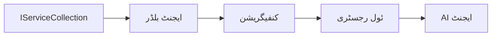

# 🎨 Azure OpenAI (Responses API) کے ساتھ Agentic Design Patterns (.NET)

## 📋 سیکھنے کے مقاصد

یہ مثال Microsoft Agent Framework کو .NET میں Azure OpenAI (Responses API) انٹیگریشن کے ساتھ استعمال کرتے ہوئے ذہین ایجنٹس بنانے کے لیے انٹرپرائز گریڈ ڈیزائن پیٹرنز کی نمائندگی کرتی ہے۔ آپ پیشہ ورانہ پیٹرنز اور فن تعمیر کے طریقے سیکھیں گے جو ایجنٹس کو پروڈکشن کے قابل، قابلِ بحالی، اور اسکیل ایبل بناتے ہیں۔

### انٹرپرائز ڈیزائن پیٹرنز

- 🏭 **Factory Pattern**: ڈپینڈینسی انجیکشن کے ساتھ معیاری ایجنٹ تخلیق
- 🔧 **Builder Pattern**: روانی سے ایجنٹ کی تشکیل اور سیٹ اپ
- 🧵 **Thread-Safe Patterns**: متوازی گفتگو کا انتظام
- 📋 **Repository Pattern**: منظم ٹول اور صلاحیت کا انتظام

## 🎯 .NET مخصوص فن تعمیر کے فوائد

### انٹرپرائز خصوصیات

- **Strong Typing**: کمپائل ٹائم ویلیڈیشن اور IntelliSense کی حمایت
- **Dependency Injection**: بلٹ ان DI کنٹینر انٹیگریشن
- **Configuration Management**: IConfiguration اور Options پیٹرنز
- **Async/Await**: اعلیٰ درجے کی غیر ہم عصر پروگرامنگ کی حمایت

### پروڈکشن ریڈی پیٹرنز

- **Logging Integration**: ILogger اور منظم لاگنگ سپورٹ
- **Health Checks**: بلٹ ان مانیٹرنگ اور تشخیص
- **Configuration Validation**: ڈیٹا اینوٹیشن کے ساتھ مضبوط ٹائپنگ
- **Error Handling**: منظم ایکسپشن مینجمنٹ

## 🔧 تکنیکی فن تعمیر

### بنیادی .NET اجزاء

- **Microsoft.Extensions.AI**: متحدہ AI سروس تجریدات
- **Microsoft.Agents.AI**: انٹرپرائز ایجنٹ آرکسیسٹریشن فریم ورک
- **Azure OpenAI (Responses API)**: اعلیٰ کارکردگی والی API کلائنٹ پیٹرنز
- **Configuration System**: appsettings.json اور ماحول کی انٹیگریشن

### ڈیزائن پیٹرن کا نفاذ



## 🏗️ انٹرپرائز پیٹرنز کی نمائش

### 1. **تخلیقی پیٹرنز**

- **Agent Factory**: مرکزی ایجنٹ تخلیق مع یکساں کنفیگریشن
- **Builder Pattern**: پیچیدہ ایجنٹ کی تشکیل کے لیے روان API
- **Singleton Pattern**: مشترکہ وسائل اور کنفیگریشن کا انتظام
- **Dependency Injection**: ڈھیلے جوڑ اور ٹیسٹیبلٹی

### 2. **رویے کے پیٹرنز**

- **Strategy Pattern**: آپس میں تبدیل ہونے والی ٹولز کے نفاذ کی حکمت عملی
- **Command Pattern**: ایجنٹ آپریشنز کا انکیپسولیٹڈ انجام دہی مع انڈو/ریڈو
- **Observer Pattern**: ایونٹ کی بنیاد پر ایجنٹ لائف سائیکل مینجمنٹ
- **Template Method**: معیاری ایجنٹ ایکزیکیوشن ورک فلو

### 3. **ساختی پیٹرنز**

- **Adapter Pattern**: Azure OpenAI (Responses API) انٹیگریشن پرت
- **Decorator Pattern**: ایجنٹ صلاحیت کی بہتری
- **Facade Pattern**: آسان بنایا گیا ایجنٹ انٹریکشن انٹرفیس
- **Proxy Pattern**: کارکردگی کے لیے لیزی لوڈنگ اور کیشنگ

## 📚 .NET ڈیزائن اصول

### SOLID اصول

- **Single Responsibility**: ہر جزو کا ایک واضح مقصد
- **Open/Closed**: بغیر ترمیم کے قابل توسیع
- **Liskov Substitution**: انٹرفیس پر مبنی ٹولز کا نفاذ
- **Interface Segregation**: مرکوز اور مربوط انٹرفیسز
- **Dependency Inversion**: خلاصہ پر منحصر، ٹھوس چیزوں پر نہیں

### کلین آرکیٹیکچر

- **Domain Layer**: بنیادی ایجنٹ اور ٹول کی تجریدات
- **Application Layer**: ایجنٹ آرکسیسٹریشن اور ورک فلو
- **Infrastructure Layer**: Azure OpenAI (Responses API) انٹیگریشن اور خارجی خدمات
- **Presentation Layer**: صارف کے انٹریکشن اور جواب کی فارمیٹنگ

## 🔒 انٹرپرائز کے مدنظر نکات

### سیکیورٹی

- **Credential Management**: IConfiguration کے ساتھ محفوظ API کلید کا انتظام
- **Input Validation**: مضبوط ٹائپنگ اور ڈیٹا اینوٹیشن کی جانچ
- **Output Sanitization**: محفوظ جواب کی پروسیسنگ اور فلٹرنگ
- **Audit Logging**: جامع آپریشن ٹریکنگ

### کارکردگی

- **Async Patterns**: نان بلاکنگ I/O آپریشنز
- **Connection Pooling**: موثر HTTP کلائنٹ کا انتظام
- **Caching**: بہتر کارکردگی کے لیے جواب کی کیشنگ
- **Resource Management**: مناسب صفائی اور ریسورس کی چھٹی کے پیٹرنز

### توسیع پذیری

- **Thread Safety**: متوازی ایجنٹ عملدرآمد کی حمایت
- **Resource Pooling**: مؤثر وسائل کا استعمال
- **Load Management**: شرح کی حد بندی اور بیک پریشر ہینڈلنگ
- **Monitoring**: کارکردگی کے میٹرکس اور صحت کی جانچ

## 🚀 پروڈکشن تعیناتی

- **Configuration Management**: ماحول مخصوص ترتیبات
- **Logging Strategy**: کو رلیشن IDs کے ساتھ منظم لاگنگ
- **Error Handling**: عالمی استثنا ہینڈلنگ مع مناسب بحالی
- **Monitoring**: ایپلیکیشن انسائٹس اور کارکردگی کے کاؤنٹرز
- **Testing**: یونٹ ٹیسٹ، انٹیگریشن ٹیسٹ، اور لوڈ ٹیسٹنگ کے پیٹرنز

کیا آپ .NET کے ساتھ انٹرپرائز گریڈ ذہین ایجنٹس بنانے کے لیے تیار ہیں؟ آئیں کچھ مضبوط فن تعمیر کریں! 🏢✨

## 🚀 شروعات

### پیشگی ضروریات

- [.NET 10 SDK](https://dotnet.microsoft.com/download/dotnet/10.0) یا اس سے زیادہ
- Azure OpenAI resource اور ماڈل ڈپلائمنٹ کے ساتھ ایک [Azure سبسکرپشن](https://azure.microsoft.com/free/)
- [Azure CLI](https://learn.microsoft.com/cli/azure/install-azure-cli) — `az login` کے ساتھ سائن ان کریں

### مطلوبہ ماحول کے متغیرات

```bash
# zsh/bash
export AZURE_OPENAI_ENDPOINT=https://<your-resource>.openai.azure.com
export AZURE_OPENAI_DEPLOYMENT=gpt-4.1-mini
# پھر سائن ان کریں تاکہ AzureCliCredential ایک ٹوکن حاصل کر سکے۔
az login
```

```powershell
# پاور شیل
$env:AZURE_OPENAI_ENDPOINT = "https://<your-resource>.openai.azure.com"
$env:AZURE_OPENAI_DEPLOYMENT = "gpt-4.1-mini"
# پھر سائن ان کریں تاکہ AzureCliCredential ٹوکن حاصل کر سکے
az login
```

### نمونہ کوڈ

مثال کوڈ چلانے کے لیے،

```bash
# زی شیل / باش
chmod +x ./03-dotnet-agent-framework.cs
./03-dotnet-agent-framework.cs
```

یا dotnet CLI استعمال کرتے ہوئے:

```bash
dotnet run ./03-dotnet-agent-framework.cs
```

مکمل کوڈ کے لیے دیکھیں [`03-dotnet-agent-framework.cs`](../../../../03-agentic-design-patterns/code_samples/03-dotnet-agent-framework.cs)۔

```csharp
#!/usr/bin/dotnet run

#:package Microsoft.Extensions.AI@10.*
#:package Microsoft.Agents.AI.OpenAI@1.*-*
#:package Azure.AI.OpenAI@2.1.0
#:package Azure.Identity@1.13.1

using System.ComponentModel;

using Microsoft.Agents.AI;
using Microsoft.Extensions.AI;

using Azure.AI.OpenAI;
using Azure.Identity;

// Tool Function: Random Destination Generator
// This static method will be available to the agent as a callable tool
// The [Description] attribute helps the AI understand when to use this function
// This demonstrates how to create custom tools for AI agents
[Description("Provides a random vacation destination.")]
static string GetRandomDestination()
{
    // List of popular vacation destinations around the world
    // The agent will randomly select from these options
    var destinations = new List<string>
    {
        "Paris, France",
        "Tokyo, Japan",
        "New York City, USA",
        "Sydney, Australia",
        "Rome, Italy",
        "Barcelona, Spain",
        "Cape Town, South Africa",
        "Rio de Janeiro, Brazil",
        "Bangkok, Thailand",
        "Vancouver, Canada"
    };

    // Generate random index and return selected destination
    // Uses System.Random for simple random selection
    var random = new Random();
    int index = random.Next(destinations.Count);
    return destinations[index];
}

// Azure OpenAI with the Responses API (stable v1 endpoint). Sign in with `az login`.
var azureEndpoint = Environment.GetEnvironmentVariable("AZURE_OPENAI_ENDPOINT")
    ?? throw new InvalidOperationException("AZURE_OPENAI_ENDPOINT is not set.");
var deployment = Environment.GetEnvironmentVariable("AZURE_OPENAI_DEPLOYMENT") ?? "gpt-4.1-mini";

var azureClient = new AzureOpenAIClient(new Uri(azureEndpoint), new AzureCliCredential());

// Define Agent Identity and Comprehensive Instructions
// Agent name for identification and logging purposes
var AGENT_NAME = "TravelAgent";

// Detailed instructions that define the agent's personality, capabilities, and behavior
// This system prompt shapes how the agent responds and interacts with users
var AGENT_INSTRUCTIONS = """
You are a helpful AI Agent that can help plan vacations for customers.

Important: When users specify a destination, always plan for that location. Only suggest random destinations when the user hasn't specified a preference.

When the conversation begins, introduce yourself with this message:
"Hello! I'm your TravelAgent assistant. I can help plan vacations and suggest interesting destinations for you. Here are some things you can ask me:
1. Plan a day trip to a specific location
2. Suggest a random vacation destination
3. Find destinations with specific features (beaches, mountains, historical sites, etc.)
4. Plan an alternative trip if you don't like my first suggestion

What kind of trip would you like me to help you plan today?"

Always prioritize user preferences. If they mention a specific destination like "Bali" or "Paris," focus your planning on that location rather than suggesting alternatives.
""";

// Create AI Agent with Advanced Travel Planning Capabilities
// Get the Responses client for the deployment and create the AI agent
// Configure agent with name, detailed instructions, and available tools
// This demonstrates the .NET agent creation pattern with full configuration
AIAgent agent = azureClient
    .GetChatClient(deployment)
    .AsAIAgent(
        name: AGENT_NAME,
        instructions: AGENT_INSTRUCTIONS,
        tools: [AIFunctionFactory.Create(GetRandomDestination)]
    );

// Create New Conversation Session for Context Management
// Initialize a new conversation session to maintain context across multiple interactions
// Sessions enable the agent to remember previous exchanges and maintain conversational state
// This is essential for multi-turn conversations and contextual understanding
var session = await agent.CreateSessionAsync();

// Execute Agent: First Travel Planning Request
// Run the agent with an initial request that will likely trigger the random destination tool
// The agent will analyze the request, use the GetRandomDestination tool, and create an itinerary
// Using the session parameter maintains conversation context for subsequent interactions
await foreach (var update in agent.RunStreamingAsync("Plan me a day trip", session))
{
    await Task.Delay(10);
    Console.Write(update);
}

Console.WriteLine();

// Execute Agent: Follow-up Request with Context Awareness
// Demonstrate contextual conversation by referencing the previous response
// The agent remembers the previous destination suggestion and will provide an alternative
// This showcases the power of conversation sessions and contextual understanding in .NET agents
await foreach (var update in agent.RunStreamingAsync("I don't like that destination. Plan me another vacation.", session))
{
    await Task.Delay(10);
    Console.Write(update);
}
```

---

<!-- CO-OP TRANSLATOR DISCLAIMER START -->
**ڈس کلیمر**:
یہ دستاویز AI ترجمہ سروس [Co-op Translator](https://github.com/Azure/co-op-translator) کے ذریعے ترجمہ کی گئی ہے۔ جبکہ ہم درستگی کے لیے کوشاں ہیں، براہ کرم اس بات سے آگاہ رہیں کہ خودکار ترجمے میں غلطیاں یا عدم درستیاں ہو سکتی ہیں۔ اصل دستاویز اپنے مادری زبان میں مستند ماخذ سمجھی جائے گی۔ حساس معلومات کے لیے پیشہ ور انسانی ترجمہ کی سفارش کی جاتی ہے۔ اس ترجمے کے استعمال سے پیدا ہونے والی کسی بھی غلط فہمی یا غلط تشریح کی ذمہ داری ہم قبول نہیں کرتے۔
<!-- CO-OP TRANSLATOR DISCLAIMER END -->