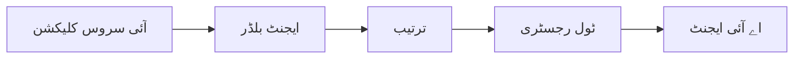

# 🎨 ایجنٹک ڈیزائن پیٹرنز بذریعہ Azure OpenAI (Responses API) (.NET)

## 📋 تعلمی مقاصد

یہ مثال Microsoft Agent Framework کو .NET میں Azure OpenAI (Responses API) انٹیگریشن کے ساتھ استعمال کرتے ہوئے ذہین ایجنٹس بنانے کے لیے انٹرپرائز گریڈ ڈیزائن پیٹرنز دکھاتی ہے۔ آپ ایسے پیشہ ورانہ پیٹرنز اور فن تعمیراتی طریقے سیکھیں گے جو ایجنٹس کو پروڈکشن-ریڈی، قابلِ دیکھ بھال، اور توسیعی بناتے ہیں۔

### انٹرپرائز ڈیزائن پیٹرنز

- 🏭 **فیکٹری پیٹرن**: ڈیپینڈنسی انجیکشن کے ساتھ معیاری ایجنٹ تخلیق
- 🔧 **بلڈر پیٹرن**: فلوئنٹ ایجنٹ ترتیب اور سیٹ اپ
- 🧵 **تھریڈ-سیف پیٹرنز**: متوازی گفتگو کا انتظام
- 📋 **ریپوزیٹری پیٹرن**: منظم ٹول اور صلاحیت کا انتظام

## 🎯 .NET مخصوص فن تعمیراتی فوائد

### انٹرپرائز خصوصیات

- **مضبوط ٹائپنگ**: کمپائل-ٹائم ویلیڈیشن اور IntelliSense سپورٹ
- **ڈیپینڈنسی انجیکشن**: بلٹ-ان DI کنٹینر انٹیگریشن
- **کنفیگریشن مینجمنٹ**: IConfiguration اور Options پیٹرنز
- **Async/Await**: اولین درجے کی غیر متوقع پروگرامنگ سپورٹ

### پروڈکشن-ریڈی پیٹرنز

- **لاجنگ انٹیگریشن**: ILogger اور مستند لاگنگ سپورٹ
- **ہیلتھ چیکس**: بلٹ-ان مانیٹرنگ اور تشخیصات
- **کنفیگریشن ویلیڈیشن**: ڈیٹا اینوٹیشنز کے ساتھ مضبوط ٹائپنگ
- **ایرر ہینڈلنگ**: مستند استثناء کا انتظام

## 🔧 تکنیکی فن تعمیر

### بنیادی .NET اجزاء

- **Microsoft.Extensions.AI**: متحد AI سروس ایبسٹریکشنز
- **Microsoft.Agents.AI**: انٹرپرائز ایجنٹ آرکسٹریشن فریم ورک
- **Azure OpenAI (Responses API)**: اعلیٰ کارکردگی API کلائنٹ پیٹرنز
- **کنفیگریشن سسٹم**: appsettings.json اور ماحول کی انٹیگریشن

### ڈیزائن پیٹرن نفاذ



## 🏗️ دکھائے گئے انٹرپرائز پیٹرنز

### 1. **تخلیقی پیٹرنز**

- **ایجنٹ فیکٹری**: مسلسل ترتیب کے ساتھ مرکزی ایجنٹ تخلیق
- **بلڈر پیٹرن**: پیچیدہ ایجنٹ کی ترتیب کے لیے فلوئنٹ API
- **سنگلٹن پیٹرن**: مشترکہ وسائل اور کنفیگریشن مینجمنٹ
- **ڈیپینڈنسی انجیکشن**: کمزور جوڑ اور ٹیسٹ ایبلٹی

### 2. **رویے کے پیٹرنز**

- **اسٹریٹجی پیٹرن**: تبدیل ہونے والے ٹول ایکزیکیوشن اسٹریٹجیز
- **کمانڈ پیٹرن**: انکیپسولیٹڈ ایجنٹ آپریشنز جن کے انڈو/ریڈو ہیں
- **آبزروور پیٹرن**: واقعہ پر مبنی ایجنٹ لائف سائیکل مینجمنٹ
- **ٹیمپلیٹ میتھڈ**: معیاری ایجنٹ ایکزیکیوشن ورک فلو

### 3. **ساختی پیٹرنز**

- **ایڈاپٹر پیٹرن**: Azure OpenAI (Responses API) انٹیگریشن پرت
- **ڈیکوریٹر پیٹرن**: ایجنٹ صلاحیت کی بہتری
- **فیسیڈ پیٹرن**: آسان ایجنٹ انٹریکشن انٹرفیسز
- **پراکسی پیٹرن**: کارکردگی کے لیے سست لوڈنگ اور کیشنگ

## 📚 .NET ڈیزائن اصول

### SOLID اصول

- **سنگل ریسپانسبلیٹی**: ہر جزو کا ایک واضح مقصد
- **اوپن/کلوزڈ**: ترمیم کے بغیر قابل توسیع
- **لیسکوف سبسٹیوٹشن**: انٹرفیس پر مبنی ٹول امپلیمنٹیشنز
- **انٹرفیس سیگریگیشن**: مرکوز اور مربوط انٹرفیسز
- **ڈیپینڈنسی انورژن**: ابسٹریکشنز پر انحصار کریں، نہ کہ کنکریشنز پر

### کلین آرکیٹیکچر

- **ڈومین لیئر**: بنیادی ایجنٹ اور ٹول ایبسٹریکشنز
- **اپلیکیشن لیئر**: ایجنٹ آرکسٹریشن اور ورک فلو
- **انفراسٹرکچر لیئر**: Azure OpenAI (Responses API) انٹیگریشن اور خارجی خدمات
- **پریزنٹیشن لیئر**: صارف انٹریکشن اور جوابی فارمیٹنگ

## 🔒 انٹرپرائز غور و فکر

### سیکیورٹی

- **کریڈینشل مینجمنٹ**: IConfiguration کے ساتھ محفوظ API کلید کا انتظام
- **ان پٹ ویلیڈیشن**: مضبوط ٹائپنگ اور ڈیٹا اینوٹیشن ویلیڈیشن
- **آؤٹ پٹ سینٹائزیشن**: محفوظ جواب کی پراسیسنگ اور فلٹرنگ
- **آڈٹ لاگنگ**: جامع آپریشن ٹریکنگ

### کارکردگی

- **ایسینک پیٹرنز**: نان بلاکنگ I/O آپریشنز
- **کنکشن پولنگ**: مؤثر HTTP کلائنٹ مینجمنٹ
- **کیشنگ**: بہتر کارکردگی کے لیے جواب کی کیشنگ
- **وسائل کا انتظام**: مناسب تلف اور صفائی کے پیٹرنز

### توسیع پذیری

- **تھریڈ سیفٹی**: متوازی ایجنٹ ایکزیکیوشن سپورٹ
- **وسائل کی پولنگ**: وسائل کا مؤثر استعمال
- **لوڈ مینجمنٹ**: ریٹ لمٹنگ اور بیک پریشر ہینڈلنگ
- **مانیٹرنگ**: کارکردگی کے میٹرکس اور ہیلتھ چیکس

## 🚀 پروڈکشن ڈپلائمنٹ

- **کنفیگریشن مینجمنٹ**: ماحول کی مخصوص ترتیبات
- **لاجنگ حکمت عملی**: مستند لاگنگ بمعہ کورلیشن IDs
- **ایرر ہینڈلنگ**: عالمی استثناء ہینڈلنگ بمعہ مناسب بحالی
- **مانیٹرنگ**: ایپلیکیشن انسائٹس اور کارکردگی کے کاؤنٹرز
- **ٹیسٹنگ**: یونٹ ٹیسٹ، انٹیگریشن ٹیسٹ، اور لوڈ ٹیسٹنگ پیٹرنز

.NET کے ساتھ انٹرپرائز گریڈ ذہین ایجنٹس بنانے کو تیار ہیں؟ آئیں کچھ مضبوط تعمیر کریں! 🏢✨

## 🚀 شروعات کریں

### پیشگی شرائط

- [.NET 10 SDK](https://dotnet.microsoft.com/download/dotnet/10.0) یا اس سے زیادہ
- ایک [Azure سبسکرپشن](https://azure.microsoft.com/free/) جس میں Azure OpenAI ریسورس اور ماڈل ڈپلائمنٹ ہو
- [Azure CLI](https://learn.microsoft.com/cli/azure/install-azure-cli) — `az login` سے سائن ان کریں

### مطلوبہ ماحول کے متغیرات

```bash
# zsh/bash
export AZURE_OPENAI_ENDPOINT=https://<your-resource>.openai.azure.com
export AZURE_OPENAI_DEPLOYMENT=gpt-5-mini
# پھر سائن ان کریں تاکہ AzureCliCredential ٹوکن حاصل کر سکے
az login
```

```powershell
# پاور شیل
$env:AZURE_OPENAI_ENDPOINT = "https://<your-resource>.openai.azure.com"
$env:AZURE_OPENAI_DEPLOYMENT = "gpt-5-mini"
# پھر سائن ان کریں تاکہ AzureCliCredential ایک ٹوکن حاصل کر سکے
az login
```

### نمونہ کوڈ

کوڈ مثال چلانے کے لیے،

```bash
# زی ایس ایچ/باش
chmod +x ./03-dotnet-agent-framework.cs
./03-dotnet-agent-framework.cs
```

یا dotnet CLI استعمال کرتے ہوئے:

```bash
dotnet run ./03-dotnet-agent-framework.cs
```

مکمل کوڈ کے لیے [`03-dotnet-agent-framework.cs`](../../../../03-agentic-design-patterns/code_samples/03-dotnet-agent-framework.cs) دیکھیں۔

```csharp
#!/usr/bin/dotnet run

#:package Microsoft.Extensions.AI@10.*
#:package Microsoft.Agents.AI.OpenAI@1.*-*
#:package Azure.AI.OpenAI@2.1.0
#:package Azure.Identity@1.13.1

using System.ComponentModel;

using Microsoft.Agents.AI;
using Microsoft.Extensions.AI;

using Azure.AI.OpenAI;
using Azure.Identity;

// Tool Function: Random Destination Generator
// This static method will be available to the agent as a callable tool
// The [Description] attribute helps the AI understand when to use this function
// This demonstrates how to create custom tools for AI agents
[Description("Provides a random vacation destination.")]
static string GetRandomDestination()
{
    // List of popular vacation destinations around the world
    // The agent will randomly select from these options
    var destinations = new List<string>
    {
        "Paris, France",
        "Tokyo, Japan",
        "New York City, USA",
        "Sydney, Australia",
        "Rome, Italy",
        "Barcelona, Spain",
        "Cape Town, South Africa",
        "Rio de Janeiro, Brazil",
        "Bangkok, Thailand",
        "Vancouver, Canada"
    };

    // Generate random index and return selected destination
    // Uses System.Random for simple random selection
    var random = new Random();
    int index = random.Next(destinations.Count);
    return destinations[index];
}

// Azure OpenAI with the Responses API (stable v1 endpoint). Sign in with `az login`.
var azureEndpoint = Environment.GetEnvironmentVariable("AZURE_OPENAI_ENDPOINT")
    ?? throw new InvalidOperationException("AZURE_OPENAI_ENDPOINT is not set.");
var deployment = Environment.GetEnvironmentVariable("AZURE_OPENAI_DEPLOYMENT") ?? "gpt-5-mini";

var azureClient = new AzureOpenAIClient(new Uri(azureEndpoint), new AzureCliCredential());

// Define Agent Identity and Comprehensive Instructions
// Agent name for identification and logging purposes
var AGENT_NAME = "TravelAgent";

// Detailed instructions that define the agent's personality, capabilities, and behavior
// This system prompt shapes how the agent responds and interacts with users
var AGENT_INSTRUCTIONS = """
You are a helpful AI Agent that can help plan vacations for customers.

Important: When users specify a destination, always plan for that location. Only suggest random destinations when the user hasn't specified a preference.

When the conversation begins, introduce yourself with this message:
"Hello! I'm your TravelAgent assistant. I can help plan vacations and suggest interesting destinations for you. Here are some things you can ask me:
1. Plan a day trip to a specific location
2. Suggest a random vacation destination
3. Find destinations with specific features (beaches, mountains, historical sites, etc.)
4. Plan an alternative trip if you don't like my first suggestion

What kind of trip would you like me to help you plan today?"

Always prioritize user preferences. If they mention a specific destination like "Bali" or "Paris," focus your planning on that location rather than suggesting alternatives.
""";

// Create AI Agent with Advanced Travel Planning Capabilities
// Get the Responses client for the deployment and create the AI agent
// Configure agent with name, detailed instructions, and available tools
// This demonstrates the .NET agent creation pattern with full configuration
AIAgent agent = azureClient
    .GetChatClient(deployment)
    .AsAIAgent(
        name: AGENT_NAME,
        instructions: AGENT_INSTRUCTIONS,
        tools: [AIFunctionFactory.Create(GetRandomDestination)]
    );

// Create New Conversation Session for Context Management
// Initialize a new conversation session to maintain context across multiple interactions
// Sessions enable the agent to remember previous exchanges and maintain conversational state
// This is essential for multi-turn conversations and contextual understanding
var session = await agent.CreateSessionAsync();

// Execute Agent: First Travel Planning Request
// Run the agent with an initial request that will likely trigger the random destination tool
// The agent will analyze the request, use the GetRandomDestination tool, and create an itinerary
// Using the session parameter maintains conversation context for subsequent interactions
await foreach (var update in agent.RunStreamingAsync("Plan me a day trip", session))
{
    await Task.Delay(10);
    Console.Write(update);
}

Console.WriteLine();

// Execute Agent: Follow-up Request with Context Awareness
// Demonstrate contextual conversation by referencing the previous response
// The agent remembers the previous destination suggestion and will provide an alternative
// This showcases the power of conversation sessions and contextual understanding in .NET agents
await foreach (var update in agent.RunStreamingAsync("I don't like that destination. Plan me another vacation.", session))
{
    await Task.Delay(10);
    Console.Write(update);
}
```

---

<!-- CO-OP TRANSLATOR DISCLAIMER START -->
**ڈس کلیمر**:
یہ دستاویز AI ترجمہ سروس [Co-op Translator](https://github.com/Azure/co-op-translator) کے ذریعے ترجمہ کی گئی ہے۔ جبکہ ہم درستگی کے لیے کوشاں ہیں، براہ کرم اس بات سے آگاہ رہیں کہ خودکار ترجمے میں غلطیاں یا عدم درستیاں ہو سکتی ہیں۔ اصل دستاویز اپنے مادری زبان میں مستند ماخذ سمجھی جائے گی۔ حساس معلومات کے لیے پیشہ ور انسانی ترجمہ کی سفارش کی جاتی ہے۔ اس ترجمے کے استعمال سے پیدا ہونے والی کسی بھی غلط فہمی یا غلط تشریح کی ذمہ داری ہم قبول نہیں کرتے۔
<!-- CO-OP TRANSLATOR DISCLAIMER END -->