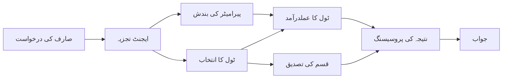

# 🛠️ ایزور اوپن اے آئی کے ساتھ جدید ٹول استعمال (Responses API) (.NET)

## 📋 سیکھنے کے مقاصد

یہ نوٹ بک مائیکروسافٹ ایجنٹ فریم ورک کو .NET میں ایزور اوپن اے آئی (Responses API) کے ساتھ انٹرپرائز گریڈ ٹول انٹیگریشن پیٹرنز دکھاتی ہے۔ آپ متعدد خصوصی ٹولز کے ساتھ پیچیدہ ایجنٹس بنانے کا طریقہ سیکھیں گے، C# کی مضبوط ٹائپنگ اور .NET کی انٹرپرائز خصوصیات سے فائدہ اٹھاتے ہوئے۔

### جدید ٹول صلاحیتیں جو آپ ماہر ہوں گے

- 🔧 **کثیر ٹول آرکیٹیکچر**: متعدد خصوصی صلاحیتوں کے ساتھ ایجنٹس کی تعمیر
- 🎯 **ٹائپ-سیف ٹول اجرا**: C# کی کمپائل ٹائم توثیق کا فائدہ اٹھانا
- 📊 **انٹرپرائز ٹول پیٹرنز**: پروڈکشن کے قابل ٹول ڈیزائن اور ایرر ہینڈلنگ
- 🔗 **ٹول کمپوزیشن**: پیچیدہ کاروباری ورک فلو کے لیے ٹولز کا امتزاج

## 🎯 .NET ٹول آرکیٹیکچر کے فوائد

### انٹرپرائز ٹول خصوصیات

- **کمپائل ٹائم توثیق**: مضبوط ٹائپنگ سے ٹول پیرامیٹرز کی درستگی یقینی بنانا
- **ڈیپنڈنسی انجیکشن**: ٹول مینجمنٹ کے لیے IoC کنٹینر انٹیگریشن
- **ایسنک/اویٹ پیٹرنز**: مناسب وسائل کی مینجمنٹ کے ساتھ غیر بلاکنگ ٹول اجرا
- **اسٹرکچرڈ لاگنگ**: ٹول اجرا کی نگرانی کے لیے بلٹ ان لاگنگ انٹیگریشن

### پروڈکشن کے قابل پیٹرنز

- **ایکسپشن ہینڈلنگ**: ٹائپ کردہ استثناؤں کے ساتھ جامع ایرر مینجمنٹ
- **وسائل کی مینجمنٹ**: مناسب ڈسپوزل پیٹرنز اور میموری کی دیکھ بھال
- **کارکردگی کی نگرانی**: بلٹ ان میٹرکس اور کارکردگی کے کاؤنٹرز
- **کنفیگریشن مینجمنٹ**: توثیق کے ساتھ ٹائپ-سیف کنفیگریشن

## 🔧 تکنیکی آرکیٹیکچر

### بنیادی .NET ٹول اجزاء

- **Microsoft.Extensions.AI**: متحد ٹول آبسٹریکشن پرت
- **Microsoft.Agents.AI**: انٹرپرائز گریڈ ٹول آرکیسٹراشن
- **Azure OpenAI (Responses API)**: کنکشن پولنگ کے ساتھ ہائی پرفارمنس API کلائنٹ

### ٹول اجرا پائپ لائن



## 🛠️ ٹول کی قسمیں اور پیٹرنز

### 1. **ڈیٹا پروسیسنگ ٹولز**

- **ان پٹ ویلیڈیشن**: ڈیٹا انوٹیشن کے ساتھ مضبوط ٹائپنگ
- **ٹرانسفارم آپریشنز**: ٹائپ-سیف ڈیٹا کنورژن اور فارمیٹنگ
- **بزنس لاجک**: مخصوص ڈومین کے حساب کتاب اور تجزیے کے ٹولز
- **آؤٹ پٹ فارمیٹنگ**: ساختہ شدہ ردعمل کی تخلیق

### 2. **انٹیگریشن ٹولز**

- **API کنیکٹرز**: HttpClient کے ساتھ RESTful سروس انٹیگریشن
- **ڈیٹا بیس ٹولز**: ڈیٹا تک رسائی کے لیے Entity Framework انٹیگریشن
- **فائل آپریشنز**: ویلیڈیشن کے ساتھ محفوظ فائل سسٹم آپریشنز
- **بیرونی خدمات**: تیسرے فریق کی سروس انٹیگریشن پیٹرنز

### 3. **یوٹیلٹی ٹولز**

- **ٹیکسٹ پروسیسنگ**: سٹرنگ مینپولیشن اور فارمیٹنگ کی یوٹیلٹیز
- **تاریخ/وقت کے آپریشنز**: ثقافتی لحاظ سے مطابقت رکھنے والے تاریخ/وقت کے حسابات
- **ریاضیاتی ٹولز**: دقیق حسابات اور شماریاتی آپریشنز
- **ویلیڈیشن ٹولز**: کاروباری اصول کی توثیق اور ڈیٹا کی تصدیق

کیا آپ .NET میں طاقتور، ٹائپ-سیف ٹول صلاحیتوں کے ساتھ انٹرپرائز گریڈ ایجنٹس بنانے کے لیے تیار ہیں؟ آئیے کچھ پیشہ ورانہ حل تیار کریں! 🏢⚡

## 🚀 شروع کرنا

### تقاضے

- [.NET 10 SDK](https://dotnet.microsoft.com/download/dotnet/10.0) یا اس سے زیادہ ورژن
- ایزور سبسکرپشن جس میں ایزور اوپن اے آئی ریسورس اور ماڈل ڈپلائمنٹ ہو
- [Azure CLI](https://learn.microsoft.com/cli/azure/install-azure-cli) — `az login` سے لاگ ان کریں

### ضروری ماحول کے متغیر

```bash
# ز ش / باش
export AZURE_OPENAI_ENDPOINT=https://<your-resource>.openai.azure.com
export AZURE_OPENAI_DEPLOYMENT=gpt-5-mini
# پھر سائن ان کریں تاکہ AzureCliCredential ٹوکن حاصل کر سکے
az login
```

```powershell
# پاور شیل
$env:AZURE_OPENAI_ENDPOINT = "https://<your-resource>.openai.azure.com"
$env:AZURE_OPENAI_DEPLOYMENT = "gpt-5-mini"
# پھر سائن ان کریں تاکہ AzureCliCredential ٹوکن حاصل کر سکے۔
az login
```

### مثال کوڈ

کوڈ مثال چلانے کے لیے،

```bash
# زیش/باش
chmod +x ./04-dotnet-agent-framework.cs
./04-dotnet-agent-framework.cs
```

یا dotnet CLI استعمال کرتے ہوئے:

```bash
dotnet run ./04-dotnet-agent-framework.cs
```

مکمل کوڈ کے لیے [`04-dotnet-agent-framework.cs`](../../../../04-tool-use/code_samples/04-dotnet-agent-framework.cs) دیکھیں۔

```csharp
#!/usr/bin/dotnet run

#:package Microsoft.Extensions.AI@10.*
#:package Microsoft.Agents.AI.OpenAI@1.*-*
#:package Azure.AI.OpenAI@2.1.0
#:package Azure.Identity@1.13.1

using System.ComponentModel;

using Microsoft.Agents.AI;
using Microsoft.Extensions.AI;

using Azure.AI.OpenAI;
using Azure.Identity;

// Tool Function: Random Destination Generator
// This static method will be available to the agent as a callable tool
// The [Description] attribute helps the AI understand when to use this function
// This demonstrates how to create custom tools for AI agents
[Description("Provides a random vacation destination.")]
static string GetRandomDestination()
{
    // List of popular vacation destinations around the world
    // The agent will randomly select from these options
    var destinations = new List<string>
    {
        "Paris, France",
        "Tokyo, Japan",
        "New York City, USA",
        "Sydney, Australia",
        "Rome, Italy",
        "Barcelona, Spain",
        "Cape Town, South Africa",
        "Rio de Janeiro, Brazil",
        "Bangkok, Thailand",
        "Vancouver, Canada"
    };

    // Generate random index and return selected destination
    // Uses System.Random for simple random selection
    var random = new Random();
    int index = random.Next(destinations.Count);
    return destinations[index];
}

// Azure OpenAI with the Responses API (stable v1 endpoint). Sign in with `az login`.
var azureEndpoint = Environment.GetEnvironmentVariable("AZURE_OPENAI_ENDPOINT")
    ?? throw new InvalidOperationException("AZURE_OPENAI_ENDPOINT is not set.");
var deployment = Environment.GetEnvironmentVariable("AZURE_OPENAI_DEPLOYMENT") ?? "gpt-5-mini";

var azureClient = new AzureOpenAIClient(new Uri(azureEndpoint), new AzureCliCredential());

// Define Agent Identity and Comprehensive Instructions
// Agent name for identification and logging purposes
var AGENT_NAME = "TravelAgent";

// Detailed instructions that define the agent's personality, capabilities, and behavior
// This system prompt shapes how the agent responds and interacts with users
var AGENT_INSTRUCTIONS = """
You are a helpful AI Agent that can help plan vacations for customers.

Important: When users specify a destination, always plan for that location. Only suggest random destinations when the user hasn't specified a preference.

When the conversation begins, introduce yourself with this message:
"Hello! I'm your TravelAgent assistant. I can help plan vacations and suggest interesting destinations for you. Here are some things you can ask me:
1. Plan a day trip to a specific location
2. Suggest a random vacation destination
3. Find destinations with specific features (beaches, mountains, historical sites, etc.)
4. Plan an alternative trip if you don't like my first suggestion

What kind of trip would you like me to help you plan today?"

Always prioritize user preferences. If they mention a specific destination like "Bali" or "Paris," focus your planning on that location rather than suggesting alternatives.
""";

// Create AI Agent with Advanced Travel Planning Capabilities
// Get the Responses client for the deployment and create the AI agent
// Configure agent with name, detailed instructions, and available tools
// This demonstrates the .NET agent creation pattern with full configuration
AIAgent agent = azureClient
    .GetChatClient(deployment)
    .AsAIAgent(
        name: AGENT_NAME,
        instructions: AGENT_INSTRUCTIONS,
        tools: [AIFunctionFactory.Create(GetRandomDestination)]
    );

// Create New Conversation Session for Context Management
// Initialize a new conversation session to maintain context across multiple interactions
// Sessions enable the agent to remember previous exchanges and maintain conversational state
// This is essential for multi-turn conversations and contextual understanding
await using var session = await agent.CreateSessionAsync();

// Execute Agent: First Travel Planning Request
// Run the agent with an initial request that will likely trigger the random destination tool
// The agent will analyze the request, use the GetRandomDestination tool, and create an itinerary
// Using the session parameter maintains conversation context for subsequent interactions
await foreach (var update in agent.RunStreamingAsync("Plan me a day trip", session))
{
    await Task.Delay(10);
    Console.Write(update);
}

Console.WriteLine();

// Execute Agent: Follow-up Request with Context Awareness
// Demonstrate contextual conversation by referencing the previous response
// The agent remembers the previous destination suggestion and will provide an alternative
// This showcases the power of conversation sessions and contextual understanding in .NET agents
await foreach (var update in agent.RunStreamingAsync("I don't like that destination. Plan me another vacation.", session))
{
    await Task.Delay(10);
    Console.Write(update);
}
```

---

<!-- CO-OP TRANSLATOR DISCLAIMER START -->
**ڈس کلیمر**:
یہ دستاویز AI ترجمہ سروس [Co-op Translator](https://github.com/Azure/co-op-translator) کے ذریعے ترجمہ کی گئی ہے۔ جبکہ ہم درستگی کے لیے کوشاں ہیں، براہ کرم اس بات سے آگاہ رہیں کہ خودکار ترجمے میں غلطیاں یا عدم درستیاں ہو سکتی ہیں۔ اصل دستاویز اپنے مادری زبان میں مستند ماخذ سمجھی جائے گی۔ حساس معلومات کے لیے پیشہ ور انسانی ترجمہ کی سفارش کی جاتی ہے۔ اس ترجمے کے استعمال سے پیدا ہونے والی کسی بھی غلط فہمی یا غلط تشریح کی ذمہ داری ہم قبول نہیں کرتے۔
<!-- CO-OP TRANSLATOR DISCLAIMER END -->