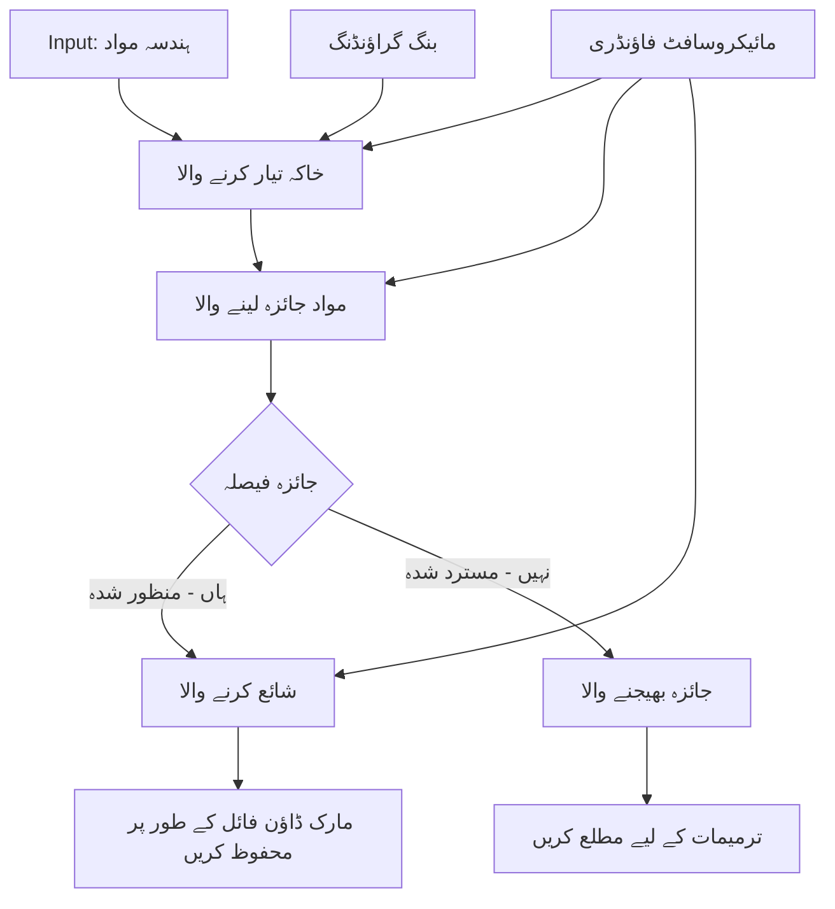

# 🔀 مائیکروسافٹ فاؤنڈری (.NET) کے ساتھ مشروط ایجنٹ ورک فلو

## 📋 ذہین فیصلہ سازی پر مبنی ورک فلو سبق

یہ نوٹ بک مائیکروسافٹ فاؤنڈری اور مائیکروسافٹ ایجنٹ فریم ورک برائے .NET کے استعمال سے **مشروط ورک فلو پیٹرنز** کی نمائش کرتا ہے۔ آپ سیکھیں گے کہ کیسے پیچیدہ، فیصلہ سازی پر مبنی ورک فلو تعمیر کیے جائیں جو AI تجزیہ، کاروباری قواعد، اور متحرک شرائط کی بنیاد پر ذہانت سے پراسیسنگ کی رہنمائی کرتے ہیں تاکہ انٹرپرائز درجے کی خودکاری حاصل کی جا سکے۔

## 🎯 سیکھنے کے مقاصد

### 🧠 **ذہین فیصلہ سازی کا فن تعمیر**
- **مشروط منطق کا نفاذ**: متعدد شاخوں والے پیچیدہ فیصلہ درخت بنائیں
- **AI سے چلنے والی رہنمائی**: مائیکروسافٹ فاؤنڈری ماڈلز کا استعمال کرکے ذہین رہنمائی کے فیصلے کریں
- **متحرک ورک فلو کی مطابقت**: رن ٹائم تجزیہ اور شرائط کی بنیاد پر ورک فلو کے عمل کو تبدیل کریں
- **انٹرپرائز قواعد کا انضمام**: کاروباری منطق اور تعمیل کی ضروریات کو ورک فلو میں شامل کریں

### 🔀 **جدید مشروط پیٹرنز**
- **کثیر معیاری فیصلہ سازی**: رہنمائی کے فیصلوں کے لیے متعدد عوامل کا جائزہ لیں
- **سیاق و سباق سے آگاہ پراسیسنگ**: ورک فلو سیاق و سباق اور تاریخ جمع کرنے کی بنیاد پر فیصلے کریں
- **متحرک ورک فلو میں تبدیلی**: حقیقی وقت کی شرائط کی بنیاد پر پراسیسنگ راستوں کو ڈائنامکلی ایڈجسٹ کریں
- **قواعد انجین کا انضمام**: پیچیدہ کاروباری قواعد کے انجن ورک فلو میں نافذ کریں

### 🏢 **انٹرپرائز مشروط ایپلیکیشنز**
- **دستاویز کی درجہ بندی اور رہنمائی**: دستاویزات کو خودکار طریقے سے درجہ بندی کریں اور مناسب ورک فلو کو بھیجیں
- **کسٹمر سروس ٹریاژ**: مہارت والی ٹیموں کو صارفین کی دریافتوں کی ذہین رہنمائی
- **تعمیل اور خطرے کی پراسیسنگ**: خطرے کے اندازے کی بنیاد پر مختلف تصدیقی اور جائزہ عمل استعمال کریں
- **کوالٹی اشورینس ورک فلو**: معیار کے میٹرکس کی بنیاد پر مواد کو مناسب جائزہ عمل سے گزاریں

## ⚙️ ضروریات اور سیٹ اپ

### 📦 **ضروری NuGet پیکجز**

مشروط ورک فلو پراسیسنگ کے لیے ایڈوانسڈ پیکجز:

```xml
<!-- Core AI Framework -->
<PackageReference Include="Microsoft.Extensions.AI" Version="9.9.0" />

<!-- Azure AI Agents with Persistent State -->
<PackageReference Include="Azure.AI.Agents.Persistent" Version="1.2.0-beta.5" />

<!-- Azure Identity and Utilities -->
<PackageReference Include="Azure.Identity" Version="1.15.0" />
<PackageReference Include="System.Linq.Async" Version="6.0.3" />
<PackageReference Include="DotNetEnv" Version="3.1.1" />

<!-- Local Workflow Framework References -->
<!-- Microsoft.Agents.Workflows.dll - Advanced workflow orchestration -->
<!-- Microsoft.Agents.AI.AzureAI.dll - Microsoft Foundry integration -->
<!-- Microsoft.Agents.AI.dll - Core agent abstractions -->
```

### 🔑 **مائیکروسافٹ فاؤنڈری کنفیگریشن**

**ضروری Azure وسائل:**
- مشروط پراسیسنگ ماڈلز کے ساتھ مائیکروسافٹ فاؤنڈری ورک اسپیس
- مناسب کمپیوٹ کوٹاز اور اجازتوں کے ساتھ Azure سبسکرپشن
- فیصلہ سازی اور مواد کے تجزیے کے لیے تعینات کردہ AI ماڈلز
- (اختیاری) گراؤنڈنگ صلاحیتوں کے لیے Bing سرچ API کنکشن

**ماحول کی ترتیبات (.env فائل):**
```env
# Microsoft Foundry Configuration
AZURE_AI_PROJECT_ENDPOINT=https://your-project.cognitiveservices.azure.com/
BING_CONNECTION_ID=your-bing-connection-id
```

**تصدیق کا سیٹ اپ:**
```csharp
// Azure CLI or Managed Identity authentication
using Azure.Identity;
var credential = new AzureCliCredential();

// Load environment configuration
DotNetEnv.Env.Load("../../../.env");
```

### 🏗️ **مشروط ورک فلو فن تعمیر**



**کلیدی اجزاء:**
- **ڈرافٹ ایکزیکیومنٹ**: AI ایجنٹ جو خاکوں سے ابتدائی مواد کے مسودات بناتا ہے
- **مواد جائزہ لینے والا ایگزیکیومنٹ**: AI ایجنٹ جو مسودے کے معیار اور تعمیل کا جائزہ لیتا ہے
- **مشروط رہنمائی**: فیصلہ سازی کی منطق جو جائزے کے نتائج کی بنیاد پر رہنمائی کرتی ہے
- **اشاعت/جائزہ راستے**: منظوری شدہ اور مسترد شدہ مواد کے لیے الگ پراسیسنگ راستے
- **اسٹیٹ مینجمنٹ**: پورے ورک فلو میں مواد اور جائزے کا سیاق و سباق برقرار رکھتا ہے

## 🎨 **مشروط ورک فلو ڈیزائن پیٹرنز**

### 📋 **کوالٹی گیٹس کے ساتھ مواد کی تیاری**
```
Outline → Draft Creation → Quality Review → {Approve: Publish | Reject: Revise}
```

### 🎯 **خطرے کی بنیاد پر دستاویز پراسیسنگ**
```
Document → Risk Assessment → {Low: Standard | High: Enhanced Review}
```

### 🔍 **ذہین کسٹمر سروس رہنمائی**
```
Customer Query → Analysis → {Simple: FAQ Bot | Complex: Human Agent}
```

### 💼 **تعمیل پر مبنی ورک فلو**
```
Content → Compliance Check → {Pass: Publish | Fail: Legal Review}
```

## 🏢 **انٹرپرائز مشروط فوائد**

### 🎯 **ذہین خودکاری**
- **سمارٹ فیصلہ سازی**: مواد کے تجزیہ اور سیاق و سباق کی بنیاد پر AI سے چلنے والے رہنمائی کے فیصلے
- **متحرک پراسیسنگ**: بدلتی ہوئی شرائط کے مطابق خودکار طور پر ایڈجسٹ ہونے والے ورک فلو
- **کاروباری قواعد کا نفاذ**: پیچیدہ کاروباری منطق اور پالیسیوں کا خودکار اطلاق
- **سیاق و سباق سے آگاہ رہنمائی**: مکمل ورک فلو کی تاریخ اور جمع شدہ سیاق و سباق کی بنیاد پر فیصلے

### 📈 **عملیاتی فضیلت**
- **وسائل کی مؤثر تقسیم**: کام کو سب سے مناسب ماہرین اور عمل کے لیے بھیجنا
- **دستی مداخلت میں کمی**: خودکار فیصلہ سازی انسانی رہنمائی کی ضرورت کو کم کرتی ہے
- **تیز تر مسئلہ حل کرنے کا وقت**: مناسب مہارت اور پراسیسنگ صلاحیتوں کو براہ راست رہنمائی
- **مسلسل اطلاق**: کاروباری قواعد اور فیصلہ کے معیار کا یکساں نفاذ

### 🛡️ **خطرے کا انتظام اور تعمیل**
- **خودکار خطرہ کا تخمینہ**: مواد اور صورتحال کے خطرے کی سطحوں کا AI سے چلنے والا جائزہ
- **تعمیل کا نفاذ**: ضروری قواعد و ضوابط کے عمل کے دوران خودکار رہنمائی
- **سیکیورٹی پروٹوکول کا اطلاق**: خطرے کے تخمینہ کی بنیاد پر بہتر حفاظتی اقدامات
- **آڈٹ ٹریل کا انتظام**: رہنمائی کے فیصلوں اور اسباب کی مکمل دستاویزات

### 📊 **تجزیات اور تسلسل بہتری**
- **فیصلہ سازی کے تجزیات**: رہنمائی کے فیصلوں کی مؤثریت اور درستگی کا جائزہ
- **پیٹرن کی شناخت**: وقت کے ساتھ رہنمائی کے فیصلوں میں رجحانات اور پیٹرنز کی نشاندہی
- **کامیابی کی بہتری**: فیصلہ کے معیار اور رہنمائی کی کارکردگی میں تسلسل کے ساتھ مزید ترقی
- **کاروباری انٹیلیجنس**: مواد کی خصوصیات اور پراسیسنگ کی ضروریات کی بصیرت

### 🔧 **تکنیکی فضیلت**
- **مسلسل اسٹیٹ مینجمنٹ**: ورک فلو کے نفاذ کے دوران پیچیدہ اسٹیٹ کو برقرار رکھنا
- **وسیع تر فن تعمیر**: زیادہ حجم کی مشروط پراسیسنگ کی ضروریات کو سنبھالنا
- **انضمامی صلاحیتیں**: موجودہ کاروباری نظاموں اور عمل کے ساتھ بغیر رکاوٹ انضمام
- **مانیٹرنگ اور مشاہدہ**: ورک فلو کی کارکردگی اور فیصلوں کی مکمل نگرانی

آئیے .NET کے ساتھ ذہین، فیصلہ سازی پر مبنی انٹرپرائز ورک فلو بنائیں! 🚀

## 💻 کوڈ چلانا

مکمل نفاذ `04.dotnet-agent-framework-workflow-aifoundry-condition.cs` میں دستیاب ہے۔ یہ **کوالٹی گیٹس کے ساتھ مواد کی تیاری کا ورک فلو** دکھاتا ہے:

### 🏗️ **ورک فلو فن تعمیر**

```
Content Outline → Draft Creation → Quality Review → Conditional Routing:
                                                      ├─ Approved (>200 words) → Publish
                                                      └─ Rejected (<200 words) → Review Notification
```

**ورک فلو میں ایجنٹس:**
1. **ایوانجالسٹ ایجنٹ**: خاکوں سے سبق کے مسودات تیار کرتا ہے جس کے لیے Bing گراؤنڈنگ استعمال ہوتی ہے
2. **مواد کا جائزہ لینے والا ایجنٹ**: مسودے کے معیار (کل الفاظ، مکمل ہونے) کا جائزہ لیتا ہے
3. **پبلشر ایجنٹ**: منظور شدہ مواد کو ٹائم اسٹیمپڈ Markdown فائلوں کے طور پر محفوظ کرتا ہے

**کسٹم ایگزیکیومنٹس:**
1. **DraftExecutor**: مسودہ تخلیق کی ہدایات دیتا ہے
2. **ContentReviewExecutor**: معیار کی جانچ کرتا ہے
3. **PublishExecutor**: منظور شدہ مواد کی اشاعت کا انتظام کرتا ہے
4. **SendReviewExecutor**: مسترد شدہ مواد کی اطلاع جات کا انتظام کرتا ہے

### 🚀 مثال چلانا

**پیشگی ضروریات:**
- مائیکروسافٹ فاؤنڈری ورک اسپیس کی ترتیب
- Azure CLI تصدیق (`az login`)
- (اختیاری) Bing سرچ کنکشن برائے گراؤنڈنگ

```bash
# اسکرپٹ کو قابلِ عمل بنائیں (یونیکس/لینکس/میکوس)
chmod +x 04.dotnet-agent-framework-workflow-aifoundry-condition.cs

# مشروط ورک فلو چلائیں
./04.dotnet-agent-framework-workflow-aifoundry-condition.cs
```

یا ونڈوز پر:
```powershell
dotnet run 04.dotnet-agent-framework-workflow-aifoundry-condition.cs
```

### 📝 متوقع نتیجہ

ورک فلو یہ کرے گا:
1. **ایجنٹس تیار کرنا**: تین مخصوص مائیکروسافٹ فاؤنڈری ایجنٹس کو شروع کرے گا
2. **مسودہ تیار کرنا**: ایوانجالسٹ ایجنٹ خاکے سے سبق کا مسودہ بنائے گا
3. **مواد کا جائزہ لینا**: مواد کا جائزہ لینے والا ایجنٹ مسودے کے معیار کی جانچ کرے گا
4. **مشروط رہنمائی**:
   - **اگر منظور شدہ (>200 الفاظ)**: اشاعت کرنے والا ایگزیکیومنٹ Markdown فائل کے طور پر محفوظ کرے گا
   - **اگر مسترد شدہ (<200 الفاظ)**: جائزہ بھیجنے کی اطلاع دے گا
5. **نتائج دکھانا**: حتمی ورک فلو کا نتیجہ ظاہر کرے گا

### 🔧 تخصیص کے اختیارات

**جائزہ معیار میں ترمیم:**
```csharp
const string ContentReviewerInstructions = @"
You are a content reviewer...
1. Check if content is more than 500 words (instead of 200)
2. Verify technical accuracy
3. Ensure proper formatting
...";
```

**مزید مشروط راستے شامل کریں:**
```csharp
var workflow = new WorkflowBuilder(draftExecutor)
    .AddEdge(draftExecutor, contentReviewerExecutor)
    .AddEdge(contentReviewerExecutor, publishExecutor, condition: GetCondition("Excellent"))
    .AddEdge(contentReviewerExecutor, editExecutor, condition: GetCondition("Good"))
    .AddEdge(contentReviewerExecutor, sendReviewerExecutor, condition: GetCondition("Poor"))
    .Build();
```

**مواد کی ضروریات تبدیل کریں:**
```csharp
string OUTLINE_Content = @"
# Your Custom Topic
## Section 1
https://your-reference-url
## Section 2
...
";
```

### 🎯 حقیقی دنیا کی ایپلیکیشنز

یہ مشروط ورک فلو پیٹرن مندرجہ ذیل کے لیے مثالی ہے:
- **مواد کا انتظام کرنے والے نظام**: کوالٹی گیٹس کے ساتھ خودکار اداری ورک فلو
- **دستاویز پراسیسنگ**: درجہ بندی اور تعمیل کی بنیاد پر دستاویزات کی رہنمائی
- **کسٹمر سپورٹ**: پیچیدگی اور فوری ضرورت کی بنیاد پر ذہین ٹکٹ کی رہنمائی
- **قانونی جائزہ**: خطرے کے تخمینہ اور قیمت کی بنیاد پر معاہدوں کی رہنمائی
- **ایچ آر کے عمل**: درخواستوں کو مناسب اسکریننگ ورک فلو کے ذریعے بھیجنا

### 🔍 مشروط منطق کو سمجھنا

**کنڈیشن فنکشن:**
```csharp
public Func<object?, bool> GetCondition(string expectedResult) =>
    reviewResult => reviewResult is ReviewResult review && review.Result == expectedResult;
```

یہ فنکشن ایک پریڈیکیٹ بناتا ہے جو:
1. چیک کرتا ہے کہ نتیجہ `ReviewResult` قسم کا ہے
2. `Result` پراپرٹی کو متوقع قدر سے موازنہ کرتا ہے
3. راستہ منتخب کرنے کے لیے صحیح/غلط واپس کرتا ہے

**ورک فلو کے کنارے مشروط ہیں:**
```csharp
.AddEdge(contentReviewerExecutor, publishExecutor, condition: GetCondition("Yes"))
.AddEdge(contentReviewerExecutor, sendReviewerExecutor, condition: GetCondition("No"))
```

### 📊 جدید خصوصیات

**JSON سکیمہ کی تصدیق:**
ورک فلو جوابی ساخت کی تصدیق کے لیے JSON سکیمے استعمال کرتا ہے:

```csharp
// Define response structure
public class ReviewResult
{
    [JsonPropertyName("review_result")]
    public string Result { get; set; } = string.Empty;
    
    [JsonPropertyName("reason")]
    public string Reason { get; set; } = string.Empty;
    
    [JsonPropertyName("draft_content")]
    public string DraftContent { get; set; } = string.Empty;
}

// Apply to agent
ResponseFormat = ChatResponseFormat.ForJsonSchema(
    AIJsonUtilities.CreateJsonSchema(typeof(ReviewResult)), 
    "ReviewResult", 
    "Review Result From DraftContent"
)
```

**Bing گراؤنڈنگ انٹیگریشن:**
ایوانجالسٹ ایجنٹ حقیقی وقت کی معلومات تک رسائی کے لیے Bing گراؤنڈنگ استعمال کرتا ہے:

```csharp
var bingGroundingConfig = new BingGroundingSearchConfiguration(bing_conn_id);
BingGroundingToolDefinition bingGroundingTool = new(
    new BingGroundingSearchToolParameters([bingGroundingConfig])
);
```

یہ ایجنٹ کو خاکے میں URLs کی پیروی اور موجودہ معلومات نکالنے کی اجازت دیتا ہے۔

### 🛡️ غلطی سنبھالنا

ورک فلو مسترد شدہ مواد کے لیے مضبوط غلطی ہینڈلنگ شامل کرتا ہے:
- جائزہ ناکام ہونے پر متبادل راستہ شروع ہوتا ہے
- اطلاع جات صاف مسترد ہونے کی وجوہات فراہم کرتے ہیں
- مواد کا تحفظ تشخیص کے لیے برقرار رکھا جاتا ہے

### 🔄 ورک فلو کی توسیع

**ریویژن لوپ شامل کریں:**
ایک فیڈبیک لوپ بنائیں جو خود بخود مواد کو دوبارہ مسودہ بنائے:

```csharp
.AddEdge(contentReviewerExecutor, publishExecutor, condition: GetCondition("Yes"))
.AddEdge(contentReviewerExecutor, draftExecutor, condition: GetCondition("No")) // Loop back
```

**کثیر سطحی جائزہ نافذ کریں:**
مختلف معیار کے ساتھ متعدد جائزہ مراحل شامل کریں:

```csharp
.AddEdge(draftExecutor, technicalReviewer)
.AddEdge(technicalReviewer, editorialReviewer, condition: GetCondition("TechPass"))
.AddEdge(editorialReviewer, publishExecutor, condition: GetCondition("EditPass"))
```

یہ مشروط ورک فلو پیٹرن پیچیدہ، ذہین انٹرپرائز آٹومیشن سسٹمز کی تعمیر کے لیے بنیاد فراہم کرتا ہے! 🚀

---

<!-- CO-OP TRANSLATOR DISCLAIMER START -->
**ڈس کلیمر**:
یہ دستاویز AI ترجمہ سروس [Co-op Translator](https://github.com/Azure/co-op-translator) کے ذریعے ترجمہ کی گئی ہے۔ جبکہ ہم درستگی کے لیے کوشاں ہیں، براہ کرم اس بات سے آگاہ رہیں کہ خودکار ترجمے میں غلطیاں یا عدم درستیاں ہو سکتی ہیں۔ اصل دستاویز اپنے مادری زبان میں مستند ماخذ سمجھی جائے گی۔ حساس معلومات کے لیے پیشہ ور انسانی ترجمہ کی سفارش کی جاتی ہے۔ اس ترجمے کے استعمال سے پیدا ہونے والی کسی بھی غلط فہمی یا غلط تشریح کی ذمہ داری ہم قبول نہیں کرتے۔
<!-- CO-OP TRANSLATOR DISCLAIMER END -->