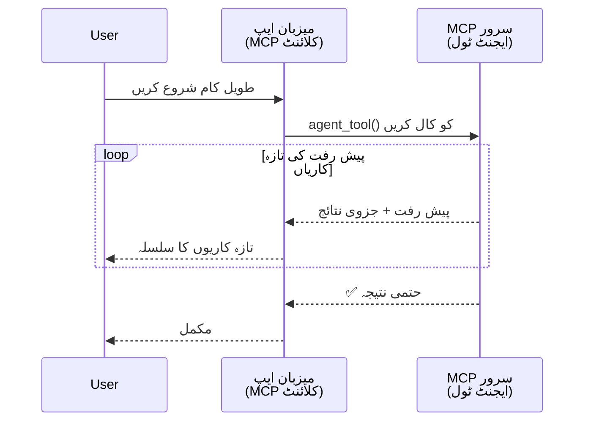
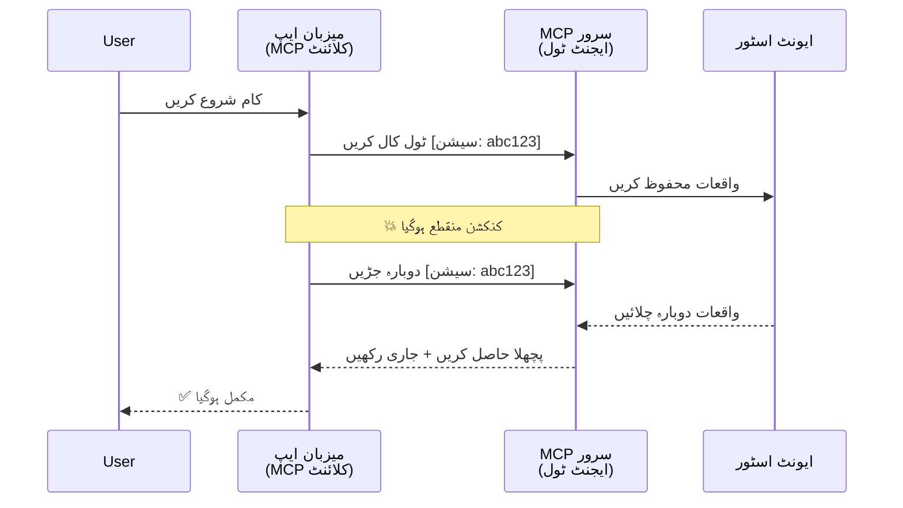
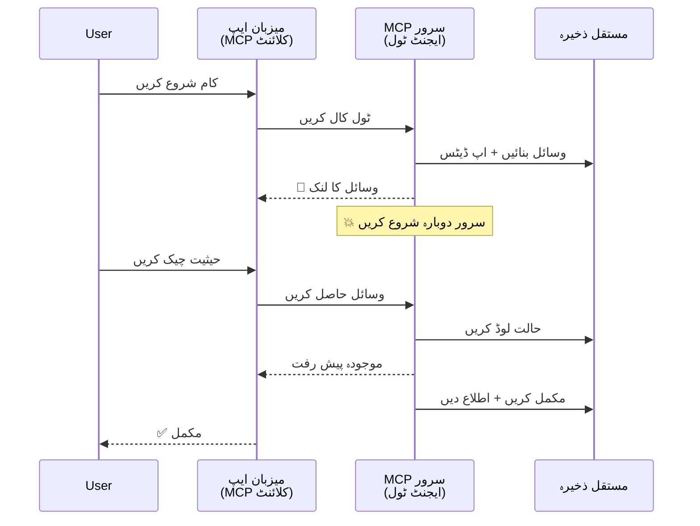
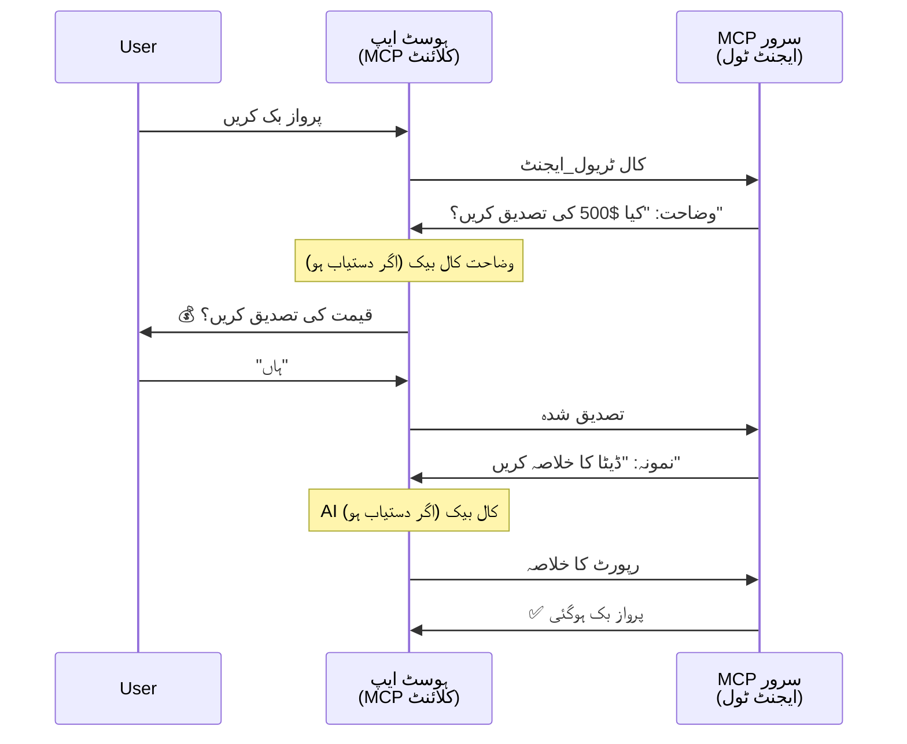
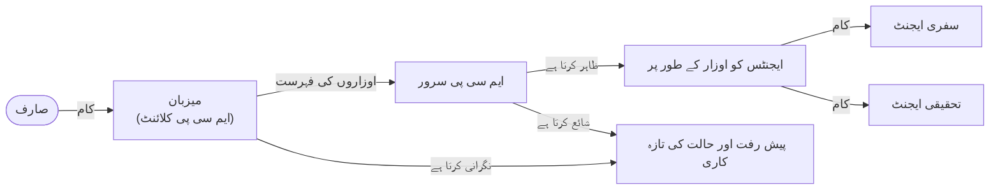

# MCP کے ساتھ ایجنٹ سے ایجنٹ رابطہ نظام کی تعمیر

> خلاصہ - کیا آپ MCP پر Agent2Agent مواصلات بنا سکتے ہیں؟ جی ہاں!

MCP نے "LLMs کو سیاق و سباق فراہم کرنے" کے اصل مقصد سے بہت آگے بڑھ کر ترقی کی ہے۔ حالیہ بہتریوں میں شامل ہیں [دوبارہ شروع ہونے والے سٹریمز](https://modelcontextprotocol.io/docs/concepts/transports#resumability-and-redelivery)، [elicitation](https://modelcontextprotocol.io/specification/2025-06-18/client/elicitation)، [sampling](https://modelcontextprotocol.io/specification/2025-06-18/client/sampling)، اور اطلاعات ([progress](https://modelcontextprotocol.io/specification/2025-06-18/basic/utilities/progress) اور [resources](https://modelcontextprotocol.io/specification/2025-06-18/schema#resourceupdatednotification))، MCP اب پیچیدہ ایجنٹ سے ایجنٹ رابطہ نظام کی تعمیر کے لیے ایک مضبوط بنیاد فراہم کرتا ہے۔

## ایجنٹ/ٹول کے حوالے سے غلط فہمی

جیسے جیسے مزید ڈویلپرز ایجنٹک رویوں والے ٹولز کی تلاش کرتے ہیں (جو طویل عرصے تک چلتے ہیں، دورانِ عمل اضافی ان پٹ کی ضرورت ہو سکتی ہے، وغیرہ)، ایک عام غلط فہمی یہ ہے کہ MCP مناسب نہیں ہے کیونکہ اس کے ابتدائی مثالوں کے ٹولز بنیادی طور پر سیدھے سادے درخواست-جواب کے نمونوں پر مرکوز تھے۔

یہ تاثر پرانا ہو چکا ہے۔ MCP وضاحت کو حالیہ مہینوں میں ان صلاحیتوں کے ساتھ نمایاں طور پر بڑھایا گیا ہے جو طویل مدتی ایجنٹک رویے کی تعمیر میں فرق کو ختم کرتی ہیں:

- **اسٹریمینگ اور جزوی نتائج**: عملدرآمد کے دوران حقیقی وقت کی پیش رفت کی تازہ کاری
- **دوبارہ شروع ہونے کی صلاحیت**: کلائنٹس منقطع ہونے کے بعد دوبارہ جڑ سکتے ہیں اور جاری رکھ سکتے ہیں
- **دوامی**: نتائج سرور کی ری اسٹارٹ سے بچ جاتے ہیں (مثلاً، ریسورس لنکس کے ذریعے)
- **کثیر گردش**: دورانِ عمل ان پٹ کے لیے جوابی اور سیمپلنگ کے ذریعے انٹرایکٹو ان پٹ

یہ خصوصیات مل کر پیچیدہ ایجنٹک اور کثیر ایجنٹ اپلیکیشنز کو فعال بنانے کے لیے مرتب کی جا سکتی ہیں، سب MCP پروٹوکول پر تعینات۔

حوالہ کے طور پر، ہم ایک ایجنٹ کو "ٹول" کے طور پر سمجھیں گے جو MCP سرور پر دستیاب ہے۔ اس کا مطلب ہے کہ ایک بنیادی ایپلیکیشن موجود ہے جو MCP کلائنٹ کو نافذ کرتی ہے جو MCP سرور کے ساتھ سیشن قائم کرتی ہے اور ایجنٹ کو کال کر سکتی ہے۔

## کیا چیز ایک MCP ٹول کو "ایجنٹک" بناتی ہے؟

نفاذ میں جانے سے پہلے، آئیے طویل عرصے تک چلنے والے ایجنٹس کی حمایت کے لیے درکار بنیادی ڈھانچے کی صلاحیتوں کو واضح کریں۔

> ہم ایجنٹ کو ایسی ہستی کے طور پر تعریف کریں گے جو خود مختار طریقے سے طویل مدت تک کام کر سکتی ہے، قابلِ پیچیدہ کاموں کو سنبھالنے کی صلاحیت رکھتی ہے جن میں متعدد بات چیت یا حقیقی وقت کی رائے کی بنیاد پر ایڈجسٹمنٹ شامل ہو سکتی ہیں۔

### 1. اسٹریمینگ اور جزوی نتائج

روایتی درخواست-جواب کے نمونے طویل عرصے تک چلنے والے کاموں کے لیے کام نہیں کرتے۔ ایجنٹس کو فراہم کرنا ضروری ہے:

- حقیقی وقت کی پیش رفت کی تازہ کاری
- درمیانی نتائج

**MCP کی حمایت**: ریسورس اپ ڈیٹ اطلاعات جزوی نتائج کو اسٹریم کرنے کے قابل بناتی ہیں، حالانکہ اس کے لیے JSON-RPC کے 1:1 درخواست/جواب کے ماڈل سے ٹکراؤ سے بچنے کے لیے محتاط ڈیزائن کی ضرورت ہے۔

| خصوصیت                          | استعمال کی مثال                                                                                                                                                                      | MCP کی حمایت                                                                                 |
| ------------------------------- | ---------------------------------------------------------------------------------------------------------------------------------------------------------------------------------- | -------------------------------------------------------------------------------------------- |
| حقیقی وقت کی پیش رفت کی تازہ کاری | صارف کوڈبیس مائیگریشن کا کام درخواست کرتا ہے۔ ایجنٹ پیش رفت کو اسٹریم کرتا ہے: "10% - انحصارات کا تجزیہ... 25% - ٹائپ اسکرپٹ فائلز کی تبدیلی... 50% - درآمدات کی تازہ کاری..."         | ✅ پیش رفت کی اطلاعات                                                                         |
| جزوی نتائج                     | "کتاب تیار کریں" کا کام جزوی نتائج اسٹریم کرتا ہے، مثلاً 1) کہانی کا خاکہ، 2) ابواب کی فہرست، 3) ہر باب مکمل ہوتے ہی۔ ہوسٹ کسی بھی مرحلے پر معائنہ، منسوخی یا رہنمائی کر سکتا ہے۔ | ✅ اطلاعات کو جزوی نتائج شامل کرنے کے لیے "توسیع" کیا جا سکتا ہے، ملاحظہ کریں PR 383، 776 کے تجاویز |

<div align="center" style="font-style: italic; font-size: 0.95em; margin-bottom: 0.5em;">
<strong>شکل 1:</strong> یہ خاکہ دکھاتا ہے کہ کیسے ایک MCP ایجنٹ طویل عرصے والے کام کے دوران ہوسٹ ایپلیکیشن کو حقیقی وقت کی پیش رفت کی تازہ کاری اور جزوی نتائج اسٹریم کرتا ہے، تاکہ صارف عمل کو حقیقی وقت میں مانیٹر کر سکے۔
</div>



### 2. دوبارہ شروع ہونے کی صلاحیت

ایجنٹس کو نیٹ ورک کی رکاوٹوں کو ہموار طریقے سے سنبھالنا چاہیے:

- منقطع ہونے کے بعد دوبارہ جڑنا (کلائنٹ)
- جہاں سے رکے تھے، وہاں سے جاری رکھنا (پیغام کی دوبارہ فراہمی)

**MCP کی حمایت**: MCP StreamableHTTP ٹرانسپورٹ آج سیشن ریزیومپشن اور پیغام کی دوبارہ فراہمی کی حمایت کرتا ہے سیشن IDs اور آخری ایونٹ IDs کے ساتھ۔ اہم بات یہ ہے کہ سرور کو ایک EventStore نافذ کرنا ہوگا جو کلائنٹ کی دوبارہ جڑنے پر ایونٹس کی ری پلے کی اجازت دیتا ہو۔  
نوٹ کریں کہ ایک کمیونٹی تجویز (PR #975) ہے جو ٹرانسپورٹ-آگناسٹک دوبارہ شروع ہونے والے سٹریمز کی تلاش کرتی ہے۔

| خصوصیت   | استعمال کی مثال                                                                                                                                    | MCP کی حمایت                                                       |
| --------- | ------------------------------------------------------------------------------------------------------------------------------------------------- | ----------------------------------------------------------------- |
| دوبارہ شروع کرنے کی صلاحیت | کلائنٹ طویل عرصے کے کام کے دوران منقطع ہو جاتا ہے۔ دوبارہ جڑنے پر، سیشن ایسا ہی جاری رہتا ہے جس میں چھوٹے ہوئے ایونٹس ری پلے کیے جاتے ہیں، کام بغیر رکاوٹ جاری رہتا ہے۔ | ✅ StreamableHTTP ٹرانسپورٹ، سیشن IDs، ایونٹ ری پلے، اور EventStore |

<div align="center" style="font-style: italic; font-size: 0.95em; margin-bottom: 0.5em;">
<strong>شکل 2:</strong> یہ خاکہ دکھاتا ہے کہ کیسے MCP کا StreamableHTTP ٹرانسپورٹ اور ایونٹ اسٹور سیشن کی روانی سے از سر نو شروع ہونے کی اجازت دیتا ہے: اگر کلائنٹ منقطع ہو جائے، تو وہ دوبارہ جڑ سکتا ہے اور چھوٹے ہوئے ایونٹس کو ری پلے کر سکتا ہے، بغیر پیش رفت کے نقصان کے کام جاری رکھ سکتا ہے۔
</div>



### 3. دوامی

طویل عرصے تک چلنے والے ایجنٹس کو مستحکم حالت کی ضرورت ہوتی ہے:

- نتائج سرور کی ری اسٹارٹ سے بچ جاتے ہیں
- حیثیت کو آؤٹ آف بینڈ بازیافت کیا جا سکتا ہے
- سیشنز میں پیش رفت کی نگرانی

**MCP کی حمایت**: MCP اب ٹول کالز کے لیے Resource link ریٹرن ٹائپ کی حمایت کرتا ہے۔ آج کل ایک ممکنہ نمونہ یہ ہے کہ ایسا ٹول ڈیزائن کیا جائے جو ایک ریسورس بنائے اور فوری طور پر ریسورس لنک واپس کرے۔ ٹول پس منظر میں کام کو جاری رکھ سکتا ہے اور ریسورس کو اپ ڈیٹ کر سکتا ہے۔ بدلے میں، کلائنٹ اس ریسورس کی حالت کی پولنگ کر سکتا ہے تاکہ جزوی یا مکمل نتائج حاصل کرے (جو سرور فراہم کردہ ریسورس اپ ڈیٹس پر مبنی ہے) یا اپ ڈیٹ اطلاعات کے لیے ریسورس کی سبسکرپشن لے سکتا ہے۔

یہاں ایک محدودیت یہ ہے کہ ریسورسز کی پولنگ یا اپ ڈیٹس کے لیے سبسکرائب کرنا وسائل خرچ کر سکتا ہے، جس کے اسکیل پر اثرات ہو سکتے ہیں۔ ایک کھلی کمیونٹی تجویز (#992 بشمول) موجود ہے جو ممکنہ ویبہکس یا ٹریگرز شامل کرنے کی تلاش کر رہی ہے تاکہ سرور کلائنٹ/ہوسٹ ایپلیکیشن کو اپ ڈیٹس کی اطلاع دے سکے۔

| خصوصیت     | استعمال کی مثال                                                                                                                                                      | MCP کی حمایت                                                          |
| ----------- | ----------------------------------------------------------------------------------------------------------------------------------------------------------------- | -------------------------------------------------------------------- |
| دوامی       | ڈیٹا مائیگریشن کے کام کے دوران سرور کریش ہو جاتا ہے۔ نتائج اور پیش رفت ری اسٹارٹ کے بعد زندہ رہتی ہے، کلائنٹ حیثیت کو چیک کر سکتا ہے اور مستقل ریسورس سے جاری رکھ سکتا ہے۔ | ✅ ریسورس لنکس مستقل ذخیرہ اندوزی اور حیثیت کی اطلاعات کے ساتھ            |

آج کل ایک عام نمونہ یہ ہے کہ ایسا ٹول ڈیزائن کیا جائے جو ایک ریسورس بنائے اور فوری طور پر ریسورس لنک واپس کرے۔ ٹول پس منظر میں کام کو جاری رکھ سکتا ہے، ریسورس کی اطلاعات فراہم کر سکتا ہے جو پیش رفت کی تازہ کاری کے طور پر کام کرتی ہیں یا جزوی نتائج شامل کرتی ہیں، اور ضرورت کے مطابق ریسورس کے مواد کو اپ ڈیٹ کر سکتا ہے۔

<div align="center" style="font-style: italic; font-size: 0.95em; margin-bottom: 0.5em;">
<strong>شکل 3:</strong> یہ خاکہ دکھاتا ہے کہ MCP ایجنٹس کس طرح طویل عرصے تک چلنے والے کاموں کو سرور کی ری اسٹارٹ کے باوجود زندہ رکھنے کے لیے مستقل ریسورسز اور حیثیت کی اطلاعات استعمال کرتے ہیں، جس سے کلائنٹس پیش رفت چیک کر سکتے ہیں اور ناکامیوں کے بعد بھی نتائج حاصل کر سکتے ہیں۔
</div>



### 4. کثیر گردش بات چیت

ایجنٹس کو اکثر دورانِ عمل اضافی ان پٹ کی ضرورت ہوتی ہے:

- انسانی وضاحت یا منظوری
- پیچیدہ فیصلوں کے لیے AI کی معاونت
- متحرک پیرا میٹر ایڈجسٹمنٹ

**MCP کی حمایت**: سیمپلنگ (AI ان پٹ کے لیے) اور ایلسیٹیشن (انسانی ان پٹ کے لیے) کے ذریعے مکمل حمایت یافتہ۔

| خصوصیت                | استعمال کی مثال                                                                                                                                                             | MCP کی حمایت                                             |
| ---------------------- | -------------------------------------------------------------------------------------------------------------------------------------------------------------------------- | --------------------------------------------------------- |
| کثیر گردش بات چیت       | سفری بکنگ ایجنٹ صارف سے قیمت کی تصدیق مانگتا ہے، پھر بکنگ مکمل کرنے سے پہلے AI سے سفر کے اعداد و شمار کا خلاصہ طلب کرتا ہے۔                                                 | ✅ انسانی ان پٹ کے لیے elicitation، AI ان پٹ کے لیے sampling |

<div align="center" style="font-style: italic; font-size: 0.95em; margin-bottom: 0.5em;">
<strong>شکل 4:</strong> یہ خاکہ دکھاتا ہے کہ MCP ایجنٹ کس طرح دورانِ عمل انسانی ان پٹ طلب کر سکتے ہیں یا AI معاونت کی درخواست کر سکتے ہیں، پیچیدہ، کثیر گردش ورک فلو جیسے تصدیقات اور متحرک فیصلہ سازی کی حمایت کرتے ہیں۔
</div>



## MCP پر طویل عرصے کے ایجنٹس کا نفاذ - کوڈ کا جائزہ

اس مضمون کے حصے کے طور پر، ہم ایک [کوڈ ریپوزیٹری](https://github.com/victordibia/ai-tutorials/tree/main/MCP%20Agents) فراہم کرتے ہیں جس میں MCP Python SDK کے ساتھ StreamableHTTP ٹرانسپورٹ استعمال کرتے ہوئے طویل عرصے چلنے والے ایجنٹس کا مکمل نفاذ شامل ہے جو سیشن ریزیومپشن اور پیغام کی دوبارہ فراہمی کی صلاحیت رکھتا ہے۔ نفاذ دکھاتا ہے کہ کیسے MCP صلاحیتوں کو مرکب کیا جا سکتا ہے تاکہ ماہر ایجنٹ جیسی حرکات ممکن ہوں۔

خاص طور پر، ہم دو بنیادی ایجنٹ ٹولز کے ساتھ ایک سرور نافذ کرتے ہیں:

- **Travel Agent** - ایلسیٹیشن کے ذریعے قیمت کی تصدیق کے ساتھ سفر کی بکنگ کی خدمات کا مظاہرہ کرتا ہے
- **Research Agent** - AI کی معاونت سے سیمپلنگ کے ذریعے تحقیقی کام انجام دیتا ہے

دونوں ایجنٹس حقیقی وقت کی پیش رفت کی تازہ کاری، انٹرایکٹو تصدیقات، اور مکمل سیشن ریزیومپشن صلاحیتوں کا مظاہرہ کرتے ہیں۔

### اہم نفاذ کے تصورات

درج ذیل سیکشنز ہر صلاحیت کے لیے سرور-سائیڈ ایجنٹ نفاذ اور کلائنٹ-سائیڈ ہوسٹ ہینڈلنگ دکھاتے ہیں:

#### اسٹریمینگ اور پیش رفت کی تازہ کاری - حقیقی وقت کی ٹاسک حیثیت

اسٹریمینگ ایجنٹس کو طویل عرصے تک جاری رہنے والے کاموں کے دوران حقیقی وقت کی پیش رفت کی تازہ کاری فراہم کرنے کے قابل بناتا ہے، صارفین کو کام کی حیثیت اور درمیانی نتائج کے بارے میں مطلع رکھتا ہے۔

**سرور نفاذ (ایجنٹ پیش رفت اطلاعات بھیجتا ہے):**

```python
# ٹریول ایجنٹ جو پروگریس اپڈیٹس بھیج رہا ہے - server/server.py سے
for i, step in enumerate(steps):
    await ctx.session.send_progress_notification(
        progress_token=ctx.request_id,
        progress=i * 25,
        total=100,
        message=step,
        related_request_id=str(ctx.request_id)
    )
    await anyio.sleep(2)  # کام کی تقلید کریں

# متبادل: تفصیلی مرحلہ وار اپڈیٹس کے لیے پیغامات لاگ کریں
await ctx.session.send_log_message(
    level="info",
    data=f"Processing step {current_step}/{steps} ({progress_percent}%)",
    logger="long_running_agent",
    related_request_id=ctx.request_id,
)
```

**کلائنٹ نفاذ (ہوسٹ پیش رفت کی تازہ کاری وصول کرتا ہے):**

```python
# کلائنٹ/کلائنٹ.py سے - کلائنٹ جو حقیقی وقت کی اطلاعات کو سنبھالتا ہے
async def message_handler(message) -> None:
    if isinstance(message, types.ServerNotification):
        if isinstance(message.root, types.LoggingMessageNotification):
            console.print(f"📡 [dim]{message.root.params.data}[/dim]")
        elif isinstance(message.root, types.ProgressNotification):
            progress = message.root.params
            console.print(f"🔄 [yellow]{progress.message} ({progress.progress}/{progress.total})[/yellow]")

# سیشن بناتے وقت میسج ہینڈلر کو رجسٹر کریں
async with ClientSession(
    read_stream, write_stream,
    message_handler=message_handler
) as session:
```

#### ایلسیٹیشن - صارف ان پٹ کی درخواست

ایلسیٹیشن ایجنٹس کو دورانِ عمل صارف ان پٹ طلب کرنے کے قابل بناتی ہے۔ یہ تصدیقات، وضاحتیں، یا منظوریوں کے لیے ضروری ہے۔

**سرور نفاذ (ایجنٹ تصدیق طلب کرتا ہے):**

```python
# ایجنٹ سفر قیمت کی تصدیق کی درخواست کر رہا ہے - server/server.py سے
elicit_result = await ctx.session.elicit(
    message=f"Please confirm the estimated price of $1200 for your trip to {destination}",
    requestedSchema=PriceConfirmationSchema.model_json_schema(),
    related_request_id=ctx.request_id,
)

if elicit_result and elicit_result.action == "accept":
    # بکنگ جاری رکھیں
    logger.info(f"User confirmed price: {elicit_result.content}")
elif elicit_result and elicit_result.action == "decline":
    # بکنگ منسوخ کریں
    booking_cancelled = True
```

**کلائنٹ نفاذ (ہوسٹ ایلسیٹیشن کال بیک فراہم کرتا ہے):**

```python
# کلائنٹ/کلائنٹ.py سے - حرجی درخواستوں کو سنبھالنا
async def elicitation_callback(context, params):
    console.print(f"💬 Server is asking for confirmation:")
    console.print(f"   {params.message}")

    response = console.input("Do you accept? (y/n): ").strip().lower()

    if response in ['y', 'yes']:
        return types.ElicitResult(
            action="accept",
            content={"confirm": True, "notes": "Confirmed by user"}
        )
    else:
        return types.ElicitResult(
            action="decline",
            content={"confirm": False, "notes": "Declined by user"}
        )

# سیشن بناتے وقت کال بیک رجسٹر کریں
async with ClientSession(
    read_stream, write_stream,
    elicitation_callback=elicitation_callback
) as session:
```

#### سیمپلنگ - AI معاونت کی درخواست

سیمپلنگ ایجنٹس کو کام کے دوران پیچیدہ فیصلوں یا مواد کی تیاری کے لیے LLM معاونت طلب کرنے کی اجازت دیتی ہے۔ یہ ہائبرڈ انسانی-AI ورک فلو کو فعال بناتی ہے۔

**سرور نفاذ (ایجنٹ AI معاونت طلب کرتا ہے):**

```python
# سروَر/سروَر.py سے - تحقیقی ایجنٹ AI خلاصہ کی درخواست کر رہا ہے
sampling_result = await ctx.session.create_message(
    messages=[
        SamplingMessage(
            role="user",
            content=TextContent(type="text", text=f"Please summarize the key findings for research on: {topic}")
        )
    ],
    max_tokens=100,
    related_request_id=ctx.request_id,
)

if sampling_result and sampling_result.content:
    if sampling_result.content.type == "text":
        sampling_summary = sampling_result.content.text
        logger.info(f"Received sampling summary: {sampling_summary}")
```

**کلائنٹ نفاذ (ہوسٹ سیمپلنگ کال بیک فراہم کرتا ہے):**

```python
# کلائنٹ/کلائنٹ.py سے - سیمپلنگ کی درخواستوں کو ہینڈل کرنا
async def sampling_callback(context, params):
    message_text = params.messages[0].content.text if params.messages else 'No message'
    console.print(f"🧠 Server requested sampling: {message_text}")

    # ایک حقیقی ایپلیکیشن میں، یہ LLM API کو کال کر سکتا ہے
    # ڈیمو کے مقاصد کے لیے، ہم ایک جعلی جواب فراہم کرتے ہیں
    mock_response = "Based on current research, MCP has evolved significantly..."

    return types.CreateMessageResult(
        role="assistant",
        content=types.TextContent(type="text", text=mock_response),
        model="interactive-client",
        stopReason="endTurn"
    )

# سیشن بناتے وقت کال بیک کو رجسٹر کریں
async with ClientSession(
    read_stream, write_stream,
    sampling_callback=sampling_callback,
    elicitation_callback=elicitation_callback
) as session:
```

#### دوبارہ شروع ہونے کی صلاحیت - منقطع ہونے کے بعد سیشن کی تسلسل

دوبارہ شروع ہونے کی صلاحیت اس بات کو یقینی بناتی ہے کہ طویل عرصے تک چلنے والے ایجنٹ کے کام کلائنٹ کی منقطع ہونے کی صورت میں زندہ رہیں اور دوبارہ جڑنے پر بغیر رکاوٹ جاری رہیں۔ یہ ایونٹ اسٹورز اور ریزیومپشن ٹوکنز کے ذریعے نافذ کی جاتی ہے۔

**ایونٹ اسٹور نفاذ (سرور سیشن کی حالت رکھتا ہے):**

```python
# سرور/event_store.py سے - سادہ ان میموری ایونٹ اسٹور
class SimpleEventStore(EventStore):
    def __init__(self):
        self._events: list[tuple[StreamId, EventId, JSONRPCMessage]] = []
        self._event_id_counter = 0

    async def store_event(self, stream_id: StreamId, message: JSONRPCMessage) -> EventId:
        """Store an event and return its ID."""
        self._event_id_counter += 1
        event_id = str(self._event_id_counter)
        self._events.append((stream_id, event_id, message))
        return event_id

    async def replay_events_after(self, last_event_id: EventId, send_callback: EventCallback) -> StreamId | None:
        """Replay events after the specified ID for resumption."""
        # آخری معلوم ایونٹ کے بعد کی ایونٹس تلاش کریں اور انہیں دوبارہ چلائیں
        for _, event_id, message in self._events[start_index:]:
            await send_callback(EventMessage(message, event_id))

# سرور/server.py سے - ایونٹ اسٹور کو سیشن مینیجر کو پاس کرنا
def create_server_app(event_store: Optional[EventStore] = None) -> Starlette:
    server = ResumableServer()

    # دوبارہ شروع کرنے کے لیے ایونٹ اسٹور کے ساتھ سیشن مینیجر بنائیں
    session_manager = StreamableHTTPSessionManager(
        app=server,
        event_store=event_store,  # ایونٹ اسٹور سیشن ریسمپشن کو فعال کرتا ہے
        json_response=False,
        security_settings=security_settings,
    )

    return Starlette(routes=[Mount("/mcp", app=session_manager.handle_request)])

# استعمال: ایونٹ اسٹور کے ساتھ انیشیالائز کریں
event_store = SimpleEventStore()
app = create_server_app(event_store)
```

**ریزیمشن ٹوکن کے ساتھ کلائنٹ میٹا ڈیٹا (کلائنٹ محفوظ شدہ ریاست سے دوبارہ جڑتا ہے):**

```python
# کلائنٹ ریزیومیشن بذریعہ میٹا ڈیٹا
if existing_tokens and existing_tokens.get("resumption_token"):
    # موجودہ ریزیومیشن ٹوکن استعمال کریں تاکہ جہاں چھوڑا تھا وہاں سے جاری رکھا جا سکے
    metadata = ClientMessageMetadata(
        resumption_token=existing_tokens["resumption_token"],
    )
else:
    # کال بیک بنائیں تاکہ ریزیومیشن ٹوکن ملنے پر محفوظ کیا جا سکے
    def enhanced_callback(token: str):
        protocol_version = getattr(session, 'protocol_version', None)
        token_manager.save_tokens(session_id, token, protocol_version, command, args)

    metadata = ClientMessageMetadata(
        on_resumption_token_update=enhanced_callback,
    )

# ریزیومیشن میٹا ڈیٹا کے ساتھ درخواست بھیجیں
result = await session.send_request(
    types.ClientRequest(
        types.CallToolRequest(
            method="tools/call",
            params=types.CallToolRequestParams(name=command, arguments=args)
        )
    ),
    types.CallToolResult,
    metadata=metadata,
)
```

ہوسٹ ایپلیکیشن سیشن IDs اور ریزیومپشن ٹوکنز مقامی طور پر رکھتا ہے، جو اسے بغیر پیش رفت یا حالت کے نقصان کے موجودہ سیشنز سے دوبارہ جڑنے کے قابل بناتا ہے۔

### کوڈ کی تنظیم

<div align="center" style="font-style: italic; font-size: 0.95em; margin-bottom: 0.5em;">
<strong>شکل 5:</strong> MCP پر مبنی ایجنٹ نظام کا فن تعمیر
</div>



**اہم فائلز:**

- **`server/server.py`** - دوبارہ شروع ہونے والا MCP سرور جو سفر اور تحقیقی ایجنٹس فراہم کرتا ہے جو ایلسیٹیشن، سیمپلنگ، اور پیش رفت کی تازہ کاریوں کا مظاہرہ کرتے ہیں
- **`client/client.py`** - انٹرایکٹو ہوسٹ ایپلیکیشن جو ریزیومپشن کی حمایت، کال بیک ہینڈلرز، اور ٹوکن مینجمنٹ رکھتا ہے
- **`server/event_store.py`** - ایونٹ اسٹور نافذ کرنے والا جو سیشن کی بازیافت اور پیغام کی دوبارہ فراہمی کو فعال بناتا ہے

## MCP پر کثیر ایجنٹ رابطہ کی توسیع

اوپر دیا گیا نفاذ ہوسٹ ایپلیکیشن کی ذہانت اور دائرہ بڑھا کر کثیر ایجنٹ نظام کے لیے بڑھایا جا سکتا ہے:

- **ذہین کام کی تقسیم**: ہوسٹ پیچیدہ صارف درخواستوں کا تجزیہ کرتا ہے اور انہیں مختلف خاص ایجنٹس کے لیے ماتحت کاموں میں تقسیم کرتا ہے
- **کثیر سرور ہم آہنگی**: ہوسٹ متعدد MCP سرورز سے جڑتا ہے، ہر ایک مختلف ایجنٹ کی صلاحیتیں ظاہر کرتا ہے
- **کام کی ریاست کا انتظام**: ہوسٹ متعدد ہم وقت ایجنٹ کاموں میں پیش رفت کی نگرانی کرتا ہے، انحصار اور ترتیب کو سنبھالتا ہے
- **مزاحمت اور دوبارہ کوششیں**: ہوسٹ ناکامیوں کا انتظام کرتا ہے، دوبارہ کوشش کی منطق نافذ کرتا ہے، اور ایجنٹس کی عدم دستیابی پر کاموں کو دوبارہ راستہ دیتا ہے
- **نتائج کا ترکیب**: ہوسٹ متعدد ایجنٹس کے آؤٹ پٹ کو مربوط حتمی نتائج میں ملا دیتا ہے

ہوسٹ ایک آسان کلائنٹ سے ایک ذہین آرکیسٹریٹر میں تبدیل ہو جاتا ہے، جو تقسیم شدہ ایجنٹ صلاحیتوں کو مربوط کرتا ہے جبکہ MCP پروٹوکول کی بنیاد کو برقرار رکھتا ہے۔

## نتیجہ

MCP کی بڑھائی ہوئی صلاحیتیں - ریسورس اطلاعات، elicitation/sampling، دوبارہ شروع ہونے والے سٹریمز، اور مستقل ریسورسز - پیچیدہ ایجنٹ سے ایجنٹ تعاملات کو ممکن بناتی ہیں جبکہ پروٹوکول کی سادگی کو برقرار رکھتی ہیں۔

## شروع کریں

اپنا اپنا agent2agent نظام بنانے کے لیے تیار؟ یہ اقدامات کریں:

### 1. ڈیمو چلائیں

```bash
# دوبارہ شروع کرنے کے لیے ایونٹ اسٹور کے ساتھ سرور شروع کریں
python -m server.server --port 8006

# دوسرے ٹرمینل میں، انٹرایکٹو کلائنٹ چلائیں
python -m client.client --url http://127.0.0.1:8006/mcp
```

**انٹرایکٹو موڈ میں دستیاب کمانڈز:**

- `travel_agent` - elicitation کے ذریعے قیمت کی تصدیق کے ساتھ سفر کی بکنگ کریں
- `research_agent` - sampling کے ذریعے AI معاونت رکھتے ہوئے تحقیقی موضوعات پر کام کریں
- `list` - تمام دستیاب ٹولز دکھائیں
- `clean-tokens` - ریزیومپشن ٹوکنز صاف کریں
- `help` - تفصیلی کمانڈ ہیلپ دکھائیں
- `quit` - کلائنٹ سے باہر نکلیں

### 2. ریزیومپشن صلاحیتوں کا ٹیسٹ کریں

- طویل عرصے چلنے والا ایجنٹ شروع کریں (مثلاً `travel_agent`)
- عمل کے دوران کلائنٹ کو مداخلت کریں (Ctrl+C)
- کلائنٹ کو دوبارہ شروع کریں - یہ خود بخود وہاں سے دوبارہ شروع ہو جائے گا جہاں سے رکا تھا

### 3. دریافت اور توسیع کریں

- **مثالوں کو دریافت کریں**: اس [mcp-agents](https://github.com/victordibia/ai-tutorials/tree/main/MCP%20Agents) کو دیکھیں
- **کمیونٹی میں شامل ہوں**: MCP مباحثوں میں GitHub پر حصہ لیں
- **تجربہ کریں**: ایک سادہ طویل عرصہ چلنے والا کام سے شروع کریں اور آہستہ آہستہ اسٹریمینگ، ریزیومپشن، اور کثیر ایجنٹ ہم آہنگی شامل کریں

یہ دکھاتا ہے کہ کیسے MCP ذہین ایجنٹ کے رویوں کو ممکن بناتا ہے جبکہ ٹول کی بنیاد پر سادگی برقرار رکھتا ہے۔

مجموعی طور پر، MCP پروٹوکول کی وضاحت تیزی سے ترقی کر رہی ہے؛ قارئین کو مشورہ دیا جاتا ہے کہ وہ سب سے حالیہ اپ ڈیٹس کے لیے سرکاری دستاویزی ویب سائٹ https://modelcontextprotocol.io/introduction کا جائزہ لیں۔

---

<!-- CO-OP TRANSLATOR DISCLAIMER START -->
**ڈس کلیمر**:
یہ دستاویز AI ترجمہ سروس [Co-op Translator](https://github.com/Azure/co-op-translator) کے ذریعے ترجمہ کی گئی ہے۔ جبکہ ہم درستگی کے لیے کوشاں ہیں، براہ کرم اس بات سے آگاہ رہیں کہ خودکار ترجمے میں غلطیاں یا عدم درستیاں ہو سکتی ہیں۔ اصل دستاویز اپنے مادری زبان میں مستند ماخذ سمجھی جائے گی۔ حساس معلومات کے لیے پیشہ ور انسانی ترجمہ کی سفارش کی جاتی ہے۔ اس ترجمے کے استعمال سے پیدا ہونے والی کسی بھی غلط فہمی یا غلط تشریح کی ذمہ داری ہم قبول نہیں کرتے۔
<!-- CO-OP TRANSLATOR DISCLAIMER END -->