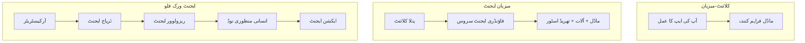
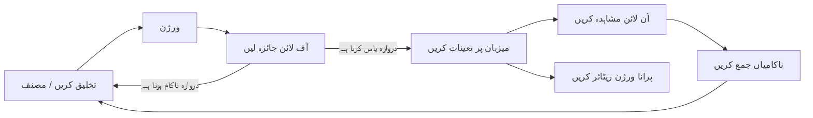
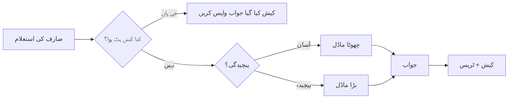
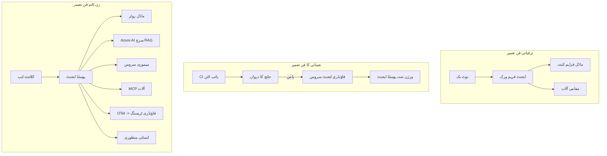

# مائیکروسافٹ فاؤنڈری کے ساتھ اسکیل ایبل ایجنٹس کی تعیناتی


اس کورس کے اب تک کے حصے میں، آپ نے ایسے ایجنٹس بنائے ہیں جو آپ کے لیپ ٹاپ پر، نوٹ بک کے اندر، `az login` اور چند ماحول کی متغیرات کے ذریعے چلتے ہیں۔ یہ سیکھنے کا بالکل صحیح طریقہ ہے۔ لیکن یہ صحیح طریقہ نہیں ہے کہ آپ ایک ایجنٹ چلائیں جس پر ہزاروں صارفین رات کے 3 بجے انحصار کرتے ہوں۔

یہ سبق "یہ میرے مشین پر کام کرتا ہے" اور "یہ پیداوار میں بھروسہ مند اور مناسب قیمت پر کام کرتا ہے" کے درمیان کے فرق کے بارے میں ہے۔ ہم اس فرق کو **مائیکروسافٹ فاؤنڈری** اور **مائیکروسافٹ فاؤنڈری ایجنٹ سروس** کے ذریعے ختم کرتے ہیں، اور ہم ایسا ایک حقیقی کسٹمر سپورٹ ایجنٹ بنا کر کرتے ہیں جس کے پاس آلات، بازیافت، یادداشت، جانچ، اور نگرانی ہوتے ہیں۔

## تعارف

یہ سبق درج ذیل موضوعات کا احاطہ کرے گا:

- **پروٹوٹائپ ایجنٹ** اور **تعینات ایجنٹ** کے درمیان فرق، اور کیوں یہ تبدیلی زیادہ تر ماڈل کے *آس پاس* کی ہر چیز کے بارے میں ہے۔
- ایجنٹس کے لئے **تعیناتی پیٹرن**: کلائنٹ ہوسٹڈ، سروس ہوسٹڈ (ہوسٹڈ ایجنٹس)، اور ورک فلو آرکیسٹریٹڈ۔
- مائیکروسافٹ فاؤنڈری پر **ایجنٹ کا لائف سائیکل** — تخلیق، ورژن، تعیناتی، جانچ، مشاہدہ، ریٹائر۔
- **اسکیلنگ حکمت عملی**: ماڈل روٹنگ، کیشنگ، ہم وقت سازی، اور سٹیٹ لیس ڈیزائن۔
- OpenTelemetry اور فاؤنڈری ٹریسنگ کے ساتھ **مشاہدہ کاری**۔
- ماڈل کے انتخاب، روٹنگ، اور جانچ کے گیٹس کے ذریعے **اخراجات کی بچت**۔
- **انٹرپرائز غور و فکر**: حکمرانی، انسانی منظوری، اور حفاظتی انداز میں MCP سرورز کا چلانا۔

## سیکھنے کے مقاصد

اس سبق کو مکمل کرنے کے بعد، آپ جان پائیں گے کہ کیسے:

- مخصوص ایجنٹ ورک لوڈ کے لیے صحیح تعیناتی پیٹرن منتخب کرنا۔
- ایجنٹ کو مائیکروسافٹ فاؤنڈری ایجنٹ سروس پر تعینات کرنا تاکہ اس کا ورژن، حکمرانی، اور مشاہدہ کیا جا سکے۔
- ایجنٹ کے لیے ٹریسنگ کے آلات لگانا اور ہر ریلیز سے پہلے چلنے والی جانچ کی پائپ لائن تیار کرنا۔
- اسکیل میں تاخیر اور اخراجات کو قابو میں رکھنے کے لیے ماڈل روٹنگ اور کیشنگ کا اطلاق کرنا۔
- اعلیٰ خطرے والے اقدامات کے لیے انسانی منظوری کا گیٹ شامل کرنا اور MCP سرور کو پیداوار میں محفوظ طریقے سے مربوط کرنا۔

## پیشگی ضروریات

یہ سبق فرض کرتا ہے کہ آپ نے پہلے کے اسباق مکمل کر لیے ہیں اور آپ ان سے واقف ہیں:

- ایجنٹس کی تعمیر [Microsoft Agent Framework](../14-microsoft-agent-framework/README.md) (سبق 14) کے ساتھ۔
- [آلات کا استعمال](../04-tool-use/README.md) (سبق 4) اور [Agentic RAG](../05-agentic-rag/README.md) (سبق 5)۔
- [ایجنٹ میموری](../13-agent-memory/README.md) (سبق 13) اور [ایجنٹک پروٹوکولز / MCP](../11-agentic-protocols/README.md) (سبق 11)۔
- [مشاہدہ کاری اور جانچ](../10-ai-agents-production/README.md) (سبق 10) — یہ سبق اس پر براہ راست بنیاد رکھتا ہے۔

آپ کو یہ بھی ضرورت ہوگی:

- ایک **Azure سبسکرپشن** اور کم از کم ایک تعینات چیٹ ماڈل کے ساتھ **Microsoft Foundry پروجیکٹ**۔
- مستند شدہ **Azure CLI** (`az login`)۔
- Python 3.12+ اور ریپوزیٹری کی پیکجز [`requirements.txt`](../../../requirements.txt)۔

## پروٹوٹائپ سے پیداوار تک: درحقیقت کیا تبدیل ہوتا ہے

پروٹوٹائپ ایجنٹ اور پیداوار ایجنٹ کے درمیان بنیادی لوپ ایک جیسا ہوتا ہے — سوچنا، آلات کو کال کرنا، جواب دینا۔ جو چیز تبدیل ہوتی ہے وہ اس لوپ کے ارد گرد کی ہر چیز ہے۔ ماڈل شاید پیداوار ایجنٹ کا 20% ہو؛ باقی 80% آپریشنل ڈھانچہ ہے۔

| تشویش | پروٹوٹائپ | پیداوار |
| --- | --- | --- |
| **ہوسٹنگ** | آپ کے نوٹ بک میں چلتا ہے | ہوسٹڈ سروس کی طرح چلتا ہے، ورژنڈ اور رول آؤٹ کیا جاتا ہے |
| **شناخت** | آپ کا `az login` ٹوکن | منظم شناختی اور محدد RBAC |
| **حالت** | ان میموری، ری اسٹارٹ پر ختم ہو جاتی ہے | بیرونی (تھریڈ اسٹور، میموری سروس) |
| **ناکامی** | آپ ٹریس بیک دیکھتے ہیں | ری ٹرائز، فال بیکس، ڈیڈ لیٹر، الرٹس |
| **لاگت** | "یہ چند سینٹس ہے" | درخواست کے حساب سے ٹریک، روٹنگ، کیشنگ، بجٹ بندی |
| **معیار** | آپ خود آؤٹ پٹ دیکھتے ہیں | ہر ریلیز سے پہلے خودکار جانچ کی جاتی ہے |
| **اعتماد** | آپ ہر ایکشن کی منظوری دیتے ہیں | پالیسیاں + خطرناک اقدامات کے لیے انسانی شمولیت |

اس جدول کو ذہن میں رکھیں۔ نیچے ہر سیکشن ان قطاروں میں سے ایک کے مطابق ہے۔

## ایجنٹ تعیناتی کے نمونے

آپ تین پیٹرن استعمال کریں گے، اکثر مل کر۔

### 1. کلائنٹ-ہوسٹڈ ایجنٹس

ایجنٹ آبجیکٹ *آپ* کی ایپلیکیشن پراسیس کے اندر رہتا ہے۔ آپ کا کوڈ ماڈل فراہم کنندہ کو براہ راست کال کرتا ہے؛ منطقی لوپ آپ کی سروس میں چلتا ہے۔ یہی کچھ ہر پچھلے سبق میں ہوا ہے۔

- **اسے استعمال کریں جب** آپ کو لوپ پر مکمل کنٹرول چاہیے، کسٹم مڈل ویئر چاہیے، یا آپ ایجنٹ کو موجودہ بیک اینڈ میں شامل کر رہے ہوں۔
- **تجارت**: آپ خود اسکیلنگ، حالت، اور مضبوطی کے مالک ہوتے ہیں۔

### 2. ہوسٹڈ ایجنٹس (فاؤنڈری ایجنٹ سروس)

ایجنٹ کو مائیکروسافٹ فاؤنڈری میں *ایک وسیلہ کے طور پر رجسٹر* کیا جاتا ہے۔ فاؤنڈری منطقی لوپ کی میزبانی کرتا ہے، تھریڈز محفوظ کرتا ہے، مواد کی حفاظت اور RBAC نافذ کرتا ہے، اور ایجنٹ کو فاؤنڈری پورٹل میں نظر آتا ہے۔ آپ کی ایپ ایک پتلا کلائنٹ بن جاتی ہے جو تھریڈز بناتی ہے اور جوابات پڑھتی ہے۔

- **اسے استعمال کریں جب** آپ کو دیرپائی، بنائی گئی مشاہدہ کاری، حکمرانی، اور کم آپریشنل سطح چاہیے۔
- **تجارت**: کم درجے کا کنٹرول ایک منظم رن ٹائم کے بدلے میں۔

### 3. ایجنٹ ورک فلو

متعدد ایجنٹس (اور آلات) کو گراف میں کمپوز کیا جاتا ہے جس میں واضح کنٹرول فلو ہوتا ہے — تسلسل کے مراحل، شاخیں، انسانی منظوری کے نودز، اور دیرپا چیک پوائنٹس جو رکتے اور دوبارہ شروع ہو سکتے ہیں۔ یہ مائیکروسافٹ ایجنٹ فریم ورک کی **ورک فلو** صلاحیت ہے جو تعیناتی کے پیمانے پر لاگو ہوتی ہے۔

- **اسے استعمال کریں جب** ایک کام متعدد ماہر ایجنٹس پر محیط ہو یا بیچ میں منظوری کا قدم درکار ہو۔
- **تجارت**: زیادہ مشینیں، آرکیسٹریشن سطح کی مشاہدہ کاری کی ضرورت۔



## مائیکروسافٹ فاؤنڈری پر ایجنٹ کا لائف سائیکل

ایجنٹ کی تعیناتی ایک بار کا `push` نہیں ہے۔ یہ ایک لوپ ہے، اور یہ بہت کچھ سوفٹ ویئر ریلیز سائیکل کی طرح لگتا ہے کیونکہ بالکل وہی ہے۔



کلیدی خیال، [سبق 10](../10-ai-agents-production/README.md) سے لیا گیا: **آف لائن جانچ ایک گیٹ ہے، ایک بعد کی چیز نہیں۔** نیا ایجنٹ ورژن آپ کے جانچ کے معیار پر پورا نہیں اترتا تو شپ نہیں ہوتا۔ آن لائن مشاہدہ کاری اصلی دنیا کی ناکامیوں کو آپ کے آف لائن ٹیسٹ سیٹ میں واپس بھیجتی ہے۔ یہ پورا لوپ ہے۔

## اسکیلنگ حکمت عملی

ایجنٹ اسکیل کرنا سٹیٹ لیس ویب API سے مختلف ہے، کیونکہ ہر درخواست میں کئی مہنگے ماڈل اور آلات کال ہو سکتی ہیں۔ چار تکنیک زیادہ تر بوجھ اٹھاتی ہیں۔

**سٹیٹ لیس درخواست کی ہینڈلنگ۔** آپ کے پراسیس میموری میں صارف کی کوئی حالت نہ رکھیں۔ گفتگو کے تھریڈز کو فاؤنڈری تھریڈ اسٹور یا میموری سروس میں محفوظ کریں تاکہ کوئی بھی انسٹینس کسی بھی درخواست کو ہینڈل کر سکے۔ یہ آپ کو افقی اسکیلنگ کی اجازت دیتا ہے — انسٹینسز شامل کریں، کوئی چپکے ہوئے سیشن نہیں۔

**ماڈل روٹنگ۔** ہر درخواست کو آپ کے سب سے قابل اور مہنگے ماڈل کی ضرورت نہیں ہوتی۔ سادہ درخواستوں کو — نیت کی درجہ بندی، مختصر حقائق کے جواب — ایک چھوٹے، تیز ماڈل کو بھیجیں، اور بڑے ماڈل کو اصلی منطق کے لیے محفوظ رکھیں۔ فاؤنڈری کا **ماڈل روٹر** آپ کے لیے یہ کر سکتا ہے، یا آپ خود ایک ہلکا پھلکا کلاسفائر بنا سکتے ہیں۔ آپ لیب میں خود اس کام کی تعمیر کریں گے۔

**جواب کیشنگ۔** بہت سے سپورٹ کے سوالات قریب یا مکمل یکساں ہیں ("میں اپنا پاس ورڈ کیسے ری سیٹ کروں؟")۔ عام سوالات کے جوابات کیش کریں اور انہیں ماڈل کو استعمال کیے بغیر فراہم کریں۔ حتیٰ کہ معتدل کیش ہٹ ریٹ بھی لاگت اور تاخیر کم کر دیتا ہے۔

**ہم وقت سازی اور بیک پریشر۔** ماڈل فراہم کنندہ کی ریٹ لمٹس ہوتی ہیں۔ اپنی ہم وقت سازی کو محدود کریں، ایکسپونینشیئل بیک آف کے ساتھ ری ٹرائز استعمال کریں، اور مہذب انداز میں ناکام ہوں (کتار بند "ہم اس پر کام کر رہے ہیں" جواب 500 سے بہتر ہے)۔



## پیداوار میں مشاہدہ کاری

آپ وہ نہیں چلا سکتے جو آپ نہیں دیکھ سکتے۔ سبق 10 میں ذکر شدہ مائیکروسافٹ ایجنٹ فریم ورک قدرتی طور پر **اوپن ٹیلی میٹری** ٹریسس جاری کرتا ہے — ہر ماڈل کال، ٹول انووکیشن، اور آرکیسٹریشن قدم ایک سپین بن جاتا ہے۔ پیداوار میں آپ ان سپینز کو مائیکروسافٹ فاؤنڈری (یا کسی بھی OTel مطابقت رکھنے والے بیک اینڈ) کو برآمد کرتے ہیں تاکہ آپ:

- ہر کسٹمر کی شکایت کو پورے ماڈل اور ٹول کالز میں سراسر ٹریس کر سکیں۔
- وقت کے ساتھ درخواست کی اوسط p50/p95 تاخیر اور لاگت دیکھیں۔
- صارفین (یا آپ کی مالی ٹیم) کے نوٹس لینے سے پہلے خرابی کی شرح کے spikes اور لاگت کی غیر معمولی صورتحال پر الرٹ کریں۔

```python
from agent_framework.observability import get_tracer

tracer = get_tracer()

with tracer.start_as_current_span("support_request") as span:
    span.set_attribute("customer.tier", "enterprise")
    span.set_attribute("routed.model", "gpt-5-nano")
    # ایجنٹ کے نفاذ کو خود بخود اس اسپین کے اندر ٹریس کیا جاتا ہے
```

`customer.tier` اور `routed.model` جیسے ایٹریبیوٹس دیوار سی ٹریسس کو جوابدہ سوالات میں تبدیل کرتے ہیں ("کیا انٹرپرائز صارفین کو چھوٹے ماڈل کی طرف بہت زیادہ روٹ کیا جا رہا ہے؟")۔

## لاگت کی بچت

پیداوار کے ایجنٹس میں لاگت ٹوکنز سے غالب ہوتی ہے۔ تین طریقے، اثر کے لحاظ سے ترتیب دیے گئے:

1. **ماڈل کا مناسب سائز منتخب کریں۔** ایک چھوٹا ماڈل جو آپ کے جانچ گیٹ سے گزرتا ہے، عموماً ایک بڑے ماڈل سے سستا ہوتا ہے جو بھی گزرتا ہو۔ جانچ کا استعمال کریں تاکہ یہ ثابت کیا جا سکے کہ چھوٹا ماڈل کافی اچھا ہے بجائے اس کے کہ احتیاطاً سب سے بڑا ماڈل استعمال کریں۔
2. **پیچیدگی کی بنیاد پر روٹ کریں۔** جیسا کہ اوپر بتایا گیا — صرف ان درخواستوں کے لیے بڑے ماڈل کی قیمت ادا کریں جنہیں بڑے ماڈل کی منطق کی ضرورت ہو۔
3. **زیادہ سے زیادہ کیش کریں۔** سب سے سستی ماڈل کال وہ ہے جو آپ کبھی نہ کریں۔

جانچ کے گیٹس اور لاگت کی کنٹرول ایک ہی اصول کے دو پہلو ہیں: جانچ آپ کو *معیار کی کم سے کم حد* بتاتی ہے، روٹنگ اور کیشنگ آپ کو اس حد کی *لاگت* کے قریب رکھتی ہے۔

## انٹرپرائز تعیناتی کے معاملات

**حکمرانی۔** ہوسٹڈ ایجنٹس فاؤنڈری کے RBAC، مواد کی حفاظت، اور آڈٹ لاگنگ وراثت میں لیتے ہیں۔ ہر ایجنٹ کو کم از کم ضروری مراعات کے ساتھ منظم شناختی دیں — علم کے ذخیرے تک صرف پڑھنے کی رسائی، ٹکٹنگ API تک محدود رسائی، اور کچھ نہیں۔

**انسانی منظوری۔** کچھ اقدامات براہ راست خودکار نہیں کیے جا سکتے — رقم کی واپسی، اکاؤنٹ کی حذف کاری، قانونی ٹیم کو بڑھانا۔ مائیکروسافٹ ایجنٹ فریم ورک **منظوری مطلوبہ** آلات کی حمایت کرتا ہے: ایجنٹ کارروائی تجویز کرتا ہے، عمل معطل ہو جاتا ہے، انسان منظوری دیتا یا مسترد کرتا ہے، اور ورک فلو دوبارہ شروع ہوتا ہے۔ آپ نے [سبق 6](../06-building-trustworthy-agents/README.md) میں یہ بنیادیات دیکھی تھیں؛ یہاں آپ اسے تعینات کرتے ہیں۔

**پیداوار میں MCP۔** [MCP](../11-agentic-protocols/README.md) آپ کے ایجنٹ کو معیاری انٹرفیس کے ذریعے بیرونی آلات استعمال کرنے دیتا ہے۔ پیداوار میں، ہر MCP سرور کو غیر معتبر حد کے طور پر تصور کریں: سرور کا ورژن طے کریں، اسے محدود شناخت کے ساتھ چلائیں، آؤٹ پٹ کی تصدیق کریں، اور کبھی بھی اس کے سامنے راز ظاہر نہ کریں۔ MCP سرور ایک انحصار ہے، اور انحصارات کو پیچ، آڈٹ، اور ریٹ لمٹ کیا جاتا ہے۔



یہ تین خاکے — ترقی، تعیناتی، رن ٹائم — ایک ہی ایجنٹ کی زندگی کے تین مراحل ہیں۔ اگلی لیب آپ کو اسے بنانے کے عمل سے گزاریگی۔

## عملی لیب: ایک پیداوار کے لیے تیار کسٹمر سپورٹ ایجنٹ

کھولیں [`code_samples/16-python-agent-framework.ipynb`](./code_samples/16-python-agent-framework.ipynb) اور اسے شروع سے آخر تک مکمل کریں۔ آپ ایک **Contoso کسٹمر سپورٹ ایجنٹ** تیار کریں گے جس میں ہر پیداوار کی تشویش شامل ہو گی:

1. **آلات کو کال کرنا** — آرڈر کی حالت دیکھیں اور سپورٹ ٹکٹ کھولیں۔
2. **RAG** — علم کے ذخیرے سے پالیسی کے سوالات کے جواب دیں (Azure AI سرچ، ساتھ ایک ان میموری فال بیک تاکہ نوٹ بک سرچ وسیلہ کے بغیر چلے)۔
3. **یادداشت** — گفتگو کے دوران کسٹمر کو یاد رکھیں۔
4. **ماڈل روٹنگ** — پیچیدگی کلاسیفائر ہر درخواست کو چھوٹے یا بڑے ماڈل کی طرف روٹ کرتا ہے۔
5. **جواب کیشنگ** — بار بار پوچھے جانے والے سوالات کیش سے سرور کیے جاتے ہیں۔
6. **انسانی منظوری** — ایک حد سے اوپر کی واپسی کے لیے انسانی دستخط کی ضرورت ہے۔
7. **جانچ کی پائپ لائن** — ایک چھوٹا آف لائن ٹیسٹ سیٹ ایجنٹ کی جانچ کرتا ہے اور ریلیز گیٹ کا کام کرتا ہے۔
8. **مشاہدہ کاری** — ہر درخواست کے گرد OpenTelemetry ٹریسنگ۔

### تفصیلی رہنمائی

نوٹ بک اس طرح منظم ہے کہ ہر پیداوار کی تشویش خود مختار، چلنے والا سیکشن ہے۔ اس کا مرکز روٹنگ پلس کیشنگ درخواست ہینڈلر ہے:

```python
async def handle_support_request(query: str, customer_id: str) -> str:
    # 1. جب ممکن ہو کیش سے فراہم کریں۔
    cached = response_cache.get(normalize(query))
    if cached:
        return cached

    # 2. لاگت کو کنٹرول کرنے کے لیے پیچیدگی کے لحاظ سے راستہ منتخب کریں۔
    model = "gpt-5-nano" if is_simple(query) else "gpt-5-mini"

    # 3. مشاہدے کے لیے ایجنٹ کو ٹریس اسپین کے اندر چلائیں۔
    with tracer.start_as_current_span("support_request") as span:
        span.set_attribute("routed.model", model)
        span.set_attribute("customer.id", customer_id)
        response = await support_agent.run(query, model=model)

    # 4. کیش کریں اور واپس کریں۔
    response_cache.set(normalize(query), response.text)
    return response.text
```

وہ جانچ گیٹ جو ریلیز کی نگہبانی کرتا ہے، کچھ یوں دکھتا ہے:

```python
async def evaluation_gate(agent, test_cases, threshold: float = 0.8) -> bool:
    passed = 0
    for case in test_cases:
        result = await agent.run(case["input"])
        if score_response(result.text, case["expected"]) >= 0.8:
            passed += 1
    pass_rate = passed / len(test_cases)
    print(f"Evaluation pass rate: {pass_rate:.0%} (gate: {threshold:.0%})")
    return pass_rate >= threshold  # صرف اس صورت میں تعینات کریں جب گیٹ پاس ہو جائے
```

ہر لائن پڑھیں — نوٹ بک بنیادیات کو جان بوجھ کر چھوٹا رکھتی ہے تاکہ کچھ بھی فریم ورک کال کے پیچھے نہ چھپے۔

## تعینات ایجنٹ کی اسموک ٹیسٹس کے ذریعے توثیق

اوپر دیا ہوا جانچ گیٹ *آف لائن* آپ کے ایجنٹ آبجیکٹ کے خلاف چلتا ہے۔ جب ایجنٹ کو ہوسٹڈ ایجنٹ کے طور پر تعینات کیا جاتا ہے، تو آپ کو ایک مزید، اور بھی سستا چیک کرنا ہوتا ہے: **کیا تعینات اینڈپوائنٹ حقیقت میں جواب دے رہا ہے؟**

"کامیابی سے" تعیناتی صرف یہ ثابت کرتی ہے کہ کنٹرول پلین نے تعریف قبول کر لی ہے — یہ نہیں دکھاتی کہ ایجنٹ جواب دے رہا ہے۔ کوئی لاپتہ انحصار، خراب ماڈل روٹنگ، یا ایک میعاد ختم کنکشن ایسا سبز تعینات چھوڑ سکتا ہے جو کچھ واپس نہیں دیتا۔ ایک **اسموک ٹیسٹ** یہ سیکنڈوں میں پکڑ لیتا ہے، ہر تعیناتی پر، مکمل جانچ کی لاگت کے بغیر۔

یہ ذخیرہ ایک تیار شدہ اسموک ٹیسٹ پائپ لائن کے ساتھ بھیجا جاتا ہے جو [AI Smoke Test](https://github.com/marketplace/actions/ai-smoke-test) گٹ ہب ایکشن پر مبنی ہے:

- **کیاٹلاگ** — [`tests/lesson-16-smoke-tests.json`](../../../tests/lesson-16-smoke-tests.json) میں Contoso سپورٹ ایجنٹ کے لیے پرامپٹس اور اثبات (grounded پالیسی کے جوابات، آرڈر کی تلاش، موضوع پر رہنا، اور کثیر مرحلہ تھریڈ کی تسلسل) موجود ہیں۔ دیگر سبقوں کے ایجنٹس کے کیٹلاگز بھی اسی کے ساتھ ہوتے ہیں — دیکھیں [`tests/README.md`](../tests/README.md)۔
- **ورک فلو** — [`.github/workflows/smoke-test.yml`](../../../.github/workflows/smoke-test.yml) Azure OIDC کے ساتھ لاگ ان ہوتی ہے اور ہر پرامپٹ کو ایجنٹ کے Responses اینڈپوائنٹ پر POST کرتی ہے، کسی بھی اثبات میں ناکامی پر کام ناکام کر دیتی ہے۔

```yaml
- name: Smoke-test hosted agent
  uses: JFolberth/ai-smoketest@v1
  with:
    project_endpoint: ${{ inputs.project_endpoint }}
    agent_name: ContosoSupportAgent
    tests_file: tests/lesson-16-smoke-tests.json
```


اپنے ایجنٹ کے تعینات ہونے کے بعد **Actions** ٹیب سے اسے چلائیں، اپنے Foundry پروجیکٹ کا اینڈپوائنٹ اور ایجنٹ کا نام فراہم کرتے ہوئے۔ فیڈریٹڈ شناخت کو Foundry پروجیکٹ کے دائرہ کار میں **Azure AI User** رول کی ضرورت ہوتی ہے۔ تہوں کو ایک ہرم کے طور پر سوچیں: دھواں کے ٹیسٹ (پہنچنے کے قابل اور جواب دے رہے ہیں؟) ہر تعیناتی پر چلتے ہیں، آف لائن جائزہ (کیا شپ کرنے کے لیے کافی اچھا ہے؟) پرموشن سے پہلے چلتا ہے، اور آن لائن جائزہ (یہ حقیقی دنیا میں کیسا کر رہا ہے؟) مسلسل چلتا رہتا ہے۔

## علم جانچ

اسائنمنٹ پر جانے سے پہلے اپنی سمجھ کو آزمائیں۔

**1. تقریباً پیداوار کے ایک ایجنٹ میں "ماڈل" کتنے فیصد ہوتا ہے، اور باقی کیا ہوتا ہے؟**

<details>
<summary>جواب</summary>

ماڈل نظام کا اقلیت حصہ ہے — اکثر اسے تقریباً 20% کے طور پر بیان کیا جاتا ہے۔ باقی آپریشنل ڈھانچہ ہوتا ہے: ہوسٹنگ اور ورژن کنٹرول، شناخت اور RBAC، بیرونی حالت، فیلیر ہینڈلنگ، لاگت کی نگرانی، جائزہ، اور انسانی شامل کنٹرولز۔ پیداوار میں جانا زیادہ تر اس *اسقاطی لوپ* کے ارد گرد سب کچھ بنانے کے بارے میں ہوتا ہے۔
</details>

**2. آپ کب کلائنٹ ہوسٹڈ ایجنٹ کے بجائے ہوسٹڈ ایجنٹ کا انتخاب کریں گے؟**

<details>
<summary>جواب</summary>

جب آپ کو ان بلٹ پائیداری (ایسے تھریڈز جو مسلسل رہتے اور دوبارہ شروع ہو سکتے ہیں)، مشاہدہ پذیری، مواد کی حفاظت، اور RBAC کے ساتھ ایک منظم رن ٹائم چاہیے ہو، اور آپ اسقاطی لوپ کی کچھ کم سطحی کنٹرول کو کم آپریشنل سطح کے بدلے دینے کے لیے تیار ہوں۔ کلائنٹ ہوسٹڈ اس وقت ترجیحی ہوتا ہے جب آپ کو لوپ پر مکمل کنٹرول چاہیے یا ایجنٹ کو موجودہ بیک اینڈ میں شامل کر رہے ہوں۔
</details>

**3. کیوں ایک اسکیل ایبل ایجنٹ کو اپنی پروسیس میموری میں بغیر حالت کا ہونا ضروری ہے؟**

<details>
<summary>جواب</summary>

تاکہ کوئی بھی مثال کسی بھی درخواست کو سنبھال سکے، جو افقی اسکیلنگ کو بغیر اسٹکی سیشنز کے ممکن بناتا ہے۔ ہر صارف کی بات چیت کی حالت ایک تھریڈ اسٹور یا میموری سروس میں بیرونی کی جاتی ہے۔ اگر حالت پروسیس میموری میں ہوتی تو دوبارہ شروع کرنے پر یہ ضائع ہو جاتی اور آپ بوجھ کو آزادانہ طور پر تقسیم نہیں کر سکتے۔
</details>

**4. ماڈل روٹنگ کون سا مسئلہ حل کرتی ہے، اور یہ جائزے سے کیسے متعلق ہے؟**

<details>
<summary>جواب</summary>

روٹنگ سادہ درخواستوں کو ایک چھوٹے، سستے، تیز ماڈل کی طرف بھیجتی ہے اور بڑا ماڈل حقیقی استدلال کے لیے محفوظ رکھتی ہے، جس سے تاخیر اور لاگت دونوں کنٹرول ہوتے ہیں۔ یہ جائزے سے متعلق ہے کیونکہ جائزہ ہی وہ چیز ہے جو ثابت کرتی ہے کہ چھوٹا ماڈل کسی قسم کی درخواستوں کے لیے کافی اچھا ہے — بغیر جائزے کے روٹنگ اندازہ لگانا ہے۔
</details>

**5. "ایوالویشن گیٹ" کیا ہے اور یہ لائف سائیکل میں کہاں آتا ہے؟**

<details>
<summary>جواب</summary>

ایک ایوالویشن گیٹ نئے ایجنٹ ورژن کے خلاف ایک آف لائن ٹیسٹ سیٹ چلاتا ہے اور تب تک تعیناتی کو روکتا ہے جب تک پاس ریٹ کسی حد کو عبور نہ کرے۔ یہ لائف سائیکل میں "ورژن" اور "ڈیپلائے" کے درمیان ہوتا ہے، جس سے کوالٹی کو ریلیز کے لیے شرط بنایا جاتا ہے نہ کہ شپنگ کے بعد چیک کرنے کی چیز۔
</details>

**6. پیداوار میں MCP سرور کو غیر قابل اعتماد حد کے طور پر کیوں سمجھنا چاہیے؟**

<details>
<summary>جواب</summary>

کیونکہ یہ ایک خارجی انحصار ہے جسے آپ کا ایجنٹ کال کرتا ہے۔ آپ کو اس کا ورژن پن کرنا چاہیے، اسے محدود شناخت کے ساتھ چلانا چاہیے، اس کے آؤٹ پٹس کی تصدیق کرنی چاہیے، اس پر ریٹ لیمٹ لگانا چاہیے، اور کبھی بھی اس کے ساتھ راز افشا نہیں کرنے چاہئیں — وہی اصول جو آپ کسی بھی تیسرے فریق کے انحصار پر لاگو کرتے ہیں۔ اس کے آؤٹ پٹس آپ کے ایجنٹ کی استدلال میں جاتے ہیں، اس لیے بغیر تصدیق کا اعتبار ایک سکیورٹی رسک ہے۔
</details>

**7. پیداوار کے ایجنٹ کی لاگت پر عام طور پر سب سے بڑا اثر ڈالنے والی واحد تبدیلی کون سی ہے، اور کیوں؟**

<details>
<summary>جواب</summary>

ماڈل کا درست سائز منتخب کرنا — سب سے چھوٹا ماڈل استعمال کرنا جو آپ کے ایوالویشن گیٹ کو پاس کرے۔ لاگت سب سے زیادہ ٹوکنز پر ہوتی ہے، اور ایک چھوٹا ماڈل جو معیار کے معیار پر پورا اترتا ہے عام طور پر بڑے ماڈل سے کم مہنگا ہوتا ہے۔ کیشنگ اور روٹنگ لاگت کو مزید کم کرتے ہیں، لیکن صحیح بنیادی ماڈل کا انتخاب سب سے بڑا پہلا اثر ہوتا ہے۔
</details>

**8. span attributes جیسے `customer.tier` اور `routed.model` مشاہدہ پذیری میں کیا کردار ادا کرتے ہیں؟**

<details>
<summary>جواب</summary>

یہ خام ٹریسز کو جواب دیے جانے والے کاروباری سوالات میں تبدیل کر دیتے ہیں۔ بغیر attributes کے آپ کے پاس صرف spans کی دیوار ہوتی ہے؛ ان کے ساتھ آپ پوچھ سکتے ہیں "کیا انٹرپرائز کسٹمرز کو بہت زیادہ چھوٹے ماڈل کی طرف روٹ کیا جا رہا ہے؟" یا "کون سا ماڈل ہماری سب سے سست درخواستوں کو سنبھالتا ہے؟" attributes وہ طریقہ ہیں جن سے آپ ٹیلیمیٹری کو آپریشن کے اہم جہات کے مطابق تقسیم کرتے ہیں۔
</details>

## اسائنمنٹ

لیب سے کسٹمر سپورٹ ایجنٹ لے کر اسے ایک مخصوص منظرنامے کے لیے مضبوط بنائیں: **SaaS کمپنی کے لیے سبسکرپشن بلنگ سپورٹ ایجنٹ۔**

آپ کی جمع کرائی گئی چیزوں میں شامل ہونا چاہیے:

1. **اوزار کو** بلنگ سے متعلقہ اوزار سے بدلیں: `get_subscription_status`, `get_invoice`, اور `issue_credit` (50 ڈالر سے زائد کریڈٹس کو انسانی منظوری کی ضرورت ہوتی ہے)۔
2. **تین RAG دستاویزات شامل کریں** جو کمپنی کی ریفنڈ پالیسی، بلنگ سائیکل، اور کینسلیشن پالیسی کو کور کریں۔
3. **ایوالویشن سیٹ کو کم از کم آٹھ کیسز تک بڑھائیں، جن میں کم از کم دو ایسے شامل ہوں جو انسانی منظوری کے راستے کو فعال کریں، اور تصدیق کریں کہ آپ کا ایوالویشن گیٹ درست طریقے سے پاس یا فیل ہو رہا ہے۔**
4. **ایک لاگت رپورٹ شامل کریں**: ایجنٹ کے ذریعے دس مخلوط سوالات چلانے کے بعد، پرنٹ کریں کہ کتنے چھوٹے ماڈل کو گئے، کتنے بڑے ماڈل کو، اور کتنے کیش سے سروس ہوئے۔

ایک مختصر پیراگراف (مارک ڈاؤن سیل میں) لکھیں جس میں وضاحت کریں کہ آپ نے کون سا ماڈل روٹنگ رول منتخب کیا اور آپ اسے حقیقی ٹریفک کے ساتھ کیسے تصدیق کریں گے۔ کوئی واحد درست جواب نہیں ہے — آپ کا جائزہ اس بات پر ہوگا کہ آیا پیداوار کے معاملات مربوط طریقے سے جڑے ہیں یا نہیں۔

## خلاصہ

اس سبق میں آپ نے Microsoft Foundry کے ساتھ ایک ایجنٹ کو پروٹوٹائپ سے پیداوار میں منتقل کیا:

- پیداوار میں جانا زیادہ تر ماڈل کے گرد **آپریشنل ڈھانچے** کے بارے میں ہوتا ہے — ہوسٹنگ، شناخت، حالت، خرابی ہینڈلنگ، لاگت، معیار، اور اعتماد۔
- آپ نے تین **تعیناتی کے انداز** سیکھے — کلائنٹ ہوسٹڈ، ہوسٹڈ ایجنٹس، اور ایجنٹ ورک فلو — اور جانا کہ ہر ایک کب مناسب ہے۔
- آپ نے **ایجنٹ لائف سائیکل** کا جائزہ لیا، جہاں آف لائن **جائزہ ریلیز گیٹ کے طور پر کام کرتا ہے** اور آن لائن مشاہدہ ناکامیوں کو ٹیسٹ سیٹ میں واپس لاتا ہے۔
- آپ نے **اسکیلنگ کی حکمتِ عملیوں** کا اطلاق کیا — بغیر حالت کے ڈیزائن، ماڈل روٹنگ، کیشنگ، اور محدود ہمواری — اور انہیں **لاگت کی اصلاح** سے جوڑا۔
- آپ نے **انٹرپرائز کنٹرولز** کو جوڑا: RBAC، انسانی شامل منظوری، اور پیداوار کے لیے محفوظ MCP انٹیگریشن۔
- آپ نے ایک ایسا **پیداوار کے لیے تیار کسٹمر سپورٹ ایجنٹ** بنایا جو ان سب کا رن ایبل کوڈ میں مربوط کرتا ہے۔

اگلا سبق اس کے برعکس سفر کرے گا: ایجنٹوں کو کلاؤڈ میں اسکیل کرنے کی بجائے آپ انہیں *ایک واحد ڈیولپر مشین* پر لے کر آئیں گے اور مکمل طور پر لوکل چلائیں گے۔

## اضافی وسائل

- <a href="https://learn.microsoft.com/azure/ai-foundry/what-is-azure-ai-foundry" target="_blank">Microsoft Foundry دستاویزات</a>
- <a href="https://learn.microsoft.com/azure/ai-foundry/agents/overview" target="_blank">Microsoft Foundry ایجنٹ سروس کا جائزہ</a>
- <a href="https://aka.ms/ai-agents-beginners/agent-framework" target="_blank">Microsoft Agent Framework</a>
- <a href="https://learn.microsoft.com/azure/ai-foundry/concepts/model-router" target="_blank">Microsoft Foundry میں ماڈل روٹر</a>
- <a href="https://learn.microsoft.com/azure/search/search-what-is-azure-search" target="_blank">Azure AI سرچ</a>
- <a href="https://opentelemetry.io/" target="_blank">OpenTelemetry</a>
- <a href="https://github.com/marketplace/actions/ai-smoke-test" target="_blank">AI Smoke Test GitHub ایکشن</a>
- <a href="https://modelcontextprotocol.io/" target="_blank">Model Context Protocol (MCP)</a>

## پچھلا سبق

[کمپیوٹر یوز ایجنٹس (CUA) بنانا](../15-browser-use/README.md)

## اگلا سبق

[لوکل AI ایجنٹس بنانا](../17-creating-local-ai-agents/README.md)

---

<!-- CO-OP TRANSLATOR DISCLAIMER START -->
**ڈس کلیمر**:
یہ دستاویز AI ترجمہ سروس [Co-op Translator](https://github.com/Azure/co-op-translator) کے ذریعے ترجمہ کی گئی ہے۔ جبکہ ہم درستگی کے لیے کوشاں ہیں، براہ کرم اس بات سے آگاہ رہیں کہ خودکار ترجمے میں غلطیاں یا عدم درستیاں ہو سکتی ہیں۔ اصل دستاویز اپنے مادری زبان میں مستند ماخذ سمجھی جائے گی۔ حساس معلومات کے لیے پیشہ ور انسانی ترجمہ کی سفارش کی جاتی ہے۔ اس ترجمے کے استعمال سے پیدا ہونے والی کسی بھی غلط فہمی یا غلط تشریح کی ذمہ داری ہم قبول نہیں کرتے۔
<!-- CO-OP TRANSLATOR DISCLAIMER END -->