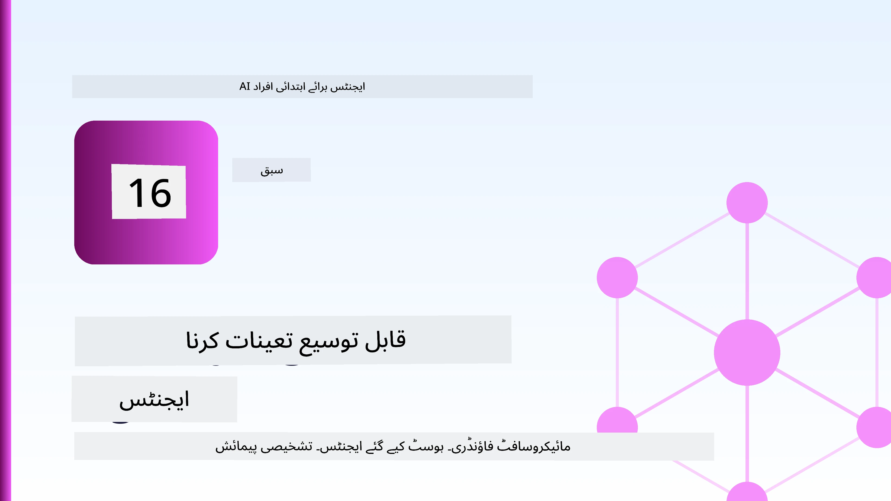
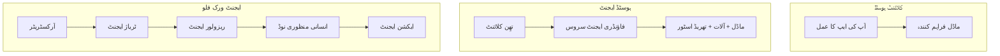
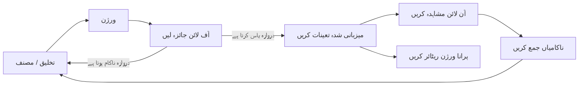
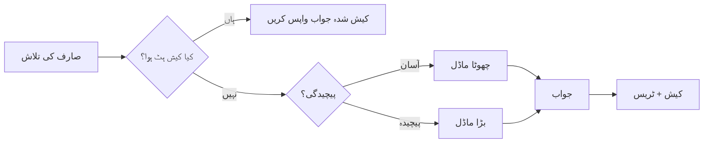
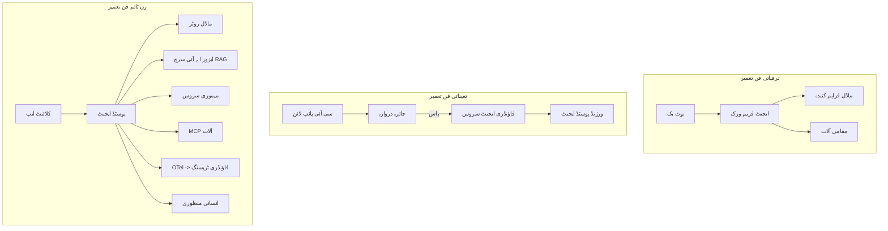

# مائیکروسافٹ فانڈری کے ساتھ اسکیل ایبل ایجنٹس کی تعیناتی



اس کورس کے اس مرحلے تک آپ نے ایسے ایجنٹس بنائے ہیں جو آپ کے لیپ ٹاپ پر، نوٹ بک کے اندر چلتے ہیں، `az login` اور چند محیطی متغیرات کے ذریعے کنٹرول ہوتے ہیں۔ یہ بالکل صحیح طریقہ ہے سیکھنے کا۔ یہ اس درست طریقے نہیں جس پر کوئی ایجنٹ چلایا جائے جس پر ہزاروں صارفین رات کے 3 بجے انحصار کرتے ہوں۔

یہ سبق "یہ میرے کمپیوٹر پر کام کرتا ہے" اور "یہ پروڈکشن میں قابل اعتماد اور سستی طریقے سے کام کرتا ہے" کے درمیان فرق کے بارے میں ہے۔ ہم اس فرق کو **مائیکروسافٹ فانڈری** اور **مائیکروسافٹ فانڈری ایجنٹ سروس** استعمال کرکے ختم کرتے ہیں، اور ہم ایک اصل کسٹمر سپورٹ ایجنٹ بناتے ہیں جس میں ٹولز، بازیابی، یادداشت، تشخیص، اور نگرانی شامل ہیں۔

## تعارف

یہ سبق درج ذیل موضوعات پر مشتمل ہوگا:

- ایک **پروٹوٹائپ ایجنٹ** اور ایک **تعینات ایجنٹ** کے درمیان فرق، اور کیوں تبدیلی زیادہ تر ماڈل کے *آس پاس* کی چیزوں کے بارے میں ہے۔
- ایجنٹس کے لیے **تعیناتی کے پیٹرنز**: کلائنٹ-ہوسٹڈ، سروس-ہوسٹڈ (ہوسٹڈ ایجنٹس)، اور ورک فلو-آرکیسٹریٹڈ۔
- مائیکروسافٹ فانڈری پر **ایجنٹ کے لائف سائیکل** — بنائیں، ورژن بنائیں، تعینات کریں، تشخیص کریں، مشاہدہ کریں، ریٹائر کریں۔
- **اسکیلنگ کی حکمت عملیاں**: ماڈل روٹنگ، کیشنگ، ہم آہنگی، اور اسٹیٹ لیس ڈیزائن۔
- OpenTelemetry اور فانڈری ٹریسنگ کے ذریعے **مشاہدہ پذیری**۔
- ماڈل کے انتخاب، روٹنگ، اور تشخیصی گیٹس کے ذریعے **لاگت کی اصلاح**۔
- **انٹرپرائز کے پہلو**: حکمرانی، انسانی منظوری، اور پروڈکشن میں MCP سرورز کو محفوظ طریقے سے چلانا۔

## سیکھنے کے مقاصد

اس سبق کو مکمل کرنے کے بعد، آپ جانیں گے کہ کیسے:

- مخصوص ایجنٹ کے ورک لوڈ کے لیے صحیح تعیناتی پیٹرن منتخب کریں۔
- مائیکروسافٹ فانڈری ایجنٹ سروس پر ایک ایجنٹ تعینات کریں تاکہ وہ ورژن شدہ، گورنڈ، اور قابل مشاہدہ ہو۔
- ٹریسنگ کے لیے ایجنٹ کا انسٹرومنٹ کریں اور ایک تشخیصی پائپ لائن لگائیں جو ہر ریلیز سے پہلے چلتی ہو۔
- اسکیل پر تاخیر اور لاگت کو کنٹرول میں رکھنے کے لیے ماڈل روٹنگ اور کیشنگ کا اطلاق کریں۔
- اعلیٰ خطرے والے اقدامات کے لیے انسانی منظوری کا گیٹ شامل کریں اور پروڈکشن میں MCP سرور کو محفوظ طریقے سے جوڑیں۔

## پری ریکوئزٹس

یہ سبق فرض کرتا ہے کہ آپ نے پہلے کے اسباق مکمل کر لیے ہیں اور آپ واقف ہیں:

- [مائیکروسافٹ ایجنٹ فریم ورک](../14-microsoft-agent-framework/README.md) (سبق 14) کے ساتھ ایجنٹس بنانا۔
- [ٹول کا استعمال](../04-tool-use/README.md) (سبق 4) اور [ایجینٹک RAG](../05-agentic-rag/README.md) (سبق 5)۔
- [ایجنٹ میموری](../13-agent-memory/README.md) (سبق 13) اور [ایجنٹک پروٹوکولز / MCP](../11-agentic-protocols/README.md) (سبق 11)۔
- [مشاہدہ پذیری اور تشخیص](../10-ai-agents-production/README.md) (سبق 10) — یہ سبق براہ راست اس پر مبنی ہے۔

آپ کو درج ذیل کی بھی ضرورت ہوگی:

- ایک **Azure سبسکرپشن** اور ایک **مائیکروسافٹ فانڈری پروجیکٹ** جس میں کم از کم ایک تعینات چیٹ ماڈل ہو۔
- **Azure CLI** جس میں تصدیق شدہ (`az login`)۔
- پائتھون 3.12+ اور مخزن میں موجود پیکیجز [`requirements.txt`](../../../requirements.txt)۔

## پروٹوٹائپ سے پروڈکشن تک: اصل میں کیا بدلتا ہے

ایک پروٹوٹائپ ایجنٹ اور ایک پروڈکشن ایجنٹ بنیادی لوپ میں ایک جیسے ہوتے ہیں — سوچنا، ٹولز کال کرنا، جواب دینا۔ جو چیز بدلتی ہے وہ اس لوپ کے گرد لپٹی سب چیزیں ہیں۔ ماڈل شاید پروڈکشن ایجنٹ کا 20% ہو؛ باقی 80% آپریشنل ڈھانچہ ہے۔

| تشویش | پروٹوٹائپ | پروڈکشن |
| --- | --- | --- |
| **ہوسٹنگ** | آپ کے نوٹ بک میں چلتا ہے | ہوسٹڈ سروس کے طور پر چلتا ہے، ورژن شدہ اور رول آؤٹ کیا گیا |
| **شناخت** | آپ کا `az login` ٹوکن | محدود RBAC کے ساتھ مینیجڈ شناخت |
| **حالت** | یادداشت میں، ری اسٹارٹ پر ختم | خارجی طور پر محفوظ (تھریڈ اسٹور، میموری سروس) |
| **ناکامی** | آپ کو ٹریس بیک نظر آتی ہے | دوبارہ کوششیں، فال بیک، ڈیڈ لیٹر، الرٹس |
| **لاگت** | "یہ چند سینٹس ہے" | ہر درخواست کے حساب سے ٹریک کی جاتی ہے، روٹ کی جاتی ہے، کیش کی جاتی ہے، بجٹ کی جاتی ہے |
| **معیار** | آپ نتیجہ دیکھ کر اندازہ لگاتے ہیں | ہر ریلیز سے پہلے خودکار طریقے سے جانچا جاتا ہے |
| **اعتماد** | آپ ہر عمل کی منظوری دیتے ہیں | پالیسی + خطرناک اقدامات کے لیے انسانی مداخلت |

اس جدول کو ذہن میں رکھیں۔ نیچے ہر سیکشن ان قطاروں میں سے ایک کے مطابق ہوگا۔

## ایجنٹ تعیناتی کے پیٹرنز

آپ تین طریقے استعمال کریں گے، اکثر ملا کر۔

### 1. کلائنٹ-ہوسٹڈ ایجنٹس

ایجنٹ آبجیکٹ آپ کی ایپلیکیشن پروسیس کے اندر رہتا ہے۔ آپ کا کوڈ ماڈل فراہم کنندہ کو براہ راست کال کرتا ہے؛ سوچنے والا لوپ آپ کی سروس میں چلتا ہے۔ یہی ہر پچھلے سبق نے کیا ہے۔

- **استعمال کریں جب** آپ کو لوپ پر مکمل کنٹرول، کسٹم مڈل ویئر کی ضرورت ہو، یا آپ ایجنٹ کو موجودہ بیک اینڈ میں ضم کر رہے ہوں۔
- **معاوضہ:** آپ خود اسکیلنگ، حالت، اور لچک کے ذمہ دار ہوتے ہیں۔

### 2. ہوسٹڈ ایجنٹس (فانڈری ایجنٹ سروس)

ایجنٹ مائیکروسافٹ فانڈری میں *ایک ریسورس کے طور پر رجسٹرڈ* ہوتا ہے۔ فانڈری سوچنے والے لوپ کو ہوسٹ کرتا ہے، تھریڈز محفوظ کرتا ہے، مواد کی حفاظت اور RBAC نافذ کرتا ہے، اور ایجنٹ کو فانڈری پورٹل میں دکھاتا ہے۔ آپ کی ایپ ایک پتلا کلائنٹ بن جاتی ہے جو تھریڈز بناتا اور جوابات پڑھتا ہے۔

- **استعمال کریں جب** آپ کو پائیداری، بلٹ ان مشاہدہ پذیری، حکمرانی، اور کم آپریشنل سطح کی ضرورت ہو۔
- **معاوضہ:** کم لیول کنٹرول میں کمی کے بدلے منظم رن ٹائم حاصل ہوتا ہے۔

### 3. ایجنٹ ورک فلو

متعدد ایجنٹس (اور ٹولز) ایک گراف میں ترتیب دیے جاتے ہیں جس میں واضح کنٹرول فلو ہوتا ہے — متسلسل مراحل، شاخ دار اقدامات، انسانی منظوری کے نوڈز، اور پائیدار چیک پوائنٹس جو روک اور دوبارہ شروع ہو سکتے ہیں۔ یہ مائیکروسافٹ ایجنٹ فریم ورک کا **ورک فلو** فیچر ہے جو تعیناتی اسکیل پر استعمال ہوتا ہے۔

- **استعمال کریں جب** ایک واحد کام کئی خاص ایجنٹس تک پھیلا ہو یا درمیان میں منظوری کی ضرورت ہو۔
- **معاوضہ:** زیادہ چلتی ہوئی چیزیں؛ آرکیسٹریشن لیول کی مشاہدہ پذیری کی ضرورت ہے۔



## مائیکروسافٹ فانڈری پر ایجنٹ کا لائف سائیکل

ایجنٹ کی تعیناتی ایک بار کا `push` نہیں ہے۔ یہ ایک لوپ ہے، اور بہت حد تک سافٹ ویئر ریلیز سائیکل جیسا لگتا ہے کیونکہ یہی اصل میں ہے۔



بنیادی خیال، جو [سبق 10](../10-ai-agents-production/README.md) سے آیا ہے: **آف لائن تشخیص ایک گیٹ ہے، بعد میں سوچنے کی چیز نہیں۔** ایک نیا ایجنٹ ورژن تب تک جاری نہیں ہوتا جب تک کہ وہ آپ کی تشخیصی شرائط پوری نہ کرے۔ آن لائن مشاہدہ پذیری حقیقی دنیا کی ناکامیوں کو آپ کے آف لائن ٹیسٹ سیٹ میں واپس کھلانے دیتی ہے۔ یہ پورا لوپ ہے۔

## اسکیلنگ کی حکمت عملیاں

ایجنٹ کا اسکیل کرنا ایک اسٹیٹ لیس ویب API سے مختلف ہے، کیونکہ ہر درخواست کئی قیمتی ماڈل اور ٹول کالز کو چالو کر سکتی ہے۔ چار تکنیکیں زیادہ تر کام انجام دیتی ہیں۔

**اسٹیٹ لیس درخواست کی ہینڈلنگ۔** اپنے پروسیس میموری میں صارف کی کوئی حالت محفوظ نہ رکھیں۔ فانڈری تھریڈ اسٹور یا میموری سروس میں گفتگو کے دھاگے محفوظ کریں تاکہ کوئی بھی انسٹانس کوئی بھی درخواست ہینڈل کر سکے۔ یہی چیز آپ کو افقی طور پر اسکیل کرنے دیتی ہے — انسٹانسز شامل کریں، کوئی چپکنے والے سیشن نہیں۔

**ماڈل روٹنگ۔** ہر درخواست کو آپ کے سب سے قابل اور مہنگے ماڈل کی ضرورت نہیں ہوتی۔ آسان درخواستوں — ارادے کی شناخت، مختصر حقائق کے جوابات — کو ایک چھوٹے، تیز ماڈل کی طرف روٹ کریں، اور بڑا ماڈل اصلی دلیل کے لیے محفوظ کریں۔ فانڈری کا **ماڈل روٹر** یہ آپ کے لیے کر سکتا ہے، یا آپ خود ایک ہلکا پھلکا کلاسیفائر بنا سکتے ہیں۔ آپ لیب میں اپنا خود ساختہ ورژن بنائیں گے۔

**جواب کیشنگ۔** کئی سپورٹ سوالات تقریبا متشابہ ہوتے ہیں ("میں اپنا پاس ورڈ کیسے ری سیٹ کروں؟")۔ عام سوالات کے جوابات کو کیش کریں اور بغیر ماڈل کو ہٹائے فراہم کریں۔ تھوڑا سا کیش ہٹ ریٹ بھی لاگت اور تاخیر کو نمایاں طور پر کم کرتا ہے۔

**ہم آہنگی اور بیک پریشر۔** ماڈل فراہم کنندگان کی رفتار کی حدیں ہوتی ہیں۔ اپنی ہم آہنگی کو محدود کریں، ایگزپوئنشل بیک آف کے ساتھ دوبارہ کوششیں کریں، اور نرمی سے ناکام ہوں (قطار میں "ہم اس پر ہیں" جواب 500 سے بہتر ہے)۔



## پروڈکشن میں مشاہدہ پذیری

آپ وہ چیز نہیں چلا سکتے جسے آپ دیکھ نہ سکیں۔ جیسا کہ سبق 10 میں بیان کیا گیا، مائیکروسافٹ ایجنٹ فریم ورک قدرتی طور پر **OpenTelemetry** ٹریسز بھیجتا ہے — ہر ماڈل کال، ٹول انوکیشن، اور آرکیسٹریشن سٹیپ ایک اسپین بن جاتا ہے۔ پروڈکشن میں آپ یہ اسپینز مائیکروسافٹ فانڈری (یا کسی بھی OTel-مطابق بیک اینڈ) کو برآمد کرتے ہیں تاکہ آپ:

- ہر صارف کی شکایت کو ماڈل اور ٹول کالز میں سے ختم تک ٹریس کریں۔
- وقت کے ساتھ ہر درخواست کی p50/p95 تاخیر اور لاگت دیکھیں۔
- غلطی کی شرح میں اچانک اضافہ اور لاگت کی عجیب تبدیلیوں پر ایسے الرٹ بنائیں جو صارفین (یا مالی ٹیم) کو پتہ لگنے سے پہلے ہوں۔

```python
from agent_framework.observability import get_tracer

tracer = get_tracer()

with tracer.start_as_current_span("support_request") as span:
    span.set_attribute("customer.tier", "enterprise")
    span.set_attribute("routed.model", "gpt-4.1-mini")
    # اس اسپین کے اندر ایجنٹ کی کارکردگی خود بخود ٹریس کی جاتی ہے
```

`customer.tier` اور `routed.model` جیسے صفات ایک دیوار بھر کے ٹریس کو جواب دہ سوالات میں تبدیل کرتے ہیں ("کیا انٹرپرائز صارفین کو کثرت سے چھوٹے ماڈل کی طرف روٹ کیا جا رہا ہے؟")۔

## لاگت کی اصلاح

پروڈکشن ایجنٹس میں لاگت ٹوکنز پر غالب ہوتی ہے۔ تین اہم طریقے، اثر کی ترتیب میں:

1. **ماڈل کو مناسب سائز دیں۔** ایک چھوٹا ماڈل جو آپ کے تشخیصی گیٹ سے گزرتا ہے، عموماً ایک بڑے ماڈل سے سستا ہوتا ہے جو بھی گزرتا ہے۔ تشخیص کا استعمال کریں تاکہ چھوٹے ماڈل کی ذمہ داری ثابت ہو نہ کہ زیادہ حذر سے سب سے بڑے ماڈل کا انتخاب کریں۔
2. **پیچیدگی کے حساب سے روٹ کریں۔** جیسا کہ اوپر کہا گیا — صرف وہی درخواستوں کے لیے بڑے ماڈل کی قیمت ادا کریں جنہیں بڑے ماڈل کی دلیل کی ضرورت ہو۔
3. **شدید کیشنگ کریں۔** سب سے سستا ماڈل کال وہ کال ہے جو آپ کبھی نہیں کرتے۔

تشخیصی گیٹس اور لاگت کنٹرول دو زاویوں سے ایک ہی ڈسپلن ہیں: تشخیص آپ کو *معیار کا نچلا حد* بتاتی ہے، روٹنگ اور کیشنگ آپ کو اس حد کی *لاگت* کے قریب رکھتی ہے۔

## انٹرپرائز تعیناتی کے پہلو

**حکمرانی۔** ہوسٹڈ ایجنٹس فانڈری کے RBAC، مواد کی حفاظت، اور آڈٹ لاگنگ کو وراثت میں لیتے ہیں۔ ہر ایجنٹ کو ایک مینیجڈ شناخت دیں جس کے پاس سب سے کم ضروری اجازے ہوں — علم کا صرف پڑھنے کا حق، ٹکٹنگ API کے لیے محدود رسائی، اور کچھ نہیں۔

**انسانی مداخلت۔** کچھ اقدامات اتنے سنگین ہوتے ہیں کہ انہیں مکمل خودکار نہیں کیا جا سکتا — ریفنڈ جاری کرنا، اکاؤنٹ حذف کرنا، قانونی ٹیم کو ترقی دینا۔ مائیکروسافٹ ایجنٹ فریم ورک **منظوری کی ضرورت والے** ٹولز سپورٹ کرتا ہے: ایجنٹ عمل تجویز کرتا ہے، عمل روک دیا جاتا ہے، انسانی منظوری یا مسترد کرتی ہے، اور ورک فلو دوبارہ شروع ہوتا ہے۔ آپ نے [سبق 6](../06-building-trustworthy-agents/README.md) میں اصل چیز دیکھی تھی؛ یہاں آپ اسے تعینات کرتے ہیں۔

**پروڈکشن میں MCP۔** [MCP](../11-agentic-protocols/README.md) آپ کے ایجنٹ کو خارجی ٹولز کو ایک معیاری انٹرفیس کے ذریعے استعمال کرنے دیتا ہے۔ پروڈکشن میں، ہر MCP سرور کو غیر محفوظ سرحد سمجھیں: سرور ورژن کو پن کریں، محدود شناخت کے ساتھ چلائیں، اس کی آؤٹ پٹ کی تصدیق کریں، اور کبھی راز اسے نہ دیں۔ ایک MCP سرور ایک انحصار ہے، اور انحصارات کو پیچ کیا جاتا ہے، آڈٹ کیا جاتا ہے، اور رفتار محدود ہوتی ہے۔



یہ تین خاکے — ترقی، تعیناتی، رن ٹائم — ایک ہی ایجنٹ کی زندگی کے تین مراحل ہیں۔ نیچے لیب آپ کو اسے بنانے کے ذریعے لے جائے گی۔

## عملی لیب: پروڈکشن-تیار کسٹمر سپورٹ ایجنٹ

کھولیں [`code_samples/16-python-agent-framework.ipynb`](./code_samples/16-python-agent-framework.ipynb) اور اسے شروع سے آخر تک مکمل کریں۔ آپ ایک **Contoso کسٹمر سپورٹ ایجنٹ** بنائیں گے جس کے ہر پروڈکشن پہلو منسلک ہوں گے:

1. **ٹول کالنگ** — آرڈر کی حالت دیکھنا اور سپورٹ ٹکٹ کھولنا۔
2. **RAG** — علم کے ذخیرے سے پالیسی کے سوالات کے جواب (Azure AI Search، ان میموری فال بیک کے ساتھ تاکہ نوٹ بک سرچ ریسورس کے بغیر چل سکے)۔
3. **یادداشت** — گفتگو کے دوران صارف کو یاد رکھنا۔
4. **ماڈل روٹنگ** — ایک پیچیدگی درجہ بندی کرنے والا ہر درخواست کو چھوٹے یا بڑے ماڈل کی طرف روٹ کرتا ہے۔
5. **جواب کیشنگ** — دہرائے گئے سوالات کیش سے فراہم کیے جاتے ہیں۔
6. **انسانی منظوری** — حد سے زیادہ ریفنڈ انسانی دستخط کے لئے روک سکتا ہے۔
7. **تشخیصی پائپ لائن** — ایک چھوٹا آف لائن ٹیسٹ سیٹ ایجنٹ کا اسکور کرتا ہے اور ریلیز گیٹ کا کام دیتا ہے۔
8. **مشاہدہ پذیری** — ہر درخواست کے گرد OpenTelemetry ٹریسنگ۔

### طریقہ کار

نوٹ بک اس طرح منظم ہے کہ ہر پروڈکشن پہلو ایک خود مختار، چلانے والا سیکشن ہو۔ اس کا دل روٹنگ-پلس-کیشنگ درخواست ہینڈلر ہے:

```python
async def handle_support_request(query: str, customer_id: str) -> str:
    # 1. جب ممکن ہو تو کیش سے خدمت فراہم کریں۔
    cached = response_cache.get(normalize(query))
    if cached:
        return cached

    # 2. لاگت کو کنٹرول کرنے کے لیے پیچیدگی کے لحاظ سے راستہ منتخب کریں۔
    model = "gpt-4.1-mini" if is_simple(query) else "gpt-4.1"

    # 3. مشاہدہ کے لیے ایجنٹ کو ٹریس اسپین کے اندر چلائیں۔
    with tracer.start_as_current_span("support_request") as span:
        span.set_attribute("routed.model", model)
        span.set_attribute("customer.id", customer_id)
        response = await support_agent.run(query, model=model)

    # 4. کیش کریں اور واپس کریں۔
    response_cache.set(normalize(query), response.text)
    return response.text
```

ایک ریلیز کو محفوظ کرنے والا تشخیصی گیٹ کچھ اس طرح دکھائی دیتا ہے:

```python
async def evaluation_gate(agent, test_cases, threshold: float = 0.8) -> bool:
    passed = 0
    for case in test_cases:
        result = await agent.run(case["input"])
        if score_response(result.text, case["expected"]) >= 0.8:
            passed += 1
    pass_rate = passed / len(test_cases)
    print(f"Evaluation pass rate: {pass_rate:.0%} (gate: {threshold:.0%})")
    return pass_rate >= threshold  # صرف اس صورت میں تعینات کریں اگر دروازہ گزر جائے
```

ہر لائن کو پڑھیں — نوٹ بک بنیادی اجزاء کو جان بوجھ کر چھوٹا رکھتی ہے تاکہ کچھ بھی فریم ورک کال کے پیچھے چھپا نہ ہو۔

## تعینات شدہ ایجنٹ کی اسموک ٹیسٹس کے ساتھ تصدیق

اوپر دیا گیا تشخیصی گیٹ آپ کے ایجنٹ آبجیکٹ کے خلاف *آف لائن* چلتا ہے۔ ایک بار جب ایجنٹ کو ہوسٹڈ ایجنٹ کے طور پر تعینات کر دیا جائے، تو آپ کو ایک اور، اور بھی سستا چیک کرنا ہوگا: **کیا تعینات شدہ اینڈپوائنٹ واقعی جواب دے رہا ہے؟**

"کامیابی سے" تعیناتی کا مطلب صرف یہ ثابت کرنا ہے کہ کنٹرول پلین نے تعریف منظوری دی ہے — یہ ثابت نہیں کرتا کہ ایجنٹ جواب دیتا ہے۔ کوئی گُم شدہ انحصار، خراب ماڈل روٹنگ، یا منسوخ شدہ کنکشن ایک سبز تعیناتی چھوڑ سکتی ہے جو کچھ واپس نہیں دیتی۔ ایک **اسموک ٹیسٹ** سیکنڈوں میں، ہر تعیناتی پر، مکمل تشخیص کی قیمت کے بغیر اسے پکڑ لیتا ہے۔

یہ مخزن تیار شدہ اسموک ٹیسٹ پائپ لائن فراہم کرتا ہے جو [AI Smoke Test](https://github.com/marketplace/actions/ai-smoke-test) GitHub ایکشن پر مبنی ہے:

- **کیٹلاگ** — [`tests/lesson-16-smoke-tests.json`](../../../tests/lesson-16-smoke-tests.json) میں Contoso سپورٹ ایجنٹ کے پرامپٹس اور دعوے ہیں (مبنی بر پالیسی جوابات، آرڈر دیکھنا، موضوع پر قائم رہنا، اور متعدد مکالماتی دھاگوں کی تسلسل). دیگر اسباق کے ایجنٹس کے کیٹلاگز بھی اسی کے ساتھ شامل ہیں — دیکھیں [`tests/README.md`](../tests/README.md)۔
- **ورک فلو** — [`.github/workflows/smoke-test.yml`](../../../.github/workflows/smoke-test.yml) Azure OIDC کے ساتھ لاگ ان ہوتا ہے اور ہر پرامپٹ کو ایجنٹ کے Responses اینڈپوائنٹ پر POST کرتا ہے، کسی بھی غلطی پر کام کو ناکام بناتا ہے۔

```yaml
- name: Smoke-test hosted agent
  uses: JFolberth/ai-smoketest@v1
  with:
    project_endpoint: ${{ inputs.project_endpoint }}
    agent_name: ContosoSupportAgent
    tests_file: tests/lesson-16-smoke-tests.json
```


جب آپ کا ایجنٹ تعینات ہو جائے تو اسے **Actions** ٹیب سے چلائیں، اپنے Foundry پروجیکٹ اینڈپوائنٹ اور ایجنٹ کے نام کو فراہم کرتے ہوئے۔ فیڈریٹڈ شناخت کو Foundry پروجیکٹ کے دائرہ کار میں **Azure AI User** کردار کی ضرورت ہوتی ہے۔ تہوں کو ایک ہرم کے طور پر سمجھیں: سموک ٹیسٹ (کیا پہنچنے اور جواب دینے والے؟) ہر تعیناتی پر چلتے ہیں، آف لائن تشخیص (کیا جاری کرنے کے لیے کافی اچھا ہے؟) پروموشن سے پہلے ہوتی ہے، اور آن لائن تشخیص (یہ جنگل میں کیسا کر رہا ہے؟) مسلسل چلتی رہتی ہے۔

## علم کی جانچ

مقررہ کام پر جانے سے پہلے اپنی سمجھ کی جانچ کریں۔

**1. ایک پروڈکشن ایجنٹ میں "ماڈل" کا اندازاً کتنا حصہ ہوتا ہے، اور باقی کیا ہوتا ہے؟**

<details>
<summary>جواب</summary>

ماڈل نظام کا معمولی حصہ ہوتا ہے — عام طور پر تقریباً 20٪ کہا جاتا ہے۔ باقی آپریشنل ڈھانچا ہوتا ہے: ہوسٹنگ اور ورژننگ، شناخت اور RBAC، بیرونی حالت، ناکامی کا علاج، لاگت ٹریکنگ، تشخیص، اور انسانی مداخلت کے کنٹرولز۔ پروڈکشن میں جانے کا مطلب زیادہ تر اس استدلال کے چکر کے ارد گرد سب کچھ تیار کرنا ہے۔
</details>

**2. آپ کلائنٹ-میزبان ایجنٹ کے بجائے ہیوسٹڈ ایجنٹ کب منتخب کریں گے؟**

<details>
<summary>جواب</summary>

جب آپ ایک منظم رن ٹائم چاہتے ہیں جس میں بلٹ ان استحکام (ایسے تھریڈز جو برقرار رہتے ہیں اور دوبارہ شروع ہو سکتے ہیں)، مشاہداتی صلاحیت، مواد کی حفاظت، اور RBAC شامل ہو، اور آپ استدلال کے چکر پر کم درجے کا کنٹرول کم آپریٹنگ علاقے کے عوض دینے کو تیار ہوں۔ کلائنٹ-میزبان بہتر ہے جب آپ کو پورے چکر کا مکمل کنٹرول چاہیے یا ایجنٹ کو موجودہ بیک اینڈ میں ضم کر رہے ہوں۔
</details>

**3. ایک قابل توسیع ایجنٹ کو اپنی پراسیس میموری میں بغیر حالت کا ہونا کیوں ضروری ہے؟**

<details>
<summary>جواب</summary>

تاکہ کوئی بھی مثال کوئی بھی درخواست سنبھال سکے، جو چپچپے سیشنز کے بغیر افقی پیمانے کو ممکن بناتا ہے۔ ہر صارف کی بات چیت کی حالت کو تھریڈ اسٹور یا میموری سروس میں باہر منتقل کیا جاتا ہے۔ اگر حالت پراسیس میموری میں ہوتی تو آپ اسے دوبارہ شروع کرنے پر کھو دیتے اور لوڈ کو آزادانہ تقسیم نہیں کر سکتے تھے۔
</details>

**4. ماڈل روٹنگ کون سا مسئلہ حل کرتی ہے، اور یہ تشخیص سے کیسے جڑی ہوتی ہے؟**

<details>
<summary>جواب</summary>

روٹنگ سادہ درخواستوں کو ایک چھوٹے، سستے، تیز ماڈل کی جانب بھیجتی ہے اور بڑے ماڈل کو اصل استدلال کے لیے مخصوص رکھتی ہے،_latency اور لاگت دونوں کو قابو میں رکھتے ہوئے۔ یہ تشخیص سے اس لیے متعلق ہے کیونکہ تشخیص وہ چیز ہے جو ثابت کرتی ہے کہ چھوٹا ماڈل ایک قسم کی درخواستوں کے لیے کافی اچھا ہے — بغیر تشخیص کے روٹنگ صرف قیاس ہے۔
</details>

**5. "تشخیص گیٹ" کیا ہے اور یہ لائف سائیکل میں کہاں واقع ہوتا ہے؟**

<details>
<summary>جواب</summary>

تشخیص گیٹ ایک نئے ایجنٹ ورژن کے خلاف آف لائن ٹیسٹ سیٹ چلتا ہے اور تعیناتی کو روکتا ہے جب تک کہ پاس کی شرح ایک حد سے کم نہ ہو۔ یہ لائف سائیکل میں "ورژن" اور "تعیناتی" کے درمیان واقع ہوتا ہے، جو معیار کو ریلیز کے لیے شرط بناتا ہے نہ کہ کچھ ایسا جسے شپ کرنے کے بعد چیک کیا جائے۔
</details>

**6. پروڈکشن میں MCP سرور کو غیر معتبر سرحد کیوں سمجھنا چاہیے؟**

<details>
<summary>جواب</summary>

کیونکہ یہ ایک بیرونی انحصار ہے جس پر آپ کا ایجنٹ کال کرتا ہے۔ آپ کو اس کا ورژن پن کرنا چاہیے، اسے محدود شناخت کے ساتھ چلانا چاہیے، اس کی آؤٹ پٹ کی توثیق کرنی چاہیے، اسے ریٹ لمٹ کرنا چاہیے، اور کبھی بھی اس کو راز ظاہر نہیں کرنا چاہیے — وہی نظم و ضبط جو آپ کسی تیسرے فریق پر لاگو کرتے ہیں۔ اس کے آؤٹ پٹ آپ کے ایجنٹ کے استدلال میں شامل ہوتے ہیں، اس لیے بغیر توثیق کے اعتماد ایک سیکیورٹی خطرہ ہے۔
</details>

**7. کون سا واحد تبدیلی عام طور پر پروڈکشن ایجنٹ کی لاگت پر سب سے زیادہ اثر ڈالتی ہے، اور کیوں؟**

<details>
<summary>جواب</summary>

ماڈل کا صحیح سائز منتخب کرنا — سب سے چھوٹا ماڈل استعمال کرنا جو ابھی بھی آپ کے تشخیص گیٹ سے پاس ہوتا ہو۔ لاگت ٹوکنز سے متاثر ہوتی ہے، اور ایک چھوٹا ماڈل جو معیار پر پورا اترتا ہو عموماً بڑے ماڈل سے سستا ہوتا ہے۔ کیشنگ اور روٹنگ لاگت کو مزید کم کرتے ہیں، لیکن صحیح بنیادی ماڈل کا انتخاب سب سے زیادہ اولین اثر ڈالتا ہے۔
</details>

**8. span کی خصوصیات جیسے `customer.tier` اور `routed.model` مشاہداتی صلاحیت میں کیا کردار ادا کرتی ہیں؟**

<details>
<summary>جواب</summary>

وہ خام ٹریسز کو جواب دینے والے تجارتی سوالات میں بدل دیتی ہیں۔ بغیر خصوصیات کے آپ کے پاس صرف اسپینز کی ایک دیوار ہوتی ہے؛ خصوصیات کے ساتھ آپ پوچھ سکتے ہیں "کیا انٹرپرائز صارفین کو بہت زیادہ بار چھوٹے ماڈل پر روٹ کیا جا رہا ہے؟" یا "کون سا ماڈل ہماری سب سے آہستہ درخواستوں کو سنبھالتا ہے؟" خصوصیات وہ طریقہ ہیں جس سے آپ ٹیلی میٹری کو آپریشن کے لحاظ سے اہم جہتوں سے تقسیم کرتے ہیں۔
</details>

## اسائنمنٹ

لیب سے کسٹمر سپورٹ ایجنٹ کو لیں اور اسے ایک مخصوص منظرنامے کے لیے مضبوط کریں: **ایک SaaS کمپنی کے لیے سبسکرپشن بلنگ سپورٹ ایجنٹ۔**

آپ کی جمع کردہ فائل کو چاہیے:

1. **ٹولز کو تبدیل کریں** بلنگ سے متعلقہ ٹولز سے: `get_subscription_status`, `get_invoice`, اور `issue_credit` (50 ڈالر سے زائد کریڈٹس کے لیے انسانی منظوری ضروری ہے)۔
2. **تین RAG دستاویزات شامل کریں** جو کمپنی کی ریفنڈ پالیسی، بلنگ سائیکل، اور منسوخی کی پالیسی کو کور کریں۔
3. **تشخیص سیٹ کو کم از کم آٹھ کیسز تک بڑھائیں،** جن میں سے کم از کم دو کو انسانی منظوری کی راہ کو متحرک کرنا چاہیے، اور اپنی تشخیص گیٹ کی درست پاس یا فیل ہونا تصدیق کریں۔
4. **ایک لاگت کا رپورٹ شامل کریں**: جب ایجنٹ کے ذریعے دس مخلوط سوالات چلائیں، تو پرنٹ کریں کہ کتنے چھوٹے ماڈل کو گئے، کتنے بڑے ماڈل کو، اور کتنے کیش سے فراہم کیے گئے۔

ایک مختصر پیراگراف لکھیں (مارک ڈاؤن سیل میں) جس میں وضاحت کریں کہ آپ نے کون سا ماڈل روٹنگ کا قانون منتخب کیا اور اسے حقیقی ٹریفک کے ساتھ کیسے توثیق کریں گے۔ کوئی واحد صحیح جواب نہیں ہے — آپ کی تشخیص پروڈکشن کے امور کو مربوط کرنے کی صلاحیت پر مبنی ہوگی۔

## خلاصہ

اس سبق میں آپ نے ایک ایجنٹ کو پروٹوٹائپ سے پروڈکشن تک مائیکروسافٹ فاؤنڈری کے ساتھ منتقل کیا:

- پروڈکشن تک کا سفر زیادہ تر ماڈل کے ارد گرد کے **آپریشنل ڈھانچے** کے بارے میں ہے — ہوسٹنگ، شناخت، حالت، ناکامی کا علاج، لاگت، معیار، اور اعتماد۔
- آپ نے تین **تعیناتی پیٹرنز** سیکھے — کلائنٹ-ہوسٹڈ، ہیوسٹڈ ایجنٹس، اور ایجنٹ ورک فلو — اور ان کی مناسبیت۔
- آپ نے **ایجنٹ لائف سائیکل** پر عمل کیا، جہاں آف لائن **تشخیص ایک ریلیز گیٹ کے طور پر کام کرتی ہے** اور آن لائن مشاہداتی صلاحیت ناکامیوں کو ٹیسٹ سیٹ میں واپس بھیجتی ہے۔
- آپ نے **پیمائش کی حکمت عملیاں** اپنائیں — بغیر حالت کا ڈیزائن، ماڈل روٹنگ، کیشنگ، اور محدود ہم آہنگی — اور انہیں **لاگت کی بہتری** سے جوڑا۔
- آپ نے **انٹرپرائز کنٹرولز** شامل کیے: RBAC، انسانی مداخلت کی منظوری، اور پروڈکشن محفوظ MCP انٹیگریشن۔
- آپ نے ایک **پروڈکشن کے قابل کسٹمر سپورٹ ایجنٹ** بنایا جو ان تمام مسائل کو چلنے والے کوڈ میں باندھتا ہے۔

اگلا سبق مخالف سفر اختیار کرتا ہے: ایجنٹس کو بادل میں بڑھانے کے بجائے، آپ انہیں ایک سنگل ڈیولپر مشین پر نیچے لائیں گے اور مکمل طور پر مقامی طور پر چلائیں گے۔

## اضافی وسائل

- <a href="https://learn.microsoft.com/azure/ai-foundry/what-is-azure-ai-foundry" target="_blank">مائیکروسافٹ فاؤنڈری ڈاکیومنٹیشن</a>
- <a href="https://learn.microsoft.com/azure/ai-foundry/agents/overview" target="_blank">مائیکروسافٹ فاؤنڈری ایجنٹ سروس جائزہ</a>
- <a href="https://aka.ms/ai-agents-beginners/agent-framework" target="_blank">مائیکروسافٹ ایجنٹ فریم ورک</a>
- <a href="https://learn.microsoft.com/azure/ai-foundry/concepts/model-router" target="_blank">مائیکروسافٹ فاؤنڈری میں ماڈل روٹر</a>
- <a href="https://learn.microsoft.com/azure/search/search-what-is-azure-search" target="_blank">Azure AI سرچ</a>
- <a href="https://opentelemetry.io/" target="_blank">اوپن ٹیلی میٹری</a>
- <a href="https://github.com/marketplace/actions/ai-smoke-test" target="_blank">AI سموک ٹیسٹ گٹ ہب ایکشن</a>
- <a href="https://modelcontextprotocol.io/" target="_blank">ماڈل کانٹیکسٹ پروٹوکول (MCP)</a>

## پچھلا سبق

[کمپیوٹر یوز ایجنٹس (CUA) بنانا](../15-browser-use/README.md)

## اگلا سبق

[مقامی AI ایجنٹس بنانا](../17-creating-local-ai-agents/README.md)

---

<!-- CO-OP TRANSLATOR DISCLAIMER START -->
**ڈس کلیمر**:
یہ دستاویز AI ترجمہ سروس [Co-op Translator](https://github.com/Azure/co-op-translator) کے ذریعے ترجمہ کی گئی ہے۔ جبکہ ہم درستگی کے لیے کوشاں ہیں، براہ کرم اس بات سے آگاہ رہیں کہ خودکار ترجمے میں غلطیاں یا عدم درستیاں ہو سکتی ہیں۔ اصل دستاویز اپنے مادری زبان میں مستند ماخذ سمجھی جائے گی۔ حساس معلومات کے لیے پیشہ ور انسانی ترجمہ کی سفارش کی جاتی ہے۔ اس ترجمے کے استعمال سے پیدا ہونے والی کسی بھی غلط فہمی یا غلط تشریح کی ذمہ داری ہم قبول نہیں کرتے۔
<!-- CO-OP TRANSLATOR DISCLAIMER END -->