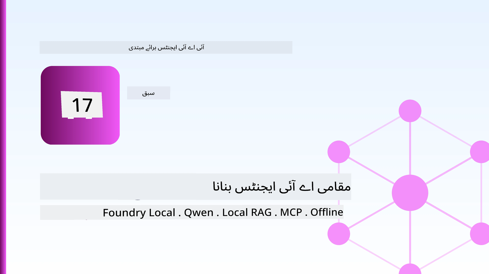
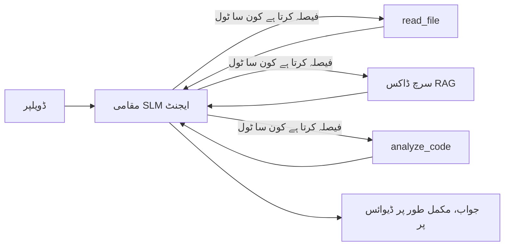
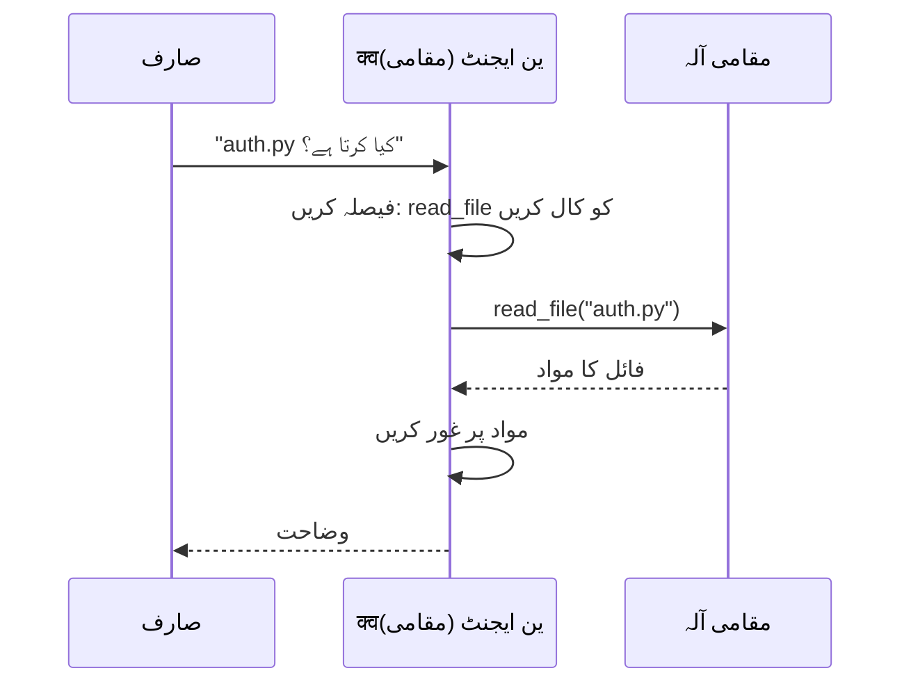
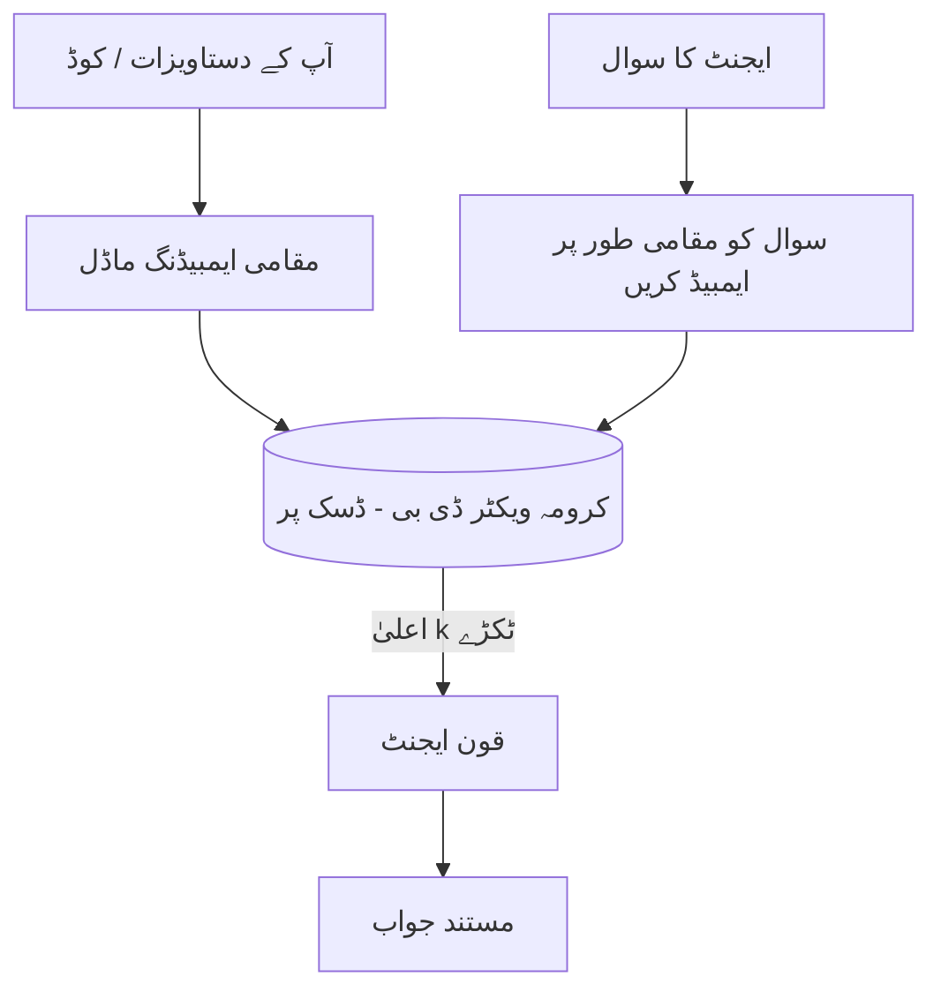
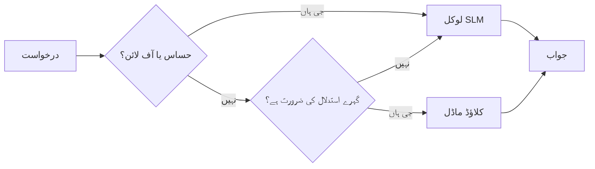

# مائیکروسافٹ فاؤنڈری لوکل اور کوئن کے استعمال سے مقامی AI ایجنٹس کی تخلیق



پچھلے سبق میں ایجنٹس کو کلاؤڈ میں *اوپر* بڑھایا گیا تھا۔ یہ انہیں ایک ہی مشین پر *نیچے* لے آتا ہے۔ آخر تک آپ کے پاس ایک کام کرنے والا انجینئرنگ اسسٹنٹ ہوگا جو دلیل دیتا ہے، ٹولز کو کال کرتا ہے، آپ کی فائلیں پڑھتا ہے، اور آپ کی دستاویزات تلاش کرتا ہے — **بغیر کسی کلاؤڈ انفرنس کال کے۔**

آپ یہ کیوں چاہیں گے؟ تین وجوہات جو حقیقی انجینئرنگ کام میں مسلسل سامنے آتی ہیں:

- **پرائیویسی۔** کوڈ اور دستاویزات کبھی مشین سے باہر نہیں جاتیں۔ کوئی پرامپٹ، کوئی سنیپٹ، کوئی کلائنٹ کا ڈیٹا نیٹ ورک کی حد عبور نہیں کرتا۔
- **قیمت۔** مقامی انفرنس کی کوئی فی-ٹوکن بلنگ نہیں ہوتی۔ آپ بجلی کی قیمت پر پورا دن دہرا سکتے ہیں۔
- **آف لائن۔** ہوائی جہاز میں، محفوظ جگہ پر، یا بندش کے دوران، ایجنٹ پھر بھی کام کرتا ہے۔

گرفت یہ ہے کہ آپ ایک جدید کلاؤڈ ماڈل کے بدلے ایک **چھوٹے زبان ماڈل (SLM)** کا تبادلہ کر رہے ہیں جو آپ کے CPU، GPU، یا NPU پر چل رہا ہے۔ یہ سبق ایسے ایجنٹس بنانے کے بارے میں ہے جو اس حد کے اندر *اچھے* ہوں بجائے اس کے کہ اس حد کو نظر انداز کریں۔

## تعارف

یہ سبق درج ذیل موضوعات کا احاطہ کرے گا:

- **چھوٹے زبان ماڈلز (SLMs)** — یہ کیا ہیں، کہاں بہتر کام کرتے ہیں، اور کہاں نہیں۔
- **مائیکروسافٹ فاؤنڈری لوکل** — ایک رن ٹائم جو ماڈلز کو ڈاؤن لوڈ اور آلہ پر **OpenAI-مطابقت رکھنے والے API** کے ذریعے فراہم کرتا ہے۔
- **کوئن فنکشن کالنگ ماڈلز** — SLMs جو بھروسہ مند طریقے سے ٹول کالز پیدا کرتے ہیں، جو مقامی *ایجنٹس* (صرف مقامی چیٹ نہیں) کو ممکن بناتا ہے۔
- **مقامی ٹولز، مقامی RAG، اور مقامی MCP** — جو ایجنٹ کو کلاؤڈ کے بغیر صلاحیت فراہم کرتے ہیں۔
- **ہائبرڈ پیٹرنز** — کب چیزیں مقامی رکھنی ہیں اور کب کلاؤڈ تک رسائی کرنی ہے۔

## سیکھنے کے مقاصد

اس سبق کو مکمل کرنے کے بعد، آپ جانیں گے کہ کیسے:

- SLMs کے فائدے اور نقصانات کی وضاحت کریں اور مناسب مقامی ایجنٹ کے استعمال کے کیس منتخب کریں۔
- فاؤنڈری لوکل کے ذریعے کوئن ماڈل کو مقامی طور پر سرور کریں اور OpenAI-مطابقت رکھنے والے اینڈ پوائنٹ کے ذریعے اس سے جڑیں۔
- ایسا ٹول-کالنگ ایجنٹ بنائیں جو مکمل طور پر آپ کے ورک سٹیشن پر چلے۔
- اپنی دستاویزات پر مقامی RAG لگائیں جس کے لیے مقامی ویکٹر ڈیٹا بیس (کرومبا) کا استعمال کریں۔
- ایجنٹ کو مقامی MCP سرور سے منسلک کریں اور ہائبرڈ مقامی/کلاؤڈ ڈیزائنز پر غور کریں۔

## ضروریات

یہ سبق فرض کرتا ہے کہ آپ نے پہلے کے اسباق مکمل کر لیے ہیں اور آپ کو یہ چیزیں آتی ہیں:

- [ٹول استعمال](../04-tool-use/README.md) (سبق 4) اور [ایجنٹک RAG](../05-agentic-rag/README.md) (سبق 5)۔
- [ایجنٹک پروٹوکولز / MCP](../11-agentic-protocols/README.md) (سبق 11)۔
- [مائیکروسافٹ ایجنٹ فریم ورک](../14-microsoft-agent-framework/README.md) (سبق 14)۔

آپ کو درج ذیل کی بھی ضرورت ہوگی:

- ایک ڈیولپر ورک سٹیشن۔ **8 GB RAM ایک حقیقت پسندانہ کم از کم ہے**؛ 16 GB+ آرام دہ ہے۔ GPU یا NPU مددگار ہے مگر ضروری نہیں۔
- **مائیکروسافٹ فاؤنڈری لوکل** نصب ہو (نیچے سیٹ اپ سیکشن دیکھیں)۔
- پائتھن 3.12+ اور ریپوزٹری میں موجود پیکجز [`requirements.txt`](../../../requirements.txt)، نیز `foundry-local-sdk`، `openai`، اور `chromadb` اس سبق کے لیے۔

## چھوٹے زبان ماڈلز: مقامی کام کے لیے صحیح آلہ


ایک فرنٹیئر کلاؤڈ ماڈل میں سینکڑوں اربوں پیرامیٹرز ہوتے ہیں اور اس کے پیچھے ایک ڈیٹا سینٹر ہوتا ہے۔ ایک SLM میں کچھ ارب پیرامیٹرز ہوتے ہیں اور اسے آپ کے لیپ ٹاپ کی RAM میں فٹ ہونا ہوتا ہے۔ یہ فرق واضح توقعات قائم کرتا ہے۔

**SLM میں یہ چیزیں اچھی ہوتی ہیں:**

- منظم، محدود کام — کسی معروف دستاویز کی درجہ بندی، استخراج، خلاصہ سازی۔
- **ٹول کالنگ** — یہ فیصلہ کرنا کہ کون سا فنکشن کال کرنا ہے اور کس دلائل کے ساتھ۔
- تیز، سستا، نجی تکرار آپ کے اپنے ڈیٹا پر۔

**SLM میں کمزوری یہ ہے:**

- بڑے سیاق و سباق میں کھلی، کثیر سطحی استدلال۔
- وسیع عالمی علم (انہوں نے کم دیکھا ہے، اور زیادہ بھول جاتے ہیں)۔

لہذا مقامی ایجنٹس کے لیے جیتنے کی حکمت عملی یہ ہے: **SLM کو آرکیسٹریٹ کرنے دیں، اور ٹولز کو بھاری کام کرنے دیں۔** ماڈل کو آپ کا کوڈ بیس *جاننے* کی ضرورت نہیں — اسے صرف یہ جاننے کی ضرورت ہے کہ `read_file` اور `search_docs` کب کال کرنا ہے۔ یہ براہ راست SLM کی طاقتوں سے جڑتا ہے۔



## Microsoft Foundry Local

**Microsoft Foundry Local** ایک ہلکا پھلکا رن ٹائم ہے جو ماڈلز کو مکمل طور پر آپ کے مشین پر ڈاؤن لوڈ، منظم اور فراہم کرتا ہے۔ ہمارے لیے اس کی سب سے اہم خصوصیت یہ ہے کہ یہ ایک **OpenAI-مطابق HTTP اینڈپوائنٹ** فراہم کرتا ہے — جس کا مطلب ہے کہ OpenAI SDK اور Microsoft Agent Framework کا OpenAI کلائنٹ صرف `base_url` کی تبدیلی کے ساتھ اس کے خلاف کام کرتے ہیں۔ آپ نے جو ایجنٹس بنانے کے بارے میں سیکھا ہے وہ براہ راست منتقل ہوتا ہے؛ صرف اینڈپوائنٹ کلاؤڈ سے `localhost` پر آ جاتا ہے۔

Foundry Local آپ کے ہارڈویئر کے لیے خودکار طور پر ماڈل کی بہترین بلڈ منتخب کرتا ہے — چاہے وہ CPU بلڈ ہو، CUDA/GPU بلڈ ہو، یا NPU بلڈ ہو — تاکہ آپ ہر مشین کے لیے دستی اصلاح نہ کریں۔

### سیٹ اپ

Foundry Local انسٹال کریں (اپنے OS کی [دستاویزات](https://learn.microsoft.com/azure/ai-foundry/foundry-local/) دیکھیں)، پھر تصدیق کریں کہ یہ کام کرتا ہے:

```bash
# انسٹال کریں (مثال کے طور پر؛ اپنے پلیٹ فارم کے لیے دستاویزات پر عمل کریں)
winget install Microsoft.FoundryLocal      # ونڈوز
# brew install microsoft/foundrylocal/foundrylocal   # میک او ایس

# ایک Qwen ماڈل ڈاؤن لوڈ کریں اور چلائیں، پھر مقامی سروس شروع کریں
foundry model run qwen2.5-7b-instruct
foundry service status
```

جب یہ سروس چل رہی ہو تو آپ کے پاس ایک مقامی، OpenAI مطابقت پذیر اینڈپوائنٹ ہوتا ہے (عام طور پر `http://localhost:PORT/v1`)۔ نوٹ بک `foundry-local-sdk` استعمال کرکے اینڈپوائنٹ کو خود بخود دریافت کرتی ہے، اس لیے آپ کو پورٹ ہارڈ کوڈ کرنے کی ضرورت نہیں ہے۔

## Qwen فنکشن کالنگ: یہ کیوں اہم ہے

ایک ایجنٹ صرف اسی صورت میں ایجنٹ ہوتا ہے جب یہ ٹولز کو کال کر سکے۔ کئی SLM چیٹ کر سکتے ہیں لیکن ناقابل اعتماد، خراب شدہ ٹول کالز بناتے ہیں۔ **Qwen** ماڈلز فنکشن کالنگ کے لیے تربیت یافتہ ہیں اور اچھی طرح سے بنے ہوئے ٹول کال ڈھانچے مستقل طور پر خارج کرتے ہیں — جو بالکل وہی ہے جو ایک مقامی چیٹ ماڈل کو مقامی *ایجنٹ* میں بدل دیتا ہے۔

یہ عمل وہی معیاری ٹول کالنگ لوپ ہے جسے آپ پہلے سے جانتے ہیں، بس یہ ڈیوائس پر چل رہا ہے:



## مقامی RAG

دستاویزی تلاش وہ جگہ ہے جہاں مقامی ایجنٹس اپنی اہمیت ثابت کرتے ہیں۔ اس کے بجائے کہ یہ امید کی جائے کہ SLM نے آپ کے فریم ورک کی دستاویزات یاد کر رکھی ہیں، آپ ان دستاویزات کو **مقامی ویکٹر ڈیٹا بیس** میں امبیڈ کرتے ہیں اور ایجنٹ کو متعلقہ حصے طلب کرنے دیتے ہیں۔

ہم **Chroma** استعمال کرتے ہیں، ایک ایمبیڈڈ ویکٹر اسٹور جو بغیر کسی سرور کے پراسیس میں چلتا ہے۔ مکمل عمل بالکل مقامی ہے: مقامی ایمبیڈنگ ماڈل → مقامی ویکٹرز → مقامی بازیافت → مقامی SLM۔



یہ وہی Agentic RAG پیٹرن ہے جو سبق 5 میں تھا — واحد تبدیلی یہ ہے کہ ہر جزو آپ کی مشین پر چل رہا ہے۔

## مقامی MCP سرورز


[MCP](../11-agentic-protocols/README.md) ایک ٹرانسپورٹ ہے، کلاؤڈ سروس نہیں۔ ایک MCP سرور بطور مقامی پراسیس `stdio` پر چل سکتا ہے، جو آپ کے ایجنٹ کو معیاری پروٹوکول کے ذریعے ٹولز فراہم کرتا ہے۔ اس سے آپ MCP سرورز کے بڑھتے ہوئے ماحولیاتی نظام کو دوبارہ استعمال کر سکتے ہیں — فائل سسٹم کی رسائی، git آپریشنز، ڈیٹا بیس کی پوچھ گچھ — مکمل طور پر آف لائن۔

سیکیورٹی کا انداز کلاؤڈ سے مختلف ہے، لیکن موجود ہے: ایک مقامی MCP سرور اب بھی آپ کے صارف کی اجازتوں کے ساتھ چلتا ہے، اس لیے اس کی رسائی کو محدود کریں کہ وہ کیا چھو سکتا ہے (مثلاً ایک پراجیکٹ ڈائریکٹری، پورے ہوم فولڈر کی نہیں) اور اس کے نتائج کو بطور ان پٹ سمجھ کر تصدیق کریں۔

## ہائبرڈ کلاؤڈ اور مقامی پیٹرنز

لوکل-فرسٹ کا مطلب صرف لوکل ہونا نہیں ہے۔ پختہ نظام حساسیت اور مشکل کی بنیاد پر راستہ بناتے ہیں:

| صورتحال | کہاں چلتا ہے |
| --- | --- |
| حساس کوڈ / ڈیٹا، یا آف لائن | **مقامی SLM** |
| سادہ، محدود کام | **مقامی SLM** (سستا، تیز) |
| غیر حساس ڈیٹا پر مشکل کثیر مرحلہ وجدان | **کلاؤڈ ماڈل** |
| ہر چیز، بندش کے دوران | **مقامی SLM** (حسنِ سلوک سے کمی) |

یہ سبق 16 کے **ماڈل راؤٹنگ** کے خیال کی عکاسی کرتا ہے — سوائے اس کے کہ ایک "ماڈل" اب آپ کی اپنی مشین ہے۔ ایک مضبوط ڈیزائن کلاؤڈ کی غیر دستیابی پر لوکل پر واپس آ جاتا ہے، اس لیے ایجنٹ معیار میں کمی کرتا ہے بجائے کہ بالکل فیل ہو جائے۔



## عملی تجربہ: ایک مقامی انجینئرنگ اسسٹنٹ

[`code_samples/17-local-agent-foundry-local.ipynb`](./code_samples/17-local-agent-foundry-local.ipynb) کھولیں اور اس پر کام کریں۔ آپ ایک **مقامی انجینئرنگ اسسٹنٹ** بنائیں گے جو مکمل طور پر آپ کے ورک سٹیشن پر چلتا ہے اور کر سکتا ہے:

1. **ٹولز کو کال کرے** — Foundry Local کے ذریعے Qwen فنکشن کالنگ کے ذریعہ۔
2. **مقامی فائل آپریشنز کرے** — پراجیکٹ ڈائریکٹری میں فائلوں کی فہرست بنائے اور پڑھے۔
3. **کوڈ کا تجزیہ کرے** — سورس فائل پر بنیادی میٹرکس رپورٹ کرے۔
4. **دستاویزات تلاش کرے** — Chroma کے ساتھ ڈاک فولڈر پر مقامی RAG۔
5. **MCP استعمال کرے** — ایک مقامی MCP سرور سے جُڑے (اگر کوئی ترتیب نہ دیا گیا ہو تو حسن سلوکی کے ساتھ چھوڑ دے)۔

کسی بھی موقع پر کلاؤڈ انفرنس استعمال نہیں ہوتی۔

### واک تھرو

اسسٹنٹ Foundry Local سے OpenAI مطابقت پذیر اینڈ پوائنٹ کے ذریعے جڑتا ہے، اس لیے ایجنٹ کوڈ کلاؤڈ سبقوں کی طرح ہی دکھائی دیتا ہے — صرف کلائنٹ بدلتا ہے:

```python
from foundry_local import FoundryLocalManager
from openai import OpenAI

# فاؤنڈری لوکل ماڈل کو دریافت کرتا ہے/ڈاؤن لوڈ کرتا ہے اور ہمیں ایک مقامی اینڈ پوائنٹ دیتا ہے۔
manager = FoundryLocalManager(\"qwen2.5-7b-instruct\")
client = OpenAI(base_url=manager.endpoint, api_key=manager.api_key)  # api_key ایک مقامی پلیس ہولڈر ہے
```

ٹولز عام Python فنکشنز ہیں جو ایک پراجیکٹ ڈائریکٹری تک محدود ہیں:

```python
def read_file(path: str) -> str:
    \"\"\"Read a file, but only inside the sandboxed project directory.\"\"\"
    full = (PROJECT_ROOT / path).resolve()
    if PROJECT_ROOT not in full.parents and full != PROJECT_ROOT:
        return \"Access denied: path is outside the project directory.\"
    return full.read_text(encoding=\"utf-8\")
```

سینڈباکس چیک کا دھیان رکھیں — یہاں تک کہ مقامی طور پر ایک ایسا ٹول جو بے ترتیب راستے پڑھتا ہے، خطرناک ہے۔ نوٹ بک ہر ٹول کو صرف ایک پراجیکٹ روٹ تک محدود رکھتی ہے۔

## علم کی جانچ

اسائنمنٹ پر جانے سے پہلے اپنی سمجھ کو پرکھیں۔

**1. کلاؤڈ میں چلانے کی بجائے ایجنٹ کو مقامی طور پر چلانے کی دو ٹھوس وجوہات بتائیں۔**

<details>
<summary>جواب</summary>

کوئی بھی دو: **پرائیویسی** (کوڈ اور ڈیٹا مشین سے نہیں نکلتے)، **لاگت** (کوئی فی ٹوکن انفرنس بل نہیں)، اور **آف لائن قابلیت** (نیٹ ورک کے بغیر کام کرتا ہے — ہوائی جہاز میں، محفوظ جگہ پر، یا بندش کے دوران)۔ ریگولیٹری/تعمیل کی پابندیاں جو ڈیٹا کو آلے سے باہر بھیجنے سے روکتی ہیں، پرائیویسی وجوہات کی ایک عام محرک ہیں۔
</details>

**2. ایک مقامی ایجنٹ میں SLM اور اس کے ٹولز کے درمیان کام کی تقسیم کیا ہو اور کیوں؟**

<details>
<summary>جواب</summary>

SLM کو **انتظامی ذمہ داری** دیجیے (یہ فیصلہ کرے کہ کون سا ٹول کب اور کن دلائل کے ساتھ کال کرنا ہے) اور **ٹولز کو بھاری کام انجام دینے دیں** (فائلیں پڑھنا، دستاویزات حاصل کرنا، نتائج کا حساب کرنا)۔ SLM محدود فیصلوں جیسے ٹول چناؤ میں مضبوط ہوتے ہیں لیکن وسیع علم اور طویل کثیر مرحلہ وجدان میں کمزور، اس لیے ٹولز پر انحصار ان کی صلاحیتوں کو مدد دیتا ہے۔
</details>

**3. Foundry Local کے ساتھ کلاؤڈ ایجنٹ کوڈ کو دوبارہ استعمال کرنا ممکن بناتا ہے؟**

<details>
<summary>جواب</summary>

Foundry Local ایک **OpenAI مطابقت پذیر HTTP اینڈ پوائنٹ** فراہم کرتا ہے۔ OpenAI SDK اور Agent Framework کا OpenAI کلائنٹ صرف `base_url` کو تبدیل کر کے (مقامی پلیس ہولڈر API کی کے استعمال کے ساتھ) اس کے خلاف کام کرتے ہیں۔ ایجنٹ کوڈ کے باقی حصے میں کوئی تبدیلی نہیں ہوتی۔
</details>

**4. ہم خاص طور پر کسی بھی SLM کی بجائے Qwen فنکشن کالنگ ماڈل کیوں استعمال کرتے ہیں؟**

<details>
<summary>جواب</summary>

کیونکہ ایک ایجنٹ کو قابلِ اعتماد اور صحیح ساخت والے **ٹول کالز** پیدا کرنے ہوتے ہیں۔ بہت سے SLM چیٹ کر سکتے ہیں لیکن غلط یا عدم مطابقت والے ٹول کال سٹرکچر پیدا کرتے ہیں۔ Qwen ماڈلز فنکشن کالنگ کے لیے تربیت یافتہ ہیں اور مستقل ٹول کالز پیدا کرتے ہیں، جو ایک مقامی چیٹ ماڈل کو عملی مقامی ایجنٹ میں تبدیل کرتا ہے۔
</details>

**5. مقامی RAG پائپ لائن میں کون سے اجزاء مشین پر چلتے ہیں؟**

<details>
<summary>جواب</summary>

تمام: ایمبیڈنگ ماڈل، ویکٹر ڈیٹا بیس (Chroma، ڈسک پر)، بازیابی کا مرحلہ، اور SLM۔ دستاویزات مقامی طور پر ایمبیڈ کی جاتی ہیں، مقامی طور پر محفوظ کی جاتی ہیں، مقامی طور پر حاصل کی جاتی ہیں، اور مقامی ماڈل کی طرف سے تجزیہ کی جاتی ہیں — کوئی بھی جزو کلاؤڈ کو نہیں چھوتا۔
</details>

**6. ایک مقامی MCP سرور آپ کی مشین پر چلتا ہے۔ کیا یہ خود بخود محفوظ ہو جاتا ہے؟ پھر آپ کو کیا احتیاطی تدابیر اختیار کرنی چاہئیں؟**

<details>
<summary>جواب</summary>

نہیں۔ ایک مقامی MCP سرور آپ کے صارف کی اجازتوں کے ساتھ چلتا ہے، اس لیے یہ وہی چیزیں چھو سکتا ہے جو آپ کر سکتے ہیں۔ اسے صرف اتنا دائرہ کار دیں جتنا ضروری ہو (مثلاً پورے ہوم فولڈر کی جگہ صرف ایک پراجیکٹ ڈائریکٹری) اور اس کے آؤٹ پٹس کو ان پٹس سمجھ کر عمل کرنے سے پہلے تصدیق کریں۔
</details>

**7. ایک معقول ہائبرڈ راؤٹنگ کا قاعدہ بیان کریں جس میں ایک مقامی ماڈل شامل ہو۔**

<details>
<summary>جواب</summary>

حساس یا آف لائن درخواستوں کو مقامی SLM کی طرف بھیجیں؛ سادہ محدود کاموں کو تیز اور سستی کی خاطر مقامی SLM کی طرف بھیجیں؛ غیر حساس ڈیٹا پر مشکل کثیر مرحلہ وجدان کے لیے کلاؤڈ ماڈل کو بھیجیں؛ اور اگر کلاؤڈ دستیاب نہ ہو تو مقامی SLM پر واپس آ جائیں تاکہ ایجنٹ حسن سلوک کے ساتھ خراب ہو بجائے کہ بالکل ناکام ہو۔ یہ سبق 16 کے ماڈل راؤٹنگ کا تصور ہے جس میں مقامی مشین ایک ماڈل ہے۔
</details>

**8. اس سبق میں مقامی ایجنٹ چلانے کے لیے حقیقی کم از کم ریم کی مقدار کیا ہے، اور زیادہ ریم سے کیا فائدہ ہوتا ہے؟**

<details>
<summary>جواب</summary>

قریب **8 GB** ایک حقیقی کم از کم ہے؛ 16 GB یا اس سے زیادہ آرام دہ ہے۔ زیادہ ریم آپ کو بڑے، زیادہ قابل ماڈلز چلانے اور مزید سیاق و سباق کو یادداشت میں رکھنے دیتی ہے۔ GPU یا NPU انفرنس کو تیز کرتے ہیں مگر ضروری نہیں — Foundry Local جب کوئی ایکسیلیریٹر دستیاب نہ ہو تو CPU بلڈ کا انتخاب کرتا ہے۔
</details>

## اسائنمنٹ

مقامی انجینئرنگ اسسٹنٹ کو اپنے منتخب کردہ چھوٹے پراجیکٹ کے لیے ایک **مقامی دستاویزات کے جائزہ کار** میں تبدیل کریں (اگر چاہیں تو اس ریپو کے سبق فولڈرز میں سے کوئی استعمال کریں)۔

آپ کی جمع کروائی:

1. حقیقی ڈاک/کوڈ فولڈر کو Chroma میں انڈیکس کریں (کم از کم پانچ فائلیں)۔

2. **ایک `find_todos` ٹول شامل کریں** جو پراجیکٹ میں `TODO`/`FIXME` تبصروں کو اسکین کرے اور انہیں فائل اور لائن نمبر کے ساتھ واپس کرے — بالکل ویسے ہی سینڈ باکس چیک کے ساتھ جیسا کہ `read_file` میں ہوتا ہے۔

3. **ایجنٹ سے تین سوال پوچھیں** جو اسے ٹولز کو اکٹھا کرنے پر مجبور کریں: ایک خالص RAG سوال، ایک جو مخصوص فائل پڑھنے کا تقاضا کرے، اور ایک جو TODOs تلاش کرنے کی ضرورت ہو۔
4. **اس کی پیمائش کریں**: تینوں جوابات کے وقت کو ناپیں اور اسے ایک مارک ڈاؤن سیل میں نوٹ کریں۔ تبصرہ کریں کہ آیا اس کا تاخیر آپ کے مطلوبہ ورک فلو کے لیے قابل قبول ہے یا نہیں۔

پھر ایک مختصر پیراگراف لکھیں کہ **آپ اس ریویور کے لیے کیا کلاؤڈ میں منتقل کریں گے اور کیا لوکل رکھیں گے**، اور کیوں۔ آپ کی تشخیص اس بات پر ہوگی کہ آیا لوکل اجزاء صحیح طریقے سے جوڑے گئے ہیں اور آیا آپ کی سہ مرکب استدلال درست ہے — ماڈل کی کوالٹی پر نہیں۔

## خلاصہ

اس سبق میں آپ نے ایک ایجنٹ بنایا جو مکمل طور پر آپ کے اپنے مشین پر چلتا ہے:

- **SLMs** پرائیویسی، لاگت، اور آف لائن آپریشن کے بدلے وسعت کا سودا کرتے ہیں — اور تب چمکتے ہیں جب وہ **ٹولز کو مربوط کرتے ہیں** نہ کہ تمام علم خود سنبھالتے ہیں۔
- **Foundry Local** ماڈلز کو آلے پر **OpenAI-compatible endpoint** کے پیچھے فراہم کرتا ہے، تاکہ آپ کا کلاؤڈ ایجنٹ کوڈ ایک لائن کی تبدیلی کے ساتھ منتقل ہو سکے۔
- **Qwen function-calling models** قابل اعتماد لوکل ٹول کالنگ کو ممکن بناتے ہیں — اور اس طرح لوکل *ایجنٹس* کو بھی۔
- **Local RAG** (Chroma) اور **local MCP** ایجنٹ کو مشین چھوڑے بغیر صلاحیت دیتے ہیں۔
- **Hybrid patterns** آپ کو حساسیت اور مشکل کی بنیاد پر راستہ فراہم کرنے دیتے ہیں، جہاں لوکل گریس فل بیک کے طور پر کام کرتا ہے۔

یہ تعیناتی کا چکر مکمل کرتا ہے: سبق 16 نے ایجنٹس کو Microsoft Foundry میں وسیع کیا، اور یہ سبق انہیں ایک واحد ورک اسٹیشن پر سکالڈ کیا۔ اگلا سبق تعینات کردہ ایجنٹس کی سلامتی پر توجہ دیتا ہے۔

## مزید وسائل

- <a href="https://learn.microsoft.com/azure/ai-foundry/foundry-local/" target="_blank">Microsoft Foundry Local دستاویزات</a>
- <a href="https://learn.microsoft.com/azure/ai-foundry/what-is-azure-ai-foundry" target="_blank">Microsoft Foundry کی دستاویزات</a>
- <a href="https://aka.ms/ai-agents-beginners/agent-framework" target="_blank">Microsoft Agent Framework</a>
- <a href="https://qwen.readthedocs.io/en/latest/framework/function_call.html" target="_blank">Qwen function calling دستاویزات</a>
- <a href="https://modelcontextprotocol.io/" target="_blank">Model Context Protocol (MCP)</a>
- <a href="https://docs.trychroma.com/" target="_blank">Chroma vector database</a>

## پچھلا سبق

[Deploying Scalable Agents](../16-deploying-scalable-agents/README.md)

## اگلا سبق

[Securing AI Agents](../18-securing-ai-agents/README.md)

---

<!-- CO-OP TRANSLATOR DISCLAIMER START -->
**ڈس کلیمر**:
یہ دستاویز AI ترجمہ سروس [Co-op Translator](https://github.com/Azure/co-op-translator) کے ذریعے ترجمہ کی گئی ہے۔ جبکہ ہم درستگی کے لیے کوشاں ہیں، براہ کرم اس بات سے آگاہ رہیں کہ خودکار ترجمے میں غلطیاں یا عدم درستیاں ہو سکتی ہیں۔ اصل دستاویز اپنے مادری زبان میں مستند ماخذ سمجھی جائے گی۔ حساس معلومات کے لیے پیشہ ور انسانی ترجمہ کی سفارش کی جاتی ہے۔ اس ترجمے کے استعمال سے پیدا ہونے والی کسی بھی غلط فہمی یا غلط تشریح کی ذمہ داری ہم قبول نہیں کرتے۔
<!-- CO-OP TRANSLATOR DISCLAIMER END -->