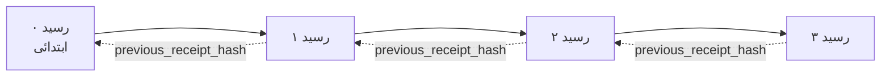

[سبق کا ویڈیو دیکھیں: کرپٹوگرافک رسیدات کے ساتھ AI ایجنٹس کی حفاظت](https://youtu.be/PLACEHOLDER_VIDEO_ID)

> _(سبق کا ویڈیو اور تھمب نیل مائیکروسافٹ مواد ٹیم کے ذریعہ مرج کے بعد شامل کیا جائے گا ، سبق 14 / 15 کے نمونہ سے میل کھاتے ہوئے.)_

# کرپٹوگرافک رسیدات کے ساتھ AI ایجنٹس کی حفاظت

## تعارف

یہ سبق درج ذیل موضوعات کا احاطہ کرے گا:

- کیوں AI ایجنٹس کے لیے آڈٹ ٹریلز تعمیل، ڈی بگنگ، اور اعتماد کے لیے اہم ہیں۔
- کرپٹوگرافک رسید کیا ہے اور یہ بغیر دستخط شدہ لاگ لائن سے کیسے مختلف ہے۔
- ایجنٹ کے ٹول کال کے لیے ایک دستخط شدہ رسید کیسے بنائی جائے عام Python میں۔
- رسید کو آف لائن کیسے تصدیق کریں اور چھیڑ چھاڑ کا پتہ لگائیں۔
- رسیدات کو چین میں کیسے جوڑا جائے تاکہ کسی ایک رسید کو حذف یا دوبارہ ترتیب دینے سے چین ٹوٹ جائے۔
- رسیدات کیا ثابت کرتی ہیں اور وہ واضح طور پر کیا ثابت نہیں کرتیں۔

## سیکھنے کے مقاصد

اس سبق کو مکمل کرنے کے بعد، آپ جان لیں گے کہ کیسے:

- وہ ناکامی کے طریقے شناخت کریں جو ایجنٹ کے اقدامات کے لیے کرپٹوگرافک ماخذ کا محرک ہیں۔
- ایک canonical JSON payload پر Ed25519-دستخط شدہ رسید بنائیں۔
- صرف دستخط کرنے والے کی پبلک کی استعمال کر کے رسید کی آزادانہ تصدیق کریں۔
- ایک ترمیم شدہ رسید پر دوبارہ تصدیق چلانے سے چھیڑ چھاڑ کا پتہ لگائیں۔
- رسیدات کی ایک ہیش چینڈ سلسلہ تیار کریں اور بتائیں کہ یہ سلسلہ کیوں اہم ہے۔
- یہ پہچانیں کہ رسیدات کیا ثابت کرتی ہیں (منسوبیت، سالمیت، ترتیب) اور کیا نہیں کرتیں (عمل کی درستگی، پالیسی کی سچائی)۔

## مسئلہ: آپ کے ایجنٹ کا آڈٹ ٹریل

تصور کریں کہ آپ نے Contoso Travel کے لیے ایک AI ایجنٹ تعینات کیا ہے۔ ایجنٹ گاہک کی درخواستیں پڑھتا ہے، پروازوں کے API کو کال کرتا ہے آپشنز دیکھنے کے لیے، اور گاہک کی جانب سے سیٹ بک کرتا ہے۔ پچھلے سہ ماہی میں، ایجنٹ نے 50,000 بکنگز کا عمل کیا۔

آج ایک آڈیٹر آتا ہے۔ وہ ایک سادہ سوال پوچھتا ہے: "مجھے دکھائیں کہ آپ کے ایجنٹ نے کیا کیا۔"

آپ اپنی لاگ فائلیں حوالے کرتے ہیں۔ آڈیٹر انہیں دیکھتا ہے اور مشکل سوال پوچھتا ہے: "میں کیسے جان سکتا ہوں کہ ان لاگز میں ترمیم نہیں کی گئی؟"

یہ آڈٹ ٹریل کا مسئلہ ہے۔ آج کل زیادہ تر ایجنٹ کی جگہیں ان پر انحصار کرتی ہیں:

- **ایپلیکیشن لاگز**: جو خود ایجنٹ لکھتا ہے، اور فائل سسٹم تک رسائی رکھنے والے کوئی بھی انہیں ترمیم کر سکتا ہے۔
- **کلاؤڈ لاگنگ سروسز**: پلیٹ فارم کی سطح پر چھیڑ چھاڑ کا پتہ چلتا ہے مگر صرف اگر آڈیٹر پلیٹ فارم آپریٹر پر اعتماد کرے۔
- **ڈیٹا بیس ٹرانزیکشن لاگز**: ڈیٹا بیس کی تبدیلیوں کے لیے مناسب لیکن کسی بھی ٹول کال کے لیے نہیں۔

ان میں سے کوئی بھی آڈیٹر کے سوال کا جواب اس کے بغیر نہیں دے سکتا کہ وہ کسی پر اعتماد کرے (آپ، آپ کا کلاؤڈ فراہم کنندہ، آپ کے ڈیٹا بیس فراہم کنندہ)۔ اندرونی استعمال کے لیے یہ اعتماد قابلِ قبول ہوتا ہے۔ ریگولیٹڈ ورک لوڈز (فنانس، ہیلتھ کیئر، EU AI ایکٹ کے تابع) کے لیے یہ قابل قبول نہیں ہے۔

کرپٹوگرافک رسیدات اس مسئلہ کو حل کرتی ہیں کیونکہ ہر ایجنٹ کے عمل کی آزاد تصدیق ممکن ہوتی ہے۔ آڈیٹر کو آپ پر اعتماد کرنے کی ضرورت نہیں ہے۔ انہیں صرف آپ کی پبلک کلید اور خود رسید کی ضرورت ہوتی ہے۔

## کرپٹوگرافک رسید کیا ہے؟

رسید ایک JSON آبجیکٹ ہے جو درج کرتا ہے کہ ایجنٹ نے کیا کیا، اور اسے ڈیجیٹل دستخط کے ساتھ دستخط کیا گیا ہوتا ہے۔


ایک کم از کم رسید یوں دکھتی ہے:

```json
{
  "type": "agent.tool_call.v1",
  "agent_id": "contoso-travel-bot",
  "tool_name": "lookup_flights",
  "tool_args_hash": "sha256:a3f9c1...",
  "result_hash": "sha256:7b2e1d...",
  "policy_id": "contoso-travel-policy-v3",
  "timestamp": "2026-04-25T14:30:00Z",
  "sequence": 47,
  "previous_receipt_hash": "sha256:9d4e6a...",
  "signature": {
    "alg": "EdDSA",
    "sig": "c5af83...",
    "public_key": "8f3b2c..."
  }
}
```

تین خصوصیات کام کر رہی ہیں:

1. **دستخط**۔ رسید ایجنٹ کے گیٹ وے کے ذریعہ Ed25519 پرائیویٹ کی سے دستخط کی جاتی ہے۔ جو کوئی بھی متعلقہ پبلک کی رکھتا ہے، وہ دستخط کو آف لائن تصدیق کر سکتا ہے۔ کسی بھی فیلڈ میں چھیڑ چھاڑ دستخط کو غلط بنا دیتی ہے۔

2. **کینونیکل انکوڈنگ**۔ دستخط کرنے سے پہلے، رسید JSON کینونیکلائزیشن اسکیم (JCS, RFC 8785) سے سیریلائز کی جاتی ہے۔ یہ اس بات کو یقینی بناتا ہے کہ دو مختلف عمل درآمدات جو ایک ہی منطقی رسید تیار کرتے ہیں بائٹ کی سطح پر بالکل ایک جیسے آؤٹ پٹ دیتے ہیں۔ بغیر کینونیکلائزیشن کے مختلف JSON سیریلائزرز مختلف دستخط بنائیں گے۔

3. **ہیش چیننگ**۔ `previous_receipt_hash` فیلڈ ہر رسید کو اس سے پہلے والی رسید سے مربوط کرتا ہے۔ ایک رسید کو ہٹانے یا دوبارہ ترتیب دینے سے اس کے بعد کی ہر رسید ٹوٹ جاتی ہے۔ چھیڑ چھاڑ چین کی سطح پر نظر آ جاتی ہے چاہے انفرادی دستخطوں کو نظر انداز کیا جائے۔

یہ خصوصیات مل کر تین ضمانتیں فراہم کرتی ہیں:

- **منسوبیت**: یہ کی نے اس مواد پر دستخط کیے۔
- **سالِمیت**: مواد دستخط کے بعد سے تبدیل نہیں ہوا۔
- **ترتیب**: یہ رسید اس رسید کے بعد چین میں آیا۔

## Python میں رسید تیار کرنا

رسید بنانے کے لیے آپ کو کوئی خاص لائبریری درکار نہیں۔ کرپٹوگرافک بنیادیات وسیع پیمانے پر دستیاب ہیں اور منطق چند دہائیاں Python کی لائنیں ہیں۔

`code_samples/18-signed-receipts.ipynb` میں ہینڈز آن مشق مکمل عمل دکھاتی ہے۔ خلاصہ ورژن:

```python
import json
import hashlib
import base64
from nacl import signing
from jcs import canonicalize  # آر ایف سی 8785 کینونیکل JSON

def b64url_nopad(data: bytes) -> str:
    return base64.urlsafe_b64encode(data).decode("ascii").rstrip("=")

def sha256_canonical(obj) -> str:
    """SHA-256 of a Python object's JCS-canonical JSON form."""
    return f"sha256:{hashlib.sha256(canonicalize(obj)).hexdigest()}"

# ایک دستخطی کلید تیار کریں یا لوڈ کریں (پیداوار میں، اسے کلید کے ذخیرے میں محفوظ کریں)
signing_key = signing.SigningKey.generate()
verify_key = signing_key.verify_key

# رسید کے مواد کو تیار کریں (ابھی دستخط نہیں)
tool_args = {"origin": "SYD", "destination": "LAX"}
tool_result = [{"flight": "QF11", "price": 1850, "stops": 0}]

payload = {
    "type": "agent.tool_call.v1",
    "agent_id": "contoso-travel-bot",
    "tool_name": "lookup_flights",
    "tool_args_hash": sha256_canonical(tool_args),
    "result_hash": sha256_canonical(tool_result),
    "policy_id": "contoso-travel-policy-v3",
    "timestamp": "2026-04-25T14:30:00Z",
    "sequence": 0,
    "previous_receipt_hash": None,
}

# معیاری بنائیں، ہیش کریں، دستخط کریں۔
canonical_bytes = canonicalize(payload)
message_hash = hashlib.sha256(canonical_bytes).digest()
signature_bytes = signing_key.sign(message_hash).signature

# ایک منظم دستخطی آبجیکٹ منسلک کریں۔
receipt = {
    **payload,
    "signature": {
        "alg": "EdDSA",
        "sig": b64url_nopad(signature_bytes),
        "public_key": b64url_nopad(bytes(verify_key)),
    },
}
```

یہی پورا دستخطی عمل ہے۔ نوٹ بک میں ہر قدم کی وضاحت کی گئی ہے۔

## رسید کی تصدیق اور چھیڑ چھاڑ کا پتہ لگانا

تصدیق الٹا عمل ہے:

```python
import base64
import hashlib
from nacl import signing
from nacl.exceptions import BadSignatureError
from jcs import canonicalize

def b64url_decode(s: str) -> bytes:
    padding = "=" * ((4 - len(s) % 4) % 4)
    return base64.urlsafe_b64decode(s + padding)

def verify_receipt(receipt: dict) -> bool:
    # دستخط ایک منظم شئے ہے: {"alg", "sig", "public_key"}۔
    sig_obj = receipt.get("signature")
    if not sig_obj or sig_obj.get("alg") != "EdDSA":
        return False

    # اصل میں دستخط شدہ پے لوڈ کو دوبارہ تشکیل دیں (دستخط کے علاوہ سب کچھ)۔
    payload = {k: v for k, v in receipt.items() if k != "signature"}

    canonical_bytes = canonicalize(payload)
    message_hash = hashlib.sha256(canonical_bytes).digest()

    try:
        verify_key = signing.VerifyKey(b64url_decode(sig_obj["public_key"]))
        verify_key.verify(message_hash, b64url_decode(sig_obj["sig"]))
        return True
    except BadSignatureError:
        return False
```

یہ فنکشن ایک رسید لیتا ہے اور اگر دستخط درست ہو تو `True` واپس کرتا ہے، ورنہ `False`۔ کوئی نیٹ ورک کال نہیں، کوئی سروس انحصار نہیں، کسی تیسرے فریق پر اعتماد کی ضرورت نہیں۔

چھیڑ چھاڑ کی شناخت کی مشق دیکھنے کے لیے، نوٹ بک ان کاموں کی وضاحت کرتی ہے:

1. ایک درست رسید تیار کرنا اور اس کی تصدیق کی تصدیق کرنا۔
2. `tool_args_hash` فیلڈ کے ایک بائٹ میں ترمیم کرنا۔
3. دوبارہ تصدیق چلانا اور ناکامی دیکھنا۔

یہ عملی مظاہرہ ہے کہ رسیدات چھیڑ چھاڑ کا پتہ دیتی ہیں: کوئی بھی چھوٹا سا ترمیم دستخط کو توڑ دیتی ہے۔

## متعدد مراحل والے ایجنٹس کے لیے رسیدات کی چیننگ

ایک واحد دستخط شدہ رسید ایک عمل کی حفاظت کرتی ہے۔ رسیدات کی ایک چین ایک سلسلہ کی حفاظت کرتی ہے۔



ہر رسید اس سے پہلے کی رسید کا ہیش ریکارڈ کرتی ہے۔ رسید 2 کو خاموشی سے ہٹانے کے لیے، حملہ آور کو یا تو:

- رسید 3 کے `previous_receipt_hash` فیلڈ میں ترمیم کرنی ہوگی (جو رسید 3 کے دستخط کو توڑ دے گا)، یا
- رسید 3 پر نیا دستخط جعلسازی کرنا ہوگا (جس کے لیے ایجنٹ کی پرائیویٹ کی درکار ہے)۔

اگر پرائیویٹ کی ہارڈویئر کی والٹ میں محفوظ ہو اور آپ ہر رسید کے ساتھ پبلک کی شائع کریں، تو دونوں حملے بغیر پتہ لگائے ممکن نہیں۔

نوٹ بک درج ذیل مراحل دکھاتی ہے:

1. تین رسیدات کی چین بنانا۔
2. تصدیق کرنا کہ ہر رسید کا `previous_receipt_hash` پچھلی رسید کے حقیقی ہیش سے میل کھاتا ہے۔
3. درمیان میں ایک رسید کے ساتھ چھیڑ چھاڑ کرنا اور دیکھنا کہ چین اسی مقام پر ٹوٹ جاتی ہے۔

یہ ہے وہ آڈٹ ٹریل جو ایک بیرونی آڈیٹر بغیر آپ پر اعتماد کیے تصدیق کر سکتا ہے۔

## رسیدات کیا ثابت کرتی ہیں (اور کیا نہیں)

یہ سبق کا سب سے اہم حصہ ہے۔ رسیدات طاقتور ہیں لیکن ان کی طاقت محدود ہے۔

**رسیدات تین چیزیں ثابت کرتی ہیں:**

1. **منسوبیت**: ایک مخصوص کی نے ایک مخصوص پے لوڈ پر دستخط کیے۔
2. **سالِمیت**: پے لوڈ دستخط کے بعد سے تبدیل نہیں ہوا۔
3. **ترتیب**: یہ رسید ہیش چین میں اس رسید کے بعد آیا۔

**رسیدات یہ ثابت نہیں کرتیں:**

1. **درستی**: کہ ایجنٹ کا عمل درست عمل تھا۔ رسید غلط جواب کے لیے آسانی سے دستخط کی جا سکتی ہے جیساکہ درست جواب کے لیے یہ کی گئی ہو۔
2. **پالیسی کی پابندی**: کہ `policy_id` میں حوالہ دی گئی پالیسی کی واقعی جانچ ہوئی، یا اگر جانچی گئی تو اس نے اس عمل کی اجازت دی ہوتی۔ رسید صرف دعویٰ کو ریکارڈ کرتی ہے، نفاذ کو نہیں۔
3. **کی سے آگے شناخت**: رسید کہتی ہے "یہ کی نے اس مواد پر دستخط کیا۔" یہ نہیں کہتی "یہ انسان نے اجازت دی۔" کی کو انسان یا ادارے سے منسلک کرنے کے لیے علیحدہ شناختی ڈھانچے کی ضرورت ہوتی ہے (جیسے ڈائریکٹری، پبلک کی رجسٹری وغیرہ)۔
4. **ان پٹ کی صداقت**: اگر ایجنٹ کو ترمیم شدہ پرامپٹ موصول ہوتا ہے اور اس پر عمل کرتا ہے، رسید عمل کو صحیح طریقے سے ریکارڈ کرتی ہے۔ رسیدات ان پٹ کی تصدیق کی جگہ نہیں بلکہ اس کے بعد کا مرحلہ ہیں۔

یہ حد بندی دو وجوہات کی وجہ سے اہم ہے:

- یہ بتاتی ہے کہ رسیدات کس چیز کے لیے مفید ہیں: ایجنٹ کے رویے کو آڈٹ کرنے اور چھیڑ چھاڑ کا پتہ لگانے کے لیے، حتیٰ کہ تنظیمی سرحدوں کے پار بھی۔
- یہ بتاتی ہے کہ آپ کو کونسی اضافی پرتوں کی ضرورت ہے: ان پٹ کی تصدیق (سبق 6)، پالیسی کا نفاذ (نیچے مختصر طور پر)، اور شناختی ڈھانچہ (اس سبق کے دائرہ سے باہر)۔

ایک عام غلطی یہ سمجھنا ہے کہ "ہمارے پاس رسیدات ہیں" مطلب "ہم حکومت یافتہ ہیں"۔ ایسا نہیں ہے۔ رسیدات بنیاد ہیں۔ حکومت وہ نظام ہے جو آپ اس بنیاد پر بناتے ہیں۔

## یہ ثابت کرنا کہ انسان نے بالکل وہی عمل منظور کیا

اوپر کا آئٹم 3 اپنی جگہ کے قابل ہے: ایک عمل کی رسید کہتی ہے "یہ کی نے اس مواد پر دستخط کیا"، کبھی نہیں کہتی "ایک انسان نے اس کی اجازت دی۔" اعلیٰ خطرے والے عمل (رقم کی واپسی، حذف، وائر ٹرانسفر) کے لیے، حکومت کے فریم ورک خاص طور پر وہی گمشدہ بیان چاہتے ہیں، اور اسے آپ نے اس سبق کے وہی بنیادیات استعمال کر کے تیار کیا جا سکتا ہے۔

اس سے متعلقہ نوٹ بک `code_samples/human-authorization-receipts.ipynb` ایک دوسرا رسیدی قسم، `human.approval.v1` شامل کرتی ہے، جو سبق کی رسیدوں کی طرح چھپے ہوئے شکل میں ہے (ایک ٹائپڈ پے لوڈ جو Ed25519 سے اس کے canonical SHA-256 پر دستخط شدہ ہے، اور دستخط کا آبجیکٹ دستخط شدہ بائٹس کے باہر ہے)۔ ایک نامزد منظوری دہندہ دستخط کرتا ہے **پورے کینونیکل عمل اور اس کے ہیش** پر عمل درآمد سے پہلے؛ ایجنٹ کی عمل کی رسید میں **وہی عمل کا ہیش** اور `parent_approval_ref`، منظوری کی `receipt_hash` ہوتی ہے، جس کا کنونشن چین میں `previous_receipt_hash` جیسا ہے۔ ایک `verify_chain` دونوں دستاویزات کو الگ الگ key رجسٹریز (منظور کرنے والے کیز بمقابلہ ایجنٹ کیز) کے تحت چلاتا ہے، تو کوڈ راستہ مشترک ہے لیکن اختیاریں کبھی نہیں۔

یہ پراپرٹی، غور سے بیان کی گئی: *انسان نے بالکل یہ عمل منظور کیا، اور ایجنٹ نے وہی منظور شدہ عمل انجام دیا۔* نوٹ بک کی انکار کی مثالیں اس پراپرٹی کو حقیقت بناتی ہیں نہ کہ صرف دعویٰ:

- کلاسیکی سیٹ: چھیڑ چھاڑ، غلط فیصلے کی نمائندگی، دوبارہ چلانا، دونوں طرف جعلی کیز، خراب ان پٹ؛
- **پرانی اختیار**: دستخط جو اب بھی تصدیق ہو جائے، مگر پھر بھی انکار، کیونکہ پالیسی ورژن تبدیل ہو گیا، منظوری دینے والی کی رجسٹری سے نکال دی گئی، یا منظوری عمل درآمد سے پہلے ختم ہو گئی؛
- **ہیش تبدیلی**: ایک درست دستخط شدہ عمل کی رسید جو ایک *حقیقی* منظوری کی طرف اشارہ کرتی ہے لیکن جو *مختلف* کینونیکل عمل سے جڑی ہوئی ہے۔

ہر ناکامی ایک مخصوص وجہ کے ساتھ انکار کرتی ہے، تو ایک آڈیٹر انکار پڑھ کر بتا سکتا ہے کہ آیا اختیار پرانی ہو گئی یا انجام دیا گیا عمل بدل گیا۔ نوٹ بک کا اصول یہ سکھاتا ہے: ایک دستخط شدہ منظوری خود اختیار نہیں ہے۔ اختیار تب ہوتی ہے جب دونوں رسیدات اسی کینونیکل عمل سے عمل درآمد کے وقت بندھی ہوں۔ اسی سبق کے Internet-Draft (`draft-farley-acta-signed-receipts`) میں کو-دستخطی راستہ اس طرز کا معیار ہے۔

## پیداواری حوالہ جات

اس سبق کے Python کوڈ کو جان بوجھ کر کم سے کم رکھا گیا ہے تاکہ آپ ہر لائن پڑھیں اور بالکل سمجھیں کہ کیا ہو رہا ہے۔ پیداواری استعمال میں، آپ کے پاس دو اختیارات ہیں:

1. **براہ راست کرپٹوگرافک بنیادیات پر تعمیر کریں۔** اوپر دیکھی گئی 50 لائنیں بہت سے استعمال کے لیے کافی ہیں۔ PyNaCl (Ed25519) اور `jcs` پیکیج (کینونیکل JSON) اچھی طرح سے دیکھ بھال شدہ اور آڈٹ کی گئی لائبریریاں ہیں۔

2. **پیداواری رسید لائبریری استعمال کریں۔** کئی اوپن سورس پروجیکٹس اسی طرز کو اضافی خصوصیات کے ساتھ نافذ کرتے ہیں (کی گھماؤ، بیچ تصدیق، JWK سیٹ کی تقسیم، پالیسی انجنز کے ساتھ انضمام):
   - اس سبق میں استعمال ہونے والا رسید فارمیٹ ایک IETF انٹرنیٹ-ڈرافٹ ([`draft-farley-acta-signed-receipts`](https://datatracker.ietf.org/doc/draft-farley-acta-signed-receipts/), ریویژن 02) ہے جو فی الحال معیاراتی عمل میں ہے، ایک مشترکہ تعمیل مجموعہ ([agent-governance-testvectors](https://github.com/ScopeBlind/agent-governance-testvectors)) کے ساتھ جس کے خلاف آزاد عمل درآمدات بائٹ کی سطح پر یکساں کینونیکل آؤٹ پٹ کی تصدیق کرتی ہیں۔
   - مائیکروسافٹ ایجنٹ گورننس ٹول کٹ رسیدات کو Cedar-بنیاد پالیسی فیصلوں کے ساتھ کمپوز کرتی ہے؛ اس ذخیرے میں ٹیوٹوریل 33 میں ایک مکمل مثال دیکھیے۔
   - `protect-mcp` (npm) اور `@veritasacta/verify` (npm) پیکیجز Node پر مبنی رسید دستخط اور آف لائن تصدیق کی عمل درآمد فراہم کرتے ہیں، جس کا مقصد کسی بھی MCP سرور کو چھیڑ چھاڑ سے بچانے والا آڈٹ ٹریل دینا ہے، جس میں ایک روک کر دستخط والا طریقہ شامل ہے جس میں ایک معطل عمل ایک منظوری رسید جاری کرتا ہے جو عمل کے ہیش سے بندھی ہوتی ہے (ڈیسک ٹاپ فلو میں WebAuthn کی حمایت کے ساتھ)، وہی منظوری-رسید کا نمونہ جو انسانی اجازت دہندگی نوٹ بک میں ہے۔
   - **[nobulex](https://github.com/arian-gogani/nobulex)** Python SDK (`pip install nobulex`) Python میں Ed25519 + JCS دستخط کے نمونے کو LangChain اور CrewAI انضمامات کے ساتھ فراہم کرتا ہے، جس میں شائع شدہ کراس-ویلڈیٹیشن ٹیسٹ ویکٹرز اور AWASP PR #2210 کے ذریعے فراہم کردہ تعمیل میپنگ شامل ہے۔

اپنا لائبریری بنانے اور استعمال کرنے کے درمیان فیصلہ JWT لائبریری لکھنے اور ٹیسٹ شدہ لائبریری استعمال کرنے کے فیصلے سے مماثل ہے: دونوں مناسب ہیں؛ لائبریری وقت بچاتی ہے اور آڈٹ سرفیس کم کرتی ہے؛ شروع سے بنانا آپ کو ہر بنیادی چیز سمجھنے پر مجبور کرتا ہے۔ یہ سبق آپ کو شروع سے سکھاتا ہے تاکہ آپ دونوں انتخاب کے لیے بنیاد رکھ سکیں۔

## علم کی جانچ

عملی مشق پر جانے سے پہلے اپنی سمجھ کا امتحان لیں۔

**1. رسید ایجنٹ کی پرائیویٹ Ed25519 کلید سے دستخط کی جاتی ہے۔ آڈیٹر کے پاس صرف پبلک کلید ہے۔ کیا آڈیٹر رسید کو آف لائن تصدیق کر سکتا ہے؟**

<details>
<summary>جواب</summary>

جی ہاں۔ Ed25519 کی تصدیق کے لیے صرف پبلک کی اور دستخط شدہ بائٹس کی ضرورت ہوتی ہے۔ کوئی نیٹ ورک کال نہیں، کوئی سروس انحصار نہیں۔ یہ وہ خصوصیت ہے جو رسیدات کو ایئر گیپڈ، کثیر تنظیمی، یا کم اعتماد والے آڈٹ میں مفید بناتی ہے۔
</details>

**2. ایک حملہ آور نے رسید کے `policy_id` فیلڈ میں ترمیم کی تاکہ دعویٰ کرے کہ اسے زیادہ نرم پالیسی کے تحت حکمرانی حاصل تھی۔ دستخط اصل پے لوڈ پر تھا۔ تصدیق کے دوران کیا ہوتا ہے؟**

<details>
<summary>جواب</summary>


تصدیق ناکام ہو گئی۔ دستخط اصل پیلوڈ کے کینونیکل بائٹس پر مبنی تھا۔ کسی بھی فیلڈ میں ترمیم کرنے سے کینونیکل بائٹس تبدیل ہو جاتی ہیں، جو SHA-256 ہیش کو تبدیل کرتی ہے، اور دستخط غلط ہو جاتا ہے۔ حملہ آور کو ایک نیا درست دستخط بنانے کے لیے پرائیویٹ کلید کی ضرورت ہوگی، جو ان کے پاس نہیں ہے۔
</details>

**3. رسید میں خام دلائل اور نتائج کی جگہ `tool_args_hash` اور `result_hash` کیوں شامل ہیں؟**

<details>
<summary>جواب</summary>

دو وجوہات ہیں۔ پہلی، رسید کو ایسے ماحول میں محفوظ یا منتقل کیا جا سکتا ہے جہاں خام مواد (PII، کاروباری ڈیٹا) کا افشاء مسئلہ ہو۔ ہیشنگ رسید کو چھوٹا اور مواد کو نجی رکھتی ہے؛ آڈیٹر اس بات کی تصدیق کرتا ہے کہ ہیش اصل مواد کی علیحدہ محفوظ شدہ کاپی سے میل کھاتی ہے۔ دوسری، ہیشز کی ایک مقررہ جسامت ہوتی ہے؛ ہیشز والی رسید کی جسامت ان پٹ اور آؤٹ پٹ کے سائز سے قطع نظر محدود ہوتی ہے۔
</details>

**4. `previous_receipt_hash` فیلڈ ہر رسید کو اس کے پیش رو سے جوڑتا ہے۔ اگر حملہ آور چین کے وسط سے ایک رسید کو خاموشی سے حذف کرے تو کیا غلط ہو جاتا ہے؟**

<details>
<summary>جواب</summary>

ہر رسید جو حذف کی گئی رسید کے بعد آئی۔ ان کے `previous_receipt_hash` فیلڈز اصل چین سے میل نہیں کھاتے (کیونکہ جس رسید کا وہ حوالہ دے رہے تھے وہ اب موجود نہیں ہے، یا چین اب کسی مختلف پیش رو کی طرف اشارہ کرتا ہے)۔ حذف کو چھپانے کے لیے، حملہ آور کو ہر بعد کی رسید کو دوبارہ دستخط کرنا ہوگا، جس کے لیے پرائیویٹ کی کی ضرورت ہوتی ہے۔
</details>

**5. ایک رسید صاف ستھری تصدیق کرتی ہے۔ کیا اس سے یہ ثابت ہوتا ہے کہ ایجنٹ کی کارروائی درست، معقول، یا پالیسی کے مطابق تھی؟**

<details>
<summary>جواب</summary>

نہیں۔ ایک درست رسید تین باتیں ثابت کرتی ہے: نسبت (یہ کلید اس مواد پر دستخط کرتی ہے)، سالمیت (مواد تبدیل نہیں ہوا)، اور ترتیب (یہ رسید اس رسید کے بعد آئی ہے)۔ یہ ثابت نہیں کرتی کہ کارروائی درست تھی، کہ `policy_id` میں نامزد پالیسی کا درحقیقت جائزہ لیا گیا، یا ایجنٹ نے ہر قاعدہ کی پیروی کی۔ رسیدیں ایجنٹ کے رویے کی آڈٹ کرنے کے قابل بناتی ہیں، درست ہونے کی ضمانت نہیں۔ یہ سبق کی سب سے اہم حد بندی ہے۔
</details>

## مشق کی مشق

`code_samples/18-signed-receipts.ipynb` کھولیں اور چاروں سیکشن مکمل کریں:

1. **سیکشن 1**: اپنی پہلی رسید پر دستخط کریں اور اس کی تصدیق کریں۔
2. **سیکشن 2**: رسید میں چھیڑ چھاڑ کریں اور تصدیق ناکام ہونے کا مشاہدہ کریں۔
3. **سیکشن 3**: تین رسیدوں کی چین بنائیں اور چین کی سالمیت کی تصدیق کریں۔
4. **سیکشن 4**: مائیکروسافٹ ایجنٹ فریم ورک کے ساتھ بنے ایجنٹ پر یہ پیٹرن نافذ کریں: ٹول کال کو رسید دستخطی میں لپیٹیں، پھر رسید کو آزادانہ طور پر تصدیق کریں۔

**اسٹریچ چیلنج 1:** رسید اسکیمہ میں اپنی پسند کا ایک اضافی فیلڈ شامل کریں (مثلاً، ٹریسنگ کے لیے درخواست ID)، کینونیکل دستخطی منطق کو اسے شامل کرنے کے لیے اپ ڈیٹ کریں، اور تصدیق کریں کہ رسید اب بھی مکمل طور پر کام کرتی ہے۔ پھر دستخط کے بعد فیلڈ کو تبدیل کریں اور تصدیق ناکام ہونے کی تصدیق کریں۔ یہ آپ کو یہ سمجھنے پر مجبور کرتا ہے کہ کینونیکل اینکوڈنگ کے ہر بائٹ کا دستخط پر کیا اثر ہوتا ہے۔

**اسٹریچ چیلنج 2:** اپنی دو رسیدوں کو SHA-256 ہیش کے ذریعہ اکٹھا کریں (ان کے کینونیکل بائٹس کو ایک تعین شدہ ترتیب میں جوڑیں) اور حاصل ہونے والا ہیش تیسری رسید کے نئے فیلڈ کے طور پر ڈالیں، پھر اس پر دستخط کریں۔ تصدیق کریں کہ تینوں رسیدیں اب بھی مکمل طور پر کام کر رہی ہیں۔ آپ نے ایک مرحلہ انضمام کا ثبوت بنایا ہے: جو کوئی بھی تیسری رسید رکھتا ہے وہ ثابت کر سکتا ہے کہ پہلی دو رسیدیں اس وقت موجود تھیں جب اس پر دستخط ہوئے تھے، بغیر ان کے مواد ظاہر کیے۔ یہ وہ پیٹرن ہے جو بڑے پیمانے پر منتخب انکشاف رسیدیں استعمال کرتی ہیں (مرکل تعہدات، RFC 6962)۔

## اختتام

کرپٹوگرافک رسیدیں AI ایجنٹس کو ایک آڈٹ ٹریل دیتی ہیں جو کہ:

- **آزادانہ طور پر تصدیق کے قابل:** کوئی بھی پارٹی جو پبلک کی کے پاس ہو تصدیق کر سکتی ہے، کوئی سروس انحصار نہیں۔
- **چھیڑ چھاڑ کے ثبوت کے ساتھ:** کوئی بھی ترمیم دستخط کو غلط کر دیتی ہے۔
- **قابل نقل و حمل:** رسید ایک چھوٹا JSON فائل ہوتی ہے؛ اسے کہیں بھی محفوظ، منتقل، اور تصدیق کیا جا سکتا ہے۔
- **معیاریوں سے مطابقت:** Ed25519 (RFC 8032), JCS (RFC 8785), اور SHA-256 پر مبنی، جو تمام بڑے پیمانے پر مستعمل اصول ہیں۔

یہ انپٹ کی تصدیق، پالیسی نفاذ، یا شناخت کے ڈھانچے کا متبادل نہیں ہیں بلکہ ان تہوں کی بنیاد ہیں۔ جب آپ ایجنٹس کو ریگولیٹڈ ورک لوڈز، کثیر تنظیمی ورک فلو، یا کسی بھی ایسی جگہ پر تعینات کر رہے ہوں جہاں مستقبل کا آڈیٹر آپ پر قابل اعتماد ہونے کا مفروضہ نہیں کر سکتا، رسیدیں وہ طریقہ ہیں جن سے آپ آڈٹ ٹریل کو ایماندار بناتے ہیں۔

سب سے اہم بات: رسیدیں ثابت کرتی ہیں کہ کس نے کیا کہا اور کب۔ یہ ثابت نہیں کرتیں کہ جو کہا گیا وہ سچ یا درست تھا۔ اس امتیاز کو مضبوطی سے تھامے رکھیں۔ یہ ایماندار Herkunft نظام اور گمراہ کن نظام کے درمیان فرق ہے۔

## پیداوار چیک لسٹ

جب آپ اس سبق سے فارغ ہو کر حقیقی ماحول میں رسید دستخط شدہ ایجنٹس کو تعینات کرنے کے لیے تیار ہوں:

- [ ] **دستخط کی چابی کو ڈویلپر لیپ ٹاپ سے ہٹا دیں۔** Azure Key Vault، AWS KMS، یا ہارڈ ویئر سیکیورٹی ماڈیول استعمال کریں۔ جو پرائیویٹ کی آپ کی رسیدوں پر دستخط کے لیے استعمال ہوتی ہے وہ کبھی بھی سورس کنٹرول یا ایپلیکیشن مشینوں پر صاف متن میں نہیں ہونی چاہیے۔
- [ ] **تصدیق کے لیے پبلک کی شائع کریں۔** آڈیٹرز کو آف لائن تصدیق کے لیے چاہیے۔ معیاری طریقہ JWK سیٹ کو معروف URL پر شائع کرنا ہے (RFC 7517)، مثلاً `https://your-org.example.com/.well-known/agent-keys.json`۔
- [ ] **چین کو بیرونی طور پر اینکر کریں۔** وقتاً فوقتاً جدید ترین چین ہیڈ ہیش کو شفافیت لاگ (Sigstore Rekor، RFC 3161 ٹائم اسٹیمپ اتھارٹی، یا دوسرا اندرونی نظام) میں لکھیں تاکہ کوئی بیرونی فریق تصدیق کر سکے کہ "یہ چین اس وقت موجود تھی۔"
- [ ] **رسیدوں کو ناقابل ترمیم طور پر محفوظ کریں۔** صرف نئے اضافہ کرنے والی بلیو اسٹوریج (Azure Storage کے ساتھ امیٹیبلٹی پالیسیز، AWS S3 Object Lock) اندرونی کارکن کو اسٹوریج پرت پر تاریخ دوبارہ لکھنے سے روکتی ہے۔
- [ ] **مطابقت کے لیے رکاوٹ کا فیصلہ کریں۔** متعدد تعمیلی نظام مخصوص برسوں کی احتباس کا تقاضا کرتے ہیں۔ رسید کی تعداد میں اضافے کا منصوبہ بنائیں (ہر رسید تقریباً 500 بائٹس کی ہوتی ہے؛ ایک ایجنٹ جو روزانہ 10,000 کالز کرتا ہے، سالانہ تقریباً 1.8 جی بی ڈیٹا پیدا کرتا ہے)۔
- [ ] **وثیقہ کریں کہ رسیدیں کون سے امور کا احاطہ نہیں کرتیں۔** رسیدیں نسبت، سالمیت، اور ترتیب ثابت کرتی ہیں۔ آپ کی رن بک کو واضح طور پر بتانا چاہیے کہ اضافی کنٹرولز (انپٹ کی توثیق، پالیسی نفاذ، ریٹ لمٹنگ، شناخت کا انفراسٹرکچر) رسیدوں کے ساتھ آپ کی گورننس کی حالت میں کیسے جڑے ہیں۔

### AI ایجنٹس کی حفاظت کے بارے میں مزید سوالات ہیں؟

[Microsoft Foundry Discord](https://aka.ms/ai-agents/discord) میں شامل ہوں تاکہ دوسرے سیکھنے والوں سے ملاقات کریں، دفتر کے اوقات میں شرکت کریں اور اپنے AI ایجنٹس کے سوالات پوچھیں۔

## اس سبق سے آگے

یہ سبق سنگل رسید دستخط اور ہیش چینڈ سلسلے کو کور کرتا ہے۔ وہی اصول کئی مزید پیچیدہ پیٹرنز میں شامل ہوتے ہیں جن سے آپ کا گورننس کا طریقہ کار جب نکھرتا ہے تو آپ کو ملیں گے:

- **منتخب انکشاف۔** جب رسید کے فیلڈز آزادانہ طور پر کمیٹ کیے جاتے ہیں (RFC 6962 طرز کا مرکل ٹری)، تو آپ مخصوص فیلڈز مخصوص آڈیٹرز کو ظاہر کرسکتے ہیں اور ثابت کر سکتے ہیں کہ باقی فیلڈز بغیر تبدیلی کے ہیں بغیر ان کے ظاہر کیے۔ مفید جب ایک ہی رسید کو جامع آڈٹ (جو مکمل ہونے کا خواہشمند ہے) اور ڈیٹا کم سے کم کرنے والے قواعد جیسا کہ GDPR (جو چاہتا ہے کہ آڈیٹر کم سے کم دیکھے) دونوں کو پورا کرنا ہو۔
- **رسید کی منسوخی۔** اگر کوئی دستخط کی چابی سمجھوتہ ہو جائے، تو آپ کو ایک طریقہ چاہیے کہ اس کی چابی سے دستخط شدہ تمام رسیدوں کو مخصوص وقت سے غیر معتبر قرار دیا جا سکے۔ معیاری طریقے: مختصر زندگی والی دستخط کی چابیاں اور ایک شائع شدہ منسوخی فہرست، یا منسوخی اندراجات کے ساتھ شفافیت لاگ۔
- **دو طرفہ / مشترکہ دستخط رسیدیں۔** بعض نفاذ دستخط شدہ پیلوڈ کو پیش از عمل (`authorization_*`) اور بعد از عمل (`result_*`) آدوں میں تقسیم کرتے ہیں جن کے اپنے دستخط ہوتے ہیں، یہ مفید ہوتا ہے جب اجازت کا فیصلہ اور مشاہدہ شدہ نتیجہ مختلف اداکاروں یا مختلف اوقات میں پیدا ہوتے ہیں۔ یہ اس سبق میں سکھائی گئی رسید فارمیٹ پر اضافی طور پر بنتا ہے۔
- **پیلوڈ مرتب کرنا۔** رسید وہ تمام بائٹس محفوظ کرتی ہے جو آپ `result_hash` میں رکھتے ہیں۔ حقیقی دنیا کے پیلوڈ اکثر ایک ٹول کال کے نتیجہ سے زیادہ پیچیدہ ہوتے ہیں: فیصلہ سازی سے پہلے کی دلیل (ماڈل کی پیش گوئی، غور شدہ اختیارات، شواہد اور اس کی تکمیل، خطرے کی حالت، جوابدہی چین، گیٹ کا نتائج) سب پیلوڈ میں رہ سکتے ہیں، جو ایک رسید کے ذریعہ محفوظ ہوتا ہے۔ یہ رسید کے فارمیٹ کو کم سے کم رکھتا ہے جبکہ پیلوڈ اسکیموں کو شعبہ بہ شعبہ ترقی دیتا ہے۔
- **کراس-نفاذ مطابقت۔** ایک ہی رسید فارمیٹ کے کئی آزادانہ نفاذ (Python، TypeScript، Rust، Go) مشترکہ جانچ ویکٹرز کے خلاف باہمی تصدیق کرتے ہیں۔ اگر آپ اپنا نفاذ بناتے ہیں، تو شائع شدہ ویکٹرز کے خلاف توثیق وائر مطابقت کی تصدیق کرتی ہے۔
- **بعد کاونٹم منتقلی۔** Ed25519 آج بڑے پیمانے پر مستعمل ہے مگر کوانٹم مزاحم نہیں ہے۔ رسید کا فارمیٹ الگورتھم ایجیائل ہے: `signature.alg` فیلڈ میں `ML-DSA-65` (NIST کے بعد کے کوانٹم دستخط کا معیار) شامل ہو سکتا ہے جب آپ کو منتقل ہونا ہو۔ ایک عبوری مدت کا منصوبہ بنائیں جہاں رسیدیں دوہری دستخط شدہ ہوں۔

## اضافی وسائل

- <a href="https://datatracker.ietf.org/doc/draft-farley-acta-signed-receipts/" target="_blank">IETF Internet-Draft: مشین سے مشین رسائی کنٹرول کے لیے دستخط شدہ فیصلہ رسیدیں</a>
- <a href="https://learn.microsoft.com/azure/ai-studio/responsible-use-of-ai-overview" target="_blank">ذمہ دار AI کا جائزہ (Azure AI)</a>
- <a href="https://datatracker.ietf.org/doc/html/rfc8032" target="_blank">RFC 8032: ایڈورڈز-کرور ڈیجیٹل دستخط الگورتھم (EdDSA)</a>
- <a href="https://datatracker.ietf.org/doc/html/rfc8785" target="_blank">RFC 8785: JSON Canonicalization Scheme (JCS)</a>
- <a href="https://datatracker.ietf.org/doc/html/rfc6962" target="_blank">RFC 6962: سرٹیفکیٹ شفافیت</a> (منتخب انکشاف رسیدوں میں استعمال ہونے والا مرکل-ٹری تعمیر)
- <a href="https://github.com/microsoft/agent-governance-toolkit/blob/main/docs/tutorials/33-offline-verifiable-receipts.md" target="_blank">Microsoft Agent Governance Toolkit، سبق 33: آف لائن تصدیق پذیر فیصلہ رسیدیں</a>
- <a href="https://github.com/ScopeBlind/agent-governance-testvectors" target="_blank">کراس-نفاذ مطابقت جانچ ویکٹرز</a> اس سبق میں استعمال شدہ رسید فارمیٹ کے لیے (Apache-2.0)
- <a href="https://pynacl.readthedocs.io/" target="_blank">PyNaCl دستاویزات</a> (Python میں Ed25519)

## پچھلا سبق

[مقامی AI ایجنٹس کی تخلیق](../17-creating-local-ai-agents/README.md)

---

<!-- CO-OP TRANSLATOR DISCLAIMER START -->
**ڈس کلیمر**:
یہ دستاویز AI ترجمہ سروس [Co-op Translator](https://github.com/Azure/co-op-translator) کے ذریعے ترجمہ کی گئی ہے۔ جبکہ ہم درستگی کے لیے کوشاں ہیں، براہ کرم اس بات سے آگاہ رہیں کہ خودکار ترجمے میں غلطیاں یا عدم درستیاں ہو سکتی ہیں۔ اصل دستاویز اپنے مادری زبان میں مستند ماخذ سمجھی جائے گی۔ حساس معلومات کے لیے پیشہ ور انسانی ترجمہ کی سفارش کی جاتی ہے۔ اس ترجمے کے استعمال سے پیدا ہونے والی کسی بھی غلط فہمی یا غلط تشریح کی ذمہ داری ہم قبول نہیں کرتے۔
<!-- CO-OP TRANSLATOR DISCLAIMER END -->