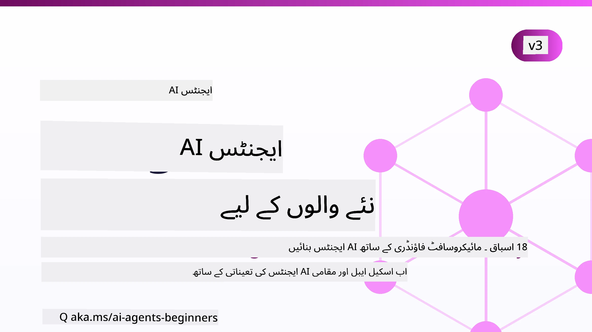

# ابتدائیوں کے لیے AI ایجنٹس - ایک کورس



## وہ تمام چیزیں سکھانے والا کورس جو آپ کو AI ایجنٹس بنانے کے لیے جاننا ضروری ہیں

[](https://github.com/microsoft/ai-agents-for-beginners/blob/master/LICENSE?WT.mc_id=academic-105485-koreyst)
[](https://GitHub.com/microsoft/ai-agents-for-beginners/graphs/contributors/?WT.mc_id=academic-105485-koreyst)
[](https://GitHub.com/microsoft/ai-agents-for-beginners/issues/?WT.mc_id=academic-105485-koreyst)
[](https://GitHub.com/microsoft/ai-agents-for-beginners/pulls/?WT.mc_id=academic-105485-koreyst)
[](http://makeapullrequest.com?WT.mc_id=academic-105485-koreyst)

### 🌐 کثیر اللسانی سپورٹ

#### GitHub ایکشن کے ذریعے سپورٹ (خودکار اور ہمیشہ تازہ ترین)

<!-- CO-OP TRANSLATOR LANGUAGES TABLE START -->
[Arabic](../ar/README.md) | [Bengali](../bn/README.md) | [Bulgarian](../bg/README.md) | [Burmese (Myanmar)](../my/README.md) | [Chinese (Simplified)](../zh-CN/README.md) | [Chinese (Traditional, Hong Kong)](../zh-HK/README.md) | [Chinese (Traditional, Macau)](../zh-MO/README.md) | [Chinese (Traditional, Taiwan)](../zh-TW/README.md) | [Croatian](../hr/README.md) | [Czech](../cs/README.md) | [Danish](../da/README.md) | [Dutch](../nl/README.md) | [Estonian](../et/README.md) | [Finnish](../fi/README.md) | [French](../fr/README.md) | [German](../de/README.md) | [Greek](../el/README.md) | [Hebrew](../he/README.md) | [Hindi](../hi/README.md) | [Hungarian](../hu/README.md) | [Indonesian](../id/README.md) | [Italian](../it/README.md) | [Japanese](../ja/README.md) | [Kannada](../kn/README.md) | [Khmer](../km/README.md) | [Korean](../ko/README.md) | [Lithuanian](../lt/README.md) | [Malay](../ms/README.md) | [Malayalam](../ml/README.md) | [Marathi](../mr/README.md) | [Nepali](../ne/README.md) | [Nigerian Pidgin](../pcm/README.md) | [Norwegian](../no/README.md) | [Persian (Farsi)](../fa/README.md) | [Polish](../pl/README.md) | [Portuguese (Brazil)](../pt-BR/README.md) | [Portuguese (Portugal)](../pt-PT/README.md) | [Punjabi (Gurmukhi)](../pa/README.md) | [Romanian](../ro/README.md) | [Russian](../ru/README.md) | [Serbian (Cyrillic)](../sr/README.md) | [Slovak](../sk/README.md) | [Slovenian](../sl/README.md) | [Spanish](../es/README.md) | [Swahili](../sw/README.md) | [Swedish](../sv/README.md) | [Tagalog (Filipino)](../tl/README.md) | [Tamil](../ta/README.md) | [Telugu](../te/README.md) | [Thai](../th/README.md) | [Turkish](../tr/README.md) | [Ukrainian](../uk/README.md) | [Urdu](./README.md) | [Vietnamese](../vi/README.md)

> **مقامی طور پر کلون کرنا پسند کریں؟**
>
> اس ریپوزٹری میں 50+ زبانوں کے تراجم شامل ہیں جو ڈاؤنلوڈ سائز کو بڑھاتے ہیں۔ بغیر تراجم کے کلون کرنے کے لیے sparse checkout استعمال کریں:
>
> **Bash / macOS / Linux:**
> ```bash
> git clone --filter=blob:none --sparse https://github.com/microsoft/ai-agents-for-beginners.git
> cd ai-agents-for-beginners
> git sparse-checkout set --no-cone '/*' '!translations' '!translated_images'
> ```
>
> **CMD (Windows):**
> ```cmd
> git clone --filter=blob:none --sparse https://github.com/microsoft/ai-agents-for-beginners.git
> cd ai-agents-for-beginners
> git sparse-checkout set --no-cone "/*" "!translations" "!translated_images"
> ```
>
> اس سے آپ کو کورس مکمل کرنے کے لیے سب کچھ مل جائے گا اور ڈاؤنلوڈ زیادہ تیز ہوگا۔
<!-- CO-OP TRANSLATOR LANGUAGES TABLE END -->

**اگر آپ چاہتے ہیں کہ اضافی ترجمہ زبانیں سپورٹ ہوں، تو وہ یہاں فہرست وار موجود ہیں [here](https://github.com/Azure/co-op-translator/blob/main/getting_started/supported-languages.md).**

[](https://GitHub.com/microsoft/ai-agents-for-beginners/watchers/?WT.mc_id=academic-105485-koreyst)
[](https://GitHub.com/microsoft/ai-agents-for-beginners/network/?WT.mc_id=academic-105485-koreyst)
[](https://GitHub.com/microsoft/ai-agents-for-beginners/stargazers/?WT.mc_id=academic-105485-koreyst)

[](https://discord.com/invite/ATgtXmAS5D)


## 🌱 شروع کریں

اس کورس میں AI ایجنٹس بنانے کی بنیادی باتوں کا احاطہ کیا گیا ہے۔ ہر سبق اپنے موضوع کو کور کرتا ہے، لہٰذا جہاں سے چاہیں شروع کریں!

اس کورس کے لیے کثیر اللسانی سپورٹ موجود ہے۔ ہمارے [دستیاب زبانوں یہاں دیکھیں](#-multi-language-support)۔

اگر یہ آپ کا پہلا موقع ہے جب آپ جنریٹیو AI ماڈلز کے ساتھ کام کر رہے ہیں، تو ہمارا [Generative AI For Beginners](https://aka.ms/genai-beginners) کورس دیکھیں، جس میں جنریٹیو AI کے ساتھ 21 اسباق شامل ہیں۔

اس ریپوزٹری کو [ستارہ (🌟) دینا](https://docs.github.com/en/get-started/exploring-projects-on-github/saving-repositories-with-stars?WT.mc_id=academic-105485-koreyst) اور [فورک کرنا](https://github.com/microsoft/ai-agents-for-beginners/fork) نہ بھولیں تاکہ آپ کوڈ چلا سکیں۔

### دوسرے سیکھنے والوں سے ملیں، اپنے سوالات کے جواب پائیں

اگر آپ کو رہنمائی کی ضرورت ہو یا AI ایجنٹس بنانے کے بارے میں سوالات ہوں، تو ہمارے مخصوص Discord چینل میں شامل ہوں Microsoft Foundry Discord میں: [https://aka.ms/ai-agents/discord](https://aka.ms/ai-agents/discord)

### آپ کو کیا چاہیے

اس کورس کے ہر سبق میں کوڈ مثالیں شامل ہیں، جو code_samples فولڈر میں مل سکتی ہیں۔ آپ [اس ریپوزٹری کو فورک](https://github.com/microsoft/ai-agents-for-beginners/fork) کرسکتے ہیں تاکہ اپنی کاپی بنا سکیں۔  

ان مشقوں میں کوڈ مثالیں Microsoft Agent Framework کے ساتھ Microsoft Foundry Agent Service V2 کا استعمال کرتی ہیں:

- [Microsoft Foundry](https://aka.ms/ai-agents-beginners/ai-foundry) - Azure اکاؤنٹ ضروری

یہ کورس Microsoft کے مندرجہ ذیل AI ایجنٹ فریم ورکس اور خدمات استعمال کرتا ہے:

- [Microsoft Agent Framework (MAF)](https://aka.ms/ai-agents-beginners/agent-framework)
- [Microsoft Foundry Agent Service V2](https://aka.ms/ai-agents-beginners/ai-agent-service)

کچھ کوڈ نمونے متبادل OpenAI-مطابق فراہم کنندگان جیسے [MiniMax](https://platform.minimaxi.com/) کی بھی حمایت کرتے ہیں، جو بڑے کانٹیکسٹ ماڈلز (204K ٹوکن تک) پیش کرتے ہیں۔ سیٹ اپ کے لیے تفصیلات دیکھیں [Course Setup](./00-course-setup/README.md)۔

اس کورس کے کوڈ چلانے کے بارے میں مزید معلومات کے لیے، [Course Setup](./00-course-setup/README.md) دیکھیں۔

## 🙏 مدد کرنا چاہتے ہیں؟

کیا آپ کے پاس تجاویز ہیں یا ہجے یا کوڈ میں غلطیاں پائی ہیں؟ [مسئلہ اٹھائیں](https://github.com/microsoft/ai-agents-for-beginners/issues?WT.mc_id=academic-105485-koreyst) یا [پُل رییکویسٹ بنائیں](https://github.com/microsoft/ai-agents-for-beginners/pulls?WT.mc_id=academic-105485-koreyst)


## 📂 ہر سبق میں شامل ہے

- ایک تحریری سبق جو README میں موجود ہے اور ایک مختصر ویڈیو
- Python کوڈ مثالیں جو Microsoft Agent Framework کے ساتھ Microsoft Foundry استعمال کرتی ہیں
- اضافی وسائل کے لنکس تاکہ آپ اپنی تعلیم جاری رکھ سکیں


## 🗃️ اسباق

| **سبق**                                   | **متن اور کوڈ**                                    | **ویڈیو**                                                  | **اضافی تعلیم**                                                                     |
|----------------------------------------------|----------------------------------------------------|------------------------------------------------------------|----------------------------------------------------------------------------------------|
| AI ایجنٹس اور ایجنٹ استعمال کیسز کا تعارف       | [لِنک](./01-intro-to-ai-agents/README.md)          | [ویڈیو](https://youtu.be/3zgm60bXmQk?si=z8QygFvYQv-9WtO1)  | [لِنک](https://aka.ms/ai-agents-beginners/collection?WT.mc_id=academic-105485-koreyst) |
| AI ایجنٹک فریم ورکس کی تلاش              | [لِنک](./02-explore-agentic-frameworks/README.md)  | [ویڈیو](https://youtu.be/ODwF-EZo_O8?si=Vawth4hzVaHv-u0H)  | [لِنک](https://aka.ms/ai-agents-beginners/collection?WT.mc_id=academic-105485-koreyst) |
| AI ایجنٹک ڈیزائن پیٹرنز کو سمجھنا     | [لِنک](./03-agentic-design-patterns/README.md)     | [ویڈیو](https://youtu.be/m9lM8qqoOEA?si=BIzHwzstTPL8o9GF)  | [لِنک](https://aka.ms/ai-agents-beginners/collection?WT.mc_id=academic-105485-koreyst) |
| ٹول استعمال ڈیزائن پیٹرن                      | [لِنک](./04-tool-use/README.md)                    | [ویڈیو](https://youtu.be/vieRiPRx-gI?si=2z6O2Xu2cu_Jz46N)  | [لِنک](https://aka.ms/ai-agents-beginners/collection?WT.mc_id=academic-105485-koreyst) |
| ایجنٹک RAG                                  | [لِنک](./05-agentic-rag/README.md)                 | [ویڈیو](https://youtu.be/WcjAARvdL7I?si=gKPWsQpKiIlDH9A3)  | [لِنک](https://aka.ms/ai-agents-beginners/collection?WT.mc_id=academic-105485-koreyst) |
| قابل اعتماد AI ایجنٹس بنانا               | [لِنک](./06-building-trustworthy-agents/README.md) | [ویڈیو](https://youtu.be/iZKkMEGBCUQ?si=jZjpiMnGFOE9L8OK ) | [لِنک](https://aka.ms/ai-agents-beginners/collection?WT.mc_id=academic-105485-koreyst) |
| منصوبہ بندی ڈیزائن پیٹرن                      | [لِنک](./07-planning-design/README.md)             | [ویڈیو](https://youtu.be/kPfJ2BrBCMY?si=6SC_iv_E5-mzucnC)  | [لِنک](https://aka.ms/ai-agents-beginners/collection?WT.mc_id=academic-105485-koreyst) |
| ملٹی ایجنٹ ڈیزائن پیٹرن                   | [لِنک](./08-multi-agent/README.md)                 | [ویڈیو](https://youtu.be/V6HpE9hZEx0?si=rMgDhEu7wXo2uo6g)  | [لِنک](https://aka.ms/ai-agents-beginners/collection?WT.mc_id=academic-105485-koreyst) |

| مٹاکاگنیشن ڈیزائن پیٹرن                 | [Link](./09-metacognition/README.md)               | [Video](https://youtu.be/His9R6gw6Ec?si=8gck6vvdSNCt6OcF)  | [Link](https://aka.ms/ai-agents-beginners/collection?WT.mc_id=academic-105485-koreyst) |
| مصنوعی ذہانت کے ایجنٹس پیداواری ماحول میں                      | [Link](./10-ai-agents-production/README.md)        | [Video](https://youtu.be/l4TP6IyJxmQ?si=31dnhexRo6yLRJDl)  | [Link](https://aka.ms/ai-agents-beginners/collection?WT.mc_id=academic-105485-koreyst) |
| ایجنٹک پروٹوکولز کا استعمال (MCP، A2A اور NLWeb) | [Link](./11-agentic-protocols/README.md)           | [Video](https://youtu.be/X-Dh9R3Opn8)                                 | [Link](https://aka.ms/ai-agents-beginners/collection?WT.mc_id=academic-105485-koreyst) |
| مصنوعی ذہانت کے ایجنٹس کے لیے کانٹیکسٹ انجینئرنگ            | [Link](./12-context-engineering/README.md)         | [Video](https://youtu.be/F5zqRV7gEag)                                 | [Link](https://aka.ms/ai-agents-beginners/collection?WT.mc_id=academic-105485-koreyst) |
| ایجنٹک میموری کا انتظام                      | [Link](./13-agent-memory/README.md)     |      [Video](https://youtu.be/QrYbHesIxpw?si=vZkVwKrQ4ieCcIPx)                                                      |                                                                                        |
| مائیکروسافٹ ایجنٹ فریم ورک کا جائزہ                         | [Link](./14-microsoft-agent-framework/README.md)                            |                                                            |                                                                                        |
| کمپیوٹر یوز ایجنٹس (CUA) کی تعمیر           | [Link](./15-browser-use/README.md)     |                                                            | [Link](https://docs.browser-use.com/examples/templates/playwright-integration)         |
| اسکیل ایبل ایجنٹس کی تعیناتی                    | [Link](./16-deploying-scalable-agents/README.md) |                                                    | [Link](https://learn.microsoft.com/azure/ai-foundry/agents/overview)                   |
| مقامی مصنوعی ذہانت کے ایجنٹس کی تخلیق                     | [Link](./17-creating-local-ai-agents/README.md)  |                                                    | [Link](https://learn.microsoft.com/azure/ai-foundry/foundry-local/)                    |
| مصنوعی ذہانت کے ایجنٹس کی حفاظت                           | [Link](./18-securing-ai-agents/README.md)  |                                                            | [Link](https://aka.ms/ai-agents-beginners/collection?WT.mc_id=academic-105485-koreyst) |

## 🎒 دیگر کورسز

ہماری ٹیم دیگر کورسز بھی تخلیق کرتی ہے! چیک کریں:

<!-- CO-OP TRANSLATOR OTHER COURSES START -->
### لنگ چین
[](https://aka.ms/langchain4j-for-beginners)
[](https://aka.ms/langchainjs-for-beginners?WT.mc_id=m365-94501-dwahlin)
[](https://github.com/microsoft/langchain-for-beginners?WT.mc_id=m365-94501-dwahlin)
---

### ایژور / ایج / MCP / ایجنٹس
[](https://github.com/microsoft/AZD-for-beginners?WT.mc_id=academic-105485-koreyst)
[](https://github.com/microsoft/edgeai-for-beginners?WT.mc_id=academic-105485-koreyst)
[](https://github.com/microsoft/mcp-for-beginners?WT.mc_id=academic-105485-koreyst)
[](https://github.com/microsoft/ai-agents-for-beginners?WT.mc_id=academic-105485-koreyst)

---
 
### جنریٹیو اے آئی سیریز
[](https://github.com/microsoft/generative-ai-for-beginners?WT.mc_id=academic-105485-koreyst)
[-9333EA?style=for-the-badge&labelColor=E5E7EB&color=9333EA)](https://github.com/microsoft/Generative-AI-for-beginners-dotnet?WT.mc_id=academic-105485-koreyst)

[-C084FC?style=for-the-badge&labelColor=E5E7EB&color=C084FC)](https://github.com/microsoft/generative-ai-for-beginners-java?WT.mc_id=academic-105485-koreyst)
[-E879F9?style=for-the-badge&labelColor=E5E7EB&color=E879F9)](https://github.com/microsoft/generative-ai-with-javascript?WT.mc_id=academic-105485-koreyst)

---
 
### بنیادی تعلیم
[](https://aka.ms/ml-beginners?WT.mc_id=academic-105485-koreyst)
[](https://aka.ms/datascience-beginners?WT.mc_id=academic-105485-koreyst)
[](https://aka.ms/ai-beginners?WT.mc_id=academic-105485-koreyst)
[](https://github.com/microsoft/Security-101?WT.mc_id=academic-96948-sayoung)
[](https://aka.ms/webdev-beginners?WT.mc_id=academic-105485-koreyst)
[](https://aka.ms/iot-beginners?WT.mc_id=academic-105485-koreyst)
[](https://github.com/microsoft/xr-development-for-beginners?WT.mc_id=academic-105485-koreyst)

---
 
### کوپائلٹ سیریز
[](https://aka.ms/GitHubCopilotAI?WT.mc_id=academic-105485-koreyst)
[](https://github.com/microsoft/mastering-github-copilot-for-dotnet-csharp-developers?WT.mc_id=academic-105485-koreyst)
[](https://github.com/microsoft/CopilotAdventures?WT.mc_id=academic-105485-koreyst)
<!-- CO-OP TRANSLATOR OTHER COURSES END -->

## 🌟 کمیونٹی کا شکریہ

اہم کوڈ نمونے فراہم کرنے پر [Shivam Goyal](https://www.linkedin.com/in/shivam2003/) کا شکریہ، جو Agentic RAG کی وضاحت کرتے ہیں۔

## تعاون

یہ منصوبہ تعاون اور تجاویز کا خیرمقدم کرتا ہے۔ زیادہ تر تعاون کے لیے آپ کو ایک
کنٹریبیوٹر لائسنس معاہدے (CLA) پر اتفاق کرنا ہوگا جس میں یہ اعلان کرنا ہوگا کہ آپ کے پاس حقوق ہیں، اور آپ واقعی ہمیں
آپ کی شراکت کا استعمال کرنے کا حق دے رہے ہیں۔ تفصیلات کے لیے، یہاں دیکھیں: <https://cla.opensource.microsoft.com>۔

جب آپ پل ریکویسٹ جمع کرائیں گے، تو ایک CLA بوٹ خود بخود تعین کرے گا کہ کیا آپ کو
CLA فراہم کرنے کی ضرورت ہے اور مناسب طور پر PR کی سجاوٹ کرے گا (مثلاً، اسٹیتس چیک، تبصرہ)۔ بس بوٹ کی دی گئی ہدایات پر عمل کریں۔
آپ کو یہ کام تمام رپوز میں ایک بار ہی کرنا ہوگا جو ہمارے CLA استعمال کرتے ہیں۔

اس منصوبے نے [Microsoft Open Source Code of Conduct](https://opensource.microsoft.com/codeofconduct/) کو اپنالیا ہے۔
مزید معلومات کے لیے [Code of Conduct FAQ](https://opensource.microsoft.com/codeofconduct/faq/) ملاحظہ کریں یا
کسی بھی اضافی سوالات یا تبصروں کے لیے [opencode@microsoft.com](mailto:opencode@microsoft.com) سے رابطہ کریں۔

## تجارتی نشان

یہ منصوبہ منصوبوں، مصنوعات، یا خدمات کے لیے تجارتی نشان یا لوگوز رکھ سکتا ہے۔ Microsoft
کے تجارتی نشانات یا لوگوز کا مجاز استعمال
[Microsoft's Trademark & Brand Guidelines](https://www.microsoft.com/legal/intellectualproperty/trademarks/usage/general) کی پیروی کرنا ضروری ہے۔
اس منصوبے میں Microsoft کے تجارتی نشانات یا لوگوز کا استعمال اس بات کا سبب نہیں بننا چاہیے کہ کنفیوژن ہو یا Microsoft کی سرپرستی کا عندیہ ملے۔
تیسرے فریق کے تجارتی نشانات یا لوگوز کا استعمال ان کی پالیسیوں کے تابع ہے۔

## مدد حاصل کرنا


اگر آپ پھنس جائیں یا AI ایپلیکیشنز بنانے کے بارے میں کوئی سوال ہو تو شامل ہوں:

[](https://aka.ms/foundry/discord)

اگر آپ کو مصنوعات پر رائے یا تعمیر کے دوران خرابیوں کا سامنا ہو تو دورہ کریں:


[](https://aka.ms/foundry/forum)

---

<!-- CO-OP TRANSLATOR DISCLAIMER START -->
**ڈس کلیمر**:
یہ دستاویز AI ترجمہ سروس [Co-op Translator](https://github.com/Azure/co-op-translator) کے ذریعے ترجمہ کی گئی ہے۔ جبکہ ہم درستگی کے لیے کوشاں ہیں، براہ کرم اس بات سے آگاہ رہیں کہ خودکار ترجمے میں غلطیاں یا عدم درستیاں ہو سکتی ہیں۔ اصل دستاویز اپنے مادری زبان میں مستند ماخذ سمجھی جائے گی۔ حساس معلومات کے لیے پیشہ ور انسانی ترجمہ کی سفارش کی جاتی ہے۔ اس ترجمے کے استعمال سے پیدا ہونے والی کسی بھی غلط فہمی یا غلط تشریح کی ذمہ داری ہم قبول نہیں کرتے۔
<!-- CO-OP TRANSLATOR DISCLAIMER END -->