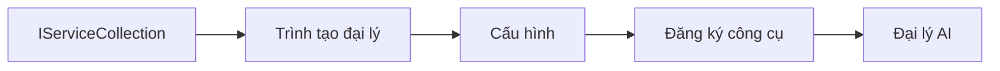

# 🎨 Mẫu Thiết Kế Agentic với Azure OpenAI (Responses API) (.NET)

## 📋 Mục Tiêu Học Tập

Ví dụ này trình bày các mẫu thiết kế cấp doanh nghiệp để xây dựng các agent thông minh sử dụng Microsoft Agent Framework trong .NET với tích hợp Azure OpenAI (Responses API). Bạn sẽ học các mẫu chuyên nghiệp và cách tiếp cận kiến trúc giúp agent sẵn sàng cho sản xuất, dễ bảo trì và mở rộng.

### Mẫu Thiết Kế Cấp Doanh Nghiệp

- 🏭 **Mẫu Factory**: Tạo agent chuẩn hóa với dependency injection
- 🔧 **Mẫu Builder**: Cấu hình và thiết lập agent theo phong cách fluent
- 🧵 **Mẫu An Toàn Luồng**: Quản lý hội thoại đồng thời
- 📋 **Mẫu Repository**: Quản lý công cụ và khả năng một cách tổ chức

## 🎯 Lợi Ích Kiến Trúc Đặc Thù cho .NET

### Tính Năng Cấp Doanh Nghiệp

- **Kiểu Mạnh**: Kiểm tra tại thời điểm biên dịch và hỗ trợ IntelliSense
- **Dependency Injection**: Tích hợp container DI có sẵn
- **Quản lý Cấu hình**: Các mẫu IConfiguration và Options
- **Async/Await**: Hỗ trợ lập trình bất đồng bộ hàng đầu

### Mẫu Sẵn Sàng Cho Sản Xuất

- **Tích hợp Ghi nhật ký**: Hỗ trợ ILogger và ghi nhật ký cấu trúc
- **Kiểm tra Sức khỏe**: Giám sát và chẩn đoán tích hợp
- **Xác thực Cấu hình**: Kiểu mạnh với chú thích dữ liệu
- **Xử lý Lỗi**: Quản lý ngoại lệ có cấu trúc

## 🔧 Kiến Trúc Kỹ Thuật

### Các Thành Phần .NET Cốt Lõi

- **Microsoft.Extensions.AI**: Trừu tượng dịch vụ AI hợp nhất
- **Microsoft.Agents.AI**: Khung điều phối agent cấp doanh nghiệp
- **Azure OpenAI (Responses API)**: Mẫu client API hiệu suất cao
- **Hệ thống Cấu hình**: Tích hợp appsettings.json và môi trường

### Triển khai Mẫu Thiết Kế



## 🏗️ Các Mẫu Doanh Nghiệp Đã Thể Hiện

### 1. **Mẫu Tạo Dựng**

- **Agent Factory**: Tạo agent tập trung với cấu hình nhất quán
- **Mẫu Builder**: API fluent cho cấu hình agent phức tạp
- **Mẫu Singleton**: Chia sẻ tài nguyên và quản lý cấu hình
- **Dependency Injection**: Kết nối lỏng lẻo và khả năng kiểm thử

### 2. **Mẫu Hành Vi**

- **Mẫu Chiến Lược**: Chiến lược thi hành công cụ có thể thay thế
- **Mẫu Command**: Các thao tác agent đóng gói với hoàn tác/làm lại
- **Mẫu Observer**: Quản lý vòng đời agent dựa theo sự kiện
- **Mẫu Template Method**: Quy trình thực thi agent tiêu chuẩn hóa

### 3. **Mẫu Cấu Trúc**

- **Mẫu Adapter**: Lớp tích hợp Azure OpenAI (Responses API)
- **Mẫu Decorator**: Nâng cao khả năng agent
- **Mẫu Facade**: Giao diện tương tác agent đơn giản hóa
- **Mẫu Proxy**: Tải lười và bộ nhớ đệm tăng hiệu năng

## 📚 Nguyên Tắc Thiết Kế .NET

### Nguyên Tắc SOLID

- **Đơn trách nhiệm**: Mỗi thành phần có một mục đích rõ ràng
- **Mở/Đóng**: Mở rộng mà không sửa đổi
- **Thay thế Liskov**: Triển khai công cụ dựa trên giao diện
- **Phân tách Giao diện**: Giao diện tập trung, liên kết chặt
- **Đảo ngược Phụ thuộc**: Phụ thuộc vào các trừu tượng, không phải phần cụ thể

### Kiến Trúc Sạch

- **Lớp Domain**: Trừu tượng cốt lõi cho agent và công cụ
- **Lớp Ứng dụng**: Điều phối agent và luồng công việc
- **Lớp Hạ tầng**: Tích hợp Azure OpenAI (Responses API) và dịch vụ ngoài
- **Lớp Trình bày**: Tương tác người dùng và định dạng phản hồi

## 🔒 Các Lưu Ý Cấp Doanh Nghiệp

### Bảo Mật

- **Quản lý Thông tin đăng nhập**: Xử lý khóa API an toàn với IConfiguration
- **Xác thực Đầu vào**: Kiểu mạnh và xác thực chú thích dữ liệu
- **Làm sạch Đầu ra**: Xử lý và lọc phản hồi an toàn
- **Ghi nhật ký Kiểm toán**: Theo dõi hoạt động toàn diện

### Hiệu Năng

- **Mẫu Async**: Thao tác I/O không chặn
- **Pooling Kết nối**: Quản lý client HTTP hiệu quả
- **Bộ nhớ đệm**: Bộ nhớ đệm phản hồi cải thiện hiệu năng
- **Quản lý Tài nguyên**: Mẫu hủy và dọn dẹp đúng cách

### Khả Năng Mở Rộng

- **An toàn Luồng**: Hỗ trợ thực thi agent đồng thời
- **Pooling Tài nguyên**: Sử dụng tài nguyên hiệu quả
- **Quản lý Tải**: Giới hạn tần suất và xử lý áp lực ngược
- **Giám sát**: Chỉ số hiệu năng và kiểm tra sức khỏe

## 🚀 Triển Khai Sản Xuất

- **Quản lý Cấu hình**: Cài đặt theo môi trường cụ thể
- **Chiến lược Ghi nhật ký**: Ghi nhật ký cấu trúc với ID tương quan
- **Xử lý Lỗi**: Quản lý ngoại lệ toàn cục với khôi phục thích hợp
- **Giám sát**: Application insights và bộ đếm hiệu năng
- **Kiểm thử**: Mẫu kiểm thử đơn vị, tích hợp và tải

Sẵn sàng xây dựng các agent thông minh cấp doanh nghiệp với .NET? Hãy cùng kiến trúc một giải pháp vững chắc! 🏢✨

## 🚀 Bắt Đầu

### Yêu Cầu Tiền Đề

- [SDK .NET 10](https://dotnet.microsoft.com/download/dotnet/10.0) hoặc phiên bản cao hơn
- Một [đăng ký Azure](https://azure.microsoft.com/free/) với tài nguyên Azure OpenAI và triển khai mô hình
- [Azure CLI](https://learn.microsoft.com/cli/azure/install-azure-cli) — đăng nhập bằng `az login`

### Biến Môi Trường Yêu Cầu

```bash
# zsh/bash
export AZURE_OPENAI_ENDPOINT=https://<your-resource>.openai.azure.com
export AZURE_OPENAI_DEPLOYMENT=gpt-5-mini
# Sau đó đăng nhập để AzureCliCredential có thể lấy token
az login
```

```powershell
# PowerShell
$env:AZURE_OPENAI_ENDPOINT = "https://<your-resource>.openai.azure.com"
$env:AZURE_OPENAI_DEPLOYMENT = "gpt-5-mini"
# Sau đó đăng nhập để AzureCliCredential có thể lấy token
az login
```

### Mẫu Mã

Để chạy ví dụ mã,

```bash
# zsh/bash
chmod +x ./03-dotnet-agent-framework.cs
./03-dotnet-agent-framework.cs
```

Hoặc sử dụng dotnet CLI:

```bash
dotnet run ./03-dotnet-agent-framework.cs
```

Xem [`03-dotnet-agent-framework.cs`](../../../../03-agentic-design-patterns/code_samples/03-dotnet-agent-framework.cs) để có mã đầy đủ.

```csharp
#!/usr/bin/dotnet run

#:package Microsoft.Extensions.AI@10.*
#:package Microsoft.Agents.AI.OpenAI@1.*-*
#:package Azure.AI.OpenAI@2.1.0
#:package Azure.Identity@1.13.1

using System.ComponentModel;

using Microsoft.Agents.AI;
using Microsoft.Extensions.AI;

using Azure.AI.OpenAI;
using Azure.Identity;

// Tool Function: Random Destination Generator
// This static method will be available to the agent as a callable tool
// The [Description] attribute helps the AI understand when to use this function
// This demonstrates how to create custom tools for AI agents
[Description("Provides a random vacation destination.")]
static string GetRandomDestination()
{
    // List of popular vacation destinations around the world
    // The agent will randomly select from these options
    var destinations = new List<string>
    {
        "Paris, France",
        "Tokyo, Japan",
        "New York City, USA",
        "Sydney, Australia",
        "Rome, Italy",
        "Barcelona, Spain",
        "Cape Town, South Africa",
        "Rio de Janeiro, Brazil",
        "Bangkok, Thailand",
        "Vancouver, Canada"
    };

    // Generate random index and return selected destination
    // Uses System.Random for simple random selection
    var random = new Random();
    int index = random.Next(destinations.Count);
    return destinations[index];
}

// Azure OpenAI with the Responses API (stable v1 endpoint). Sign in with `az login`.
var azureEndpoint = Environment.GetEnvironmentVariable("AZURE_OPENAI_ENDPOINT")
    ?? throw new InvalidOperationException("AZURE_OPENAI_ENDPOINT is not set.");
var deployment = Environment.GetEnvironmentVariable("AZURE_OPENAI_DEPLOYMENT") ?? "gpt-5-mini";

var azureClient = new AzureOpenAIClient(new Uri(azureEndpoint), new AzureCliCredential());

// Define Agent Identity and Comprehensive Instructions
// Agent name for identification and logging purposes
var AGENT_NAME = "TravelAgent";

// Detailed instructions that define the agent's personality, capabilities, and behavior
// This system prompt shapes how the agent responds and interacts with users
var AGENT_INSTRUCTIONS = """
You are a helpful AI Agent that can help plan vacations for customers.

Important: When users specify a destination, always plan for that location. Only suggest random destinations when the user hasn't specified a preference.

When the conversation begins, introduce yourself with this message:
"Hello! I'm your TravelAgent assistant. I can help plan vacations and suggest interesting destinations for you. Here are some things you can ask me:
1. Plan a day trip to a specific location
2. Suggest a random vacation destination
3. Find destinations with specific features (beaches, mountains, historical sites, etc.)
4. Plan an alternative trip if you don't like my first suggestion

What kind of trip would you like me to help you plan today?"

Always prioritize user preferences. If they mention a specific destination like "Bali" or "Paris," focus your planning on that location rather than suggesting alternatives.
""";

// Create AI Agent with Advanced Travel Planning Capabilities
// Get the Responses client for the deployment and create the AI agent
// Configure agent with name, detailed instructions, and available tools
// This demonstrates the .NET agent creation pattern with full configuration
AIAgent agent = azureClient
    .GetChatClient(deployment)
    .AsAIAgent(
        name: AGENT_NAME,
        instructions: AGENT_INSTRUCTIONS,
        tools: [AIFunctionFactory.Create(GetRandomDestination)]
    );

// Create New Conversation Session for Context Management
// Initialize a new conversation session to maintain context across multiple interactions
// Sessions enable the agent to remember previous exchanges and maintain conversational state
// This is essential for multi-turn conversations and contextual understanding
var session = await agent.CreateSessionAsync();

// Execute Agent: First Travel Planning Request
// Run the agent with an initial request that will likely trigger the random destination tool
// The agent will analyze the request, use the GetRandomDestination tool, and create an itinerary
// Using the session parameter maintains conversation context for subsequent interactions
await foreach (var update in agent.RunStreamingAsync("Plan me a day trip", session))
{
    await Task.Delay(10);
    Console.Write(update);
}

Console.WriteLine();

// Execute Agent: Follow-up Request with Context Awareness
// Demonstrate contextual conversation by referencing the previous response
// The agent remembers the previous destination suggestion and will provide an alternative
// This showcases the power of conversation sessions and contextual understanding in .NET agents
await foreach (var update in agent.RunStreamingAsync("I don't like that destination. Plan me another vacation.", session))
{
    await Task.Delay(10);
    Console.Write(update);
}
```

---

<!-- CO-OP TRANSLATOR DISCLAIMER START -->
**Tuyên bố miễn trừ trách nhiệm**:
Tài liệu này đã được dịch bằng dịch vụ dịch thuật AI [Co-op Translator](https://github.com/Azure/co-op-translator). Mặc dù chúng tôi cố gắng đảm bảo độ chính xác, xin lưu ý rằng bản dịch tự động có thể chứa lỗi hoặc sai sót. Tài liệu gốc bằng ngôn ngữ gốc nên được coi là nguồn tin chính thức. Đối với thông tin quan trọng, nên sử dụng dịch vụ dịch thuật chuyên nghiệp bởi con người. Chúng tôi không chịu trách nhiệm về bất kỳ hiểu lầm hoặc giải thích sai nào phát sinh từ việc sử dụng bản dịch này.
<!-- CO-OP TRANSLATOR DISCLAIMER END -->