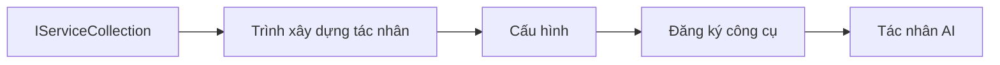

# 🎨 Mẫu Thiết Kế Agentic với Azure OpenAI (Responses API) (.NET)

## 📋 Mục Tiêu Học Tập

Ví dụ này trình bày các mẫu thiết kế cấp doanh nghiệp để xây dựng các agent thông minh sử dụng Microsoft Agent Framework trong .NET với tích hợp Azure OpenAI (Responses API). Bạn sẽ học các mẫu chuyên nghiệp và phương pháp kiến trúc giúp các agent sẵn sàng cho sản xuất, dễ bảo trì và mở rộng.

### Các Mẫu Thiết Kế Doanh Nghiệp

- 🏭 **Mẫu Nhà Máy (Factory Pattern)**: Tạo agent chuẩn hóa với tiêm phụ thuộc
- 🔧 **Mẫu Builder**: Cấu hình và thiết lập agent theo kiểu fluent
- 🧵 **Mẫu An Toàn Luồng (Thread-Safe Patterns)**: Quản lý hội thoại đồng thời
- 📋 **Mẫu Repository**: Quản lý công cụ và năng lực có tổ chức

## 🎯 Lợi Ích Kiến Trúc Cụ Thể Cho .NET

### Tính Năng Doanh Nghiệp

- **Kiểu Mạnh (Strong Typing)**: Xác thực thời gian biên dịch và hỗ trợ IntelliSense
- **Tiêm Phụ Thuộc**: Tích hợp container DI có sẵn
- **Quản Lý Cấu Hình**: Mẫu IConfiguration và Options
- **Async/Await**: Hỗ trợ lập trình bất đồng bộ hàng đầu

### Mẫu Sẵn Sàng Cho Sản Xuất

- **Tích Hợp Ghi Nhật Ký**: Hỗ trợ ILogger và ghi nhật ký có cấu trúc
- **Kiểm Tra Sức Khoẻ**: Giám sát và chẩn đoán tích hợp
- **Xác Thực Cấu Hình**: Kiểu mạnh với chú thích dữ liệu
- **Xử Lý Lỗi**: Quản lý ngoại lệ có cấu trúc

## 🔧 Kiến Trúc Kỹ Thuật

### Thành Phần Cốt Lõi .NET

- **Microsoft.Extensions.AI**: Trừu tượng dịch vụ AI hợp nhất
- **Microsoft.Agents.AI**: Framework điều phối agent cấp doanh nghiệp
- **Azure OpenAI (Responses API)**: Mẫu client API hiệu suất cao
- **Hệ Thống Cấu Hình**: appsettings.json và tích hợp môi trường

### Triển Khai Mẫu Thiết Kế



## 🏗️ Các Mẫu Doanh Nghiệp Demo

### 1. **Mẫu Creational**

- **Agent Factory**: Tạo agent tập trung với cấu hình nhất quán
- **Mẫu Builder**: API fluent cho cấu hình agent phức tạp
- **Mẫu Singleton**: Quản lý tài nguyên và cấu hình dùng chung
- **Tiêm Phụ Thuộc**: Kết nối lỏng và dễ kiểm thử

### 2. **Mẫu Hành Vi**

- **Mẫu Strategy**: Chiến lược thực thi công cụ có thể hoán đổi
- **Mẫu Command**: Các hoạt động agent đóng gói với hoàn tác/làm lại
- **Mẫu Observer**: Quản lý vòng đời agent theo sự kiện
- **Mẫu Template Method**: Quy trình thực thi agent chuẩn hóa

### 3. **Mẫu Cấu Trúc**

- **Mẫu Adapter**: Lớp tích hợp Azure OpenAI (Responses API)
- **Mẫu Decorator**: Nâng cao năng lực agent
- **Mẫu Facade**: Giao diện tương tác agent đơn giản hoá
- **Mẫu Proxy**: Tải trì hoãn và lưu cache để tăng hiệu suất

## 📚 Nguyên Tắc Thiết Kế .NET

### Nguyên Tắc SOLID

- **Trách Nhiệm Đơn Lớn (Single Responsibility)**: Mỗi thành phần có một mục đích rõ ràng
- **Mở/Rộng (Open/Closed)**: Mở rộng mà không sửa đổi
- **Thay Thế Liskov (Liskov Substitution)**: Cài đặt công cụ dựa trên giao diện
- **Phân Tách Giao Diện (Interface Segregation)**: Giao diện tập trung, gắn kết
- **Đảo Ngược Phụ Thuộc (Dependency Inversion)**: Phụ thuộc vào trừu tượng, không phải thực thể cụ thể

### Kiến Trúc Sạch

- **Lớp Miền (Domain Layer)**: Trừu tượng agent và công cụ cốt lõi
- **Lớp Ứng Dụng (Application Layer)**: Điều phối agent và quy trình làm việc
- **Lớp Cơ Sở Hạ Tầng (Infrastructure Layer)**: Tích hợp Azure OpenAI (Responses API) và dịch vụ ngoài
- **Lớp Trình Bày (Presentation Layer)**: Tương tác người dùng và định dạng phản hồi

## 🔒 Các Cân Nhắc Doanh Nghiệp

### Bảo Mật

- **Quản Lý Chứng Thực**: Xử lý khoá API an toàn với IConfiguration
- **Xác Thực Đầu Vào**: Kiểu mạnh và xác thực chú thích dữ liệu
- **Xử Lý Đầu Ra An Toàn**: Quản lý xử lý và lọc phản hồi an toàn
- **Ghi Nhật Ký Kiểm Tra**: Theo dõi hoạt động toàn diện

### Hiệu Suất

- **Mẫu Async**: Các thao tác I/O không chặn
- **Quản Lý Pool Kết Nối**: Quản lý client HTTP hiệu quả
- **Bộ Nhớ Đệm (Caching)**: Lưu bộ nhớ đệm phản hồi để cải thiện hiệu suất
- **Quản Lý Tài Nguyên**: Mẫu hủy và làm sạch thích hợp

### Khả Năng Mở Rộng

- **An Toàn Luồng**: Hỗ trợ thực thi agent đồng thời
- **Pool Tài Nguyên**: Sử dụng tài nguyên hiệu quả
- **Quản Lý Tải**: Giới hạn tốc độ và xử lý áp lực ngược
- **Giám Sát**: Số liệu hiệu suất và kiểm tra sức khoẻ

## 🚀 Triển Khai Sản Xuất

- **Quản Lý Cấu Hình**: Cài đặt theo môi trường
- **Chiến Lược Ghi Nhật Ký**: Ghi nhật ký có cấu trúc với ID tương quan
- **Xử Lý Lỗi**: Xử lý ngoại lệ toàn cục với phục hồi đúng cách
- **Giám Sát**: Application insights và bộ đếm hiệu suất
- **Kiểm Thử**: Kiểm thử đơn vị, tích hợp và tải

Sẵn sàng xây dựng các agent thông minh cấp doanh nghiệp với .NET? Hãy cùng kiến trúc một giải pháp vững chắc! 🏢✨

## 🚀 Bắt Đầu

### Yêu Cầu Tiên Quyết

- [.NET 10 SDK](https://dotnet.microsoft.com/download/dotnet/10.0) hoặc cao hơn
- Một [đăng ký Azure](https://azure.microsoft.com/free/) với tài nguyên Azure OpenAI và triển khai mô hình
- [Azure CLI](https://learn.microsoft.com/cli/azure/install-azure-cli) — đăng nhập với `az login`

### Biến Môi Trường Cần Thiết

```bash
# zsh/bash
export AZURE_OPENAI_ENDPOINT=https://<your-resource>.openai.azure.com
export AZURE_OPENAI_DEPLOYMENT=gpt-4.1-mini
# Sau đó đăng nhập để AzureCliCredential có thể lấy token
az login
```

```powershell
# PowerShell
$env:AZURE_OPENAI_ENDPOINT = "https://<your-resource>.openai.azure.com"
$env:AZURE_OPENAI_DEPLOYMENT = "gpt-4.1-mini"
# Sau đó đăng nhập để AzureCliCredential có thể lấy token
az login
```

### Mẫu Mã Nguồn

Để chạy ví dụ mã,

```bash
# zsh/bash
chmod +x ./03-dotnet-agent-framework.cs
./03-dotnet-agent-framework.cs
```

Hoặc dùng dotnet CLI:

```bash
dotnet run ./03-dotnet-agent-framework.cs
```

Xem [`03-dotnet-agent-framework.cs`](../../../../03-agentic-design-patterns/code_samples/03-dotnet-agent-framework.cs) để xem mã hoàn chỉnh.

```csharp
#!/usr/bin/dotnet run

#:package Microsoft.Extensions.AI@10.*
#:package Microsoft.Agents.AI.OpenAI@1.*-*
#:package Azure.AI.OpenAI@2.1.0
#:package Azure.Identity@1.13.1

using System.ComponentModel;

using Microsoft.Agents.AI;
using Microsoft.Extensions.AI;

using Azure.AI.OpenAI;
using Azure.Identity;

// Tool Function: Random Destination Generator
// This static method will be available to the agent as a callable tool
// The [Description] attribute helps the AI understand when to use this function
// This demonstrates how to create custom tools for AI agents
[Description("Provides a random vacation destination.")]
static string GetRandomDestination()
{
    // List of popular vacation destinations around the world
    // The agent will randomly select from these options
    var destinations = new List<string>
    {
        "Paris, France",
        "Tokyo, Japan",
        "New York City, USA",
        "Sydney, Australia",
        "Rome, Italy",
        "Barcelona, Spain",
        "Cape Town, South Africa",
        "Rio de Janeiro, Brazil",
        "Bangkok, Thailand",
        "Vancouver, Canada"
    };

    // Generate random index and return selected destination
    // Uses System.Random for simple random selection
    var random = new Random();
    int index = random.Next(destinations.Count);
    return destinations[index];
}

// Azure OpenAI with the Responses API (stable v1 endpoint). Sign in with `az login`.
var azureEndpoint = Environment.GetEnvironmentVariable("AZURE_OPENAI_ENDPOINT")
    ?? throw new InvalidOperationException("AZURE_OPENAI_ENDPOINT is not set.");
var deployment = Environment.GetEnvironmentVariable("AZURE_OPENAI_DEPLOYMENT") ?? "gpt-4.1-mini";

var azureClient = new AzureOpenAIClient(new Uri(azureEndpoint), new AzureCliCredential());

// Define Agent Identity and Comprehensive Instructions
// Agent name for identification and logging purposes
var AGENT_NAME = "TravelAgent";

// Detailed instructions that define the agent's personality, capabilities, and behavior
// This system prompt shapes how the agent responds and interacts with users
var AGENT_INSTRUCTIONS = """
You are a helpful AI Agent that can help plan vacations for customers.

Important: When users specify a destination, always plan for that location. Only suggest random destinations when the user hasn't specified a preference.

When the conversation begins, introduce yourself with this message:
"Hello! I'm your TravelAgent assistant. I can help plan vacations and suggest interesting destinations for you. Here are some things you can ask me:
1. Plan a day trip to a specific location
2. Suggest a random vacation destination
3. Find destinations with specific features (beaches, mountains, historical sites, etc.)
4. Plan an alternative trip if you don't like my first suggestion

What kind of trip would you like me to help you plan today?"

Always prioritize user preferences. If they mention a specific destination like "Bali" or "Paris," focus your planning on that location rather than suggesting alternatives.
""";

// Create AI Agent with Advanced Travel Planning Capabilities
// Get the Responses client for the deployment and create the AI agent
// Configure agent with name, detailed instructions, and available tools
// This demonstrates the .NET agent creation pattern with full configuration
AIAgent agent = azureClient
    .GetChatClient(deployment)
    .AsAIAgent(
        name: AGENT_NAME,
        instructions: AGENT_INSTRUCTIONS,
        tools: [AIFunctionFactory.Create(GetRandomDestination)]
    );

// Create New Conversation Session for Context Management
// Initialize a new conversation session to maintain context across multiple interactions
// Sessions enable the agent to remember previous exchanges and maintain conversational state
// This is essential for multi-turn conversations and contextual understanding
var session = await agent.CreateSessionAsync();

// Execute Agent: First Travel Planning Request
// Run the agent with an initial request that will likely trigger the random destination tool
// The agent will analyze the request, use the GetRandomDestination tool, and create an itinerary
// Using the session parameter maintains conversation context for subsequent interactions
await foreach (var update in agent.RunStreamingAsync("Plan me a day trip", session))
{
    await Task.Delay(10);
    Console.Write(update);
}

Console.WriteLine();

// Execute Agent: Follow-up Request with Context Awareness
// Demonstrate contextual conversation by referencing the previous response
// The agent remembers the previous destination suggestion and will provide an alternative
// This showcases the power of conversation sessions and contextual understanding in .NET agents
await foreach (var update in agent.RunStreamingAsync("I don't like that destination. Plan me another vacation.", session))
{
    await Task.Delay(10);
    Console.Write(update);
}
```

---

<!-- CO-OP TRANSLATOR DISCLAIMER START -->
**Tuyên bố miễn trừ trách nhiệm**:
Tài liệu này đã được dịch bằng dịch vụ dịch thuật AI [Co-op Translator](https://github.com/Azure/co-op-translator). Mặc dù chúng tôi cố gắng đảm bảo độ chính xác, xin lưu ý rằng bản dịch tự động có thể chứa lỗi hoặc sai sót. Tài liệu gốc bằng ngôn ngữ gốc nên được coi là nguồn tin chính thức. Đối với thông tin quan trọng, nên sử dụng dịch vụ dịch thuật chuyên nghiệp bởi con người. Chúng tôi không chịu trách nhiệm về bất kỳ hiểu lầm hoặc giải thích sai nào phát sinh từ việc sử dụng bản dịch này.
<!-- CO-OP TRANSLATOR DISCLAIMER END -->