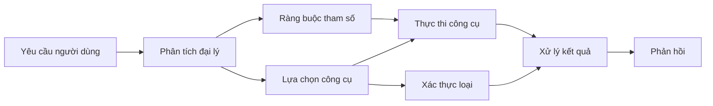

# 🛠️ Sử Dụng Công Cụ Nâng Cao với Azure OpenAI (API Responses) (.NET)

## 📋 Mục Tiêu Học Tập

Notebook này trình bày các mẫu tích hợp công cụ cấp doanh nghiệp sử dụng Microsoft Agent Framework trong .NET với Azure OpenAI (API Responses). Bạn sẽ học cách xây dựng các agent phức tạp với nhiều công cụ chuyên biệt, tận dụng kiểu dữ liệu mạnh của C# và các tính năng doanh nghiệp của .NET.

### Các Tính Năng Công Cụ Nâng Cao Bạn Sẽ Thành Thạo

- 🔧 **Kiến Trúc Đa Công Cụ**: Xây dựng agent với nhiều năng lực chuyên biệt
- 🎯 **Thực Thi Công Cụ An Toàn Kiểu Dữ Liệu**: Tận dụng xác nhận thời gian biên dịch của C#
- 📊 **Mẫu Công Cụ Cấp Doanh Nghiệp**: Thiết kế công cụ sẵn sàng sản xuất và xử lý lỗi
- 🔗 **Gộp Công Cụ**: Kết hợp các công cụ cho quy trình kinh doanh phức tạp

## 🎯 Lợi Ích Kiến Trúc Công Cụ .NET

### Tính Năng Công Cụ Doanh Nghiệp

- **Xác Thực Thời Gian Biên Dịch**: Kiểu dữ liệu mạnh đảm bảo tham số công cụ chính xác
- **Tiêm Phụ Thuộc**: Tích hợp container IoC cho quản lý công cụ
- **Mẫu Async/Await**: Thực thi công cụ không chặn với quản lý tài nguyên phù hợp
- **Ghi Nhật Ký Cấu Trúc**: Tích hợp ghi nhật ký tích hợp để giám sát thực thi công cụ

### Mẫu Sẵn Sàng Sản Xuất

- **Xử Lý Ngoại Lệ**: Quản lý lỗi toàn diện với ngoại lệ kiểu hóa
- **Quản Lý Tài Nguyên**: Mẫu giải phóng và quản lý bộ nhớ thích hợp
- **Giám Sát Hiệu Suất**: Thước đo và bộ đếm hiệu suất tích hợp sẵn
- **Quản Lý Cấu Hình**: Cấu hình an toàn kiểu với xác thực

## 🔧 Kiến Trúc Kỹ Thuật

### Thành Phần Công Cụ Cốt Lõi .NET

- **Microsoft.Extensions.AI**: Lớp trừu tượng công cụ thống nhất
- **Microsoft.Agents.AI**: Điều phối công cụ cấp doanh nghiệp
- **Azure OpenAI (API Responses)**: Client API hiệu năng cao với connection pooling

### Đường Ống Thực Thi Công Cụ



## 🛠️ Các Loại & Mẫu Công Cụ

### 1. **Công Cụ Xử Lý Dữ Liệu**

- **Xác Thực Đầu Vào**: Kiểu dữ liệu mạnh với chú thích dữ liệu
- **Các Phép Biến Đổi**: Chuyển đổi và định dạng dữ liệu an toàn kiểu
- **Logic Kinh Doanh**: Công cụ tính toán và phân tích theo miền
- **Định Dạng Đầu Ra**: Tạo phản hồi có cấu trúc

### 2. **Công Cụ Tích Hợp** 

- **Kết Nối API**: Tích hợp dịch vụ RESTful với HttpClient
- **Công Cụ Cơ Sở Dữ Liệu**: Tích hợp Entity Framework cho truy cập dữ liệu
- **Phép Toán Tệp**: Thao tác hệ thống tệp an toàn với xác thực
- **Dịch Vụ Bên Ngoài**: Mẫu tích hợp dịch vụ bên thứ ba

### 3. **Công Cụ Tiện Ích**

- **Xử Lý Văn Bản**: Tiện ích thao tác và định dạng chuỗi
- **Phép Toán Ngày/Giờ**: Tính toán ngày/giờ có nhận thức văn hóa
- **Công Cụ Toán Học**: Tính toán chính xác và thao tác thống kê
- **Công Cụ Xác Thực**: Xác thực quy tắc kinh doanh và kiểm tra dữ liệu

Sẵn sàng xây dựng các agent cấp doanh nghiệp với khả năng công cụ mạnh mẽ, an toàn kiểu trong .NET? Hãy kiến tạo những giải pháp chuyên nghiệp! 🏢⚡

## 🚀 Bắt Đầu

### Yêu Cầu Trước

- [.NET 10 SDK](https://dotnet.microsoft.com/download/dotnet/10.0) hoặc cao hơn
- Một [đăng ký Azure](https://azure.microsoft.com/free/) với tài nguyên Azure OpenAI và triển khai mô hình
- [Azure CLI](https://learn.microsoft.com/cli/azure/install-azure-cli) — đăng nhập với `az login`

### Biến Môi Trường Cần Thiết

```bash
# zsh/bash
export AZURE_OPENAI_ENDPOINT=https://<your-resource>.openai.azure.com
export AZURE_OPENAI_DEPLOYMENT=gpt-4.1-mini
# Sau đó đăng nhập để AzureCliCredential có thể lấy token
az login
```

```powershell
# PowerShell
$env:AZURE_OPENAI_ENDPOINT = "https://<your-resource>.openai.azure.com"
$env:AZURE_OPENAI_DEPLOYMENT = "gpt-4.1-mini"
# Sau đó đăng nhập để AzureCliCredential có thể lấy một mã thông báo
az login
```

### Mẫu Mã

Để chạy ví dụ mã,

```bash
# zsh/bash
chmod +x ./04-dotnet-agent-framework.cs
./04-dotnet-agent-framework.cs
```

Hoặc sử dụng dotnet CLI:

```bash
dotnet run ./04-dotnet-agent-framework.cs
```

Xem [`04-dotnet-agent-framework.cs`](../../../../04-tool-use/code_samples/04-dotnet-agent-framework.cs) để xem mã hoàn chỉnh.

```csharp
#!/usr/bin/dotnet run

#:package Microsoft.Extensions.AI@10.*
#:package Microsoft.Agents.AI.OpenAI@1.*-*
#:package Azure.AI.OpenAI@2.1.0
#:package Azure.Identity@1.13.1

using System.ComponentModel;

using Microsoft.Agents.AI;
using Microsoft.Extensions.AI;

using Azure.AI.OpenAI;
using Azure.Identity;

// Tool Function: Random Destination Generator
// This static method will be available to the agent as a callable tool
// The [Description] attribute helps the AI understand when to use this function
// This demonstrates how to create custom tools for AI agents
[Description("Provides a random vacation destination.")]
static string GetRandomDestination()
{
    // List of popular vacation destinations around the world
    // The agent will randomly select from these options
    var destinations = new List<string>
    {
        "Paris, France",
        "Tokyo, Japan",
        "New York City, USA",
        "Sydney, Australia",
        "Rome, Italy",
        "Barcelona, Spain",
        "Cape Town, South Africa",
        "Rio de Janeiro, Brazil",
        "Bangkok, Thailand",
        "Vancouver, Canada"
    };

    // Generate random index and return selected destination
    // Uses System.Random for simple random selection
    var random = new Random();
    int index = random.Next(destinations.Count);
    return destinations[index];
}

// Azure OpenAI with the Responses API (stable v1 endpoint). Sign in with `az login`.
var azureEndpoint = Environment.GetEnvironmentVariable("AZURE_OPENAI_ENDPOINT")
    ?? throw new InvalidOperationException("AZURE_OPENAI_ENDPOINT is not set.");
var deployment = Environment.GetEnvironmentVariable("AZURE_OPENAI_DEPLOYMENT") ?? "gpt-4.1-mini";

var azureClient = new AzureOpenAIClient(new Uri(azureEndpoint), new AzureCliCredential());

// Define Agent Identity and Comprehensive Instructions
// Agent name for identification and logging purposes
var AGENT_NAME = "TravelAgent";

// Detailed instructions that define the agent's personality, capabilities, and behavior
// This system prompt shapes how the agent responds and interacts with users
var AGENT_INSTRUCTIONS = """
You are a helpful AI Agent that can help plan vacations for customers.

Important: When users specify a destination, always plan for that location. Only suggest random destinations when the user hasn't specified a preference.

When the conversation begins, introduce yourself with this message:
"Hello! I'm your TravelAgent assistant. I can help plan vacations and suggest interesting destinations for you. Here are some things you can ask me:
1. Plan a day trip to a specific location
2. Suggest a random vacation destination
3. Find destinations with specific features (beaches, mountains, historical sites, etc.)
4. Plan an alternative trip if you don't like my first suggestion

What kind of trip would you like me to help you plan today?"

Always prioritize user preferences. If they mention a specific destination like "Bali" or "Paris," focus your planning on that location rather than suggesting alternatives.
""";

// Create AI Agent with Advanced Travel Planning Capabilities
// Get the Responses client for the deployment and create the AI agent
// Configure agent with name, detailed instructions, and available tools
// This demonstrates the .NET agent creation pattern with full configuration
AIAgent agent = azureClient
    .GetChatClient(deployment)
    .AsAIAgent(
        name: AGENT_NAME,
        instructions: AGENT_INSTRUCTIONS,
        tools: [AIFunctionFactory.Create(GetRandomDestination)]
    );

// Create New Conversation Session for Context Management
// Initialize a new conversation session to maintain context across multiple interactions
// Sessions enable the agent to remember previous exchanges and maintain conversational state
// This is essential for multi-turn conversations and contextual understanding
await using var session = await agent.CreateSessionAsync();

// Execute Agent: First Travel Planning Request
// Run the agent with an initial request that will likely trigger the random destination tool
// The agent will analyze the request, use the GetRandomDestination tool, and create an itinerary
// Using the session parameter maintains conversation context for subsequent interactions
await foreach (var update in agent.RunStreamingAsync("Plan me a day trip", session))
{
    await Task.Delay(10);
    Console.Write(update);
}

Console.WriteLine();

// Execute Agent: Follow-up Request with Context Awareness
// Demonstrate contextual conversation by referencing the previous response
// The agent remembers the previous destination suggestion and will provide an alternative
// This showcases the power of conversation sessions and contextual understanding in .NET agents
await foreach (var update in agent.RunStreamingAsync("I don't like that destination. Plan me another vacation.", session))
{
    await Task.Delay(10);
    Console.Write(update);
}
```

---

<!-- CO-OP TRANSLATOR DISCLAIMER START -->
**Tuyên bố miễn trừ trách nhiệm**:
Tài liệu này đã được dịch bằng dịch vụ dịch thuật AI [Co-op Translator](https://github.com/Azure/co-op-translator). Mặc dù chúng tôi cố gắng đảm bảo độ chính xác, xin lưu ý rằng bản dịch tự động có thể chứa lỗi hoặc sai sót. Tài liệu gốc bằng ngôn ngữ gốc nên được coi là nguồn tin chính thức. Đối với thông tin quan trọng, nên sử dụng dịch vụ dịch thuật chuyên nghiệp bởi con người. Chúng tôi không chịu trách nhiệm về bất kỳ hiểu lầm hoặc giải thích sai nào phát sinh từ việc sử dụng bản dịch này.
<!-- CO-OP TRANSLATOR DISCLAIMER END -->