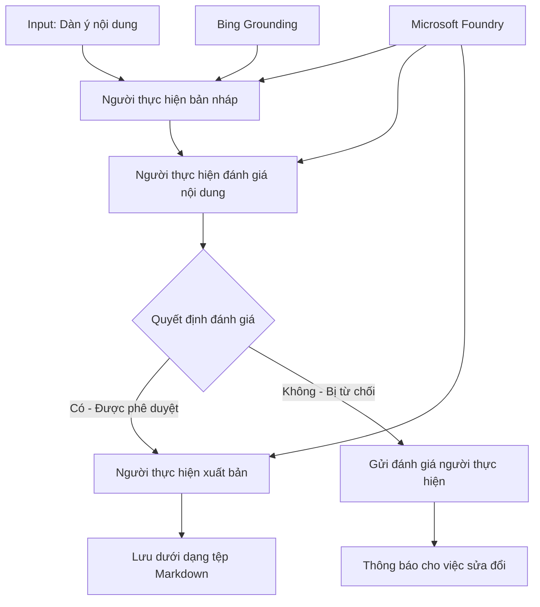

# 🔀 Quy trình công việc tác nhân có điều kiện với Microsoft Foundry (.NET)

## 📋 Hướng dẫn Quy trình Dựa trên Quyết định Thông minh

Sổ tay này trình bày **mẫu quy trình công việc có điều kiện** sử dụng Microsoft Foundry và Microsoft Agent Framework cho .NET. Bạn sẽ học cách xây dựng các quy trình công việc tinh vi, dựa trên quyết định thông minh, định tuyến xử lý dựa trên phân tích AI, quy tắc kinh doanh và điều kiện động để tự động hóa cấp doanh nghiệp.

## 🎯 Mục tiêu học tập

### 🧠 **Kiến trúc Quyết định Thông minh**
- **Triển khai Logic Có điều kiện**: Xây dựng cây quyết định phức tạp với nhiều điểm nhánh
- **Định tuyến Dựa trên AI**: Sử dụng mô hình Microsoft Foundry để đưa ra quyết định định tuyến thông minh
- **Thích ứng Quy trình Động**: Thay đổi hành vi quy trình dựa trên phân tích và điều kiện thời gian chạy
- **Tích hợp Quy tắc Doanh nghiệp**: Kết hợp logic kinh doanh và yêu cầu tuân thủ vào quy trình công việc

### 🔀 **Mẫu Điều kiện Nâng cao**
- **Quyết định Đa tiêu chí**: Đánh giá nhiều yếu tố cho các quyết định định tuyến
- **Xử lý Nhận thức Ngữ cảnh**: Đưa ra quyết định dựa trên ngữ cảnh và lịch sử tích lũy của quy trình
- **Điều chỉnh Quy trình Thích ứng**: Tự động điều chỉnh các đường xử lý dựa trên điều kiện thời gian thực
- **Tích hợp Công cụ Quy tắc**: Triển khai các công cụ quy tắc kinh doanh tinh vi trong quy trình công việc

### 🏢 **Ứng dụng Có điều kiện trong Doanh nghiệp**
- **Phân loại & Định tuyến Tài liệu**: Tự động phân loại và định tuyến tài liệu đến quy trình phù hợp
- **Phân loại Yêu cầu Khách hàng**: Định tuyến thông minh các yêu cầu khách hàng đến nhóm xử lý chuyên biệt
- **Xử lý Tuân thủ & Rủi ro**: Áp dụng các quy trình kiểm tra và đánh giá khác nhau dựa trên đánh giá rủi ro
- **Quy trình Đảm bảo Chất lượng**: Định tuyến nội dung qua các quy trình xem xét phù hợp dựa trên chỉ số chất lượng

## ⚙️ Yêu cầu & Cài đặt

### 📦 **Các Gói NuGet Cần thiết**

Các gói nâng cao cho xử lý quy trình công việc có điều kiện:

```xml
<!-- Core AI Framework -->
<PackageReference Include="Microsoft.Extensions.AI" Version="9.9.0" />

<!-- Azure AI Agents with Persistent State -->
<PackageReference Include="Azure.AI.Agents.Persistent" Version="1.2.0-beta.5" />

<!-- Azure Identity and Utilities -->
<PackageReference Include="Azure.Identity" Version="1.15.0" />
<PackageReference Include="System.Linq.Async" Version="6.0.3" />
<PackageReference Include="DotNetEnv" Version="3.1.1" />

<!-- Local Workflow Framework References -->
<!-- Microsoft.Agents.Workflows.dll - Advanced workflow orchestration -->
<!-- Microsoft.Agents.AI.AzureAI.dll - Microsoft Foundry integration -->
<!-- Microsoft.Agents.AI.dll - Core agent abstractions -->
```

### 🔑 **Cấu hình Microsoft Foundry**

**Tài nguyên Azure cần có:**
- Không gian làm việc Microsoft Foundry với các mô hình xử lý có điều kiện
- Đăng ký Azure với hạn mức tính toán và quyền phù hợp
- Mô hình AI đã triển khai để đưa ra quyết định và phân tích nội dung
- (Tùy chọn) Kết nối Bing Search API cho khả năng tạo nền tảng thông tin cơ sở

**Cấu hình môi trường (tệp .env):**
```env
# Microsoft Foundry Configuration
AZURE_AI_PROJECT_ENDPOINT=https://your-project.cognitiveservices.azure.com/
BING_CONNECTION_ID=your-bing-connection-id
```

**Thiết lập Xác thực:**
```csharp
// Azure CLI or Managed Identity authentication
using Azure.Identity;
var credential = new AzureCliCredential();

// Load environment configuration
DotNetEnv.Env.Load("../../../.env");
```

### 🏗️ **Kiến trúc Quy trình Công việc Có điều kiện**



**Các thành phần chính:**
- **Draft Executor**: Tác nhân AI tạo bản thảo nội dung ban đầu từ bản phác thảo
- **Content Review Executor**: Tác nhân AI đánh giá chất lượng và sự tuân thủ của bản thảo
- **Conditional Routing**: Logic quyết định định tuyến dựa trên kết quả đánh giá
- **Publish/Review Paths**: Các đường xử lý riêng biệt cho nội dung được duyệt và bị từ chối
- **State Management**: Duy trì ngữ cảnh nội dung và đánh giá trong suốt quy trình

## 🎨 **Mẫu Thiết kế Quy trình Có điều kiện**

### 📋 **Sản xuất Nội dung với Cổng Chất lượng**
```
Outline → Draft Creation → Quality Review → {Approve: Publish | Reject: Revise}
```

### 🎯 **Xử lý Tài liệu Dựa trên Rủi ro**
```
Document → Risk Assessment → {Low: Standard | High: Enhanced Review}
```

### 🔍 **Định tuyến Dịch vụ Khách hàng Thông minh**
```
Customer Query → Analysis → {Simple: FAQ Bot | Complex: Human Agent}
```

### 💼 **Quy trình Dựa trên Tuân thủ**
```
Content → Compliance Check → {Pass: Publish | Fail: Legal Review}
```

## 🏢 **Lợi ích Có điều kiện cho Doanh nghiệp**

### 🎯 **Tự động hóa Thông minh**
- **Quyết định Thông minh**: Các quyết định định tuyến dựa trên AI dựa vào phân tích nội dung và ngữ cảnh
- **Xử lý Thích ứng**: Quy trình tự động điều chỉnh dựa trên thay đổi điều kiện
- **Thực thi Quy tắc Kinh doanh**: Tự động áp dụng logic kinh doanh phức tạp và chính sách
- **Định tuyến Theo Ngữ cảnh**: Quyết định dựa trên toàn bộ lịch sử và ngữ cảnh tích lũy của quy trình

### 📈 **Hiệu quả Vận hành**
- **Phân bổ Tài nguyên Tối ưu**: Định tuyến công việc đến chuyên gia và quy trình phù hợp nhất
- **Giảm Can thiệp Thủ công**: Quyết định tự động giảm nhu cầu định tuyến thủ công
- **Thời gian Giải quyết Nhanh hơn**: Định tuyến trực tiếp đến chuyên môn và khả năng xử lý thích hợp
- **Áp dụng Đồng nhất**: Thực thi đều đặn các quy tắc và tiêu chí quyết định kinh doanh

### 🛡️ **Quản lý Rủi ro & Tuân thủ**
- **Đánh giá Rủi ro Tự động**: Đánh giá AI mức độ rủi ro nội dung và tình huống
- **Thực thi Tuân thủ**: Định tuyến tự động qua các quy trình quy định bắt buộc
- **Áp dụng Giao thức Bảo mật**: Áp dụng các biện pháp bảo mật nâng cao dựa trên đánh giá rủi ro
- **Duy trì Hồ sơ Kiểm tra**: Ghi lại đầy đủ các quyết định và lý do định tuyến

### 📊 **Phân tích & Cải tiến Liên tục**
- **Phân tích Quyết định**: Theo dõi hiệu quả và độ chính xác của các quyết định định tuyến
- **Nhận diện Mẫu**: Xác định xu hướng và mô hình quyết định định tuyến theo thời gian
- **Tối ưu Hiệu suất**: Cải tiến liên tục tiêu chí quyết định và hiệu quả định tuyến
- **Kinh doanh Thông minh**: Hiểu biết về đặc tính nội dung và yêu cầu xử lý

### 🔧 **Xuất sắc Kỹ thuật**
- **Quản lý Trạng thái Bền vững**: Duy trì trạng thái phức tạp trong thực thi quy trình
- **Kiến trúc Có thể mở rộng**: Xử lý yêu cầu xử lý có điều kiện với khối lượng lớn
- **Khả năng Tích hợp**: Tích hợp liền mạch với các hệ thống và quy trình kinh doanh hiện có
- **Giám sát & Quan sát**: Theo dõi toàn diện hiệu suất và quyết định của quy trình

Hãy xây dựng quy trình doanh nghiệp định hướng quyết định thông minh với .NET! 🚀

## 💻 Chạy Mã

Triển khai đầy đủ nằm trong `04.dotnet-agent-framework-workflow-aifoundry-condition.cs`. Đây là minh họa một **quy trình sản xuất nội dung với các cổng chất lượng**:

### 🏗️ **Kiến trúc Quy trình**

```
Content Outline → Draft Creation → Quality Review → Conditional Routing:
                                                      ├─ Approved (>200 words) → Publish
                                                      └─ Rejected (<200 words) → Review Notification
```

**Các Tác nhân trong Quy trình:**
1. **Evangelist Agent**: Tạo bản thảo hướng dẫn từ bản phác thảo với việc tạo nền tảng Bing
2. **Content Reviewer Agent**: Đánh giá chất lượng bản thảo (số lượng từ, độ đầy đủ)
3. **Publisher Agent**: Lưu nội dung được phê duyệt thành tệp Markdown có dấu thời gian

**Các Bộ Thực thi Tùy chỉnh:**
1. **DraftExecutor**: Điều phối việc tạo bản thảo
2. **ContentReviewExecutor**: Thực hiện đánh giá chất lượng
3. **PublishExecutor**: Xử lý xuất bản nội dung được phê duyệt
4. **SendReviewExecutor**: Quản lý thông báo nội dung bị từ chối

### 🚀 Chạy Ví dụ

**Yêu cầu trước:**
- Cấu hình không gian làm việc Microsoft Foundry
- Xác thực Azure CLI (`az login`)
- (Tùy chọn) Kết nối Bing Search cho tạo nền tảng dữ liệu

```bash
# Đặt script thành có thể thực thi (Unix/Linux/macOS)
chmod +x 04.dotnet-agent-framework-workflow-aifoundry-condition.cs

# Chạy luồng công việc có điều kiện
./04.dotnet-agent-framework-workflow-aifoundry-condition.cs
```

Hoặc trên Windows:
```powershell
dotnet run 04.dotnet-agent-framework-workflow-aifoundry-condition.cs
```

### 📝 Kết quả Dự kiến

Quy trình sẽ:
1. **Tạo Tác nhân**: Khởi tạo ba tác nhân Microsoft Foundry chuyên biệt
2. **Tạo Bản thảo**: Tác nhân Evangelist tạo bản thảo hướng dẫn từ bản phác thảo
3. **Đánh giá Nội dung**: Tác nhân Content Reviewer đánh giá chất lượng bản thảo
4. **Định tuyến Có điều kiện**:
   - **Nếu được duyệt (>200 từ)**: Bộ xuất bản lưu thành tệp Markdown
   - **Nếu bị từ chối (<200 từ)**: Gửi thông báo đánh giá
5. **Hiển thị Kết quả**: Hiển thị kết quả cuối cùng của quy trình

### 🔧 Tùy chỉnh

**Thay đổi Tiêu chí Đánh giá:**
```csharp
const string ContentReviewerInstructions = @"
You are a content reviewer...
1. Check if content is more than 500 words (instead of 200)
2. Verify technical accuracy
3. Ensure proper formatting
...";
```

**Thêm Nhiều Đường Điều kiện:**
```csharp
var workflow = new WorkflowBuilder(draftExecutor)
    .AddEdge(draftExecutor, contentReviewerExecutor)
    .AddEdge(contentReviewerExecutor, publishExecutor, condition: GetCondition("Excellent"))
    .AddEdge(contentReviewerExecutor, editExecutor, condition: GetCondition("Good"))
    .AddEdge(contentReviewerExecutor, sendReviewerExecutor, condition: GetCondition("Poor"))
    .Build();
```

**Thay đổi Yêu cầu Nội dung:**
```csharp
string OUTLINE_Content = @"
# Your Custom Topic
## Section 1
https://your-reference-url
## Section 2
...
";
```

### 🎯 Ứng dụng Thực tiễn

Mẫu quy trình có điều kiện này lý tưởng cho:
- **Hệ thống Quản lý Nội dung**: Quy trình biên tập tự động với cổng chất lượng
- **Xử lý Tài liệu**: Định tuyến tài liệu dựa trên phân loại và tuân thủ
- **Hỗ trợ Khách hàng**: Định tuyến thông minh vé dựa trên độ phức tạp và mức khẩn cấp
- **Xem xét Pháp lý**: Định tuyến hợp đồng dựa trên đánh giá rủi ro và giá trị
- **Quy trình Nhân sự**: Định tuyến hồ sơ qua các quy trình sàng lọc thích hợp

### 🔍 Hiểu về Logic Có điều kiện

**Hàm Điều kiện:**
```csharp
public Func<object?, bool> GetCondition(string expectedResult) =>
    reviewResult => reviewResult is ReviewResult review && review.Result == expectedResult;
```

Hàm này tạo một biểu thức kiểm tra mà:
1. Kiểm tra kiểu kết quả có phải là `ReviewResult`
2. So sánh thuộc tính `Result` với giá trị mong đợi
3. Trả về true/false để xác định định tuyến

**Đường đi của Quy trình với Điều kiện:**
```csharp
.AddEdge(contentReviewerExecutor, publishExecutor, condition: GetCondition("Yes"))
.AddEdge(contentReviewerExecutor, sendReviewerExecutor, condition: GetCondition("No"))
```

### 📊 Tính năng Nâng cao

**Xác thực JSON Schema:**
Quy trình sử dụng schema JSON để đảm bảo phản hồi có cấu trúc:

```csharp
// Define response structure
public class ReviewResult
{
    [JsonPropertyName("review_result")]
    public string Result { get; set; } = string.Empty;
    
    [JsonPropertyName("reason")]
    public string Reason { get; set; } = string.Empty;
    
    [JsonPropertyName("draft_content")]
    public string DraftContent { get; set; } = string.Empty;
}

// Apply to agent
ResponseFormat = ChatResponseFormat.ForJsonSchema(
    AIJsonUtilities.CreateJsonSchema(typeof(ReviewResult)), 
    "ReviewResult", 
    "Review Result From DraftContent"
)
```

**Tích hợp Bing Grounding:**
Tác nhân Evangelist sử dụng Bing grounding để truy cập thông tin thời gian thực:

```csharp
var bingGroundingConfig = new BingGroundingSearchConfiguration(bing_conn_id);
BingGroundingToolDefinition bingGroundingTool = new(
    new BingGroundingSearchToolParameters([bingGroundingConfig])
);
```

Điều này cho phép tác nhân theo dõi URL trong bản phác thảo và trích xuất thông tin hiện tại.

### 🛡️ Xử lý Lỗi

Quy trình bao gồm xử lý lỗi mạnh mẽ cho nội dung bị từ chối:
- Thất bại đánh giá kích hoạt đường đi thay thế
- Thông báo cung cấp lý do từ chối rõ ràng
- Nội dung được giữ lại để sửa đổi

### 🔄 Mở rộng Quy trình

**Thêm Vòng Lặp Sửa đổi:**
Tạo vòng phản hồi tự động viết lại nội dung:

```csharp
.AddEdge(contentReviewerExecutor, publishExecutor, condition: GetCondition("Yes"))
.AddEdge(contentReviewerExecutor, draftExecutor, condition: GetCondition("No")) // Loop back
```

**Triển khai Đánh giá Nhiều Cấp:**
Thêm nhiều giai đoạn đánh giá với tiêu chí khác nhau:

```csharp
.AddEdge(draftExecutor, technicalReviewer)
.AddEdge(technicalReviewer, editorialReviewer, condition: GetCondition("TechPass"))
.AddEdge(editorialReviewer, publishExecutor, condition: GetCondition("EditPass"))
```

Mẫu quy trình có điều kiện này cung cấp nền tảng để xây dựng các hệ thống tự động hóa doanh nghiệp thông minh, tinh vi! 🚀

---

<!-- CO-OP TRANSLATOR DISCLAIMER START -->
**Tuyên bố miễn trừ trách nhiệm**:
Tài liệu này đã được dịch bằng dịch vụ dịch thuật AI [Co-op Translator](https://github.com/Azure/co-op-translator). Mặc dù chúng tôi cố gắng đảm bảo độ chính xác, xin lưu ý rằng bản dịch tự động có thể chứa lỗi hoặc sai sót. Tài liệu gốc bằng ngôn ngữ gốc nên được coi là nguồn tin chính thức. Đối với thông tin quan trọng, nên sử dụng dịch vụ dịch thuật chuyên nghiệp bởi con người. Chúng tôi không chịu trách nhiệm về bất kỳ hiểu lầm hoặc giải thích sai nào phát sinh từ việc sử dụng bản dịch này.
<!-- CO-OP TRANSLATOR DISCLAIMER END -->