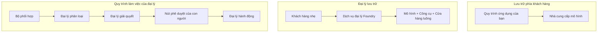
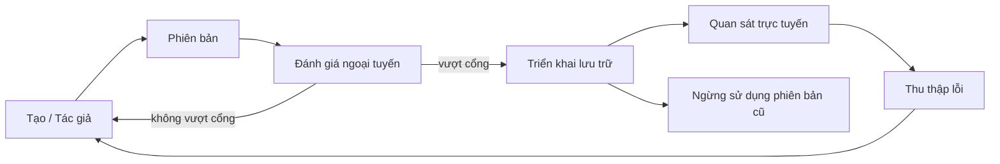
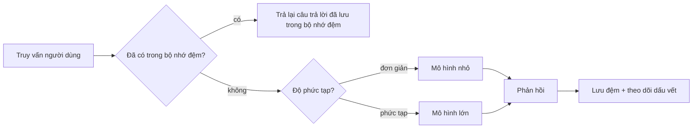
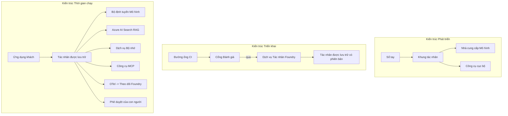

# Triển khai Các Đại lý Có Thể Mở Rộng với Microsoft Foundry


Cho đến thời điểm này trong khóa học, bạn đã xây dựng các đại lý chạy trên máy tính xách tay của bạn, bên trong một notebook, được điều khiển bởi `az login` và một vài biến môi trường. Đó chính xác là cách học đúng đắn. Nhưng đó không phải là cách để vận hành một đại lý mà hàng ngàn khách hàng dựa vào lúc 3 giờ sáng.

Bài học này nói về khoảng cách giữa "nó chạy trên máy của tôi" và "nó chạy ổn định, đáng tin cậy và tiết kiệm trong môi trường sản xuất." Chúng ta sẽ thu hẹp khoảng cách đó bằng cách sử dụng **Microsoft Foundry** và **Dịch vụ Đại lý Microsoft Foundry**, và làm điều đó bằng cách xây dựng một đại lý hỗ trợ khách hàng thực tế có các công cụ, truy xuất, bộ nhớ, đánh giá và giám sát.

## Giới thiệu

Bài học này sẽ bao gồm:

- Sự khác biệt giữa một **đại lý nguyên mẫu** và một **đại lý đã triển khai**, và tại sao sự chuyển đổi chủ yếu liên quan đến mọi thứ *xung quanh* mô hình.
- **Mẫu triển khai** cho đại lý: được lưu trữ trên máy khách, dịch vụ lưu trữ (Đại lý Được Lưu trữ), và điều phối theo quy trình công việc.
- **Vòng đời đại lý** trên Microsoft Foundry — tạo, phiên bản, triển khai, đánh giá, quan sát, nghỉ hưu.
- **Chiến lược mở rộng**: định tuyến mô hình, lưu vào bộ nhớ đệm, đồng thời, và thiết kế không trạng thái.
- **Khả năng quan sát** với OpenTelemetry và theo dõi Foundry.
- **Tối ưu chi phí** thông qua lựa chọn mô hình, định tuyến, và các cổng đánh giá.
- **Cân nhắc doanh nghiệp**: quản trị, phê duyệt con người, và vận hành các máy chủ MCP an toàn trong sản xuất.

## Mục tiêu học tập

Sau khi hoàn thành bài học này, bạn sẽ biết cách:

- Chọn mẫu triển khai phù hợp cho khối lượng công việc đại lý cụ thể.
- Triển khai một đại lý đến Dịch vụ Đại lý Microsoft Foundry để nó được quản lý phiên bản, điều hành, và dễ quan sát.
- Công cụ hóa một đại lý để theo dõi và thiết lập một đường ống đánh giá chạy trước mỗi lần phát hành.
- Áp dụng định tuyến mô hình và lưu bộ nhớ đệm để giữ độ trễ và chi phí trong tầm kiểm soát khi mở rộng.
- Thêm cổng phê duyệt con người cho các hành động rủi ro cao và tích hợp máy chủ MCP theo cách an toàn trong sản xuất.

## Yêu cầu tiên quyết

Bài học này giả định bạn đã hoàn thành các bài học trước và quen thuộc với:

- Xây dựng đại lý với [Microsoft Agent Framework](../14-microsoft-agent-framework/README.md) (Bài học 14).
- [Sử dụng Công cụ](../04-tool-use/README.md) (Bài học 4) và [Agentic RAG](../05-agentic-rag/README.md) (Bài học 5).
- [Bộ nhớ Đại lý](../13-agent-memory/README.md) (Bài học 13) và [Giao thức Agentic / MCP](../11-agentic-protocols/README.md) (Bài học 11).
- [Khả năng quan sát và Đánh giá](../10-ai-agents-production/README.md) (Bài học 10) — bài học này xây dựng trực tiếp trên đó.

Bạn cũng sẽ cần:

- Một **đăng ký Azure** và một **dự án Microsoft Foundry** với ít nhất một mô hình trò chuyện đã được triển khai.
- **Azure CLI** đã xác thực (`az login`).
- Python 3.12+ và các gói trong kho [`requirements.txt`](../../../requirements.txt).

## Từ Nguyên mẫu đến Sản xuất: Những Thay đổi Thực sự

Một đại lý nguyên mẫu và đại lý sản xuất có vòng lặp cốt lõi giống nhau — suy luận, gọi công cụ, phản hồi. Những gì thay đổi là mọi thứ bao quanh vòng lặp đó. Mô hình có thể chiếm khoảng 20% đại lý trong sản xuất; 80% còn lại là bộ khung vận hành.

| Mối quan tâm | Nguyên mẫu | Sản xuất |
| --- | --- | --- |
| **Lưu trữ** | Chạy trong notebook của bạn | Chạy như dịch vụ được lưu trữ, phiên bản hóa và triển khai ra |
| **Định danh** | Token `az login` của bạn | Định danh được quản lý với RBAC phạm vi |
| **Trạng thái** | Trong bộ nhớ, mất khi khởi động lại | Bên ngoài (bộ lưu trữ thread, dịch vụ bộ nhớ) |
| **Thất bại** | Bạn thấy traceback | Thử lại, dự phòng, thư chết, cảnh báo |
| **Chi phí** | "Chỉ vài xu" | Theo dõi theo yêu cầu, định tuyến, lưu bộ nhớ đệm, ngân sách |
| **Chất lượng** | Bạn nhìn bằng mắt | Đánh giá tự động trước mỗi phát hành |
| **Độ tin cậy** | Bạn phê duyệt mọi hành động | Chính sách + con người trong vòng lặp cho hành động rủi ro |

Hãy nhớ bảng này. Mỗi phần bên dưới tương ứng với một dòng trong bảng.

## Mẫu Triển khai Đại lý

Có ba mẫu bạn sẽ sử dụng, thường kết hợp với nhau.

### 1. Đại lý Lưu trữ trên Máy Khách

Đối tượng đại lý sống bên trong tiến trình ứng dụng *của bạn*. Mã của bạn gọi trực tiếp nhà cung cấp mô hình; vòng lặp suy luận chạy trong dịch vụ của bạn. Đây là những gì tất cả bài học trước đã làm.

- **Sử dụng khi** bạn cần kiểm soát hoàn toàn vòng lặp, trung gian tùy chỉnh, hoặc bạn đang nhúng đại lý trong backend hiện có.
- **Đánh đổi**: bạn tự quản lý việc mở rộng quy mô, trạng thái, và khả năng chịu lỗi.

### 2. Đại lý Được Lưu trữ (Dịch vụ Đại lý Foundry)

Đại lý được *đăng ký như một tài nguyên* trong Microsoft Foundry. Foundry lưu trữ vòng lặp suy luận, lưu trữ chuỗi hội thoại, thực thi an toàn nội dung và RBAC, và làm đại lý hiển thị trong cổng thông tin Foundry. Ứng dụng của bạn trở thành một khách mỏng tạo chuỗi hội thoại và đọc phản hồi.

- **Sử dụng khi** bạn muốn bền bỉ, khả năng quan sát tích hợp, quản trị, và giảm bề mặt vận hành.
- **Đánh đổi**: ít kiểm soát cấp thấp hơn đổi lấy môi trường chạy được quản lý.

### 3. Quy trình Công việc Đại lý

Nhiều đại lý (và công cụ) được ghép thành đồ thị với luồng điều khiển rõ ràng — các bước tuần tự, phân nhánh, nút phê duyệt con người và các điểm kiểm tra bền bỉ có thể tạm dừng và tiếp tục. Đây là khả năng **Workflows** của Microsoft Agent Framework áp dụng ở quy mô triển khai.

- **Sử dụng khi** một nhiệm vụ đơn lẻ bao gồm nhiều đại lý chuyên biệt hoặc cần bước phê duyệt ở giữa.
- **Đánh đổi**: nhiều phần chuyển động hơn; cần khả năng quan sát cấp điều phối.



## Vòng Đời Đại lý trên Microsoft Foundry

Triển khai một đại lý không phải là thao tác `push` một lần. Đó là một vòng lặp, và nó trông rất giống chu kỳ phát hành phần mềm bởi vì đó chính xác là nó.



Ý tưởng chính, tiếp nối từ [Bài học 10](../10-ai-agents-production/README.md): **đánh giá offline là một cổng, không phải suy nghĩ phụ.** Phiên bản đại lý mới không phát hành nếu không vượt qua ngưỡng đánh giá của bạn. Khả năng quan sát trực tuyến sau đó phản hồi lỗi thực tế vào bộ kiểm thử offline. Đó là toàn bộ vòng lặp.

## Chiến lược Mở Rộng

Mở rộng đại lý khác với mở rộng một API web không trạng thái, vì mỗi yêu cầu có thể kích hoạt nhiều cuộc gọi mô hình và công cụ tốn kém. Bốn kỹ thuật chịu phần lớn tải.

**Xử lý yêu cầu không trạng thái.** Không giữ trạng thái trên mỗi người dùng trong bộ nhớ tiến trình. Lưu chuỗi hội thoại trong kho lưu trữ thread Foundry hoặc dịch vụ bộ nhớ để bất kỳ bản thể nào cũng có thể xử lý yêu cầu. Đây là cách bạn mở rộng theo chiều ngang — thêm bản thể, không cần phiên giữ chỗ.

**Định tuyến mô hình.** Không phải yêu cầu nào cũng cần đến mô hình có khả năng cao (và đắt nhất). Định tuyến các yêu cầu đơn giản — phân loại ý định, trả lời ngắn gọn — đến mô hình nhỏ, nhanh, và dành mô hình lớn cho suy luận thực sự. **Model Router** của Foundry có thể làm điều đó cho bạn, hoặc bạn có thể triển khai bộ phân loại nhẹ nhàng tự làm. Bạn sẽ xây dựng phiên bản DIY trong phòng lab.

**Lưu bộ nhớ đệm phản hồi.** Nhiều câu hỏi hỗ trợ gần như giống nhau ("Làm thế nào để tôi đặt lại mật khẩu?"). Lưu câu trả lời cho các câu hỏi phổ biến và trả lời mà không cần gọi mô hình. Ngay cả tỷ lệ trúng bộ nhớ đệm vừa phải cũng giảm đáng kể chi phí và độ trễ.

**Đồng thời và áp lực ngược.** Nhà cung cấp mô hình có giới hạn tốc độ. Giới hạn song song, sử dụng thử lại với lùi dần theo cấp số nhân, và thất bại nhẹ nhàng (phản hồi "chúng tôi đang xử lý" xếp hàng tốt hơn lỗi 500).



## Khả năng Quan sát trong Sản xuất

Bạn không thể vận hành những gì bạn không thể nhìn thấy. Như đã đề cập trong Bài học 10, Microsoft Agent Framework phát ra các trace **OpenTelemetry** một cách nguyên bản — mỗi cuộc gọi mô hình, gọi công cụ, và bước phối hợp đều thành một span. Trong sản xuất, bạn xuất các span đó đến Microsoft Foundry (hoặc bất kỳ backend tương thích OTel nào) để bạn có thể:

- Theo dấu một khiếu nại khách hàng từ đầu đến cuối qua mọi cuộc gọi mô hình và công cụ.
- Quan sát độ trễ p50/p95 và chi phí trên mỗi yêu cầu theo thời gian.
- Cảnh báo trên các đỉnh lỗi và bất thường về chi phí trước khi người dùng của bạn (hoặc đội tài chính) nhận thấy.

```python
from agent_framework.observability import get_tracer

tracer = get_tracer()

with tracer.start_as_current_span("support_request") as span:
    span.set_attribute("customer.tier", "enterprise")
    span.set_attribute("routed.model", "gpt-4.1-mini")
    # việc thực thi tác nhân được theo dõi tự động bên trong phạm vi này
```

Các thuộc tính như `customer.tier` và `routed.model` biến một bức tường các trace thành các câu hỏi có thể trả lời được ("khách hàng doanh nghiệp có đang quá thường xuyên bị định tuyến đến mô hình nhỏ không?").

## Tối ưu Chi phí

Chi phí trong các đại lý sản xuất bị chi phối bởi token. Ba cần gạt, theo thứ tự ảnh hưởng:

1. **Chọn kích thước mô hình phù hợp.** Mô hình nhỏ vượt qua cổng đánh giá của bạn gần như luôn rẻ hơn mô hình lớn cũng vượt qua. Dùng đánh giá để *chứng minh* mô hình nhỏ đủ tốt thay vì mặc định dùng mô hình lớn nhất để an toàn.
2. **Định tuyến theo độ phức tạp.** Như trên — chỉ trả giá mô hình lớn cho những yêu cầu cần suy luận mô hình lớn.
3. **Lưu bộ nhớ đệm mạnh mẽ.** Cuộc gọi mô hình rẻ nhất là cuộc gọi bạn không phải thực hiện.

Các cổng đánh giá và kiểm soát chi phí là cùng một kỷ luật nhìn từ hai góc độ: đánh giá cho bạn *mức chất lượng tối thiểu*, định tuyến và lưu bộ nhớ đệm giữ chi phí càng gần mức *đó* càng tốt.

## Cân nhắc Triển khai Doanh nghiệp

**Quản trị.** Đại lý được lưu trữ kế thừa RBAC, an toàn nội dung, và ghi nhật ký kiểm toán của Foundry. Cấp cho mỗi đại lý một định danh được quản lý với đặc quyền tối thiểu cần thiết — quyền truy cập đọc-chỉ vào cơ sở kiến thức, quyền truy cập phạm vi API ticketing, không hơn.

**Con người trong vòng lặp.** Một số hành động quá quan trọng để tự động hoàn toàn — cấp hoàn tiền, xóa tài khoản, chuyển lên pháp lý. Microsoft Agent Framework hỗ trợ các công cụ **yêu cầu phê duyệt**: đại lý đề xuất hành động, tạm dừng thực thi, con người phê duyệt hoặc từ chối, và quy trình tiếp tục. Bạn đã thấy nguyên thủy này trong [Bài 6](../06-building-trustworthy-agents/README.md); ở đây bạn triển khai nó.

**MCP trong sản xuất.** [MCP](../11-agentic-protocols/README.md) cho phép đại lý của bạn sử dụng công cụ bên ngoài qua giao diện chuẩn. Trong sản xuất, coi mỗi máy chủ MCP là ranh giới không tin cậy: cố định phiên bản máy chủ, chạy với định danh phạm vi, xác thực đầu ra, và không bao giờ tiết lộ bí mật với nó. Máy chủ MCP là một phụ thuộc, và phụ thuộc được vá, kiểm toán, và giới hạn tốc độ.



Ba sơ đồ đó — phát triển, triển khai, vận hành — là cùng một đại lý ở ba giai đoạn đời sống. Phòng lab tiếp theo sẽ hướng dẫn bạn xây dựng nó.

## Phòng Lab Thực Hành: Đại lý Hỗ trợ Khách hàng Sẵn sàng Cho Sản xuất

Mở [`code_samples/16-python-agent-framework.ipynb`](./code_samples/16-python-agent-framework.ipynb) và làm tuần tự. Bạn sẽ lắp ráp một **đại lý hỗ trợ khách hàng Contoso** với mọi mối quan tâm sản xuất được kết nối:

1. **Gọi công cụ** — tra cứu trạng thái đơn hàng và mở phiếu hỗ trợ.
2. **RAG** — trả lời câu hỏi chính sách từ cơ sở kiến thức (Azure AI Search, với cơ chế dự phòng trong bộ nhớ để notebook chạy mà không cần tài nguyên Search).
3. **Bộ nhớ** — ghi nhớ khách hàng qua lần lượt các lượt thoại.
4. **Định tuyến mô hình** — bộ phân loại độ phức tạp định tuyến từng yêu cầu đến mô hình nhỏ hoặc lớn.
5. **Lưu bộ nhớ đệm câu trả lời** — các câu hỏi lặp lại được phục vụ từ bộ nhớ đệm.
6. **Phê duyệt con người** — hoàn tiền trên ngưỡng tạm dừng chờ xác nhận con người.
7. **Đường ống đánh giá** — bộ kiểm thử offline nhỏ đánh giá đại lý và làm cổng phát hành.
8. **Khả năng quan sát** — theo dõi OpenTelemetry quanh mỗi yêu cầu.

### Hướng dẫn

Notebook được tổ chức để mỗi mối quan tâm sản xuất là một phần có thể chạy độc lập. Trung tâm của nó là bộ xử lý yêu cầu kết hợp định tuyến và lưu bộ nhớ đệm:

```python
async def handle_support_request(query: str, customer_id: str) -> str:
    # 1. Phục vụ từ bộ nhớ cache khi có thể.
    cached = response_cache.get(normalize(query))
    if cached:
        return cached

    # 2. Điều hướng theo mức độ phức tạp để kiểm soát chi phí.
    model = "gpt-4.1-mini" if is_simple(query) else "gpt-4.1"

    # 3. Chạy tác nhân bên trong một khoảng theo dõi để quan sát.
    with tracer.start_as_current_span("support_request") as span:
        span.set_attribute("routed.model", model)
        span.set_attribute("customer.id", customer_id)
        response = await support_agent.run(query, model=model)

    # 4. Lưu vào bộ nhớ cache và trả về.
    response_cache.set(normalize(query), response.text)
    return response.text
```

Cổng đánh giá bảo vệ phát hành trông như sau:

```python
async def evaluation_gate(agent, test_cases, threshold: float = 0.8) -> bool:
    passed = 0
    for case in test_cases:
        result = await agent.run(case["input"])
        if score_response(result.text, case["expected"]) >= 0.8:
            passed += 1
    pass_rate = passed / len(test_cases)
    print(f"Evaluation pass rate: {pass_rate:.0%} (gate: {threshold:.0%})")
    return pass_rate >= threshold  # chỉ triển khai nếu cổng được phê duyệt
```

Đọc từng dòng — notebook giữ các nguyên thủy nhỏ để không có gì bị giấu sau một lời gọi framework.

## Xác nhận Đại lý Đã Triển khai với Các Bài Kiểm Tra Khói

Cổng đánh giá ở trên chạy *offline* trên đối tượng đại lý của bạn. Khi đại lý được triển khai như Đại lý Được Lưu trữ, bạn cần thêm một kiểm tra nữa, thậm chí rẻ hơn: **liệu điểm cuối triển khai có thật sự phản hồi?**

Triển khai "thành công" chỉ chứng minh mặt điều khiển chấp nhận định nghĩa — không chứng minh được đại lý phản hồi. Một phụ thuộc mất, định tuyến mô hình sai, hoặc kết nối hết hạn có thể để lại triển khai xanh mà không trả về gì. Một **bài kiểm tra khói** phát hiện điều đó trong vài giây, trên mỗi lần triển khai, mà không mất chi phí đánh giá đầy đủ.

Kho lưu trữ này cung cấp đường ống kiểm tra khói sẵn sàng dùng dựa trên hành động GitHub [AI Smoke Test](https://github.com/marketplace/actions/ai-smoke-test):

- **Danh mục** — [`tests/lesson-16-smoke-tests.json`](../../../tests/lesson-16-smoke-tests.json) chứa lời nhắc và khẳng định cho đại lý hỗ trợ Contoso (câu trả lời chính sách có cơ sở, tra cứu đơn hàng, giữ chủ đề, và sự liên tục đa lượt thoại). Danh mục cho đại lý các bài học khác cũng nằm bên cạnh — xem [`tests/README.md`](../tests/README.md).
- **Quy trình làm việc** — [`.github/workflows/smoke-test.yml`](../../../.github/workflows/smoke-test.yml) đăng nhập bằng Azure OIDC và gửi POST từng lời nhắc đến điểm cuối Responses của đại lý, sẽ thất bại công việc nếu có bỏ sót khẳng định nào.

```yaml
- name: Smoke-test hosted agent
  uses: JFolberth/ai-smoketest@v1
  with:
    project_endpoint: ${{ inputs.project_endpoint }}
    agent_name: ContosoSupportAgent
    tests_file: tests/lesson-16-smoke-tests.json
```


Chạy nó từ tab **Actions** khi đại lý của bạn đã được triển khai, cung cấp điểm cuối dự án Foundry và tên đại lý của bạn. Danh tính liên kết cần có vai trò **Azure AI User** ở phạm vi dự án Foundry. Hãy tưởng tượng các lớp như một kim tự tháp: kiểm tra khói (có thể truy cập và phản hồi?) chạy trên mỗi lần triển khai, đánh giá ngoại tuyến (đủ tốt để phát hành?) chạy trước khi thăng cấp, và đánh giá trực tuyến (hiệu quả thế nào trong môi trường thực tế?) chạy liên tục.

## Kiểm tra kiến thức

Kiểm tra sự hiểu biết của bạn trước khi chuyển sang bài tập.

**1. Đại khái, một đại lý sản xuất chiếm bao nhiêu phần là "mô hình," và phần còn lại là gì?**

<details>
<summary>Trả lời</summary>

Mô hình là phần thiểu số của hệ thống — thường được cho là khoảng 20%. Phần còn lại là khung vận hành: lưu trữ và phiên bản, quản lý danh tính và RBAC, trạng thái bên ngoài, xử lý sự cố, theo dõi chi phí, đánh giá và kiểm soát có người tham gia. Việc chuyển sang sản xuất chủ yếu là xây dựng mọi thứ *xung quanh* vòng lập luận.
</details>

**2. Khi nào bạn chọn Đại lý Hosted thay vì đại lý do khách hàng lưu trữ?**

<details>
<summary>Trả lời</summary>

Khi bạn muốn một môi trường chạy được quản lý với độ bền tích hợp (luồng hoạt động liên tục và có thể tiếp tục), khả năng quan sát, an toàn nội dung và RBAC, và bạn sẵn sàng đánh đổi một phần kiểm soát sâu trên vòng lập luận để giảm bớt mặt hoạt động. Đại lý do khách hàng lưu trữ thích hợp khi bạn cần kiểm soát toàn bộ vòng hoặc nhúng đại lý vào backend hiện có.
</details>

**3. Tại sao một đại lý có thể mở rộng được phải không giữ trạng thái trong bộ nhớ tiến trình của chính nó?**

<details>
<summary>Trả lời</summary>

Để bất kỳ phiên bản nào cũng có thể xử lý bất kỳ yêu cầu nào, điều này cho phép mở rộng theo chiều ngang mà không cần phiên làm việc cố định. Trạng thái cuộc trò chuyện theo người dùng được lưu bên ngoài vào kho lưu trữ luồng hoặc dịch vụ bộ nhớ. Nếu trạng thái nằm trong bộ nhớ tiến trình, bạn sẽ mất nó khi khởi động lại và không thể phân phối tải tự do.
</details>

**4. Vấn đề gì mà phân luồng mô hình giải quyết, và nó liên quan thế nào đến đánh giá?**

<details>
<summary>Trả lời</summary>

Phân luồng gửi các yêu cầu đơn giản đến mô hình nhỏ, rẻ, nhanh và dành mô hình lớn cho lập luận thực sự, kiểm soát cả độ trễ và chi phí. Nó liên quan đến đánh giá vì đánh giá là thứ *chứng minh* mô hình nhỏ đủ tốt cho một loại yêu cầu — phân luồng mà không đánh giá là đoán mò.
</details>

**5. "Cổng đánh giá" là gì và nó nằm ở đâu trong vòng đời?**

<details>
<summary>Trả lời</summary>

Cổng đánh giá là một bộ kiểm tra ngoại tuyến chạy trên bộ kiểm thử mới của phiên bản đại lý và chặn việc triển khai nếu tỷ lệ đạt không vượt qua ngưỡng. Nó nằm giữa "phiên bản" và "triển khai" trong vòng đời, biến chất lượng thành điều kiện tiên quyết để phát hành thay vì thứ bạn kiểm tra sau khi phát hành.
</details>

**6. Tại sao máy chủ MCP phải được coi là biên không tin cậy trong sản xuất?**

<details>
<summary>Trả lời</summary>

Bởi vì nó là một phụ thuộc bên ngoài mà đại lý của bạn gọi vào. Bạn nên cố định phiên bản của nó, chạy nó với danh tính có phạm vi, xác thực đầu ra của nó, giới hạn tần suất, và không bao giờ tiết lộ bí mật cho nó — nguyên tắc kỷ luật tương tự với bất kỳ phụ thuộc bên thứ ba nào. Đầu ra của nó chảy vào vòng lập luận của đại lý bạn, nên tin tưởng không được xác thực là nguy cơ bảo mật.
</details>

**7. Thay đổi đơn lẻ nào thường có tác động lớn nhất đến chi phí đại lý sản xuất, và tại sao?**

<details>
<summary>Trả lời</summary>

Kích thước mô hình phù hợp — sử dụng mô hình nhỏ nhất mà vẫn vượt qua cổng đánh giá của bạn. Chi phí bị chi phối bởi số token, và mô hình nhỏ hơn mà đạt chuẩn chất lượng gần như luôn rẻ hơn mô hình lớn hơn. Bộ nhớ đệm và phân luồng sau đó giảm chi phí thêm nữa, nhưng chọn mô hình cơ bản phù hợp có tác động lớn nhất ngay từ đầu.
</details>

**8. Thuộc tính span như `customer.tier` và `routed.model` đóng vai trò gì trong khả năng quan sát?**

<details>
<summary>Trả lời</summary>

Chúng biến các trace thô thành các câu hỏi kinh doanh có thể trả lời được. Nếu không có thuộc tính bạn chỉ có một bức tường các span; với chúng bạn có thể hỏi "khách hàng doanh nghiệp có bị phân luồng đến mô hình nhỏ quá thường xuyên không?" hoặc "mô hình nào xử lý yêu cầu chậm nhất của chúng ta?" Thuộc tính là cách bạn phân lớp dữ liệu theo các chiều quan trọng đối với hoạt động của bạn.
</details>

## Bài tập

Lấy đại lý hỗ trợ khách hàng từ phòng thí nghiệm và củng cố nó cho một kịch bản cụ thể: **đại lý hỗ trợ thanh toán thuê bao cho một công ty SaaS.**

Bài nộp của bạn nên:

1. **Thay thế công cụ** bằng các công cụ liên quan đến thanh toán: `get_subscription_status`, `get_invoice`, và `issue_credit` (tín dụng trên 50 đô la cần phê duyệt con người).
2. **Thêm ba tài liệu RAG** bao gồm chính sách hoàn tiền, chu kỳ thanh toán và chính sách hủy của công ty.
3. **Mở rộng bộ đánh giá** lên ít nhất tám trường hợp, bao gồm ít nhất hai trường hợp *nên* kích hoạt đường phê duyệt con người, và xác nhận cổng đánh giá của bạn đúng khi qua hoặc không qua.
4. **Thêm một báo cáo chi phí**: sau khi chạy mười truy vấn hỗn hợp qua đại lý, in ra bao nhiêu truy vấn được gửi tới mô hình nhỏ, bao nhiêu tới mô hình lớn, và bao nhiêu được phục vụ từ bộ nhớ đệm.

Viết một đoạn ngắn (trong ô markdown) giải thích quy tắc phân luồng mô hình mà bạn đã chọn và cách bạn xác thực nó với lưu lượng thực tế. Không có câu trả lời duy nhất đúng — bạn sẽ được đánh giá xem các mối quan tâm sản xuất có được nối kết một cách mạch lạc hay không.

## Tóm tắt

Trong bài học này, bạn đã chuyển một đại lý từ nguyên mẫu sang sản xuất với Microsoft Foundry:

- Việc lên sản xuất chủ yếu là về **khung vận hành** xung quanh mô hình — lưu trữ, danh tính, trạng thái, xử lý sự cố, chi phí, chất lượng và độ tin cậy.
- Bạn đã học ba **mẫu triển khai** — lưu trữ bởi khách hàng, Đại lý Hosted, và Quy trình làm việc đại lý — và khi nào nên dùng từng loại.
- Bạn đã đi qua **vòng đời đại lý**, nơi đánh giá ngoại tuyến **đóng vai trò như cổng phát hành** và khả năng quan sát trực tuyến đưa lỗi vào bộ kiểm thử.
- Bạn đã áp dụng **chiến lược mở rộng** — thiết kế không trạng thái, phân luồng mô hình, bộ nhớ đệm, và hạn chế đồng thời — và liên kết chúng với **tối ưu hóa chi phí**.
- Bạn đã tích hợp **kiểm soát doanh nghiệp**: RBAC, phê duyệt có người tham gia, và tích hợp MCP an toàn trong sản xuất.
- Bạn đã xây dựng một **đại lý hỗ trợ khách hàng sẵn sàng sản xuất** gắn kết tất cả các mối quan tâm này trong mã có thể chạy được.

Bài học tiếp theo sẽ đi theo hướng ngược lại: thay vì mở rộng đại lý lên đám mây, bạn sẽ đưa chúng *xuống* một máy phát triển đơn và chạy hoàn toàn cục bộ.

## Tài nguyên bổ sung

- <a href="https://learn.microsoft.com/azure/ai-foundry/what-is-azure-ai-foundry" target="_blank">Tài liệu Microsoft Foundry</a>
- <a href="https://learn.microsoft.com/azure/ai-foundry/agents/overview" target="_blank">Tổng quan Microsoft Foundry Agent Service</a>
- <a href="https://aka.ms/ai-agents-beginners/agent-framework" target="_blank">Microsoft Agent Framework</a>
- <a href="https://learn.microsoft.com/azure/ai-foundry/concepts/model-router" target="_blank">Bộ phân luồng mô hình trong Microsoft Foundry</a>
- <a href="https://learn.microsoft.com/azure/search/search-what-is-azure-search" target="_blank">Azure AI Search</a>
- <a href="https://opentelemetry.io/" target="_blank">OpenTelemetry</a>
- <a href="https://github.com/marketplace/actions/ai-smoke-test" target="_blank">AI Smoke Test GitHub Action</a>
- <a href="https://modelcontextprotocol.io/" target="_blank">Model Context Protocol (MCP)</a>

## Bài học trước

[Xây dựng đại lý sử dụng máy tính (CUA)](../15-browser-use/README.md)

## Bài học tiếp

[Tạo đại lý AI cục bộ](../17-creating-local-ai-agents/README.md)

---

<!-- CO-OP TRANSLATOR DISCLAIMER START -->
**Tuyên bố miễn trừ trách nhiệm**:
Tài liệu này đã được dịch bằng dịch vụ dịch thuật AI [Co-op Translator](https://github.com/Azure/co-op-translator). Mặc dù chúng tôi cố gắng đảm bảo độ chính xác, xin lưu ý rằng bản dịch tự động có thể chứa lỗi hoặc sai sót. Tài liệu gốc bằng ngôn ngữ gốc nên được coi là nguồn tin chính thức. Đối với thông tin quan trọng, nên sử dụng dịch vụ dịch thuật chuyên nghiệp bởi con người. Chúng tôi không chịu trách nhiệm về bất kỳ hiểu lầm hoặc giải thích sai nào phát sinh từ việc sử dụng bản dịch này.
<!-- CO-OP TRANSLATOR DISCLAIMER END -->