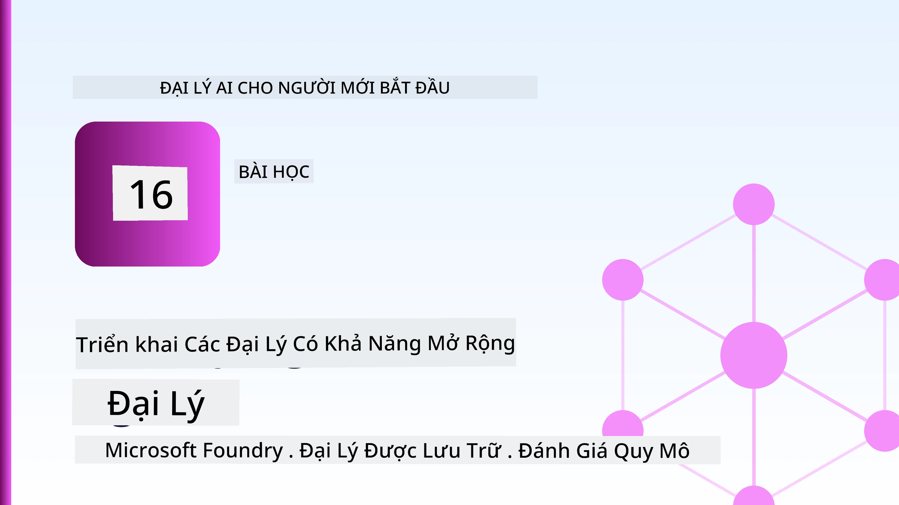
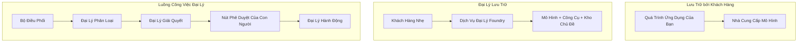
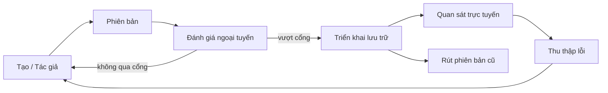
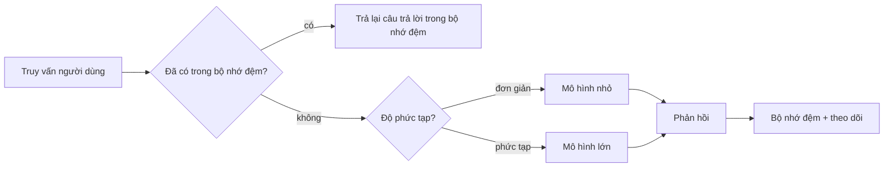
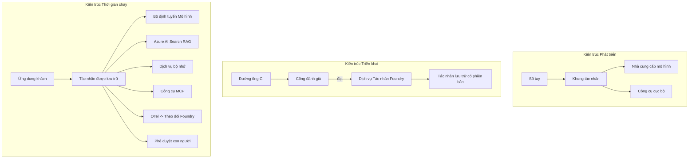

# Triển khai Các Đại lý Có thể Mở rộng với Microsoft Foundry



Cho đến thời điểm này trong khóa học, bạn đã xây dựng các đại lý chạy trên máy tính xách tay của bạn, trong một sổ tay, được điều khiển bởi `az login` và một vài biến môi trường. Đó chính là cách học đúng đắn. Nhưng đó không phải là cách đúng để vận hành một đại lý mà hàng nghìn khách hàng phụ thuộc vào lúc 3 giờ sáng.

Bài học này nói về khoảng cách giữa "nó hoạt động trên máy của tôi" và "nó hoạt động, một cách đáng tin cậy và chi phí hợp lý, trong sản xuất." Chúng ta sẽ thu hẹp khoảng cách đó bằng cách sử dụng **Microsoft Foundry** và **Dịch vụ Đại lý Microsoft Foundry**, và chúng ta làm điều đó bằng cách xây dựng một đại lý hỗ trợ khách hàng thực sự có công cụ, truy xuất, bộ nhớ, đánh giá và giám sát.

## Giới thiệu

Bài học này sẽ bao gồm:

- Sự khác biệt giữa một **đại lý nguyên mẫu** và một **đại lý đã triển khai**, và tại sao sự chuyển đổi chủ yếu là về mọi thứ *xung quanh* mô hình.
- **Mẫu triển khai** cho các đại lý: lưu trữ trên máy khách, lưu trữ dưới dạng dịch vụ (Đại lý Hosted), và phối hợp quy trình công việc.
- **Vòng đời đại lý** trên Microsoft Foundry — tạo, phiên bản, triển khai, đánh giá, quan sát, nghỉ hưu.
- **Chiến lược mở rộng**: định tuyến mô hình, bộ nhớ đệm, tính đồng thời, và thiết kế không trạng thái.
- **Khả năng quan sát** với OpenTelemetry và ghi dấu Foundry.
- **Tối ưu hóa chi phí** thông qua lựa chọn mô hình, định tuyến và cổng đánh giá.
- **Các cân nhắc doanh nghiệp**: quản trị, phê duyệt con người, và vận hành các máy chủ MCP một cách an toàn trong sản xuất.

## Mục tiêu học tập

Sau khi hoàn thành bài học này, bạn sẽ biết cách:

- Lựa chọn mẫu triển khai phù hợp cho khối lượng công việc của đại lý.
- Triển khai một đại lý đến Dịch vụ Đại lý Microsoft Foundry để nó được phiên bản hóa, quản trị và quan sát được.
- Đo lường một đại lý để ghi dấu và kết nối một quy trình đánh giá chạy trước mỗi lần phát hành.
- Áp dụng định tuyến và bộ nhớ đệm mô hình để giữ độ trễ và chi phí dưới sự kiểm soát khi mở rộng.
- Thêm cổng phê duyệt con người cho các hành động rủi ro cao và tích hợp máy chủ MCP một cách an toàn trong sản xuất.

## Điều kiện tiên quyết

Bài học này giả định bạn đã hoàn thành các bài học trước đó và thành thạo:

- Xây dựng đại lý với [Microsoft Agent Framework](../14-microsoft-agent-framework/README.md) (Bài học 14).
- [Sử dụng công cụ](../04-tool-use/README.md) (Bài học 4) và [Agentic RAG](../05-agentic-rag/README.md) (Bài học 5).
- [Bộ nhớ đại lý](../13-agent-memory/README.md) (Bài học 13) và [Giao thức Agentic / MCP](../11-agentic-protocols/README.md) (Bài học 11).
- [Quan sát và Đánh giá](../10-ai-agents-production/README.md) (Bài học 10) — bài học này xây dựng trực tiếp trên đó.

Bạn cũng sẽ cần:

- Một **đăng ký Azure** và một **dự án Microsoft Foundry** với ít nhất một mô hình chat đã triển khai.
- Azure CLI đã xác thực (`az login`).
- Python 3.12+ và các gói trong kho lưu trữ [`requirements.txt`](../../../requirements.txt).

## Từ Nguyên mẫu đến Sản xuất: Điều gì Thực sự Thay đổi

Một đại lý nguyên mẫu và một đại lý sản xuất chia sẻ cùng một vòng lõi — lập luận, gọi công cụ, phản hồi. Những gì thay đổi là mọi thứ xung quanh vòng đó. Mô hình chiếm khoảng 20% đại lý sản xuất; 80% còn lại là bộ khung vận hành.

| Mối quan tâm | Nguyên mẫu | Sản xuất |
| --- | --- | --- |
| **Lưu trữ** | Chạy trong sổ tay của bạn | Chạy dưới dạng dịch vụ lưu trữ, có phiên bản và triển khai |
| **Danh tính** | Token `az login` của bạn | Danh tính được quản lý với RBAC có phạm vi |
| **Trạng thái** | Trong bộ nhớ, mất khi khởi động lại | Ngoại vi hóa (cửa hàng luồng, dịch vụ bộ nhớ) |
| **Thất bại** | Bạn thấy kết quả lỗi | Thử lại, dự phòng, hộp thư chết, cảnh báo |
| **Chi phí** | "Chỉ vài xu" | Theo dõi theo yêu cầu, định tuyến, bộ nhớ đệm, ngân sách |
| **Chất lượng** | Bạn xem xét đầu ra | Đánh giá tự động trước mỗi lần phát hành |
| **Tin cậy** | Bạn phê duyệt mọi hành động | Chính sách + con người tham gia cho các hành động rủi ro |

Hãy nhớ bảng này. Mỗi phần dưới đây tương ứng với một hàng trong bảng.

## Mẫu Triển khai Đại lý

Có ba mẫu bạn sẽ sử dụng, thường kết hợp với nhau.

### 1. Đại lý lưu trữ trên máy khách

Đối tượng đại lý sống bên trong *quá trình ứng dụng* của bạn. Mã của bạn gọi trực tiếp nhà cung cấp mô hình; vòng lập luận chạy trong dịch vụ của bạn. Đây là những gì mọi bài học trước đã làm.

- **Sử dụng khi** bạn cần kiểm soát toàn bộ vòng lặp, phần mềm trung gian tùy chỉnh, hoặc bạn nhúng đại lý vào backend hiện có.
- **Nhược điểm**: bạn phải tự quản lý mở rộng, trạng thái, và khả năng phục hồi.

### 2. Đại lý lưu trữ dưới dạng dịch vụ (Foundry Agent Service)

Đại lý được *đăng ký như một tài nguyên* trong Microsoft Foundry. Foundry lưu trữ vòng lý luận, lưu trữ luồng, thực thi an toàn nội dung và RBAC, và làm cho đại lý hiển thị trong cổng Foundry. Ứng dụng của bạn trở thành một trình khách mỏng tạo luồng và đọc phản hồi.

- **Sử dụng khi** bạn muốn sự bền bỉ, khả năng quan sát tích hợp sẵn, quản trị và giảm bớt bề mặt vận hành.
- **Nhược điểm**: ít quyền kiểm soát cấp thấp đổi lấy môi trường chạy được quản lý.

### 3. Quy trình công việc của đại lý

Nhiều đại lý (và công cụ) được kết hợp thành một đồ thị với luồng điều khiển rõ ràng — bước tuần tự, phân nhánh, nút phê duyệt con người, và các điểm kiểm soát bền bỉ có thể tạm dừng và tiếp tục. Đây là khả năng Quy trình công việc của Microsoft Agent Framework áp dụng ở quy mô triển khai.

- **Sử dụng khi** một tác vụ đơn lẻ trải dài trên nhiều đại lý chuyên biệt hoặc cần bước phê duyệt ở giữa.
- **Nhược điểm**: nhiều thành phần di chuyển hơn; cần quan sát ở cấp điều phối.



## Vòng đời Đại lý trên Microsoft Foundry

Triển khai một đại lý không phải là một lần `đẩy` duy nhất. Nó là một vòng lặp, và nó rất giống chu trình phát hành phần mềm vì thực sự nó là như vậy.



Ý tưởng chính, kế thừa từ [Bài học 10](../10-ai-agents-production/README.md): **đánh giá ngoại tuyến là một cổng, không phải là điều nghĩ sau.** Một phiên bản đại lý mới không được phát hành trừ khi nó vượt qua ngưỡng đánh giá của bạn. Quan sát trực tuyến sau đó đưa các lỗi thực tế trở lại bộ kiểm tra ngoại tuyến của bạn. Đó là toàn bộ vòng lặp.

## Chiến lược mở rộng

Mở rộng một đại lý khác với mở rộng một API web không trạng thái, bởi vì mỗi yêu cầu có thể kích hoạt nhiều cuộc gọi mô hình và công cụ tốn kém. Bốn kỹ thuật mang phần lớn gánh nặng.

**Xử lý yêu cầu không trạng thái.** Không giữ trạng thái từng người dùng trong bộ nhớ quá trình. Lưu giữ các luồng hội thoại trong cửa hàng luồng Foundry hoặc dịch vụ bộ nhớ để bất kỳ phiên bản nào cũng có thể xử lý yêu cầu nào. Đây là điều giúp bạn mở rộng theo chiều ngang — thêm phiên bản, không cần phiên làm việc cố định.

**Định tuyến mô hình.** Không phải mọi yêu cầu đều cần mô hình có khả năng mạnh nhất (và tốn kém nhất). Định tuyến các yêu cầu đơn giản — phân loại ý định, trả lời ngắn gọn — tới một mô hình nhỏ, nhanh, và dành mô hình lớn cho việc lập luận thực sự. **Bộ định tuyến mô hình** của Foundry có thể làm điều này cho bạn, hoặc bạn có thể tự xây dựng bộ phân loại nhẹ. Bạn sẽ tự xây dựng phiên bản DIY trong phòng lab.

**Bộ nhớ đệm phản hồi.** Nhiều truy vấn hỗ trợ gần như trùng lặp ("làm thế nào để tôi đặt lại mật khẩu?"). Bộ nhớ đệm câu trả lời cho các câu hỏi thường gặp và phục vụ chúng mà không cần gọi mô hình. Ngay cả tỷ lệ trúng bộ nhớ đệm khiêm tốn cũng cắt giảm đáng kể chi phí và độ trễ.

**Tính đồng thời và áp lực ngược.** Nhà cung cấp mô hình có giới hạn tốc độ. Giới hạn tính đồng thời của bạn, sử dụng thử lại với kỹ thuật lùi thời gian mũ, và thất bại một cách nhẹ nhàng (một phản hồi xếp hàng "chúng tôi đang xử lý" tốt hơn lỗi 500).



## Khả năng quan sát trong sản xuất

Bạn không thể vận hành những gì bạn không thể thấy. Như đã đề cập trong Bài học 10, Microsoft Agent Framework phát ra các dấu hiệu **OpenTelemetry** gốc — mỗi cuộc gọi mô hình, lời gọi công cụ, và bước điều phối trở thành một khoảng theo dõi. Trong sản xuất, bạn xuất các khoảng này tới Microsoft Foundry (hoặc bất kỳ backend nào tương thích OTel) để bạn có thể:

- Theo dõi một khiếu nại khách hàng từ đầu đến cuối qua mọi cuộc gọi mô hình và công cụ.
- Theo dõi độ trễ p50/p95 và chi phí mỗi yêu cầu theo thời gian.
- Cảnh báo khi có spike lỗi và bất thường chi phí trước khi người dùng (hoặc nhóm tài chính của bạn) nhận ra.

```python
from agent_framework.observability import get_tracer

tracer = get_tracer()

with tracer.start_as_current_span("support_request") as span:
    span.set_attribute("customer.tier", "enterprise")
    span.set_attribute("routed.model", "gpt-5-nano")
    # việc thực thi tác nhân được theo dõi tự động bên trong phạm vi này
```

Các thuộc tính như `customer.tier` và `routed.model` là những gì biến một bức tường các dấu hiệu thành các câu hỏi có thể trả lời ("khách hàng doanh nghiệp có bị định tuyến quá thường xuyên đến mô hình nhỏ không?").

## Tối ưu hóa Chi phí

Chi phí ở các đại lý sản xuất bị chi phối bởi token. Ba đòn bẩy, theo thứ tự tác động:

1. **Lựa chọn kích cỡ mô hình phù hợp.** Một mô hình nhỏ vượt qua cổng đánh giá của bạn hầu như luôn rẻ hơn một mô hình lớn cũng vượt qua được. Dùng đánh giá để *chứng minh* mô hình nhỏ đủ tốt thay vì mặc định chọn mô hình lớn nhất để an toàn.
2. **Định tuyến theo độ phức tạp.** Như trên — chỉ trả giá mô hình lớn cho các yêu cầu cần lập luận mô hình lớn.
3. **Bộ nhớ đệm tích cực.** Cuộc gọi mô hình rẻ nhất là cuộc gọi bạn không bao giờ thực hiện.

Cổng đánh giá và kiểm soát chi phí là cùng một kỷ luật nhìn từ hai góc độ: đánh giá cho bạn *sàn chất lượng*, định tuyến và bộ nhớ đệm giữ bạn càng gần *chi phí* của sàn đó càng tốt.

## Cân nhắc Triển khai Doanh nghiệp

**Quản trị.** Đại lý lưu trữ kế thừa RBAC, an toàn nội dung và ghi nhật ký kiểm tra của Foundry. Cấp cho mỗi đại lý một danh tính được quản lý với quyền ít nhất cần thiết — quyền chỉ đọc tới cơ sở tri thức, quyền phạm vi API quản lý vé, không hơn.

**Con người tham gia quy trình.** Một số hành động quá hệ trọng để tự động hoàn toàn — trả lại tiền, xóa tài khoản, chuyển lên nhóm pháp lý. Microsoft Agent Framework hỗ trợ công cụ **yêu cầu phê duyệt**: đại lý đề xuất hành động, thực thi tạm dừng, con người phê duyệt hay từ chối, và quy trình tiếp tục. Bạn đã thấy nguyên thủy này trong [Bài học 6](../06-building-trustworthy-agents/README.md); giờ đây bạn triển khai nó.

**MCP trong sản xuất.** [MCP](../11-agentic-protocols/README.md) cho phép đại lý của bạn sử dụng công cụ bên ngoài qua giao diện chuẩn. Trong sản xuất, xem mỗi máy chủ MCP như một ranh giới không đáng tin cậy: gắn phiên bản máy chủ, chạy với danh tính có phạm vi, kiểm tra đầu ra của nó, và không bao giờ tiết lộ bí mật cho nó. Máy chủ MCP là một phụ thuộc, và các phụ thuộc được cập nhật, kiểm toán và giới hạn tốc độ.



Ba sơ đồ đó — phát triển, triển khai, thời gian chạy — là cùng một đại lý ở ba giai đoạn của cuộc đời nó. Phòng lab tiếp theo sẽ hướng dẫn bạn xây dựng nó.

## Phòng Lab Thực hành: Đại lý Hỗ trợ Khách hàng Sẵn sàng Sản xuất

Mở [`code_samples/16-python-agent-framework.ipynb`](./code_samples/16-python-agent-framework.ipynb) và làm theo từng bước. Bạn sẽ lắp ráp một **đại lý hỗ trợ khách hàng Contoso** với mọi mối quan tâm sản xuất được tích hợp:

1. **Gọi công cụ** — tra cứu trạng thái đơn hàng và mở vé hỗ trợ.
2. **RAG** — trả lời câu hỏi về chính sách từ cơ sở tri thức (Azure AI Search, với fallback trong bộ nhớ để sổ tay chạy mà không cần tài nguyên Search).
3. **Bộ nhớ** — nhớ khách hàng qua các lượt hội thoại.
4. **Định tuyến mô hình** — bộ phân loại độ phức tạp định tuyến mỗi yêu cầu tới mô hình nhỏ hoặc lớn.
5. **Bộ nhớ đệm phản hồi** — các câu hỏi lặp lại được phục vụ từ bộ nhớ đệm.
6. **Phê duyệt con người** — hoàn tiền trên ngưỡng tạm dừng chờ phê duyệt của con người.
7. **Quy trình đánh giá** — một bộ kiểm tra ngoại tuyến nhỏ chấm điểm đại lý và làm cổng phát hành.
8. **Khả năng quan sát** — ghi dấu OpenTelemetry quanh mỗi yêu cầu.

### Hướng dẫn

Sổ tay được tổ chức sao cho mỗi mối quan tâm sản xuất là một phần riêng biệt có thể chạy được. Trái tim của nó là trình xử lý yêu cầu kết hợp định tuyến và bộ nhớ đệm:

```python
async def handle_support_request(query: str, customer_id: str) -> str:
    # 1. Phục vụ từ bộ nhớ đệm khi có thể.
    cached = response_cache.get(normalize(query))
    if cached:
        return cached

    # 2. Định tuyến theo độ phức tạp để kiểm soát chi phí.
    model = "gpt-5-nano" if is_simple(query) else "gpt-5-mini"

    # 3. Chạy agent bên trong một trace span để dễ dàng quan sát.
    with tracer.start_as_current_span("support_request") as span:
        span.set_attribute("routed.model", model)
        span.set_attribute("customer.id", customer_id)
        response = await support_agent.run(query, model=model)

    # 4. Bộ nhớ đệm và trả về.
    response_cache.set(normalize(query), response.text)
    return response.text
```

Cổng đánh giá bảo vệ một phát hành trông như thế này:

```python
async def evaluation_gate(agent, test_cases, threshold: float = 0.8) -> bool:
    passed = 0
    for case in test_cases:
        result = await agent.run(case["input"])
        if score_response(result.text, case["expected"]) >= 0.8:
            passed += 1
    pass_rate = passed / len(test_cases)
    print(f"Evaluation pass rate: {pass_rate:.0%} (gate: {threshold:.0%})")
    return pass_rate >= threshold  # chỉ triển khai nếu cổng thành công
```

Đọc từng dòng — sổ tay giữ các nguyên thủy này nhỏ có chủ ý để không có gì bị ẩn sau một lệnh gọi khung.

## Xác thực Đại lý đã Triển khai với Kiểm tra Khói

Cổng đánh giá ở trên chạy *ngoại tuyến* trên đối tượng đại lý của bạn. Khi đại lý được triển khai như một Đại lý Hosted, bạn cần thêm một kiểm tra nữa, rẻ hơn: **điểm cuối được triển khai có thực sự trả lời không?**

Triển khai "thành công" chỉ chứng minh mặt điều khiển đã chấp nhận định nghĩa — nó không chứng minh đại lý phản hồi. Thiếu phụ thuộc, định tuyến mô hình sai, hoặc kết nối hết hạn có thể để lại triển khai xanh nhưng không trả lời gì. Một **kiểm tra khói** phát hiện điều đó trong vài giây, trên mỗi lần triển khai, không tốn kém như đánh giá đầy đủ.

Kho lưu trữ này cung cấp một quy trình kiểm tra khói sẵn sàng sử dụng được xây dựng trên GitHub Action [AI Smoke Test](https://github.com/marketplace/actions/ai-smoke-test):

- **Danh mục** — [`tests/lesson-16-smoke-tests.json`](../../../tests/lesson-16-smoke-tests.json) chứa các đề bài và khẳng định cho đại lý hỗ trợ Contoso (câu trả lời chính sách có căn cứ, tra cứu đơn hàng, giữ chủ đề, và duy trì mạch chủ đề đa lượt). Các danh mục cho các đại lý bài học khác nằm bên cạnh — xem [`tests/README.md`](../tests/README.md).
- **Quy trình** — [`.github/workflows/smoke-test.yml`](../../../.github/workflows/smoke-test.yml) đăng nhập với Azure OIDC và POST mỗi đề bài đến điểm cuối Phản hồi của đại lý, thất bại công việc khi có bỏ sót khẳng định.

```yaml
- name: Smoke-test hosted agent
  uses: JFolberth/ai-smoketest@v1
  with:
    project_endpoint: ${{ inputs.project_endpoint }}
    agent_name: ContosoSupportAgent
    tests_file: tests/lesson-16-smoke-tests.json
```


Chạy nó từ tab **Actions** khi agent của bạn đã được triển khai, cung cấp điểm cuối dự án Foundry và tên agent. Danh tính liên kết cần vai trò **Azure AI User** ở phạm vi dự án Foundry. Hãy nghĩ về các lớp như một kim tự tháp: các bài kiểm tra nhanh (có thể truy cập và phản hồi?) chạy ở mỗi lần triển khai, đánh giá ngoại tuyến (đủ tốt để phát hành?) chạy trước khi thăng cấp, và đánh giá trực tuyến (nó hoạt động thế nào trong thực tế?) chạy liên tục.

## Kiểm Tra Kiến Thức

Kiểm tra hiểu biết của bạn trước khi chuyển sang bài tập.

**1. Khoảng bao nhiêu phần của một agent sản xuất là "mô hình," và phần còn lại là gì?**

<details>
<summary>Trả lời</summary>

Mô hình chỉ chiếm thiểu số trong hệ thống — thường được trích dẫn khoảng 20%. Phần còn lại là bộ khung vận hành: lưu trữ và phiên bản, danh tính và RBAC, trạng thái bên ngoài, xử lý lỗi, theo dõi chi phí, đánh giá, và kiểm soát có người tham gia. Chuyển sang sản xuất chủ yếu là xây dựng mọi thứ *xung quanh* vòng suy luận.
</details>

**2. Khi nào bạn chọn Hosted Agent thay vì agent lưu trữ trên client?**

<details>
<summary>Trả lời</summary>

Khi bạn muốn một môi trường chạy được quản lý với độ bền tích hợp sẵn (luồng giữ trạng thái và có thể tiếp tục), quan sát được, an toàn nội dung, và RBAC, và bạn sẵn sàng đánh đổi một phần kiểm soát cấp thấp vòng suy luận để giảm bớt mặt phẳng vận hành. Agent lưu trữ trên client được ưu tiên khi bạn cần kiểm soát hoàn toàn vòng hoặc nhúng agent vào backend hiện có.
</details>

**3. Tại sao một agent có thể mở rộng cần phải không trạng thái trong bộ nhớ quá trình của nó?**

<details>
<summary>Trả lời</summary>

Để bất kỳ phiên bản nào cũng có thể xử lý bất kỳ yêu cầu nào, điều này cho phép mở rộng ngang mà không cần phiên làm việc cố định. Trạng thái cuộc trò chuyện theo người được tách ra lưu bên ngoài vào cửa hàng luồng hoặc dịch vụ bộ nhớ. Nếu trạng thái nằm trong bộ nhớ quá trình, bạn sẽ mất nó khi khởi động lại và không thể phân phối tải tự do.
</details>

**4. Vấn đề nào mà định tuyến mô hình giải quyết, và nó liên quan đến đánh giá như thế nào?**

<details>
<summary>Trả lời</summary>

Định tuyến gửi các yêu cầu đơn giản đến một mô hình nhỏ, rẻ, nhanh và dành riêng mô hình lớn cho các suy luận thực thụ, kiểm soát cả độ trễ và chi phí. Nó liên quan đến đánh giá vì đánh giá là thứ *chứng minh* mô hình nhỏ đủ tốt cho một loại yêu cầu — định tuyến mà không đánh giá chỉ là phỏng đoán.
</details>

**5. "Cổng đánh giá" là gì và nó nằm ở đâu trong vòng đời?**

<details>
<summary>Trả lời</summary>

Cổng đánh giá chạy bộ kiểm thử ngoại tuyến đối với phiên bản agent mới và chặn triển khai trừ khi tỷ lệ vượt qua đạt ngưỡng. Nó nằm giữa "phiên bản" và "triển khai" trong vòng đời, biến chất lượng thành điều kiện tiên quyết để phát hành thay vì thứ bạn kiểm tra sau khi phát hành.
</details>

**6. Tại sao một máy chủ MCP nên được coi là ranh giới không đáng tin cậy trong sản xuất?**

<details>
<summary>Trả lời</summary>

Vì nó là một phụ thuộc bên ngoài mà agent của bạn gọi đến. Bạn nên cố định phiên bản của nó, chạy nó với một danh tính có phạm vi, kiểm tra đầu ra, giới hạn tốc độ, và không bao giờ tiết lộ bí mật với nó — kỷ luật này giống như bạn áp dụng với bất kỳ phụ thuộc bên thứ ba nào. Đầu ra của nó chảy vào quá trình suy luận của agent, nên tin tưởng không được kiểm tra là rủi ro an ninh.
</details>

**7. Thay đổi đơn lẻ nào thường có tác động lớn nhất đến chi phí agent sản xuất, và tại sao?**

<details>
<summary>Trả lời</summary>

Điều chỉnh kích thước mô hình — sử dụng mô hình nhỏ nhất vẫn vượt qua cổng đánh giá. Chi phí do token chi phối, và mô hình nhỏ hơn mà đạt chuẩn chất lượng thường rẻ hơn rất nhiều so với mô hình lớn hơn. Bộ nhớ đệm và định tuyến sau đó giảm chi phí hơn nữa, nhưng chọn mô hình cơ sở phù hợp có ảnh hưởng lớn nhất ngay từ đầu.
</details>

**8. Thuộc tính span như `customer.tier` và `routed.model` đóng vai trò gì trong khả năng quan sát?**

<details>
<summary>Trả lời</summary>

Chúng biến các đường dấu thô thành các câu hỏi kinh doanh có thể trả lời. Không có thuộc tính bạn sẽ có một bức tường các span; có thuộc tính bạn có thể hỏi "khách hàng doanh nghiệp có bị định tuyến quá thường đến mô hình nhỏ không?" hoặc "mô hình nào xử lý các yêu cầu chậm nhất của chúng ta?" Thuộc tính là cách bạn phân đoạn dữ liệu giám sát theo các chiều quan trọng đối với vận hành.
</details>

## Bài Tập

Lấy agent hỗ trợ khách hàng từ lab và tăng cường nó cho một kịch bản cụ thể: **agent hỗ trợ thanh toán đăng ký cho công ty SaaS.**

Bài nộp của bạn nên:

1. **Thay thế các công cụ** bằng những công cụ liên quan đến thanh toán: `get_subscription_status`, `get_invoice`, và `issue_credit` (tín dụng trên $50 cần phê duyệt của con người).
2. **Thêm ba tài liệu RAG** bao gồm chính sách hoàn tiền, chu kỳ thanh toán, và chính sách hủy của công ty.
3. **Mở rộng bộ đánh giá** ít nhất tám trường hợp, trong đó có ít nhất hai trường hợp *cần* kích hoạt đường phê duyệt con người, và xác nhận cổng đánh giá của bạn đúng đắn khi chấp nhận hoặc từ chối.
4. **Thêm một báo cáo chi phí**: sau khi chạy mười truy vấn hỗn hợp qua agent, in ra số lượt dùng mô hình nhỏ, số lượt dùng mô hình lớn, và số lượt phục vụ từ bộ nhớ đệm.

Viết một đoạn ngắn (trong ô markdown) giải thích quy tắc định tuyến mô hình nào bạn chọn và cách bạn sẽ xác thực nó với lưu lượng thực tế. Không có câu trả lời đúng duy nhất — bạn sẽ được đánh giá xem các mối quan tâm sản xuất có được kết nối hợp lý không.

## Tóm Tắt

Trong bài học này bạn đã chuyển một agent từ nguyên mẫu sang sản xuất với Microsoft Foundry:

- Bước nhảy sang sản xuất chủ yếu là về **bộ khung vận hành** xung quanh mô hình — lưu trữ, danh tính, trạng thái, xử lý lỗi, chi phí, chất lượng, và niềm tin.
- Bạn đã học ba **mẫu triển khai** — lưu trữ trên client, Hosted Agents, và Agent Workflows — và khi nào mỗi loại phù hợp.
- Bạn đã đi qua **vòng đời agent**, trong đó **đánh giá ngoại tuyến đóng vai trò cổng phát hành** và tính khả quan trực tuyến đưa lỗi về bộ kiểm thử.
- Bạn đã áp dụng **chiến lược mở rộng** — thiết kế không trạng thái, định tuyến mô hình, bộ nhớ đệm, và giới hạn đồng thời — và kết nối chúng với **tối ưu hóa chi phí**.
- Bạn đã tích hợp **kiểm soát doanh nghiệp**: RBAC, phê duyệt có người tham gia, và tích hợp MCP an toàn sản xuất.
- Bạn đã xây một **agent hỗ trợ khách hàng sẵn sàng sản xuất** gắn kết tất cả các mối quan tâm này lại trong code có thể chạy được.

Bài học tiếp theo đi theo hướng ngược lại: thay vì mở rộng agents lên mây, bạn sẽ đem chúng *xuống* máy của một lập trình viên và chạy hoàn toàn cục bộ.

## Tài Nguyên Bổ Sung

- <a href="https://learn.microsoft.com/azure/ai-foundry/what-is-azure-ai-foundry" target="_blank">Tài liệu Microsoft Foundry</a>
- <a href="https://learn.microsoft.com/azure/ai-foundry/agents/overview" target="_blank">Tổng quan Dịch vụ Agent Microsoft Foundry</a>
- <a href="https://aka.ms/ai-agents-beginners/agent-framework" target="_blank">Microsoft Agent Framework</a>
- <a href="https://learn.microsoft.com/azure/ai-foundry/concepts/model-router" target="_blank">Bộ định tuyến mô hình trong Microsoft Foundry</a>
- <a href="https://learn.microsoft.com/azure/search/search-what-is-azure-search" target="_blank">Azure AI Search</a>
- <a href="https://opentelemetry.io/" target="_blank">OpenTelemetry</a>
- <a href="https://github.com/marketplace/actions/ai-smoke-test" target="_blank">AI Smoke Test GitHub Action</a>
- <a href="https://modelcontextprotocol.io/" target="_blank">Model Context Protocol (MCP)</a>

## Bài Học Trước

[Xây dựng Agents Sử dụng Máy tính (CUA)](../15-browser-use/README.md)

## Bài Học Tiếp Theo

[Tạo Agents AI Cục Bộ](../17-creating-local-ai-agents/README.md)

---

<!-- CO-OP TRANSLATOR DISCLAIMER START -->
**Tuyên bố miễn trừ trách nhiệm**:
Tài liệu này đã được dịch bằng dịch vụ dịch thuật AI [Co-op Translator](https://github.com/Azure/co-op-translator). Mặc dù chúng tôi cố gắng đảm bảo độ chính xác, xin lưu ý rằng bản dịch tự động có thể chứa lỗi hoặc sai sót. Tài liệu gốc bằng ngôn ngữ gốc nên được coi là nguồn tin chính thức. Đối với thông tin quan trọng, nên sử dụng dịch vụ dịch thuật chuyên nghiệp bởi con người. Chúng tôi không chịu trách nhiệm về bất kỳ hiểu lầm hoặc giải thích sai nào phát sinh từ việc sử dụng bản dịch này.
<!-- CO-OP TRANSLATOR DISCLAIMER END -->